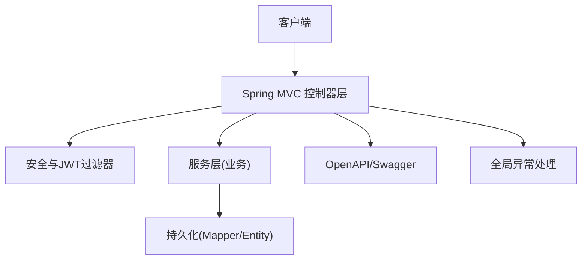
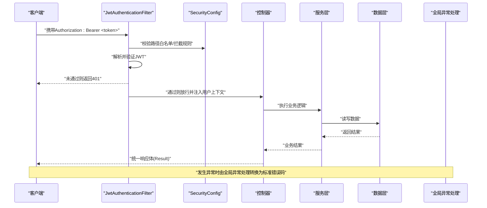
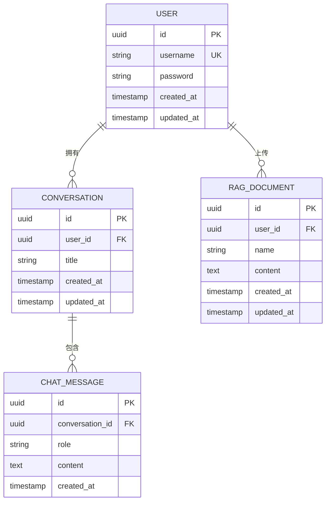
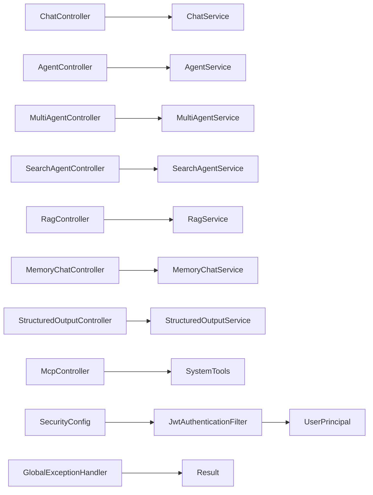

# API接口文档

<cite>
**本文引用的文件**   
- [AiLearnApplication.java](file://src/main/java/com/ailearn/AiLearnApplication.java)
- [SecurityConfig.java](file://src/main/java/com/ailearn/security/SecurityConfig.java)
- [JwtAuthenticationFilter.java](file://src/main/java/com/ailearn/security/JwtAuthenticationFilter.java)
- [JwtUtil.java](file://src/main/java/com/ailearn/security/JwtUtil.java)
- [UserPrincipal.java](file://src/main/java/com/ailearn/security/UserPrincipal.java)
- [OpenApiConfig.java](file://src/main/java/com/ailearn/config/OpenApiConfig.java)
- [GlobalExceptionHandler.java](file://src/main/java/com/ailearn/common/GlobalExceptionHandler.java)
- [Result.java](file://src/main/java/com/ailearn/common/Result.java)
- [ErrorCode.java](file://src/main/java/com/ailearn/common/ErrorCode.java)
- [BusinessException.java](file://src/main/java/com/ailearn/common/BusinessException.java)
- [ChatController.java](file://src/main/java/com/ailearn/chat/ChatController.java)
- [ChatService.java](file://src/main/java/com/ailearn/chat/ChatService.java)
- [AgentController.java](file://src/main/java/com/ailearn/agent/AgentController.java)
- [AgentService.java](file://src/main/java/com/ailearn/agent/AgentService.java)
- [MultiAgentController.java](file://src/main/java/com/ailearn/agent/MultiAgentController.java)
- [MultiAgentService.java](file://src/main/java/com/ailearn/agent/MultiAgentService.java)
- [SearchAgentController.java](file://src/main/java/com/ailearn/agent/SearchAgentController.java)
- [SearchAgentService.java](file://src/main/java/com/ailearn/agent/SearchAgentService.java)
- [RagController.java](file://src/main/java/com/ailearn/rag/RagController.java)
- [RagService.java](file://src/main/java/com/ailearn/rag/RagService.java)
- [MemoryChatController.java](file://src/main/java/com/ailearn/memory/MemoryChatController.java)
- [MemoryChatService.java](file://src/main/java/com/ailearn/memory/MemoryChatService.java)
- [StructuredOutputController.java](file://src/main/java/com/ailearn/structured/StructuredOutputController.java)
- [StructuredOutputService.java](file://src/main/java/com/ailearn/structured/StructuredOutputService.java)
- [McpController.java](file://src/main/java/com/ailearn/mcp/McpController.java)
- [SystemTools.java](file://src/main/java/com/ailearn/mcp/SystemTools.java)
- [ToolsController.java](file://src/main/java/com/ailearn/tools/ToolsController.java)
- [CalculatorTool.java](file://src/main/java/com/ailearn/tools/CalculatorTool.java)
- [WeatherTool.java](file://src/main/java/com/ailearn/tools/WeatherTool.java)
- [WebSearchTool.java](file://src/main/java/com/ailearn/tools/WebSearchTool.java)
- [UserService.java](file://src/main/java/com/ailearn/service/UserService.java)
- [ConversationService.java](file://src/main/java/com/ailearn/service/ConversationService.java)
- [ChatRequest.java](file://src/main/java/com/ailearn/dto/ChatRequest.java)
- [AgentChatRequest.java](file://src/main/java/com/ailearn/dto/AgentChatRequest.java)
- [MemoryChatRequest.java](file://src/main/java/com/ailearn/dto/MemoryChatRequest.java)
- [RagChatRequest.java](file://src/main/java/com/ailearn/dto/RagChatRequest.java)
- [LoginRequest.java](file://src/main/java/com/ailearn/dto/LoginRequest.java)
- [RegisterRequest.java](file://src/main/java/com/ailearn/dto/RegisterRequest.java)
- [RefreshTokenRequest.java](file://src/main/java/com/ailearn/dto/RefreshTokenRequest.java)
- [StructuredRequest.java](file://src/main/java/com/ailearn/dto/StructuredRequest.java)
- [User.java](file://src/main/java/com/ailearn/entity/User.java)
- [Conversation.java](file://src/main/java/com/ailearn/entity/Conversation.java)
- [ChatMessage.java](file://src/main/java/com/ailearn/entity/ChatMessage.java)
- [RagDocument.java](file://src/main/java/com/ailearn/entity/RagDocument.java)
- [application.yml](file://src/main/resources/application.yml)
</cite>

## 目录
1. [简介](#简介)
2. [项目结构](#项目结构)
3. [核心组件](#核心组件)
4. [架构总览](#架构总览)
5. [详细组件分析](#详细组件分析)
6. [依赖关系分析](#依赖关系分析)
7. [性能考虑](#性能考虑)
8. [故障排查指南](#故障排查指南)
9. [结论](#结论)
10. [附录](#附录)

## 简介
本文件为 Java AI 学习平台的 RESTful API 接口规范与使用指南，覆盖以下能力：
- 基础聊天、智能代理（单/多）、搜索代理
- RAG 检索增强生成
- 结构化输出
- MCP 工具调用与系统工具
- JWT 认证与权限控制
- OpenAPI/Swagger 文档访问与使用
- 版本管理与向后兼容策略
- 测试与调试方法
- 最佳实践与性能优化建议

## 项目结构
后端采用分层架构：控制器层暴露 REST 接口，服务层实现业务逻辑，安全模块提供 JWT 鉴权，配置模块管理 OpenAPI、限流等横切关注点。前端通过 HTTP 客户端调用后端 API。

图表来源
- [AiLearnApplication.java](file://src/main/java/com/ailearn/AiLearnApplication.java)
- [SecurityConfig.java](file://src/main/java/com/ailearn/security/SecurityConfig.java)
- [OpenApiConfig.java](file://src/main/java/com/ailearn/config/OpenApiConfig.java)
- [GlobalExceptionHandler.java](file://src/main/java/com/ailearn/common/GlobalExceptionHandler.java)

章节来源
- [AiLearnApplication.java](file://src/main/java/com/ailearn/AiLearnApplication.java)
- [application.yml](file://src/main/resources/application.yml)

## 核心组件
- 安全与认证
  - 基于 Spring Security + JWT 的无状态认证
  - 自定义过滤器解析请求头中的令牌并注入用户上下文
- 统一响应与错误
  - 统一返回体封装
  - 全局异常处理器将业务异常与系统异常映射为标准错误码与消息
- OpenAPI/Swagger
  - 提供在线文档与交互式测试入口
- 领域控制器与服务
  - 聊天、代理、RAG、记忆、结构化输出、MCP 工具等

章节来源
- [SecurityConfig.java](file://src/main/java/com/ailearn/security/SecurityConfig.java)
- [JwtAuthenticationFilter.java](file://src/main/java/com/ailearn/security/JwtAuthenticationFilter.java)
- [JwtUtil.java](file://src/main/java/com/ailearn/security/JwtUtil.java)
- [UserPrincipal.java](file://src/main/java/com/ailearn/security/UserPrincipal.java)
- [OpenApiConfig.java](file://src/main/java/com/ailearn/config/OpenApiConfig.java)
- [GlobalExceptionHandler.java](file://src/main/java/com/ailearn/common/GlobalExceptionHandler.java)
- [Result.java](file://src/main/java/com/ailearn/common/Result.java)
- [ErrorCode.java](file://src/main/java/com/ailearn/common/ErrorCode.java)
- [BusinessException.java](file://src/main/java/com/ailearn/common/BusinessException.java)

## 架构总览
下图展示一次受保护接口的典型调用流程，包括 JWT 校验、用户上下文注入、控制器路由、服务处理与统一响应。

图表来源
- [JwtAuthenticationFilter.java](file://src/main/java/com/ailearn/security/JwtAuthenticationFilter.java)
- [SecurityConfig.java](file://src/main/java/com/ailearn/security/SecurityConfig.java)
- [GlobalExceptionHandler.java](file://src/main/java/com/ailearn/common/GlobalExceptionHandler.java)

## 详细组件分析

### 通用约定
- 基础路径
  - 所有接口均以 /api/v1 为前缀（示例中省略）
- 认证方式
  - 在请求头添加 Authorization: Bearer <JWT令牌>
- 统一响应体
  - 字段包含：code、message、data
- 统一错误码
  - 见 ErrorCode 定义；业务异常抛出 BusinessException 会被全局异常处理器捕获并转换为标准响应

章节来源
- [Result.java](file://src/main/java/com/ailearn/common/Result.java)
- [ErrorCode.java](file://src/main/java/com/ailearn/common/ErrorCode.java)
- [BusinessException.java](file://src/main/java/com/ailearn/common/BusinessException.java)
- [GlobalExceptionHandler.java](file://src/main/java/com/ailearn/common/GlobalExceptionHandler.java)

### 认证与授权
- 注册
  - 方法：POST
  - 路径：/api/v1/auth/register
  - 请求体：RegisterRequest
  - 响应：Result<User>
- 登录
  - 方法：POST
  - 路径：/api/v1/auth/login
  - 请求体：LoginRequest
  - 响应：Result<{accessToken, refreshToken}>
- 刷新令牌
  - 方法：POST
  - 路径：/api/v1/auth/refresh
  - 请求体：RefreshTokenRequest
  - 响应：Result<{accessToken, refreshToken}>
- 权限控制
  - 未认证访问受保护接口返回 401
  - 越权访问返回 403
  - 具体路径白名单与拦截规则由安全配置管理

章节来源
- [LoginRequest.java](file://src/main/java/com/ailearn/dto/LoginRequest.java)
- [RegisterRequest.java](file://src/main/java/com/ailearn/dto/RegisterRequest.java)
- [RefreshTokenRequest.java](file://src/main/java/com/ailearn/dto/RefreshTokenRequest.java)
- [SecurityConfig.java](file://src/main/java/com/ailearn/security/SecurityConfig.java)
- [JwtAuthenticationFilter.java](file://src/main/java/com/ailearn/security/JwtAuthenticationFilter.java)
- [JwtUtil.java](file://src/main/java/com/ailearn/security/JwtUtil.java)
- [UserPrincipal.java](file://src/main/java/com/ailearn/security/UserPrincipal.java)
- [UserService.java](file://src/main/java/com/ailearn/service/UserService.java)

### 基础聊天
- 发送消息
  - 方法：POST
  - 路径：/api/v1/chat/send
  - 请求体：ChatRequest
  - 响应：Result<{conversationId, message}>
- 获取会话历史
  - 方法：GET
  - 路径：/api/v1/chat/history/{conversationId}
  - 响应：Result<List<ChatMessage>>
- 删除会话
  - 方法：DELETE
  - 路径：/api/v1/chat/conversation/{conversationId}
  - 响应：Result<Void>

章节来源
- [ChatController.java](file://src/main/java/com/ailearn/chat/ChatController.java)
- [ChatService.java](file://src/main/java/com/ailearn/chat/ChatService.java)
- [ChatRequest.java](file://src/main/java/com/ailearn/dto/ChatRequest.java)
- [ConversationService.java](file://src/main/java/com/ailearn/service/ConversationService.java)
- [Conversation.java](file://src/main/java/com/ailearn/entity/Conversation.java)
- [ChatMessage.java](file://src/main/java/com/ailearn/entity/ChatMessage.java)

### 智能代理（单/多/搜索）
- 单代理对话
  - 方法：POST
  - 路径：/api/v1/agent/chat
  - 请求体：AgentChatRequest
  - 响应：Result<{conversationId, message}>
- 多代理协作
  - 方法：POST
  - 路径：/api/v1/agent/multi
  - 请求体：AgentChatRequest
  - 响应：Result<{conversationId, message}>
- 搜索代理
  - 方法：POST
  - 路径：/api/v1/agent/search
  - 请求体：AgentChatRequest
  - 响应：Result<{conversationId, message}>

章节来源
- [AgentController.java](file://src/main/java/com/ailearn/agent/AgentController.java)
- [AgentService.java](file://src/main/java/com/ailearn/agent/AgentService.java)
- [MultiAgentController.java](file://src/main/java/com/ailearn/agent/MultiAgentController.java)
- [MultiAgentService.java](file://src/main/java/com/ailearn/agent/MultiAgentService.java)
- [SearchAgentController.java](file://src/main/java/com/ailearn/agent/SearchAgentController.java)
- [SearchAgentService.java](file://src/main/java/com/ailearn/agent/SearchAgentService.java)
- [AgentChatRequest.java](file://src/main/java/com/ailearn/dto/AgentChatRequest.java)

### RAG 检索增强生成
- 上传文档
  - 方法：POST
  - 路径：/api/v1/rag/document/upload
  - 请求体：multipart/form-data 或 JSON（依据实现）
  - 响应：Result<RagDocument>
- 索引文档
  - 方法：POST
  - 路径：/api/v1/rag/document/index/{documentId}
  - 响应：Result<Void>
- RAG 问答
  - 方法：POST
  - 路径：/api/v1/rag/query
  - 请求体：RagChatRequest
  - 响应：Result<{answer, sources}>
- 列出文档
  - 方法：GET
  - 路径：/api/v1/rag/documents
  - 响应：Result<List<RagDocument>>

章节来源
- [RagController.java](file://src/main/java/com/ailearn/rag/RagController.java)
- [RagService.java](file://src/main/java/com/ailearn/rag/RagService.java)
- [RagChatRequest.java](file://src/main/java/com/ailearn/dto/RagChatRequest.java)
- [RagDocument.java](file://src/main/java/com/ailearn/entity/RagDocument.java)

### 带记忆的对话
- 记忆对话
  - 方法：POST
  - 路径：/api/v1/memory/chat
  - 请求体：MemoryChatRequest
  - 响应：Result<{conversationId, message}>
- 获取记忆会话历史
  - 方法：GET
  - 路径：/api/v1/memory/history/{conversationId}
  - 响应：Result<List<ChatMessage>>

章节来源
- [MemoryChatController.java](file://src/main/java/com/ailearn/memory/MemoryChatController.java)
- [MemoryChatService.java](file://src/main/java/com/ailearn/memory/MemoryChatService.java)
- [MemoryChatRequest.java](file://src/main/java/com/ailearn/dto/MemoryChatRequest.java)
- [DatabaseChatMemory.java](file://src/main/java/com/ailearn/memory/DatabaseChatMemory.java)

### 结构化输出
- 结构化生成
  - 方法：POST
  - 路径：/api/v1/structured/generate
  - 请求体：StructuredRequest
  - 响应：Result<T>（T 为请求中指定的目标结构）

章节来源
- [StructuredOutputController.java](file://src/main/java/com/ailearn/structured/StructuredOutputController.java)
- [StructuredOutputService.java](file://src/main/java/com/ailearn/structured/StructuredOutputService.java)
- [StructuredRequest.java](file://src/main/java/com/ailearn/dto/StructuredRequest.java)

### MCP 与系统工具
- MCP 工具列表
  - 方法：GET
  - 路径：/api/v1/mcp/tools
  - 响应：Result<List<McpTool>>
- 执行工具
  - 方法：POST
  - 路径：/api/v1/mcp/call
  - 请求体：{toolName, params}
  - 响应：Result<ToolResult>
- 内置系统工具
  - 计算器、天气、网页搜索等可通过 MCP 调用

章节来源
- [McpController.java](file://src/main/java/com/ailearn/mcp/McpController.java)
- [SystemTools.java](file://src/main/java/com/ailearn/mcp/SystemTools.java)
- [ToolsController.java](file://src/main/java/com/ailearn/tools/ToolsController.java)
- [CalculatorTool.java](file://src/main/java/com/ailearn/tools/CalculatorTool.java)
- [WeatherTool.java](file://src/main/java/com/ailearn/tools/WeatherTool.java)
- [WebSearchTool.java](file://src/main/java/com/ailearn/tools/WebSearchTool.java)

### 数据模型（实体）

图表来源
- [User.java](file://src/main/java/com/ailearn/entity/User.java)
- [Conversation.java](file://src/main/java/com/ailearn/entity/Conversation.java)
- [ChatMessage.java](file://src/main/java/com/ailearn/entity/ChatMessage.java)
- [RagDocument.java](file://src/main/java/com/ailearn/entity/RagDocument.java)

## 依赖关系分析
- 控制器到服务：每个 Controller 依赖对应 Service 完成业务编排
- 安全链路：SecurityConfig 定义白名单与拦截规则，JwtAuthenticationFilter 负责令牌解析与用户上下文注入
- 异常链路：业务异常通过 GlobalExceptionHandler 统一转换为 Result 错误响应
- OpenAPI：OpenApiConfig 提供文档元数据，便于自动生成在线文档

图表来源
- [ChatController.java](file://src/main/java/com/ailearn/chat/ChatController.java)
- [ChatService.java](file://src/main/java/com/ailearn/chat/ChatService.java)
- [AgentController.java](file://src/main/java/com/ailearn/agent/AgentController.java)
- [AgentService.java](file://src/main/java/com/ailearn/agent/AgentService.java)
- [MultiAgentController.java](file://src/main/java/com/ailearn/agent/MultiAgentController.java)
- [MultiAgentService.java](file://src/main/java/com/ailearn/agent/MultiAgentService.java)
- [SearchAgentController.java](file://src/main/java/com/ailearn/agent/SearchAgentController.java)
- [SearchAgentService.java](file://src/main/java/com/ailearn/agent/SearchAgentService.java)
- [RagController.java](file://src/main/java/com/ailearn/rag/RagController.java)
- [RagService.java](file://src/main/java/com/ailearn/rag/RagService.java)
- [MemoryChatController.java](file://src/main/java/com/ailearn/memory/MemoryChatController.java)
- [MemoryChatService.java](file://src/main/java/com/ailearn/memory/MemoryChatService.java)
- [StructuredOutputController.java](file://src/main/java/com/ailearn/structured/StructuredOutputController.java)
- [StructuredOutputService.java](file://src/main/java/com/ailearn/structured/StructuredOutputService.java)
- [McpController.java](file://src/main/java/com/ailearn/mcp/McpController.java)
- [SystemTools.java](file://src/main/java/com/ailearn/mcp/SystemTools.java)
- [SecurityConfig.java](file://src/main/java/com/ailearn/security/SecurityConfig.java)
- [JwtAuthenticationFilter.java](file://src/main/java/com/ailearn/security/JwtAuthenticationFilter.java)
- [UserPrincipal.java](file://src/main/java/com/ailearn/security/UserPrincipal.java)
- [GlobalExceptionHandler.java](file://src/main/java/com/ailearn/common/GlobalExceptionHandler.java)
- [Result.java](file://src/main/java/com/ailearn/common/Result.java)

## 性能考虑
- 连接池与数据库
  - 合理设置连接池大小与超时，避免长事务
- 缓存
  - 对热点查询（如文档列表、会话摘要）引入缓存层
- 限流与熔断
  - 结合 RateLimiter 配置对敏感接口进行速率限制
- 异步与流式
  - 对耗时任务采用异步处理或 SSE 流式返回
- 日志与追踪
  - 使用 MDC 记录链路追踪 ID，便于问题定位

[本节为通用指导，不直接分析具体文件]

## 故障排查指南
- 常见错误码
  - 401：未认证或令牌无效
  - 403：权限不足
  - 400：参数校验失败
  - 500：服务器内部错误
- 排查步骤
  - 检查请求是否携带正确的 Authorization 头
  - 确认 JWT 是否过期或签名不一致
  - 查看服务端日志中的 traceId 与堆栈信息
  - 使用 Swagger 进行最小化复现与断点调试

章节来源
- [GlobalExceptionHandler.java](file://src/main/java/com/ailearn/common/GlobalExceptionHandler.java)
- [ErrorCode.java](file://src/main/java/com/ailearn/common/ErrorCode.java)
- [BusinessException.java](file://src/main/java/com/ailearn/common/BusinessException.java)

## 结论
本 API 文档覆盖了平台的核心能力与集成要点。通过统一的响应与错误格式、完善的 JWT 认证、OpenAPI 文档以及清晰的版本策略，开发者可快速接入并稳定扩展。建议在生产环境启用限流、监控与日志追踪，并结合缓存与异步机制提升整体性能。

## 附录

### OpenAPI/Swagger 文档
- 访问地址
  - http://localhost:8080/swagger-ui.html
  - 或 http://localhost:8080/v3/api-docs（JSON 规范）
- 使用方法
  - 在 UI 中进行在线调试
  - 导出 OpenAPI 规范用于代码生成或第三方集成

章节来源
- [OpenApiConfig.java](file://src/main/java/com/ailearn/config/OpenApiConfig.java)

### 版本管理与兼容性策略
- 版本号位于 URL 路径中（/api/v1），便于平滑演进
- 新增字段保持向后兼容，废弃字段保留一段时间并给出迁移指引
- 重大变更通过新路径（/api/v2）发布，旧版本继续维护一定周期

[本节为通用指导，不直接分析具体文件]

### 调用示例（以 curl 为例）
- 登录获取令牌
  - POST /api/v1/auth/login
  - 请求体：{"username":"...","password":"..."}
  - 响应：{"code":0,"message":"成功","data":{"accessToken":"...","refreshToken":"..."}}
- 基础聊天
  - POST /api/v1/chat/send
  - 请求头：Authorization: Bearer <accessToken>
  - 请求体：{"conversationId":"...","content":"你好"}
  - 响应：{"code":0,"message":"成功","data":{"conversationId":"...","message":"..."}}
- RAG 问答
  - POST /api/v1/rag/query
  - 请求体：{"query":"...","topK":3}
  - 响应：{"code":0,"message":"成功","data":{"answer":"...","sources":["..."]}}

[本节为通用示例，不直接分析具体文件]

### 测试与调试
- 单元测试
  - 使用 JUnit 对 Service 与工具类进行测试
- 集成测试
  - 使用 MockMvc 或 TestRestTemplate 对控制器进行端到端测试
- 本地调试
  - 启动应用后通过 Swagger UI 进行交互测试
  - 开启调试日志级别，观察关键链路

章节来源
- [AiLearnApplicationTests.java](file://src/test/java/com/ailearn/AiLearnApplicationTests.java)
- [ChatServiceTest.java](file://src/test/java/com/ailearn/chat/ChatServiceTest.java)
- [GlobalExceptionHandlerTest.java](file://src/test/java/com/ailearn/common/GlobalExceptionHandlerTest.java)
- [JwtUtilTest.java](file://src/test/java/com/ailearn/security/JwtUtilTest.java)