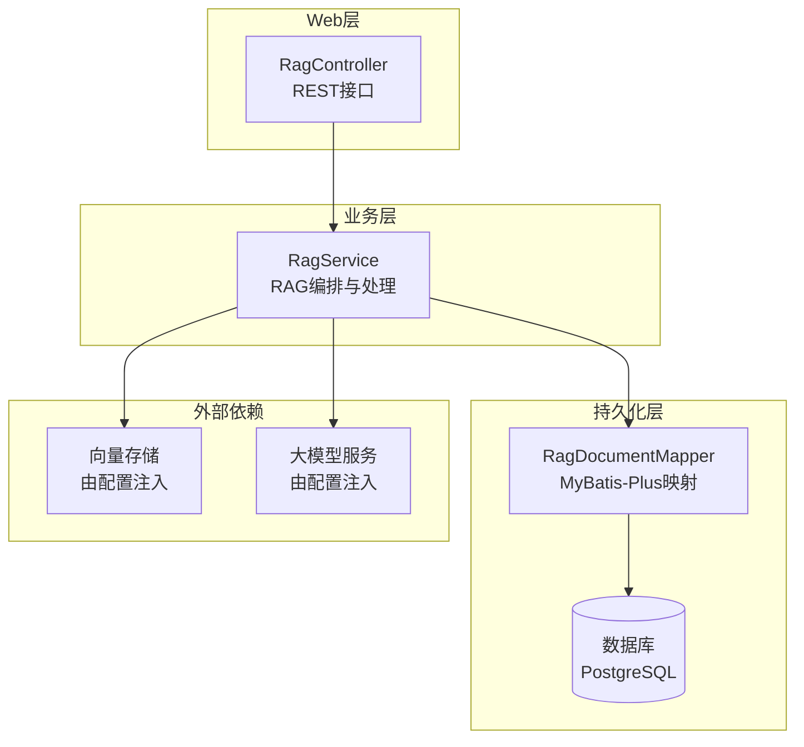
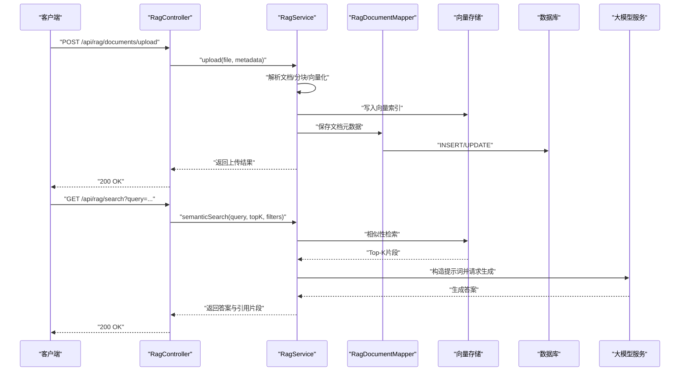
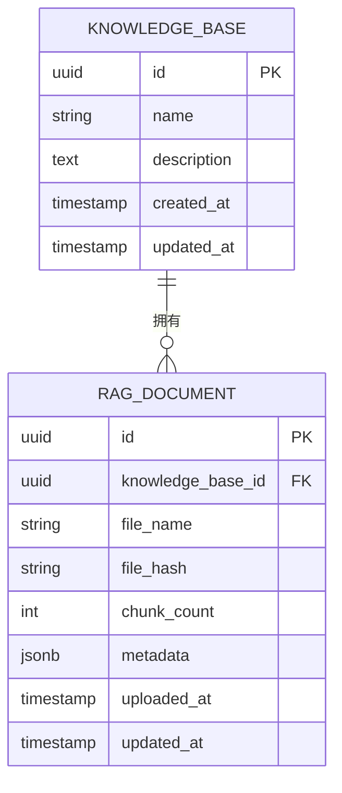
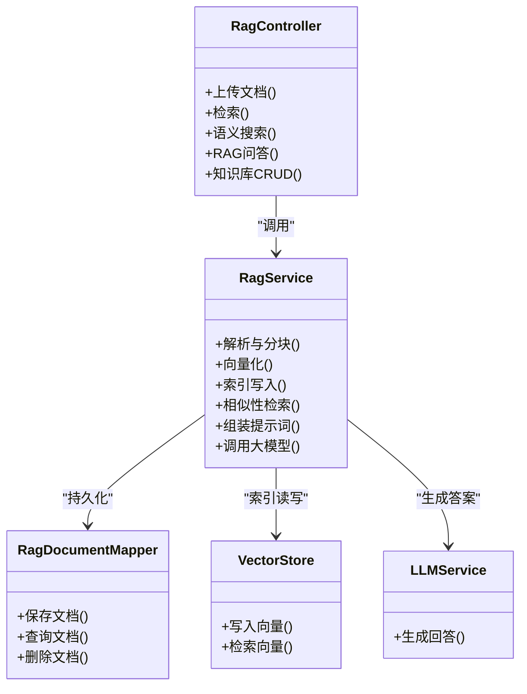
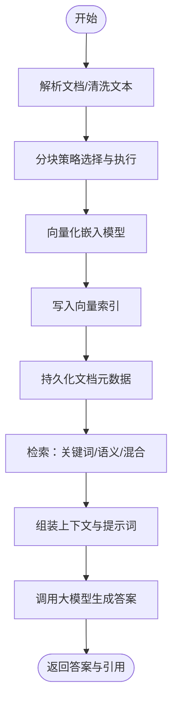

# RAG知识库API

<cite>
**本文引用的文件**   
- [RagController.java](file://src/main/java/com/ailearn/rag/RagController.java)
- [RagService.java](file://src/main/java/com/ailearn/rag/RagService.java)
- [RagDocument.java](file://src/main/java/com/ailearn/entity/RagDocument.java)
- [RagDocumentMapper.java](file://src/main/java/com/ailearn/mapper/RagDocumentMapper.java)
- [schema.sql](file://src/main/resources/schema.sql)
- [application.yml](file://src/main/resources/application.yml)
- [OpenApiConfig.java](file://src/main/java/com/ailearn/config/OpenApiConfig.java)
- [GlobalExceptionHandler.java](file://src/main/java/com/ailearn/common/GlobalExceptionHandler.java)
- [Result.java](file://src/main/java/com/ailearn/common/Result.java)
- [BusinessException.java](file://src/main/java/com/ailearn/common/BusinessException.java)
- [ErrorCode.java](file://src/main/java/com/ailearn/common/ErrorCode.java)
</cite>

## 目录
1. [简介](#简介)
2. [项目结构](#项目结构)
3. [核心组件](#核心组件)
4. [架构总览](#架构总览)
5. [详细组件分析](#详细组件分析)
6. [依赖关系分析](#依赖关系分析)
7. [性能与索引优化](#性能与索引优化)
8. [故障排查指南](#故障排查指南)
9. [结论](#结论)
10. [附录：接口规范与示例](#附录接口规范与示例)

## 简介
本文件面向使用本项目的开发者与集成方，提供RAG（检索增强生成）知识库系统的API接口文档。内容覆盖文档上传、知识检索、语义搜索等接口的功能说明与使用方法；包含文档格式支持、分块策略、向量存储等技术细节；提供知识库管理的CRUD操作规范；阐述检索增强生成的工作流程与参数配置；并提供完整的文件上传与查询示例以及索引构建与优化建议。

## 项目结构
RAG相关能力位于后端Java模块中，主要涉及控制器、服务层、实体与数据访问层，以及数据库脚本与全局配置。前端页面提供RAG交互入口，但本API文档聚焦于后端REST接口与数据处理流程。

图表来源
- [RagController.java](file://src/main/java/com/ailearn/rag/RagController.java)
- [RagService.java](file://src/main/java/com/ailearn/rag/RagService.java)
- [RagDocumentMapper.java](file://src/main/java/com/ailearn/mapper/RagDocumentMapper.java)
- [application.yml](file://src/main/resources/application.yml)

章节来源
- [RagController.java](file://src/main/java/com/ailearn/rag/RagController.java)
- [RagService.java](file://src/main/java/com/ailearn/rag/RagService.java)
- [RagDocumentMapper.java](file://src/main/java/com/ailearn/mapper/RagDocumentMapper.java)
- [application.yml](file://src/main/resources/application.yml)

## 核心组件
- RagController：暴露RAG相关的HTTP接口，包括文档上传、知识库管理（增删改查）、检索与语义搜索、RAG问答等。
- RagService：实现RAG核心逻辑，包括文档解析、文本分块、向量化、索引写入、相似性检索、上下文组装与大模型调用。
- RagDocument：知识库文档实体，用于持久化元数据与索引关联信息。
- RagDocumentMapper：基于MyBatis-Plus的DAO层，负责与数据库交互。
- 配置与异常：OpenApiConfig提供API文档能力；GlobalExceptionHandler统一异常处理；Result为统一响应封装；BusinessException与ErrorCode定义错误码体系。

章节来源
- [RagController.java](file://src/main/java/com/ailearn/rag/RagController.java)
- [RagService.java](file://src/main/java/com/ailearn/rag/RagService.java)
- [RagDocument.java](file://src/main/java/com/ailearn/entity/RagDocument.java)
- [RagDocumentMapper.java](file://src/main/java/com/ailearn/mapper/RagDocumentMapper.java)
- [OpenApiConfig.java](file://src/main/java/com/ailearn/config/OpenApiConfig.java)
- [GlobalExceptionHandler.java](file://src/main/java/com/ailearn/common/GlobalExceptionHandler.java)
- [Result.java](file://src/main/java/com/ailearn/common/Result.java)
- [BusinessException.java](file://src/main/java/com/ailearn/common/BusinessException.java)
- [ErrorCode.java](file://src/main/java/com/ailearn/common/ErrorCode.java)

## 架构总览
RAG系统采用“控制器-服务-数据访问”分层架构，结合外部向量存储与大模型服务完成检索增强生成。整体流程如下：

图表来源
- [RagController.java](file://src/main/java/com/ailearn/rag/RagController.java)
- [RagService.java](file://src/main/java/com/ailearn/rag/RagService.java)
- [RagDocumentMapper.java](file://src/main/java/com/ailearn/mapper/RagDocumentMapper.java)
- [application.yml](file://src/main/resources/application.yml)

## 详细组件分析

### 文档上传接口
- 功能：接收多格式文档，进行解析、清洗、分块、向量化，并将向量写入向量存储，同时持久化文档元数据。
- 输入：
  - 文件：支持常见办公与文本格式（见“文档格式支持”小节）。
  - 可选元数据：如知识库ID、标签、作者、版本等。
- 输出：上传任务ID或成功状态，便于后续进度查询。
- 关键处理：
  - 解析器选择：根据扩展名与MIME类型选择对应解析器。
  - 分块策略：按段落/标题/固定长度切分，保留上下文边界。
  - 向量化：调用嵌入模型生成向量。
  - 索引写入：批量写入向量库，建立倒排或HNSW索引。
  - 元数据持久化：记录文件路径、哈希、分块数量、索引ID等。

章节来源
- [RagController.java](file://src/main/java/com/ailearn/rag/RagController.java)
- [RagService.java](file://src/main/java/com/ailearn/rag/RagService.java)
- [RagDocument.java](file://src/main/java/com/ailearn/entity/RagDocument.java)
- [RagDocumentMapper.java](file://src/main/java/com/ailearn/mapper/RagDocumentMapper.java)

### 知识库管理CRUD接口
- 创建知识库：分配唯一ID、名称、描述、权限范围。
- 更新知识库：修改名称、描述、可见性、标签等。
- 删除知识库：级联删除该知识库下的文档与索引片段。
- 查询知识库：分页列表、条件过滤（名称、标签、时间范围）。
- 获取知识库详情：统计文档数、索引大小、最近更新时间。

章节来源
- [RagController.java](file://src/main/java/com/ailearn/rag/RagController.java)
- [RagService.java](file://src/main/java/com/ailearn/rag/RagService.java)
- [RagDocument.java](file://src/main/java/com/ailearn/entity/RagDocument.java)
- [RagDocumentMapper.java](file://src/main/java/com/ailearn/mapper/RagDocumentMapper.java)

### 知识检索与语义搜索接口
- 关键词检索：基于字段匹配与全文索引，适合精确查找。
- 语义搜索：将查询转为向量，在向量库中进行相似度检索，返回Top-K片段。
- 混合检索：结合关键词与语义权重，提升召回率与准确率。
- 过滤与排序：支持按知识库ID、标签、时间、作者等维度过滤；可自定义排序策略。

章节来源
- [RagController.java](file://src/main/java/com/ailearn/rag/RagController.java)
- [RagService.java](file://src/main/java/com/ailearn/rag/RagService.java)

### RAG问答接口
- 输入：用户问题、可选上下文片段、检索参数（topK、阈值、过滤条件）。
- 处理：
  - 检索：执行语义/混合检索，收集相关片段。
  - 组装：将片段与问题组合成提示词模板。
  - 生成：调用大模型生成答案，附带引用来源。
- 输出：答案文本、引用片段列表、置信度评分、耗时统计。

章节来源
- [RagController.java](file://src/main/java/com/ailearn/rag/RagController.java)
- [RagService.java](file://src/main/java/com/ailearn/rag/RagService.java)

### 数据模型与关系

图表来源
- [RagDocument.java](file://src/main/java/com/ailearn/entity/RagDocument.java)
- [schema.sql](file://src/main/resources/schema.sql)

章节来源
- [RagDocument.java](file://src/main/java/com/ailearn/entity/RagDocument.java)
- [schema.sql](file://src/main/resources/schema.sql)

## 依赖关系分析
- 控制器到服务：RagController依赖RagService完成业务编排。
- 服务到数据访问：RagService通过RagDocumentMapper访问数据库。
- 服务到外部依赖：RagService依赖向量存储与大模型服务，具体实现由配置注入。
- 配置中心：application.yml集中管理外部服务连接、分块策略、检索参数等。

图表来源
- [RagController.java](file://src/main/java/com/ailearn/rag/RagController.java)
- [RagService.java](file://src/main/java/com/ailearn/rag/RagService.java)
- [RagDocumentMapper.java](file://src/main/java/com/ailearn/mapper/RagDocumentMapper.java)
- [application.yml](file://src/main/resources/application.yml)

章节来源
- [RagController.java](file://src/main/java/com/ailearn/rag/RagController.java)
- [RagService.java](file://src/main/java/com/ailearn/rag/RagService.java)
- [RagDocumentMapper.java](file://src/main/java/com/ailearn/mapper/RagDocumentMapper.java)
- [application.yml](file://src/main/resources/application.yml)

## 性能与索引优化
- 分块策略
  - 固定长度分块：适用于纯文本，需设置合适的chunk_size与overlap以保留上下文。
  - 语义分块：依据段落、标题、表格结构进行切分，提高检索相关性。
  - 动态调整：根据文档类型与领域特征自动选择分块策略。
- 向量化与索引
  - 批量写入：合并多次写入请求，减少网络开销。
  - 索引结构：优先使用HNSW或IVF-PQ等近似最近邻算法，平衡召回与延迟。
  - 维度与精度：降低向量维度可提升吞吐，但可能影响召回质量。
- 检索优化
  - 混合检索：关键词+语义加权融合，提升鲁棒性。
  - 缓存热点查询：对高频问题做短期缓存，降低重复计算。
  - 预取与并行：并发检索多个知识库或子集，缩短端到端时延。
- 资源与容量规划
  - 向量库扩容：按文档量与查询QPS评估内存与磁盘。
  - 大模型限流：设置超时与重试策略，避免雪崩。

章节来源
- [application.yml](file://src/main/resources/application.yml)
- [RagService.java](file://src/main/java/com/ailearn/rag/RagService.java)

## 故障排查指南
- 统一响应与异常
  - Result：所有接口返回统一结构，便于前端处理。
  - GlobalExceptionHandler：捕获未处理异常，转换为标准错误响应。
  - BusinessException与ErrorCode：定义业务错误码，便于定位问题。
- 常见问题
  - 上传失败：检查文件格式、大小限制、解析器可用性。
  - 检索无结果：确认索引是否构建完成、向量库连通性、过滤条件是否过严。
  - 生成超时：调整大模型超时与重试策略，检查提示词长度与上下文大小。
- 日志与追踪
  - 开启请求链路追踪，记录关键步骤耗时与错误堆栈。
  - 针对向量库与大模型调用增加详细日志，便于性能分析。

章节来源
- [GlobalExceptionHandler.java](file://src/main/java/com/ailearn/common/GlobalExceptionHandler.java)
- [Result.java](file://src/main/java/com/ailearn/common/Result.java)
- [BusinessException.java](file://src/main/java/com/ailearn/common/BusinessException.java)
- [ErrorCode.java](file://src/main/java/com/ailearn/common/ErrorCode.java)

## 结论
本RAG知识库系统通过清晰的控制器-服务-数据访问分层，结合向量存储与大模型服务，实现了从文档上传、索引构建到检索增强生成的完整闭环。通过合理的分块策略、索引结构与检索优化，可在保证召回质量的同时提升系统性能与稳定性。统一的异常处理与响应封装提升了可维护性与可观测性。

## 附录：接口规范与示例

### 通用约定
- 基础路径：/api/rag
- 认证：如需鉴权，请在请求头携带令牌（具体由安全配置决定）。
- 响应体：统一使用Result封装，包含code、message、data等字段。
- 错误码：遵循ErrorCode定义，业务异常通过BusinessException抛出。

章节来源
- [OpenApiConfig.java](file://src/main/java/com/ailearn/config/OpenApiConfig.java)
- [Result.java](file://src/main/java/com/ailearn/common/Result.java)
- [BusinessException.java](file://src/main/java/com/ailearn/common/BusinessException.java)
- [ErrorCode.java](file://src/main/java/com/ailearn/common/ErrorCode.java)

### 文档上传
- 方法：POST
- 路径：/api/rag/documents/upload
- 请求体：multipart/form-data
  - file：二进制文件
  - metadata：JSON字符串（可选），包含knowledge_base_id、tags、author、version等
- 响应：返回上传任务ID或成功状态
- 示例（cURL）
  - curl -X POST "http://localhost:8080/api/rag/documents/upload" -F "file=@report.pdf" -F 'metadata={"knowledge_base_id":"kb_001","tags":["财务"],"author":"张三"}'

章节来源
- [RagController.java](file://src/main/java/com/ailearn/rag/RagController.java)
- [RagService.java](file://src/main/java/com/ailearn/rag/RagService.java)

### 知识库管理
- 创建知识库
  - 方法：POST
  - 路径：/api/rag/knowledge-bases
  - 请求体：{"name":"技术文档","description":"内部技术知识库","tags":["技术"]}
- 更新知识库
  - 方法：PUT
  - 路径：/api/rag/knowledge-bases/{id}
  - 请求体：{"name":"技术文档v2","description":"更新后的描述"}
- 删除知识库
  - 方法：DELETE
  - 路径：/api/rag/knowledge-bases/{id}
- 查询知识库列表
  - 方法：GET
  - 路径：/api/rag/knowledge-bases?page=1&size=20&keyword=技术
- 获取知识库详情
  - 方法：GET
  - 路径：/api/rag/knowledge-bases/{id}

章节来源
- [RagController.java](file://src/main/java/com/ailearn/rag/RagController.java)
- [RagService.java](file://src/main/java/com/ailearn/rag/RagService.java)

### 知识检索与语义搜索
- 关键词检索
  - 方法：GET
  - 路径：/api/rag/search?query=预算&knowledge_base_id=kb_001&page=1&size=10
- 语义搜索
  - 方法：GET
  - 路径：/api/rag/semantic-search?query=如何编制年度预算&topK=5&threshold=0.75&filters={"tags":["财务"]}
- 混合检索
  - 方法：POST
  - 路径：/api/rag/hybrid-search
  - 请求体：{"query":"预算编制流程","topK":5,"weights":{"keyword":0.3,"semantic":0.7},"filters":{"knowledge_base_id":"kb_001"}}

章节来源
- [RagController.java](file://src/main/java/com/ailearn/rag/RagController.java)
- [RagService.java](file://src/main/java/com/ailearn/rag/RagService.java)

### RAG问答
- 方法：POST
- 路径：/api/rag/chat
- 请求体：
  - question：用户问题
  - topK：检索片段数量
  - threshold：相似度阈值
  - filters：过滤条件（知识库ID、标签等）
  - prompt_template：提示词模板（可选）
- 响应：
  - answer：生成答案
  - citations：引用片段列表
  - confidence：置信度评分
  - latency_ms：耗时统计
- 示例（cURL）
  - curl -X POST "http://localhost:8080/api/rag/chat" -H "Content-Type: application/json" -d '{"question":"如何编制年度预算？","topK":5,"threshold":0.75,"filters":{"knowledge_base_id":"kb_001"}}'

章节来源
- [RagController.java](file://src/main/java/com/ailearn/rag/RagController.java)
- [RagService.java](file://src/main/java/com/ailearn/rag/RagService.java)

### 文档格式支持
- 文本类：txt、md、rst、log
- 办公文档：pdf、docx、xlsx、pptx
- 网页与富文本：html、htm
- 结构化数据：csv、json、xml
- 备注：不同解析器的可用性与准确性取决于外部依赖与配置。

章节来源
- [RagService.java](file://src/main/java/com/ailearn/rag/RagService.java)
- [application.yml](file://src/main/resources/application.yml)

### 分块策略与参数
- 固定长度分块
  - chunk_size：每个片段的最大字符数
  - overlap：相邻片段的重叠字符数
- 语义分块
  - 依据段落、标题、表格结构切分
  - 保留上下文边界，提高检索相关性
- 动态策略
  - 根据文档类型与领域特征自动选择分块策略
  - 可通过配置开关与阈值控制

章节来源
- [RagService.java](file://src/main/java/com/ailearn/rag/RagService.java)
- [application.yml](file://src/main/resources/application.yml)

### 向量存储与索引
- 向量库：由配置注入，支持主流向量数据库
- 索引结构：HNSW、IVF-PQ等近似最近邻算法
- 写入策略：批量写入，减少网络开销
- 检索策略：相似度阈值、Top-K、混合检索权重

章节来源
- [application.yml](file://src/main/resources/application.yml)
- [RagService.java](file://src/main/java/com/ailearn/rag/RagService.java)

### 检索增强生成工作流程

图表来源
- [RagService.java](file://src/main/java/com/ailearn/rag/RagService.java)
- [application.yml](file://src/main/resources/application.yml)

章节来源
- [RagService.java](file://src/main/java/com/ailearn/rag/RagService.java)
- [application.yml](file://src/main/resources/application.yml)

### 索引构建与优化策略
- 增量构建：新增文档仅构建新片段索引，减少全量重建成本。
- 定期重建：周期性重建索引以提升检索质量。
- 预热与缓存：对热点知识库与问题进行预热，提升首查性能。
- 监控与告警：监控索引大小、检索延迟、错误率，及时扩容与调优。

章节来源
- [RagService.java](file://src/main/java/com/ailearn/rag/RagService.java)
- [application.yml](file://src/main/resources/application.yml)