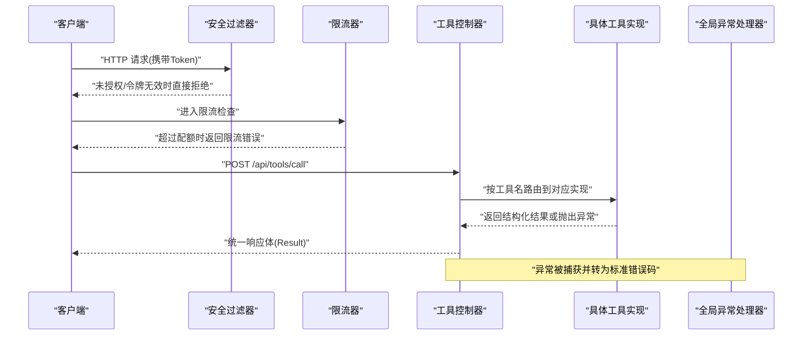
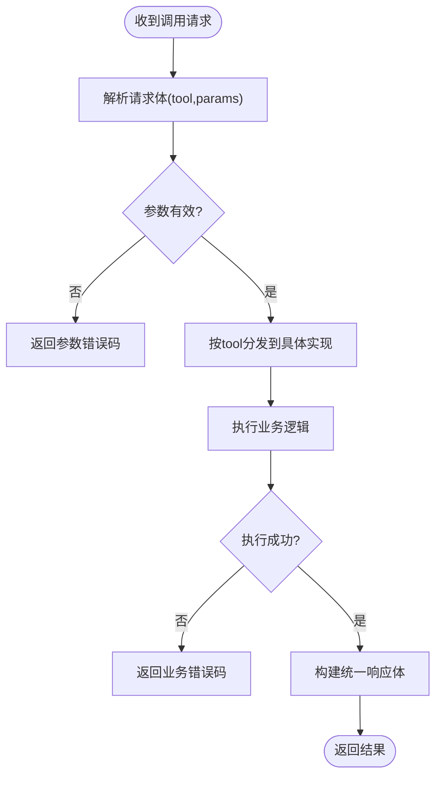
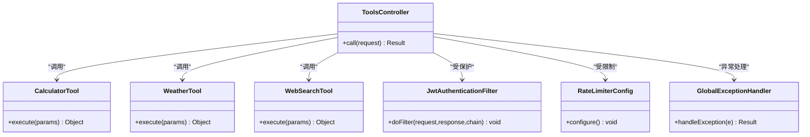

# 工具系统API

<cite>
**本文引用的文件**   
- [ToolsController.java](file://src/main/java/com/ailearn/tools/ToolsController.java)
- [CalculatorTool.java](file://src/main/java/com/ailearn/tools/CalculatorTool.java)
- [WeatherTool.java](file://src/main/java/com/ailearn/tools/WeatherTool.java)
- [WebSearchTool.java](file://src/main/java/com/ailearn/tools/WebSearchTool.java)
- [RateLimiterConfig.java](file://src/main/java/com/ailearn/config/RateLimiterConfig.java)
- [SecurityConfig.java](file://src/main/java/com/ailearn/security/SecurityConfig.java)
- [JwtAuthenticationFilter.java](file://src/main/java/com/ailearn/security/JwtAuthenticationFilter.java)
- [GlobalExceptionHandler.java](file://src/main/java/com/ailearn/common/GlobalExceptionHandler.java)
- [ErrorCode.java](file://src/main/java/com/ailearn/common/ErrorCode.java)
- [Result.java](file://src/main/java/com/ailearn/common/Result.java)
</cite>

## 目录
1. [简介](#简介)
2. [项目结构](#项目结构)
3. [核心组件](#核心组件)
4. [架构总览](#架构总览)
5. [详细组件分析](#详细组件分析)
6. [依赖关系分析](#依赖关系分析)
7. [性能与限流](#性能与限流)
8. [故障排查指南](#故障排查指南)
9. [结论](#结论)
10. [附录：自定义工具开发指南](#附录自定义工具开发指南)

## 简介
本文件面向开发者，系统化说明工具系统的API接口规范与扩展机制。内容覆盖内置工具（计算器、天气查询、网络搜索）的调用格式、参数传递与结果解析方法；提供自定义工具的开发指南与注册、发现、执行流程；并说明权限控制与限流策略以及常见错误处理方案。

## 项目结构
工具系统位于后端模块中，主要包含以下职责划分：
- 控制器层：暴露统一的工具调用入口，负责请求校验、鉴权、限流与响应封装。
- 工具实现层：各具体工具的业务逻辑实现，如计算、天气、搜索等。
- 安全与限流配置：统一的安全拦截与速率限制策略。
- 全局异常处理：标准化错误码与错误响应体。

```mermaid
graph TB
Client["客户端"] --> API["工具API(ToolsController)"]
API --> Sec["安全过滤器(JwtAuthenticationFilter)"]
API --> RL["限流(RateLimiterConfig)"]
API --> Calc["计算器(CalculatorTool)"]
API --> Weather["天气(WeatherTool)]
API --> Search["网络搜索(WebSearchTool)"]
API --> Err["全局异常(GlobalExceptionHandler)"]
```

图表来源
- [ToolsController.java](file://src/main/java/com/ailearn/tools/ToolsController.java)
- [CalculatorTool.java](file://src/main/java/com/ailearn/tools/CalculatorTool.java)
- [WeatherTool.java](file://src/main/java/com/ailearn/tools/WeatherTool.java)
- [WebSearchTool.java](file://src/main/java/com/ailearn/tools/WebSearchTool.java)
- [JwtAuthenticationFilter.java](file://src/main/java/com/ailearn/security/JwtAuthenticationFilter.java)
- [RateLimiterConfig.java](file://src/main/java/com/ailearn/config/RateLimiterConfig.java)
- [GlobalExceptionHandler.java](file://src/main/java/com/ailearn/common/GlobalExceptionHandler.java)

章节来源
- [ToolsController.java](file://src/main/java/com/ailearn/tools/ToolsController.java)
- [SecurityConfig.java](file://src/main/java/com/ailearn/security/SecurityConfig.java)
- [RateLimiterConfig.java](file://src/main/java/com/ailearn/config/RateLimiterConfig.java)
- [GlobalExceptionHandler.java](file://src/main/java/com/ailearn/common/GlobalExceptionHandler.java)

## 核心组件
- 工具控制器：提供统一的工具调用REST接口，负责路由到具体工具实现，并对输入输出进行规范化处理。
- 计算器工具：提供基础算术运算能力，支持常见的加减乘除等操作。
- 天气查询工具：根据城市或坐标获取天气信息，返回温度、湿度、风力等字段。
- 网络搜索工具：基于搜索引擎或内部检索服务，返回相关搜索结果摘要。
- 安全与限流：通过JWT鉴权与速率限制保护工具接口，防止滥用。
- 全局异常：将业务异常与系统异常统一转换为标准错误响应。

章节来源
- [ToolsController.java](file://src/main/java/com/ailearn/tools/ToolsController.java)
- [CalculatorTool.java](file://src/main/java/com/ailearn/tools/CalculatorTool.java)
- [WeatherTool.java](file://src/main/java/com/ailearn/tools/WeatherTool.java)
- [WebSearchTool.java](file://src/main/java/com/ailearn/tools/WebSearchTool.java)
- [JwtAuthenticationFilter.java](file://src/main/java/com/ailearn/security/JwtAuthenticationFilter.java)
- [RateLimiterConfig.java](file://src/main/java/com/ailearn/config/RateLimiterConfig.java)
- [GlobalExceptionHandler.java](file://src/main/java/com/ailearn/common/GlobalExceptionHandler.java)

## 架构总览
下图展示了从客户端发起工具调用到工具执行与结果返回的整体流程，包括鉴权、限流、工具分发与异常处理。



图表来源
- [ToolsController.java](file://src/main/java/com/ailearn/tools/ToolsController.java)
- [JwtAuthenticationFilter.java](file://src/main/java/com/ailearn/security/JwtAuthenticationFilter.java)
- [RateLimiterConfig.java](file://src/main/java/com/ailearn/config/RateLimiterConfig.java)
- [GlobalExceptionHandler.java](file://src/main/java/com/ailearn/common/GlobalExceptionHandler.java)

## 详细组件分析

### 统一工具调用接口
- 接口路径与方法：建议采用单一入口，例如 POST /api/tools/call，便于集中管理鉴权、限流与日志。
- 请求体结构：
  - tool: 字符串，工具标识（如 calculator、weather、web_search）。
  - params: 对象，工具特定参数集合。
- 响应体结构：
  - code: 整数，状态码（成功为0，失败为非0）。
  - message: 字符串，提示信息。
  - data: 对象，工具返回的具体数据。
- 鉴权与限流：
  - 鉴权：通过请求头携带JWT令牌，由安全过滤器校验。
  - 限流：对同一用户或IP在单位时间内的调用次数进行限制，超限返回限流错误。
- 错误处理：
  - 业务异常：使用统一错误码与消息。
  - 系统异常：记录堆栈并返回通用错误码。

章节来源
- [ToolsController.java](file://src/main/java/com/ailearn/tools/ToolsController.java)
- [Result.java](file://src/main/java/com/ailearn/common/Result.java)
- [ErrorCode.java](file://src/main/java/com/ailearn/common/ErrorCode.java)
- [JwtAuthenticationFilter.java](file://src/main/java/com/ailearn/security/JwtAuthenticationFilter.java)
- [RateLimiterConfig.java](file://src/main/java/com/ailearn/config/RateLimiterConfig.java)
- [GlobalExceptionHandler.java](file://src/main/java/com/ailearn/common/GlobalExceptionHandler.java)

### 计算器工具
- 功能概述：提供基础算术运算，支持加、减、乘、除等。
- 参数定义：
  - operation: 字符串，操作类型（如 add、sub、mul、div）。
  - operands: 数字数组，参与运算的操作数。
- 返回结果：
  - result: 数值，运算结果。
  - unit: 可选，单位（如适用）。
- 边界与异常：
  - 除零：返回明确的错误码与提示。
  - 非法操作：不支持的操作类型应返回参数错误。
- 示例调用：
  - 请求：{"tool":"calculator","params":{"operation":"add","operands":[1,2]}}
  - 响应：{"code":0,"message":"ok","data":{"result":3}}

章节来源
- [CalculatorTool.java](file://src/main/java/com/ailearn/tools/CalculatorTool.java)
- [ToolsController.java](file://src/main/java/com/ailearn/tools/ToolsController.java)
- [Result.java](file://src/main/java/com/ailearn/common/Result.java)
- [ErrorCode.java](file://src/main/java/com/ailearn/common/ErrorCode.java)

### 天气查询工具
- 功能概述：根据城市或经纬度查询天气信息。
- 参数定义：
  - city: 字符串，城市名称（二选一）。
  - lat: 数值，纬度（与city二选一）。
  - lon: 数值，经度（与city二选一）。
  - units: 字符串，单位（如 metric、imperial）。
- 返回结果：
  - temperature: 数值，当前温度。
  - humidity: 数值，湿度百分比。
  - wind_speed: 数值，风速。
  - description: 字符串，天气描述。
- 边界与异常：
  - 位置无效：返回参数错误或外部服务不可用错误。
  - 外部服务超时：返回可重试的错误码。
- 示例调用：
  - 请求：{"tool":"weather","params":{"city":"北京","units":"metric"}}
  - 响应：{"code":0,"message":"ok","data":{"temperature":22,"humidity":60,"wind_speed":3,"description":"多云"}}

章节来源
- [WeatherTool.java](file://src/main/java/com/ailearn/tools/WeatherTool.java)
- [ToolsController.java](file://src/main/java/com/ailearn/tools/ToolsController.java)
- [Result.java](file://src/main/java/com/ailearn/common/Result.java)
- [ErrorCode.java](file://src/main/java/com/ailearn/common/ErrorCode.java)

### 网络搜索工具
- 功能概述：基于搜索引擎或内部检索服务执行关键词搜索，返回摘要列表。
- 参数定义：
  - query: 字符串，搜索关键词。
  - max_results: 整数，最大返回条数。
  - language: 字符串，语言代码（如 zh-CN）。
- 返回结果：
  - results: 数组，每项包含标题、摘要、链接等字段。
  - total: 整数，匹配总数。
- 边界与异常：
  - 空查询：返回参数错误。
  - 外部服务错误：返回可重试的错误码。
- 示例调用：
  - 请求：{"tool":"web_search","params":{"query":"Spring AI","max_results":5}}
  - 响应：{"code":0,"message":"ok","data":{"results":[{"title":"...","snippet":"...","url":"..."}],"total":120}}

章节来源
- [WebSearchTool.java](file://src/main/java/com/ailearn/tools/WebSearchTool.java)
- [ToolsController.java](file://src/main/java/com/ailearn/tools/ToolsController.java)
- [Result.java](file://src/main/java/com/ailearn/common/Result.java)
- [ErrorCode.java](file://src/main/java/com/ailearn/common/ErrorCode.java)

### 工具调用流程图（通用）


图表来源
- [ToolsController.java](file://src/main/java/com/ailearn/tools/ToolsController.java)
- [GlobalExceptionHandler.java](file://src/main/java/com/ailearn/common/GlobalExceptionHandler.java)
- [ErrorCode.java](file://src/main/java/com/ailearn/common/ErrorCode.java)

## 依赖关系分析
- 控制器依赖：
  - 工具实现类：计算器、天气、搜索等。
  - 安全过滤器：校验JWT令牌。
  - 限流配置：基于用户或IP的速率限制。
  - 全局异常处理器：统一错误响应。
- 工具实现依赖：
  - 外部服务：天气API、搜索引擎API等。
  - 配置项：密钥、超时、重试策略等。



图表来源
- [ToolsController.java](file://src/main/java/com/ailearn/tools/ToolsController.java)
- [CalculatorTool.java](file://src/main/java/com/ailearn/tools/CalculatorTool.java)
- [WeatherTool.java](file://src/main/java/com/ailearn/tools/WeatherTool.java)
- [WebSearchTool.java](file://src/main/java/com/ailearn/tools/WebSearchTool.java)
- [JwtAuthenticationFilter.java](file://src/main/java/com/ailearn/security/JwtAuthenticationFilter.java)
- [RateLimiterConfig.java](file://src/main/java/com/ailearn/config/RateLimiterConfig.java)
- [GlobalExceptionHandler.java](file://src/main/java/com/ailearn/common/GlobalExceptionHandler.java)

章节来源
- [ToolsController.java](file://src/main/java/com/ailearn/tools/ToolsController.java)
- [SecurityConfig.java](file://src/main/java/com/ailearn/security/SecurityConfig.java)
- [RateLimiterConfig.java](file://src/main/java/com/ailearn/config/RateLimiterConfig.java)
- [GlobalExceptionHandler.java](file://src/main/java/com/ailearn/common/GlobalExceptionHandler.java)

## 性能与限流
- 限流策略：
  - 维度：可按用户ID或IP地址进行限流。
  - 算法：滑动窗口或令牌桶，避免突发流量冲击。
  - 阈值：默认值可通过配置文件调整，生产环境建议结合监控动态调优。
- 缓存建议：
  - 天气与搜索结果可短期缓存，减少外部服务压力。
  - 注意缓存失效策略与一致性。
- 超时与重试：
  - 外部服务调用需设置合理超时与重试上限。
  - 幂等性：确保重试不会导致副作用。

章节来源
- [RateLimiterConfig.java](file://src/main/java/com/ailearn/config/RateLimiterConfig.java)
- [ToolsController.java](file://src/main/java/com/ailearn/tools/ToolsController.java)

## 故障排查指南
- 鉴权失败：
  - 现象：返回未授权或令牌无效错误。
  - 排查：确认请求头是否携带有效JWT，检查令牌有效期与签名。
- 限流触发：
  - 现象：返回限流错误码。
  - 排查：检查调用频率是否超过阈值，必要时提升配额或优化客户端重试退避。
- 参数错误：
  - 现象：返回参数校验错误。
  - 排查：对照工具参数定义，补齐必填字段与类型。
- 外部服务异常：
  - 现象：返回外部服务不可用或超时错误。
  - 排查：检查外部服务状态、密钥配置与网络连通性。
- 统一错误码：
  - 参考错误码枚举，定位问题类别与处理建议。

章节来源
- [JwtAuthenticationFilter.java](file://src/main/java/com/ailearn/security/JwtAuthenticationFilter.java)
- [RateLimiterConfig.java](file://src/main/java/com/ailearn/config/RateLimiterConfig.java)
- [ErrorCode.java](file://src/main/java/com/ailearn/common/ErrorCode.java)
- [GlobalExceptionHandler.java](file://src/main/java/com/ailearn/common/GlobalExceptionHandler.java)

## 结论
工具系统通过统一入口、标准化响应与完善的鉴权限流机制，提供了可扩展、易维护的工具调用能力。内置计算器、天气与搜索工具覆盖了常见场景，同时预留了清晰的扩展点以支持自定义工具的快速接入。

## 附录：自定义工具开发指南
- 开发步骤：
  1. 新建工具实现类，定义execute方法接收params并返回结构化数据。
  2. 在控制器中添加路由分支，按tool名分发到对应实现。
  3. 编写单元测试，覆盖正常与异常路径。
  4. 更新文档，补充参数与返回字段说明。
- 注册与发现：
  - 注册：在控制器中维护工具名到实现的映射表。
  - 发现：对外暴露工具清单接口，返回可用工具及其参数Schema。
- 执行流程：
  - 控制器校验参数后调用工具实现，捕获异常并转换为统一错误响应。
- 权限与限流：
  - 继承统一鉴权与限流策略，敏感工具可增加额外权限校验。
- 最佳实践：
  - 参数校验前置，尽早返回明确错误。
  - 外部调用增加超时与重试，保证幂等。
  - 日志记录关键上下文，便于追踪问题。

章节来源
- [ToolsController.java](file://src/main/java/com/ailearn/tools/ToolsController.java)
- [GlobalExceptionHandler.java](file://src/main/java/com/ailearn/common/GlobalExceptionHandler.java)
- [ErrorCode.java](file://src/main/java/com/ailearn/common/ErrorCode.java)
- [Result.java](file://src/main/java/com/ailearn/common/Result.java)