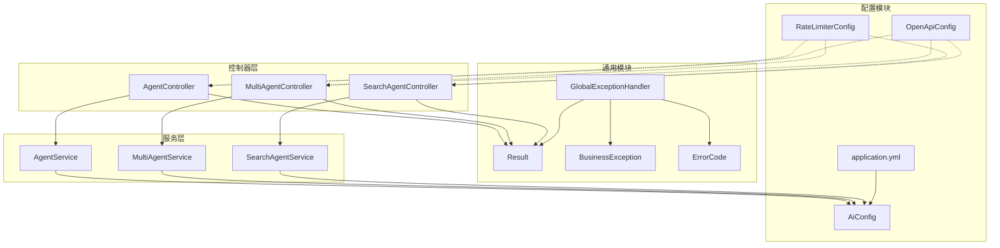
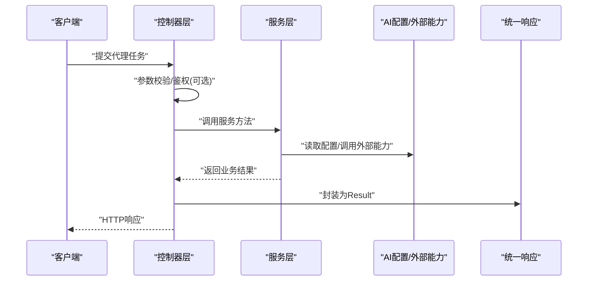
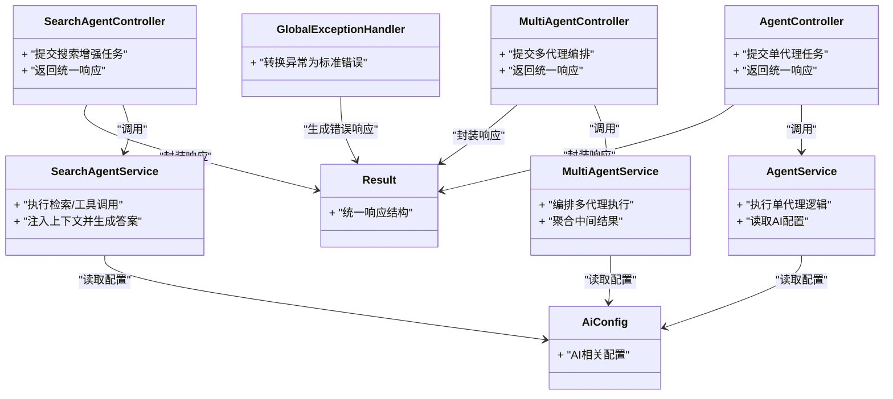

# 智能代理API

<cite>
**本文引用的文件**   
- [AgentController.java](file://src/main/java/com/ailearn/agent/AgentController.java)
- [AgentService.java](file://src/main/java/com/ailearn/agent/AgentService.java)
- [MultiAgentController.java](file://src/main/java/com/ailearn/agent/MultiAgentController.java)
- [MultiAgentService.java](file://src/main/java/com/ailearn/agent/MultiAgentService.java)
- [SearchAgentController.java](file://src/main/java/com/ailearn/agent/SearchAgentController.java)
- [SearchAgentService.java](file://src/main/java/com/ailearn/agent/SearchAgentService.java)
- [Result.java](file://src/main/java/com/ailearn/common/Result.java)
- [GlobalExceptionHandler.java](file://src/main/java/com/ailearn/common/GlobalExceptionHandler.java)
- [BusinessException.java](file://src/main/java/com/ailearn/common/BusinessException.java)
- [ErrorCode.java](file://src/main/java/com/ailearn/common/ErrorCode.java)
- [AiConfig.java](file://src/main/java/com/ailearn/config/AiConfig.java)
- [RateLimiterConfig.java](file://src/main/java/com/ailearn/config/RateLimiterConfig.java)
- [OpenApiConfig.java](file://src/main/java/com/ailearn/config/OpenApiConfig.java)
- [application.yml](file://src/main/resources/application.yml)
</cite>

## 目录
1. [简介](#简介)
2. [项目结构](#项目结构)
3. [核心组件](#核心组件)
4. [架构总览](#架构总览)
5. [详细组件分析](#详细组件分析)
6. [依赖关系分析](#依赖关系分析)
7. [性能考虑](#性能考虑)
8. [故障排查指南](#故障排查指南)
9. [结论](#结论)
10. [附录](#附录)

## 简介
本文件为智能代理框架的API接口文档，覆盖以下能力：
- 单代理对话与任务执行
- 多代理协作编排与通信机制
- 搜索增强代理（结合检索/工具）的任务提交与结果获取
- 代理配置、生命周期管理、状态监控
- 错误处理策略与调用示例
- 性能优化建议

## 项目结构
后端采用分层架构：控制器层暴露REST API，服务层封装业务逻辑，通用模块提供统一响应体与异常处理，配置模块集中管理AI相关参数、限流与OpenAPI。

图表来源
- [AgentController.java](file://src/main/java/com/ailearn/agent/AgentController.java)
- [AgentService.java](file://src/main/java/com/ailearn/agent/AgentService.java)
- [MultiAgentController.java](file://src/main/java/com/ailearn/agent/MultiAgentController.java)
- [MultiAgentService.java](file://src/main/java/com/ailearn/agent/MultiAgentService.java)
- [SearchAgentController.java](file://src/main/java/com/ailearn/agent/SearchAgentController.java)
- [SearchAgentService.java](file://src/main/java/com/ailearn/agent/SearchAgentService.java)
- [Result.java](file://src/main/java/com/ailearn/common/Result.java)
- [GlobalExceptionHandler.java](file://src/main/java/com/ailearn/common/GlobalExceptionHandler.java)
- [BusinessException.java](file://src/main/java/com/ailearn/common/BusinessException.java)
- [ErrorCode.java](file://src/main/java/com/ailearn/common/ErrorCode.java)
- [AiConfig.java](file://src/main/java/com/ailearn/config/AiConfig.java)
- [RateLimiterConfig.java](file://src/main/java/com/ailearn/config/RateLimiterConfig.java)
- [OpenApiConfig.java](file://src/main/java/com/ailearn/config/OpenApiConfig.java)
- [application.yml](file://src/main/resources/application.yml)

章节来源
- [AgentController.java](file://src/main/java/com/ailearn/agent/AgentController.java)
- [AgentService.java](file://src/main/java/com/ailearn/agent/AgentService.java)
- [MultiAgentController.java](file://src/main/java/com/ailearn/agent/MultiAgentController.java)
- [MultiAgentService.java](file://src/main/java/com/ailearn/agent/MultiAgentService.java)
- [SearchAgentController.java](file://src/main/java/com/ailearn/agent/SearchAgentController.java)
- [SearchAgentService.java](file://src/main/java/com/ailearn/agent/SearchAgentService.java)
- [Result.java](file://src/main/java/com/ailearn/common/Result.java)
- [GlobalExceptionHandler.java](file://src/main/java/com/ailearn/common/GlobalExceptionHandler.java)
- [BusinessException.java](file://src/main/java/com/ailearn/common/BusinessException.java)
- [ErrorCode.java](file://src/main/java/com/ailearn/common/ErrorCode.java)
- [AiConfig.java](file://src/main/java/com/ailearn/config/AiConfig.java)
- [RateLimiterConfig.java](file://src/main/java/com/ailearn/config/RateLimiterConfig.java)
- [OpenApiConfig.java](file://src/main/java/com/ailearn/config/OpenApiConfig.java)
- [application.yml](file://src/main/resources/application.yml)

## 核心组件
- 单代理接口：用于发起一次对话或任务执行，返回结构化结果。
- 多代理协作接口：支持按拓扑或流水线方式编排多个代理，协调其执行顺序与数据流转。
- 搜索增强代理接口：在推理过程中引入外部检索或工具能力，提升答案准确性与可解释性。
- 通用响应体 Result：所有接口统一返回格式，包含状态码、消息与数据负载。
- 全局异常处理器 GlobalExceptionHandler：将业务异常与系统异常转换为标准错误响应。
- 配置 AiConfig：集中管理模型、超时、重试等AI相关参数。
- 限流 RateLimiterConfig：对关键接口进行速率限制，保护下游资源。
- OpenAPI OpenApiConfig：生成并暴露API文档。

章节来源
- [AgentController.java](file://src/main/java/com/ailearn/agent/AgentController.java)
- [AgentService.java](file://src/main/java/com/ailearn/agent/AgentService.java)
- [MultiAgentController.java](file://src/main/java/com/ailearn/agent/MultiAgentController.java)
- [MultiAgentService.java](file://src/main/java/com/ailearn/agent/MultiAgentService.java)
- [SearchAgentController.java](file://src/main/java/com/ailearn/agent/SearchAgentController.java)
- [SearchAgentService.java](file://src/main/java/com/ailearn/agent/SearchAgentService.java)
- [Result.java](file://src/main/java/com/ailearn/common/Result.java)
- [GlobalExceptionHandler.java](file://src/main/java/com/ailearn/common/GlobalExceptionHandler.java)
- [AiConfig.java](file://src/main/java/com/ailearn/config/AiConfig.java)
- [RateLimiterConfig.java](file://src/main/java/com/ailearn/config/RateLimiterConfig.java)
- [OpenApiConfig.java](file://src/main/java/com/ailearn/config/OpenApiConfig.java)

## 架构总览
整体流程遵循“请求进入控制器 -> 服务层编排与执行 -> 统一响应”的模式。多代理场景下，控制器仅负责接收请求与参数校验，具体编排由服务层完成；搜索增强代理在服务层中按需调用检索或工具能力。

图表来源
- [AgentController.java](file://src/main/java/com/ailearn/agent/AgentController.java)
- [AgentService.java](file://src/main/java/com/ailearn/agent/AgentService.java)
- [MultiAgentController.java](file://src/main/java/com/ailearn/agent/MultiAgentController.java)
- [MultiAgentService.java](file://src/main/java/com/ailearn/agent/MultiAgentService.java)
- [SearchAgentController.java](file://src/main/java/com/ailearn/agent/SearchAgentController.java)
- [SearchAgentService.java](file://src/main/java/com/ailearn/agent/SearchAgentService.java)
- [Result.java](file://src/main/java/com/ailearn/common/Result.java)
- [AiConfig.java](file://src/main/java/com/ailearn/config/AiConfig.java)

## 详细组件分析

### 单代理接口
- 功能说明
  - 提交单次对话或任务，返回结构化结果。
  - 支持基础参数如提示词、上下文ID、模型选择等（以实际DTO为准）。
- 典型流程
  - 控制器接收请求并校验参数。
  - 服务层根据配置调用AI能力，组装结果。
  - 通过统一响应体返回。
- 错误处理
  - 业务异常通过全局异常处理器转换为标准错误响应。
- 调用示例（概念）
  - 使用POST提交任务，携带必要字段，等待返回Result。

章节来源
- [AgentController.java](file://src/main/java/com/ailearn/agent/AgentController.java)
- [AgentService.java](file://src/main/java/com/ailearn/agent/AgentService.java)
- [Result.java](file://src/main/java/com/ailearn/common/Result.java)
- [GlobalExceptionHandler.java](file://src/main/java/com/ailearn/common/GlobalExceptionHandler.java)
- [BusinessException.java](file://src/main/java/com/ailearn/common/BusinessException.java)
- [ErrorCode.java](file://src/main/java/com/ailearn/common/ErrorCode.java)

### 多代理协作接口
- 功能说明
  - 支持按拓扑或流水线编排多个代理，协调执行顺序与数据流转。
  - 可指定协作模式（串行、并行、条件分支等），以及每个节点的输入输出映射。
- 工作流程
  - 控制器接收编排请求。
  - 服务层解析拓扑，依次或并发调度各代理节点。
  - 聚合中间结果，最终返回统一结果。
- 通信机制
  - 节点间通过内存数据结构传递上下文与中间产物。
  - 支持失败回退与重试策略（由服务层实现）。
- 状态监控
  - 可通过查询接口获取当前编排任务的运行状态与节点进度（若已暴露）。
- 调用示例（概念）
  - 提交包含节点列表与连接关系的编排请求，等待聚合结果。

章节来源
- [MultiAgentController.java](file://src/main/java/com/ailearn/agent/MultiAgentController.java)
- [MultiAgentService.java](file://src/main/java/com/ailearn/agent/MultiAgentService.java)
- [Result.java](file://src/main/java/com/ailearn/common/Result.java)

### 搜索增强代理接口
- 功能说明
  - 在推理过程中引入检索或工具能力，提高答案准确性与可解释性。
  - 支持指定检索源、过滤条件与工具集。
- 处理流程
  - 控制器接收请求并校验参数。
  - 服务层在执行前触发检索或工具调用，将结果注入上下文。
  - 调用AI模型生成最终答案，并附带引用信息。
- 错误处理
  - 检索或工具调用失败时，可按策略降级为无检索模式或返回部分结果。
- 调用示例（概念）
  - 提交包含检索参数与工具的请求，等待带引用的回答。

章节来源
- [SearchAgentController.java](file://src/main/java/com/ailearn/agent/SearchAgentController.java)
- [SearchAgentService.java](file://src/main/java/com/ailearn/agent/SearchAgentService.java)
- [Result.java](file://src/main/java/com/ailearn/common/Result.java)

### 代理配置与生命周期管理
- 配置项
  - 模型选择、超时、重试次数、最大令牌数等（由配置类集中管理）。
  - 应用级参数（端口、日志、数据库等）位于应用配置文件。
- 生命周期
  - 启动阶段加载配置并初始化能力。
  - 运行时根据请求动态调整行为（如切换模型或启用工具）。
  - 优雅关闭释放资源。
- 状态监控
  - 可通过健康检查或指标端点查看服务可用性（若已暴露）。

章节来源
- [AiConfig.java](file://src/main/java/com/ailearn/config/AiConfig.java)
- [application.yml](file://src/main/resources/application.yml)

### 统一响应与错误处理
- 统一响应体
  - 所有接口返回统一的Result结构，包含状态码、消息与数据负载。
- 全局异常处理
  - 捕获业务异常与系统异常，转换为标准错误响应。
- 错误码
  - 定义标准化错误码，便于前端与运维定位问题。

章节来源
- [Result.java](file://src/main/java/com/ailearn/common/Result.java)
- [GlobalExceptionHandler.java](file://src/main/java/com/ailearn/common/GlobalExceptionHandler.java)
- [BusinessException.java](file://src/main/java/com/ailearn/common/BusinessException.java)
- [ErrorCode.java](file://src/main/java/com/ailearn/common/ErrorCode.java)

### 限流与API文档
- 限流
  - 针对关键接口设置速率限制，避免下游过载。
- OpenAPI
  - 自动生成并暴露API文档，便于联调与测试。

章节来源
- [RateLimiterConfig.java](file://src/main/java/com/ailearn/config/RateLimiterConfig.java)
- [OpenApiConfig.java](file://src/main/java/com/ailearn/config/OpenApiConfig.java)

## 依赖关系分析
- 控制器与服务层解耦：控制器仅做参数校验与响应封装，服务层承载业务编排。
- 服务层依赖配置：从配置中心读取AI参数，保证运行时灵活性。
- 统一异常与响应：全局异常处理器与Result确保一致的错误与成功语义。
- 外部能力：搜索增强代理可能依赖检索或工具服务（由服务层集成）。

图表来源
- [AgentController.java](file://src/main/java/com/ailearn/agent/AgentController.java)
- [AgentService.java](file://src/main/java/com/ailearn/agent/AgentService.java)
- [MultiAgentController.java](file://src/main/java/com/ailearn/agent/MultiAgentController.java)
- [MultiAgentService.java](file://src/main/java/com/ailearn/agent/MultiAgentService.java)
- [SearchAgentController.java](file://src/main/java/com/ailearn/agent/SearchAgentController.java)
- [SearchAgentService.java](file://src/main/java/com/ailearn/agent/SearchAgentService.java)
- [Result.java](file://src/main/java/com/ailearn/common/Result.java)
- [GlobalExceptionHandler.java](file://src/main/java/com/ailearn/common/GlobalExceptionHandler.java)
- [AiConfig.java](file://src/main/java/com/ailearn/config/AiConfig.java)

## 性能考虑
- 合理设置超时与重试：避免长尾请求阻塞线程池。
- 限流与熔断：在高并发场景保护下游AI服务与检索/工具服务。
- 批量与异步：对多代理编排可采用异步与批处理策略，降低端到端延迟。
- 缓存热点上下文：减少重复计算与外部调用开销。
- 监控与告警：关注P95/P99延迟、错误率与资源利用率。

[本节为通用指导，不直接分析具体文件]

## 故障排查指南
- 常见错误
  - 参数缺失或类型错误：检查请求体字段与必填项。
  - 下游服务不可用：查看限流与熔断配置，确认外部服务健康状态。
  - 超时或重试过多：调整超时阈值与重试策略。
- 定位步骤
  - 查看统一响应的错误码与消息。
  - 检查全局异常处理器记录的关键信息。
  - 核对配置项是否生效（模型、超时、限流等）。
- 恢复建议
  - 临时降级：禁用搜索增强或切换备用模型。
  - 扩容与限流：增加实例或收紧限流阈值。

章节来源
- [GlobalExceptionHandler.java](file://src/main/java/com/ailearn/common/GlobalExceptionHandler.java)
- [BusinessException.java](file://src/main/java/com/ailearn/common/BusinessException.java)
- [ErrorCode.java](file://src/main/java/com/ailearn/common/ErrorCode.java)
- [Result.java](file://src/main/java/com/ailearn/common/Result.java)
- [AiConfig.java](file://src/main/java/com/ailearn/config/AiConfig.java)
- [RateLimiterConfig.java](file://src/main/java/com/ailearn/config/RateLimiterConfig.java)

## 结论
本API文档覆盖了单代理、多代理协作与搜索增强代理的核心能力，提供了统一的响应与错误处理规范，并给出了配置、限流与监控方面的实践建议。建议在上线前完善健康检查与指标采集，持续优化多代理编排的性能与稳定性。

[本节为总结性内容，不直接分析具体文件]

## 附录
- 术语
  - 单代理：独立执行一次对话或任务。
  - 多代理协作：多个代理按拓扑或流水线协同工作。
  - 搜索增强：在推理过程中引入检索或工具能力。
- 参考
  - OpenAPI文档：通过配置类生成的接口文档页面。
  - 应用配置：端口、日志、数据库等参数位置。

[本节为补充说明，不直接分析具体文件]