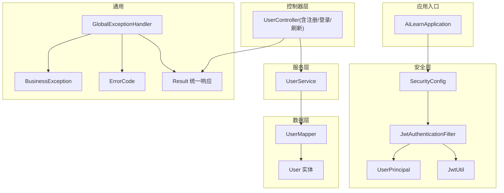
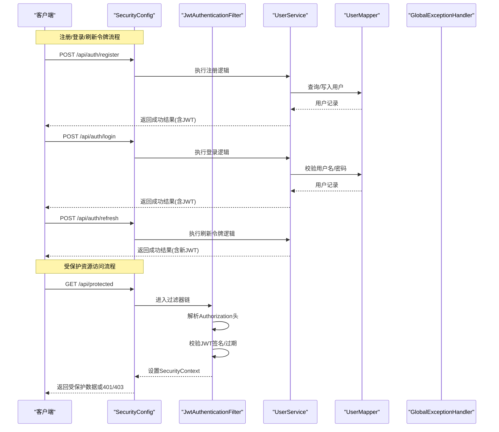
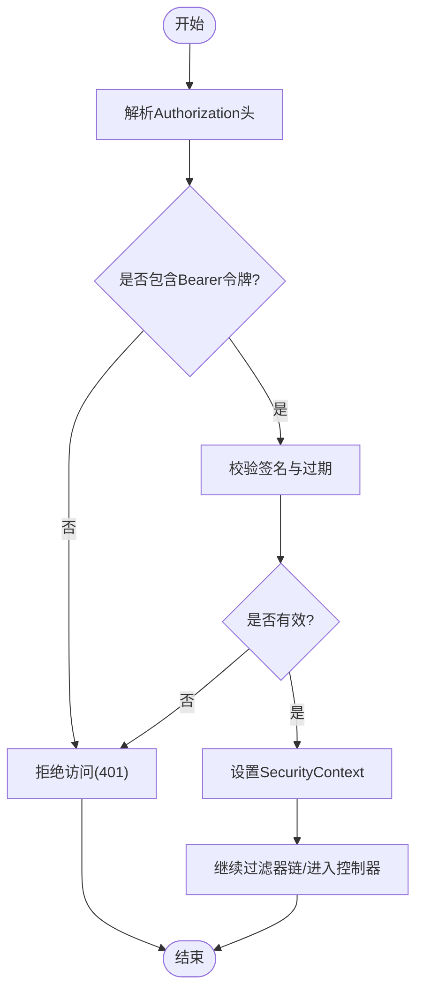
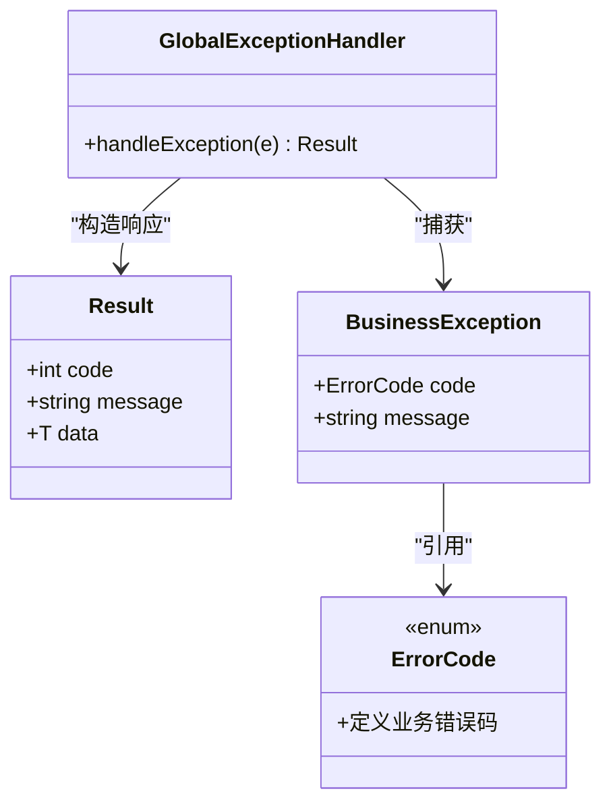
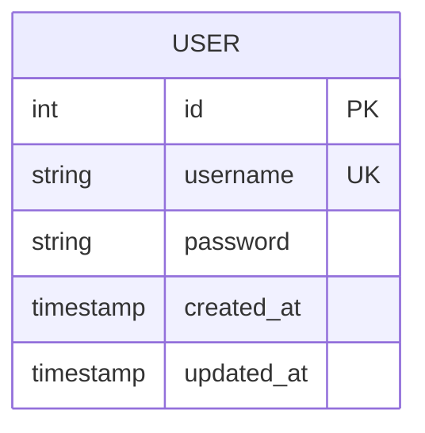
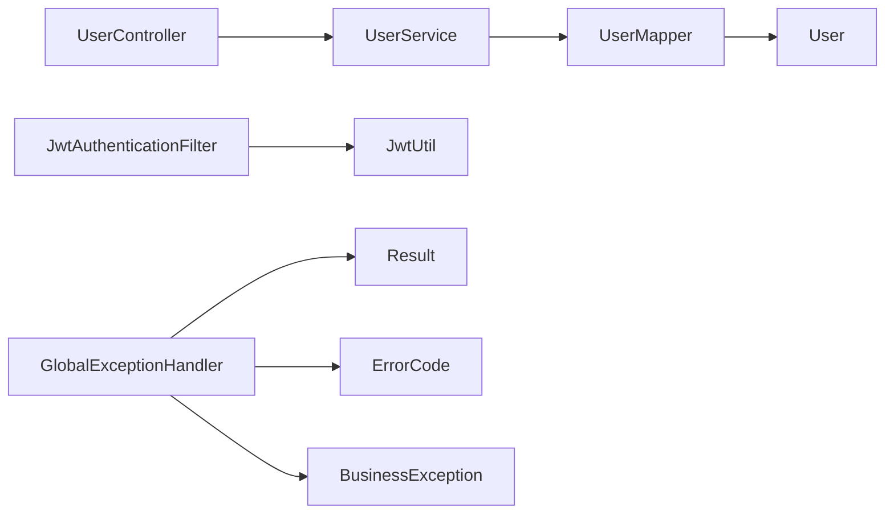

# 用户认证API

<cite>
**本文引用的文件**   
- [AiLearnApplication.java](file://src/main/java/com/ailearn/AiLearnApplication.java)
- [SecurityConfig.java](file://src/main/java/com/ailearn/security/SecurityConfig.java)
- [JwtAuthenticationFilter.java](file://src/main/java/com/ailearn/security/JwtAuthenticationFilter.java)
- [JwtUtil.java](file://src/main/java/com/ailearn/security/JwtUtil.java)
- [UserPrincipal.java](file://src/main/java/com/ailearn/security/UserPrincipal.java)
- [UserControllerTest.java](file://src/test/java/com/ailearn/controller/UserControllerTest.java)
- [LoginRequest.java](file://src/main/java/com/ailearn/dto/LoginRequest.java)
- [RegisterRequest.java](file://src/main/java/com/ailearn/dto/RegisterRequest.java)
- [RefreshTokenRequest.java](file://src/main/java/com/ailearn/dto/RefreshTokenRequest.java)
- [UserService.java](file://src/main/java/com/ailearn/service/UserService.java)
- [UserMapper.java](file://src/main/java/com/ailearn/mapper/UserMapper.java)
- [User.java](file://src/main/java/com/ailearn/entity/User.java)
- [ErrorCode.java](file://src/main/java/com/ailearn/common/ErrorCode.java)
- [BusinessException.java](file://src/main/java/com/ailearn/common/BusinessException.java)
- [GlobalExceptionHandler.java](file://src/main/java/com/ailearn/common/GlobalExceptionHandler.java)
- [Result.java](file://src/main/java/com/ailearn/common/Result.java)
- [application.yml](file://src/main/resources/application.yml)
</cite>

## 目录
1. [简介](#简介)
2. [项目结构](#项目结构)
3. [核心组件](#核心组件)
4. [架构总览](#架构总览)
5. [详细组件分析](#详细组件分析)
6. [依赖关系分析](#依赖关系分析)
7. [性能与安全建议](#性能与安全建议)
8. [故障排查指南](#故障排查指南)
9. [结论](#结论)
10. [附录](#附录)

## 简介
本文件面向后端与前端开发者，系统化说明用户认证相关API的设计与实现，包括：
- 用户注册、登录、令牌刷新接口
- JWT令牌的生成、验证与使用机制
- 权限控制与安全最佳实践
- 错误码定义与异常处理
- 客户端集成示例与常见问题解决方案

## 项目结构
认证相关代码主要分布在以下包中：
- security：安全配置、JWT工具、过滤器、当前用户上下文
- controller：控制器（包含认证相关接口）
- service：业务逻辑（用户服务）
- mapper：数据访问层（用户映射）
- entity：实体模型（用户）
- dto：请求DTO（登录、注册、刷新令牌）
- common：统一响应体、全局异常处理器、错误码

图表来源
- [SecurityConfig.java](file://src/main/java/com/ailearn/security/SecurityConfig.java)
- [JwtAuthenticationFilter.java](file://src/main/java/com/ailearn/security/JwtAuthenticationFilter.java)
- [JwtUtil.java](file://src/main/java/com/ailearn/security/JwtUtil.java)
- [UserPrincipal.java](file://src/main/java/com/ailearn/security/UserPrincipal.java)
- [AiLearnApplication.java](file://src/main/java/com/ailearn/AiLearnApplication.java)
- [UserService.java](file://src/main/java/com/ailearn/service/UserService.java)
- [UserMapper.java](file://src/main/java/com/ailearn/mapper/UserMapper.java)
- [User.java](file://src/main/java/com/ailearn/entity/User.java)
- [Result.java](file://src/main/java/com/ailearn/common/Result.java)
- [GlobalExceptionHandler.java](file://src/main/java/com/ailearn/common/GlobalExceptionHandler.java)
- [ErrorCode.java](file://src/main/java/com/ailearn/common/ErrorCode.java)
- [BusinessException.java](file://src/main/java/com/ailearn/common/BusinessException.java)

章节来源
- [AiLearnApplication.java](file://src/main/java/com/ailearn/AiLearnApplication.java)
- [SecurityConfig.java](file://src/main/java/com/ailearn/security/SecurityConfig.java)
- [JwtAuthenticationFilter.java](file://src/main/java/com/ailearn/security/JwtAuthenticationFilter.java)
- [JwtUtil.java](file://src/main/java/com/ailearn/security/JwtUtil.java)
- [UserPrincipal.java](file://src/main/java/com/ailearn/security/UserPrincipal.java)
- [UserService.java](file://src/main/java/com/ailearn/service/UserService.java)
- [UserMapper.java](file://src/main/java/com/ailearn/mapper/UserMapper.java)
- [User.java](file://src/main/java/com/ailearn/entity/User.java)
- [Result.java](file://src/main/java/com/ailearn/common/Result.java)
- [GlobalExceptionHandler.java](file://src/main/java/com/ailearn/common/GlobalExceptionHandler.java)
- [ErrorCode.java](file://src/main/java/com/ailearn/common/ErrorCode.java)
- [BusinessException.java](file://src/main/java/com/ailearn/common/BusinessException.java)

## 核心组件
- SecurityConfig：Spring Security配置，定义放行路径、拦截器链、CSRF策略等。
- JwtAuthenticationFilter：在请求进入控制器前解析Authorization头中的JWT，完成身份校验并设置SecurityContext。
- JwtUtil：提供JWT的签发、解析、校验、过期判断等能力。
- UserPrincipal：封装当前认证用户的主体信息，供业务层获取。
- UserService：用户注册、登录、令牌刷新等业务逻辑。
- UserMapper / User：持久化用户数据。
- GlobalExceptionHandler / ErrorCode / BusinessException / Result：统一异常处理与响应格式。

章节来源
- [SecurityConfig.java](file://src/main/java/com/ailearn/security/SecurityConfig.java)
- [JwtAuthenticationFilter.java](file://src/main/java/com/ailearn/security/JwtAuthenticationFilter.java)
- [JwtUtil.java](file://src/main/java/com/ailearn/security/JwtUtil.java)
- [UserPrincipal.java](file://src/main/java/com/ailearn/security/UserPrincipal.java)
- [UserService.java](file://src/main/java/com/ailearn/service/UserService.java)
- [UserMapper.java](file://src/main/java/com/ailearn/mapper/UserMapper.java)
- [User.java](file://src/main/java/com/ailearn/entity/User.java)
- [GlobalExceptionHandler.java](file://src/main/java/com/ailearn/common/GlobalExceptionHandler.java)
- [ErrorCode.java](file://src/main/java/com/ailearn/common/ErrorCode.java)
- [BusinessException.java](file://src/main/java/com/ailearn/common/BusinessException.java)
- [Result.java](file://src/main/java/com/ailearn/common/Result.java)

## 架构总览
认证流程采用“无状态JWT + Spring Security”模式：
- 注册/登录成功后返回JWT（通常包含短期访问令牌与可选刷新令牌）。
- 后续受保护接口通过JwtAuthenticationFilter从请求头提取并校验JWT。
- 校验通过后，将用户信息注入SecurityContext，业务层通过UserPrincipal获取。

图表来源
- [SecurityConfig.java](file://src/main/java/com/ailearn/security/SecurityConfig.java)
- [JwtAuthenticationFilter.java](file://src/main/java/com/ailearn/security/JwtAuthenticationFilter.java)
- [JwtUtil.java](file://src/main/java/com/ailearn/security/JwtUtil.java)
- [UserService.java](file://src/main/java/com/ailearn/service/UserService.java)
- [UserMapper.java](file://src/main/java/com/ailearn/mapper/UserMapper.java)
- [GlobalExceptionHandler.java](file://src/main/java/com/ailearn/common/GlobalExceptionHandler.java)

## 详细组件分析

### 认证接口规范
以下为认证相关接口的HTTP方法、URL模式、请求参数与响应格式说明。请根据实际控制器实现确认具体路径与方法名。

- 用户注册
  - 方法：POST
  - URL：/api/auth/register
  - 请求体：参考 RegisterRequest
  - 成功响应：统一响应体 Result，data中包含用户信息与JWT
  - 失败场景：用户名已存在、参数校验失败等，返回统一错误码与消息

- 用户登录
  - 方法：POST
  - URL：/api/auth/login
  - 请求体：参考 LoginRequest
  - 成功响应：统一响应体 Result，data中包含JWT
  - 失败场景：用户名不存在、密码错误等，返回统一错误码与消息

- 令牌刷新
  - 方法：POST
  - URL：/api/auth/refresh
  - 请求体：参考 RefreshTokenRequest
  - 成功响应：统一响应体 Result，data中包含新的JWT
  - 失败场景：刷新令牌无效/过期，返回统一错误码与消息

注意：
- 所有受保护接口需在请求头携带 Authorization: Bearer <access_token>。
- 若系统同时签发刷新令牌，刷新接口可能无需Bearer令牌，具体以控制器实现为准。

章节来源
- [LoginRequest.java](file://src/main/java/com/ailearn/dto/LoginRequest.java)
- [RegisterRequest.java](file://src/main/java/com/ailearn/dto/RegisterRequest.java)
- [RefreshTokenRequest.java](file://src/main/java/com/ailearn/dto/RefreshTokenRequest.java)
- [Result.java](file://src/main/java/com/ailearn/common/Result.java)
- [UserControllerTest.java](file://src/test/java/com/ailearn/controller/UserControllerTest.java)

### JWT令牌机制
- 生成：登录/注册成功后由JwtUtil签发，包含必要声明（如用户标识、角色、过期时间等）。
- 传输：客户端在后续请求的Authorization头中携带Bearer令牌。
- 验证：JwtAuthenticationFilter解析并校验签名与有效期，校验通过后设置SecurityContext。
- 刷新：通过刷新接口用刷新令牌换取新的访问令牌，避免频繁登录。

图表来源
- [JwtAuthenticationFilter.java](file://src/main/java/com/ailearn/security/JwtAuthenticationFilter.java)
- [JwtUtil.java](file://src/main/java/com/ailearn/security/JwtUtil.java)

章节来源
- [JwtUtil.java](file://src/main/java/com/ailearn/security/JwtUtil.java)
- [JwtAuthenticationFilter.java](file://src/main/java/com/ailearn/security/JwtAuthenticationFilter.java)

### 权限控制与安全配置
- 白名单：注册、登录、刷新等公开接口需放行。
- 鉴权：受保护接口默认需要认证；可按需配置角色/权限注解。
- CSRF：对于纯API场景，通常关闭CSRF或使用相应策略。
- 跨域：如需前后端分离，应配置允许的源、方法与头。

章节来源
- [SecurityConfig.java](file://src/main/java/com/ailearn/security/SecurityConfig.java)
- [application.yml](file://src/main/resources/application.yml)

### 统一响应与异常处理
- 统一响应体：Result用于包装code、message、data等字段。
- 错误码：ErrorCode集中定义业务错误码。
- 业务异常：BusinessException用于抛出业务错误。
- 全局异常处理：GlobalExceptionHandler捕获异常并转换为统一响应。

图表来源
- [Result.java](file://src/main/java/com/ailearn/common/Result.java)
- [ErrorCode.java](file://src/main/java/com/ailearn/common/ErrorCode.java)
- [BusinessException.java](file://src/main/java/com/ailearn/common/BusinessException.java)
- [GlobalExceptionHandler.java](file://src/main/java/com/ailearn/common/GlobalExceptionHandler.java)

章节来源
- [Result.java](file://src/main/java/com/ailearn/common/Result.java)
- [ErrorCode.java](file://src/main/java/com/ailearn/common/ErrorCode.java)
- [BusinessException.java](file://src/main/java/com/ailearn/common/BusinessException.java)
- [GlobalExceptionHandler.java](file://src/main/java/com/ailearn/common/GlobalExceptionHandler.java)

### 数据模型与持久化
- 用户实体：User包含用户基本信息（如用户名、密码哈希、创建时间等）。
- 用户映射：UserMapper提供CRUD操作。
- 用户服务：UserService负责注册、登录、刷新令牌的业务逻辑。

图表来源
- [User.java](file://src/main/java/com/ailearn/entity/User.java)
- [UserMapper.java](file://src/main/java/com/ailearn/mapper/UserMapper.java)
- [UserService.java](file://src/main/java/com/ailearn/service/UserService.java)

章节来源
- [User.java](file://src/main/java/com/ailearn/entity/User.java)
- [UserMapper.java](file://src/main/java/com/ailearn/mapper/UserMapper.java)
- [UserService.java](file://src/main/java/com/ailearn/service/UserService.java)

## 依赖关系分析
- 控制器依赖服务层进行业务处理。
- 服务层依赖数据访问层进行持久化。
- 安全过滤器依赖JWT工具进行令牌校验。
- 全局异常处理器依赖错误码与业务异常类型。

图表来源
- [UserControllerTest.java](file://src/test/java/com/ailearn/controller/UserControllerTest.java)
- [UserService.java](file://src/main/java/com/ailearn/service/UserService.java)
- [UserMapper.java](file://src/main/java/com/ailearn/mapper/UserMapper.java)
- [User.java](file://src/main/java/com/ailearn/entity/User.java)
- [JwtAuthenticationFilter.java](file://src/main/java/com/ailearn/security/JwtAuthenticationFilter.java)
- [JwtUtil.java](file://src/main/java/com/ailearn/security/JwtUtil.java)
- [GlobalExceptionHandler.java](file://src/main/java/com/ailearn/common/GlobalExceptionHandler.java)
- [Result.java](file://src/main/java/com/ailearn/common/Result.java)
- [ErrorCode.java](file://src/main/java/com/ailearn/common/ErrorCode.java)
- [BusinessException.java](file://src/main/java/com/ailearn/common/BusinessException.java)

章节来源
- [UserService.java](file://src/main/java/com/ailearn/service/UserService.java)
- [UserMapper.java](file://src/main/java/com/ailearn/mapper/UserMapper.java)
- [User.java](file://src/main/java/com/ailearn/entity/User.java)
- [JwtAuthenticationFilter.java](file://src/main/java/com/ailearn/security/JwtAuthenticationFilter.java)
- [JwtUtil.java](file://src/main/java/com/ailearn/security/JwtUtil.java)
- [GlobalExceptionHandler.java](file://src/main/java/com/ailearn/common/GlobalExceptionHandler.java)
- [Result.java](file://src/main/java/com/ailearn/common/Result.java)
- [ErrorCode.java](file://src/main/java/com/ailearn/common/ErrorCode.java)
- [BusinessException.java](file://src/main/java/com/ailearn/common/BusinessException.java)

## 性能与安全建议
- 令牌策略
  - 访问令牌短生命周期，刷新令牌较长生命周期并安全存储。
  - 定期轮换密钥，防止泄露风险。
- 密码安全
  - 使用强哈希算法（如BCrypt），禁止明文存储。
- 传输安全
  - 全站HTTPS，避免中间人攻击。
- 防重放与限流
  - 对敏感接口实施速率限制与幂等设计。
- 最小权限原则
  - 仅授予必要的角色与权限，按资源粒度控制。
- 日志与审计
  - 脱敏敏感信息，记录关键操作审计日志。

[本节为通用指导，不直接分析具体文件]

## 故障排查指南
- 401未认证
  - 检查Authorization头是否正确携带Bearer令牌。
  - 确认令牌未过期且签名有效。
- 403无权限
  - 检查用户角色与资源权限配置。
- 400参数错误
  - 核对请求体字段是否符合DTO定义。
- 500服务器错误
  - 查看全局异常处理器日志与堆栈。

章节来源
- [GlobalExceptionHandler.java](file://src/main/java/com/ailearn/common/GlobalExceptionHandler.java)
- [ErrorCode.java](file://src/main/java/com/ailearn/common/ErrorCode.java)
- [BusinessException.java](file://src/main/java/com/ailearn/common/BusinessException.java)

## 结论
本项目采用Spring Security与JWT构建无状态认证体系，结合统一响应与全局异常处理，形成清晰、可扩展的用户认证方案。通过合理的令牌策略、安全配置与异常处理，可有效保障系统的安全性与可维护性。

[本节为总结性内容，不直接分析具体文件]

## 附录

### 客户端集成示例（概念性步骤）
- 注册/登录成功后保存返回的访问令牌。
- 在后续请求的Authorization头添加Bearer令牌。
- 当访问令牌过期时，调用刷新接口获取新令牌并更新本地存储。
- 对网络请求进行统一拦截，自动附加令牌并处理401/403。

[本节为概念性说明，不直接分析具体文件]

### 常见错误码与含义（示例）
- 10001：用户名已存在
- 10002：用户名或密码错误
- 10003：令牌无效或已过期
- 10004：刷新令牌无效或已过期
- 10005：参数校验失败
- 10006：无权限访问

章节来源
- [ErrorCode.java](file://src/main/java/com/ailearn/common/ErrorCode.java)

### 请求与响应示例（占位）
- 注册请求示例：见 [RegisterRequest.java](file://src/main/java/com/ailearn/dto/RegisterRequest.java)
- 登录请求示例：见 [LoginRequest.java](file://src/main/java/com/ailearn/dto/LoginRequest.java)
- 刷新令牌请求示例：见 [RefreshTokenRequest.java](file://src/main/java/com/ailearn/dto/RefreshTokenRequest.java)
- 统一响应体结构：见 [Result.java](file://src/main/java/com/ailearn/common/Result.java)

章节来源
- [RegisterRequest.java](file://src/main/java/com/ailearn/dto/RegisterRequest.java)
- [LoginRequest.java](file://src/main/java/com/ailearn/dto/LoginRequest.java)
- [RefreshTokenRequest.java](file://src/main/java/com/ailearn/dto/RefreshTokenRequest.java)
- [Result.java](file://src/main/java/com/ailearn/common/Result.java)