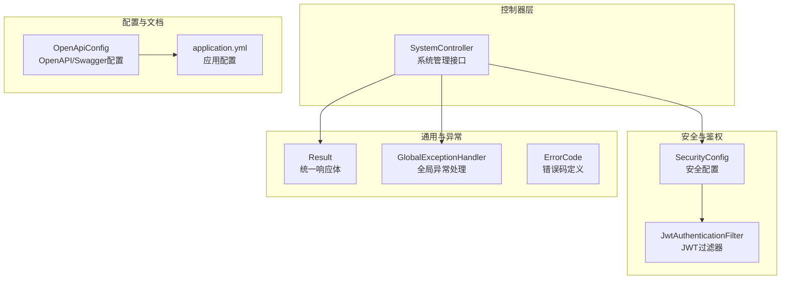
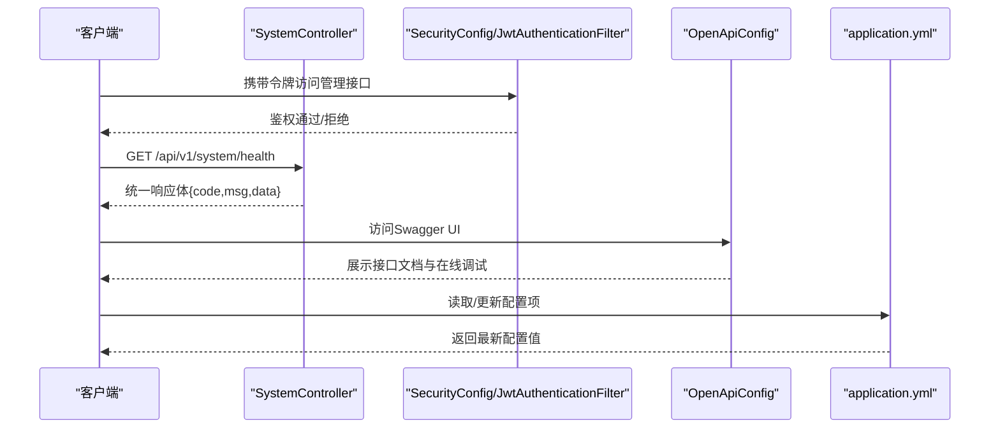
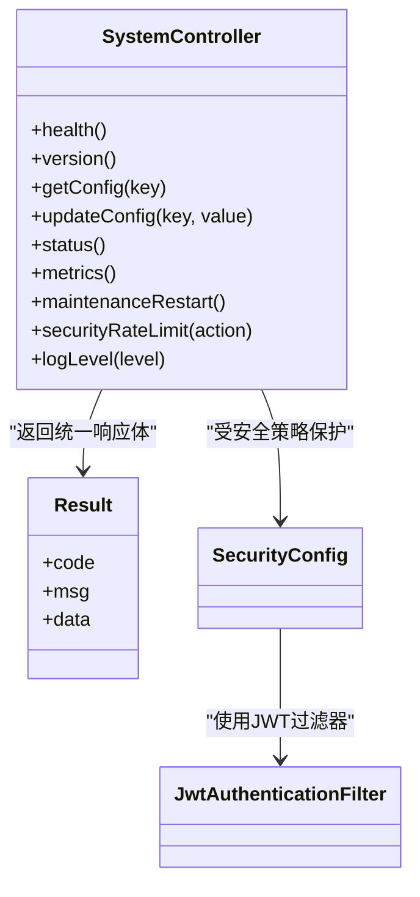
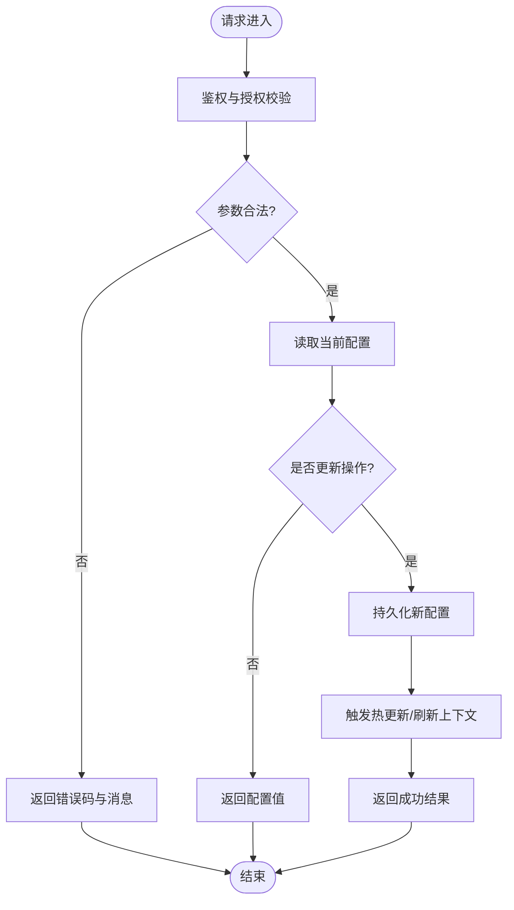
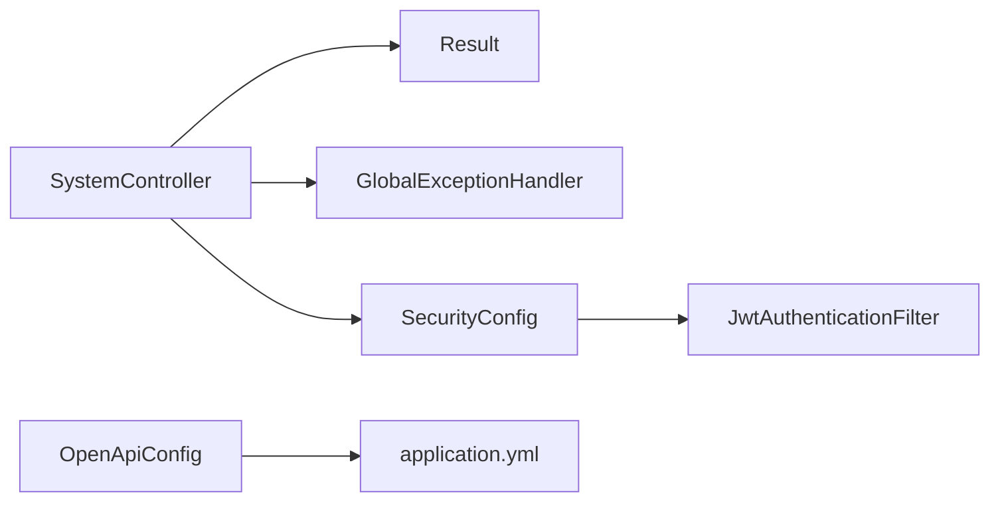

# 系统管理API

<cite>
**本文引用的文件**   
- [SystemController.java](file://src/main/java/com/ailearn/controller/SystemController.java)
- [OpenApiConfig.java](file://src/main/java/com/ailearn/config/OpenApiConfig.java)
- [application.yml](file://src/main/resources/application.yml)
- [GlobalExceptionHandler.java](file://src/main/java/com/ailearn/common/GlobalExceptionHandler.java)
- [Result.java](file://src/main/java/com/ailearn/common/Result.java)
- [ErrorCode.java](file://src/main/java/com/ailearn/common/ErrorCode.java)
- [SecurityConfig.java](file://src/main/java/com/ailearn/security/SecurityConfig.java)
- [JwtAuthenticationFilter.java](file://src/main/java/com/ailearn/security/JwtAuthenticationFilter.java)
</cite>

## 目录
1. [简介](#简介)
2. [项目结构](#项目结构)
3. [核心组件](#核心组件)
4. [架构总览](#架构总览)
5. [详细组件分析](#详细组件分析)
6. [依赖分析](#依赖分析)
7. [性能考虑](#性能考虑)
8. [故障排查指南](#故障排查指南)
9. [结论](#结论)
10. [附录](#附录)

## 简介
本文件面向运维与平台管理员，系统化说明“系统管理API”的接口能力与使用方式，覆盖：
- 系统健康检查、版本信息、配置管理等基础设施接口
- 系统状态监控与资源使用情况查询
- OpenAPI/Swagger文档的访问与使用指南
- 系统配置的热更新与管理接口（含安全策略）
- 系统维护与安全相关管理功能说明
- 接口版本管理与向后兼容性策略

## 项目结构
系统管理API位于后端控制层，统一由全局异常处理器与通用响应体封装；OpenAPI文档通过配置类暴露；安全与鉴权由安全配置与JWT过滤器保障。

图表来源
- [SystemController.java](file://src/main/java/com/ailearn/controller/SystemController.java)
- [OpenApiConfig.java](file://src/main/java/com/ailearn/config/OpenApiConfig.java)
- [application.yml](file://src/main/resources/application.yml)
- [SecurityConfig.java](file://src/main/java/com/ailearn/security/SecurityConfig.java)
- [JwtAuthenticationFilter.java](file://src/main/java/com/ailearn/security/JwtAuthenticationFilter.java)
- [Result.java](file://src/main/java/com/ailearn/common/Result.java)
- [GlobalExceptionHandler.java](file://src/main/java/com/ailearn/common/GlobalExceptionHandler.java)
- [ErrorCode.java](file://src/main/java/com/ailearn/common/ErrorCode.java)

章节来源
- [SystemController.java](file://src/main/java/com/ailearn/controller/SystemController.java)
- [OpenApiConfig.java](file://src/main/java/com/ailearn/config/OpenApiConfig.java)
- [application.yml](file://src/main/resources/application.yml)
- [SecurityConfig.java](file://src/main/java/com/ailearn/security/SecurityConfig.java)
- [JwtAuthenticationFilter.java](file://src/main/java/com/ailearn/security/JwtAuthenticationFilter.java)
- [Result.java](file://src/main/java/com/ailearn/common/Result.java)
- [GlobalExceptionHandler.java](file://src/main/java/com/ailearn/common/GlobalExceptionHandler.java)
- [ErrorCode.java](file://src/main/java/com/ailearn/common/ErrorCode.java)

## 核心组件
- 系统管理控制器：提供健康检查、版本信息、配置读取/更新、状态与资源监控等管理端点。
- OpenAPI/Swagger配置：集中声明文档元数据、分组与访问路径。
- 统一响应体与错误码：所有接口返回统一结构，便于前端与自动化集成。
- 全局异常处理：将业务异常与系统异常转换为标准错误响应。
- 安全与鉴权：对管理接口进行访问控制与权限校验。

章节来源
- [SystemController.java](file://src/main/java/com/ailearn/controller/SystemController.java)
- [OpenApiConfig.java](file://src/main/java/com/ailearn/config/OpenApiConfig.java)
- [Result.java](file://src/main/java/com/ailearn/common/Result.java)
- [GlobalExceptionHandler.java](file://src/main/java/com/ailearn/common/GlobalExceptionHandler.java)
- [ErrorCode.java](file://src/main/java/com/ailearn/common/ErrorCode.java)
- [SecurityConfig.java](file://src/main/java/com/ailearn/security/SecurityConfig.java)
- [JwtAuthenticationFilter.java](file://src/main/java/com/ailearn/security/JwtAuthenticationFilter.java)

## 架构总览
系统管理API遵循“控制器-服务-配置-安全-文档”的分层设计，对外暴露REST接口，对内通过配置中心或本地配置文件获取运行时参数，并通过OpenAPI文档提供在线交互能力。

图表来源
- [SystemController.java](file://src/main/java/com/ailearn/controller/SystemController.java)
- [OpenApiConfig.java](file://src/main/java/com/ailearn/config/OpenApiConfig.java)
- [application.yml](file://src/main/resources/application.yml)
- [SecurityConfig.java](file://src/main/java/com/ailearn/security/SecurityConfig.java)
- [JwtAuthenticationFilter.java](file://src/main/java/com/ailearn/security/JwtAuthenticationFilter.java)

## 详细组件分析

### 系统管理控制器（SystemController）
职责
- 健康检查：返回服务存活与关键依赖状态
- 版本信息：返回应用版本、构建时间、运行环境等
- 配置管理：读取与热更新系统配置（受安全策略保护）
- 状态与资源监控：返回JVM内存、线程、磁盘、数据库连接池等指标
- 维护与安全：提供重启提示、限流开关、日志级别调整等管理操作

接口约定
- 基础路径：/api/v1/system
- 统一响应体：Result<T>
- 鉴权：默认需要管理员角色或特定令牌
- 幂等性：查询类接口保证幂等；写类接口需幂等设计或幂等键

示例端点（以路径与语义描述为准）
- GET /api/v1/system/health
- GET /api/v1/system/version
- GET /api/v1/system/config/{key}
- PUT /api/v1/system/config/{key}
- GET /api/v1/system/status
- GET /api/v1/system/metrics
- POST /api/v1/system/maintenance/restart
- PATCH /api/v1/system/security/rate-limit
- GET /api/v1/system/log-level

章节来源
- [SystemController.java](file://src/main/java/com/ailearn/controller/SystemController.java)
- [Result.java](file://src/main/java/com/ailearn/common/Result.java)
- [SecurityConfig.java](file://src/main/java/com/ailearn/security/SecurityConfig.java)

#### 类关系图（代码级）

图表来源
- [SystemController.java](file://src/main/java/com/ailearn/controller/SystemController.java)
- [Result.java](file://src/main/java/com/ailearn/common/Result.java)
- [SecurityConfig.java](file://src/main/java/com/ailearn/security/SecurityConfig.java)
- [JwtAuthenticationFilter.java](file://src/main/java/com/ailearn/security/JwtAuthenticationFilter.java)

### OpenAPI/Swagger文档
- 文档入口：通过OpenApiConfig暴露UI与JSON/YAML规范
- 访问地址：通常为 /swagger-ui.html 或 /v3/api-docs
- 分组与标签：按“系统管理”、“安全”、“配置”等分组组织
- 认证集成：在文档中注入Bearer Token以便在线调试

章节来源
- [OpenApiConfig.java](file://src/main/java/com/ailearn/config/OpenApiConfig.java)
- [application.yml](file://src/main/resources/application.yml)

### 统一响应体与错误码
- 统一响应体：Result<T>包含code、msg、data字段，便于前后端一致解析
- 错误码：ErrorCode定义业务错误码与HTTP状态映射
- 全局异常处理：GlobalExceptionHandler捕获未处理异常并转为Result错误响应

章节来源
- [Result.java](file://src/main/java/com/ailearn/common/Result.java)
- [ErrorCode.java](file://src/main/java/com/ailearn/common/ErrorCode.java)
- [GlobalExceptionHandler.java](file://src/main/java/com/ailearn/common/GlobalExceptionHandler.java)

### 安全与鉴权
- 安全策略：SecurityConfig定义受保护路径、角色与放行规则
- JWT过滤器：JwtAuthenticationFilter负责令牌校验与上下文注入
- 管理接口默认要求管理员权限，建议结合RBAC扩展

章节来源
- [SecurityConfig.java](file://src/main/java/com/ailearn/security/SecurityConfig.java)
- [JwtAuthenticationFilter.java](file://src/main/java/com/ailearn/security/JwtAuthenticationFilter.java)

### 配置管理流程（热更新）

图表来源
- [SystemController.java](file://src/main/java/com/ailearn/controller/SystemController.java)
- [application.yml](file://src/main/resources/application.yml)
- [GlobalExceptionHandler.java](file://src/main/java/com/ailearn/common/GlobalExceptionHandler.java)

## 依赖分析
- 控制器依赖统一响应体与全局异常处理，确保一致的输出格式
- 安全配置与JWT过滤器为管理接口提供访问控制
- OpenAPI配置依赖应用配置以启用文档与访问路径

图表来源
- [SystemController.java](file://src/main/java/com/ailearn/controller/SystemController.java)
- [Result.java](file://src/main/java/com/ailearn/common/Result.java)
- [GlobalExceptionHandler.java](file://src/main/java/com/ailearn/common/GlobalExceptionHandler.java)
- [SecurityConfig.java](file://src/main/java/com/ailearn/security/SecurityConfig.java)
- [JwtAuthenticationFilter.java](file://src/main/java/com/ailearn/security/JwtAuthenticationFilter.java)
- [OpenApiConfig.java](file://src/main/java/com/ailearn/config/OpenApiConfig.java)
- [application.yml](file://src/main/resources/application.yml)

章节来源
- [SystemController.java](file://src/main/java/com/ailearn/controller/SystemController.java)
- [OpenApiConfig.java](file://src/main/java/com/ailearn/config/OpenApiConfig.java)
- [application.yml](file://src/main/resources/application.yml)
- [SecurityConfig.java](file://src/main/java/com/ailearn/security/SecurityConfig.java)
- [JwtAuthenticationFilter.java](file://src/main/java/com/ailearn/security/JwtAuthenticationFilter.java)
- [Result.java](file://src/main/java/com/ailearn/common/Result.java)
- [GlobalExceptionHandler.java](file://src/main/java/com/ailearn/common/GlobalExceptionHandler.java)
- [ErrorCode.java](file://src/main/java/com/ailearn/common/ErrorCode.java)

## 性能考虑
- 健康检查与版本接口应轻量且无外部依赖阻塞
- 监控指标采集避免频繁I/O，必要时引入缓存或异步采样
- 配置热更新需具备幂等性与并发安全，避免重复写入与竞态条件
- 对敏感管理接口增加速率限制与审计日志

[本节为通用指导，无需源码引用]

## 故障排查指南
- 统一错误码：优先根据ErrorCode定位问题类别
- 全局异常：查看GlobalExceptionHandler的日志与堆栈
- 鉴权失败：确认JWT令牌有效性与角色权限
- 配置更新失败：检查参数合法性、权限与持久化存储状态

章节来源
- [ErrorCode.java](file://src/main/java/com/ailearn/common/ErrorCode.java)
- [GlobalExceptionHandler.java](file://src/main/java/com/ailearn/common/GlobalExceptionHandler.java)
- [SecurityConfig.java](file://src/main/java/com/ailearn/security/SecurityConfig.java)
- [JwtAuthenticationFilter.java](file://src/main/java/com/ailearn/security/JwtAuthenticationFilter.java)

## 结论
系统管理API以清晰的分层与统一的响应体为基础，结合OpenAPI文档与安全策略，为运维与平台管理提供了稳定、可观测、可配置的接口体系。建议在后续迭代中完善指标采集、审计日志与灰度发布策略，进一步提升系统的可维护性与安全性。

[本节为总结性内容，无需源码引用]

## 附录

### OpenAPI/Swagger使用指南
- 访问文档：打开浏览器访问 /swagger-ui.html 或 /v3/api-docs
- 在线调试：在文档页面选择具体接口，点击“Try it out”，填写请求参数并执行
- 认证：在文档页设置Authorization头为Bearer Token，或使用提供的登录接口获取令牌后填入
- 导出规范：从 /v3/api-docs 下载JSON/YAML用于第三方工具集成

章节来源
- [OpenApiConfig.java](file://src/main/java/com/ailearn/config/OpenApiConfig.java)
- [application.yml](file://src/main/resources/application.yml)

### 接口版本管理与向后兼容策略
- 版本前缀：所有管理接口采用 /api/v1/* 前缀，便于未来演进
- 弃用策略：旧版本保留至少一个主版本周期，并在文档中标注弃用标记
- 变更原则：新增字段保持可选；删除字段需迁移期与降级兼容；破坏性变更必须升级主版本
- 兼容性测试：在CI中加入契约测试与回归用例，确保下游不受影响

[本节为通用策略，无需源码引用]