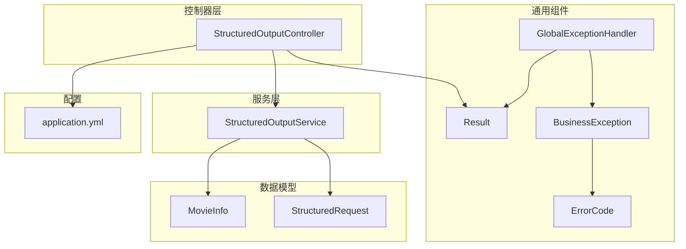
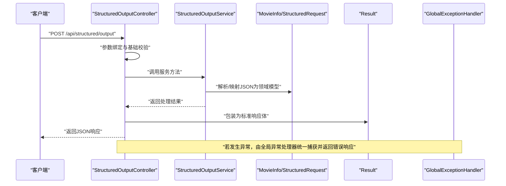
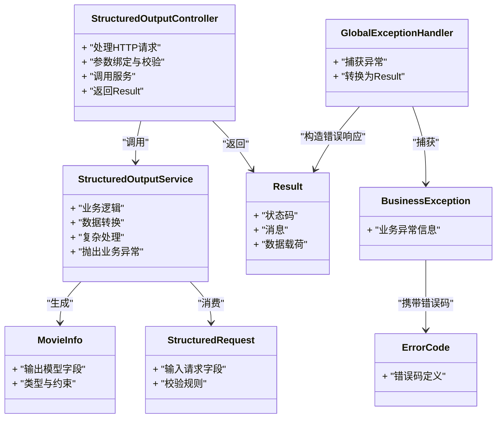

# 结构化输出API

<cite>
**本文引用的文件**   
- [StructuredOutputController.java](file://src/main/java/com/ailearn/structured/StructuredOutputController.java)
- [StructuredOutputService.java](file://src/main/java/com/ailearn/structured/StructuredOutputService.java)
- [MovieInfo.java](file://src/main/java/com/ailearn/structured/MovieInfo.java)
- [StructuredRequest.java](file://src/main/java/com/ailearn/dto/StructuredRequest.java)
- [Result.java](file://src/main/java/com/ailearn/common/Result.java)
- [GlobalExceptionHandler.java](file://src/main/java/com/ailearn/common/GlobalExceptionHandler.java)
- [BusinessException.java](file://src/main/java/com/ailearn/common/BusinessException.java)
- [ErrorCode.java](file://src/main/java/com/ailearn/common/ErrorCode.java)
- [application.yml](file://src/main/resources/application.yml)
</cite>

## 目录
1. [简介](#简介)
2. [项目结构](#项目结构)
3. [核心组件](#核心组件)
4. [架构总览](#架构总览)
5. [详细组件分析](#详细组件分析)
6. [依赖关系分析](#依赖关系分析)
7. [性能考虑](#性能考虑)
8. [故障排查指南](#故障排查指南)
9. [结论](#结论)
10. [附录](#附录)

## 简介
本文件面向“结构化输出”能力，提供统一的API接口文档与实现说明。重点覆盖：
- JSON格式数据的接收、校验与类型安全
- 结构化响应规范与错误处理约定
- 数据模型定义与转换机制
- 复杂数据结构与嵌套对象支持
- 完整的请求/响应示例与错误码说明
- 验证最佳实践与性能优化建议

## 项目结构
结构化输出相关代码位于后端Java模块的 structured 包中，包含控制器、服务与数据模型；通用响应封装与异常处理位于 common 包；DTO 定义位于 dto 包；应用配置位于 resources/application.yml。

图表来源
- [StructuredOutputController.java](file://src/main/java/com/ailearn/structured/StructuredOutputController.java)
- [StructuredOutputService.java](file://src/main/java/com/ailearn/structured/StructuredOutputService.java)
- [MovieInfo.java](file://src/main/java/com/ailearn/structured/MovieInfo.java)
- [StructuredRequest.java](file://src/main/java/com/ailearn/dto/StructuredRequest.java)
- [Result.java](file://src/main/java/com/ailearn/common/Result.java)
- [GlobalExceptionHandler.java](file://src/main/java/com/ailearn/common/GlobalExceptionHandler.java)
- [BusinessException.java](file://src/main/java/com/ailearn/common/BusinessException.java)
- [ErrorCode.java](file://src/main/java/com/ailearn/common/ErrorCode.java)
- [application.yml](file://src/main/resources/application.yml)

章节来源
- [StructuredOutputController.java](file://src/main/java/com/ailearn/structured/StructuredOutputController.java)
- [StructuredOutputService.java](file://src/main/java/com/ailearn/structured/StructuredOutputService.java)
- [MovieInfo.java](file://src/main/java/com/ailearn/structured/MovieInfo.java)
- [StructuredRequest.java](file://src/main/java/com/ailearn/dto/StructuredRequest.java)
- [Result.java](file://src/main/java/com/ailearn/common/Result.java)
- [GlobalExceptionHandler.java](file://src/main/java/com/ailearn/common/GlobalExceptionHandler.java)
- [BusinessException.java](file://src/main/java/com/ailearn/common/BusinessException.java)
- [ErrorCode.java](file://src/main/java/com/ailearn/common/ErrorCode.java)
- [application.yml](file://src/main/resources/application.yml)

## 核心组件
- 控制器：负责HTTP路由、参数绑定、基础校验与统一响应包装。
- 服务：承载业务逻辑，完成JSON到领域模型的映射、复杂数据处理与结果组装。
- 数据模型：定义输入请求与输出结构的字段、约束与类型。
- 通用组件：统一响应体 Result、全局异常处理器 GlobalExceptionHandler、业务异常 BusinessException 与错误码 ErrorCode。
- 配置：应用级配置项（如端口、序列化策略等）。

章节来源
- [StructuredOutputController.java](file://src/main/java/com/ailearn/structured/StructuredOutputController.java)
- [StructuredOutputService.java](file://src/main/java/com/ailearn/structured/StructuredOutputService.java)
- [MovieInfo.java](file://src/main/java/com/ailearn/structured/MovieInfo.java)
- [StructuredRequest.java](file://src/main/java/com/ailearn/dto/StructuredRequest.java)
- [Result.java](file://src/main/java/com/ailearn/common/Result.java)
- [GlobalExceptionHandler.java](file://src/main/java/com/ailearn/common/GlobalExceptionHandler.java)
- [BusinessException.java](file://src/main/java/com/ailearn/common/BusinessException.java)
- [ErrorCode.java](file://src/main/java/com/ailearn/common/ErrorCode.java)

## 架构总览
下图展示了从客户端请求到结构化响应的完整调用链，包括参数校验、业务处理、异常捕获与统一返回。

图表来源
- [StructuredOutputController.java](file://src/main/java/com/ailearn/structured/StructuredOutputController.java)
- [StructuredOutputService.java](file://src/main/java/com/ailearn/structured/StructuredOutputService.java)
- [MovieInfo.java](file://src/main/java/com/ailearn/structured/MovieInfo.java)
- [StructuredRequest.java](file://src/main/java/com/ailearn/dto/StructuredRequest.java)
- [Result.java](file://src/main/java/com/ailearn/common/Result.java)
- [GlobalExceptionHandler.java](file://src/main/java/com/ailearn/common/GlobalExceptionHandler.java)

## 详细组件分析

### 控制器：StructuredOutputController
职责
- 暴露REST端点，接收结构化输入请求。
- 进行参数绑定与基础校验（如必填字段、长度限制等）。
- 调用服务层执行具体逻辑。
- 使用统一响应体 Result 包装成功或失败结果。

关键流程
- 接收请求体并绑定到 DTO。
- 触发业务处理。
- 将结果封装为 Result 返回。

章节来源
- [StructuredOutputController.java](file://src/main/java/com/ailearn/structured/StructuredOutputController.java)
- [Result.java](file://src/main/java/com/ailearn/common/Result.java)

### 服务：StructuredOutputService
职责
- 实现结构化输出的核心业务逻辑。
- 将输入DTO转换为领域模型（如 MovieInfo），并进行复杂数据处理。
- 处理嵌套对象、集合与枚举等类型的安全转换。
- 抛出业务异常以驱动统一错误处理。

关键流程
- 校验输入完整性与合法性。
- 执行数据转换与计算。
- 组装结构化输出结果。

章节来源
- [StructuredOutputService.java](file://src/main/java/com/ailearn/structured/StructuredOutputService.java)
- [MovieInfo.java](file://src/main/java/com/ailearn/structured/MovieInfo.java)
- [StructuredRequest.java](file://src/main/java/com/ailearn/dto/StructuredRequest.java)

### 数据模型：MovieInfo 与 StructuredRequest
设计要点
- 字段类型明确，避免运行时类型歧义。
- 对字符串字段设置长度与格式约束。
- 对数值字段设置范围约束。
- 对枚举字段限定取值集合。
- 支持嵌套对象与数组，便于表达复杂结构。

章节来源
- [MovieInfo.java](file://src/main/java/com/ailearn/structured/MovieInfo.java)
- [StructuredRequest.java](file://src/main/java/com/ailearn/dto/StructuredRequest.java)

### 统一响应体：Result
设计要点
- 提供标准字段：状态码、消息、数据载荷。
- 提供便捷构造方法，简化成功/失败响应构建。
- 保证前后端一致的结构化契约。

章节来源
- [Result.java](file://src/main/java/com/ailearn/common/Result.java)

### 全局异常处理：GlobalExceptionHandler
职责
- 捕获控制器与服务层抛出的异常。
- 将异常转换为标准错误响应（Result）。
- 区分业务异常与系统异常，返回不同错误码与提示。

章节来源
- [GlobalExceptionHandler.java](file://src/main/java/com/ailearn/common/GlobalExceptionHandler.java)
- [BusinessException.java](file://src/main/java/com/ailearn/common/BusinessException.java)
- [ErrorCode.java](file://src/main/java/com/ailearn/common/ErrorCode.java)

### 配置：application.yml
关注点
- 服务器端口与上下文路径。
- Jackson序列化配置（如空值处理、日期格式）。
- 日志级别与追踪ID注入（可选）。

章节来源
- [application.yml](file://src/main/resources/application.yml)

## 依赖关系分析
- 控制器依赖服务与统一响应体。
- 服务依赖输入DTO与输出模型。
- 全局异常处理器依赖业务异常与错误码。
- 配置影响序列化行为与运行环境。

图表来源
- [StructuredOutputController.java](file://src/main/java/com/ailearn/structured/StructuredOutputController.java)
- [StructuredOutputService.java](file://src/main/java/com/ailearn/structured/StructuredOutputService.java)
- [MovieInfo.java](file://src/main/java/com/ailearn/structured/MovieInfo.java)
- [StructuredRequest.java](file://src/main/java/com/ailearn/dto/StructuredRequest.java)
- [Result.java](file://src/main/java/com/ailearn/common/Result.java)
- [GlobalExceptionHandler.java](file://src/main/java/com/ailearn/common/GlobalExceptionHandler.java)
- [BusinessException.java](file://src/main/java/com/ailearn/common/BusinessException.java)
- [ErrorCode.java](file://src/main/java/com/ailearn/common/ErrorCode.java)

## 性能考虑
- 合理设置请求体大小上限，避免过大JSON导致内存压力。
- 使用Jackson时关闭不必要的序列化特性（如默认写入null字段）以减少响应体积。
- 对复杂对象转换采用批量处理与缓存策略，减少重复计算。
- 在控制器层尽早进行轻量校验，快速失败，降低服务层负担。
- 对频繁访问的配置项进行常量缓存，避免重复读取。

[本节为通用指导，不直接分析具体文件]

## 故障排查指南
常见问题与定位步骤
- 参数校验失败：检查请求体字段是否缺失或类型不符，确认DTO约束是否正确。
- 业务异常：查看错误码与消息，定位服务层抛出的业务异常原因。
- 系统异常：通过全局异常处理器返回的错误响应，结合日志定位根因。
- 序列化问题：检查application.yml中的Jackson配置，确保日期与空值处理符合预期。

章节来源
- [GlobalExceptionHandler.java](file://src/main/java/com/ailearn/common/GlobalExceptionHandler.java)
- [BusinessException.java](file://src/main/java/com/ailearn/common/BusinessException.java)
- [ErrorCode.java](file://src/main/java/com/ailearn/common/ErrorCode.java)
- [application.yml](file://src/main/resources/application.yml)

## 结论
本结构化输出API通过清晰的控制器-服务分层、严格的数据模型定义与统一响应/异常处理机制，实现了高内聚、低耦合且易于维护的结构化数据处理能力。遵循本文档的验证与性能建议，可进一步提升系统的稳定性与吞吐表现。

[本节为总结性内容，不直接分析具体文件]

## 附录

### API定义与示例

- 接口名称：结构化输出
- 请求路径：/api/structured/output
- 请求方法：POST
- 请求头：Content-Type: application/json
- 请求体：StructuredRequest（见下方字段说明）
- 响应体：Result<MovieInfo>（见下方字段说明）

请求示例（字段说明）
- 请求体字段
  - title: 字符串，必填，最大长度限制
  - year: 整数，必填，年份范围校验
  - genres: 字符串数组，非必填，元素为枚举值
  - rating: 浮点数，非必填，范围校验
  - director: 对象，非必填，包含 name 与 nationality 字段
  - tags: 字符串数组，非必填，标签集合

响应示例（字段说明）
- 响应体字段
  - code: 整数，状态码
  - message: 字符串，提示信息
  - data: 对象，MovieInfo结构
    - id: 字符串，唯一标识
    - title: 字符串，电影标题
    - year: 整数，上映年份
    - genres: 字符串数组，类型列表
    - rating: 浮点数，评分
    - director: 对象，导演信息
      - name: 字符串，姓名
      - nationality: 字符串，国籍
    - tags: 字符串数组，标签列表

错误响应示例
- 当请求体校验失败或服务层抛出业务异常时，返回统一错误响应：
  - code: 错误码（参考ErrorCode）
  - message: 错误描述
  - data: null

章节来源
- [StructuredOutputController.java](file://src/main/java/com/ailearn/structured/StructuredOutputController.java)
- [StructuredOutputService.java](file://src/main/java/com/ailearn/structured/StructuredOutputService.java)
- [StructuredRequest.java](file://src/main/java/com/ailearn/dto/StructuredRequest.java)
- [MovieInfo.java](file://src/main/java/com/ailearn/structured/MovieInfo.java)
- [Result.java](file://src/main/java/com/ailearn/common/Result.java)
- [ErrorCode.java](file://src/main/java/com/ailearn/common/ErrorCode.java)

### 数据验证最佳实践
- 在DTO层声明式校验（如必填、长度、范围、枚举），配合控制器层自动校验。
- 对嵌套对象与数组进行递归校验，确保深层结构合法。
- 对敏感字段进行脱敏与白名单过滤。
- 对外部不可信输入进行严格边界检查与类型转换。

章节来源
- [StructuredRequest.java](file://src/main/java/com/ailearn/dto/StructuredRequest.java)
- [MovieInfo.java](file://src/main/java/com/ailearn/structured/MovieInfo.java)

### 复杂数据结构与嵌套对象支持
- 支持多层嵌套对象，建议在DTO中显式定义每个层级字段与约束。
- 对集合类型使用明确的元素类型与长度限制，避免无限增长。
- 对枚举字段使用受限集合，防止非法值进入系统。

章节来源
- [StructuredRequest.java](file://src/main/java/com/ailearn/dto/StructuredRequest.java)
- [MovieInfo.java](file://src/main/java/com/ailearn/structured/MovieInfo.java)

### 类型安全与转换机制
- 使用强类型DTO与领域模型，避免字符串拼接与反射带来的不确定性。
- 在服务层进行显式类型转换与格式化，确保输出一致性。
- 对日期、金额等数值类型使用专用类型与精度控制。

章节来源
- [StructuredOutputService.java](file://src/main/java/com/ailearn/structured/StructuredOutputService.java)
- [MovieInfo.java](file://src/main/java/com/ailearn/structured/MovieInfo.java)