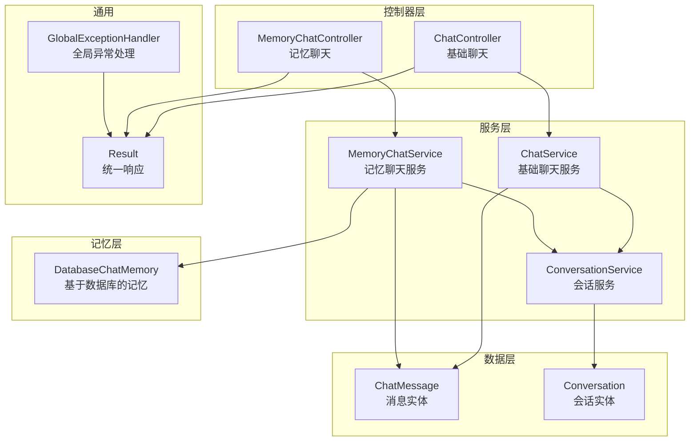
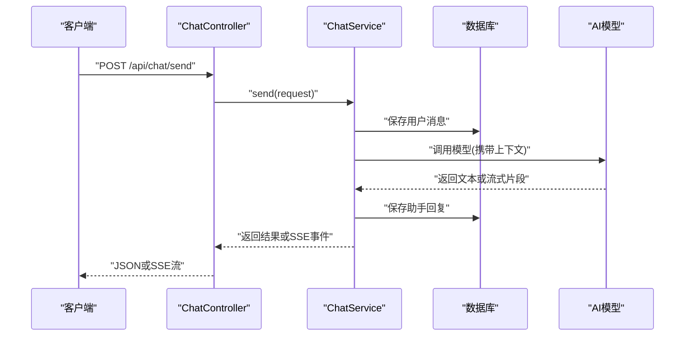
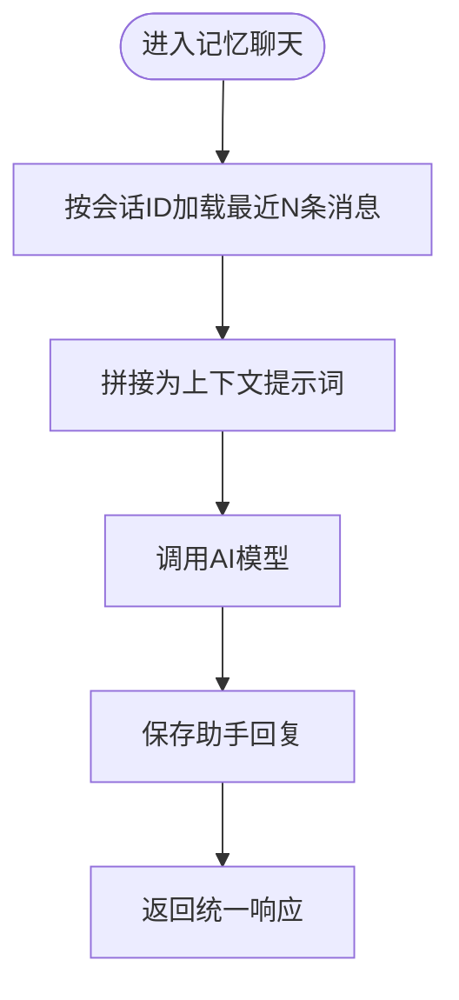
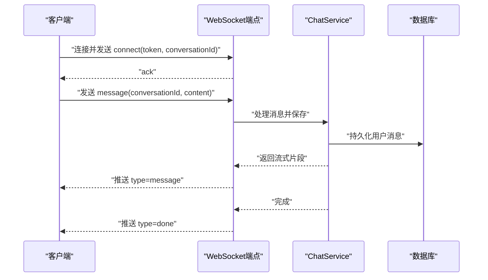
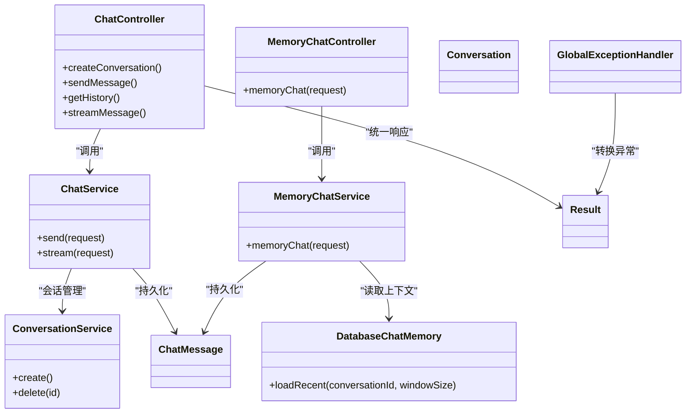
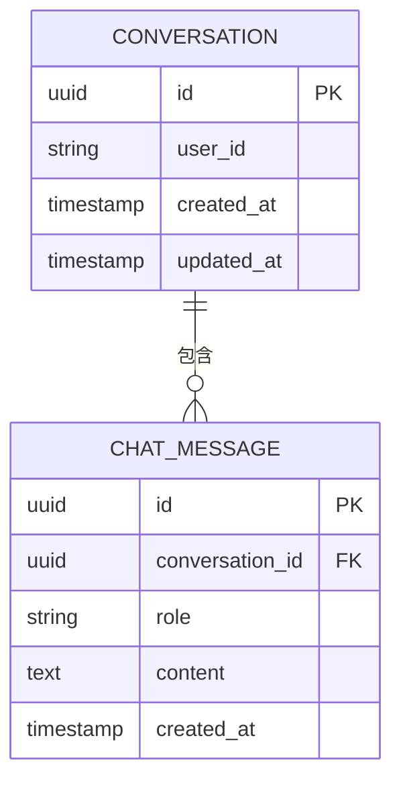

# 聊天对话API

<cite>
**本文引用的文件**   
- [ChatController.java](file://src/main/java/com/ailearn/chat/ChatController.java)
- [ChatService.java](file://src/main/java/com/ailearn/chat/ChatService.java)
- [MemoryChatController.java](file://src/main/java/com/ailearn/memory/MemoryChatController.java)
- [MemoryChatService.java](file://src/main/java/com/ailearn/memory/MemoryChatService.java)
- [DatabaseChatMemory.java](file://src/main/java/com/ailearn/memory/DatabaseChatMemory.java)
- [ConversationService.java](file://src/main/java/com/ailearn/service/ConversationService.java)
- [ChatMessage.java](file://src/main/java/com/ailearn/entity/ChatMessage.java)
- [Conversation.java](file://src/main/java/com/ailearn/entity/Conversation.java)
- [ChatRequest.java](file://src/main/java/com/ailearn/dto/ChatRequest.java)
- [MemoryChatRequest.java](file://src/main/java/com/ailearn/dto/MemoryChatRequest.java)
- [Result.java](file://src/main/java/com/ailearn/common/Result.java)
- [GlobalExceptionHandler.java](file://src/main/java/com/ailearn/common/GlobalExceptionHandler.java)
- [BusinessException.java](file://src/main/java/com/ailearn/common/BusinessException.java)
- [ErrorCode.java](file://src/main/java/com/ailearn/common/ErrorCode.java)
- [schema.sql](file://src/main/resources/schema.sql)
</cite>

## 目录
1. [简介](#简介)
2. [项目结构](#项目结构)
3. [核心组件](#核心组件)
4. [架构总览](#架构总览)
5. [详细组件分析](#详细组件分析)
6. [依赖关系分析](#依赖关系分析)
7. [性能考虑](#性能考虑)
8. [故障排查指南](#故障排查指南)
9. [结论](#结论)
10. [附录](#附录)

## 简介
本文件为聊天对话系统的API接口文档，覆盖基础聊天、会话管理、记忆系统等能力。内容包含：
- 消息发送与接收（含流式响应）
- 历史消息查询与会话管理
- 多轮对话上下文管理机制
- WebSocket实时通信协议与消息格式
- 请求/响应示例与错误处理方案
- 会话持久化与状态管理策略

## 项目结构
后端采用分层架构：控制器层暴露REST与WebSocket接口；服务层封装业务逻辑；数据访问层通过实体与映射器操作数据库；通用模块提供统一响应体与异常处理。

图表来源
- [ChatController.java](file://src/main/java/com/ailearn/chat/ChatController.java)
- [ChatService.java](file://src/main/java/com/ailearn/chat/ChatService.java)
- [MemoryChatController.java](file://src/main/java/com/ailearn/memory/MemoryChatController.java)
- [MemoryChatService.java](file://src/main/java/com/ailearn/memory/MemoryChatService.java)
- [DatabaseChatMemory.java](file://src/main/java/com/ailearn/memory/DatabaseChatMemory.java)
- [ConversationService.java](file://src/main/java/com/ailearn/service/ConversationService.java)
- [ChatMessage.java](file://src/main/java/com/ailearn/entity/ChatMessage.java)
- [Conversation.java](file://src/main/java/com/ailearn/entity/Conversation.java)
- [Result.java](file://src/main/java/com/ailearn/common/Result.java)
- [GlobalExceptionHandler.java](file://src/main/java/com/ailearn/common/GlobalExceptionHandler.java)

章节来源
- [ChatController.java](file://src/main/java/com/ailearn/chat/ChatController.java)
- [ChatService.java](file://src/main/java/com/ailearn/chat/ChatService.java)
- [MemoryChatController.java](file://src/main/java/com/ailearn/memory/MemoryChatController.java)
- [MemoryChatService.java](file://src/main/java/com/ailearn/memory/MemoryChatService.java)
- [DatabaseChatMemory.java](file://src/main/java/com/ailearn/memory/DatabaseChatMemory.java)
- [ConversationService.java](file://src/main/java/com/ailearn/service/ConversationService.java)
- [ChatMessage.java](file://src/main/java/com/ailearn/entity/ChatMessage.java)
- [Conversation.java](file://src/main/java/com/ailearn/entity/Conversation.java)
- [Result.java](file://src/main/java/com/ailearn/common/Result.java)
- [GlobalExceptionHandler.java](file://src/main/java/com/ailearn/common/GlobalExceptionHandler.java)

## 核心组件
- ChatController：提供基础聊天的REST与SSE接口，支持创建会话、发送消息、获取历史等。
- ChatService：封装基础聊天流程，负责消息落库、调用AI模型、组装流式片段返回。
- MemoryChatController：提供带记忆的聊天接口，自动维护上下文窗口。
- MemoryChatService：结合记忆存储与对话历史，生成带上下文的回复。
- DatabaseChatMemory：将对话历史持久化到数据库，按会话ID检索最近N条消息作为上下文。
- ConversationService：会话生命周期管理（创建、切换、删除）。
- Result/GlobalExceptionHandler：统一响应结构与全局异常处理。

章节来源
- [ChatController.java](file://src/main/java/com/ailearn/chat/ChatController.java)
- [ChatService.java](file://src/main/java/com/ailearn/chat/ChatService.java)
- [MemoryChatController.java](file://src/main/java/com/ailearn/memory/MemoryChatController.java)
- [MemoryChatService.java](file://src/main/java/com/ailearn/memory/MemoryChatService.java)
- [DatabaseChatMemory.java](file://src/main/java/com/ailearn/memory/DatabaseChatMemory.java)
- [ConversationService.java](file://src/main/java/com/ailearn/service/ConversationService.java)
- [Result.java](file://src/main/java/com/ailearn/common/Result.java)
- [GlobalExceptionHandler.java](file://src/main/java/com/ailearn/common/GlobalExceptionHandler.java)

## 架构总览
系统对外暴露三类接口：
- REST API：用于常规请求/响应交互（如创建会话、发送消息、查询历史）。
- SSE（Server-Sent Events）：用于服务端推送流式片段，适合逐字输出。
- WebSocket：用于双向实时通信，适合长连接场景。

图表来源
- [ChatController.java](file://src/main/java/com/ailearn/chat/ChatController.java)
- [ChatService.java](file://src/main/java/com/ailearn/chat/ChatService.java)

## 详细组件分析

### 基础聊天接口（REST + SSE）
- 功能要点
  - 创建会话：根据用户标识创建或复用会话。
  - 发送消息：提交用户输入，返回助手回复；支持SSE流式返回。
  - 历史查询：按会话ID分页获取历史消息。
- 关键路径
  - 创建会话：POST /api/chat/conversation/create
  - 发送消息：POST /api/chat/send
  - 历史消息：GET /api/chat/history?conversationId=...&page=...&size=...
  - SSE流式：GET /api/chat/stream?conversationId=...&message=...
- 请求参数（摘要）
  - conversationId：可选，未提供时由服务端创建新会话
  - message：用户输入文本
  - page/size：分页参数
- 响应结构
  - 统一响应体：code/message/data
  - data字段类型随接口不同而异（对象、列表、SSE事件）
- 错误码
  - 业务异常通过全局处理器转换为统一响应

章节来源
- [ChatController.java](file://src/main/java/com/ailearn/chat/ChatController.java)
- [ChatService.java](file://src/main/java/com/ailearn/chat/ChatService.java)
- [Result.java](file://src/main/java/com/ailearn/common/Result.java)
- [GlobalExceptionHandler.java](file://src/main/java/com/ailearn/common/GlobalExceptionHandler.java)

#### 请求/响应示例（REST）
- 发送消息
  - 请求
    - 方法：POST
    - 路径：/api/chat/send
    - 头部：Content-Type: application/json
    - 主体：{ "conversationId": "c1", "message": "你好" }
  - 成功响应
    - { "code": 200, "message": "成功", "data": { "id": "m1", "conversationId": "c1", "role": "assistant", "content": "你好！有什么可以帮你的？", "createdAt": "2026-01-01T00:00:00Z" } }
  - 失败响应
    - { "code": 400, "message": "参数校验失败", "data": null }
- 历史消息
  - 请求
    - 方法：GET
    - 路径：/api/chat/history?conversationId=c1&page=1&size=20
  - 成功响应
    - { "code": 200, "message": "成功", "data": { "total": 10, "page": 1, "size": 20, "items": [ {...}, {...} ] } }

章节来源
- [ChatController.java](file://src/main/java/com/ailearn/chat/ChatController.java)
- [ChatService.java](file://src/main/java/com/ailearn/chat/ChatService.java)
- [Result.java](file://src/main/java/com/ailearn/common/Result.java)

#### SSE流式响应说明
- 连接方式
  - GET /api/chat/stream?conversationId=...&message=...
  - 头部：Accept: text/event-stream
- 事件格式
  - 事件名：message
  - 数据块：每次推送一个增量片段
  - 结束事件：event: done
- 客户端建议
  - 使用EventSource或等效实现
  - 对网络抖动进行重连与去抖合并

章节来源
- [ChatController.java](file://src/main/java/com/ailearn/chat/ChatController.java)
- [ChatService.java](file://src/main/java/com/ailearn/chat/ChatService.java)

### 记忆聊天接口（上下文管理）
- 功能要点
  - 自动维护最近N条消息作为上下文
  - 支持指定上下文窗口大小
  - 会话内上下文按时间顺序拼接
- 关键路径
  - 发送消息（带记忆）：POST /api/memory/chat
- 请求参数（摘要）
  - conversationId：会话标识
  - message：用户输入
  - windowSize：上下文窗口大小（默认值可配置）
- 响应结构
  - 统一响应体，data为本次回复的消息对象
- 上下文构建流程

图表来源
- [MemoryChatController.java](file://src/main/java/com/ailearn/memory/MemoryChatController.java)
- [MemoryChatService.java](file://src/main/java/com/ailearn/memory/MemoryChatService.java)
- [DatabaseChatMemory.java](file://src/main/java/com/ailearn/memory/DatabaseChatMemory.java)

章节来源
- [MemoryChatController.java](file://src/main/java/com/ailearn/memory/MemoryChatController.java)
- [MemoryChatService.java](file://src/main/java/com/ailearn/memory/MemoryChatService.java)
- [DatabaseChatMemory.java](file://src/main/java/com/ailearn/memory/DatabaseChatMemory.java)

#### 请求/响应示例（记忆聊天）
- 请求
  - 方法：POST
  - 路径：/api/memory/chat
  - 主体：{ "conversationId": "c1", "message": "继续刚才的话题", "windowSize": 10 }
- 成功响应
  - { "code": 200, "message": "成功", "data": { "id": "m2", "conversationId": "c1", "role": "assistant", "content": "好的，我们继续...", "createdAt": "2026-01-01T00:01:00Z" } }

章节来源
- [MemoryChatController.java](file://src/main/java/com/ailearn/memory/MemoryChatController.java)
- [MemoryChatService.java](file://src/main/java/com/ailearn/memory/MemoryChatService.java)
- [Result.java](file://src/main/java/com/ailearn/common/Result.java)

### 会话管理接口
- 功能要点
  - 创建会话：根据用户或外部标识创建会话
  - 切换会话：后续消息指向新的会话ID
  - 删除会话：清理历史与上下文
- 关键路径
  - 创建会话：POST /api/chat/conversation/create
  - 删除会话：DELETE /api/chat/conversation/{conversationId}
- 响应结构
  - 统一响应体，data为会话对象

章节来源
- [ConversationService.java](file://src/main/java/com/ailearn/service/ConversationService.java)
- [ChatController.java](file://src/main/java/com/ailearn/chat/ChatController.java)
- [Result.java](file://src/main/java/com/ailearn/common/Result.java)

### WebSocket实时通信接口
- 连接建立
  - URL：ws://host/ws/chat
  - 握手后需发送认证消息（包含token或会话标识）
- 消息格式（JSON）
  - 客户端→服务端
    - type: "connect" | "message" | "ping"
    - payload: 包含conversationId、message等
  - 服务端→客户端
    - type: "message" | "done" | "error"
    - payload: 包含content、id、conversationId等
- 断线重连
  - 客户端在收到error或连接关闭后指数退避重连
  - 保持心跳（ping/pong）以维持连接活跃

章节来源
- [ChatController.java](file://src/main/java/com/ailearn/chat/ChatController.java)
- [ChatService.java](file://src/main/java/com/ailearn/chat/ChatService.java)

#### WebSocket交互时序

图表来源
- [ChatController.java](file://src/main/java/com/ailearn/chat/ChatController.java)
- [ChatService.java](file://src/main/java/com/ailearn/chat/ChatService.java)

## 依赖关系分析
- 控制器与服务解耦：控制器仅做参数校验与响应包装，业务逻辑下沉至服务层。
- 记忆与持久化：记忆层通过数据库读取历史消息，服务层负责上下文拼装与模型调用。
- 统一异常与响应：全局异常处理器捕获业务异常并转换为统一响应体。

图表来源
- [ChatController.java](file://src/main/java/com/ailearn/chat/ChatController.java)
- [ChatService.java](file://src/main/java/com/ailearn/chat/ChatService.java)
- [MemoryChatController.java](file://src/main/java/com/ailearn/memory/MemoryChatController.java)
- [MemoryChatService.java](file://src/main/java/com/ailearn/memory/MemoryChatService.java)
- [DatabaseChatMemory.java](file://src/main/java/com/ailearn/memory/DatabaseChatMemory.java)
- [ConversationService.java](file://src/main/java/com/ailearn/service/ConversationService.java)
- [ChatMessage.java](file://src/main/java/com/ailearn/entity/ChatMessage.java)
- [Conversation.java](file://src/main/java/com/ailearn/entity/Conversation.java)
- [Result.java](file://src/main/java/com/ailearn/common/Result.java)
- [GlobalExceptionHandler.java](file://src/main/java/com/ailearn/common/GlobalExceptionHandler.java)

章节来源
- [ChatController.java](file://src/main/java/com/ailearn/chat/ChatController.java)
- [ChatService.java](file://src/main/java/com/ailearn/chat/ChatService.java)
- [MemoryChatController.java](file://src/main/java/com/ailearn/memory/MemoryChatController.java)
- [MemoryChatService.java](file://src/main/java/com/ailearn/memory/MemoryChatService.java)
- [DatabaseChatMemory.java](file://src/main/java/com/ailearn/memory/DatabaseChatMemory.java)
- [ConversationService.java](file://src/main/java/com/ailearn/service/ConversationService.java)
- [ChatMessage.java](file://src/main/java/com/ailearn/entity/ChatMessage.java)
- [Conversation.java](file://src/main/java/com/ailearn/entity/Conversation.java)
- [Result.java](file://src/main/java/com/ailearn/common/Result.java)
- [GlobalExceptionHandler.java](file://src/main/java/com/ailearn/common/GlobalExceptionHandler.java)

## 性能考虑
- 流式输出优先：使用SSE或WebSocket减少首字节延迟，提升用户体验。
- 上下文窗口控制：合理设置windowSize避免过长上下文导致响应变慢与成本上升。
- 分页查询历史：使用page/size限制单次返回量，避免大表扫描。
- 连接池与超时：确保数据库与外部模型调用的连接池与超时配置合理。
- 幂等性：对重复消息发送进行去重或幂等处理，防止重复写入。

[本节为通用指导，不直接分析具体文件]

## 故障排查指南
- 常见错误
  - 参数缺失或格式错误：检查请求体字段与必填项
  - 会话不存在：确认conversationId有效且未被删除
  - 模型调用失败：查看日志中的下游服务错误码与重试策略
- 定位步骤
  - 查看统一响应的code与message
  - 检查全局异常处理是否捕获并转换了业务异常
  - 核对数据库记录是否存在（消息与会话）
- 日志与追踪
  - 关注链路ID与关键节点耗时
  - 对SSE/WebSocket连接建立与断开进行监控

章节来源
- [GlobalExceptionHandler.java](file://src/main/java/com/ailearn/common/GlobalExceptionHandler.java)
- [BusinessException.java](file://src/main/java/com/ailearn/common/BusinessException.java)
- [ErrorCode.java](file://src/main/java/com/ailearn/common/ErrorCode.java)
- [Result.java](file://src/main/java/com/ailearn/common/Result.java)

## 结论
本API文档覆盖了基础聊天、记忆聊天、会话管理与实时通信的核心能力。通过统一的响应结构与全局异常处理，保证了接口的一致性与可维护性。建议在集成时优先采用流式接口以提升体验，并结合上下文窗口与分页策略优化性能。

[本节为总结，不直接分析具体文件]

## 附录

### 数据模型（简化）

图表来源
- [Conversation.java](file://src/main/java/com/ailearn/entity/Conversation.java)
- [ChatMessage.java](file://src/main/java/com/ailearn/entity/ChatMessage.java)
- [schema.sql](file://src/main/resources/schema.sql)

章节来源
- [Conversation.java](file://src/main/java/com/ailearn/entity/Conversation.java)
- [ChatMessage.java](file://src/main/java/com/ailearn/entity/ChatMessage.java)
- [schema.sql](file://src/main/resources/schema.sql)

### DTO定义（摘要）
- ChatRequest
  - conversationId：会话标识（可选）
  - message：用户输入
- MemoryChatRequest
  - conversationId：会话标识
  - message：用户输入
  - windowSize：上下文窗口大小（可选）

章节来源
- [ChatRequest.java](file://src/main/java/com/ailearn/dto/ChatRequest.java)
- [MemoryChatRequest.java](file://src/main/java/com/ailearn/dto/MemoryChatRequest.java)