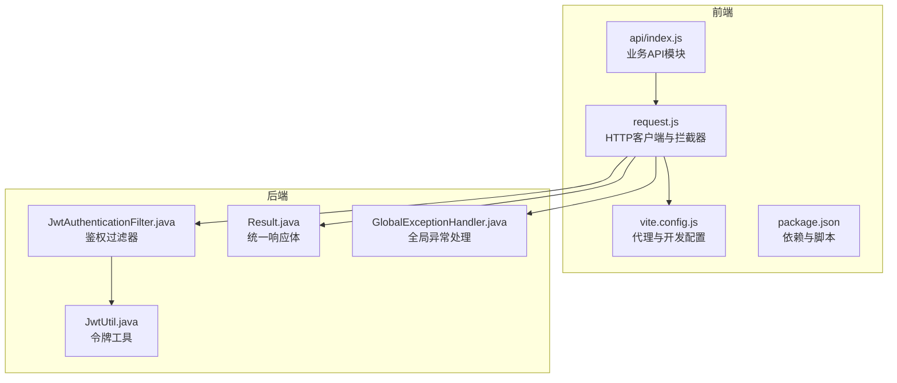
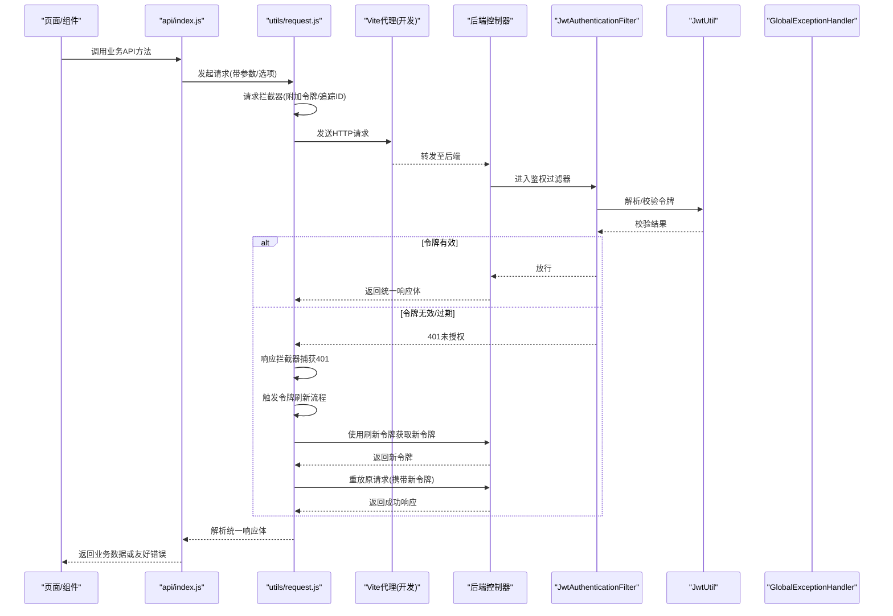
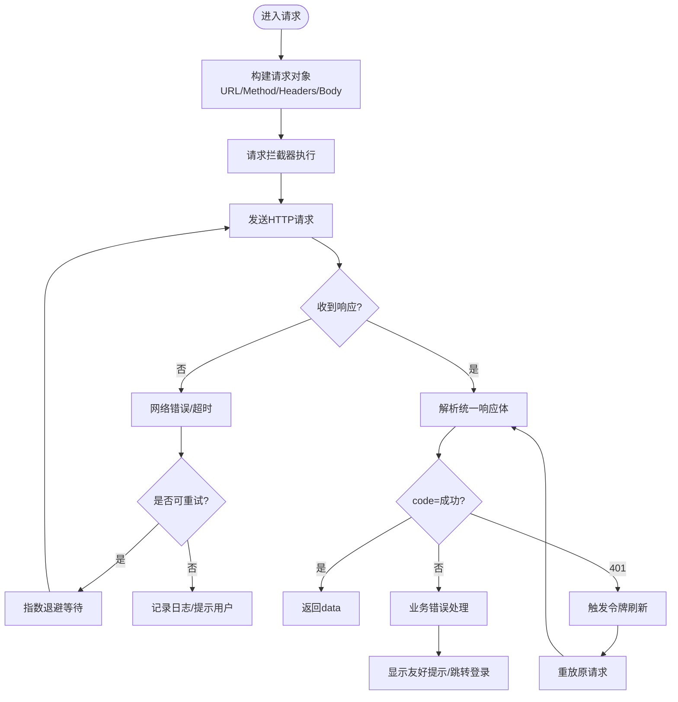
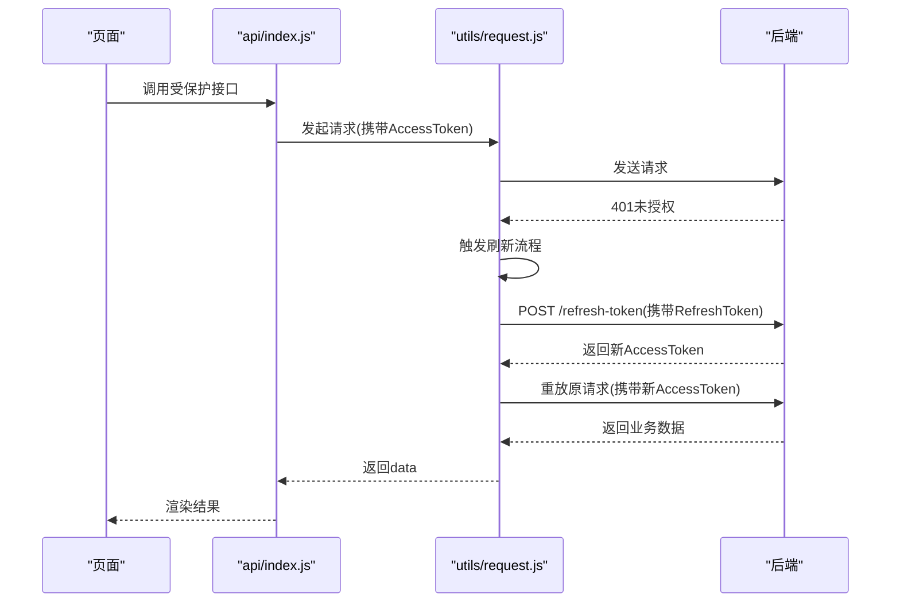
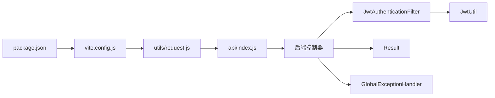

# API集成层

<cite>
**本文引用的文件**   
- [frontend/src/utils/request.js](file://frontend/src/utils/request.js)
- [frontend/src/api/index.js](file://frontend/src/api/index.js)
- [frontend/vite.config.js](file://frontend/vite.config.js)
- [frontend/package.json](file://frontend/package.json)
- [src/main/java/com/ailearn/security/JwtAuthenticationFilter.java](file://src/main/java/com/ailearn/security/JwtAuthenticationFilter.java)
- [src/main/java/com/ailearn/security/JwtUtil.java](file://src/main/java/com/ailearn/security/JwtUtil.java)
- [src/main/java/com/ailearn/dto/LoginRequest.java](file://src/main/java/com/ailearn/dto/LoginRequest.java)
- [src/main/java/com/ailearn/dto/RefreshTokenRequest.java](file://src/main/java/com/ailearn/dto/RefreshTokenRequest.java)
- [src/main/java/com/ailearn/common/Result.java](file://src/main/java/com/ailearn/common/Result.java)
- [src/main/java/com/ailearn/common/GlobalExceptionHandler.java](file://src/main/java/com/ailearn/common/GlobalExceptionHandler.java)
</cite>

## 目录
1. [简介](#简介)
2. [项目结构](#项目结构)
3. [核心组件](#核心组件)
4. [架构总览](#架构总览)
5. [详细组件分析](#详细组件分析)
6. [依赖分析](#依赖分析)
7. [性能考虑](#性能考虑)
8. [故障排查指南](#故障排查指南)
9. [结论](#结论)
10. [附录](#附录)

## 简介
本文件面向Java AI学习平台的前端API集成层，聚焦于HTTP客户端配置、请求封装与拦截器、错误处理、JWT认证与自动刷新、重试/超时/取消、版本管理与向后兼容、Mock数据与测试环境、以及性能优化与缓存策略。文档以实际源码为依据，提供可操作的实践建议与可视化图示，帮助开发者快速理解并扩展前端API层。

## 项目结构
前端API相关代码主要位于以下位置：
- HTTP客户端与拦截器：frontend/src/utils/request.js
- API模块组织与接口定义：frontend/src/api/index.js
- Vite代理与开发环境配置：frontend/vite.config.js
- 依赖与脚本：frontend/package.json
- 后端安全与统一响应（用于前后端对接）：src/main/java/com/ailearn/security/*, src/main/java/com/ailearn/common/*

图表来源
- [frontend/src/utils/request.js](file://frontend/src/utils/request.js)
- [frontend/src/api/index.js](file://frontend/src/api/index.js)
- [frontend/vite.config.js](file://frontend/vite.config.js)
- [src/main/java/com/ailearn/security/JwtAuthenticationFilter.java](file://src/main/java/com/ailearn/security/JwtAuthenticationFilter.java)
- [src/main/java/com/ailearn/security/JwtUtil.java](file://src/main/java/com/ailearn/security/JwtUtil.java)
- [src/main/java/com/ailearn/common/Result.java](file://src/main/java/com/ailearn/common/Result.java)
- [src/main/java/com/ailearn/common/GlobalExceptionHandler.java](file://src/main/java/com/ailearn/common/GlobalExceptionHandler.java)

章节来源
- [frontend/src/utils/request.js](file://frontend/src/utils/request.js)
- [frontend/src/api/index.js](file://frontend/src/api/index.js)
- [frontend/vite.config.js](file://frontend/vite.config.js)
- [frontend/package.json](file://frontend/package.json)
- [src/main/java/com/ailearn/security/JwtAuthenticationFilter.java](file://src/main/java/com/ailearn/security/JwtAuthenticationFilter.java)
- [src/main/java/com/ailearn/security/JwtUtil.java](file://src/main/java/com/ailearn/security/JwtUtil.java)
- [src/main/java/com/ailearn/common/Result.java](file://src/main/java/com/ailearn/common/Result.java)
- [src/main/java/com/ailearn/common/GlobalExceptionHandler.java](file://src/main/java/com/ailearn/common/GlobalExceptionHandler.java)

## 核心组件
- request.js：基于原生Fetch封装的HTTP客户端，集中管理基础URL、默认头、超时、取消、重试、拦截器与错误处理。
- api/index.js：按业务域组织API方法，统一入参出参与错误提示，屏蔽底层细节。
- vite.config.js：开发期代理转发到后端，便于跨域调试与本地Mock。
- 后端安全与响应：JWT过滤器校验令牌；统一响应体Result与全局异常处理器保证前后端契约一致。

章节来源
- [frontend/src/utils/request.js](file://frontend/src/utils/request.js)
- [frontend/src/api/index.js](file://frontend/src/api/index.js)
- [frontend/vite.config.js](file://frontend/vite.config.js)
- [src/main/java/com/ailearn/common/Result.java](file://src/main/java/com/ailearn/common/Result.java)
- [src/main/java/com/ailearn/common/GlobalExceptionHandler.java](file://src/main/java/com/ailearn/common/GlobalExceptionHandler.java)

## 架构总览
下图展示从页面调用到后端处理的端到端流程，包括JWT鉴权、统一响应与异常处理。

图表来源
- [frontend/src/api/index.js](file://frontend/src/api/index.js)
- [frontend/src/utils/request.js](file://frontend/src/utils/request.js)
- [frontend/vite.config.js](file://frontend/vite.config.js)
- [src/main/java/com/ailearn/security/JwtAuthenticationFilter.java](file://src/main/java/com/ailearn/security/JwtAuthenticationFilter.java)
- [src/main/java/com/ailearn/security/JwtUtil.java](file://src/main/java/com/ailearn/security/JwtUtil.java)
- [src/main/java/com/ailearn/common/GlobalExceptionHandler.java](file://src/main/java/com/ailearn/common/GlobalExceptionHandler.java)

## 详细组件分析

### HTTP客户端与拦截器(request.js)
- 基础配置
  - 基础URL与默认头：集中维护，避免散落在各处。
  - 超时与取消：为长耗时操作设置合理超时，支持通过AbortController主动取消。
  - 重试机制：对幂等GET请求在短暂网络抖动时自动重试，避免用户感知失败。
- 请求拦截器
  - 自动附加JWT令牌到请求头。
  - 注入追踪ID、语言偏好、内容类型等通用头。
  - 合并业务自定义头与查询参数。
- 响应拦截器
  - 统一解析后端Result结构，提取data/message/code。
  - 针对401触发令牌刷新流程，成功后重放原请求。
  - 将业务错误码转换为友好的用户提示。
- 错误处理
  - 区分网络错误、超时、服务端异常、业务错误。
  - 提供可配置的回调与全局错误上报入口。
- 取消与并发控制
  - 支持传入AbortSignal进行取消。
  - 可选限制并发数，防止瞬时风暴。

图表来源
- [frontend/src/utils/request.js](file://frontend/src/utils/request.js)

章节来源
- [frontend/src/utils/request.js](file://frontend/src/utils/request.js)

### API模块组织与接口规范(api/index.js)
- 组织方式
  - 按业务域划分方法集合，如聊天、智能体、RAG、记忆、结构化输出、MCP等。
  - 每个方法对应一个后端REST接口，保持命名清晰、职责单一。
- 接口定义规范
  - 入参：统一使用对象传参，包含必填校验与默认值。
  - 出参：直接返回Promise，由上层根据业务需要then/catch或await。
  - 错误：优先抛出标准化错误对象，包含message与可选code。
- 示例路径
  - 聊天会话创建与消息发送
  - 智能体列表与对话
  - RAG检索与问答
  - 结构化输出任务
  - MCP系统工具调用

章节来源
- [frontend/src/api/index.js](file://frontend/src/api/index.js)

### 开发环境与代理(vite.config.js)
- 开发代理
  - 将/api前缀的请求转发到后端服务地址，解决跨域问题。
  - 支持重写路径与目标端口配置。
- Mock与测试
  - 可在代理层或本地静态资源中提供Mock响应，加速联调。
  - 结合环境变量切换不同后端地址或Mock开关。

章节来源
- [frontend/vite.config.js](file://frontend/vite.config.js)
- [frontend/package.json](file://frontend/package.json)

### 认证与令牌刷新
- 登录与令牌发放
  - 登录接口返回访问令牌与刷新令牌，前端持久化存储。
- 请求鉴权
  - 请求拦截器自动附加访问令牌到Authorization头。
- 自动刷新
  - 当响应为401时，尝试使用刷新令牌换取新令牌。
  - 刷新成功后，重放原请求并返回结果。
  - 若刷新失败，引导用户重新登录。

图表来源
- [frontend/src/utils/request.js](file://frontend/src/utils/request.js)
- [src/main/java/com/ailearn/security/JwtAuthenticationFilter.java](file://src/main/java/com/ailearn/security/JwtAuthenticationFilter.java)
- [src/main/java/com/ailearn/security/JwtUtil.java](file://src/main/java/com/ailearn/security/JwtUtil.java)
- [src/main/java/com/ailearn/dto/LoginRequest.java](file://src/main/java/com/ailearn/dto/LoginRequest.java)
- [src/main/java/com/ailearn/dto/RefreshTokenRequest.java](file://src/main/java/com/ailearn/dto/RefreshTokenRequest.java)

章节来源
- [frontend/src/utils/request.js](file://frontend/src/utils/request.js)
- [src/main/java/com/ailearn/security/JwtAuthenticationFilter.java](file://src/main/java/com/ailearn/security/JwtAuthenticationFilter.java)
- [src/main/java/com/ailearn/security/JwtUtil.java](file://src/main/java/com/ailearn/security/JwtUtil.java)
- [src/main/java/com/ailearn/dto/LoginRequest.java](file://src/main/java/com/ailearn/dto/LoginRequest.java)
- [src/main/java/com/ailearn/dto/RefreshTokenRequest.java](file://src/main/java/com/ailearn/dto/RefreshTokenRequest.java)

### 统一响应与异常处理(Result与GlobalExceptionHandler)
- 统一响应体
  - 所有接口返回一致的Result结构，包含状态码、消息与数据体。
- 全局异常处理
  - 捕获运行时异常、参数校验异常等，转换为标准Result返回。
  - 保证前端无需处理大量分支，仅关注业务逻辑。

章节来源
- [src/main/java/com/ailearn/common/Result.java](file://src/main/java/com/ailearn/common/Result.java)
- [src/main/java/com/ailearn/common/GlobalExceptionHandler.java](file://src/main/java/com/ailearn/common/GlobalExceptionHandler.java)

## 依赖分析
- 前端依赖
  - 无额外HTTP库，基于原生Fetch实现，减少体积与复杂度。
  - 通过Vite代理简化开发期跨域与Mock。
- 后端依赖
  - Spring Security与自定义JWT过滤器完成鉴权。
  - 统一Result与全局异常处理器确保契约稳定。

图表来源
- [frontend/package.json](file://frontend/package.json)
- [frontend/vite.config.js](file://frontend/vite.config.js)
- [frontend/src/utils/request.js](file://frontend/src/utils/request.js)
- [frontend/src/api/index.js](file://frontend/src/api/index.js)
- [src/main/java/com/ailearn/security/JwtAuthenticationFilter.java](file://src/main/java/com/ailearn/security/JwtAuthenticationFilter.java)
- [src/main/java/com/ailearn/security/JwtUtil.java](file://src/main/java/com/ailearn/security/JwtUtil.java)
- [src/main/java/com/ailearn/common/Result.java](file://src/main/java/com/ailearn/common/Result.java)
- [src/main/java/com/ailearn/common/GlobalExceptionHandler.java](file://src/main/java/com/ailearn/common/GlobalExceptionHandler.java)

章节来源
- [frontend/package.json](file://frontend/package.json)
- [frontend/vite.config.js](file://frontend/vite.config.js)
- [frontend/src/utils/request.js](file://frontend/src/utils/request.js)
- [frontend/src/api/index.js](file://frontend/src/api/index.js)
- [src/main/java/com/ailearn/security/JwtAuthenticationFilter.java](file://src/main/java/com/ailearn/security/JwtAuthenticationFilter.java)
- [src/main/java/com/ailearn/security/JwtUtil.java](file://src/main/java/com/ailearn/security/JwtUtil.java)
- [src/main/java/com/ailearn/common/Result.java](file://src/main/java/com/ailearn/common/Result.java)
- [src/main/java/com/ailearn/common/GlobalExceptionHandler.java](file://src/main/java/com/ailearn/common/GlobalExceptionHandler.java)

## 性能考虑
- 请求级优化
  - 合理设置超时时间，避免长时间阻塞。
  - 对重复且稳定的数据启用内存缓存或浏览器缓存策略。
  - 使用AbortController取消不再需要的请求，降低带宽占用。
- 批量与去抖
  - 高频输入场景采用防抖/节流，减少不必要请求。
  - 列表分页加载，避免一次性拉取过多数据。
- 传输优化
  - 开启Gzip/Brotli压缩（后端配置）。
  - 合理使用ETag/Last-Modified进行条件请求。
- 监控与统计
  - 在拦截器中收集请求耗时、成功率、错误分布，便于定位瓶颈。

[本节为通用指导，不直接分析具体文件]

## 故障排查指南
- 常见问题
  - 401未授权：检查令牌是否存在、是否过期；确认刷新流程是否被正确触发。
  - 网络错误/超时：检查代理配置、后端可达性、请求大小与超时阈值。
  - 业务错误：查看后端返回的错误码与消息，定位业务规则或数据问题。
- 定位手段
  - 打开浏览器开发者工具，查看Network面板的请求与响应。
  - 在拦截器中打印关键信息（URL、方法、头、耗时、错误堆栈）。
  - 核对后端日志中的TraceId与错误上下文。

章节来源
- [frontend/src/utils/request.js](file://frontend/src/utils/request.js)
- [src/main/java/com/ailearn/common/GlobalExceptionHandler.java](file://src/main/java/com/ailearn/common/GlobalExceptionHandler.java)

## 结论
通过统一的HTTP客户端与拦截器、清晰的API模块组织、完善的错误处理与JWT自动刷新机制，前端API集成层在保证可维护性的同时提升了用户体验与稳定性。配合Vite代理与后端统一响应，可实现高效的开发与联调体验。建议在后续迭代中持续完善缓存策略、性能监控与错误上报，进一步提升整体质量。

[本节为总结性内容，不直接分析具体文件]

## 附录
- 术语说明
  - 访问令牌：短期有效的身份凭证，用于鉴权。
  - 刷新令牌：长期有效的凭证，用于换取新的访问令牌。
  - 统一响应体：前后端约定的标准返回结构。
- 参考路径
  - 登录与刷新令牌DTO：LoginRequest、RefreshTokenRequest
  - 鉴权过滤器与工具类：JwtAuthenticationFilter、JwtUtil
  - 统一响应与异常处理：Result、GlobalExceptionHandler

章节来源
- [src/main/java/com/ailearn/dto/LoginRequest.java](file://src/main/java/com/ailearn/dto/LoginRequest.java)
- [src/main/java/com/ailearn/dto/RefreshTokenRequest.java](file://src/main/java/com/ailearn/dto/RefreshTokenRequest.java)
- [src/main/java/com/ailearn/security/JwtAuthenticationFilter.java](file://src/main/java/com/ailearn/security/JwtAuthenticationFilter.java)
- [src/main/java/com/ailearn/security/JwtUtil.java](file://src/main/java/com/ailearn/security/JwtUtil.java)
- [src/main/java/com/ailearn/common/Result.java](file://src/main/java/com/ailearn/common/Result.java)
- [src/main/java/com/ailearn/common/GlobalExceptionHandler.java](file://src/main/java/com/ailearn/common/GlobalExceptionHandler.java)