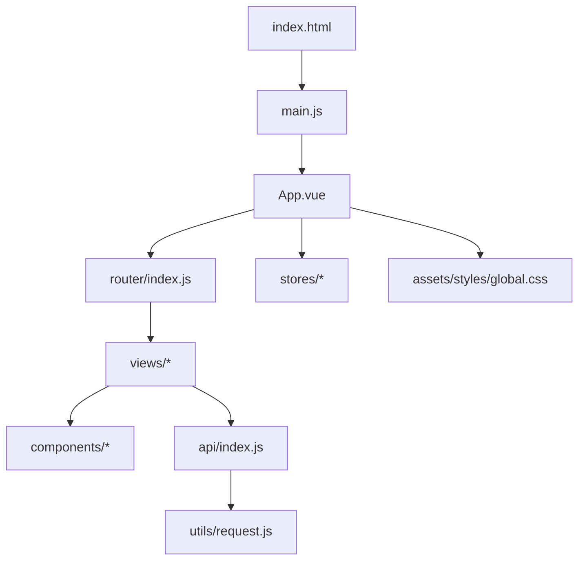
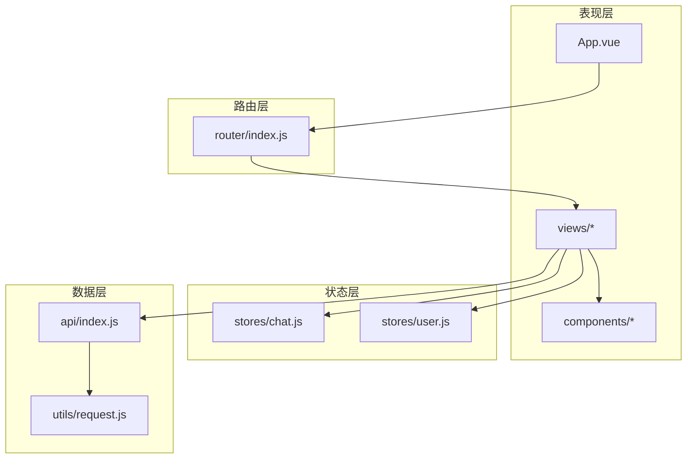
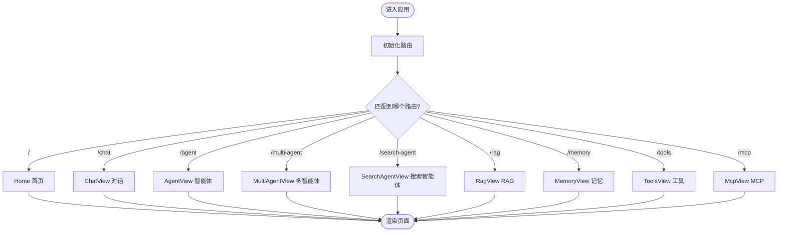
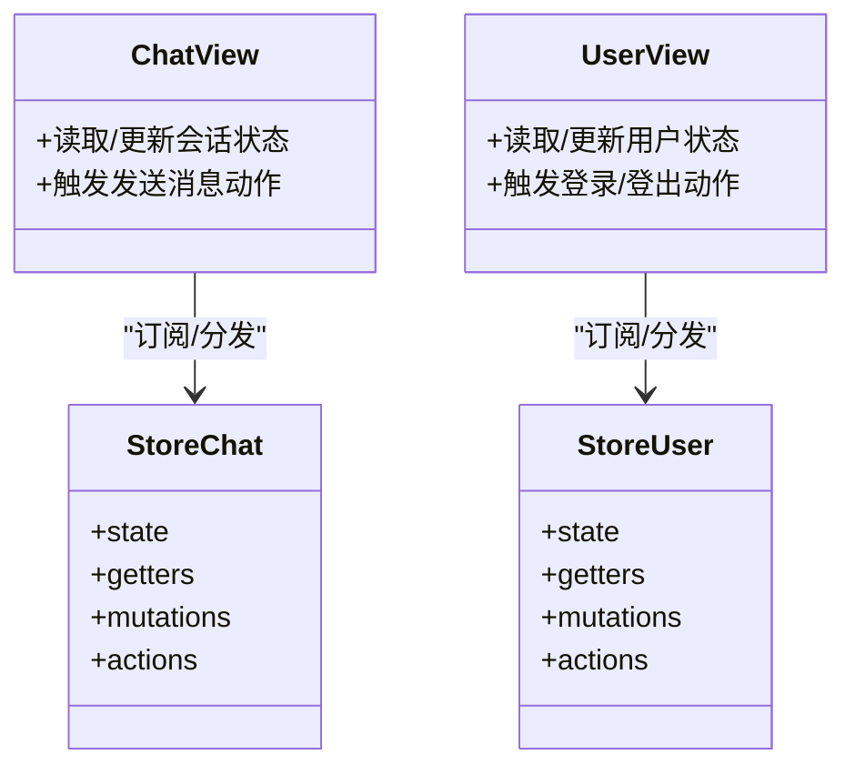
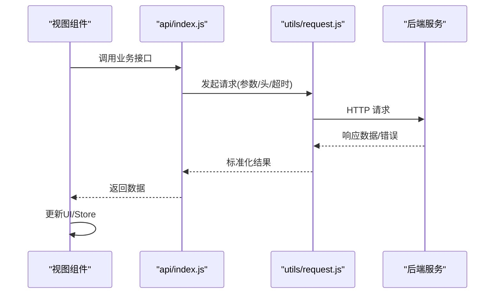
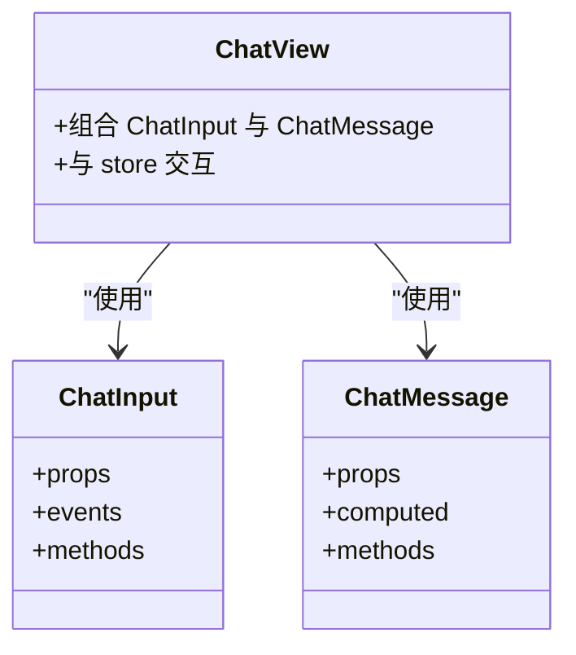
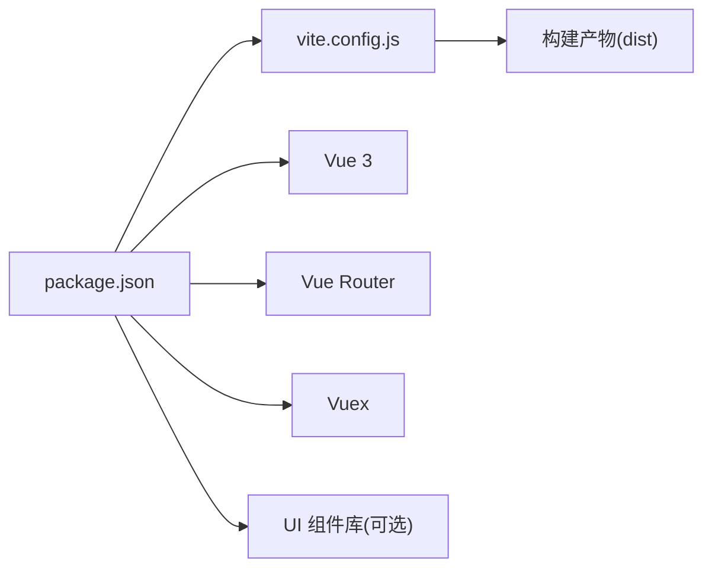

# 前端架构

<cite>
**本文引用的文件**   
- [frontend/src/main.js](file://frontend/src/main.js)
- [frontend/src/App.vue](file://frontend/src/App.vue)
- [frontend/src/router/index.js](file://frontend/src/router/index.js)
- [frontend/src/stores/chat.js](file://frontend/src/stores/chat.js)
- [frontend/src/stores/user.js](file://frontend/src/stores/user.js)
- [frontend/src/api/index.js](file://frontend/src/api/index.js)
- [frontend/src/utils/request.js](file://frontend/src/utils/request.js)
- [frontend/src/components/ChatInput.vue](file://frontend/src/components/ChatInput.vue)
- [frontend/src/components/ChatMessage.vue](file://frontend/src/components/ChatMessage.vue)
- [frontend/src/views/Home.vue](file://frontend/src/views/Home.vue)
- [frontend/src/views/ChatView.vue](file://frontend/src/views/ChatView.vue)
- [frontend/src/views/AgentView.vue](file://frontend/src/views/AgentView.vue)
- [frontend/src/views/McpView.vue](file://frontend/src/views/McpView.vue)
- [frontend/src/views/MemoryView.vue](file://frontend/src/views/MemoryView.vue)
- [frontend/src/views/MultiAgentView.vue](file://frontend/src/views/MultiAgentView.vue)
- [frontend/src/views/RagView.vue](file://frontend/src/views/RagView.vue)
- [frontend/src/views/SearchAgentView.vue](file://frontend/src/views/SearchAgentView.vue)
- [frontend/src/views/StructuredView.vue](file://frontend/src/views/StructuredView.vue)
- [frontend/src/views/ToolsView.vue](file://frontend/src/views/ToolsView.vue)
- [frontend/src/assets/styles/global.css](file://frontend/src/assets/styles/global.css)
- [frontend/vite.config.js](file://frontend/vite.config.js)
- [frontend/package.json](file://frontend/package.json)
- [frontend/index.html](file://frontend/index.html)
</cite>

## 目录
1. [简介](#简介)
2. [项目结构](#项目结构)
3. [核心组件](#核心组件)
4. [架构总览](#架构总览)
5. [详细组件分析](#详细组件分析)
6. [依赖关系分析](#依赖关系分析)
7. [性能考虑](#性能考虑)
8. [故障排查指南](#故障排查指南)
9. [结论](#结论)
10. [附录](#附录)

## 简介
本文件面向Java AI学习平台的前端部分，聚焦于基于Vue.js的SPA（单页应用）架构。文档从整体架构、目录组织、组件设计模式与复用策略、状态管理（Vuex）、路由与页面组织、API集成层封装、构建配置与优化、UI组件库使用与自定义开发、安全与性能、以及开发与调试最佳实践等维度进行系统化说明，帮助读者快速理解并高效扩展前端工程。

## 项目结构
前端工程位于 frontend 目录下，采用Vite作为构建工具，Vue 3 + Vue Router + Vuex 的典型组合。目录按“功能域+职责”划分：
- src/api：API接口定义与聚合
- src/utils：通用工具函数（如请求封装）
- src/stores：全局状态（Vuex模块）
- src/components：基础与业务组件
- src/views：页面级视图组件
- src/assets/styles：全局样式
- public：静态资源
- vite.config.js：构建配置
- package.json：依赖与脚本
- index.html：入口HTML

图表来源
- [frontend/index.html](file://frontend/index.html)
- [frontend/src/main.js](file://frontend/src/main.js)
- [frontend/src/App.vue](file://frontend/src/App.vue)
- [frontend/src/router/index.js](file://frontend/src/router/index.js)
- [frontend/src/api/index.js](file://frontend/src/api/index.js)
- [frontend/src/utils/request.js](file://frontend/src/utils/request.js)
- [frontend/src/assets/styles/global.css](file://frontend/src/assets/styles/global.css)

章节来源
- [frontend/src/main.js](file://frontend/src/main.js)
- [frontend/src/App.vue](file://frontend/src/App.vue)
- [frontend/src/router/index.js](file://frontend/src/router/index.js)
- [frontend/package.json](file://frontend/package.json)
- [frontend/vite.config.js](file://frontend/vite.config.js)
- [frontend/index.html](file://frontend/index.html)

## 核心组件
- 基础组件
  - ChatInput：聊天输入框，负责用户输入校验、提交事件派发、占位提示等
  - ChatMessage：消息展示，支持不同角色、时间戳、内容渲染
- 业务组件
  - 各 views 下的页面组件，组合基础组件与 stores、api 完成具体业务逻辑
- 组件复用策略
  - 通过 props 传递数据与行为，通过 events 向上通知父组件
  - 将可复用的交互片段抽取为 components，避免在 views 中重复实现
  - 对复杂页面采用“容器组件（views）+ 展示组件（components）”分层

章节来源
- [frontend/src/components/ChatInput.vue](file://frontend/src/components/ChatInput.vue)
- [frontend/src/components/ChatMessage.vue](file://frontend/src/components/ChatMessage.vue)

## 架构总览
前端采用典型三层架构：
- 表现层：App.vue 作为根组件，挂载路由出口与全局布局
- 路由层：router/index.js 集中管理页面路由与导航守卫
- 状态层：stores 下按领域拆分模块（chat、user），提供统一读写入口
- 数据层：api 聚合接口调用，底层由 utils/request.js 统一封装HTTP请求

图表来源
- [frontend/src/App.vue](file://frontend/src/App.vue)
- [frontend/src/router/index.js](file://frontend/src/router/index.js)
- [frontend/src/stores/chat.js](file://frontend/src/stores/chat.js)
- [frontend/src/stores/user.js](file://frontend/src/stores/user.js)
- [frontend/src/api/index.js](file://frontend/src/api/index.js)
- [frontend/src/utils/request.js](file://frontend/src/utils/request.js)

## 详细组件分析

### 路由与页面组织
- 路由配置
  - 集中式路由表，按功能域划分页面路径
  - 建议配合懒加载提升首屏性能
- 页面组件
  - Home：首页概览与导航入口
  - ChatView：对话主界面，组合 ChatInput 与 ChatMessage
  - AgentView / MultiAgentView / SearchAgentView：智能体相关页面
  - RagView：检索增强生成（RAG）页面
  - MemoryView：记忆上下文页面
  - ToolsView：工具调用页面
  - McpView：MCP相关页面
  - StructuredView：结构化输出页面

图表来源
- [frontend/src/router/index.js](file://frontend/src/router/index.js)
- [frontend/src/views/Home.vue](file://frontend/src/views/Home.vue)
- [frontend/src/views/ChatView.vue](file://frontend/src/views/ChatView.vue)
- [frontend/src/views/AgentView.vue](file://frontend/src/views/AgentView.vue)
- [frontend/src/views/MultiAgentView.vue](file://frontend/src/views/MultiAgentView.vue)
- [frontend/src/views/SearchAgentView.vue](file://frontend/src/views/SearchAgentView.vue)
- [frontend/src/views/RagView.vue](file://frontend/src/views/RagView.vue)
- [frontend/src/views/MemoryView.vue](file://frontend/src/views/MemoryView.vue)
- [frontend/src/views/ToolsView.vue](file://frontend/src/views/ToolsView.vue)
- [frontend/src/views/McpView.vue](file://frontend/src/views/McpView.vue)

章节来源
- [frontend/src/router/index.js](file://frontend/src/router/index.js)
- [frontend/src/views/Home.vue](file://frontend/src/views/Home.vue)
- [frontend/src/views/ChatView.vue](file://frontend/src/views/ChatView.vue)
- [frontend/src/views/AgentView.vue](file://frontend/src/views/AgentView.vue)
- [frontend/src/views/MultiAgentView.vue](file://frontend/src/views/MultiAgentView.vue)
- [frontend/src/views/SearchAgentView.vue](file://frontend/src/views/SearchAgentView.vue)
- [frontend/src/views/RagView.vue](file://frontend/src/views/RagView.vue)
- [frontend/src/views/MemoryView.vue](file://frontend/src/views/MemoryView.vue)
- [frontend/src/views/ToolsView.vue](file://frontend/src/views/ToolsView.vue)
- [frontend/src/views/McpView.vue](file://frontend/src/views/McpView.vue)

### 状态管理（Vuex）
- 模块划分
  - chat：管理会话列表、当前会话、消息流等
  - user：管理用户信息、登录态、权限等
- 设计要点
  - 每个模块独立 state/getters/mutations/actions
  - 跨页面共享状态通过 store 访问，避免 prop drilling
  - 异步操作集中在 actions，保证副作用可控

图表来源
- [frontend/src/stores/chat.js](file://frontend/src/stores/chat.js)
- [frontend/src/stores/user.js](file://frontend/src/stores/user.js)
- [frontend/src/views/ChatView.vue](file://frontend/src/views/ChatView.vue)

章节来源
- [frontend/src/stores/chat.js](file://frontend/src/stores/chat.js)
- [frontend/src/stores/user.js](file://frontend/src/stores/user.js)

### API集成层与请求封装
- 分层设计
  - api/index.js：按业务域聚合接口方法，对外暴露清晰API
  - utils/request.js：统一封装HTTP请求，处理拦截器、错误码、超时、重试等
- 典型流程
  - 页面组件调用 api 方法
  - api 方法调用 request 封装
  - request 执行网络请求并返回标准化结果
  - 页面根据结果更新 store 或本地状态

图表来源
- [frontend/src/api/index.js](file://frontend/src/api/index.js)
- [frontend/src/utils/request.js](file://frontend/src/utils/request.js)

章节来源
- [frontend/src/api/index.js](file://frontend/src/api/index.js)
- [frontend/src/utils/request.js](file://frontend/src/utils/request.js)

### 基础组件设计
- ChatInput
  - 职责：接收用户输入、校验、触发提交事件
  - 属性：placeholder、disabled、value 等
  - 事件：submit、input
- ChatMessage
  - 职责：渲染消息内容、区分角色、格式化时间
  - 属性：role、content、timestamp
  - 事件：无（纯展示）

图表来源
- [frontend/src/components/ChatInput.vue](file://frontend/src/components/ChatInput.vue)
- [frontend/src/components/ChatMessage.vue](file://frontend/src/components/ChatMessage.vue)
- [frontend/src/views/ChatView.vue](file://frontend/src/views/ChatView.vue)

章节来源
- [frontend/src/components/ChatInput.vue](file://frontend/src/components/ChatInput.vue)
- [frontend/src/components/ChatMessage.vue](file://frontend/src/components/ChatMessage.vue)
- [frontend/src/views/ChatView.vue](file://frontend/src/views/ChatView.vue)

## 依赖关系分析
- 运行时依赖
  - Vue 3、Vue Router、Vuex 为核心框架依赖
  - 可选 UI 组件库（按需引入）用于加速页面搭建
- 构建期依赖
  - Vite 提供快速开发与生产构建能力
  - 插件生态（如压缩、图片优化、环境变量注入）

图表来源
- [frontend/package.json](file://frontend/package.json)
- [frontend/vite.config.js](file://frontend/vite.config.js)

章节来源
- [frontend/package.json](file://frontend/package.json)
- [frontend/vite.config.js](file://frontend/vite.config.js)

## 性能考虑
- 路由懒加载：将大体积页面拆分为按需加载模块，减少首屏包体
- 组件级优化：避免不必要的重渲染，合理使用 computed/watch
- 列表渲染优化：为长列表提供 key，必要时虚拟滚动
- 资源优化：图片压缩、字体子集化、CDN 缓存
- 构建优化：开启代码分割、Tree Shaking、Gzip/Brotli
- 网络优化：请求合并、缓存策略、失败重试与退避

[本节为通用指导，不直接分析具体文件]

## 故障排查指南
- 常见问题定位
  - 路由跳转异常：检查路由表配置与导航守卫
  - 状态不同步：确认 store 模块是否正确注册与分发
  - 接口报错：查看 request 拦截器日志与后端错误码
- 调试技巧
  - 浏览器开发者工具：Network、Console、Vue Devtools
  - 打印关键状态与请求参数，缩小问题范围
  - 使用断点与条件断点定位异步链路

章节来源
- [frontend/src/router/index.js](file://frontend/src/router/index.js)
- [frontend/src/stores/chat.js](file://frontend/src/stores/chat.js)
- [frontend/src/stores/user.js](file://frontend/src/stores/user.js)
- [frontend/src/utils/request.js](file://frontend/src/utils/request.js)

## 结论
本前端架构以清晰的层次划分与模块化组织为基础，结合 Vuex 全局状态管理与统一的 API 封装，实现了良好的可维护性与可扩展性。通过合理的组件设计与构建优化，可在保障用户体验的同时，支撑AI学习平台的多场景业务需求。后续可按需引入UI组件库与更多工程化插件，进一步提升开发效率与运行性能。

[本节为总结性内容，不直接分析具体文件]

## 附录

### 构建与部署
- 开发环境
  - 启动命令参考 package.json scripts
  - 热重载与源码映射便于调试
- 生产构建
  - 使用 Vite 构建产物至 dist
  - 结合后端静态资源托管或反向代理

章节来源
- [frontend/package.json](file://frontend/package.json)
- [frontend/vite.config.js](file://frontend/vite.config.js)
- [frontend/index.html](file://frontend/index.html)

### UI组件库使用与自定义组件开发指南
- 使用建议
  - 优先选择轻量、按需引入的组件库
  - 建立统一的样式主题与变量，保持视觉一致性
- 自定义组件规范
  - 明确 props/events 契约，编写类型注释
  - 提供示例与边界用例，完善单元测试
  - 遵循单一职责，避免过度耦合

[本节为通用指导，不直接分析具体文件]

### 安全考虑
- 输入校验与输出转义：防止XSS
- 敏感信息保护：不在日志中打印token或隐私数据
- 网络安全：HTTPS、CSP、CSRF防护（前后端协同）
- 权限控制：基于角色的路由与按钮级权限

[本节为通用指导，不直接分析具体文件]

### 开发与调试最佳实践
- 代码规范：ESLint/Prettier 统一风格
- 提交规范：Conventional Commits 便于变更追踪
- 版本管理：语义化版本与变更日志
- 调试清单：网络、状态、路由、组件渲染四步定位法

[本节为通用指导，不直接分析具体文件]