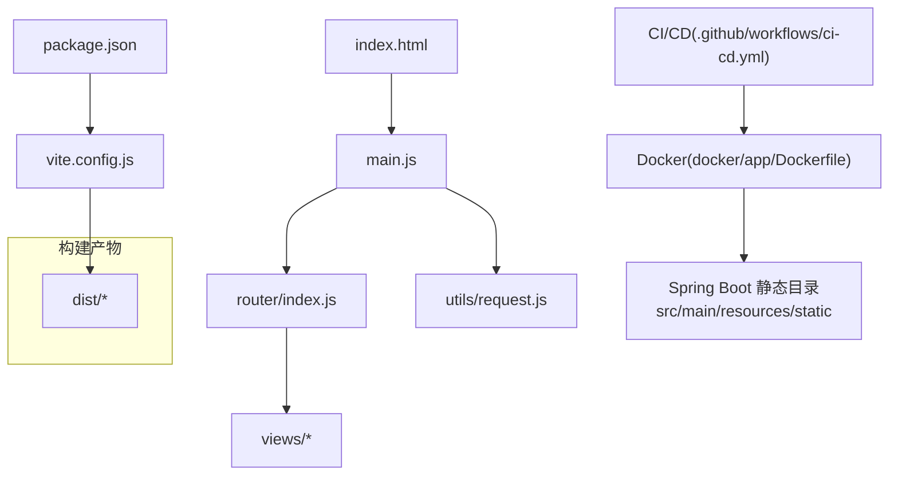
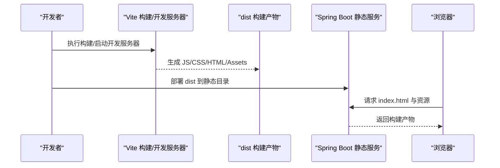
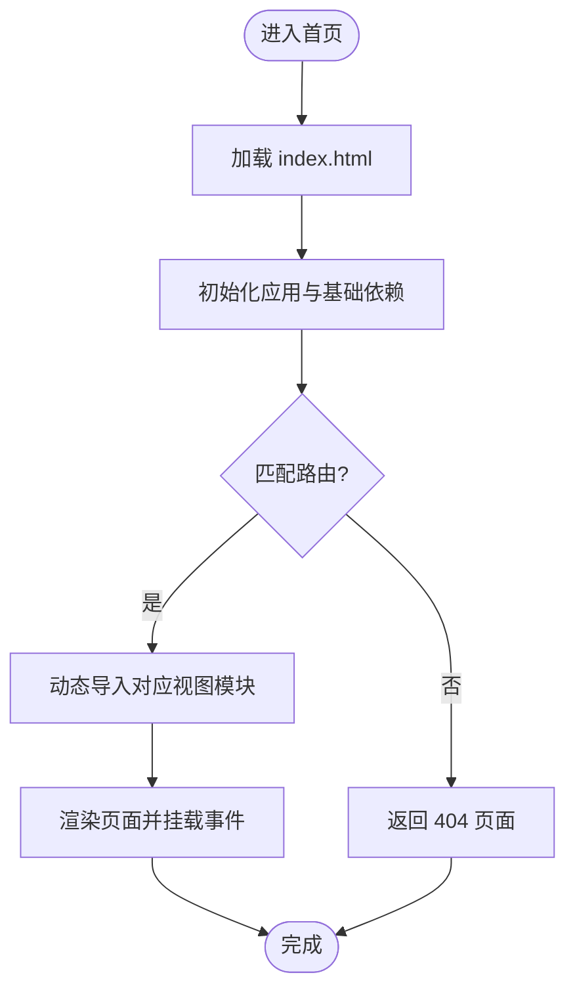
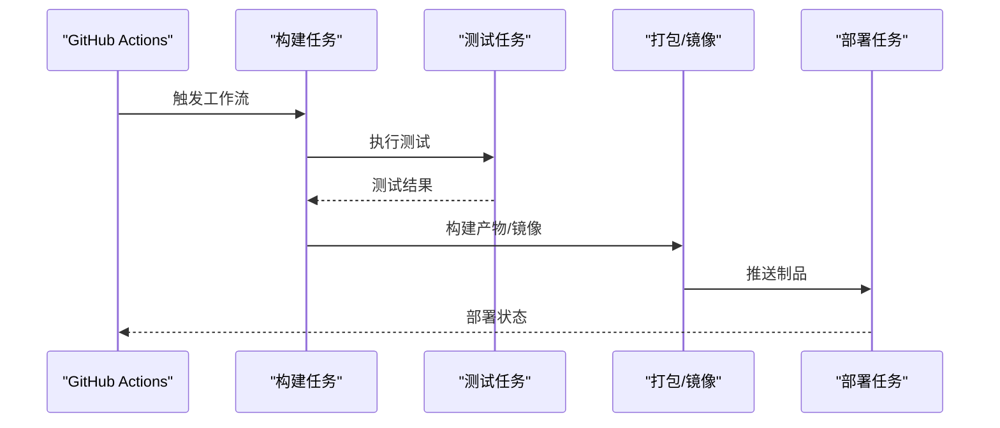

# 构建与优化

<cite>
**本文引用的文件**
- [frontend/vite.config.js](file://frontend/vite.config.js)
- [frontend/package.json](file://frontend/package.json)
- [frontend/index.html](file://frontend/index.html)
- [frontend/src/main.js](file://frontend/src/main.js)
- [frontend/src/router/index.js](file://frontend/src/router/index.js)
- [frontend/src/utils/request.js](file://frontend/src/utils/request.js)
- [.github/workflows/ci-cd.yml](file://.github/workflows/ci-cd.yml)
- [docker/app/Dockerfile](file://docker/app/Dockerfile)
- [src/main/resources/static/index.html](file://src/main/resources/static/index.html)
</cite>

## 目录
1. [简介](#简介)
2. [项目结构](#项目结构)
3. [核心组件](#核心组件)
4. [架构总览](#架构总览)
5. [详细组件分析](#详细组件分析)
6. [依赖分析](#依赖分析)
7. [性能考虑](#性能考虑)
8. [故障排查指南](#故障排查指南)
9. [结论](#结论)
10. [附录](#附录)

## 简介
本文件面向 Java AI 学习平台的前端工程，聚焦于基于 Vite 的构建与优化实践。内容涵盖开发/生产环境差异、代码分割与懒加载、资源压缩与缓存策略、静态资源管理与 CDN 部署、前端性能监控与分析工具集成、浏览器兼容性与 polyfill、安全加固与 CSP 配置，以及 CI/CD 流水线中的构建与部署流程，并提供调试技巧与性能瓶颈定位方法。

## 项目结构
前端位于 frontend 目录，采用 Vue + Vite 技术栈。入口 HTML 为 index.html，应用入口为 src/main.js，路由在 src/router/index.js，网络请求封装在 src/utils/request.js。Vite 构建配置集中在 vite.config.js，脚本命令与依赖定义在 package.json。后端将构建产物打包到 src/main/resources/static 目录，由 Spring Boot 作为静态资源提供。

图表来源
- [frontend/index.html:1-200](file://frontend/index.html#L1-L200)
- [frontend/src/main.js:1-200](file://frontend/src/main.js#L1-L200)
- [frontend/src/router/index.js:1-200](file://frontend/src/router/index.js#L1-L200)
- [frontend/src/utils/request.js:1-200](file://frontend/src/utils/request.js#L1-L200)
- [frontend/vite.config.js:1-200](file://frontend/vite.config.js#L1-L200)
- [frontend/package.json:1-200](file://frontend/package.json#L1-L200)
- [.github/workflows/ci-cd.yml:1-200](file://.github/workflows/ci-cd.yml#L1-L200)
- [docker/app/Dockerfile:1-200](file://docker/app/Dockerfile#L1-L200)
- [src/main/resources/static/index.html:1-200](file://src/main/resources/static/index.html#L1-L200)

章节来源
- [frontend/vite.config.js:1-200](file://frontend/vite.config.js#L1-L200)
- [frontend/package.json:1-200](file://frontend/package.json#L1-L200)
- [frontend/index.html:1-200](file://frontend/index.html#L1-L200)
- [frontend/src/main.js:1-200](file://frontend/src/main.js#L1-L200)
- [frontend/src/router/index.js:1-200](file://frontend/src/router/index.js#L1-L200)
- [frontend/src/utils/request.js:1-200](file://frontend/src/utils/request.js#L1-L200)
- [.github/workflows/ci-cd.yml:1-200](file://.github/workflows/ci-cd.yml#L1-L200)
- [docker/app/Dockerfile:1-200](file://docker/app/Dockerfile#L1-L200)
- [src/main/resources/static/index.html:1-200](file://src/main/resources/static/index.html#L1-L200)

## 核心组件
- Vite 构建配置：通过 vite.config.js 集中管理开发服务器、插件、输出目录、资源前缀、分包策略等。
- 应用入口与路由：main.js 初始化应用实例；router/index.js 使用动态导入实现路由级代码分割与懒加载。
- 网络层：utils/request.js 统一封装请求拦截、错误处理、重试与超时控制。
- 构建产物与部署：dist 目录为最终产物，被复制到 Spring Boot 静态目录或通过容器镜像发布。

章节来源
- [frontend/vite.config.js:1-200](file://frontend/vite.config.js#L1-L200)
- [frontend/src/main.js:1-200](file://frontend/src/main.js#L1-L200)
- [frontend/src/router/index.js:1-200](file://frontend/src/router/index.js#L1-L200)
- [frontend/src/utils/request.js:1-200](file://frontend/src/utils/request.js#L1-L200)

## 架构总览
下图展示了从源码到运行时的关键路径：开发者编写源码，Vite 进行开发与构建，产物由 Spring Boot 以静态资源方式提供，或经 Docker 镜像发布至容器环境。

图表来源
- [frontend/vite.config.js:1-200](file://frontend/vite.config.js#L1-L200)
- [src/main/resources/static/index.html:1-200](file://src/main/resources/static/index.html#L1-L200)

## 详细组件分析

### Vite 构建配置与优化策略
- 开发环境
  - 启用热更新与快速编译，便于本地联调。
  - 可配置代理转发后端接口，避免跨域问题。
- 生产环境
  - 开启代码压缩、CSS 压缩与 Tree Shaking。
  - 配置 chunk 拆分策略，按路由与第三方库维度切分，提升并行下载与缓存命中率。
  - 设置资源文件名哈希，配合强缓存策略。
  - 可选开启 Source Map（生产建议关闭或仅保留行映射）。
- 插件生态
  - 按需引入、SVG 图标内联、环境变量注入、PWA 支持等可按需启用。
- 输出与路径
  - 自定义 base 路径，适配子路径部署与 CDN 前缀。
  - 指定输出目录与资源命名规则。

章节来源
- [frontend/vite.config.js:1-200](file://frontend/vite.config.js#L1-L200)

### 代码分割与懒加载
- 路由级懒加载
  - 使用动态 import 对视图组件进行按需加载，减少首屏体积。
- 第三方库拆分
  - 将大型依赖（如 UI 框架、可视化库）拆分为独立 chunk，利用浏览器长期缓存。
- 预取与预连接
  - 对关键路由或首屏资源使用预取策略，缩短用户等待时间。

图表来源
- [frontend/src/router/index.js:1-200](file://frontend/src/router/index.js#L1-L200)
- [frontend/src/main.js:1-200](file://frontend/src/main.js#L1-L200)

章节来源
- [frontend/src/router/index.js:1-200](file://frontend/src/router/index.js#L1-L200)
- [frontend/src/main.js:1-200](file://frontend/src/main.js#L1-L200)

### 资源压缩与缓存策略
- 资源压缩
  - JS/CSS 在生产环境下自动压缩，减少传输体积。
  - 图片与字体等资源可使用专用插件进行无损/有损压缩。
- 缓存策略
  - 带哈希的文件名利于长期缓存；HTML 不缓存或短缓存，确保版本更新及时生效。
  - 结合 CDN 与 HTTP 缓存头，提高命中率和加载速度。

章节来源
- [frontend/vite.config.js:1-200](file://frontend/vite.config.js#L1-L200)

### 静态资源管理与 CDN 部署
- 静态资源组织
  - 公共静态资源放置于 public 目录，构建时原样拷贝。
  - 业务资源通过 import 引入，参与打包与优化。
- CDN 部署
  - 通过 base 或资源前缀配置，将静态资源指向 CDN 域名。
  - 在 Nginx/网关层配置缓存与跨域策略，提升访问性能。
- 多环境切换
  - 使用环境变量区分不同环境的 API 地址与 CDN 前缀。

章节来源
- [frontend/vite.config.js:1-200](file://frontend/vite.config.js#L1-L200)
- [frontend/index.html:1-200](file://frontend/index.html#L1-L200)

### 前端性能监控与分析工具集成
- 埋点方案
  - 在应用初始化后上报首屏时间、路由切换耗时、接口成功率与异常率。
- 指标采集
  - 使用 Web Vitals 指标（FCP、LCP、CLS、INP）评估用户体验。
- 日志与追踪
  - 统一错误捕获与堆栈上报，结合 TraceId 关联前后端链路。
- 可视化看板
  - 对接 APM/Sentry/自研监控平台，形成告警与趋势分析。

章节来源
- [frontend/src/main.js:1-200](file://frontend/src/main.js#L1-L200)
- [frontend/src/utils/request.js:1-200](file://frontend/src/utils/request.js#L1-L200)

### 浏览器兼容性与 Polyfill
- 目标浏览器
  - 通过配置文件声明目标浏览器范围，Vite 自动处理语法降级与必要 polyfill。
- Polyfill 策略
  - 按需引入 polyfill，避免全局污染与冗余体积。
- 兼容性检测
  - 在构建阶段提示不兼容特性，提前规避线上风险。

章节来源
- [frontend/vite.config.js:1-200](file://frontend/vite.config.js#L1-L200)
- [frontend/package.json:1-200](file://frontend/package.json#L1-L200)

### 安全加固与 CSP 配置
- 输入校验与输出编码
  - 对用户输入进行严格校验，防止 XSS 注入。
- CSP 策略
  - 在响应头中配置 Content-Security-Policy，限制脚本、样式、媒体与接口的来源。
- 敏感信息保护
  - 禁止在客户端暴露密钥，使用环境变量与服务端签名。
- 依赖安全
  - 定期扫描依赖漏洞，升级高风险包。

章节来源
- [frontend/index.html:1-200](file://frontend/index.html#L1-L200)
- [frontend/src/utils/request.js:1-200](file://frontend/src/utils/request.js#L1-L200)

### CI/CD 流水线中的构建与部署
- 构建阶段
  - 安装依赖、执行类型检查与单元测试、构建生产产物。
- 制品归档
  - 上传 dist 产物或生成 Docker 镜像。
- 部署阶段
  - 将产物部署到静态目录或容器镜像仓库，触发滚动发布。
- 回滚策略
  - 基于镜像标签或制品版本快速回滚。

图表来源
- [.github/workflows/ci-cd.yml:1-200](file://.github/workflows/ci-cd.yml#L1-L200)
- [docker/app/Dockerfile:1-200](file://docker/app/Dockerfile#L1-L200)

章节来源
- [.github/workflows/ci-cd.yml:1-200](file://.github/workflows/ci-cd.yml#L1-L200)
- [docker/app/Dockerfile:1-200](file://docker/app/Dockerfile#L1-L200)

## 依赖分析
- 构建期依赖
  - Vite 及其插件决定构建行为与优化能力。
- 运行期依赖
  - 框架与第三方库影响首屏体积与运行时性能。
- 依赖治理
  - 定期清理未使用依赖，合并重复包，锁定版本避免漂移。

图表来源
- [frontend/package.json:1-200](file://frontend/package.json#L1-L200)
- [frontend/vite.config.js:1-200](file://frontend/vite.config.js#L1-L200)

章节来源
- [frontend/package.json:1-200](file://frontend/package.json#L1-L200)
- [frontend/vite.config.js:1-200](file://frontend/vite.config.js#L1-L200)

## 性能考虑
- 首屏优化
  - 路由懒加载、关键 CSS 内联、预加载关键资源、减少阻塞脚本。
- 网络优化
  - 启用 Gzip/Brotli、HTTP/2、CDN 加速、合理缓存策略。
- 渲染优化
  - 虚拟列表、图片懒加载、防抖节流、Web Worker 计算密集型任务。
- 监控与度量
  - 持续跟踪 LCP/CLS/INP 等指标，建立基线与阈值告警。

[本节为通用指导，无需特定文件引用]

## 故障排查指南
- 构建失败
  - 检查 Node 版本与依赖安装是否成功，确认环境变量与路径配置。
- 资源 404
  - 核对 base 路径与 CDN 前缀，确认静态资源目录与权限。
- 跨域问题
  - 开发环境使用代理，生产环境配置服务端 CORS 与网关转发。
- 性能瓶颈
  - 使用浏览器性能面板与 Network 面板定位慢资源与长任务，结合监控指标分析。
- 安全报错
  - 根据 CSP 拒绝日志调整白名单，修复潜在 XSS 风险点。

章节来源
- [frontend/vite.config.js:1-200](file://frontend/vite.config.js#L1-L200)
- [frontend/src/utils/request.js:1-200](file://frontend/src/utils/request.js#L1-L200)
- [frontend/index.html:1-200](file://frontend/index.html#L1-L200)

## 结论
通过合理的 Vite 配置与优化策略，结合代码分割、懒加载、资源压缩与缓存、CDN 部署、监控与安全加固，以及完善的 CI/CD 流水线，可以显著提升 Java AI 学习平台前端的构建效率与运行性能，保障稳定交付与可观测性。

[本节为总结性内容，无需特定文件引用]

## 附录
- 常用命令
  - 开发：启动本地开发服务器与热更新。
  - 构建：生成生产环境产物。
  - 预览：本地预览构建结果。
- 环境变量
  - 区分开发/测试/生产环境，控制 API 地址、CDN 前缀与功能开关。
- 最佳实践清单
  - 小步提交、单测覆盖、依赖审计、灰度发布与回滚预案。

[本节为补充说明，无需特定文件引用]