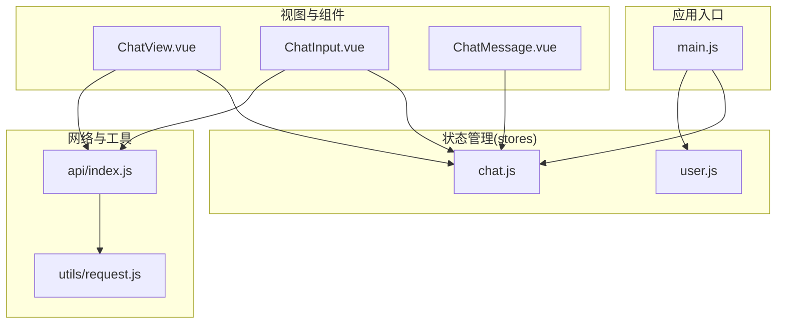
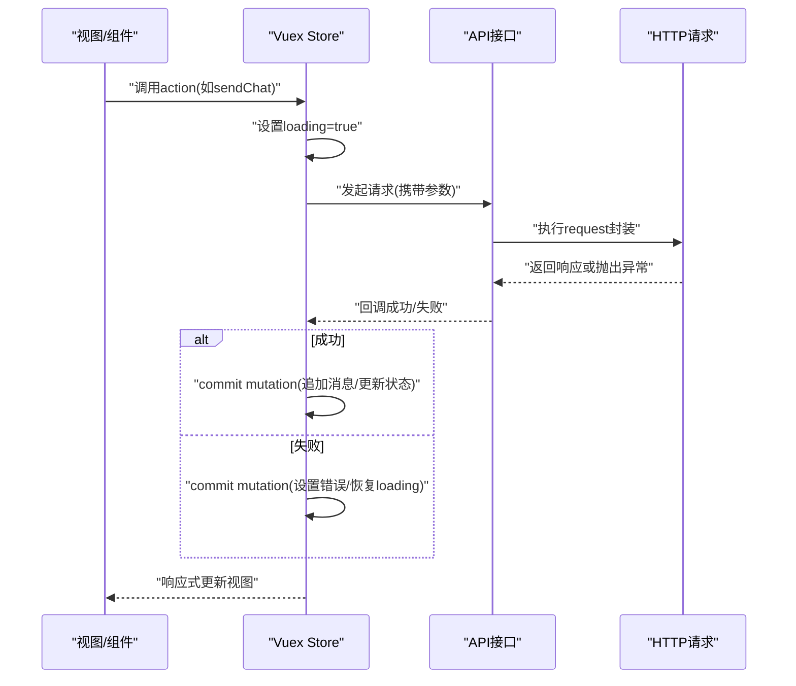
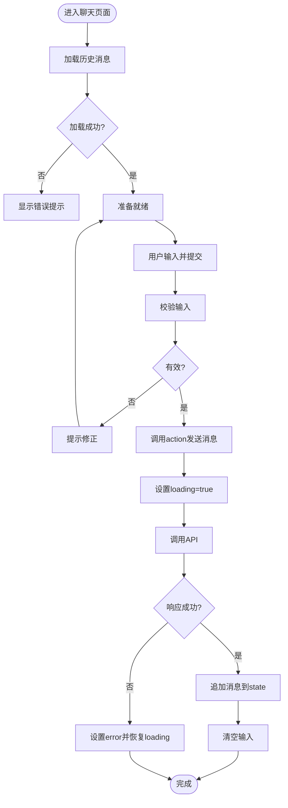
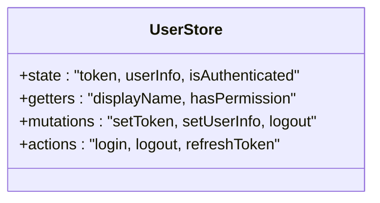
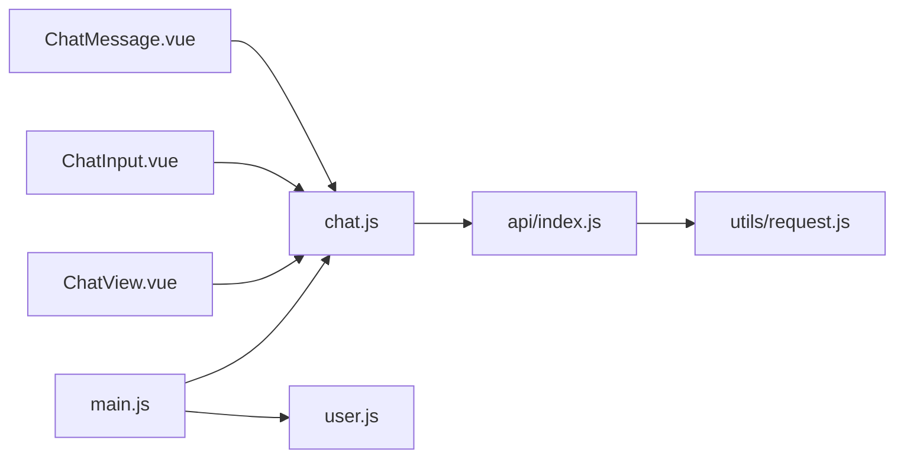

# 状态管理方案

<cite>
**本文引用的文件**   
- [frontend/src/stores/chat.js](file://frontend/src/stores/chat.js)
- [frontend/src/stores/user.js](file://frontend/src/stores/user.js)
- [frontend/src/main.js](file://frontend/src/main.js)
- [frontend/src/views/ChatView.vue](file://frontend/src/views/ChatView.vue)
- [frontend/src/components/ChatInput.vue](file://frontend/src/components/ChatInput.vue)
- [frontend/src/components/ChatMessage.vue](file://frontend/src/components/ChatMessage.vue)
- [frontend/src/api/index.js](file://frontend/src/api/index.js)
- [frontend/src/utils/request.js](file://frontend/src/utils/request.js)
</cite>

## 目录
1. [简介](#简介)
2. [项目结构](#项目结构)
3. [核心组件](#核心组件)
4. [架构总览](#架构总览)
5. [详细组件分析](#详细组件分析)
6. [依赖关系分析](#依赖关系分析)
7. [性能考虑](#性能考虑)
8. [故障排查指南](#故障排查指南)
9. [结论](#结论)
10. [附录](#附录)

## 简介
本文件面向Java AI学习平台的前端，聚焦于使用Vuex进行全局状态管理的整体方案与最佳实践。文档围绕以下目标展开：
- 阐述基于Vuex的全局状态管理架构设计
- 解析聊天状态模块chat.js与用户状态模块user.js的数据结构设计
- 说明state、getters、mutations、actions的使用方式与规范
- 介绍异步状态处理与数据流管理
- 提供状态持久化与缓存策略
- 给出调试工具与开发期监控方法
- 总结性能优化技巧与内存泄漏防护
- 提供复杂状态场景的处理模式与重构指南

## 项目结构
前端采用模块化组织，状态管理位于stores目录，按业务域拆分为多个store模块（如chat、user）。视图与组件通过useStore或mapXxx辅助函数访问状态，API请求封装在api与utils层，确保状态变更的单一来源与可追踪性。

图示来源
- [frontend/src/main.js](file://frontend/src/main.js)
- [frontend/src/stores/chat.js](file://frontend/src/stores/chat.js)
- [frontend/src/stores/user.js](file://frontend/src/stores/user.js)
- [frontend/src/views/ChatView.vue](file://frontend/src/views/ChatView.vue)
- [frontend/src/components/ChatInput.vue](file://frontend/src/components/ChatInput.vue)
- [frontend/src/components/ChatMessage.vue](file://frontend/src/components/ChatMessage.vue)
- [frontend/src/api/index.js](file://frontend/src/api/index.js)
- [frontend/src/utils/request.js](file://frontend/src/utils/request.js)

章节来源
- [frontend/src/main.js](file://frontend/src/main.js)
- [frontend/src/stores/chat.js](file://frontend/src/stores/chat.js)
- [frontend/src/stores/user.js](file://frontend/src/stores/user.js)
- [frontend/src/views/ChatView.vue](file://frontend/src/views/ChatView.vue)
- [frontend/src/components/ChatInput.vue](file://frontend/src/components/ChatInput.vue)
- [frontend/src/components/ChatMessage.vue](file://frontend/src/components/ChatMessage.vue)
- [frontend/src/api/index.js](file://frontend/src/api/index.js)
- [frontend/src/utils/request.js](file://frontend/src/utils/request.js)

## 核心组件
- 聊天状态模块(chat.js)
  - 职责：维护会话列表、当前会话消息、输入状态、加载态等
  - 典型字段：messages、currentConversationId、inputText、loading、error
  - 关键操作：发送消息、追加消息、清空会话、切换会话、错误处理
- 用户状态模块(user.js)
  - 职责：维护登录态、用户信息、权限相关状态
  - 典型字段：token、userInfo、isAuthenticated
  - 关键操作：登录、登出、刷新令牌、更新用户信息

章节来源
- [frontend/src/stores/chat.js](file://frontend/src/stores/chat.js)
- [frontend/src/stores/user.js](file://frontend/src/stores/user.js)

## 架构总览
下图展示了从UI到状态再到网络的端到端数据流，强调“单向数据流”和“异步action驱动同步mutation”的原则。

图示来源
- [frontend/src/stores/chat.js](file://frontend/src/stores/chat.js)
- [frontend/src/api/index.js](file://frontend/src/api/index.js)
- [frontend/src/utils/request.js](file://frontend/src/utils/request.js)
- [frontend/src/views/ChatView.vue](file://frontend/src/views/ChatView.vue)
- [frontend/src/components/ChatInput.vue](file://frontend/src/components/ChatInput.vue)

## 详细组件分析

### 聊天状态模块(chat.js)
- 数据结构建议
  - messages：数组，元素包含id、role、content、timestamp等
  - currentConversationId：字符串或数字，标识当前会话
  - inputText：字符串，绑定输入框
  - loading：布尔，表示是否正在请求
  - error：字符串或对象，记录错误信息
- 核心概念使用
  - state：定义上述字段
  - getters：计算派生状态，如最近N条消息、按角色分组、消息总数
  - mutations：仅做同步的状态变更，如appendMessage、clearMessages、setLoading、setError
  - actions：封装异步逻辑，如sendChat，内部调用API并commit相应mutation
- 数据流与交互
  - ChatInput触发action发送消息
  - ChatView订阅messages变化渲染列表
  - ChatMessage负责单条消息展示与交互
- 错误与边界
  - 网络异常时设置error并提示
  - 空输入、重复提交、超长消息等校验前置处理
  - 大列表分页或虚拟滚动优化渲染

图示来源
- [frontend/src/stores/chat.js](file://frontend/src/stores/chat.js)
- [frontend/src/api/index.js](file://frontend/src/api/index.js)
- [frontend/src/utils/request.js](file://frontend/src/utils/request.js)
- [frontend/src/components/ChatInput.vue](file://frontend/src/components/ChatInput.vue)
- [frontend/src/components/ChatMessage.vue](file://frontend/src/components/ChatMessage.vue)
- [frontend/src/views/ChatView.vue](file://frontend/src/views/ChatView.vue)

章节来源
- [frontend/src/stores/chat.js](file://frontend/src/stores/chat.js)
- [frontend/src/components/ChatInput.vue](file://frontend/src/components/ChatInput.vue)
- [frontend/src/components/ChatMessage.vue](file://frontend/src/components/ChatMessage.vue)
- [frontend/src/views/ChatView.vue](file://frontend/src/views/ChatView.vue)

### 用户状态模块(user.js)
- 数据结构建议
  - token：字符串，用于鉴权
  - userInfo：对象，包含用户名、头像、权限等
  - isAuthenticated：布尔，快速判断登录态
- 核心概念使用
  - state：定义上述字段
  - getters：如displayName、hasPermission(role)
  - mutations：如setToken、setUserInfo、logout
  - actions：如login、logout、refreshToken，内部调用API并commit
- 安全与持久化
  - token与敏感信息应持久化至localStorage/sessionStorage
  - 路由守卫结合isAuthenticated控制访问
  - 登出时清理本地存储与状态

图示来源
- [frontend/src/stores/user.js](file://frontend/src/stores/user.js)

章节来源
- [frontend/src/stores/user.js](file://frontend/src/stores/user.js)

### 视图与组件对状态的消费
- ChatView
  - 订阅messages、loading、error
  - 触发发送动作、滚动到底部、错误重试
- ChatInput
  - 双向绑定inputText
  - 触发发送action，处理快捷键与防抖
- ChatMessage
  - 展示单条消息，支持复制、时间戳格式化等

章节来源
- [frontend/src/views/ChatView.vue](file://frontend/src/views/ChatView.vue)
- [frontend/src/components/ChatInput.vue](file://frontend/src/components/ChatInput.vue)
- [frontend/src/components/ChatMessage.vue](file://frontend/src/components/ChatMessage.vue)

## 依赖关系分析
- 入口main.js注册store与插件
- stores/chat.js与stores/user.js为独立模块，避免循环依赖
- 组件通过useStore或mapXxx访问状态，不直接耦合API
- api/index.js统一封装业务接口，utils/request.js统一封装HTTP请求与拦截器

图示来源
- [frontend/src/main.js](file://frontend/src/main.js)
- [frontend/src/stores/chat.js](file://frontend/src/stores/chat.js)
- [frontend/src/stores/user.js](file://frontend/src/stores/user.js)
- [frontend/src/views/ChatView.vue](file://frontend/src/views/ChatView.vue)
- [frontend/src/components/ChatInput.vue](file://frontend/src/components/ChatInput.vue)
- [frontend/src/components/ChatMessage.vue](file://frontend/src/components/ChatMessage.vue)
- [frontend/src/api/index.js](file://frontend/src/api/index.js)
- [frontend/src/utils/request.js](file://frontend/src/utils/request.js)

章节来源
- [frontend/src/main.js](file://frontend/src/main.js)
- [frontend/src/stores/chat.js](file://frontend/src/stores/chat.js)
- [frontend/src/stores/user.js](file://frontend/src/stores/user.js)
- [frontend/src/api/index.js](file://frontend/src/api/index.js)
- [frontend/src/utils/request.js](file://frontend/src/utils/request.js)

## 性能考虑
- 状态粒度与选择器
  - 将频繁更新的字段拆分到独立模块，减少不必要的重渲染
  - 使用getters进行派生计算，避免在模板中重复计算
- 列表渲染优化
  - 对长列表使用key稳定、分页加载、虚拟滚动
  - 避免在mutation中创建新的大对象，尽量增量更新
- 异步与并发
  - 使用loading标志位防止重复提交
  - 对高频action加防抖/节流
- 内存泄漏防护
  - 组件销毁前取消未完成的请求（AbortController）
  - 移除事件监听与定时器
  - 避免在store中持有DOM引用或闭包中的大对象
- 序列化与持久化
  - 仅持久化必要字段，避免持久化函数或Symbol
  - 使用JSON.stringify前过滤不可序列化的值

[本节为通用指导，无需列出具体文件来源]

## 故障排查指南
- 常见问题定位
  - 状态未更新：检查是否通过mutation修改state，而非直接赋值
  - 异步竞态：确认action顺序与loading状态，必要时引入队列或取消机制
  - 跨页状态丢失：检查持久化策略与初始化逻辑
- 调试工具
  - 浏览器扩展：Vue Devtools的Vuex面板查看state、mutations、actions
  - 日志打印：在关键mutation/action前后输出上下文信息
  - 断点调试：在action与mutation处打断点，观察调用栈与参数
- 监控指标
  - 首屏状态加载耗时
  - 消息追加渲染帧率
  - 错误率与超时统计

章节来源
- [frontend/src/stores/chat.js](file://frontend/src/stores/chat.js)
- [frontend/src/stores/user.js](file://frontend/src/stores/user.js)
- [frontend/src/utils/request.js](file://frontend/src/utils/request.js)

## 结论
本方案以Vuex为核心，遵循单向数据流与单一职责原则，将聊天与用户两大领域状态解耦，配合统一的API与请求封装，形成清晰、可维护、可扩展的状态管理体系。通过合理的持久化、缓存与性能优化策略，可在保证用户体验的同时降低复杂度与风险。

[本节为总结性内容，无需列出具体文件来源]

## 附录
- 最佳实践清单
  - 命名规范：action动词化、mutation明确语义、getter只读
  - 错误处理：统一错误码映射与用户提示
  - 类型与注释：为复杂状态添加JSDoc或TS类型定义
  - 测试：对关键mutation/action编写单元测试
- 重构指南
  - 当模块过大时，按子域进一步拆分
  - 将共享逻辑抽取为公共action或工具函数
  - 逐步引入组合式API与Pinia作为演进路径（如需）

[本节为补充性内容，无需列出具体文件来源]