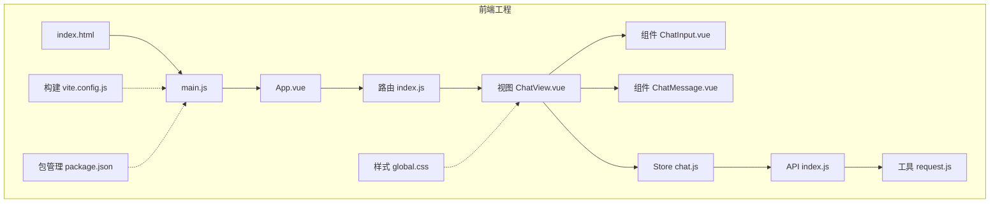
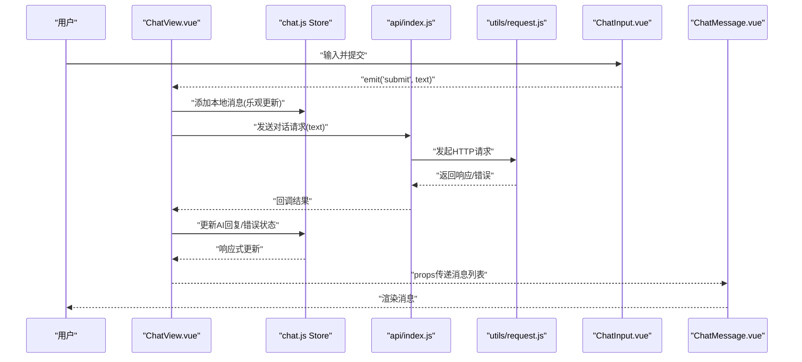
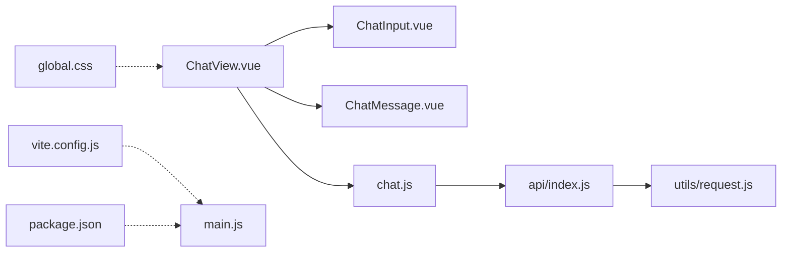

# 组件系统设计

<cite>
**本文引用的文件**   
- [frontend/src/components/ChatMessage.vue](file://frontend/src/components/ChatMessage.vue)
- [frontend/src/components/ChatInput.vue](file://frontend/src/components/ChatInput.vue)
- [frontend/src/views/ChatView.vue](file://frontend/src/views/ChatView.vue)
- [frontend/src/stores/chat.js](file://frontend/src/stores/chat.js)
- [frontend/src/api/index.js](file://frontend/src/api/index.js)
- [frontend/src/utils/request.js](file://frontend/src/utils/request.js)
- [frontend/src/assets/styles/global.css](file://frontend/src/assets/styles/global.css)
- [frontend/package.json](file://frontend/package.json)
- [frontend/vite.config.js](file://frontend/vite.config.js)
</cite>

## 目录
1. [简介](#简介)
2. [项目结构](#项目结构)
3. [核心组件](#核心组件)
4. [架构总览](#架构总览)
5. [详细组件分析](#详细组件分析)
6. [依赖关系分析](#依赖关系分析)
7. [性能考虑](#性能考虑)
8. [故障排查指南](#故障排查指南)
9. [结论](#结论)
10. [附录](#附录)

## 简介
本文件面向Java AI学习平台的前端组件系统，聚焦Vue.js组件的设计模式与架构策略。文档围绕基础UI组件（ChatMessage、ChatInput）与业务视图（如ChatView）的实现方式展开，说明组件间通信机制（props、events、provide/inject）、组件复用与组合模式、样式管理方案（CSS模块化与主题定制）、测试方法与调试技巧，以及性能优化建议。目标是帮助开发者快速理解并高质量地扩展前端组件体系。

## 项目结构
前端采用Vite + Vue 3工程化方案，组件位于src/components，状态由Pinia store集中管理，API调用通过utils/request封装，页面级视图位于src/views。全局样式集中于assets/styles/global.css，构建配置在vite.config.js中。

图表来源
- [frontend/src/views/ChatView.vue](file://frontend/src/views/ChatView.vue)
- [frontend/src/components/ChatInput.vue](file://frontend/src/components/ChatInput.vue)
- [frontend/src/components/ChatMessage.vue](file://frontend/src/components/ChatMessage.vue)
- [frontend/src/stores/chat.js](file://frontend/src/stores/chat.js)
- [frontend/src/api/index.js](file://frontend/src/api/index.js)
- [frontend/src/utils/request.js](file://frontend/src/utils/request.js)
- [frontend/src/assets/styles/global.css](file://frontend/src/assets/styles/global.css)
- [frontend/vite.config.js](file://frontend/vite.config.js)
- [frontend/package.json](file://frontend/package.json)

章节来源
- [frontend/src/views/ChatView.vue](file://frontend/src/views/ChatView.vue)
- [frontend/src/components/ChatInput.vue](file://frontend/src/components/ChatInput.vue)
- [frontend/src/components/ChatMessage.vue](file://frontend/src/components/ChatMessage.vue)
- [frontend/src/stores/chat.js](file://frontend/src/stores/chat.js)
- [frontend/src/api/index.js](file://frontend/src/api/index.js)
- [frontend/src/utils/request.js](file://frontend/src/utils/request.js)
- [frontend/src/assets/styles/global.css](file://frontend/src/assets/styles/global.css)
- [frontend/vite.config.js](file://frontend/vite.config.js)
- [frontend/package.json](file://frontend/package.json)

## 核心组件
本节聚焦两个基础UI组件：ChatMessage与ChatInput，以及承载业务逻辑的ChatView视图。

- ChatMessage
  - 职责：渲染单条聊天消息，支持用户/AI两种角色展示、时间戳、内容格式化等。
  - 输入：通过props接收消息对象（如角色、内容、时间等）。
  - 输出：无直接事件，通常作为纯展示组件。
  - 样式：结合全局样式或模块样式进行角色差异化呈现。

- ChatInput
  - 职责：提供输入框、发送按钮、快捷键（如Enter发送）、禁用态控制。
  - 输入：通过props接收占位符、禁用态、最大长度等。
  - 输出：通过自定义事件向父组件派发“提交”动作，携带输入文本。
  - 交互：处理回车键、空输入校验、防抖/节流（可选）。

- ChatView
  - 职责：组织聊天界面，聚合消息列表与输入组件，协调数据流。
  - 状态：使用Pinia store集中管理消息列表、加载状态、错误信息等。
  - 通信：将store中的消息数据以props形式传递给ChatMessage；监听ChatInput的提交事件，触发API调用并更新store。

章节来源
- [frontend/src/components/ChatMessage.vue](file://frontend/src/components/ChatMessage.vue)
- [frontend/src/components/ChatInput.vue](file://frontend/src/components/ChatInput.vue)
- [frontend/src/views/ChatView.vue](file://frontend/src/views/ChatView.vue)
- [frontend/src/stores/chat.js](file://frontend/src/stores/chat.js)

## 架构总览
整体采用“视图-组件-状态-网络”分层架构：
- 视图层（views）负责页面布局与流程编排。
- 组件层（components）负责可复用的UI单元，遵循单向数据流。
- 状态层（stores）集中管理应用状态，避免跨层级prop传递。
- 网络层（api + utils）统一封装HTTP请求与错误处理。

图表来源
- [frontend/src/views/ChatView.vue](file://frontend/src/views/ChatView.vue)
- [frontend/src/components/ChatInput.vue](file://frontend/src/components/ChatInput.vue)
- [frontend/src/components/ChatMessage.vue](file://frontend/src/components/ChatMessage.vue)
- [frontend/src/stores/chat.js](file://frontend/src/stores/chat.js)
- [frontend/src/api/index.js](file://frontend/src/api/index.js)
- [frontend/src/utils/request.js](file://frontend/src/utils/request.js)

## 详细组件分析

### ChatMessage组件
- 设计要点
  - 单向数据流：仅通过props接收消息数据，不修改外部状态。
  - 角色区分：根据角色属性切换样式与对齐方式。
  - 内容安全：对富文本内容进行转义或白名单过滤（推荐）。
  - 可访问性：为不同角色设置合适的aria-label，便于屏幕阅读器识别。
- 关键接口（概念）
  - props：消息对象（包含角色、内容、时间戳等字段）。
  - emits：无（纯展示）。
- 复杂度与性能
  - 渲染复杂度O(1)，适合长列表场景下配合虚拟滚动或分页加载。
- 可扩展点
  - 支持Markdown渲染插件、代码高亮、图片懒加载等。

章节来源
- [frontend/src/components/ChatMessage.vue](file://frontend/src/components/ChatMessage.vue)

### ChatInput组件
- 设计要点
  - 受控输入：通过v-model绑定输入值，父组件控制禁用态与最大长度。
  - 键盘交互：Enter发送，Shift+Enter换行（可选）。
  - 表单校验：空输入拦截、长度限制提示。
- 关键接口（概念）
  - props：placeholder、disabled、maxLength等。
  - emits：submit(text)、change(value)。
- 复杂度与性能
  - 事件处理O(1)，可在高频输入场景加入防抖。
- 可扩展点
  - 支持多行自适应高度、表情面板、附件上传等。

章节来源
- [frontend/src/components/ChatInput.vue](file://frontend/src/components/ChatInput.vue)

### ChatView视图
- 设计要点
  - 组合模式：组合ChatInput与ChatMessage，形成完整聊天界面。
  - 状态管理：通过Pinia store维护消息列表、加载与错误状态。
  - 通信机制：监听子组件事件，驱动API调用与状态更新。
- 关键流程
  - 用户提交 -> 乐观插入本地消息 -> 调用API -> 更新AI回复 -> 错误回滚。
- 可访问性与国际化
  - 为操作按钮提供清晰的aria标签，预留i18n键值。

章节来源
- [frontend/src/views/ChatView.vue](file://frontend/src/views/ChatView.vue)
- [frontend/src/stores/chat.js](file://frontend/src/stores/chat.js)

### 组件通信机制
- Props与Events
  - 父组件通过props向子组件传递数据，子组件通过$emit派发事件通知父组件。
- Provide/Inject
  - 适用于跨层级共享配置（如主题、语言），减少prop drilling。
- Pinia Store
  - 集中管理聊天相关状态，保证单一事实来源，提升可测试性与可维护性。

章节来源
- [frontend/src/stores/chat.js](file://frontend/src/stores/chat.js)
- [frontend/src/views/ChatView.vue](file://frontend/src/views/ChatView.vue)

### 组件复用与组合模式
- 复用策略
  - 基础组件（ChatMessage、ChatInput）保持低耦合、高内聚，通过props与emits暴露最小必要接口。
  - 业务组件（ChatView）组合基础组件，实现具体业务流程。
- 组合模式
  - 通过插槽（slot）扩展内容区域，允许父组件注入自定义元素。
  - 通过命名插槽与具名事件，增强组件灵活性。

章节来源
- [frontend/src/components/ChatMessage.vue](file://frontend/src/components/ChatMessage.vue)
- [frontend/src/components/ChatInput.vue](file://frontend/src/components/ChatInput.vue)
- [frontend/src/views/ChatView.vue](file://frontend/src/views/ChatView.vue)

### 开发规范与最佳实践
- 命名约定
  - 组件文件名使用PascalCase，组件内部变量与方法语义清晰。
- 接口契约
  - 明确定义props类型与默认值，emits事件参数保持一致。
- 副作用管理
  - 网络请求与副作用集中在store或composable中，组件只负责调度与展示。
- 可访问性
  - 为交互元素提供aria属性，确保键盘可达与屏幕阅读器友好。
- 错误边界
  - 在视图层捕获异常，提供友好的错误提示与重试入口。

[本节为通用规范说明，不直接分析具体文件]

### 样式管理方案
- CSS模块化
  - 推荐使用scoped样式或CSS Modules，避免全局污染。
- 主题定制
  - 通过CSS变量定义主题色、字号、间距等，在根节点或主题切换时覆盖变量。
- 全局样式
  - 将重置样式与公共样式放入global.css，按需引入。

章节来源
- [frontend/src/assets/styles/global.css](file://frontend/src/assets/styles/global.css)

### 测试方法与调试技巧
- 单元测试
  - 使用Vitest对组件进行快照测试与行为断言，模拟props与事件。
- 集成测试
  - 使用Playwright/Cypress端到端验证聊天流程与API交互。
- 调试技巧
  - 利用浏览器DevTools的Vue Devtools检查组件状态与事件。
  - 在request层打印请求/响应日志，定位网络问题。

章节来源
- [frontend/src/utils/request.js](file://frontend/src/utils/request.js)
- [frontend/src/api/index.js](file://frontend/src/api/index.js)

### 性能优化建议
- 渲染优化
  - 长列表使用虚拟滚动或分页加载，避免一次性渲染大量DOM。
  - 对静态内容使用v-memo或计算属性缓存。
- 事件优化
  - 输入场景使用防抖/节流，减少频繁重渲染。
- 资源优化
  - 图片懒加载与压缩，按需引入第三方库。
- 构建优化
  - 合理拆分路由与组件，开启Gzip/Brotli压缩。

[本节为通用优化建议，不直接分析具体文件]

## 依赖关系分析
组件与模块之间的依赖关系如下：

图表来源
- [frontend/src/views/ChatView.vue](file://frontend/src/views/ChatView.vue)
- [frontend/src/components/ChatInput.vue](file://frontend/src/components/ChatInput.vue)
- [frontend/src/components/ChatMessage.vue](file://frontend/src/components/ChatMessage.vue)
- [frontend/src/stores/chat.js](file://frontend/src/stores/chat.js)
- [frontend/src/api/index.js](file://frontend/src/api/index.js)
- [frontend/src/utils/request.js](file://frontend/src/utils/request.js)
- [frontend/src/assets/styles/global.css](file://frontend/src/assets/styles/global.css)
- [frontend/vite.config.js](file://frontend/vite.config.js)
- [frontend/package.json](file://frontend/package.json)

章节来源
- [frontend/src/views/ChatView.vue](file://frontend/src/views/ChatView.vue)
- [frontend/src/components/ChatInput.vue](file://frontend/src/components/ChatInput.vue)
- [frontend/src/components/ChatMessage.vue](file://frontend/src/components/ChatMessage.vue)
- [frontend/src/stores/chat.js](file://frontend/src/stores/chat.js)
- [frontend/src/api/index.js](file://frontend/src/api/index.js)
- [frontend/src/utils/request.js](file://frontend/src/utils/request.js)
- [frontend/src/assets/styles/global.css](file://frontend/src/assets/styles/global.css)
- [frontend/vite.config.js](file://frontend/vite.config.js)
- [frontend/package.json](file://frontend/package.json)

## 性能考虑
- 组件粒度
  - 将大组件拆分为小组件，减少不必要的重渲染范围。
- 状态粒度
  - 在store中将状态细粒度拆分，避免整树更新。
- 异步策略
  - 使用请求去重与缓存策略，降低重复网络开销。
- 内存管理
  - 及时清理定时器与事件监听器，防止内存泄漏。

[本节为通用性能指导，不直接分析具体文件]

## 故障排查指南
- 常见问题
  - 输入未触发提交：检查事件绑定与键盘事件处理。
  - 消息未更新：确认store响应式更新与组件订阅是否正确。
  - 样式错乱：核查scoped作用域与全局样式优先级。
- 定位方法
  - 在request层打印请求头与响应体，核对后端返回格式。
  - 使用Vue Devtools观察组件props与事件流。
- 恢复策略
  - 失败时保留用户输入，提供重试按钮与错误提示。

章节来源
- [frontend/src/utils/request.js](file://frontend/src/utils/request.js)
- [frontend/src/api/index.js](file://frontend/src/api/index.js)
- [frontend/src/stores/chat.js](file://frontend/src/stores/chat.js)

## 结论
本组件系统以Vue 3为基础，采用视图-组件-状态-网络的分层架构，通过Props/Events与Pinia Store实现清晰的数据流与通信机制。基础组件保持高内聚与低耦合，业务视图通过组合模式整合能力。配合CSS模块化与主题变量、完善的测试与调试手段，以及性能优化策略，能够支撑AI聊天平台的持续演进与高效交付。

## 附录
- 术语
  - 单向数据流：数据从父到子，子通过事件向上反馈。
  - 组合模式：将多个小部件组合成更大功能单元。
  - 乐观更新：先更新本地状态，再根据服务器响应修正。
- 参考路径
  - 组件实现：[ChatMessage.vue](file://frontend/src/components/ChatMessage.vue)、[ChatInput.vue](file://frontend/src/components/ChatInput.vue)
  - 视图编排：[ChatView.vue](file://frontend/src/views/ChatView.vue)
  - 状态管理：[chat.js](file://frontend/src/stores/chat.js)
  - 网络封装：[index.js](file://frontend/src/api/index.js)、[request.js](file://frontend/src/utils/request.js)
  - 样式与构建：[global.css](file://frontend/src/assets/styles/global.css)、[vite.config.js](file://frontend/vite.config.js)、[package.json](file://frontend/package.json)