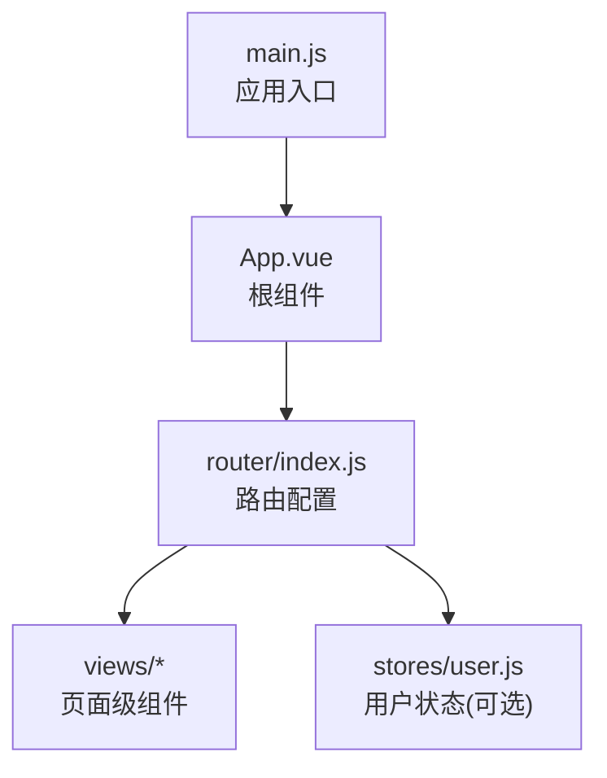
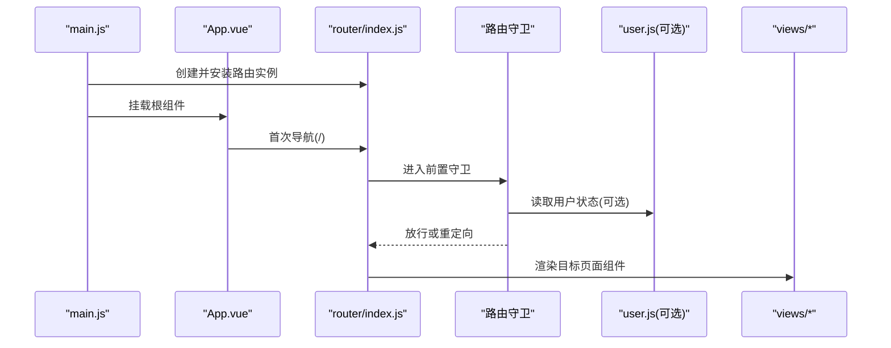
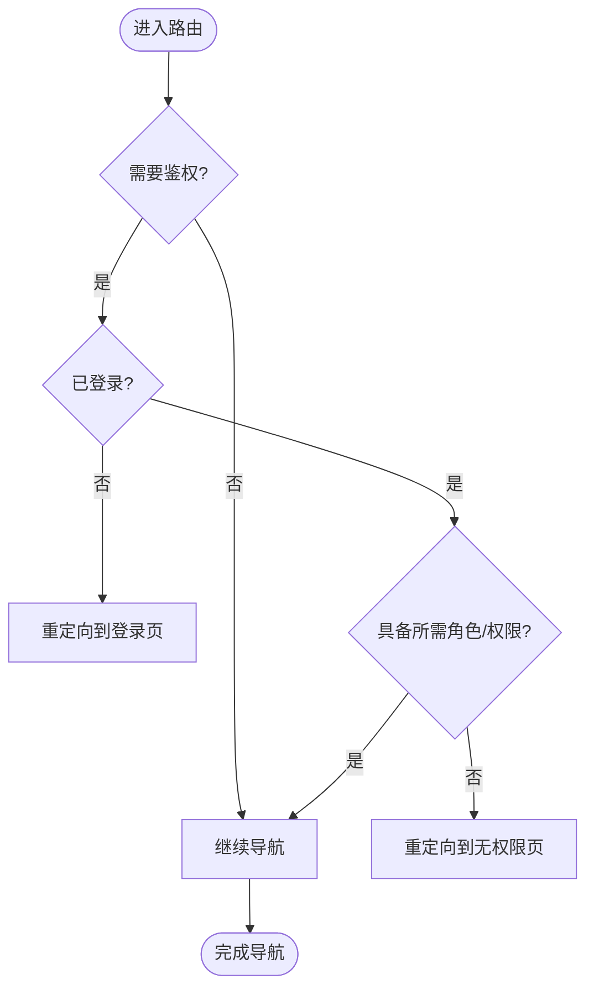
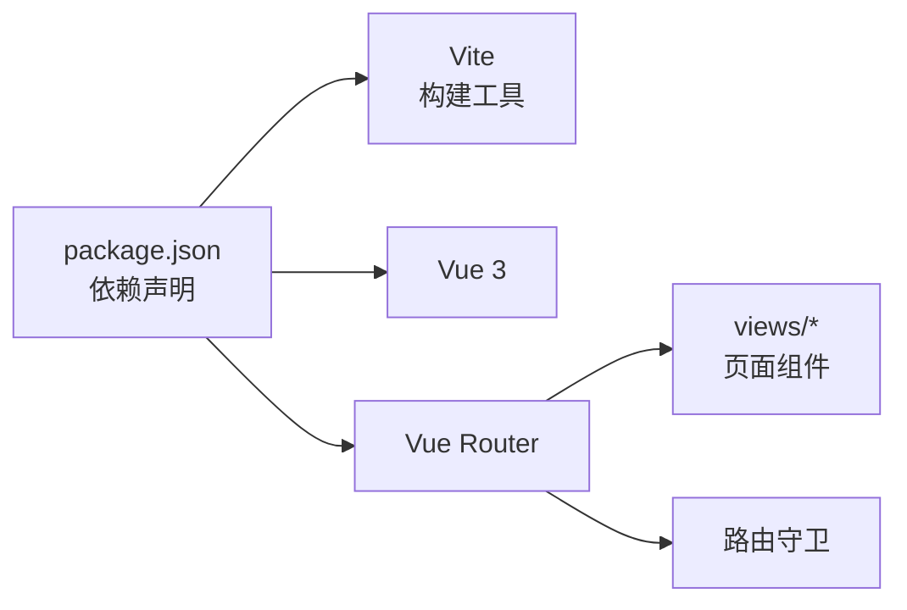

# 路由与导航

<cite>
**本文引用的文件**   
- [frontend/src/router/index.js](file://frontend/src/router/index.js)
- [frontend/src/main.js](file://frontend/src/main.js)
- [frontend/src/App.vue](file://frontend/src/App.vue)
- [frontend/src/views/Home.vue](file://frontend/src/views/Home.vue)
- [frontend/src/views/ChatView.vue](file://frontend/src/views/ChatView.vue)
- [frontend/src/views/AgentView.vue](file://frontend/src/views/AgentView.vue)
- [frontend/src/views/McpView.vue](file://frontend/src/views/McpView.vue)
- [frontend/src/views/MemoryView.vue](file://frontend/src/views/MemoryView.vue)
- [frontend/src/views/MultiAgentView.vue](file://frontend/src/views/MultiAgentView.vue)
- [frontend/src/views/RagView.vue](file://frontend/src/views/RagView.vue)
- [frontend/src/views/SearchAgentView.vue](file://frontend/src/views/SearchAgentView.vue)
- [frontend/src/views/StructuredView.vue](file://frontend/src/views/StructuredView.vue)
- [frontend/src/views/ToolsView.vue](file://frontend/src/views/ToolsView.vue)
- [frontend/src/stores/user.js](file://frontend/src/stores/user.js)
- [frontend/package.json](file://frontend/package.json)
</cite>

## 目录
1. [简介](#简介)
2. [项目结构](#项目结构)
3. [核心组件](#核心组件)
4. [架构总览](#架构总览)
5. [详细组件分析](#详细组件分析)
6. [依赖分析](#依赖分析)
7. [性能考虑](#性能考虑)
8. [故障排查指南](#故障排查指南)
9. [结论](#结论)
10. [附录](#附录)

## 简介
本章节面向Java AI学习平台的前端（Vue）部分，聚焦于路由与导航的实现与最佳实践。文档将系统阐述：
- Vue Router 的配置与使用方式
- 路由配置文件结构与路由守卫实现
- 页面级组件的组织结构与懒加载优化
- 动态路由参数传递与查询字符串处理
- 基于权限的导航守卫与访问拦截
- 路由元信息管理与面包屑导航实现
- 路由动画过渡效果与用户体验优化
- 路由性能优化与SEO友好的配置方案

## 项目结构
前端采用Vite + Vue 3 + Vue Router组织。路由相关代码集中在 router 目录，页面视图位于 views 目录，应用入口在 main.js，根组件为 App.vue。

图表来源
- [frontend/src/main.js](file://frontend/src/main.js)
- [frontend/src/App.vue](file://frontend/src/App.vue)
- [frontend/src/router/index.js](file://frontend/src/router/index.js)

章节来源
- [frontend/src/main.js](file://frontend/src/main.js)
- [frontend/src/App.vue](file://frontend/src/App.vue)
- [frontend/src/router/index.js](file://frontend/src/router/index.js)

## 核心组件
- 路由实例与注册：在路由配置文件中创建并导出路由实例，并在应用入口中安装到Vue应用。
- 页面组件：每个功能模块对应一个页面级组件，位于 views 目录，便于按功能划分与维护。
- 全局状态：用户登录态等可放在 stores 中，供路由守卫判断权限。

章节来源
- [frontend/src/router/index.js](file://frontend/src/router/index.js)
- [frontend/src/main.js](file://frontend/src/main.js)
- [frontend/src/stores/user.js](file://frontend/src/stores/user.js)

## 架构总览
下图展示了从应用启动到页面渲染的路由流程，以及可选的用户状态对导航的影响。

图表来源
- [frontend/src/main.js](file://frontend/src/main.js)
- [frontend/src/App.vue](file://frontend/src/App.vue)
- [frontend/src/router/index.js](file://frontend/src/router/index.js)
- [frontend/src/stores/user.js](file://frontend/src/stores/user.js)

## 详细组件分析

### 路由配置文件结构
- 路由模式：根据部署需求选择 history 或 hash 模式。
- 路由表：以数组形式声明所有路由，包含 path、name、component 等字段。
- 嵌套路由：通过 children 定义子路由，适合带侧边栏或标签页布局。
- 路由元信息：通过 meta 字段携带标题、图标、是否需要登录、面包屑层级等信息。
- 懒加载：使用动态 import 按需加载页面组件，减少首屏体积。
- 全局配置：如 scrollBehavior、strict 等。

章节来源
- [frontend/src/router/index.js](file://frontend/src/router/index.js)

### 路由守卫与权限控制
- 全局前置守卫：在进入路由前校验登录态、角色或资源权限；未通过时可重定向至登录页或错误页。
- 路由独享守卫：针对特定路由设置更细粒度的校验逻辑。
- 组件内守卫：在页面组件内部进行数据加载前的二次确认或条件跳转。
- 异步状态：结合用户状态 store，避免重复请求，提升体验。

图表来源
- [frontend/src/router/index.js](file://frontend/src/router/index.js)
- [frontend/src/stores/user.js](file://frontend/src/stores/user.js)

章节来源
- [frontend/src/router/index.js](file://frontend/src/router/index.js)
- [frontend/src/stores/user.js](file://frontend/src/stores/user.js)

### 页面级组件组织与懒加载
- 组织方式：按业务域拆分 views 目录下的页面组件，保持单一职责。
- 懒加载：使用动态 import 引入页面组件，配合路由配置实现按需加载。
- 命名约定：文件名与路由 name 保持一致，便于调试与追踪。

章节来源
- [frontend/src/views/Home.vue](file://frontend/src/views/Home.vue)
- [frontend/src/views/ChatView.vue](file://frontend/src/views/ChatView.vue)
- [frontend/src/views/AgentView.vue](file://frontend/src/views/AgentView.vue)
- [frontend/src/views/McpView.vue](file://frontend/src/views/McpView.vue)
- [frontend/src/views/MemoryView.vue](file://frontend/src/views/MemoryView.vue)
- [frontend/src/views/MultiAgentView.vue](file://frontend/src/views/MultiAgentView.vue)
- [frontend/src/views/RagView.vue](file://frontend/src/views/RagView.vue)
- [frontend/src/views/SearchAgentView.vue](file://frontend/src/views/SearchAgentView.vue)
- [frontend/src/views/StructuredView.vue](file://frontend/src/views/StructuredView.vue)
- [frontend/src/views/ToolsView.vue](file://frontend/src/views/ToolsView.vue)
- [frontend/src/router/index.js](file://frontend/src/router/index.js)

### 动态路由参数与查询字符串
- 路径参数：在路由 path 中使用占位符，在组件内通过 route.params 获取。
- 查询参数：在 URL 中附加 ?key=value，在组件内通过 route.query 获取。
- 参数校验：在路由独享守卫或组件 onMounted 中进行类型转换与合法性校验。
- 默认值：为必要参数提供默认值，避免空值导致的异常。

章节来源
- [frontend/src/router/index.js](file://frontend/src/router/index.js)
- [frontend/src/views/ChatView.vue](file://frontend/src/views/ChatView.vue)
- [frontend/src/views/AgentView.vue](file://frontend/src/views/AgentView.vue)

### 路由元信息与面包屑导航
- 元信息：在 meta 中维护 title、icon、breadcrumb、requiresAuth 等。
- 面包屑：在 App.vue 或布局组件中遍历当前路由匹配链，依据 meta.breadcrumb 生成导航项。
- 国际化：可将标题文本抽离为 i18n key，统一维护多语言。

章节来源
- [frontend/src/router/index.js](file://frontend/src/router/index.js)
- [frontend/src/App.vue](file://frontend/src/App.vue)

### 路由动画与过渡效果
- 页面切换动画：在 App.vue 中使用 <transition> 包裹 <router-view>，配合 CSS transition 实现淡入淡出、滑动等效果。
- 列表与详情：可为详情页添加进入/离开动画，增强交互反馈。
- 性能注意：避免过度复杂的动画导致卡顿，必要时开启 will-change 或使用 transform。

章节来源
- [frontend/src/App.vue](file://frontend/src/App.vue)

### SEO友好与历史模式
- 历史模式：生产环境建议使用 history 模式以获得更友好的URL结构。
- 服务端回退：后端需将所有非静态资源请求回退到 index.html，由前端接管路由。
- 元信息：在页面组件中设置 document.title 与 meta 描述，利于搜索引擎抓取。

章节来源
- [frontend/src/router/index.js](file://frontend/src/router/index.js)
- [frontend/src/App.vue](file://frontend/src/App.vue)

## 依赖分析
- 运行时依赖：package.json 中应包含 vue、vue-router 等依赖。
- 构建工具：Vite 负责打包与开发服务器，支持动态 import 的懒加载。
- 外部集成：若使用 Pinia/Vuex，可在路由守卫中读取用户状态。

图表来源
- [frontend/package.json](file://frontend/package.json)
- [frontend/src/router/index.js](file://frontend/src/router/index.js)

章节来源
- [frontend/package.json](file://frontend/package.json)
- [frontend/src/router/index.js](file://frontend/src/router/index.js)

## 性能考虑
- 路由懒加载：确保页面组件使用动态 import，减少首屏包体。
- 预取与预加载：对高频访问页面使用 prefetch/preload 策略。
- 路由缓存：对不频繁变化的页面可使用 keep-alive 缓存，避免重复渲染。
- 路由分割：按功能域拆分路由模块，进一步降低主包体积。
- 动画性能：优先使用 transform 与 opacity，避免触发重排。

[本节为通用指导，无需源码引用]

## 故障排查指南
- 白屏问题：检查路由是否成功安装、是否存在循环重定向。
- 404 问题：history 模式下确认后端回退配置是否正确。
- 权限拦截死循环：确保未登录时重定向到登录页且登录页不需要鉴权。
- 参数为空：检查动态路由占位符与组件内取值方式是否一致。
- 动画卡顿：简化动画样式，避免复杂计算。

章节来源
- [frontend/src/router/index.js](file://frontend/src/router/index.js)
- [frontend/src/App.vue](file://frontend/src/App.vue)

## 结论
通过合理的路由配置、完善的导航守卫、清晰的页面组织与懒加载策略，可以显著提升Java AI学习平台前端的可维护性与用户体验。建议在生产环境启用历史模式并结合后端回退，同时利用元信息完善SEO与面包屑导航，辅以适当的动画与性能优化，打造流畅、安全、易用的前端导航体系。

[本节为总结性内容，无需源码引用]

## 附录
- 常用路由API参考：createRouter、useRoute、useRouter、addRoute、removeRoute、beforeEach、onBeforeRouteLeave 等。
- 推荐实践清单：
  - 统一路由命名规范与元信息结构
  - 集中管理鉴权逻辑与错误提示
  - 为关键页面编写单元测试与端到端测试
  - 定期审计路由体积与加载时间

[本节为补充说明，无需源码引用]