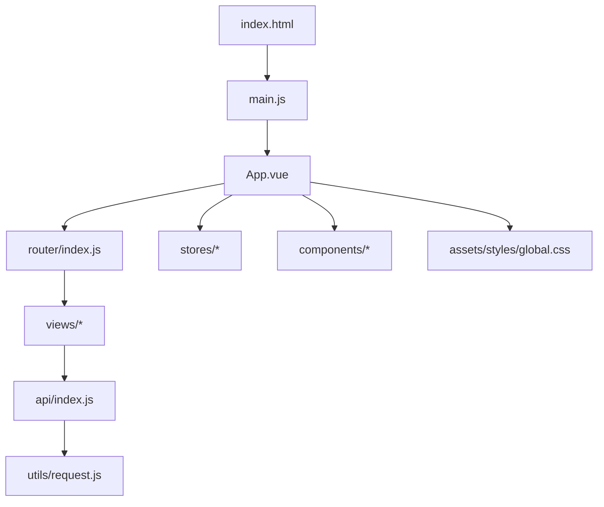
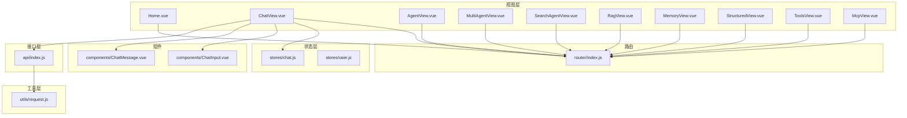
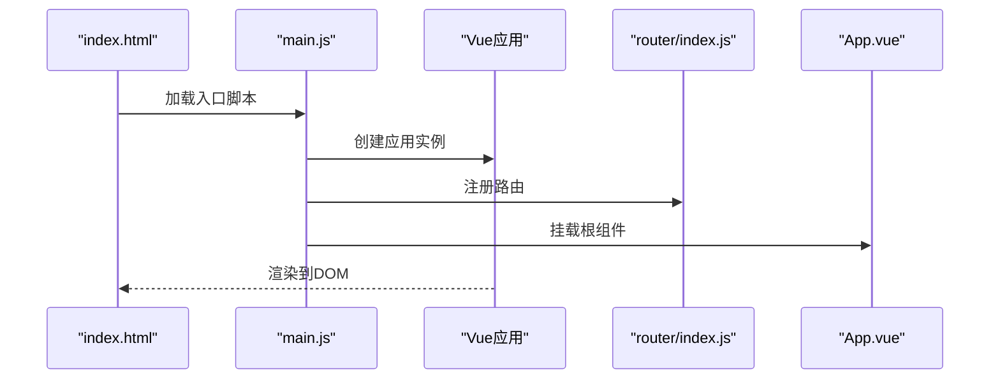
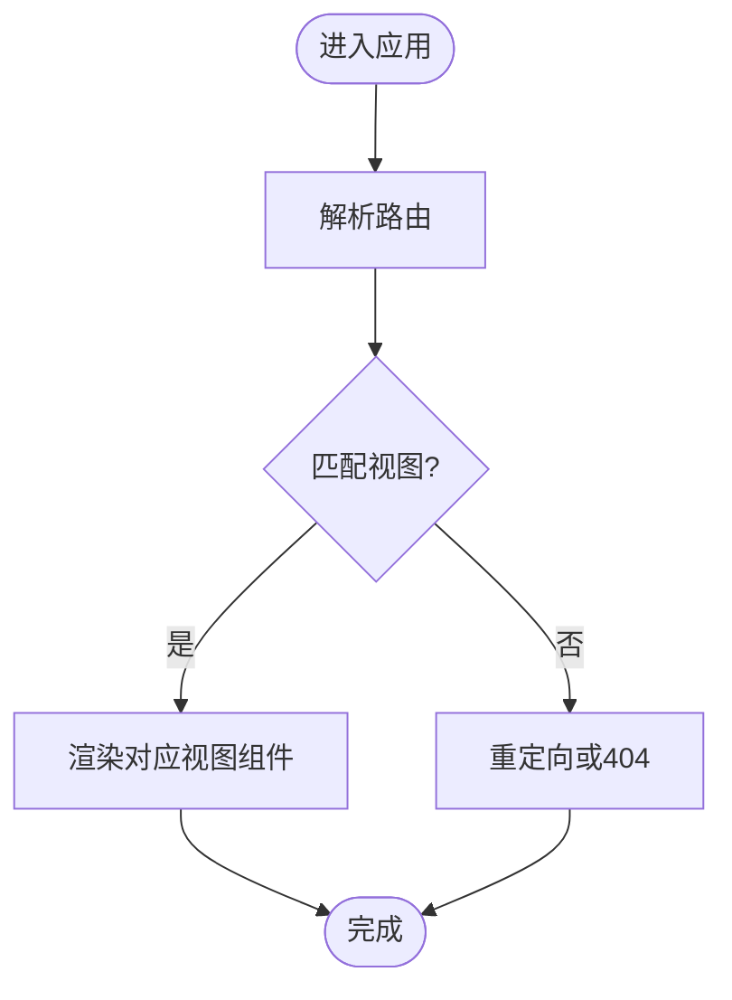
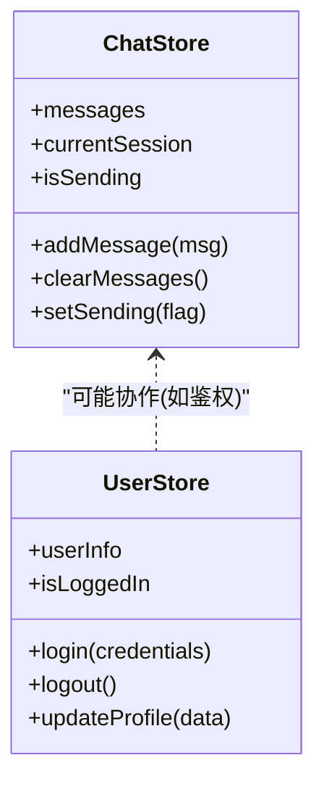
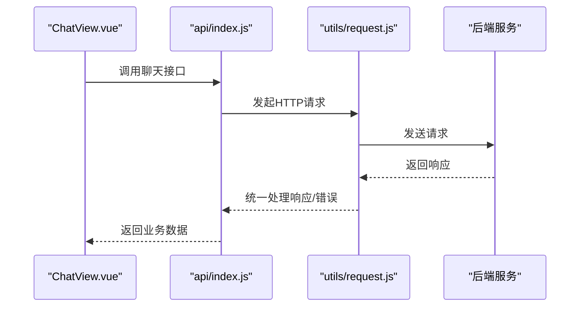
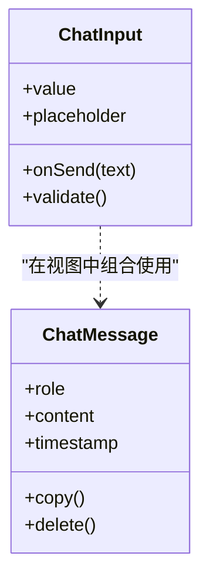

# 项目结构与组织

<cite>
**本文引用的文件**   
- [frontend/package.json](file://frontend/package.json)
- [frontend/vite.config.js](file://frontend/vite.config.js)
- [frontend/index.html](file://frontend/index.html)
- [frontend/src/main.js](file://frontend/src/main.js)
- [frontend/src/App.vue](file://frontend/src/App.vue)
- [frontend/src/router/index.js](file://frontend/src/router/index.js)
- [frontend/src/api/index.js](file://frontend/src/api/index.js)
- [frontend/src/utils/request.js](file://frontend/src/utils/request.js)
- [frontend/src/stores/chat.js](file://frontend/src/stores/chat.js)
- [frontend/src/stores/user.js](file://frontend/src/stores/user.js)
- [frontend/src/components/ChatInput.vue](file://frontend/src/components/ChatInput.vue)
- [frontend/src/components/ChatMessage.vue](file://frontend/src/components/ChatMessage.vue)
- [frontend/src/views/Home.vue](file://frontend/src/views/Home.vue)
- [frontend/src/views/ChatView.vue](file://frontend/src/views/ChatView.vue)
- [frontend/src/views/AgentView.vue](file://frontend/src/views/AgentView.vue)
- [frontend/src/views/MultiAgentView.vue](file://frontend/src/views/MultiAgentView.vue)
- [frontend/src/views/SearchAgentView.vue](file://frontend/src/views/SearchAgentView.vue)
- [frontend/src/views/RagView.vue](file://frontend/src/views/RagView.vue)
- [frontend/src/views/MemoryView.vue](file://frontend/src/views/MemoryView.vue)
- [frontend/src/views/StructuredView.vue](file://frontend/src/views/StructuredView.vue)
- [frontend/src/views/ToolsView.vue](file://frontend/src/views/ToolsView.vue)
- [frontend/src/views/McpView.vue](file://frontend/src/views/McpView.vue)
- [frontend/src/assets/styles/global.css](file://frontend/src/assets/styles/global.css)
</cite>

## 目录
1. [简介](#简介)
2. [项目结构](#项目结构)
3. [核心组件](#核心组件)
4. [架构总览](#架构总览)
5. [详细组件分析](#详细组件分析)
6. [依赖与脚本配置](#依赖与脚本配置)
7. [构建工具与优化](#构建工具与优化)
8. [命名规范与最佳实践](#命名规范与最佳实践)
9. [开发环境与生产环境差异](#开发环境与生产环境差异)
10. [性能考虑](#性能考虑)
11. [故障排查指南](#故障排查指南)
12. [结论](#结论)

## 简介
本文件面向Java AI学习平台的前端工程，聚焦于基于Vue.js + Vite的项目结构与组织方式。文档将系统说明src目录下各模块的职责划分、入口初始化流程、根组件设计、依赖与脚本配置、Vite构建与优化选项，以及开发与生产环境的差异与最佳实践。目标是帮助开发者快速理解并高效维护前端代码。

## 项目结构
前端工程位于 frontend 目录，采用按功能域与职责划分的模块化组织方式：
- src/api：封装后端接口调用，统一对外暴露业务API方法
- src/assets：静态资源（样式、图片等），styles下放置全局样式
- src/components：可复用的UI组件，如聊天输入框、消息卡片等
- src/router：路由定义与导航守卫
- src/stores：基于状态管理的共享状态（如聊天会话、用户信息）
- src/utils：通用工具函数与HTTP请求封装
- src/views：页面级视图组件，对应主要业务页面
- main.js：应用入口，负责创建Vue实例、挂载插件与渲染根组件
- App.vue：根组件，提供全局布局与路由出口
- index.html：HTML模板，作为Vite的入口页面
- vite.config.js：Vite构建配置
- package.json：依赖管理与脚本命令

图表来源
- [frontend/index.html](file://frontend/index.html)
- [frontend/src/main.js](file://frontend/src/main.js)
- [frontend/src/App.vue](file://frontend/src/App.vue)
- [frontend/src/router/index.js](file://frontend/src/router/index.js)
- [frontend/src/api/index.js](file://frontend/src/api/index.js)
- [frontend/src/utils/request.js](file://frontend/src/utils/request.js)
- [frontend/src/assets/styles/global.css](file://frontend/src/assets/styles/global.css)

章节来源
- [frontend/src/main.js](file://frontend/src/main.js)
- [frontend/src/App.vue](file://frontend/src/App.vue)
- [frontend/src/router/index.js](file://frontend/src/router/index.js)
- [frontend/src/api/index.js](file://frontend/src/api/index.js)
- [frontend/src/utils/request.js](file://frontend/src/utils/request.js)
- [frontend/src/assets/styles/global.css](file://frontend/src/assets/styles/global.css)

## 核心组件
- 入口初始化（main.js）
  - 创建Vue应用实例
  - 注册全局插件（如路由、状态管理）
  - 挂载根组件到DOM
  - 可选：注册全局样式、错误处理、日志等
- 根组件（App.vue）
  - 提供全局布局容器
  - 包含路由出口（用于切换不同视图）
  - 承载全局状态或主题设置
- 路由（router/index.js）
  - 定义页面路由映射
  - 配置懒加载与导航守卫（如需鉴权）
- 状态管理（stores）
  - chat.js：聊天会话、消息列表、发送状态等
  - user.js：用户登录态、个人信息、权限等
- API层（api/index.js）
  - 按业务域聚合接口方法
  - 使用统一的请求封装进行网络调用
- 请求封装（utils/request.js）
  - 封装fetch/axios调用
  - 统一处理请求头、拦截器、错误码、重试等
- 组件（components）
  - ChatInput.vue：聊天输入区域，支持文本、快捷键等
  - ChatMessage.vue：消息展示，区分用户/AI消息类型
- 视图（views）
  - Home.vue：首页
  - ChatView.vue：对话页
  - AgentView.vue / MultiAgentView.vue / SearchAgentView.vue：智能体相关页面
  - RagView.vue：RAG检索增强生成页面
  - MemoryView.vue：记忆管理页面
  - StructuredView.vue：结构化输出页面
  - ToolsView.vue：工具调用页面
  - McpView.vue：MCP集成页面
- 样式（assets/styles/global.css）
  - 全局CSS变量、基础重置、主题色等

章节来源
- [frontend/src/main.js](file://frontend/src/main.js)
- [frontend/src/App.vue](file://frontend/src/App.vue)
- [frontend/src/router/index.js](file://frontend/src/router/index.js)
- [frontend/src/stores/chat.js](file://frontend/src/stores/chat.js)
- [frontend/src/stores/user.js](file://frontend/src/stores/user.js)
- [frontend/src/api/index.js](file://frontend/src/api/index.js)
- [frontend/src/utils/request.js](file://frontend/src/utils/request.js)
- [frontend/src/components/ChatInput.vue](file://frontend/src/components/ChatInput.vue)
- [frontend/src/components/ChatMessage.vue](file://frontend/src/components/ChatMessage.vue)
- [frontend/src/views/Home.vue](file://frontend/src/views/Home.vue)
- [frontend/src/views/ChatView.vue](file://frontend/src/views/ChatView.vue)
- [frontend/src/views/AgentView.vue](file://frontend/src/views/AgentView.vue)
- [frontend/src/views/MultiAgentView.vue](file://frontend/src/views/MultiAgentView.vue)
- [frontend/src/views/SearchAgentView.vue](file://frontend/src/views/SearchAgentView.vue)
- [frontend/src/views/RagView.vue](file://frontend/src/views/RagView.vue)
- [frontend/src/views/MemoryView.vue](file://frontend/src/views/MemoryView.vue)
- [frontend/src/views/StructuredView.vue](file://frontend/src/views/StructuredView.vue)
- [frontend/src/views/ToolsView.vue](file://frontend/src/views/ToolsView.vue)
- [frontend/src/views/McpView.vue](file://frontend/src/views/McpView.vue)
- [frontend/src/assets/styles/global.css](file://frontend/src/assets/styles/global.css)

## 架构总览
前端整体遵循“视图-状态-API-工具”的分层模式：
- 视图层（views）通过路由访问，组合组件与状态
- 状态层（stores）集中管理跨组件共享数据
- 接口层（api）对后端服务进行抽象与聚合
- 工具层（utils）提供通用能力（如HTTP封装）

图表来源
- [frontend/src/views/Home.vue](file://frontend/src/views/Home.vue)
- [frontend/src/views/ChatView.vue](file://frontend/src/views/ChatView.vue)
- [frontend/src/views/AgentView.vue](file://frontend/src/views/AgentView.vue)
- [frontend/src/views/MultiAgentView.vue](file://frontend/src/views/MultiAgentView.vue)
- [frontend/src/views/SearchAgentView.vue](file://frontend/src/views/SearchAgentView.vue)
- [frontend/src/views/RagView.vue](file://frontend/src/views/RagView.vue)
- [frontend/src/views/MemoryView.vue](file://frontend/src/views/MemoryView.vue)
- [frontend/src/views/StructuredView.vue](file://frontend/src/views/StructuredView.vue)
- [frontend/src/views/ToolsView.vue](file://frontend/src/views/ToolsView.vue)
- [frontend/src/views/McpView.vue](file://frontend/src/views/McpView.vue)
- [frontend/src/stores/chat.js](file://frontend/src/stores/chat.js)
- [frontend/src/stores/user.js](file://frontend/src/stores/user.js)
- [frontend/src/api/index.js](file://frontend/src/api/index.js)
- [frontend/src/utils/request.js](file://frontend/src/utils/request.js)
- [frontend/src/components/ChatInput.vue](file://frontend/src/components/ChatInput.vue)
- [frontend/src/components/ChatMessage.vue](file://frontend/src/components/ChatMessage.vue)
- [frontend/src/router/index.js](file://frontend/src/router/index.js)

## 详细组件分析

### 入口初始化流程（main.js）
- 创建Vue应用实例
- 引入并注册路由、状态管理等插件
- 挂载全局样式与错误边界（如有）
- 将根组件App.vue挂载到index.html中的根节点

图表来源
- [frontend/index.html](file://frontend/index.html)
- [frontend/src/main.js](file://frontend/src/main.js)
- [frontend/src/router/index.js](file://frontend/src/router/index.js)
- [frontend/src/App.vue](file://frontend/src/App.vue)

章节来源
- [frontend/src/main.js](file://frontend/src/main.js)
- [frontend/index.html](file://frontend/index.html)

### 根组件设计（App.vue）
- 提供全局布局容器（侧边栏、头部、内容区等）
- 包含路由出口以渲染当前视图
- 可承载全局状态（如主题、语言）

章节来源
- [frontend/src/App.vue](file://frontend/src/App.vue)

### 路由与视图（router/index.js 与 views/*）
- router/index.js：定义路由表、懒加载、导航守卫
- views/*：每个业务页面一个视图组件，按需引入与复用

图表来源
- [frontend/src/router/index.js](file://frontend/src/router/index.js)
- [frontend/src/views/Home.vue](file://frontend/src/views/Home.vue)
- [frontend/src/views/ChatView.vue](file://frontend/src/views/ChatView.vue)
- [frontend/src/views/AgentView.vue](file://frontend/src/views/AgentView.vue)
- [frontend/src/views/MultiAgentView.vue](file://frontend/src/views/MultiAgentView.vue)
- [frontend/src/views/SearchAgentView.vue](file://frontend/src/views/SearchAgentView.vue)
- [frontend/src/views/RagView.vue](file://frontend/src/views/RagView.vue)
- [frontend/src/views/MemoryView.vue](file://frontend/src/views/MemoryView.vue)
- [frontend/src/views/StructuredView.vue](file://frontend/src/views/StructuredView.vue)
- [frontend/src/views/ToolsView.vue](file://frontend/src/views/ToolsView.vue)
- [frontend/src/views/McpView.vue](file://frontend/src/views/McpView.vue)

章节来源
- [frontend/src/router/index.js](file://frontend/src/router/index.js)
- [frontend/src/views/Home.vue](file://frontend/src/views/Home.vue)
- [frontend/src/views/ChatView.vue](file://frontend/src/views/ChatView.vue)
- [frontend/src/views/AgentView.vue](file://frontend/src/views/AgentView.vue)
- [frontend/src/views/MultiAgentView.vue](file://frontend/src/views/MultiAgentView.vue)
- [frontend/src/views/SearchAgentView.vue](file://frontend/src/views/SearchAgentView.vue)
- [frontend/src/views/RagView.vue](file://frontend/src/views/RagView.vue)
- [frontend/src/views/MemoryView.vue](file://frontend/src/views/MemoryView.vue)
- [frontend/src/views/StructuredView.vue](file://frontend/src/views/StructuredView.vue)
- [frontend/src/views/ToolsView.vue](file://frontend/src/views/ToolsView.vue)
- [frontend/src/views/McpView.vue](file://frontend/src/views/McpView.vue)

### 状态管理（stores/chat.js 与 stores/user.js）
- chat.js：管理聊天会话、消息列表、发送中状态、错误信息等
- user.js：管理用户登录态、基本信息、权限等

图表来源
- [frontend/src/stores/chat.js](file://frontend/src/stores/chat.js)
- [frontend/src/stores/user.js](file://frontend/src/stores/user.js)

章节来源
- [frontend/src/stores/chat.js](file://frontend/src/stores/chat.js)
- [frontend/src/stores/user.js](file://frontend/src/stores/user.js)

### API层与请求封装（api/index.js 与 utils/request.js）
- api/index.js：按业务域聚合接口方法，对外暴露清晰API
- utils/request.js：封装HTTP请求，统一处理请求头、响应拦截、错误提示、重试策略等

图表来源
- [frontend/src/api/index.js](file://frontend/src/api/index.js)
- [frontend/src/utils/request.js](file://frontend/src/utils/request.js)
- [frontend/src/views/ChatView.vue](file://frontend/src/views/ChatView.vue)

章节来源
- [frontend/src/api/index.js](file://frontend/src/api/index.js)
- [frontend/src/utils/request.js](file://frontend/src/utils/request.js)
- [frontend/src/views/ChatView.vue](file://frontend/src/views/ChatView.vue)

### 组件（components/ChatInput.vue 与 components/ChatMessage.vue）
- ChatInput.vue：输入框、发送按钮、快捷键、输入校验
- ChatMessage.vue：消息渲染、时间戳、角色标识、复制/删除操作

图表来源
- [frontend/src/components/ChatInput.vue](file://frontend/src/components/ChatInput.vue)
- [frontend/src/components/ChatMessage.vue](file://frontend/src/components/ChatMessage.vue)

章节来源
- [frontend/src/components/ChatInput.vue](file://frontend/src/components/ChatInput.vue)
- [frontend/src/components/ChatMessage.vue](file://frontend/src/components/ChatMessage.vue)

## 依赖与脚本配置
- package.json
  - 依赖管理：声明Vue、Vite、路由、状态管理、HTTP客户端等依赖
  - 脚本命令：开发启动、构建、预览、测试等
- 建议
  - 使用锁定文件（package-lock.json）确保一致性
  - 将常用脚本别名化，便于团队协作

章节来源
- [frontend/package.json](file://frontend/package.json)

## 构建工具与优化
- vite.config.js
  - 开发服务器配置：端口、代理、热更新
  - 构建优化：分包、压缩、Tree Shaking、预加载
  - 路径别名：简化导入路径
  - 插件扩展：按需引入、图标、环境变量注入等
- 优化建议
  - 启用按需加载与路由懒加载
  - 合理拆分第三方库，减少首屏体积
  - 开启Gzip/Brotli压缩（根据部署环境）
  - 使用CDN加速静态资源（生产环境）

章节来源
- [frontend/vite.config.js](file://frontend/vite.config.js)

## 命名规范与最佳实践
- 文件与文件夹
  - 小写短横线命名（kebab-case）用于路由与URL
  - 大驼峰（PascalCase）用于组件文件名
  - 常量与枚举使用大写蛇形（UPPER_SNAKE_CASE）
  - 工具函数与变量使用小驼峰（camelCase）
- 组件设计
  - 单一职责：每个组件只关注一个功能点
  - Props与Events：明确输入输出，避免隐式耦合
  - 插槽与组合式API：提升复用性与可读性
- 状态管理
  - 按领域拆分store，避免单一大store
  - 保持状态不可变更新，便于调试与追踪
- API层
  - 按业务域聚合接口，统一错误处理与重试
  - 使用类型注释或JSDoc描述参数与返回值
- 样式
  - 全局样式放在assets/styles，局部样式随组件
  - 使用CSS变量管理主题与尺寸

[本节为通用指导，不直接分析具体文件]

## 开发环境与生产环境差异
- 环境变量
  - 开发：本地代理、调试日志、详细错误堆栈
  - 生产：关闭调试、最小化输出、启用缓存与压缩
- 构建产物
  - 开发：保留源码映射，便于调试
  - 生产：移除console与debugger，启用代码分割
- 部署
  - 开发：Vite内置服务器
  - 生产：静态资源托管（Nginx/CDN），SPA回退配置

章节来源
- [frontend/vite.config.js](file://frontend/vite.config.js)
- [frontend/index.html](file://frontend/index.html)

## 性能考虑
- 首屏优化
  - 路由懒加载与组件异步加载
  - 关键CSS内联，非关键CSS延迟加载
  - 预加载关键资源（字体、图标）
- 运行时优化
  - 合理使用计算属性与侦听器，避免重复计算
  - 长列表虚拟滚动与分页加载
  - 图片与媒体资源懒加载与压缩
- 网络优化
  - 请求合并与去抖/节流
  - 缓存策略（HTTP缓存与服务端缓存）
  - 错误重试与降级策略

[本节为通用指导，不直接分析具体文件]

## 故障排查指南
- 常见问题
  - 路由404：检查路由配置与SPA回退规则
  - 接口报错：查看请求封装的错误拦截与日志
  - 状态异常：检查store更新逻辑与副作用清理
- 调试技巧
  - 使用浏览器开发者工具的网络面板定位接口问题
  - 使用Vue Devtools检查组件状态与事件流
  - 在关键路径添加日志与埋点，便于追踪

章节来源
- [frontend/src/utils/request.js](file://frontend/src/utils/request.js)
- [frontend/src/router/index.js](file://frontend/src/router/index.js)
- [frontend/src/stores/chat.js](file://frontend/src/stores/chat.js)
- [frontend/src/stores/user.js](file://frontend/src/stores/user.js)

## 结论
本项目采用清晰的模块化结构，结合Vue.js与Vite实现了高效的前端工程化体系。通过分层设计（视图-状态-API-工具）、规范的命名与最佳实践，以及完善的构建与优化配置，能够有效支撑AI学习平台的复杂业务场景与持续迭代需求。建议在后续演进中持续关注性能指标与用户体验，逐步完善监控与自动化测试体系。