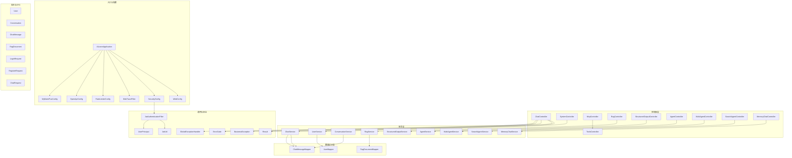
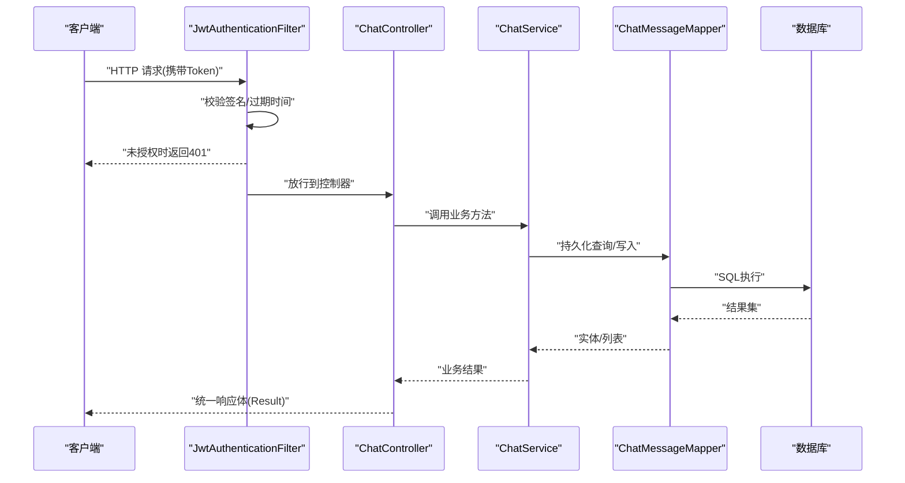
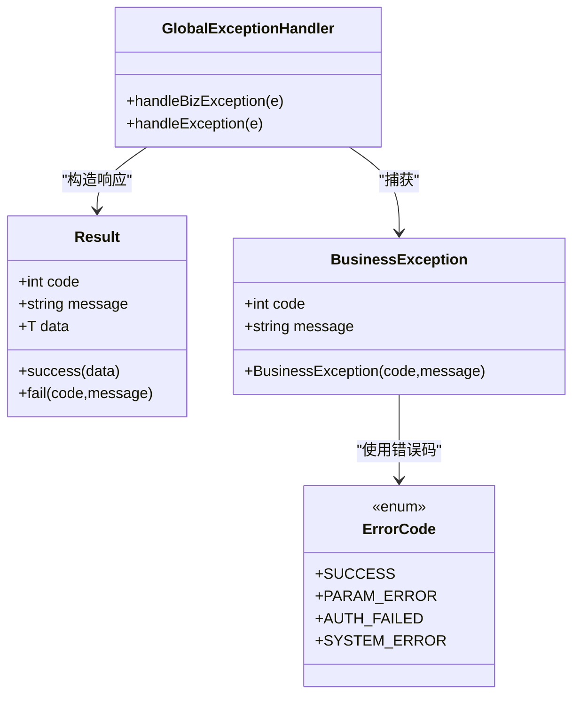
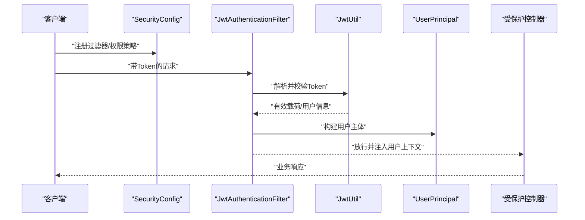
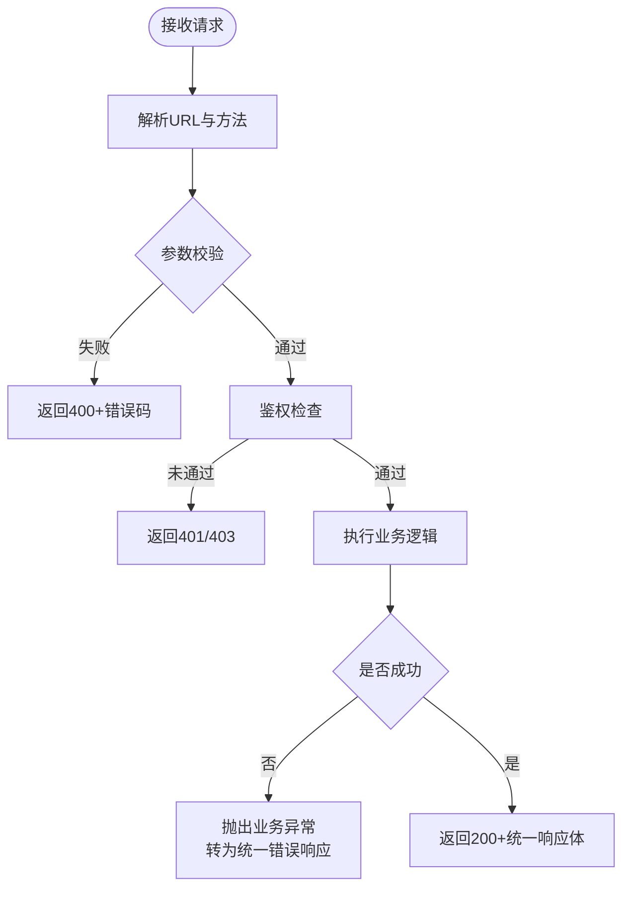
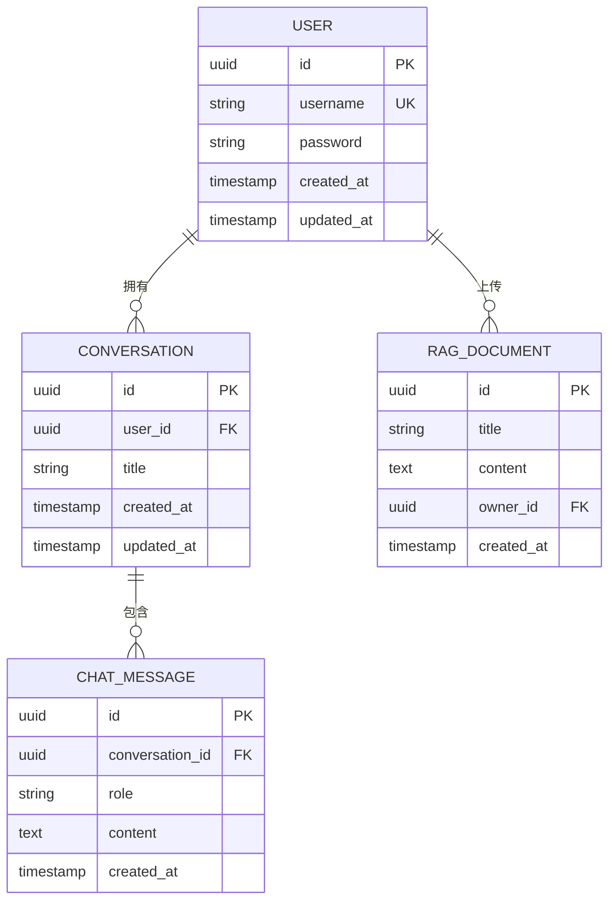
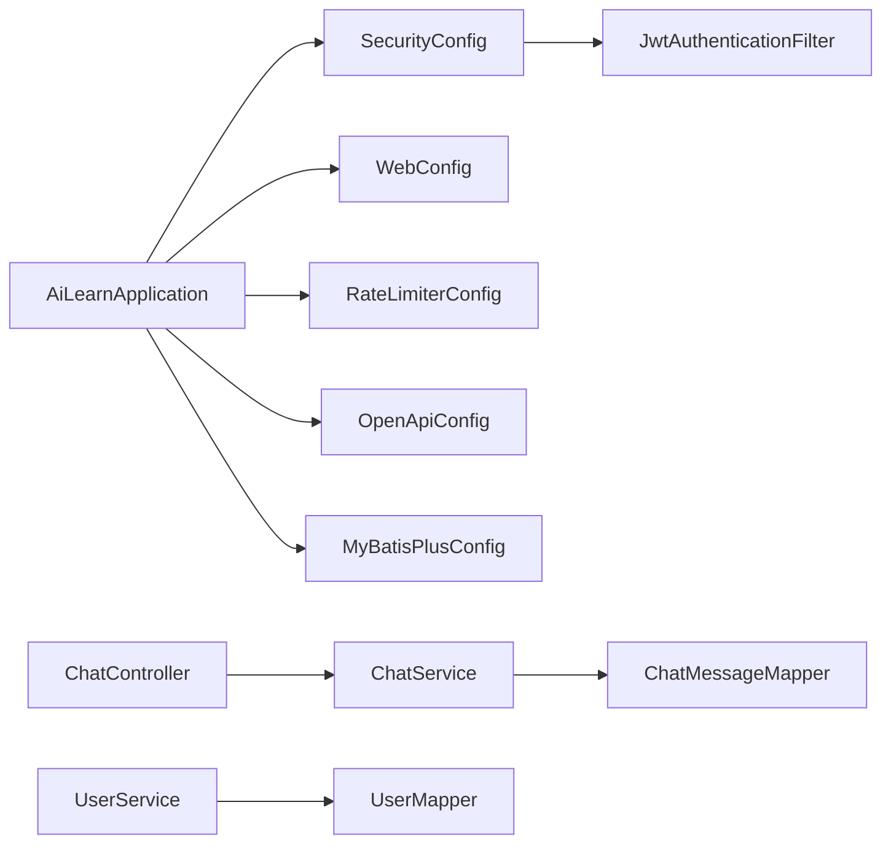

# 代码规范和最佳实践

<cite>
**本文引用的文件**   
- [AiLearnApplication.java](file://src/main/java/com/ailearn/AiLearnApplication.java)
- [GlobalExceptionHandler.java](file://src/main/java/com/ailearn/common/GlobalExceptionHandler.java)
- [BusinessException.java](file://src/main/java/com/ailearn/common/BusinessException.java)
- [ErrorCode.java](file://src/main/java/com/ailearn/common/ErrorCode.java)
- [Result.java](file://src/main/java/com/ailearn/common/Result.java)
- [SecurityConfig.java](file://src/main/java/com/ailearn/security/SecurityConfig.java)
- [JwtAuthenticationFilter.java](file://src/main/java/com/ailearn/security/JwtAuthenticationFilter.java)
- [JwtUtil.java](file://src/main/java/com/ailearn/security/JwtUtil.java)
- [UserPrincipal.java](file://src/main/java/com/ailearn/security/UserPrincipal.java)
- [WebConfig.java](file://src/main/java/com/ailearn/config/WebConfig.java)
- [MdcTraceFilter.java](file://src/main/java/com/ailearn/config/MdcTraceFilter.java)
- [RateLimiterConfig.java](file://src/main/java/com/ailearn/config/RateLimiterConfig.java)
- [OpenApiConfig.java](file://src/main/java/com/ailearn/config/OpenApiConfig.java)
- [MyBatisPlusConfig.java](file://src/main/java/com/ailearn/config/MyBatisPlusConfig.java)
- [ChatController.java](file://src/main/java/com/ailearn/chat/ChatController.java)
- [ChatService.java](file://src/main/java/com/ailearn/chat/ChatService.java)
- [UserService.java](file://src/main/java/com/ailearn/service/UserService.java)
- [ConversationService.java](file://src/main/java/com/ailearn/service/ConversationService.java)
- [User.java](file://src/main/java/com/ailearn/entity/User.java)
- [Conversation.java](file://src/main/java/com/ailearn/entity/Conversation.java)
- [ChatMessage.java](file://src/main/java/com/ailearn/entity/ChatMessage.java)
- [RagDocument.java](file://src/main/java/com/ailearn/entity/RagDocument.java)
- [LoginRequest.java](file://src/main/java/com/ailearn/dto/LoginRequest.java)
- [RegisterRequest.java](file://src/main/java/com/ailearn/dto/RegisterRequest.java)
- [ChatRequest.java](file://src/main/java/com/ailearn/dto/ChatRequest.java)
- [logback-spring.xml](file://src/main/resources/logback-spring.xml)
- [application.yml](file://src/main/resources/application.yml)
- [schema.sql](file://src/main/resources/schema.sql)
- [pom.xml](file://pom.xml)
</cite>

## 目录
1. [引言](#引言)
2. [项目结构](#项目结构)
3. [核心组件](#核心组件)
4. [架构总览](#架构总览)
5. [详细组件分析](#详细组件分析)
6. [依赖分析](#依赖分析)
7. [性能考虑](#性能考虑)
8. [故障排查指南](#故障排查指南)
9. [结论](#结论)
10. [附录](#附录)

## 引言
本规范面向Java AI学习平台，目标是为团队提供统一的编码风格、分层架构设计原则、RESTful API设计规范、统一异常处理与安全编码规范，并给出日志与监控指标定义、重构指导与性能优化建议。文档内容基于仓库现有实现进行提炼与总结，确保可落地执行。

## 项目结构
本项目采用Spring Boot + MyBatis Plus的分层架构，按业务域划分包（agent、chat、memory、rag、structured、tools等），公共能力集中在common与config，安全能力集中在security，数据访问通过mapper与entity分离。

图示来源
- [AiLearnApplication.java](file://src/main/java/com/ailearn/AiLearnApplication.java)
- [WebConfig.java](file://src/main/java/com/ailearn/config/WebConfig.java)
- [SecurityConfig.java](file://src/main/java/com/ailearn/security/SecurityConfig.java)
- [MdcTraceFilter.java](file://src/main/java/com/ailearn/config/MdcTraceFilter.java)
- [RateLimiterConfig.java](file://src/main/java/com/ailearn/config/RateLimiterConfig.java)
- [OpenApiConfig.java](file://src/main/java/com/ailearn/config/OpenApiConfig.java)
- [MyBatisPlusConfig.java](file://src/main/java/com/ailearn/config/MyBatisPlusConfig.java)
- [ChatController.java](file://src/main/java/com/ailearn/chat/ChatController.java)
- [ChatService.java](file://src/main/java/com/ailearn/chat/ChatService.java)
- [UserService.java](file://src/main/java/com/ailearn/service/UserService.java)
- [ConversationService.java](file://src/main/java/com/ailearn/service/ConversationService.java)
- [User.java](file://src/main/java/com/ailearn/entity/User.java)
- [Conversation.java](file://src/main/java/com/ailearn/entity/Conversation.java)
- [ChatMessage.java](file://src/main/java/com/ailearn/entity/ChatMessage.java)
- [RagDocument.java](file://src/main/java/com/ailearn/entity/RagDocument.java)
- [LoginRequest.java](file://src/main/java/com/ailearn/dto/LoginRequest.java)
- [RegisterRequest.java](file://src/main/java/com/ailearn/dto/RegisterRequest.java)
- [ChatRequest.java](file://src/main/java/com/ailearn/dto/ChatRequest.java)
- [Result.java](file://src/main/java/com/ailearn/common/Result.java)
- [BusinessException.java](file://src/main/java/com/ailearn/common/BusinessException.java)
- [ErrorCode.java](file://src/main/java/com/ailearn/common/ErrorCode.java)
- [GlobalExceptionHandler.java](file://src/main/java/com/ailearn/common/GlobalExceptionHandler.java)
- [JwtAuthenticationFilter.java](file://src/main/java/com/ailearn/security/JwtAuthenticationFilter.java)
- [JwtUtil.java](file://src/main/java/com/ailearn/security/JwtUtil.java)
- [UserPrincipal.java](file://src/main/java/com/ailearn/security/UserPrincipal.java)

章节来源
- [AiLearnApplication.java](file://src/main/java/com/ailearn/AiLearnApplication.java)
- [application.yml](file://src/main/resources/application.yml)
- [pom.xml](file://pom.xml)

## 核心组件
- 统一响应体：所有API返回统一封装对象，包含状态码、消息与数据载荷，便于前端一致处理。
- 统一异常：自定义业务异常与全局异常处理器，将异常转换为标准错误响应。
- 安全认证：基于JWT的无状态认证，过滤器在请求进入控制器前完成鉴权。
- 限流与追踪：全局限流配置与MDC链路追踪，提升系统稳定性与可观测性。
- 接口文档：集成OpenAPI，自动生成接口文档。

章节来源
- [Result.java](file://src/main/java/com/ailearn/common/Result.java)
- [BusinessException.java](file://src/main/java/com/ailearn/common/BusinessException.java)
- [ErrorCode.java](file://src/main/java/com/ailearn/common/ErrorCode.java)
- [GlobalExceptionHandler.java](file://src/main/java/com/ailearn/common/GlobalExceptionHandler.java)
- [SecurityConfig.java](file://src/main/java/com/ailearn/security/SecurityConfig.java)
- [JwtAuthenticationFilter.java](file://src/main/java/com/ailearn/security/JwtAuthenticationFilter.java)
- [JwtUtil.java](file://src/main/java/com/ailearn/security/JwtUtil.java)
- [MdcTraceFilter.java](file://src/main/java/com/ailearn/config/MdcTraceFilter.java)
- [RateLimiterConfig.java](file://src/main/java/com/ailearn/config/RateLimiterConfig.java)
- [OpenApiConfig.java](file://src/main/java/com/ailearn/config/OpenApiConfig.java)

## 架构总览
系统遵循“控制器-服务-数据访问”三层架构，结合安全、配置、通用模块形成稳定可扩展的平台。

图示来源
- [JwtAuthenticationFilter.java](file://src/main/java/com/ailearn/security/JwtAuthenticationFilter.java)
- [ChatController.java](file://src/main/java/com/ailearn/chat/ChatController.java)
- [ChatService.java](file://src/main/java/com/ailearn/chat/ChatService.java)
- [ChatMessageMapper.java](file://src/main/java/com/ailearn/mapper/ChatMessageMapper.java)
- [ChatMessage.java](file://src/main/java/com/ailearn/entity/ChatMessage.java)

## 详细组件分析

### 统一响应与异常处理
- 统一响应体用于包装成功与失败场景，保证前后端契约一致。
- 业务异常用于表达领域规则违反，错误码集中管理，便于国际化与前端提示。
- 全局异常处理器捕获未处理异常，转换为标准错误响应，避免泄露堆栈信息。

图示来源
- [Result.java](file://src/main/java/com/ailearn/common/Result.java)
- [BusinessException.java](file://src/main/java/com/ailearn/common/BusinessException.java)
- [ErrorCode.java](file://src/main/java/com/ailearn/common/ErrorCode.java)
- [GlobalExceptionHandler.java](file://src/main/java/com/ailearn/common/GlobalExceptionHandler.java)

章节来源
- [GlobalExceptionHandler.java](file://src/main/java/com/ailearn/common/GlobalExceptionHandler.java)
- [BusinessException.java](file://src/main/java/com/ailearn/common/BusinessException.java)
- [ErrorCode.java](file://src/main/java/com/ailearn/common/ErrorCode.java)
- [Result.java](file://src/main/java/com/ailearn/common/Result.java)

### 安全认证流程（JWT）
- 过滤器在请求进入控制器前解析并验证JWT，设置用户上下文。
- 工具类负责令牌生成与校验；安全配置控制白名单与拦截路径。

图示来源
- [SecurityConfig.java](file://src/main/java/com/ailearn/security/SecurityConfig.java)
- [JwtAuthenticationFilter.java](file://src/main/java/com/ailearn/security/JwtAuthenticationFilter.java)
- [JwtUtil.java](file://src/main/java/com/ailearn/security/JwtUtil.java)
- [UserPrincipal.java](file://src/main/java/com/ailearn/security/UserPrincipal.java)

章节来源
- [SecurityConfig.java](file://src/main/java/com/ailearn/security/SecurityConfig.java)
- [JwtAuthenticationFilter.java](file://src/main/java/com/ailearn/security/JwtAuthenticationFilter.java)
- [JwtUtil.java](file://src/main/java/com/ailearn/security/JwtUtil.java)
- [UserPrincipal.java](file://src/main/java/com/ailearn/security/UserPrincipal.java)

### RESTful API设计规范
- URL设计：资源名词复数形式，层级清晰，动词由HTTP方法表达。
- HTTP状态码：200成功、201创建、400参数错误、401未认证、403禁止、404不存在、500服务器错误。
- 请求响应格式：统一JSON，使用统一响应体封装code/message/data。
- 分页与排序：通过查询参数page、size、sort表达。
- 版本控制：URL中引入v1/v2或Accept头方式。

图示来源
- [ChatController.java](file://src/main/java/com/ailearn/chat/ChatController.java)
- [ChatService.java](file://src/main/java/com/ailearn/chat/ChatService.java)
- [Result.java](file://src/main/java/com/ailearn/common/Result.java)
- [BusinessException.java](file://src/main/java/com/ailearn/common/BusinessException.java)
- [ErrorCode.java](file://src/main/java/com/ailearn/common/ErrorCode.java)

章节来源
- [ChatController.java](file://src/main/java/com/ailearn/chat/ChatController.java)
- [ChatService.java](file://src/main/java/com/ailearn/chat/ChatService.java)
- [Result.java](file://src/main/java/com/ailearn/common/Result.java)
- [BusinessException.java](file://src/main/java/com/ailearn/common/BusinessException.java)
- [ErrorCode.java](file://src/main/java/com/ailearn/common/ErrorCode.java)

### 数据模型与持久化
- 实体映射：使用注解标注主键、唯一约束、字段类型与长度。
- 数据访问：MyBatis Plus简化CRUD，复杂查询使用XML或QueryWrapper。
- 迁移脚本：schema.sql维护表结构变更。

图示来源
- [User.java](file://src/main/java/com/ailearn/entity/User.java)
- [Conversation.java](file://src/main/java/com/ailearn/entity/Conversation.java)
- [ChatMessage.java](file://src/main/java/com/ailearn/entity/ChatMessage.java)
- [RagDocument.java](file://src/main/java/com/ailearn/entity/RagDocument.java)
- [schema.sql](file://src/main/resources/schema.sql)

章节来源
- [User.java](file://src/main/java/com/ailearn/entity/User.java)
- [Conversation.java](file://src/main/java/com/ailearn/entity/Conversation.java)
- [ChatMessage.java](file://src/main/java/com/ailearn/entity/ChatMessage.java)
- [RagDocument.java](file://src/main/java/com/ailearn/entity/RagDocument.java)
- [schema.sql](file://src/main/resources/schema.sql)

### DTO与输入校验
- 请求DTO：使用独立对象承载入参，避免直接暴露实体。
- 校验注解：对必填、长度、格式等进行声明式校验。
- 校验失败：由全局异常处理器统一转换为错误响应。

章节来源
- [LoginRequest.java](file://src/main/java/com/ailearn/dto/LoginRequest.java)
- [RegisterRequest.java](file://src/main/java/com/ailearn/dto/RegisterRequest.java)
- [ChatRequest.java](file://src/main/java/com/ailearn/dto/ChatRequest.java)
- [GlobalExceptionHandler.java](file://src/main/java/com/ailearn/common/GlobalExceptionHandler.java)

### 配置与横切关注点
- Web配置：跨域、静态资源、视图转发等。
- 限流：基于IP或用户的速率限制，防止滥用。
- 链路追踪：MDC注入traceId，贯穿日志输出。
- OpenAPI：接口文档自动扫描与展示。
- MyBatis Plus：分页插件、逻辑删除、审计字段等。

章节来源
- [WebConfig.java](file://src/main/java/com/ailearn/config/WebConfig.java)
- [RateLimiterConfig.java](file://src/main/java/com/ailearn/config/RateLimiterConfig.java)
- [MdcTraceFilter.java](file://src/main/java/com/ailearn/config/MdcTraceFilter.java)
- [OpenApiConfig.java](file://src/main/java/com/ailearn/config/OpenApiConfig.java)
- [MyBatisPlusConfig.java](file://src/main/java/com/ailearn/config/MyBatisPlusConfig.java)

## 依赖分析
- 应用入口启动Spring容器，加载配置与过滤器。
- 控制器依赖服务层，服务层依赖数据访问层。
- 安全过滤器位于控制器之前，影响所有受保护接口。
- 全局异常处理器作用于整个Web层。

图示来源
- [AiLearnApplication.java](file://src/main/java/com/ailearn/AiLearnApplication.java)
- [SecurityConfig.java](file://src/main/java/com/ailearn/security/SecurityConfig.java)
- [JwtAuthenticationFilter.java](file://src/main/java/com/ailearn/security/JwtAuthenticationFilter.java)
- [WebConfig.java](file://src/main/java/com/ailearn/config/WebConfig.java)
- [RateLimiterConfig.java](file://src/main/java/com/ailearn/config/RateLimiterConfig.java)
- [OpenApiConfig.java](file://src/main/java/com/ailearn/config/OpenApiConfig.java)
- [MyBatisPlusConfig.java](file://src/main/java/com/ailearn/config/MyBatisPlusConfig.java)
- [ChatController.java](file://src/main/java/com/ailearn/chat/ChatController.java)
- [ChatService.java](file://src/main/java/com/ailearn/chat/ChatService.java)
- [ChatMessageMapper.java](file://src/main/java/com/ailearn/mapper/ChatMessageMapper.java)
- [UserMapper.java](file://src/main/java/com/ailearn/mapper/UserMapper.java)
- [UserService.java](file://src/main/java/com/ailearn/service/UserService.java)

章节来源
- [pom.xml](file://pom.xml)
- [application.yml](file://src/main/resources/application.yml)

## 性能考虑
- 连接池与线程池：合理配置数据库连接池大小与Tomcat线程池，避免阻塞。
- 缓存策略：热点数据使用本地或分布式缓存，降低数据库压力。
- 分页与索引：大数据量查询必须分页，并为高频查询字段建立索引。
- 限流与熔断：关键接口启用限流，外部依赖增加超时与重试策略。
- 异步处理：耗时任务使用异步或消息队列解耦。
- 监控指标：QPS、P99延迟、错误率、GC停顿、连接池使用率、慢SQL数量。

[本节为通用指导，不直接分析具体文件]

## 故障排查指南
- 统一错误码：优先根据错误码定位问题，再查看对应日志。
- 链路追踪：通过traceId串联一次请求的全链路日志。
- 常见错误：
  - 401/403：检查JWT签名、过期时间与权限配置。
  - 400：检查DTO校验注解与前端传参。
  - 500：查看全局异常处理器日志与堆栈。
- 日志级别：生产环境INFO及以上，DEBUG仅用于问题定位。
- 慢查询：开启慢SQL日志，结合索引与分页优化。

章节来源
- [GlobalExceptionHandler.java](file://src/main/java/com/ailearn/common/GlobalExceptionHandler.java)
- [ErrorCode.java](file://src/main/java/com/ailearn/common/ErrorCode.java)
- [MdcTraceFilter.java](file://src/main/java/com/ailearn/config/MdcTraceFilter.java)
- [logback-spring.xml](file://src/main/resources/logback-spring.xml)

## 结论
本规范以现有实现为基础，明确了命名约定、分层职责、RESTful设计、统一异常与安全机制，并补充了日志与监控、重构与性能优化建议。团队应据此持续完善与落地，保障代码质量与系统稳定性。

[本节为总结性内容，不直接分析具体文件]

## 附录

### Java代码风格规范
- 命名约定
  - 包名：全小写，域名倒序加模块名，如com.ailearn.chat。
  - 类名：大驼峰，名词或动名词，如ChatController、ChatService。
  - 方法名：小驼峰，动词开头，如listConversations、createMessage。
  - 常量：全大写加下划线，如MAX_RETRY_COUNT。
  - 变量：小驼峰，语义明确，避免单字母。
- 注释规范
  - 类与方法需Javadoc说明用途、参数、返回值与异常。
  - 复杂逻辑行内注释解释“为什么”，而非“做什么”。
  - TODO/FIXME需附带责任人及预期解决时间。
- 包结构组织
  - 按功能域分包：controller、service、mapper、entity、dto、config、security、common。
  - 每个包内保持单一职责，避免循环依赖。

[本节为通用指导，不直接分析具体文件]

### Spring Boot分层架构设计原则
- 控制器层：仅做参数绑定、校验与调用服务，不包含业务逻辑。
- 服务层：编排业务流程，事务边界在此定义。
- 数据访问层：只关心数据存取，不掺杂业务判断。
- 配置层：将外部化配置与基础设施装配隔离。
- 安全层：统一鉴权与权限控制，最小权限原则。

[本节为通用指导，不直接分析具体文件]

### RESTful API设计规范（细化）
- URL设计：资源名词复数，层级不超过3级，避免动词。
- 状态码：严格区分客户端与服务端错误。
- 请求体：使用DTO，避免直接暴露实体。
- 响应体：统一Result封装，分页使用data数组+meta元信息。
- 错误响应：包含code、message、detail（可选）。
- 版本控制：URL前缀或Accept头，向后兼容。

[本节为通用指导，不直接分析具体文件]

### 异常处理统一规范
- 自定义异常：继承运行时异常，携带错误码与消息。
- 错误码：集中枚举管理，分模块前缀，避免冲突。
- 全局处理器：捕获所有异常，记录必要上下文，返回统一错误响应。
- 测试覆盖：针对异常分支编写单元测试。

章节来源
- [BusinessException.java](file://src/main/java/com/ailearn/common/BusinessException.java)
- [ErrorCode.java](file://src/main/java/com/ailearn/common/ErrorCode.java)
- [GlobalExceptionHandler.java](file://src/main/java/com/ailearn/common/GlobalExceptionHandler.java)

### 安全编码规范
- 输入验证：使用JSR-303/380注解校验，服务端二次校验。
- SQL注入防护：使用参数化查询或ORM框架，禁止拼接SQL。
- XSS防护：输出转义，禁用危险HTML标签，CSP策略。
- 密码存储：使用强哈希算法加盐，禁止明文。
- 敏感信息：不在日志中打印密码、Token等。
- 权限控制：基于角色的访问控制，默认拒绝。

[本节为通用指导，不直接分析具体文件]

### 日志记录规范与性能监控指标
- 日志规范
  - 结构化日志：包含traceId、userId、resource、action、cost。
  - 分级输出：ERROR记录异常与关键失败，WARN记录潜在风险，INFO记录关键路径。
  - 脱敏：对手机号、身份证、密码等敏感信息进行掩码。
- 监控指标
  - 应用：JVM内存、GC次数与时长、线程池活跃数。
  - 接口：QPS、P95/P99延迟、错误率、超时率。
  - 数据库：连接池使用率、慢SQL数量、锁等待。
  - 外部依赖：调用成功率、延迟分布、熔断触发次数。

章节来源
- [logback-spring.xml](file://src/main/resources/logback-spring.xml)
- [MdcTraceFilter.java](file://src/main/java/com/ailearn/config/MdcTraceFilter.java)

### 代码重构指导原则
- 单一职责：每个类/方法只做一件事。
- 开闭原则：对扩展开放，对修改关闭，优先新增而非改动。
- 依赖倒置：面向接口编程，减少硬耦合。
- 可测试性：拆分复杂逻辑，便于单元测试。
- 渐进式重构：小步快跑，保持可发布状态。

[本节为通用指导，不直接分析具体文件]

### 性能优化建议
- 数据库：索引优化、分页查询、批量操作、读写分离。
- 缓存：热点数据缓存、缓存穿透/雪崩防护。
- 并发：合理使用线程池、避免长事务、减少锁粒度。
- 网络：连接复用、超时与重试策略、压缩传输。
- 监控：埋点与告警，持续跟踪瓶颈。

[本节为通用指导，不直接分析具体文件]