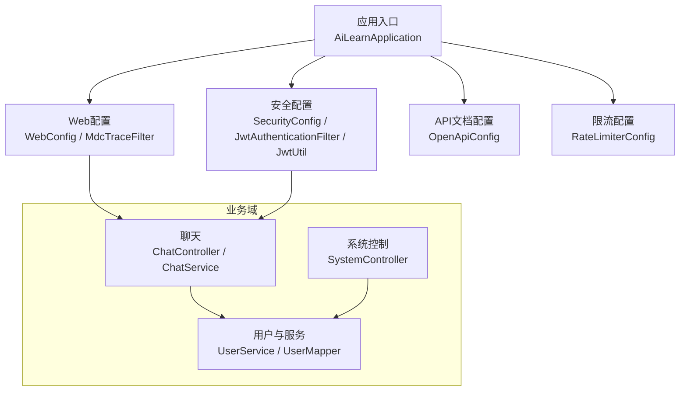
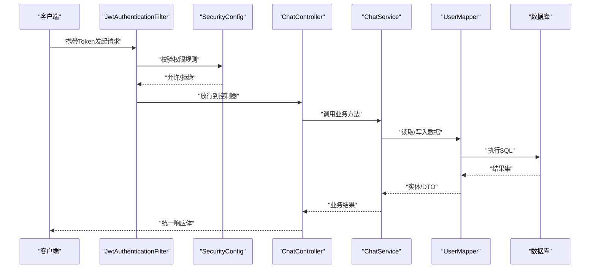
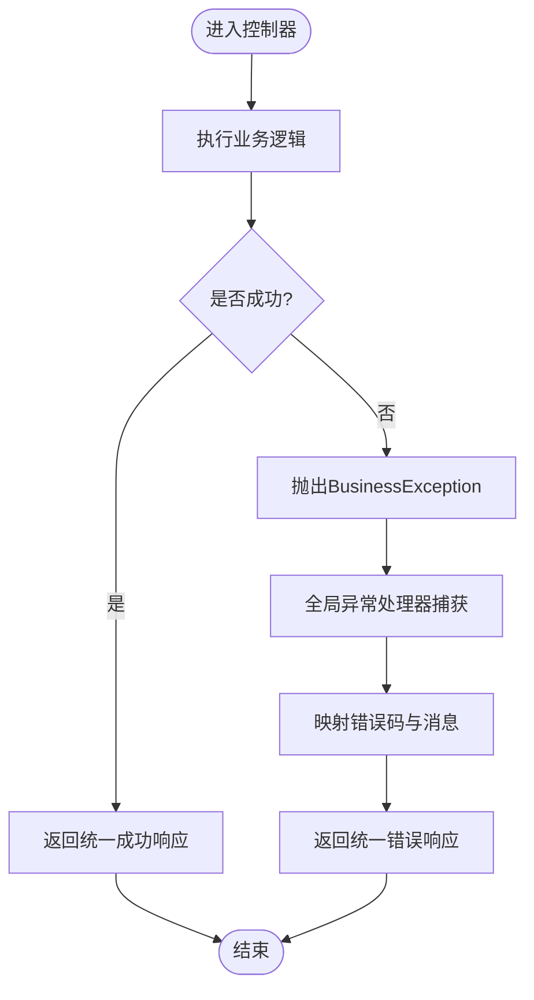
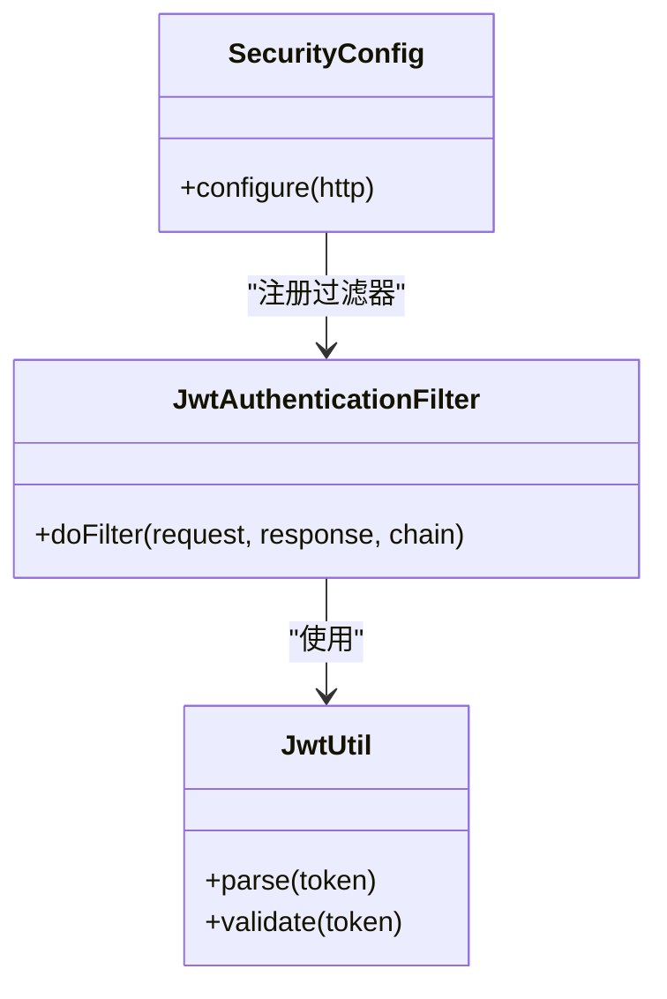
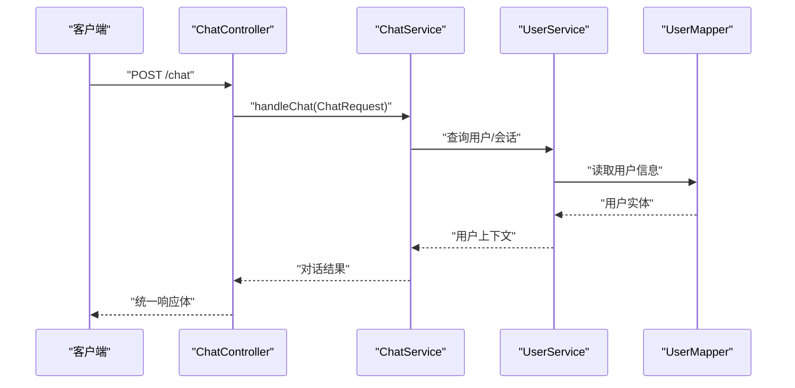

# 开发指南

<cite>
**本文引用的文件**   
- [pom.xml](file://pom.xml)
- [src/main/java/com/ailearn/AiLearnApplication.java](file://src/main/java/com/ailearn/AiLearnApplication.java)
- [src/main/resources/application.yml](file://src/main/resources/application.yml)
- [src/main/resources/logback-spring.xml](file://src/main/resources/logback-spring.xml)
- [src/main/java/com/ailearn/common/Result.java](file://src/main/java/com/ailearn/common/Result.java)
- [src/main/java/com/ailearn/common/BusinessException.java](file://src/main/java/com/ailearn/common/BusinessException.java)
- [src/main/java/com/ailearn/common/ErrorCode.java](file://src/main/java/com/ailearn/common/ErrorCode.java)
- [src/main/java/com/ailearn/common/GlobalExceptionHandler.java](file://src/main/java/com/ailearn/common/GlobalExceptionHandler.java)
- [src/main/java/com/ailearn/config/WebConfig.java](file://src/main/java/com/ailearn/config/WebConfig.java)
- [src/main/java/com/ailearn/config/MdcTraceFilter.java](file://src/main/java/com/ailearn/config/MdcTraceFilter.java)
- [src/main/java/com/ailearn/config/RateLimiterConfig.java](file://src/main/java/com/ailearn/config/RateLimiterConfig.java)
- [src/main/java/com/ailearn/config/OpenApiConfig.java](file://src/main/java/com/ailearn/config/OpenApiConfig.java)
- [src/main/java/com/ailearn/security/JwtUtil.java](file://src/main/java/com/ailearn/security/JwtUtil.java)
- [src/main/java/com/ailearn/security/JwtAuthenticationFilter.java](file://src/main/java/com/ailearn/security/JwtAuthenticationFilter.java)
- [src/main/java/com/ailearn/security/SecurityConfig.java](file://src/main/java/com/ailearn/security/SecurityConfig.java)
- [src/main/java/com/ailearn/chat/ChatController.java](file://src/main/java/com/ailearn/chat/ChatController.java)
- [src/main/java/com/ailearn/chat/ChatService.java](file://src/main/java/com/ailearn/chat/ChatService.java)
- [src/main/java/com/ailearn/dto/ChatRequest.java](file://src/main/java/com/ailearn/dto/ChatRequest.java)
- [src/main/java/com/ailearn/entity/User.java](file://src/main/java/com/ailearn/entity/User.java)
- [src/main/java/com/ailearn/service/UserService.java](file://src/main/java/com/ailearn/service/UserService.java)
- [src/main/java/com/ailearn/controller/SystemController.java](file://src/main/java/com/ailearn/controller/SystemController.java)
- [src/main/java/com/ailearn/mapper/UserMapper.java](file://src/main/java/com/ailearn/mapper/UserMapper.java)
- [src/test/java/com/ailearn/chat/ChatServiceTest.java](file://src/test/java/com/ailearn/chat/ChatServiceTest.java)
- [src/test/java/com/ailearn/common/GlobalExceptionHandlerTest.java](file://src/test/java/com/ailearn/common/GlobalExceptionHandlerTest.java)
- [src/test/java/com/ailearn/common/ResultTest.java](file://src/test/java/com/ailearn/common/ResultTest.java)
- [src/test/java/com/ailearn/controller/UserControllerTest.java](file://src/test/java/com/ailearn/controller/UserControllerTest.java)
- [src/test/java/com/ailearn/security/JwtUtilTest.java](file://src/test/java/com/ailearn/security/JwtUtilTest.java)
- [src/test/java/com/ailearn/service/UserServiceTest.java](file://src/test/java/com/ailearn/service/UserServiceTest.java)
- [src/test/java/com/ailearn/tools/CalculatorToolTest.java](file://src/test/java/com/ailearn/tools/CalculatorToolTest.java)
- [src/test/java/com/ailearn/tools/WeatherToolTest.java](file://src/test/java/com/ailearn/tools/WeatherToolTest.java)
- [src/test/resources/application-test.yml](file://src/test/resources/application-test.yml)
- [docker-compose.yml](file://docker-compose.yml)
- [Dockerfile](file://Dockerfile)
- [.github/workflows/ci-cd.yml](file://.github/workflows/ci-cd.yml)
</cite>

## 目录
1. [简介](#简介)
2. [项目结构](#项目结构)
3. [核心组件](#核心组件)
4. [架构总览](#架构总览)
5. [详细组件分析](#详细组件分析)
6. [依赖与集成](#依赖与集成)
7. [性能考虑](#性能考虑)
8. [故障排查指南](#故障排查指南)
9. [结论](#结论)
10. [附录](#附录)

## 简介
本指南面向新贡献者与日常开发者，围绕Java AI学习平台的功能扩展、代码规范、测试实践、异常与错误码管理、重构与性能优化、第三方库集成与依赖治理、Git工作流与代码审查、调试技巧、日志与监控指标配置、安全编码与输入验证策略，以及开发环境配置与提交规范进行系统化说明。目标是帮助团队以一致的方式高效交付高质量功能。

## 项目结构
本项目采用分层与领域模块结合的目录组织方式：
- 应用入口与全局配置位于主包根目录与config子包
- 控制器层按业务域划分（chat、agent、rag、memory、structured、mcp、tools等）
- DTO/Entity/Mapper分别承载请求模型、持久化实体与数据访问接口
- 通用能力集中在common包（统一响应体、异常、错误码、全局异常处理）
- 安全能力集中在security包（JWT工具、过滤器、安全配置）
- 测试用例遵循与源码相同的包结构，便于定位与维护

图表来源
- [src/main/java/com/ailearn/AiLearnApplication.java](file://src/main/java/com/ailearn/AiLearnApplication.java)
- [src/main/java/com/ailearn/config/WebConfig.java](file://src/main/java/com/ailearn/config/WebConfig.java)
- [src/main/java/com/ailearn/config/MdcTraceFilter.java](file://src/main/java/com/ailearn/config/MdcTraceFilter.java)
- [src/main/java/com/ailearn/config/SecurityConfig.java](file://src/main/java/com/ailearn/config/SecurityConfig.java)
- [src/main/java/com/ailearn/security/JwtAuthenticationFilter.java](file://src/main/java/com/ailearn/security/JwtAuthenticationFilter.java)
- [src/main/java/com/ailearn/security/JwtUtil.java](file://src/main/java/com/ailearn/security/JwtUtil.java)
- [src/main/java/com/ailearn/config/OpenApiConfig.java](file://src/main/java/com/ailearn/config/OpenApiConfig.java)
- [src/main/java/com/ailearn/config/RateLimiterConfig.java](file://src/main/java/com/ailearn/config/RateLimiterConfig.java)
- [src/main/java/com/ailearn/chat/ChatController.java](file://src/main/java/com/ailearn/chat/ChatController.java)
- [src/main/java/com/ailearn/chat/ChatService.java](file://src/main/java/com/ailearn/chat/ChatService.java)
- [src/main/java/com/ailearn/service/UserService.java](file://src/main/java/com/ailearn/service/UserService.java)
- [src/main/java/com/ailearn/mapper/UserMapper.java](file://src/main/java/com/ailearn/mapper/UserMapper.java)
- [src/main/java/com/ailearn/controller/SystemController.java](file://src/main/java/com/ailearn/controller/SystemController.java)

章节来源
- [src/main/java/com/ailearn/AiLearnApplication.java](file://src/main/java/com/ailearn/AiLearnApplication.java)
- [src/main/resources/application.yml](file://src/main/resources/application.yml)

## 核心组件
- 统一响应体 Result：对外返回的标准化JSON结构，包含状态码、消息与数据载荷，用于前后端契约稳定。
- 业务异常 BusinessException：封装业务侧可预期的异常信息，配合全局异常处理器输出友好错误。
- 错误码 ErrorCode：集中定义错误码常量，确保错误码唯一性与可维护性。
- 全局异常处理器 GlobalExceptionHandler：捕获并转换各类异常为统一响应，保证API一致性。
- Web与安全配置：跨域、MDC链路追踪、Spring Security与JWT校验、OpenAPI文档、限流等横切能力。
- 领域服务与控制器：如聊天、用户、系统等，体现清晰的职责边界与分层调用关系。

章节来源
- [src/main/java/com/ailearn/common/Result.java](file://src/main/java/com/ailearn/common/Result.java)
- [src/main/java/com/ailearn/common/BusinessException.java](file://src/main/java/com/ailearn/common/BusinessException.java)
- [src/main/java/com/ailearn/common/ErrorCode.java](file://src/main/java/com/ailearn/common/ErrorCode.java)
- [src/main/java/com/ailearn/common/GlobalExceptionHandler.java](file://src/main/java/com/ailearn/common/GlobalExceptionHandler.java)
- [src/main/java/com/ailearn/config/WebConfig.java](file://src/main/java/com/ailearn/config/WebConfig.java)
- [src/main/java/com/ailearn/config/MdcTraceFilter.java](file://src/main/java/com/ailearn/config/MdcTraceFilter.java)
- [src/main/java/com/ailearn/config/SecurityConfig.java](file://src/main/java/com/ailearn/config/SecurityConfig.java)
- [src/main/java/com/ailearn/security/JwtAuthenticationFilter.java](file://src/main/java/com/ailearn/security/JwtAuthenticationFilter.java)
- [src/main/java/com/ailearn/security/JwtUtil.java](file://src/main/java/com/ailearn/security/JwtUtil.java)
- [src/main/java/com/ailearn/config/OpenApiConfig.java](file://src/main/java/com/ailearn/config/OpenApiConfig.java)
- [src/main/java/com/ailearn/config/RateLimiterConfig.java](file://src/main/java/com/ailearn/config/RateLimiterConfig.java)

## 架构总览
整体采用“控制器-服务-数据访问”的分层架构，结合Spring Security与JWT实现认证鉴权，通过MDC贯穿请求链路，使用统一响应体与全局异常处理保障API一致性，并通过OpenAPI生成文档。

图表来源
- [src/main/java/com/ailearn/security/JwtAuthenticationFilter.java](file://src/main/java/com/ailearn/security/JwtAuthenticationFilter.java)
- [src/main/java/com/ailearn/config/SecurityConfig.java](file://src/main/java/com/ailearn/config/SecurityConfig.java)
- [src/main/java/com/ailearn/chat/ChatController.java](file://src/main/java/com/ailearn/chat/ChatController.java)
- [src/main/java/com/ailearn/chat/ChatService.java](file://src/main/java/com/ailearn/chat/ChatService.java)
- [src/main/java/com/ailearn/mapper/UserMapper.java](file://src/main/java/com/ailearn/mapper/UserMapper.java)

## 详细组件分析

### 统一响应与异常处理
- 设计要点
  - 所有API返回统一结构，避免前端重复解析差异。
  - 业务异常优先抛出，由全局异常处理器转换为统一响应。
  - 错误码集中管理，便于统计与国际化扩展。
- 关键流程
  - 控制器或服务中遇到业务异常时抛出BusinessException。
  - 全局异常处理器捕获后，根据错误码与消息构造统一响应。
  - 未捕获异常降级为默认错误码与提示，避免泄露内部细节。

图表来源
- [src/main/java/com/ailearn/common/Result.java](file://src/main/java/com/ailearn/common/Result.java)
- [src/main/java/com/ailearn/common/BusinessException.java](file://src/main/java/com/ailearn/common/BusinessException.java)
- [src/main/java/com/ailearn/common/ErrorCode.java](file://src/main/java/com/ailearn/common/ErrorCode.java)
- [src/main/java/com/ailearn/common/GlobalExceptionHandler.java](file://src/main/java/com/ailearn/common/GlobalExceptionHandler.java)

章节来源
- [src/main/java/com/ailearn/common/Result.java](file://src/main/java/com/ailearn/common/Result.java)
- [src/main/java/com/ailearn/common/BusinessException.java](file://src/main/java/com/ailearn/common/BusinessException.java)
- [src/main/java/com/ailearn/common/ErrorCode.java](file://src/main/java/com/ailearn/common/ErrorCode.java)
- [src/main/java/com/ailearn/common/GlobalExceptionHandler.java](file://src/main/java/com/ailearn/common/GlobalExceptionHandler.java)

### 安全与鉴权（JWT）
- 设计要点
  - 通过自定义过滤器在请求进入控制器前完成令牌校验。
  - 将用户上下文注入到安全上下文中，供后续授权判断使用。
  - 敏感接口需显式声明鉴权规则。
- 关键流程
  - 过滤器从请求头提取Token，调用工具类解析与校验。
  - 校验通过后设置当前用户主体；失败则返回未授权响应。

图表来源
- [src/main/java/com/ailearn/security/JwtAuthenticationFilter.java](file://src/main/java/com/ailearn/security/JwtAuthenticationFilter.java)
- [src/main/java/com/ailearn/security/JwtUtil.java](file://src/main/java/com/ailearn/security/JwtUtil.java)
- [src/main/java/com/ailearn/config/SecurityConfig.java](file://src/main/java/com/ailearn/config/SecurityConfig.java)

章节来源
- [src/main/java/com/ailearn/security/JwtAuthenticationFilter.java](file://src/main/java/com/ailearn/security/JwtAuthenticationFilter.java)
- [src/main/java/com/ailearn/security/JwtUtil.java](file://src/main/java/com/ailearn/security/JwtUtil.java)
- [src/main/java/com/ailearn/config/SecurityConfig.java](file://src/main/java/com/ailearn/config/SecurityConfig.java)

### 聊天功能（示例）
- 设计要点
  - 控制器负责参数接收与响应组装，服务层承载AI交互与业务编排。
  - 请求DTO集中定义字段与约束，便于校验与文档生成。
- 关键流程
  - 客户端发送聊天请求至控制器。
  - 控制器调用服务层进行对话处理。
  - 服务层可能访问用户或会话数据，最终返回统一响应。

图表来源
- [src/main/java/com/ailearn/chat/ChatController.java](file://src/main/java/com/ailearn/chat/ChatController.java)
- [src/main/java/com/ailearn/chat/ChatService.java](file://src/main/java/com/ailearn/chat/ChatService.java)
- [src/main/java/com/ailearn/dto/ChatRequest.java](file://src/main/java/com/ailearn/dto/ChatRequest.java)
- [src/main/java/com/ailearn/service/UserService.java](file://src/main/java/com/ailearn/service/UserService.java)
- [src/main/java/com/ailearn/mapper/UserMapper.java](file://src/main/java/com/ailearn/mapper/UserMapper.java)

章节来源
- [src/main/java/com/ailearn/chat/ChatController.java](file://src/main/java/com/ailearn/chat/ChatController.java)
- [src/main/java/com/ailearn/chat/ChatService.java](file://src/main/java/com/ailearn/chat/ChatService.java)
- [src/main/java/com/ailearn/dto/ChatRequest.java](file://src/main/java/com/ailearn/dto/ChatRequest.java)
- [src/main/java/com/ailearn/service/UserService.java](file://src/main/java/com/ailearn/service/UserService.java)
- [src/main/java/com/ailearn/mapper/UserMapper.java](file://src/main/java/com/ailearn/mapper/UserMapper.java)

### 系统健康检查
- 提供轻量级健康检查接口，便于容器编排与健康探针。
- 建议返回基础运行状态与依赖可用性摘要。

章节来源
- [src/main/java/com/ailearn/controller/SystemController.java](file://src/main/java/com/ailearn/controller/SystemController.java)

## 依赖与集成
- 构建与依赖管理
  - 使用Maven作为构建工具，依赖版本与插件在构建文件中统一管理。
  - 新增依赖需评估许可证、漏洞风险与最小必要原则。
- 第三方库集成最佳实践
  - 明确引入目的与替代方案，避免过度依赖。
  - 对不稳定外部依赖增加熔断/超时/重试策略。
  - 通过配置项隔离不同环境的密钥与端点。
- 容器化与编排
  - 使用Docker打包镜像，docker-compose编排本地多服务（如数据库、日志收集）。
  - 生产环境建议使用镜像仓库与Kubernetes编排。

章节来源
- [pom.xml](file://pom.xml)
- [Dockerfile](file://Dockerfile)
- [docker-compose.yml](file://docker-compose.yml)

## 性能考虑
- 连接与线程池
  - 合理配置数据库连接池大小与超时时间，避免连接耗尽。
  - 针对AI长耗时任务使用异步线程池，避免阻塞请求线程。
- 缓存与幂等
  - 热点数据引入缓存，注意失效策略与一致性。
  - 对写操作实现幂等键，防止重复提交。
- 限流与降级
  - 基于IP或用户维度进行限流，保护后端资源。
  - 对下游依赖不可用时快速失败与降级返回。
- 日志与监控
  - 仅记录必要信息，避免大对象序列化开销。
  - 暴露关键指标（QPS、延迟、错误率、慢请求）以供监控告警。

[本节为通用指导，不直接分析具体文件]

## 故障排查指南
- 常见问题定位
  - 使用MDC链路ID串联日志，快速定位一次请求的全链路日志。
  - 通过OpenAPI文档核对接口契约，确认入参与出参格式。
  - 借助单元测试与Mock快速复现问题场景。
- 日志与监控
  - 调整日志级别与输出目标，区分INFO/WARN/ERROR。
  - 结合Logstash等组件集中采集与分析日志。
- 安全相关问题
  - 检查JWT签名与过期时间配置，确认过滤器链顺序。
  - 关注跨域与CORS配置，避免浏览器拦截。

章节来源
- [src/main/java/com/ailearn/config/MdcTraceFilter.java](file://src/main/java/com/ailearn/config/MdcTraceFilter.java)
- [src/main/resources/logback-spring.xml](file://src/main/resources/logback-spring.xml)
- [src/main/java/com/ailearn/config/OpenApiConfig.java](file://src/main/java/com/ailearn/config/OpenApiConfig.java)
- [src/main/java/com/ailearn/config/SecurityConfig.java](file://src/main/java/com/ailearn/config/SecurityConfig.java)
- [src/main/java/com/ailearn/security/JwtAuthenticationFilter.java](file://src/main/java/com/ailearn/security/JwtAuthenticationFilter.java)

## 结论
通过统一的响应与异常处理、清晰的分层架构、完善的安全与监控能力，以及规范的测试与CI流程，团队可以持续稳定地交付高质量的AI学习平台功能。建议在迭代中持续完善错误码体系、性能基线与可观测性指标，推动工程效能与质量双提升。

[本节为总结性内容，不直接分析具体文件]

## 附录

### 新功能开发流程
- 需求与设计
  - 明确需求范围与验收标准，产出简要设计说明。
- 分支与提交
  - 基于主干创建功能分支，提交信息遵循约定式提交。
- 开发与自测
  - 编写单元测试与必要的集成测试，覆盖正常与异常路径。
  - 本地启动并完成冒烟测试。
- 代码评审
  - 提交PR，附带变更说明与截图/日志片段。
  - 评审通过后合并至主干，触发CI流水线。
- 发布与回滚
  - 按发布计划打标签与发布，准备回滚预案。

[本节为流程性内容，不直接分析具体文件]

### 代码规范
- 命名与风格
  - 类名采用大驼峰，方法与变量小驼峰，常量全大写加下划线。
  - 保持单一职责，方法长度适中，复杂逻辑拆分为私有方法。
- 分层与依赖
  - 控制器不持有业务逻辑，服务层不直接操作HTTP。
  - 禁止循环依赖，必要时引入事件或接口解耦。
- 注释与文档
  - 公共API与方法需有清晰注释，复杂算法补充思路说明。
  - 接口变更同步更新OpenAPI文档。

[本节为通用规范，不直接分析具体文件]

### 单元测试编写规范与用例设计
- 框架与结构
  - 使用JUnit与Mockito进行单元与集成测试，测试类与源码包结构对应。
- 用例设计
  - 正向路径：覆盖典型输入与预期输出。
  - 异常路径：覆盖非法输入、空值、边界条件与外部依赖异常。
  - 断言充分：不仅断言返回值，还断言副作用（如状态变化）。
- 可重复与环境
  - 使用独立测试配置与内存数据库或Testcontainers。
  - 避免共享状态，保证测试并行执行无干扰。

章节来源
- [src/test/java/com/ailearn/chat/ChatServiceTest.java](file://src/test/java/com/ailearn/chat/ChatServiceTest.java)
- [src/test/java/com/ailearn/common/GlobalExceptionHandlerTest.java](file://src/test/java/com/ailearn/common/GlobalExceptionHandlerTest.java)
- [src/test/java/com/ailearn/common/ResultTest.java](file://src/test/java/com/ailearn/common/ResultTest.java)
- [src/test/java/com/ailearn/controller/UserControllerTest.java](file://src/test/java/com/ailearn/controller/UserControllerTest.java)
- [src/test/java/com/ailearn/security/JwtUtilTest.java](file://src/test/java/com/ailearn/security/JwtUtilTest.java)
- [src/test/java/com/ailearn/service/UserServiceTest.java](file://src/test/java/com/ailearn/service/UserServiceTest.java)
- [src/test/java/com/ailearn/tools/CalculatorToolTest.java](file://src/test/java/com/ailearn/tools/CalculatorToolTest.java)
- [src/test/java/com/ailearn/tools/WeatherToolTest.java](file://src/test/java/com/ailearn/tools/WeatherToolTest.java)
- [src/test/resources/application-test.yml](file://src/test/resources/application-test.yml)

### 异常处理机制与错误码管理
- 异常分类
  - 业务异常：可预期且应被上层捕获处理。
  - 系统异常：不可预期，需记录堆栈并返回通用错误码。
- 错误码管理
  - 集中定义错误码，保持唯一性与可读性。
  - 对外错误消息脱敏，避免泄露内部实现细节。
- 全局处理
  - 统一捕获并转换为统一响应体，保证前端一致性。

章节来源
- [src/main/java/com/ailearn/common/BusinessException.java](file://src/main/java/com/ailearn/common/BusinessException.java)
- [src/main/java/com/ailearn/common/ErrorCode.java](file://src/main/java/com/ailearn/common/ErrorCode.java)
- [src/main/java/com/ailearn/common/GlobalExceptionHandler.java](file://src/main/java/com/ailearn/common/GlobalExceptionHandler.java)
- [src/main/java/com/ailearn/common/Result.java](file://src/main/java/com/ailearn/common/Result.java)

### 代码重构与性能优化指导
- 重构原则
  - 小步快跑，频繁提交与测试，确保行为不变。
  - 优先消除重复代码与坏味道，提升内聚与降低耦合。
- 性能优化
  - 识别热点路径，减少不必要的对象创建与IO。
  - 合理使用索引与分页，避免N+1查询。
  - 对AI相关长耗时任务采用异步与批处理。

[本节为通用指导，不直接分析具体文件]

### 第三方库集成与依赖管理最佳实践
- 选择与评估
  - 评估活跃度、社区支持、许可证与已知漏洞。
- 版本与冲突
  - 使用BOM或父POM统一管理版本，避免冲突。
  - 锁定关键依赖版本，定期升级并回归测试。
- 配置与开关
  - 通过配置文件或环境变量切换不同实现与端点。

章节来源
- [pom.xml](file://pom.xml)

### Git工作流与代码审查流程
- 分支策略
  - 主干保护，功能分支开发，特性分支合并前需评审。
- 提交规范
  - 使用约定式提交，描述变更意图与影响范围。
- 代码审查
  - 至少一名Reviewer，关注正确性、可维护性与安全性。
  - CI必须通过方可合并。

章节来源
- [.github/workflows/ci-cd.yml](file://.github/workflows/ci-cd.yml)

### 调试技巧与常见问题解决方案
- 本地调试
  - 启用热重载与远程调试端口，逐步排查问题。
  - 使用Postman或OpenAPI UI进行接口联调。
- 日志与链路
  - 开启DEBUG级别临时定位，结合MDC链路ID检索日志。
- 常见问题
  - CORS跨域：检查白名单与预检请求。
  - JWT鉴权失败：检查签名、过期时间与过滤器链顺序。
  - 数据库连接异常：检查连接池与网络连通性。

章节来源
- [src/main/java/com/ailearn/config/MdcTraceFilter.java](file://src/main/java/com/ailearn/config/MdcTraceFilter.java)
- [src/main/resources/logback-spring.xml](file://src/main/resources/logback-spring.xml)
- [src/main/java/com/ailearn/config/OpenApiConfig.java](file://src/main/java/com/ailearn/config/OpenApiConfig.java)
- [src/main/java/com/ailearn/config/SecurityConfig.java](file://src/main/java/com/ailearn/config/SecurityConfig.java)
- [src/main/java/com/ailearn/security/JwtAuthenticationFilter.java](file://src/main/java/com/ailearn/security/JwtAuthenticationFilter.java)

### 日志记录与监控指标配置
- 日志
  - 结构化输出，包含请求ID、用户ID与耗时。
  - 分离应用日志与访问日志，便于分析与归档。
- 监控
  - 暴露JVM与应用指标，接入Prometheus/Grafana。
  - 对关键业务埋点，统计成功率与延迟分布。

章节来源
- [src/main/resources/logback-spring.xml](file://src/main/resources/logback-spring.xml)
- [src/main/resources/application.yml](file://src/main/resources/application.yml)

### 安全编码规范与输入验证策略
- 安全编码
  - 避免硬编码密钥，使用配置中心或环境变量。
  - 对敏感信息进行脱敏与加密存储。
- 输入验证
  - 使用注解校验器在服务层与控制器层双重校验。
  - 对AI输入进行长度、内容与格式限制，防止注入与滥用。

章节来源
- [src/main/java/com/ailearn/config/SecurityConfig.java](file://src/main/java/com/ailearn/config/SecurityConfig.java)
- [src/main/java/com/ailearn/security/JwtAuthenticationFilter.java](file://src/main/java/com/ailearn/security/JwtAuthenticationFilter.java)
- [src/main/java/com/ailearn/dto/ChatRequest.java](file://src/main/java/com/ailearn/dto/ChatRequest.java)

### 新贡献者开发环境配置与提交规范
- 环境要求
  - JDK版本、Maven版本与IDEA插件建议。
- 本地启动
  - 使用docker-compose拉起依赖服务，修改application-test.yml适配本地。
- 提交规范
  - 使用约定式提交，包含类型、范围与简短描述。
  - 提交前运行测试与静态检查，确保CI可过。

章节来源
- [src/test/resources/application-test.yml](file://src/test/resources/application-test.yml)
- [docker-compose.yml](file://docker-compose.yml)
- [.github/workflows/ci-cd.yml](file://.github/workflows/ci-cd.yml)