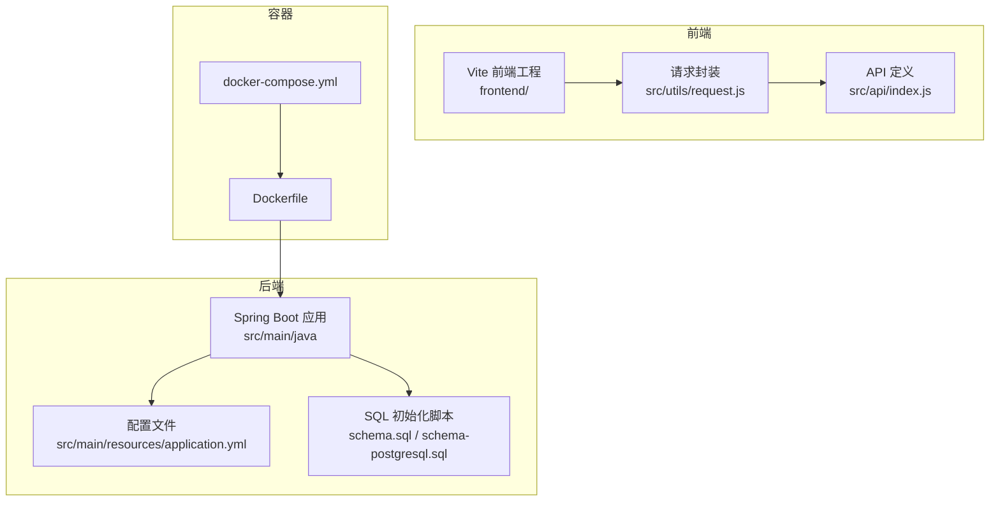
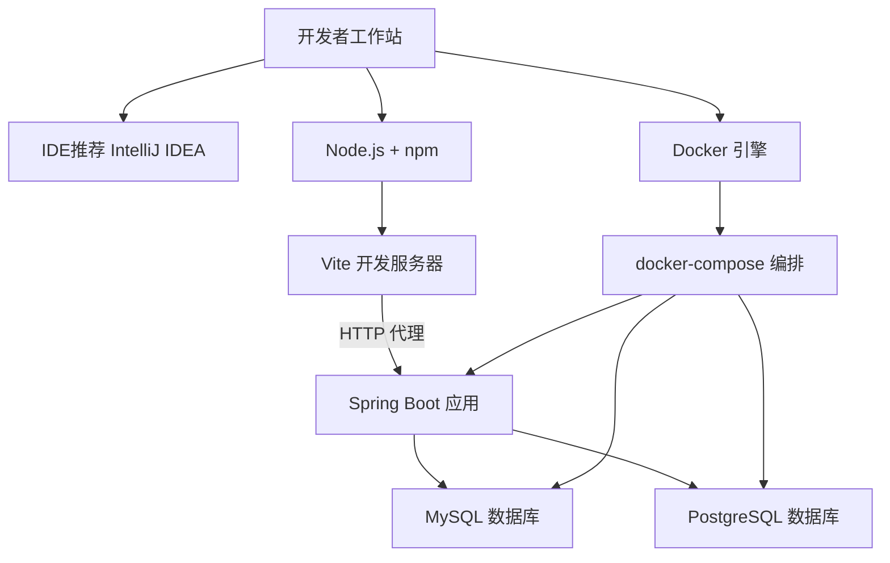
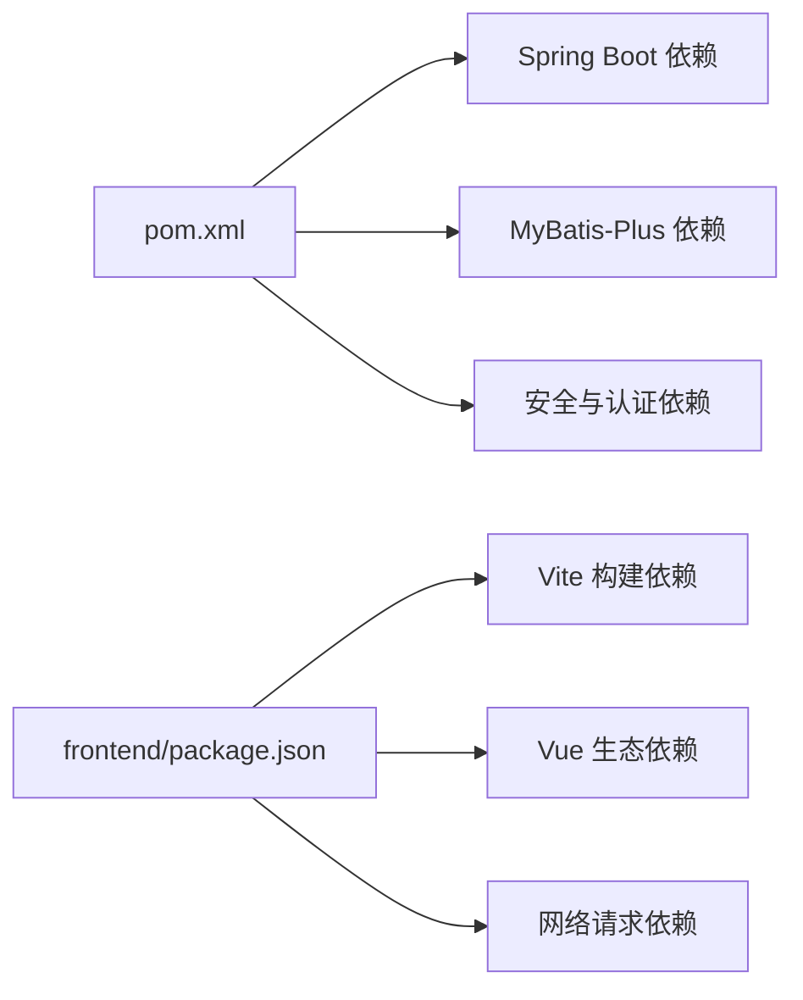

# 开发环境配置

<cite>
**本文引用的文件**   
- [pom.xml](file://pom.xml)
- [application.yml](file://src/main/resources/application.yml)
- [schema.sql](file://src/main/resources/schema.sql)
- [schema-postgresql.sql](file://src/main/resources/schema-postgresql.sql)
- [Dockerfile](file://Dockerfile)
- [docker-compose.yml](file://docker-compose.yml)
- [frontend/package.json](file://frontend/package.json)
- [frontend/vite.config.js](file://frontend/vite.config.js)
- [frontend/src/utils/request.js](file://frontend/src/utils/request.js)
- [frontend/src/api/index.js](file://frontend/src/api/index.js)
- [frontend/README.md](file://frontend/README.md)
- [docs/DEPLOYMENT.md](file://docs/DEPLOYMENT.md)
</cite>

## 目录
1. [简介](#简介)
2. [项目结构](#项目结构)
3. [核心组件](#核心组件)
4. [架构总览](#架构总览)
5. [详细组件分析](#详细组件分析)
6. [依赖分析](#依赖分析)
7. [性能考虑](#性能考虑)
8. [故障排查指南](#故障排查指南)
9. [结论](#结论)
10. [附录](#附录)

## 简介
本指南面向本地与容器化开发，覆盖以下目标：
- Java 开发环境的安装与配置（JDK、IDE、Maven）
- 前端开发环境搭建（Node.js、npm、Vite）
- 数据库环境配置（MySQL、PostgreSQL）
- Docker 快速启动
- 环境变量与敏感信息管理
- 多环境配置切换机制
- 常见问题排查与解决方案

## 项目结构
本项目采用前后端分离的单体工程组织方式：
- 后端基于 Spring Boot + MyBatis-Plus，资源文件位于 src/main/resources
- 前端位于 frontend 目录，使用 Vite 构建
- 提供 Dockerfile 与 docker-compose.yml 用于容器化运行
- 数据库初始化脚本位于 resources 下，分别对应 MySQL 与 PostgreSQL

图表来源
- [application.yml](file://src/main/resources/application.yml)
- [schema.sql](file://src/main/resources/schema.sql)
- [schema-postgresql.sql](file://src/main/resources/schema-postgresql.sql)
- [frontend/package.json](file://frontend/package.json)
- [frontend/vite.config.js](file://frontend/vite.config.js)
- [frontend/src/utils/request.js](file://frontend/src/utils/request.js)
- [frontend/src/api/index.js](file://frontend/src/api/index.js)
- [Dockerfile](file://Dockerfile)
- [docker-compose.yml](file://docker-compose.yml)

章节来源
- [pom.xml](file://pom.xml)
- [application.yml](file://src/main/resources/application.yml)
- [frontend/package.json](file://frontend/package.json)
- [frontend/vite.config.js](file://frontend/vite.config.js)
- [Dockerfile](file://Dockerfile)
- [docker-compose.yml](file://docker-compose.yml)

## 核心组件
- 后端技术栈
  - 构建工具：Maven（参考 pom.xml）
  - 运行时：Java（建议 JDK 17，见下文“版本要求”）
  - 框架：Spring Boot、MyBatis-Plus
  - 配置：application.yml（数据源、日志等）
  - 数据库：MySQL、PostgreSQL（通过不同 SQL 脚本支持）
- 前端技术栈
  - 构建工具：Vite
  - 包管理：npm（参考 package.json）
  - 代理：vite.config.js 中配置后端接口代理
  - 请求封装：utils/request.js 统一处理基础 URL、拦截器
- 容器化
  - Dockerfile：构建后端镜像
  - docker-compose.yml：编排应用与数据库服务

章节来源
- [pom.xml](file://pom.xml)
- [application.yml](file://src/main/resources/application.yml)
- [frontend/package.json](file://frontend/package.json)
- [frontend/vite.config.js](file://frontend/vite.config.js)
- [frontend/src/utils/request.js](file://frontend/src/utils/request.js)
- [Dockerfile](file://Dockerfile)
- [docker-compose.yml](file://docker-compose.yml)

## 架构总览
下图展示本地开发与容器化运行的整体关系。

图表来源
- [frontend/vite.config.js](file://frontend/vite.config.js)
- [frontend/src/utils/request.js](file://frontend/src/utils/request.js)
- [application.yml](file://src/main/resources/application.yml)
- [docker-compose.yml](file://docker-compose.yml)

## 详细组件分析

### Java 开发环境与 Maven 配置
- JDK 版本
  - 建议使用 JDK 17（与 Spring Boot 主流版本兼容）。若需调整，请确保与 pom.xml 中配置的编译与运行版本一致。
- IDE 推荐设置
  - 推荐使用 IntelliJ IDEA，启用 Lombok（如使用）、自动导入、格式化规则与 Spring Boot 插件提示。
- Maven 构建
  - 使用 mvn clean install 进行依赖解析与打包；如需指定仓库或代理，请在 Maven settings.xml 中配置。
  - 注意：首次构建会下载大量依赖，建议配置国内镜像以提升速度。

章节来源
- [pom.xml](file://pom.xml)

### 前端开发环境搭建（Node.js + npm + Vite）
- Node.js 版本
  - 建议使用 LTS 版本（例如 18.x 或 20.x），与 package.json 中的 engines 字段保持一致。
- 安装依赖与启动
  - 进入 frontend 目录执行 npm install 安装依赖
  - 执行 npm run dev 启动 Vite 开发服务器
- 代理与 API 访问
  - vite.config.js 中配置了后端接口代理，便于本地联调
  - request.js 中定义了基础请求地址与通用拦截逻辑
  - api/index.js 集中声明业务接口调用

章节来源
- [frontend/package.json](file://frontend/package.json)
- [frontend/vite.config.js](file://frontend/vite.config.js)
- [frontend/src/utils/request.js](file://frontend/src/utils/request.js)
- [frontend/src/api/index.js](file://frontend/src/api/index.js)
- [frontend/README.md](file://frontend/README.md)

### 数据库环境配置（MySQL 与 PostgreSQL）
- 初始化脚本
  - MySQL：resources/schema.sql
  - PostgreSQL：resources/schema-postgresql.sql
- 连接配置
  - application.yml 中配置数据源相关参数（驱动、URL、用户名、密码等）
  - 根据实际使用的数据库选择对应的脚本进行初始化
- 多数据库支持
  - 可通过切换 application.yml 中的数据源配置与初始化脚本实现

章节来源
- [application.yml](file://src/main/resources/application.yml)
- [schema.sql](file://src/main/resources/schema.sql)
- [schema-postgresql.sql](file://src/main/resources/schema-postgresql.sql)

### Docker 开发环境快速启动
- 单镜像构建
  - 使用根目录 Dockerfile 构建后端镜像
- 一键编排
  - 使用 docker-compose.yml 同时启动应用与数据库服务
- 常用命令
  - 构建并启动：docker compose up --build
  - 后台运行：docker compose up -d
  - 查看日志：docker compose logs -f
  - 停止服务：docker compose down

章节来源
- [Dockerfile](file://Dockerfile)
- [docker-compose.yml](file://docker-compose.yml)

### 环境变量与敏感信息管理
- 环境变量
  - 建议在 application.yml 中使用占位符引用环境变量（如 ${DB_URL}、${DB_USERNAME}、${DB_PASSWORD}）
  - 在本地开发时，可通过系统环境变量或 IDE 运行配置注入
- 敏感信息
  - 避免将密钥、密码等硬编码到代码或配置文件中
  - 优先使用操作系统级环境变量或密钥管理服务
  - 提交前检查 .gitignore，确保不泄露敏感文件

章节来源
- [application.yml](file://src/main/resources/application.yml)

### 多环境配置切换机制
- 方案一：application-{profile}.yml
  - 创建 application-dev.yml、application-prod.yml 等，并在 application.yml 中激活对应 profile
- 方案二：外部配置覆盖
  - 通过命令行参数或环境变量覆盖关键配置项（如数据源、端口等）
- 方案三：容器化环境
  - 在 docker-compose.yml 或 Dockerfile 中注入不同环境的变量与配置

章节来源
- [application.yml](file://src/main/resources/application.yml)
- [docker-compose.yml](file://docker-compose.yml)

## 依赖分析
- 后端依赖
  - 由 pom.xml 统一管理，包含 Web、持久层、安全、工具库等
  - 建议固定版本号或使用 BOM 管理，避免冲突
- 前端依赖
  - 由 frontend/package.json 管理，包含 Vite、Vue 生态、网络请求库等
  - 锁定依赖版本（package-lock.json）以保证可重复构建

图表来源
- [pom.xml](file://pom.xml)
- [frontend/package.json](file://frontend/package.json)

章节来源
- [pom.xml](file://pom.xml)
- [frontend/package.json](file://frontend/package.json)

## 性能考虑
- 构建优化
  - Maven：开启并行构建、使用本地缓存与镜像仓库
  - npm：使用 pnpm/yarn 替代 npm 可提升安装与构建速度
- 运行时优化
  - 合理设置 JVM 参数（堆大小、GC 策略）
  - 数据库连接池大小与超时时间按负载调优
- 前端优化
  - 按需引入与分包，减少首屏体积
  - 开启 gzip/brotli 压缩

[本节为通用指导，无需源码引用]

## 故障排查指南
- 无法解析 Maven 依赖
  - 检查网络与镜像配置；清理本地仓库后重试
- 前端启动失败
  - 确认 Node.js 版本符合 package.json 的 engines 要求
  - 删除 node_modules 后重新安装依赖
- 数据库连接失败
  - 核对 application.yml 中的驱动、URL、用户名、密码
  - 确认数据库服务已启动且端口可达
  - 确认已执行对应数据库的初始化脚本
- 跨域或代理问题
  - 检查 vite.config.js 的代理配置是否与后端路径匹配
  - 检查 request.js 的基础地址与拦截器逻辑
- 容器启动异常
  - 使用 docker compose logs 查看具体错误
  - 检查端口占用与镜像构建上下文

章节来源
- [application.yml](file://src/main/resources/application.yml)
- [frontend/vite.config.js](file://frontend/vite.config.js)
- [frontend/src/utils/request.js](file://frontend/src/utils/request.js)
- [docker-compose.yml](file://docker-compose.yml)

## 结论
按照本指南完成 JDK、Maven、Node.js、数据库与 Docker 的配置后，即可在本地或容器中快速启动前后端服务。通过环境变量与多环境配置机制，可在不同环境下灵活切换。遇到问题时，可依据排查指南定位并解决常见环境问题。

[本节为总结性内容，无需源码引用]

## 附录
- 部署文档
  - 参见 docs/DEPLOYMENT.md 获取更详细的部署说明与环境准备清单

章节来源
- [docs/DEPLOYMENT.md](file://docs/DEPLOYMENT.md)