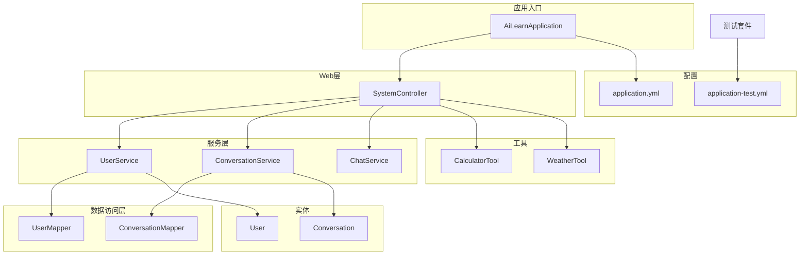
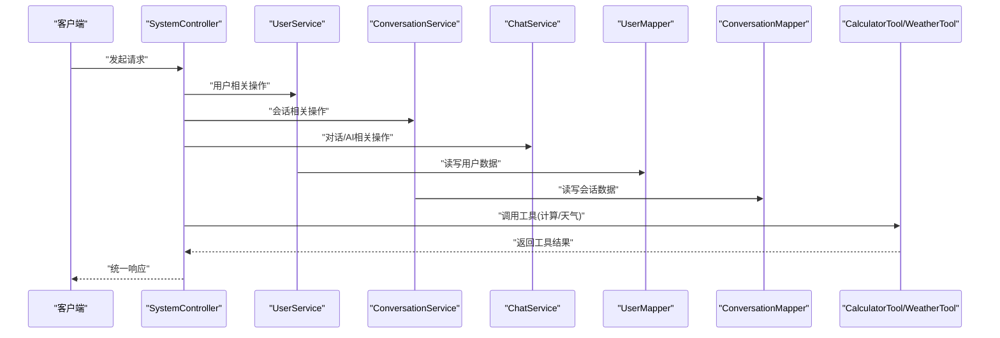
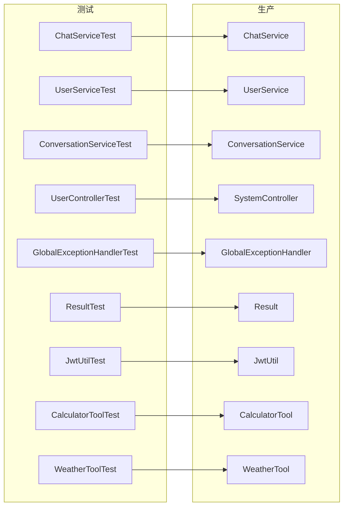

# 测试策略

<cite>
**本文引用的文件**   
- [pom.xml](file://pom.xml)
- [src/main/java/com/ailearn/AiLearnApplication.java](file://src/main/java/com/ailearn/AiLearnApplication.java)
- [src/main/resources/application.yml](file://src/main/resources/application.yml)
- [src/test/resources/application-test.yml](file://src/test/resources/application-test.yml)
- [src/test/java/com/ailearn/AiLearnApplicationTests.java](file://src/test/java/com/ailearn/AiLearnApplicationTests.java)
- [src/test/java/com/ailearn/config/TestConfig.java](file://src/test/java/com/ailearn/config/TestConfig.java)
- [src/test/java/com/ailearn/chat/ChatServiceTest.java](file://src/test/java/com/ailearn/chat/ChatServiceTest.java)
- [src/test/java/com/ailearn/service/UserServiceTest.java](file://src/test/java/com/ailearn/service/UserServiceTest.java)
- [src/test/java/com/ailearn/service/ConversationServiceTest.java](file://src/test/java/com/ailearn/service/ConversationServiceTest.java)
- [src/test/java/com/ailearn/controller/UserControllerTest.java](file://src/test/java/com/ailearn/controller/UserControllerTest.java)
- [src/test/java/com/ailearn/common/GlobalExceptionHandlerTest.java](file://src/test/java/com/ailearn/common/GlobalExceptionHandlerTest.java)
- [src/test/java/com/ailearn/common/ResultTest.java](file://src/test/java/com/ailearn/common/ResultTest.java)
- [src/test/java/com/ailearn/security/JwtUtilTest.java](file://src/test/java/com/ailearn/security/JwtUtilTest.java)
- [src/test/java/com/ailearn/tools/CalculatorToolTest.java](file://src/test/java/com/ailearn/tools/CalculatorToolTest.java)
- [src/test/java/com/ailearn/tools/WeatherToolTest.java](file://src/test/java/com/ailearn/tools/WeatherToolTest.java)
- [src/main/java/com/ailearn/common/GlobalExceptionHandler.java](file://src/main/java/com/ailearn/common/GlobalExceptionHandler.java)
- [src/main/java/com/ailearn/common/Result.java](file://src/main/java/com/ailearn/common/Result.java)
- [src/main/java/com/ailearn/security/JwtUtil.java](file://src/main/java/com/ailearn/security/JwtUtil.java)
- [src/main/java/com/ailearn/chat/ChatService.java](file://src/main/java/com/ailearn/chat/ChatService.java)
- [src/main/java/com/ailearn/service/UserService.java](file://src/main/java/com/ailearn/service/UserService.java)
- [src/main/java/com/ailearn/service/ConversationService.java](file://src/main/java/com/ailearn/service/ConversationService.java)
- [src/main/java/com/ailearn/controller/SystemController.java](file://src/main/java/com/ailearn/controller/SystemController.java)
- [src/main/java/com/ailearn/mapper/UserMapper.java](file://src/main/java/com/ailearn/mapper/UserMapper.java)
- [src/main/java/com/ailearn/mapper/ConversationMapper.java](file://src/main/java/com/ailearn/mapper/ConversationMapper.java)
- [src/main/java/com/ailearn/entity/User.java](file://src/main/java/com/ailearn/entity/User.java)
- [src/main/java/com/ailearn/entity/Conversation.java](file://src/main/java/com/ailearn/entity/Conversation.java)
- [src/main/java/com/ailearn/tools/CalculatorTool.java](file://src/main/java/com/ailearn/tools/CalculatorTool.java)
- [src/main/java/com/ailearn/tools/WeatherTool.java](file://src/main/java/com/ailearn/tools/WeatherTool.java)
- [docker-compose.yml](file://docker-compose.yml)
- [.github/workflows/ci-cd.yml](file://.github/workflows/ci-cd.yml)
</cite>

## 目录
1. [引言](#引言)
2. [项目结构](#项目结构)
3. [核心组件](#核心组件)
4. [架构总览](#架构总览)
5. [详细组件分析](#详细组件分析)
6. [依赖分析](#依赖分析)
7. [性能考虑](#性能考虑)
8. [故障排查指南](#故障排查指南)
9. [结论](#结论)
10. [附录](#附录)

## 引言
本测试策略面向Java AI学习平台，目标是建立覆盖单元测试、集成测试、API测试、AI服务集成测试、数据与环境的隔离方案、覆盖率要求、关键模块测试重点、性能与压力测试、自动化与持续集成、调试技巧与常见问题、以及TDD实践的系统化规范。文档以现有代码库为基础，结合Spring生态与JUnit5/Mockito最佳实践，给出可落地的实施路径。

## 项目结构
本项目采用分层架构：控制器层、服务层、数据访问层（MyBatis-Plus）、实体与DTO、配置与安全、工具与AI相关能力等。测试代码位于src/test下，包含应用启动类测试、通用异常处理与结果封装测试、安全工具测试、业务服务与控制器测试、工具方法测试等，并提供了测试专用配置文件application-test.yml。

图表来源
- [src/main/java/com/ailearn/AiLearnApplication.java](file://src/main/java/com/ailearn/AiLearnApplication.java)
- [src/main/java/com/ailearn/controller/SystemController.java](file://src/main/java/com/ailearn/controller/SystemController.java)
- [src/main/java/com/ailearn/service/UserService.java](file://src/main/java/com/ailearn/service/UserService.java)
- [src/main/java/com/ailearn/service/ConversationService.java](file://src/main/java/com/ailearn/service/ConversationService.java)
- [src/main/java/com/ailearn/chat/ChatService.java](file://src/main/java/com/ailearn/chat/ChatService.java)
- [src/main/java/com/ailearn/mapper/UserMapper.java](file://src/main/java/com/ailearn/mapper/UserMapper.java)
- [src/main/java/com/ailearn/mapper/ConversationMapper.java](file://src/main/java/com/ailearn/mapper/ConversationMapper.java)
- [src/main/java/com/ailearn/entity/User.java](file://src/main/java/com/ailearn/entity/User.java)
- [src/main/java/com/ailearn/entity/Conversation.java](file://src/main/java/com/ailearn/entity/Conversation.java)
- [src/main/java/com/ailearn/tools/CalculatorTool.java](file://src/main/java/com/ailearn/tools/CalculatorTool.java)
- [src/main/java/com/ailearn/tools/WeatherTool.java](file://src/main/java/com/ailearn/tools/WeatherTool.java)
- [src/main/resources/application.yml](file://src/main/resources/application.yml)
- [src/test/resources/application-test.yml](file://src/test/resources/application-test.yml)

章节来源
- [src/main/java/com/ailearn/AiLearnApplication.java](file://src/main/java/com/ailearn/AiLearnApplication.java)
- [src/main/resources/application.yml](file://src/main/resources/application.yml)
- [src/test/resources/application-test.yml](file://src/test/resources/application-test.yml)

## 核心组件
- 应用启动与配置
  - 应用主类负责装配Spring上下文；测试通过独立配置文件加载测试环境。
- 通用组件
  - 全局异常处理器统一错误响应格式；结果封装对象用于标准化返回体。
- 安全组件
  - JWT工具提供令牌生成与校验逻辑，需进行边界与异常场景的单元测试。
- 业务服务
  - 用户与会话服务承载核心业务；聊天服务对接AI能力。
- 数据访问
  - MyBatis-Plus Mapper接口定义数据操作；实体模型映射数据库表。
- 工具
  - 计算器与天气工具作为示例外部能力，适合用Mock或Stub验证调用流程。

章节来源
- [src/main/java/com/ailearn/common/GlobalExceptionHandler.java](file://src/main/java/com/ailearn/common/GlobalExceptionHandler.java)
- [src/main/java/com/ailearn/common/Result.java](file://src/main/java/com/ailearn/common/Result.java)
- [src/main/java/com/ailearn/security/JwtUtil.java](file://src/main/java/com/ailearn/security/JwtUtil.java)
- [src/main/java/com/ailearn/service/UserService.java](file://src/main/java/com/ailearn/service/UserService.java)
- [src/main/java/com/ailearn/service/ConversationService.java](file://src/main/java/com/ailearn/service/ConversationService.java)
- [src/main/java/com/ailearn/chat/ChatService.java](file://src/main/java/com/ailearn/chat/ChatService.java)
- [src/main/java/com/ailearn/mapper/UserMapper.java](file://src/main/java/com/ailearn/mapper/UserMapper.java)
- [src/main/java/com/ailearn/mapper/ConversationMapper.java](file://src/main/java/com/ailearn/mapper/ConversationMapper.java)
- [src/main/java/com/ailearn/entity/User.java](file://src/main/java/com/ailearn/entity/User.java)
- [src/main/java/com/ailearn/entity/Conversation.java](file://src/main/java/com/ailearn/entity/Conversation.java)
- [src/main/java/com/ailearn/tools/CalculatorTool.java](file://src/main/java/com/ailearn/tools/CalculatorTool.java)
- [src/main/java/com/ailearn/tools/WeatherTool.java](file://src/main/java/com/ailearn/tools/WeatherTool.java)

## 架构总览
下图展示从控制器到服务、数据访问与工具的调用关系，便于定位测试断点与模拟范围。

图表来源
- [src/main/java/com/ailearn/controller/SystemController.java](file://src/main/java/com/ailearn/controller/SystemController.java)
- [src/main/java/com/ailearn/service/UserService.java](file://src/main/java/com/ailearn/service/UserService.java)
- [src/main/java/com/ailearn/service/ConversationService.java](file://src/main/java/com/ailearn/service/ConversationService.java)
- [src/main/java/com/ailearn/chat/ChatService.java](file://src/main/java/com/ailearn/chat/ChatService.java)
- [src/main/java/com/ailearn/mapper/UserMapper.java](file://src/main/java/com/ailearn/mapper/UserMapper.java)
- [src/main/java/com/ailearn/mapper/ConversationMapper.java](file://src/main/java/com/ailearn/mapper/ConversationMapper.java)
- [src/main/java/com/ailearn/tools/CalculatorTool.java](file://src/main/java/com/ailearn/tools/CalculatorTool.java)
- [src/main/java/com/ailearn/tools/WeatherTool.java](file://src/main/java/com/ailearn/tools/WeatherTool.java)

## 详细组件分析

### 单元测试编写规范（JUnit5 + Mockito）
- 命名与组织
  - 测试类与方法使用清晰语义化命名，遵循“被测方法_场景_期望”模式。
  - 按包结构对齐源码，保持一一对应。
- 用例设计
  - 正常路径、边界值、异常分支全覆盖；对空输入、非法参数、越界条件进行断言。
- Mock策略
  - 使用Mockito对下游依赖（如Mapper、外部工具、AI客户端）进行模拟，避免真实IO与网络调用。
  - 对返回值与异常抛出分别设置when/thenReturn与thenThrow，确保行为可控。
- 断言与可读性
  - 使用assertThat风格断言，明确预期与实际差异信息。
  - 为复杂分支添加注释说明业务意图。
- 可重复性与隔离
  - 每个用例自包含，不依赖执行顺序；必要时在@AfterEach清理状态。
- 参考实现位置
  - 工具类测试：[CalculatorToolTest](file://src/test/java/com/ailearn/tools/CalculatorToolTest.java)、[WeatherToolTest](file://src/test/java/com/ailearn/tools/WeatherToolTest.java)
  - 安全工具测试：[JwtUtilTest](file://src/test/java/com/ailearn/security/JwtUtilTest.java)
  - 通用组件测试：[GlobalExceptionHandlerTest](file://src/test/java/com/ailearn/common/GlobalExceptionHandlerTest.java)、[ResultTest](file://src/test/java/com/ailearn/common/ResultTest.java)
  - 服务层测试：[UserServiceTest](file://src/test/java/com/ailearn/service/UserServiceTest.java)、[ConversationServiceTest](file://src/test/java/com/ailearn/service/ConversationServiceTest.java)、[ChatServiceTest](file://src/test/java/com/ailearn/chat/ChatServiceTest.java)

章节来源
- [src/test/java/com/ailearn/tools/CalculatorToolTest.java](file://src/test/java/com/ailearn/tools/CalculatorToolTest.java)
- [src/test/java/com/ailearn/tools/WeatherToolTest.java](file://src/test/java/com/ailearn/tools/WeatherToolTest.java)
- [src/test/java/com/ailearn/security/JwtUtilTest.java](file://src/test/java/com/ailearn/security/JwtUtilTest.java)
- [src/test/java/com/ailearn/common/GlobalExceptionHandlerTest.java](file://src/test/java/com/ailearn/common/GlobalExceptionHandlerTest.java)
- [src/test/java/com/ailearn/common/ResultTest.java](file://src/test/java/com/ailearn/common/ResultTest.java)
- [src/test/java/com/ailearn/service/UserServiceTest.java](file://src/test/java/com/ailearn/service/UserServiceTest.java)
- [src/test/java/com/ailearn/service/ConversationServiceTest.java](file://src/test/java/com/ailearn/service/ConversationServiceTest.java)
- [src/test/java/com/ailearn/chat/ChatServiceTest.java](file://src/test/java/com/ailearn/chat/ChatServiceTest.java)

### 集成测试设计模式
- 数据库测试
  - 使用H2内存数据库或容器化PostgreSQL，配合schema脚本初始化数据。
  - 使用@Transactional保证用例前后数据一致性，必要时使用@DirtiesContext隔离上下文。
  - 参考测试配置：[application-test.yml](file://src/test/resources/application-test.yml)
- API接口测试
  - 使用@SpringBootTest + @AutoConfigureMockMvc进行无容器HTTP测试；对认证、限流、异常路径进行验证。
  - 参考控制器测试：[UserControllerTest](file://src/test/java/com/ailearn/controller/UserControllerTest.java)
- AI服务集成测试
  - 对外部AI服务使用WireMock或自定义Stub，模拟不同响应与延迟；对结构化输出与RAG链路进行端到端验证。
  - 参考聊天服务测试：[ChatServiceTest](file://src/test/java/com/ailearn/chat/ChatServiceTest.java)

章节来源
- [src/test/resources/application-test.yml](file://src/test/resources/application-test.yml)
- [src/test/java/com/ailearn/controller/UserControllerTest.java](file://src/test/java/com/ailearn/controller/UserControllerTest.java)
- [src/test/java/com/ailearn/chat/ChatServiceTest.java](file://src/test/java/com/ailearn/chat/ChatServiceTest.java)

### 测试数据管理与测试环境隔离
- 数据管理
  - 使用SQL脚本或JSON/YAML夹具准备初始数据；对敏感字段脱敏。
  - 针对写操作使用事务回滚，避免污染共享数据库。
- 环境隔离
  - 通过spring.profiles.active=test切换配置；将外部依赖地址指向本地或Mock服务。
  - 使用容器编排（docker-compose）拉起数据库、日志采集等基础设施。
- 参考位置
  - 测试配置：[application-test.yml](file://src/test/resources/application-test.yml)
  - 容器编排：[docker-compose.yml](file://docker-compose.yml)

章节来源
- [src/test/resources/application-test.yml](file://src/test/resources/application-test.yml)
- [docker-compose.yml](file://docker-compose.yml)

### 测试覆盖率要求与关键模块测试重点
- 覆盖率基线
  - 行覆盖率≥80%，分支覆盖率≥70%；新增模块需满足同等标准。
- 关键模块
  - 安全：JWT生成与校验、鉴权过滤器、权限控制。
  - 业务：用户与会话生命周期、消息持久化、对话上下文管理。
  - 异常与结果：全局异常处理、统一响应封装。
  - 工具：计算器、天气查询、搜索工具等外部能力。
- 参考实现位置
  - 全局异常处理：[GlobalExceptionHandler](file://src/main/java/com/ailearn/common/GlobalExceptionHandler.java)
  - 结果封装：[Result](file://src/main/java/com/ailearn/common/Result.java)
  - JWT工具：[JwtUtil](file://src/main/java/com/ailearn/security/JwtUtil.java)
  - 用户与会话服务：[UserService](file://src/main/java/com/ailearn/service/UserService.java)、[ConversationService](file://src/main/java/com/ailearn/service/ConversationService.java)
  - 聊天服务：[ChatService](file://src/main/java/com/ailearn/chat/ChatService.java)
  - 工具：[CalculatorTool](file://src/main/java/com/ailearn/tools/CalculatorTool.java)、[WeatherTool](file://src/main/java/com/ailearn/tools/WeatherTool.java)

章节来源
- [src/main/java/com/ailearn/common/GlobalExceptionHandler.java](file://src/main/java/com/ailearn/common/GlobalExceptionHandler.java)
- [src/main/java/com/ailearn/common/Result.java](file://src/main/java/com/ailearn/common/Result.java)
- [src/main/java/com/ailearn/security/JwtUtil.java](file://src/main/java/com/ailearn/security/JwtUtil.java)
- [src/main/java/com/ailearn/service/UserService.java](file://src/main/java/com/ailearn/service/UserService.java)
- [src/main/java/com/ailearn/service/ConversationService.java](file://src/main/java/com/ailearn/service/ConversationService.java)
- [src/main/java/com/ailearn/chat/ChatService.java](file://src/main/java/com/ailearn/chat/ChatService.java)
- [src/main/java/com/ailearn/tools/CalculatorTool.java](file://src/main/java/com/ailearn/tools/CalculatorTool.java)
- [src/main/java/com/ailearn/tools/WeatherTool.java](file://src/main/java/com/ailearn/tools/WeatherTool.java)

### 性能测试与压力测试
- 目标与指标
  - 定义P95/P99延迟、吞吐、错误率阈值；关注CPU、内存、GC与I/O瓶颈。
- 工具与场景
  - 使用JMeter或k6构建压测脚本；覆盖登录、创建会话、发送消息、检索历史等核心路径。
  - 对AI服务增加超时与降级场景，验证系统韧性。
- 执行与回归
  - 在CI中运行轻量级基准用例；在预发环境执行全量压测并归档报告。

### 测试自动化与持续集成
- CI流水线
  - 拉取代码、构建、运行单元与集成测试、生成覆盖率报告、发布制品。
- 参考配置
  - GitHub Actions工作流：[ci-cd.yml](file://.github/workflows/ci-cd.yml)
  - Maven依赖与插件声明：[pom.xml](file://pom.xml)

章节来源
- [.github/workflows/ci-cd.yml](file://.github/workflows/ci-cd.yml)
- [pom.xml](file://pom.xml)

### 测试调试技巧与常见问题
- 调试技巧
  - 使用IDE断点+日志组合定位问题；对异步任务开启线程名与TraceId。
  - 对Mockito验证失败，检查verify次数与参数匹配器是否一致。
- 常见问题
  - 测试环境端口冲突：调整端口或使用随机端口分配。
  - 数据库连接失败：确认profile与连接串；优先使用内存库或容器。
  - 上下文污染：使用@DirtiesContext或拆分测试类隔离Bean。
  - 外部服务不稳定：引入WireMock或本地Stub，固定响应集。

### 测试驱动开发（TDD）实践指导
- 三步循环
  - 红：先写失败的测试用例，描述期望行为。
  - 绿：编写最小实现使测试通过。
  - 重构：在不改变行为的前提下优化设计与可读性。
- 建议
  - 从边界与异常入手，逐步完善正常路径；对AI交互先定义契约再实现。
  - 将公共逻辑抽取为可测试的小函数，降低耦合度。

## 依赖分析
下图展示测试与生产代码之间的依赖关系，帮助识别需要Mock的边界与集成点。

图表来源
- [src/test/java/com/ailearn/chat/ChatServiceTest.java](file://src/test/java/com/ailearn/chat/ChatServiceTest.java)
- [src/test/java/com/ailearn/service/UserServiceTest.java](file://src/test/java/com/ailearn/service/UserServiceTest.java)
- [src/test/java/com/ailearn/service/ConversationServiceTest.java](file://src/test/java/com/ailearn/service/ConversationServiceTest.java)
- [src/test/java/com/ailearn/controller/UserControllerTest.java](file://src/test/java/com/ailearn/controller/UserControllerTest.java)
- [src/test/java/com/ailearn/common/GlobalExceptionHandlerTest.java](file://src/test/java/com/ailearn/common/GlobalExceptionHandlerTest.java)
- [src/test/java/com/ailearn/common/ResultTest.java](file://src/test/java/com/ailearn/common/ResultTest.java)
- [src/test/java/com/ailearn/security/JwtUtilTest.java](file://src/test/java/com/ailearn/security/JwtUtilTest.java)
- [src/test/java/com/ailearn/tools/CalculatorToolTest.java](file://src/test/java/com/ailearn/tools/CalculatorToolTest.java)
- [src/test/java/com/ailearn/tools/WeatherToolTest.java](file://src/test/java/com/ailearn/tools/WeatherToolTest.java)
- [src/main/java/com/ailearn/chat/ChatService.java](file://src/main/java/com/ailearn/chat/ChatService.java)
- [src/main/java/com/ailearn/service/UserService.java](file://src/main/java/com/ailearn/service/UserService.java)
- [src/main/java/com/ailearn/service/ConversationService.java](file://src/main/java/com/ailearn/service/ConversationService.java)
- [src/main/java/com/ailearn/controller/SystemController.java](file://src/main/java/com/ailearn/controller/SystemController.java)
- [src/main/java/com/ailearn/common/GlobalExceptionHandler.java](file://src/main/java/com/ailearn/common/GlobalExceptionHandler.java)
- [src/main/java/com/ailearn/common/Result.java](file://src/main/java/com/ailearn/common/Result.java)
- [src/main/java/com/ailearn/security/JwtUtil.java](file://src/main/java/com/ailearn/security/JwtUtil.java)
- [src/main/java/com/ailearn/tools/CalculatorTool.java](file://src/main/java/com/ailearn/tools/CalculatorTool.java)
- [src/main/java/com/ailearn/tools/WeatherTool.java](file://src/main/java/com/ailearn/tools/WeatherTool.java)

## 性能考虑
- 单测应避免真实IO与网络调用，缩短执行时间。
- 集成测试按需启用数据库与外部服务，减少冷启动开销。
- 压测前预热缓存与连接池，避免首波抖动影响指标。
- 监控关键路径耗时，结合AOP埋点与分布式追踪定位热点。

## 故障排查指南
- 全局异常处理
  - 验证异常类型映射、错误码与消息格式化是否符合预期。
- 结果封装
  - 检查成功/失败分支的字段填充与序列化。
- JWT工具
  - 覆盖过期、签名错误、空令牌等场景，确保拒绝策略正确。
- 服务层
  - 对空集合、重复键、并发写入等边界进行验证。
- 工具
  - 对网络超时、解析失败、空响应进行Mock验证。

章节来源
- [src/main/java/com/ailearn/common/GlobalExceptionHandler.java](file://src/main/java/com/ailearn/common/GlobalExceptionHandler.java)
- [src/main/java/com/ailearn/common/Result.java](file://src/main/java/com/ailearn/common/Result.java)
- [src/main/java/com/ailearn/security/JwtUtil.java](file://src/main/java/com/ailearn/security/JwtUtil.java)
- [src/main/java/com/ailearn/service/UserService.java](file://src/main/java/com/ailearn/service/UserService.java)
- [src/main/java/com/ailearn/service/ConversationService.java](file://src/main/java/com/ailearn/service/ConversationService.java)
- [src/main/java/com/ailearn/tools/CalculatorTool.java](file://src/main/java/com/ailearn/tools/CalculatorTool.java)
- [src/main/java/com/ailearn/tools/WeatherTool.java](file://src/main/java/com/ailearn/tools/WeatherTool.java)

## 结论
本测试策略围绕“高内聚、低耦合、可重复、可度量”的原则，构建了从单元到集成、从功能到性能的完整闭环。通过明确的规范、合理的隔离与自动化流水线，保障AI平台的质量与交付效率。后续可按模块迭代扩展用例与覆盖率基线，持续改进质量门禁。

## 附录
- 测试入口与基础配置
  - 应用启动类：[AiLearnApplication](file://src/main/java/com/ailearn/AiLearnApplication.java)
  - 应用配置：[application.yml](file://src/main/resources/application.yml)
  - 测试配置：[application-test.yml](file://src/test/resources/application-test.yml)
  - 应用测试基类：[AiLearnApplicationTests](file://src/test/java/com/ailearn/AiLearnApplicationTests.java)
  - 测试配置类：[TestConfig](file://src/test/java/com/ailearn/config/TestConfig.java)
- 数据访问与实体
  - 用户Mapper：[UserMapper](file://src/main/java/com/ailearn/mapper/UserMapper.java)
  - 会话Mapper：[ConversationMapper](file://src/main/java/com/ailearn/mapper/ConversationMapper.java)
  - 用户实体：[User](file://src/main/java/com/ailearn/entity/User.java)
  - 会话实体：[Conversation](file://src/main/java/com/ailearn/entity/Conversation.java)

章节来源
- [src/main/java/com/ailearn/AiLearnApplication.java](file://src/main/java/com/ailearn/AiLearnApplication.java)
- [src/main/resources/application.yml](file://src/main/resources/application.yml)
- [src/test/resources/application-test.yml](file://src/test/resources/application-test.yml)
- [src/test/java/com/ailearn/AiLearnApplicationTests.java](file://src/test/java/com/ailearn/AiLearnApplicationTests.java)
- [src/test/java/com/ailearn/config/TestConfig.java](file://src/test/java/com/ailearn/config/TestConfig.java)
- [src/main/java/com/ailearn/mapper/UserMapper.java](file://src/main/java/com/ailearn/mapper/UserMapper.java)
- [src/main/java/com/ailearn/mapper/ConversationMapper.java](file://src/main/java/com/ailearn/mapper/ConversationMapper.java)
- [src/main/java/com/ailearn/entity/User.java](file://src/main/java/com/ailearn/entity/User.java)
- [src/main/java/com/ailearn/entity/Conversation.java](file://src/main/java/com/ailearn/entity/Conversation.java)