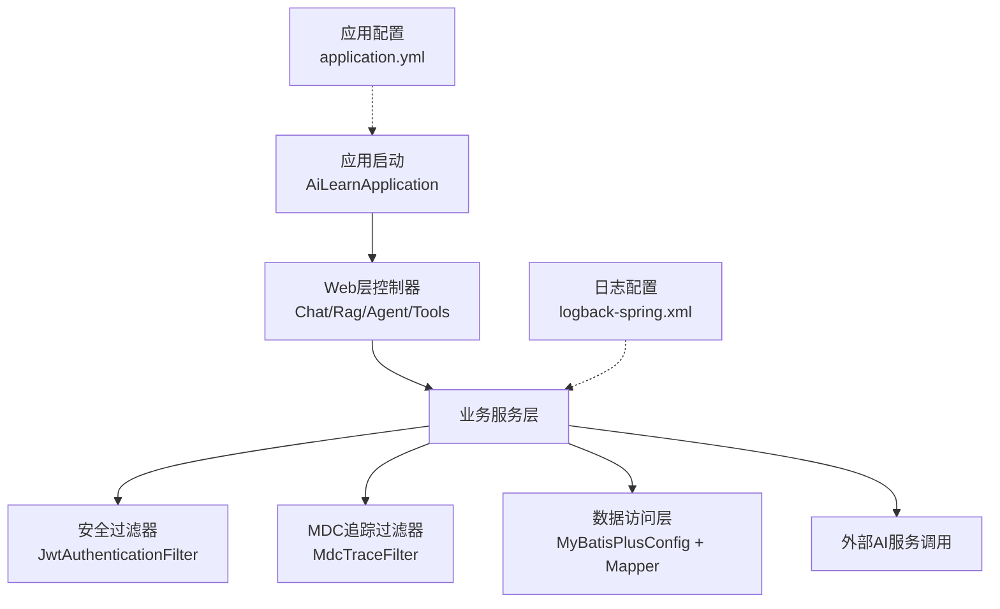
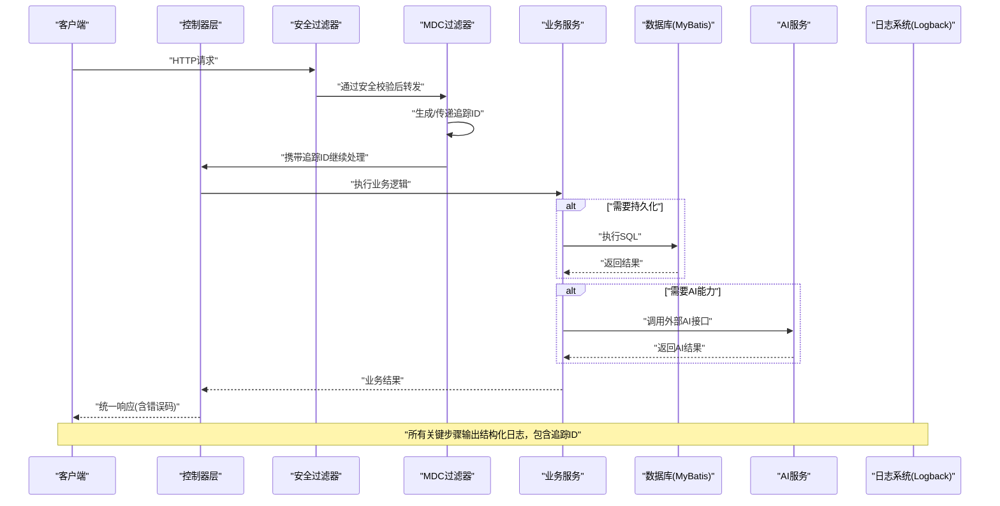
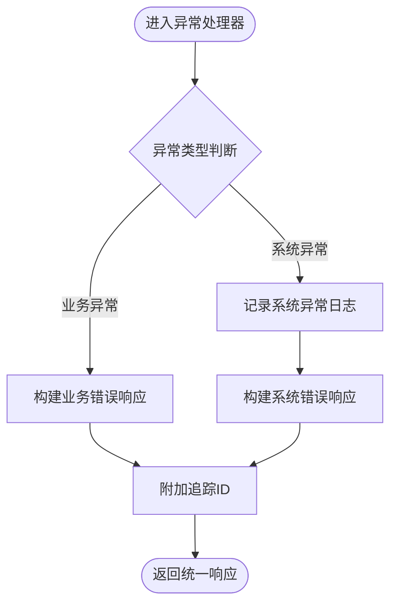
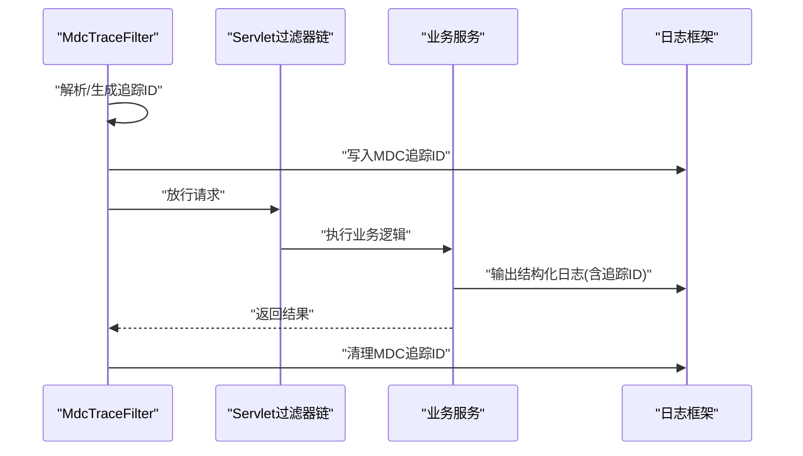
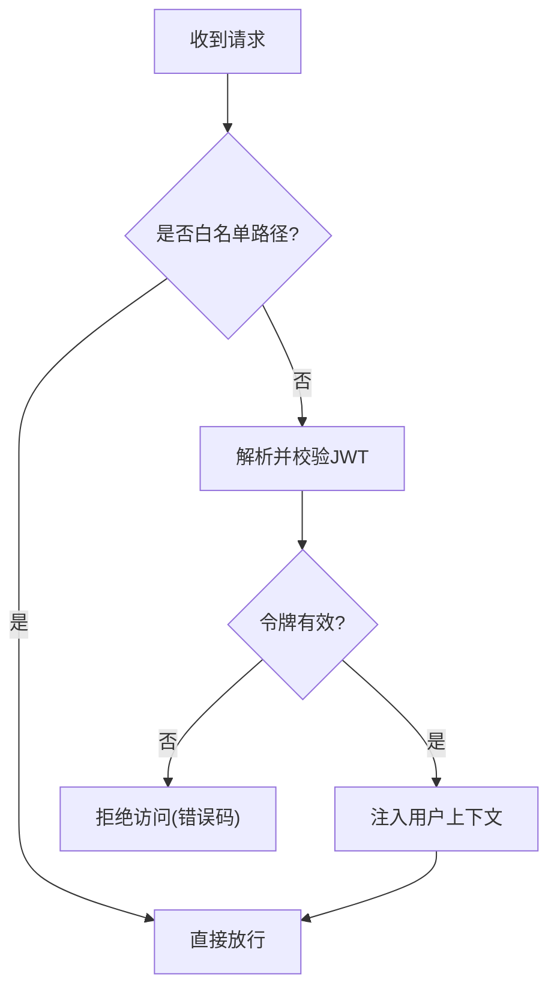
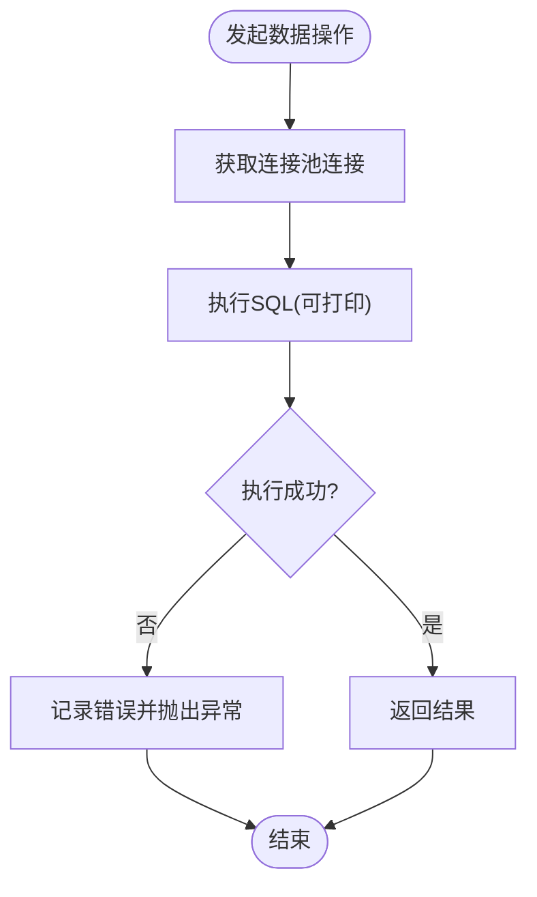
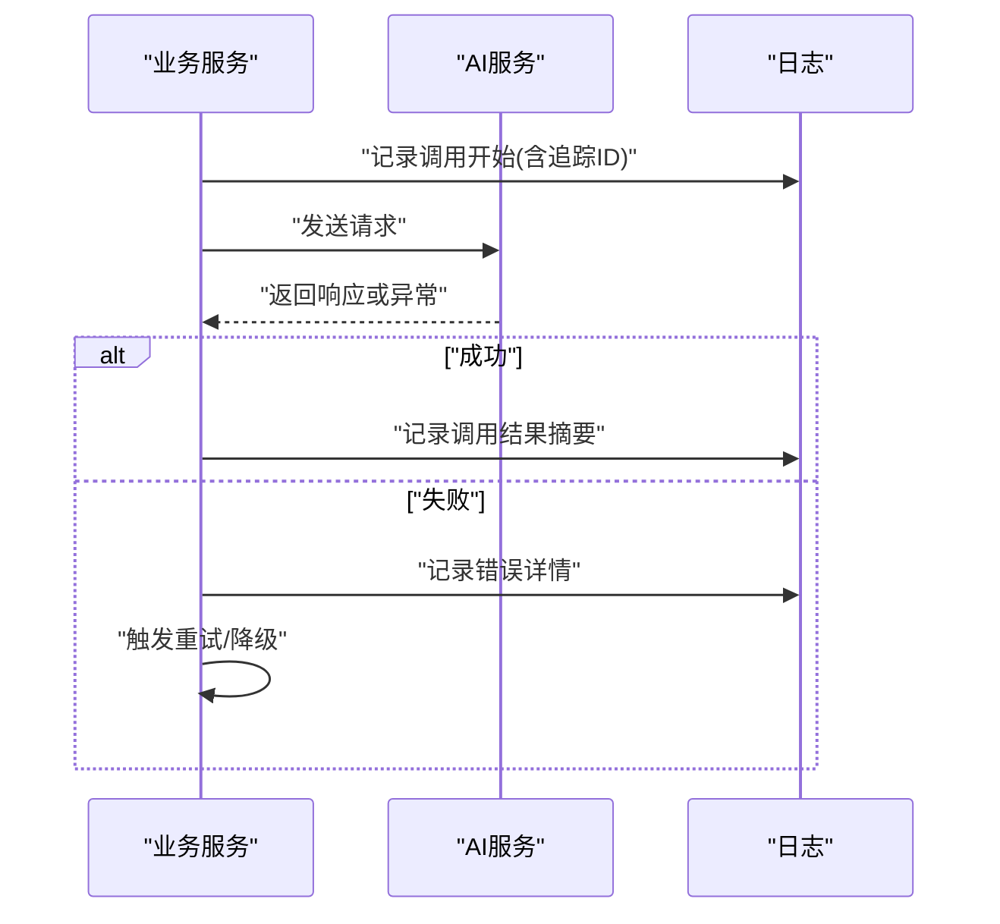
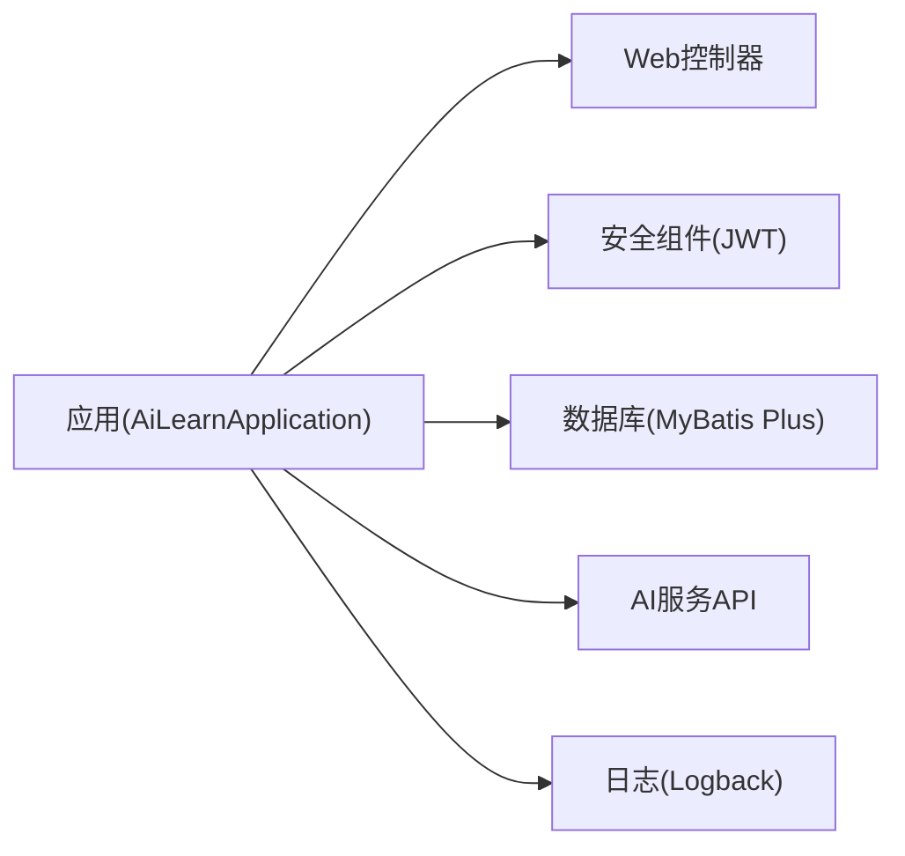

# 调试和故障排查

<cite>
**本文引用的文件**   
- [AiLearnApplication.java](file://src/main/java/com/ailearn/AiLearnApplication.java)
- [MdcTraceFilter.java](file://src/main/java/com/ailearn/config/MdcTraceFilter.java)
- [logback-spring.xml](file://src/main/resources/logback-spring.xml)
- [application.yml](file://src/main/resources/application.yml)
- [GlobalExceptionHandler.java](file://src/main/java/com/ailearn/common/GlobalExceptionHandler.java)
- [BusinessException.java](file://src/main/java/com/ailearn/common/BusinessException.java)
- [ErrorCode.java](file://src/main/java/com/ailearn/common/ErrorCode.java)
- [Result.java](file://src/main/java/com/ailearn/common/Result.java)
- [SecurityConfig.java](file://src/main/java/com/ailearn/security/SecurityConfig.java)
- [JwtAuthenticationFilter.java](file://src/main/java/com/ailearn/security/JwtAuthenticationFilter.java)
- [MyBatisPlusConfig.java](file://src/main/java/com/ailearn/config/MyBatisPlusConfig.java)
- [schema.sql](file://src/main/resources/schema.sql)
- [schema-postgresql.sql](file://src/main/resources/schema-postgresql.sql)
- [docker-compose.yml](file://docker-compose.yml)
- [Dockerfile](file://Dockerfile)
- [pom.xml](file://pom.xml)
- [ChatController.java](file://src/main/java/com/ailearn/chat/ChatController.java)
- [RagController.java](file://src/main/java/com/ailearn/rag/RagController.java)
- [AgentController.java](file://src/main/java/com/ailearn/agent/AgentController.java)
- [ToolsController.java](file://src/main/java/com/ailearn/tools/ToolsController.java)
</cite>

## 目录
1. [简介](#简介)
2. [项目结构](#项目结构)
3. [核心组件](#核心组件)
4. [架构总览](#架构总览)
5. [详细组件分析](#详细组件分析)
6. [依赖关系分析](#依赖关系分析)
7. [性能考虑](#性能考虑)
8. [故障排查指南](#故障排查指南)
9. [结论](#结论)
10. [附录](#附录)

## 简介
本指南面向开发与运维人员，围绕应用调试与故障排查提供系统化方法与实践建议。内容覆盖：
- IDE断点调试与远程调试配置
- 日志系统使用（Logback、结构化输出、级别管理）
- MDC追踪ID在请求链路中的实现与应用
- 常见错误诊断（数据库连接、AI服务调用失败、内存泄漏检测）
- 性能瓶颈分析与优化建议
- 监控指标配置与告警设置
- 生产问题排查流程与紧急恢复方案
- 调试工具推荐与技巧

## 项目结构
本项目为Spring Boot后端应用，包含以下与调试相关的核心位置：
- 启动类与Web入口：用于定位应用启动参数、端口、Profile等
- 全局异常处理：统一错误码与响应体，便于快速定位问题
- 安全与认证过滤器：JWT校验链路与鉴权拦截
- 数据访问配置：MyBatis Plus配置与SQL脚本
- 日志配置：Logback Spring集成与输出格式
- 容器化与编排：Docker与docker-compose，便于本地与远端调试

图表来源
- [AiLearnApplication.java](file://src/main/java/com/ailearn/AiLearnApplication.java)
- [ChatController.java](file://src/main/java/com/ailearn/chat/ChatController.java)
- [RagController.java](file://src/main/java/com/ailearn/rag/RagController.java)
- [AgentController.java](file://src/main/java/com/ailearn/agent/AgentController.java)
- [ToolsController.java](file://src/main/java/com/ailearn/tools/ToolsController.java)
- [JwtAuthenticationFilter.java](file://src/main/java/com/ailearn/security/JwtAuthenticationFilter.java)
- [MdcTraceFilter.java](file://src/main/java/com/ailearn/config/MdcTraceFilter.java)
- [MyBatisPlusConfig.java](file://src/main/java/com/ailearn/config/MyBatisPlusConfig.java)
- [logback-spring.xml](file://src/main/resources/logback-spring.xml)
- [application.yml](file://src/main/resources/application.yml)

章节来源
- [AiLearnApplication.java](file://src/main/java/com/ailearn/AiLearnApplication.java)
- [application.yml](file://src/main/resources/application.yml)
- [logback-spring.xml](file://src/main/resources/logback-spring.xml)
- [MyBatisPlusConfig.java](file://src/main/java/com/ailearn/config/MyBatisPlusConfig.java)

## 核心组件
- 全局异常处理器：集中捕获并返回统一错误响应，便于前端展示与日志关联
- 业务异常与错误码：标准化错误分类与提示
- MDC追踪过滤器：为每个请求注入唯一追踪ID，贯穿日志与链路
- 安全过滤器：JWT校验与用户上下文注入，影响鉴权与审计日志
- 数据访问配置：连接池、SQL打印、分页插件等，对性能与排障至关重要
- 日志配置：按模块与级别输出，支持结构化字段与滚动策略

章节来源
- [GlobalExceptionHandler.java](file://src/main/java/com/ailearn/common/GlobalExceptionHandler.java)
- [BusinessException.java](file://src/main/java/com/ailearn/common/BusinessException.java)
- [ErrorCode.java](file://src/main/java/com/ailearn/common/ErrorCode.java)
- [Result.java](file://src/main/java/com/ailearn/common/Result.java)
- [MdcTraceFilter.java](file://src/main/java/com/ailearn/config/MdcTraceFilter.java)
- [JwtAuthenticationFilter.java](file://src/main/java/com/ailearn/security/JwtAuthenticationFilter.java)
- [MyBatisPlusConfig.java](file://src/main/java/com/ailearn/config/MyBatisPlusConfig.java)
- [logback-spring.xml](file://src/main/resources/logback-spring.xml)

## 架构总览
下图展示了从HTTP请求进入，到安全校验、MDC注入、业务处理、数据访问与外部AI调用的完整链路，以及日志输出的关键节点。

图表来源
- [ChatController.java](file://src/main/java/com/ailearn/chat/ChatController.java)
- [RagController.java](file://src/main/java/com/ailearn/rag/RagController.java)
- [AgentController.java](file://src/main/java/com/ailearn/agent/AgentController.java)
- [ToolsController.java](file://src/main/java/com/ailearn/tools/ToolsController.java)
- [JwtAuthenticationFilter.java](file://src/main/java/com/ailearn/security/JwtAuthenticationFilter.java)
- [MdcTraceFilter.java](file://src/main/java/com/ailearn/config/MdcTraceFilter.java)
- [MyBatisPlusConfig.java](file://src/main/java/com/ailearn/config/MyBatisPlusConfig.java)
- [logback-spring.xml](file://src/main/resources/logback-spring.xml)

## 详细组件分析

### 全局异常处理与统一响应
- 职责：捕获未处理异常与业务异常，转换为统一响应体；记录必要上下文以便定位问题
- 关键点：
  - 区分业务异常与系统异常，避免泄露敏感信息
  - 将追踪ID附加到响应或日志中，便于前后端联动排查
  - 针对常见错误场景（参数校验失败、权限不足、资源不存在）给出明确错误码

图表来源
- [GlobalExceptionHandler.java](file://src/main/java/com/ailearn/common/GlobalExceptionHandler.java)
- [BusinessException.java](file://src/main/java/com/ailearn/common/BusinessException.java)
- [ErrorCode.java](file://src/main/java/com/ailearn/common/ErrorCode.java)
- [Result.java](file://src/main/java/com/ailearn/common/Result.java)

章节来源
- [GlobalExceptionHandler.java](file://src/main/java/com/ailearn/common/GlobalExceptionHandler.java)
- [BusinessException.java](file://src/main/java/com/ailearn/common/BusinessException.java)
- [ErrorCode.java](file://src/main/java/com/ailearn/common/ErrorCode.java)
- [Result.java](file://src/main/java/com/ailearn/common/Result.java)

### MDC追踪ID实现与使用
- 目标：为每个请求分配唯一追踪ID，贯穿安全过滤、业务处理、数据访问与外部调用
- 关键点：
  - 在过滤器中生成或透传追踪ID，写入MDC
  - 日志模板中包含追踪ID字段，便于聚合检索
  - 跨线程时确保MDC上下文正确传递（如异步任务）

图表来源
- [MdcTraceFilter.java](file://src/main/java/com/ailearn/config/MdcTraceFilter.java)
- [logback-spring.xml](file://src/main/resources/logback-spring.xml)

章节来源
- [MdcTraceFilter.java](file://src/main/java/com/ailearn/config/MdcTraceFilter.java)
- [logback-spring.xml](file://src/main/resources/logback-spring.xml)

### 安全过滤器与JWT校验
- 职责：校验JWT令牌、提取用户上下文、控制访问路径
- 关键点：
  - 白名单路径跳过校验
  - 校验失败返回统一错误码
  - 将用户信息放入上下文供后续使用

图表来源
- [JwtAuthenticationFilter.java](file://src/main/java/com/ailearn/security/JwtAuthenticationFilter.java)
- [SecurityConfig.java](file://src/main/java/com/ailearn/security/SecurityConfig.java)

章节来源
- [JwtAuthenticationFilter.java](file://src/main/java/com/ailearn/security/JwtAuthenticationFilter.java)
- [SecurityConfig.java](file://src/main/java/com/ailearn/security/SecurityConfig.java)

### 数据访问与SQL调试
- 要点：
  - 开启SQL日志打印，结合追踪ID定位慢查询
  - 检查连接池配置与数据库连通性
  - 使用初始化脚本验证表结构与初始数据

图表来源
- [MyBatisPlusConfig.java](file://src/main/java/com/ailearn/config/MyBatisPlusConfig.java)
- [schema.sql](file://src/main/resources/schema.sql)
- [schema-postgresql.sql](file://src/main/resources/schema-postgresql.sql)

章节来源
- [MyBatisPlusConfig.java](file://src/main/java/com/ailearn/config/MyBatisPlusConfig.java)
- [schema.sql](file://src/main/resources/schema.sql)
- [schema-postgresql.sql](file://src/main/resources/schema-postgresql.sql)

### 外部AI服务调用与重试
- 关注点：
  - 网络超时与重试策略
  - 限流与熔断保护
  - 结构化日志记录输入输出摘要（脱敏）

图表来源
- [ChatController.java](file://src/main/java/com/ailearn/chat/ChatController.java)
- [RagController.java](file://src/main/java/com/ailearn/rag/RagController.java)
- [AgentController.java](file://src/main/java/com/ailearn/agent/AgentController.java)
- [ToolsController.java](file://src/main/java/com/ailearn/tools/ToolsController.java)
- [logback-spring.xml](file://src/main/resources/logback-spring.xml)

章节来源
- [ChatController.java](file://src/main/java/com/ailearn/chat/ChatController.java)
- [RagController.java](file://src/main/java/com/ailearn/rag/RagController.java)
- [AgentController.java](file://src/main/java/com/ailearn/agent/AgentController.java)
- [ToolsController.java](file://src/main/java/com/ailearn/tools/ToolsController.java)
- [logback-spring.xml](file://src/main/resources/logback-spring.xml)

## 依赖关系分析
- 运行时依赖：
  - Spring Boot与Web栈
  - MyBatis Plus与数据库驱动
  - JWT与安全组件
  - 日志框架Logback
- 外部依赖：
  - AI服务API
  - 可选：消息队列、缓存、对象存储等

图表来源
- [AiLearnApplication.java](file://src/main/java/com/ailearn/AiLearnApplication.java)
- [pom.xml](file://pom.xml)

章节来源
- [pom.xml](file://pom.xml)
- [AiLearnApplication.java](file://src/main/java/com/ailearn/AiLearnApplication.java)

## 性能考虑
- 连接池与数据库：
  - 合理设置最大连接数、空闲回收时间
  - 启用SQL慢查询日志与索引优化
- 外部AI调用：
  - 设置合理的超时与重试次数
  - 引入限流与熔断，防止雪崩
- 日志与IO：
  - 调整日志级别，避免在生产环境输出过多DEBUG
  - 使用异步输出与滚动策略，减少磁盘压力
- JVM与容器：
  - 根据容器限制设置JVM堆大小
  - 启用GC日志与分析工具

[本节为通用指导，不直接分析具体文件]

## 故障排查指南

### IDE断点调试
- 本地运行：
  - 使用IDE的Debug模式启动应用，在控制器或服务层设置断点
  - 通过Postman或前端页面触发请求，观察变量状态与调用栈
- 常见问题：
  - 断点未命中：确认包名与类路径一致，排除热部署干扰
  - 多线程导致断点失效：在相关线程上下文中查看MDC追踪ID

章节来源
- [AiLearnApplication.java](file://src/main/java/com/ailearn/AiLearnApplication.java)

### 远程调试配置
- 适用场景：
  - 在容器或远端服务器运行应用，无法直接本地调试
- 基本步骤：
  - 在启动参数中添加远程调试开关与监听端口
  - 在IDE中创建Remote JVM Debug配置，指向远端地址与端口
  - 确保防火墙允许该端口通信
- 注意事项：
  - 仅在内网或受控环境启用，避免暴露调试端口
  - 生产环境谨慎使用，必要时配合临时账号与短时效

章节来源
- [Dockerfile](file://Dockerfile)
- [docker-compose.yml](file://docker-compose.yml)

### 日志系统与结构化输出
- Logback配置要点：
  - 定义控制台与文件输出，按模块与级别分离
  - 在日志模板中加入追踪ID字段，便于链路聚合
  - 配置滚动策略与保留天数，避免磁盘爆满
- 结构化输出：
  - 使用JSON或固定分隔符输出关键字段（时间、级别、追踪ID、模块、消息）
  - 对外部调用结果进行脱敏与摘要记录
- 级别管理：
  - 开发环境开启DEBUG，生产默认INFO，按需临时提升级别

章节来源
- [logback-spring.xml](file://src/main/resources/logback-spring.xml)
- [MdcTraceFilter.java](file://src/main/java/com/ailearn/config/MdcTraceFilter.java)

### MDC追踪ID的使用
- 生成与透传：
  - 在过滤器中生成或解析上游追踪ID，写入MDC
  - 日志模板引用追踪ID字段
- 跨线程传递：
  - 在异步任务中显式复制MDC上下文
- 检索与聚合：
  - 基于追踪ID在日志系统中检索整条链路

章节来源
- [MdcTraceFilter.java](file://src/main/java/com/ailearn/config/MdcTraceFilter.java)
- [logback-spring.xml](file://src/main/resources/logback-spring.xml)

### 常见错误诊断

#### 数据库连接问题
- 现象：
  - 启动时报连接失败、连接池耗尽、SQL执行超时
- 排查步骤：
  - 检查数据库地址、端口、用户名、密码与数据库名
  - 验证网络连通性与防火墙规则
  - 查看连接池配置与当前活跃连接数
  - 开启SQL日志，定位慢查询与锁等待
- 参考：
  - 应用配置中的数据库相关项
  - 初始化脚本验证表结构

章节来源
- [application.yml](file://src/main/resources/application.yml)
- [MyBatisPlusConfig.java](file://src/main/java/com/ailearn/config/MyBatisPlusConfig.java)
- [schema.sql](file://src/main/resources/schema.sql)
- [schema-postgresql.sql](file://src/main/resources/schema-postgresql.sql)

#### AI服务调用失败
- 现象：
  - 超时、返回空结果、鉴权失败、限流
- 排查步骤：
  - 检查AI服务地址、密钥与配额
  - 查看网络连通性与代理配置
  - 增加调用日志（输入摘要、耗时、状态码）
  - 配置重试与熔断，观察错误率与延迟分布
- 参考：
  - 控制器与服务层的AI调用逻辑
  - 日志模板中的结构化字段

章节来源
- [ChatController.java](file://src/main/java/com/ailearn/chat/ChatController.java)
- [RagController.java](file://src/main/java/com/ailearn/rag/RagController.java)
- [AgentController.java](file://src/main/java/com/ailearn/agent/AgentController.java)
- [ToolsController.java](file://src/main/java/com/ailearn/tools/ToolsController.java)
- [logback-spring.xml](file://src/main/resources/logback-spring.xml)

#### 内存泄漏检测
- 现象：
  - 频繁Full GC、OOM、堆占用持续增长
- 排查步骤：
  - 导出堆转储文件，使用分析工具定位大对象与强引用
  - 检查静态集合、监听器、线程池未关闭等资源
  - 评估第三方库版本与已知漏洞
- 工具：
  - JProfiler、VisualVM、Eclipse MAT等

[本节为通用指导，不直接分析具体文件]

### 监控指标配置与告警
- 指标采集：
  - 收集JVM、HTTP、数据库、AI调用等关键指标
  - 使用Prometheus或类似系统进行抓取
- 告警规则：
  - 错误率阈值、延迟P95/P99、连接池使用率、CPU/内存使用率
- 可视化：
  - Grafana面板展示趋势与热点

[本节为通用指导，不直接分析具体文件]

### 生产环境问题排查流程
- 快速定位：
  - 基于追踪ID检索日志，确定问题范围
  - 检查最近变更（代码、配置、依赖）
- 风险控制：
  - 临时回滚或降级功能
  - 扩容或限流缓解压力
- 根因分析：
  - 复现问题，补充必要日志
  - 分析堆转储与线程快照
- 恢复与复盘：
  - 修复问题并灰度发布
  - 更新SOP与监控告警

[本节为通用指导，不直接分析具体文件]

### 紧急恢复方案
- 一键回滚：
  - 使用CI/CD流水线快速恢复到上一稳定版本
- 功能开关：
  - 通过配置中心或环境变量关闭高风险功能
- 数据一致性：
  - 在恢复前备份关键数据，避免二次损失

[本节为通用指导，不直接分析具体文件]

### 调试工具推荐与技巧
- 网络抓包：Wireshark、tcpdump
- HTTP调试：Postman、curl
- 日志分析：ELK、Grafana Loki
- 性能分析：JProfiler、Async Profiler
- 容器调试：kubectl logs/exec、docker inspect

[本节为通用指导，不直接分析具体文件]

## 结论
通过统一的异常处理、结构化日志与MDC追踪，结合完善的监控与告警体系，可以显著提升问题定位效率与系统稳定性。建议在开发阶段即落实日志规范与追踪ID机制，并在生产环境建立标准化的排查流程与应急恢复预案。

## 附录

### 常用命令与配置要点
- 启动参数：
  - 添加远程调试开关与监听端口
  - 指定日志级别与配置文件
- Docker与编排：
  - 在容器镜像中保留必要的调试工具
  - 在编排文件中暴露调试端口（仅限内网）

章节来源
- [Dockerfile](file://Dockerfile)
- [docker-compose.yml](file://docker-compose.yml)
- [application.yml](file://src/main/resources/application.yml)