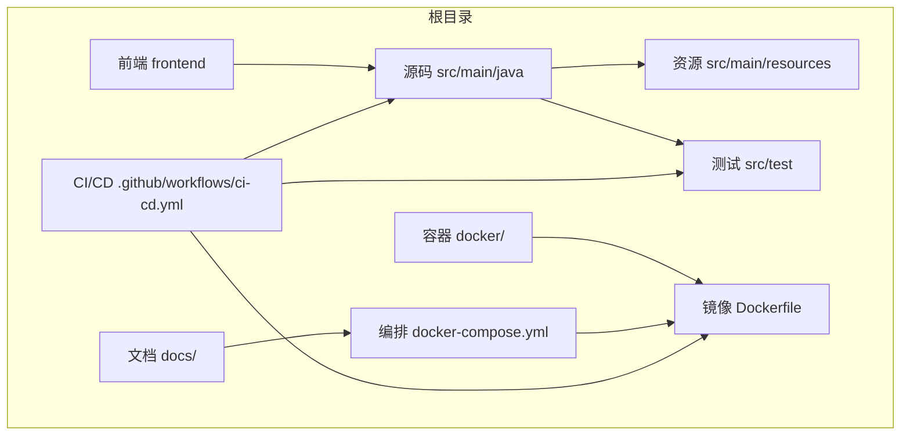
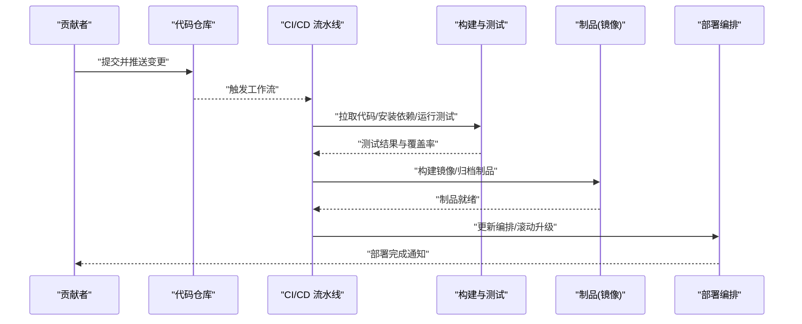
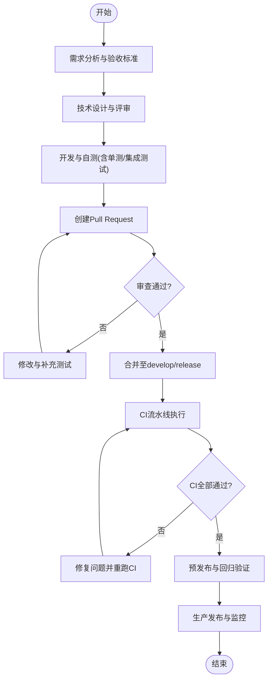
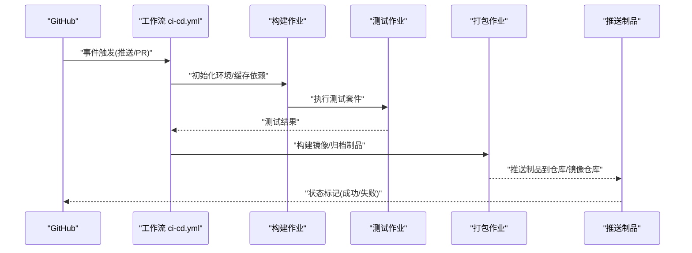
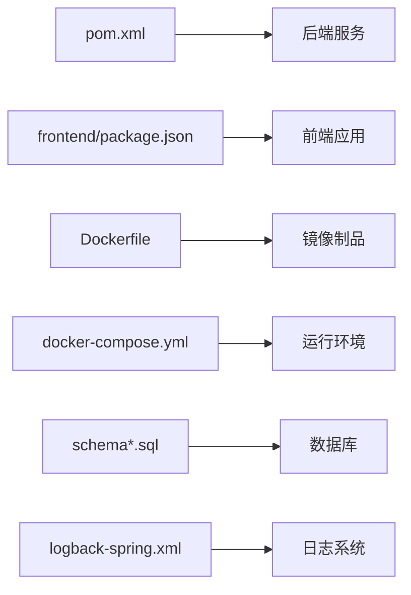

# 贡献指南

<cite>
**本文引用的文件**   
- [ci-cd.yml](file://.github/workflows/ci-cd.yml)
- [DEPLOYMENT.md](file://docs/DEPLOYMENT.md)
- [docker-compose.yml](file://docker-compose.yml)
- [Dockerfile](file://Dockerfile)
- [pom.xml](file://pom.xml)
- [application.yml](file://src/main/resources/application.yml)
- [schema.sql](file://src/main/resources/schema.sql)
- [schema-postgresql.sql](file://src/main/resources/schema-postgresql.sql)
- [logback-spring.xml](file://src/main/resources/logback-spring.xml)
- [AiLearnApplication.java](file://src/main/java/com/ailearn/AiLearnApplication.java)
- [GlobalExceptionHandler.java](file://src/main/java/com/ailearn/common/GlobalExceptionHandler.java)
- [ErrorCode.java](file://src/main/java/com/ailearn/common/ErrorCode.java)
- [Result.java](file://src/main/java/com/ailearn/common/Result.java)
- [ChatServiceTest.java](file://src/test/java/com/ailearn/chat/ChatServiceTest.java)
- [UserServiceTest.java](file://src/test/java/com/ailearn/service/UserServiceTest.java)
- [JwtUtilTest.java](file://src/test/java/com/ailearn/security/JwtUtilTest.java)
- [CalculatorToolTest.java](file://src/test/java/com/ailearn/tools/CalculatorToolTest.java)
- [WeatherToolTest.java](file://src/test/java/com/ailearn/tools/WeatherToolTest.java)
- [application-test.yml](file://src/test/resources/application-test.yml)
</cite>

## 目录
1. [简介](#简介)
2. [项目结构](#项目结构)
3. [核心组件](#核心组件)
4. [架构总览](#架构总览)
5. [详细组件分析](#详细组件分析)
6. [依赖分析](#依赖分析)
7. [性能考虑](#性能考虑)
8. [故障排查指南](#故障排查指南)
9. [结论](#结论)
10. [附录](#附录)

## 简介
本贡献指南面向所有希望参与项目的开发者，涵盖Git工作流规范、分支管理策略、提交信息格式、代码审查流程、Pull Request创建与合并流程、Issue报告和问题反馈标准格式、新功能开发全流程（从需求分析到上线部署）、CI/CD流水线配置与自动化测试执行、代码质量检查与静态分析配置、社区行为准则与沟通规范，以及为新贡献者准备的入门指导与资源链接。

## 项目结构
仓库采用前后端分离与容器化部署的混合结构：
- 后端服务基于Java/Spring Boot，提供REST API与MCP集成，使用MyBatis Plus进行数据访问，配置文件集中于resources目录。
- 前端位于frontend目录，构建产物通过Spring Boot静态资源发布。
- 容器化相关配置包括Dockerfile与docker-compose.yml，便于本地与CI环境快速启动。
- CI/CD流水线定义在.github/workflows/ci-cd.yml中，负责拉取代码、构建、测试与打包镜像。
- 文档集中在docs目录，包含部署说明与设计文档。

**图表来源**
- [ci-cd.yml](file://.github/workflows/ci-cd.yml)
- [docker-compose.yml](file://docker-compose.yml)
- [Dockerfile](file://Dockerfile)
- [pom.xml](file://pom.xml)

**章节来源**
- [pom.xml](file://pom.xml)
- [docker-compose.yml](file://docker-compose.yml)
- [Dockerfile](file://Dockerfile)
- [ci-cd.yml](file://.github/workflows/ci-cd.yml)

## 核心组件
- 应用入口与异常处理
  - 应用主类负责启动Spring Boot服务并加载配置。
  - 全局异常处理器统一捕获业务与非业务异常，返回标准化响应体。
  - 错误码枚举与结果封装用于对外API的一致性输出。
- 配置与数据库
  - 应用配置集中管理于application.yml；测试配置独立于application-test.yml。
  - 数据库初始化脚本包含通用与PostgreSQL专用版本，分别对应不同数据库方言。
- 日志与可观测性
  - 日志框架配置位于logback-spring.xml，支持按环境区分输出策略。
- 测试
  - 单元测试覆盖关键服务与工具方法，如聊天服务、用户服务、JWT工具与工具类实现。

**章节来源**
- [AiLearnApplication.java](file://src/main/java/com/ailearn/AiLearnApplication.java)
- [GlobalExceptionHandler.java](file://src/main/java/com/ailearn/common/GlobalExceptionHandler.java)
- [ErrorCode.java](file://src/main/java/com/ailearn/common/ErrorCode.java)
- [Result.java](file://src/main/java/com/ailearn/common/Result.java)
- [application.yml](file://src/main/resources/application.yml)
- [application-test.yml](file://src/test/resources/application-test.yml)
- [schema.sql](file://src/main/resources/schema.sql)
- [schema-postgresql.sql](file://src/main/resources/schema-postgresql.sql)
- [logback-spring.xml](file://src/main/resources/logback-spring.xml)
- [ChatServiceTest.java](file://src/test/java/com/ailearn/chat/ChatServiceTest.java)
- [UserServiceTest.java](file://src/test/java/com/ailearn/service/UserServiceTest.java)
- [JwtUtilTest.java](file://src/test/java/com/ailearn/security/JwtUtilTest.java)
- [CalculatorToolTest.java](file://src/test/java/com/ailearn/tools/CalculatorToolTest.java)
- [WeatherToolTest.java](file://src/test/java/com/ailearn/tools/WeatherToolTest.java)

## 架构总览
下图展示了从贡献者发起变更到持续交付的关键路径：本地开发→提交推送→CI触发→构建与测试→制品生成→部署。

**图表来源**
- [ci-cd.yml](file://.github/workflows/ci-cd.yml)
- [docker-compose.yml](file://docker-compose.yml)
- [Dockerfile](file://Dockerfile)

## 详细组件分析

### Git工作流与分支管理
- 分支模型
  - main/master：受保护的生产分支，仅允许通过PR合并，保持始终可发布状态。
  - develop：集成分支，日常功能集成分发点。
  - feature/*：功能分支，从develop切出，完成后合并回develop。
  - hotfix/*：紧急修复分支，从main切出，修复后同时合并回main与develop。
  - release/*：预发布分支，用于发布前验证与打标签。
- 分支命名约定
  - 小写英文字母、数字与短横线，避免特殊字符。
  - 示例：feature/add-rag-search、hotfix/fix-jwt-expire、release/v1.2.0。
- 提交信息格式
  - 类型：feat、fix、docs、style、refactor、perf、test、build、ci、chore、revert。
  - 主题行不超过72字符，描述空一行后补充动机与影响范围。
  - 关联Issue：在主题或描述中使用“Closes #编号”或“Refs #编号”。
- 代码审查流程
  - 至少一名维护者审查通过后才能合并。
  - 审查关注点：正确性、可读性、可维护性、安全性、性能与兼容性。
  - 建议附带截图或日志片段以辅助理解变更影响。
- Pull Request规范
  - 标题清晰表达变更目的与范围。
  - 描述包含：背景、目标、变更内容、测试覆盖、风险与回滚方案。
  - 关联Issue与任务卡片，确保可追溯。
  - 通过所有CI检查后再请求合并。

[本节为概念性规范，不直接分析具体源文件]

### Issue报告与问题反馈
- 模板字段
  - 问题类型：Bug、功能请求、改进建议、文档问题。
  - 复现步骤：环境、前置条件、操作步骤、期望与实际结果。
  - 日志与堆栈：关键日志片段、错误码、时间戳。
  - 环境信息：操作系统、JDK版本、数据库版本、浏览器版本等。
  - 附件：截图、录屏、最小可复现仓库链接。
- 优先级与SLA
  - P0/P1/P2/P3分级，明确响应与修复时限。
- 跟进与闭环
  - 指派负责人，定期同步进展，修复后回归验证并关闭Issue。

[本节为概念性规范，不直接分析具体源文件]

### 新功能开发全流程
- 需求分析
  - 产出需求文档与验收标准，明确边界与依赖。
- 设计与评审
  - 技术方案设计、接口契约、数据模型变更、安全与性能评估。
- 开发与自测
  - 遵循编码规范，编写单测与集成用例，本地验证通过。
- 提交流程
  - 提交至feature分支，创建PR，等待审查与CI通过。
- 合并与发布
  - 合并至develop，进入release分支进行预发布验证，最终合并至main并发布。
- 上线与监控
  - 依据部署文档执行灰度与全量发布，观察指标与告警。

[本节为概念性流程，不直接分析具体源文件]

### CI/CD流水线配置与自动化测试
- 触发条件
  - 推送至受保护分支或打开/更新PR时触发。
- 主要阶段
  - 拉取代码与缓存依赖。
  - 构建后端与前端。
  - 运行单元测试与必要的集成测试。
  - 生成制品（Docker镜像）并上传。
  - 可选：部署到预览环境。
- 失败处理
  - 任何阶段失败立即中断并通知相关人员。
  - 保留构建日志与测试报告以便定位问题。

**图表来源**
- [ci-cd.yml](file://.github/workflows/ci-cd.yml)

**章节来源**
- [ci-cd.yml](file://.github/workflows/ci-cd.yml)

### 代码质量检查与静态分析
- 建议工具
  - Java：SpotBugs、PMD、Checkstyle、SonarQube。
  - 前端：ESLint、Stylelint、Prettier。
- 集成方式
  - 在CI中添加质量门禁，设置阈值与规则集。
  - 将报告作为工件保存，并在PR评论中展示关键问题。
- 规则治理
  - 逐步收敛历史问题，新增代码必须满足最低质量标准。
  - 对高风险规则设置为阻断项。

[本节为通用实践建议，不直接分析具体源文件]

### 部署与运维
- 本地与开发环境
  - 使用docker-compose一键拉起后端、数据库与日志收集组件。
  - 配置文件与环境变量按需切换。
- 生产发布
  - 依据部署文档执行灰度与全量发布，关注健康检查与回滚策略。
  - 日志与指标接入统一平台，建立告警与巡检机制。

**章节来源**
- [DEPLOYMENT.md](file://docs/DEPLOYMENT.md)
- [docker-compose.yml](file://docker-compose.yml)
- [Dockerfile](file://Dockerfile)
- [application.yml](file://src/main/resources/application.yml)

## 依赖分析
- 构建与运行时依赖
  - 后端依赖由pom.xml声明，包含Web、持久层、安全与工具库。
  - 前端依赖由package.json管理，构建工具与UI库按需引入。
- 容器化依赖
  - Dockerfile定义基础镜像、构建阶段与运行阶段。
  - docker-compose编排多容器服务，简化本地联调。
- 外部系统
  - 数据库：根据schema脚本选择MySQL或PostgreSQL。
  - 日志：Logback配置输出到控制台与文件，可按环境调整级别。

**图表来源**
- [pom.xml](file://pom.xml)
- [Dockerfile](file://Dockerfile)
- [docker-compose.yml](file://docker-compose.yml)
- [schema.sql](file://src/main/resources/schema.sql)
- [schema-postgresql.sql](file://src/main/resources/schema-postgresql.sql)
- [logback-spring.xml](file://src/main/resources/logback-spring.xml)

**章节来源**
- [pom.xml](file://pom.xml)
- [Dockerfile](file://Dockerfile)
- [docker-compose.yml](file://docker-compose.yml)
- [schema.sql](file://src/main/resources/schema.sql)
- [schema-postgresql.sql](file://src/main/resources/schema-postgresql.sql)
- [logback-spring.xml](file://src/main/resources/logback-spring.xml)

## 性能考虑
- 构建优化
  - 启用依赖缓存与增量编译，减少CI耗时。
- 测试优化
  - 并行执行测试用例，隔离数据库与外部依赖。
- 运行优化
  - 合理设置JVM参数与连接池大小。
  - 针对热点接口添加缓存与限流策略。
- 监控与压测
  - 建立基准测试与压测脚本，持续跟踪性能回归。

[本节为通用实践建议，不直接分析具体源文件]

## 故障排查指南
- 常见问题定位
  - 查看CI日志与测试报告，确认失败阶段与原因。
  - 检查应用日志与错误码，结合GlobalExceptionHandler的统一返回结构定位问题。
  - 核对数据库初始化脚本与连接配置，确保表结构与权限正确。
- 调试建议
  - 使用application-test.yml进行隔离测试。
  - 开启更详细的日志级别，收集关键上下文。
- 回滚与恢复
  - 优先回滚到上一个稳定版本，再逐步定位问题。

**章节来源**
- [GlobalExceptionHandler.java](file://src/main/java/com/ailearn/common/GlobalExceptionHandler.java)
- [ErrorCode.java](file://src/main/java/com/ailearn/common/ErrorCode.java)
- [Result.java](file://src/main/java/com/ailearn/common/Result.java)
- [application-test.yml](file://src/test/resources/application-test.yml)
- [schema.sql](file://src/main/resources/schema.sql)
- [schema-postgresql.sql](file://src/main/resources/schema-postgresql.sql)

## 结论
本贡献指南明确了从开发到发布的端到端协作流程与规范，帮助团队高效协同、保证代码质量与交付稳定性。请所有贡献者在提交变更前仔细阅读并遵循本指南，共同维护高质量的项目生态。

[本节为总结性内容，不直接分析具体源文件]

## 附录
- 新贡献者入门
  - 克隆仓库并阅读README与部署文档，使用docker-compose快速启动本地环境。
  - 参考现有测试用例了解测试风格与断言方式。
  - 从小型issue入手，熟悉Git工作流与PR流程。
- 资源链接
  - 部署文档：docs/DEPLOYMENT.md
  - 编排配置：docker-compose.yml
  - 镜像构建：Dockerfile
  - 后端依赖：pom.xml
  - 应用配置：src/main/resources/application.yml
  - 测试配置：src/test/resources/application-test.yml
  - 数据库脚本：src/main/resources/schema.sql、src/main/resources/schema-postgresql.sql
  - 日志配置：src/main/resources/logback-spring.xml
  - CI/CD：.github/workflows/ci-cd.yml

**章节来源**
- [DEPLOYMENT.md](file://docs/DEPLOYMENT.md)
- [docker-compose.yml](file://docker-compose.yml)
- [Dockerfile](file://Dockerfile)
- [pom.xml](file://pom.xml)
- [application.yml](file://src/main/resources/application.yml)
- [application-test.yml](file://src/test/resources/application-test.yml)
- [schema.sql](file://src/main/resources/schema.sql)
- [schema-postgresql.sql](file://src/main/resources/schema-postgresql.sql)
- [logback-spring.xml](file://src/main/resources/logback-spring.xml)
- [ci-cd.yml](file://.github/workflows/ci-cd.yml)