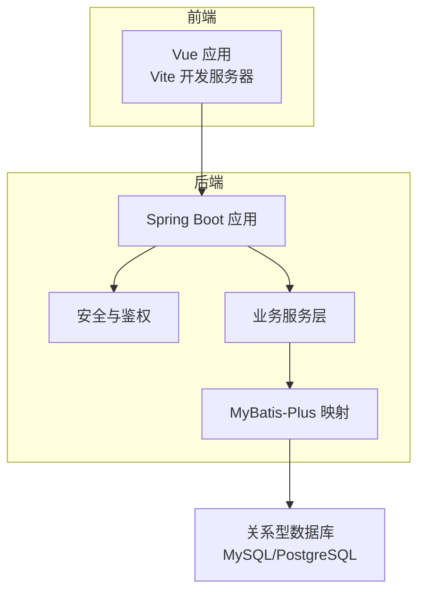
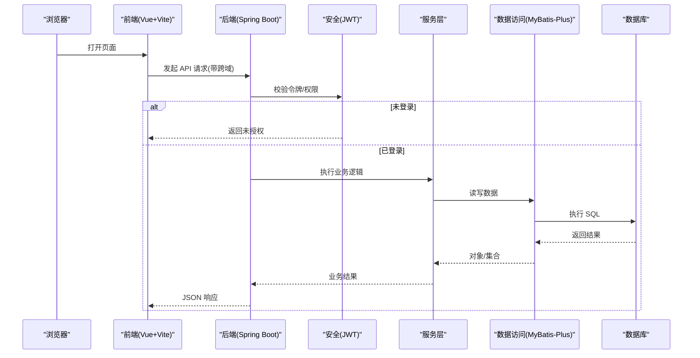
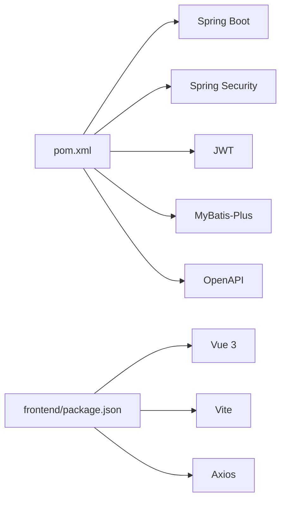

# 快速开始

<cite>
**本文引用的文件**   
- [pom.xml](file://pom.xml)
- [src/main/resources/application.yml](file://src/main/resources/application.yml)
- [src/main/resources/schema.sql](file://src/main/resources/schema.sql)
- [src/main/resources/schema-postgresql.sql](file://src/main/resources/schema-postgresql.sql)
- [docker-compose.yml](file://docker-compose.yml)
- [Dockerfile](file://Dockerfile)
- [frontend/package.json](file://frontend/package.json)
- [frontend/vite.config.js](file://frontend/vite.config.js)
- [src/main/java/com/ailearn/AiLearnApplication.java](file://src/main/java/com/ailearn/AiLearnApplication.java)
- [src/main/java/com/ailearn/config/WebConfig.java](file://src/main/java/com/ailearn/config/WebConfig.java)
- [src/main/java/com/ailearn/controller/SystemController.java](file://src/main/java/com/ailearn/controller/SystemController.java)
- [src/main/java/com/ailearn/chat/ChatController.java](file://src/main/java/com/ailearn/chat/ChatController.java)
- [src/main/java/com/ailearn/security/JwtUtil.java](file://src/main/java/com/ailearn/security/JwtUtil.java)
- [src/main/java/com/ailearn/service/UserService.java](file://src/main/java/com/ailearn/service/UserService.java)
</cite>

## 目录
1. [简介](#简介)
2. [项目结构](#项目结构)
3. [核心组件](#核心组件)
4. [架构总览](#架构总览)
5. [详细组件分析](#详细组件分析)
6. [依赖分析](#依赖分析)
7. [性能考虑](#性能考虑)
8. [故障排除指南](#故障排除指南)
9. [结论](#结论)
10. [附录](#附录)

## 简介
本指南面向首次接触 Java AI 学习平台的新手，目标是在 30 分钟内完成本地开发环境搭建并成功运行前后端服务。你将了解：
- 环境与依赖要求（JDK、Node.js、数据库）
- 后端与前端安装步骤
- 数据库初始化与配置
- 本地启动流程
- Docker 一键部署方案
- 第一个 API 调用示例
- 常见问题排查

## 项目结构
本项目采用前后端分离架构：
- 后端：Spring Boot + MyBatis-Plus + Spring Security + OpenAPI
- 前端：Vue 3 + Vite
- 数据持久化：MySQL/PostgreSQL（通过 SQL 脚本初始化）
- 容器化：Docker + docker-compose

图表来源
- [src/main/java/com/ailearn/AiLearnApplication.java](file://src/main/java/com/ailearn/AiLearnApplication.java)
- [src/main/java/com/ailearn/config/WebConfig.java](file://src/main/java/com/ailearn/config/WebConfig.java)
- [src/main/java/com/ailearn/chat/ChatController.java](file://src/main/java/com/ailearn/chat/ChatController.java)
- [src/main/java/com/ailearn/security/JwtUtil.java](file://src/main/java/com/ailearn/security/JwtUtil.java)
- [src/main/java/com/ailearn/service/UserService.java](file://src/main/java/com/ailearn/service/UserService.java)

章节来源
- [pom.xml](file://pom.xml)
- [frontend/package.json](file://frontend/package.json)
- [frontend/vite.config.js](file://frontend/vite.config.js)

## 核心组件
- 应用入口：Spring Boot 主类负责启动 Web 服务与自动装配
- 安全与鉴权：基于 JWT 的认证过滤器与工具类
- 控制器层：系统健康检查、聊天对话等接口
- 服务层：用户、会话等业务逻辑
- 数据访问层：MyBatis-Plus Mapper 与实体映射
- 配置中心：Web 跨域、OpenAPI、速率限制等配置

章节来源
- [src/main/java/com/ailearn/AiLearnApplication.java](file://src/main/java/com/ailearn/AiLearnApplication.java)
- [src/main/java/com/ailearn/config/WebConfig.java](file://src/main/java/com/ailearn/config/WebConfig.java)
- [src/main/java/com/ailearn/controller/SystemController.java](file://src/main/java/com/ailearn/controller/SystemController.java)
- [src/main/java/com/ailearn/chat/ChatController.java](file://src/main/java/com/ailearn/chat/ChatController.java)
- [src/main/java/com/ailearn/security/JwtUtil.java](file://src/main/java/com/ailearn/security/JwtUtil.java)
- [src/main/java/com/ailearn/service/UserService.java](file://src/main/java/com/ailearn/service/UserService.java)

## 架构总览
下图展示了从浏览器到数据库的关键请求路径，包括跨域与安全校验。

图表来源
- [src/main/java/com/ailearn/config/WebConfig.java](file://src/main/java/com/ailearn/config/WebConfig.java)
- [src/main/java/com/ailearn/chat/ChatController.java](file://src/main/java/com/ailearn/chat/ChatController.java)
- [src/main/java/com/ailearn/security/JwtUtil.java](file://src/main/java/com/ailearn/security/JwtUtil.java)
- [src/main/java/com/ailearn/service/UserService.java](file://src/main/java/com/ailearn/service/UserService.java)

## 详细组件分析

### 环境准备
- JDK：建议使用 17 或更高版本（参考构建脚本与依赖声明）
- Node.js：建议使用 18 LTS 或更高版本（参考前端包管理与 Vite 版本）
- 数据库：MySQL 或 PostgreSQL（根据 SQL 脚本选择对应初始化方式）
- 可选：Docker 与 docker-compose（用于一键部署）

章节来源
- [pom.xml](file://pom.xml)
- [frontend/package.json](file://frontend/package.json)
- [frontend/vite.config.js](file://frontend/vite.config.js)
- [src/main/resources/schema.sql](file://src/main/resources/schema.sql)
- [src/main/resources/schema-postgresql.sql](file://src/main/resources/schema-postgresql.sql)

### 后端环境搭建
- 安装 JDK 并确保 java -version 满足要求
- 使用 Maven 编译与打包（参考 pom.xml 中的插件与依赖）
- 配置数据库连接信息（用户名、密码、URL、驱动），在应用配置文件中设置
- 初始化数据库：
  - MySQL：执行 schema.sql
  - PostgreSQL：执行 schema-postgresql.sql

章节来源
- [src/main/resources/application.yml](file://src/main/resources/application.yml)
- [src/main/resources/schema.sql](file://src/main/resources/schema.sql)
- [src/main/resources/schema-postgresql.sql](file://src/main/resources/schema-postgresql.sql)

### 前端环境搭建
- 进入 frontend 目录
- 安装依赖：npm install
- 配置代理与端口（如需要），参考 vite.config.js
- 启动开发服务器：npm run dev

章节来源
- [frontend/package.json](file://frontend/package.json)
- [frontend/vite.config.js](file://frontend/vite.config.js)

### 本地启动流程
- 启动数据库并完成初始化
- 启动后端服务：mvn spring-boot:run 或通过 IDE 运行主类
- 启动前端开发服务器：npm run dev
- 访问前端地址，验证后端健康检查接口是否可达

章节来源
- [src/main/java/com/ailearn/AiLearnApplication.java](file://src/main/java/com/ailearn/AiLearnApplication.java)
- [src/main/java/com/ailearn/controller/SystemController.java](file://src/main/java/com/ailearn/controller/SystemController.java)
- [frontend/package.json](file://frontend/package.json)

### Docker 一键部署
- 使用 docker-compose 编排后端、数据库与日志收集组件
- 构建镜像并启动服务：docker compose up -d
- 查看服务状态与日志：docker compose ps / logs

章节来源
- [docker-compose.yml](file://docker-compose.yml)
- [Dockerfile](file://Dockerfile)

### 第一个 API 调用示例
- 健康检查：GET /api/system/health（无需鉴权）
- 聊天接口：POST /api/chat（需携带有效 Token，具体字段参考控制器定义）
- 建议先用 curl 或 Postman 测试健康检查接口，再尝试聊天接口

章节来源
- [src/main/java/com/ailearn/controller/SystemController.java](file://src/main/java/com/ailearn/controller/SystemController.java)
- [src/main/java/com/ailearn/chat/ChatController.java](file://src/main/java/com/ailearn/chat/ChatController.java)

## 依赖分析
- 后端依赖：Spring Boot、Spring Security、JWT、MyBatis-Plus、OpenAPI、Lombok 等
- 前端依赖：Vue 3、Vite、Axios 等
- 运行时依赖：JDK、Node.js、数据库

图表来源
- [pom.xml](file://pom.xml)
- [frontend/package.json](file://frontend/package.json)

章节来源
- [pom.xml](file://pom.xml)
- [frontend/package.json](file://frontend/package.json)

## 性能考虑
- 合理设置数据库连接池大小与超时时间
- 开启 GZIP 压缩与静态资源缓存
- 对热点接口启用限流与缓存策略
- 前端按需加载与代码分割，减少首屏体积

[本节为通用指导，不直接分析具体文件]

## 故障排除指南
- 无法连接数据库
  - 检查 application.yml 中数据库 URL、用户名、密码是否正确
  - 确认数据库服务已启动且端口可访问
  - 确认已执行对应的 schema 脚本
- 跨域错误
  - 检查 WebConfig 中允许的源、方法与头
  - 确保前端请求地址与后端实际地址一致
- 鉴权失败
  - 确认 Token 是否过期或签名不一致
  - 检查 JwtUtil 配置与密钥
- 前端无法访问后端
  - 检查 vite.config.js 的代理配置
  - 确认后端服务已启动且端口未被占用
- 端口冲突
  - 修改 application.yml 或 vite.config.js 中的端口
  - 使用 netstat 或 lsof 查找占用进程

章节来源
- [src/main/resources/application.yml](file://src/main/resources/application.yml)
- [src/main/java/com/ailearn/config/WebConfig.java](file://src/main/java/com/ailearn/config/WebConfig.java)
- [src/main/java/com/ailearn/security/JwtUtil.java](file://src/main/java/com/ailearn/security/JwtUtil.java)
- [frontend/vite.config.js](file://frontend/vite.config.js)

## 结论
通过以上步骤，你可以在 30 分钟内完成环境准备、依赖安装、数据库初始化与前后端启动，并使用第一个 API 验证环境配置。若遇到问题，请参考故障排除指南定位原因并修复。

## 附录
- 常用命令
  - 后端：mvn clean package；mvn spring-boot:run
  - 前端：cd frontend；npm install；npm run dev
  - Docker：docker compose up -d；docker compose down
- 配置文件位置
  - 后端：src/main/resources/application.yml
  - 前端：frontend/vite.config.js
- 数据库脚本
  - MySQL：src/main/resources/schema.sql
  - PostgreSQL：src/main/resources/schema-postgresql.sql