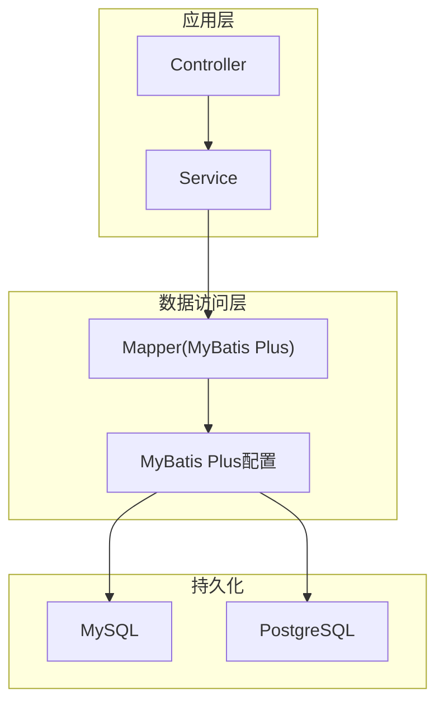
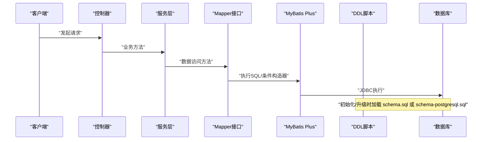
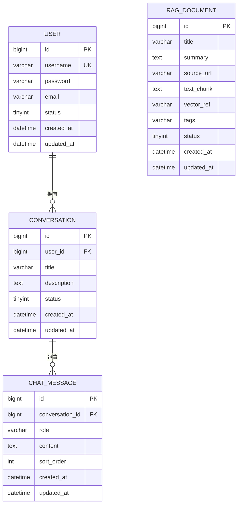
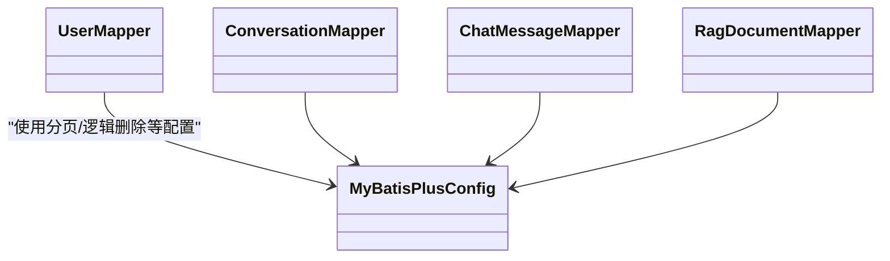

# 数据库设计

<cite>
**本文引用的文件**
- [schema.sql](file://src/main/resources/schema.sql)
- [schema-postgresql.sql](file://src/main/resources/schema-postgresql.sql)
- [application.yml](file://src/main/resources/application.yml)
- [MyBatisPlusConfig.java](file://src/main/java/com/ailearn/config/MyBatisPlusConfig.java)
- [User.java](file://src/main/java/com/ailearn/entity/User.java)
- [Conversation.java](file://src/main/java/com/ailearn/entity/Conversation.java)
- [ChatMessage.java](file://src/main/java/com/ailearn/entity/ChatMessage.java)
- [RagDocument.java](file://src/main/java/com/ailearn/entity/RagDocument.java)
- [UserMapper.java](file://src/main/java/com/ailearn/mapper/UserMapper.java)
- [ConversationMapper.java](file://src/main/java/com/ailearn/mapper/ConversationMapper.java)
- [ChatMessageMapper.java](file://src/main/java/com/ailearn/mapper/ChatMessageMapper.java)
- [RagDocumentMapper.java](file://src/main/java/com/ailearn/mapper/RagDocumentMapper.java)
</cite>

## 目录
1. [引言](#引言)
2. [项目结构](#项目结构)
3. [核心组件](#核心组件)
4. [架构总览](#架构总览)
5. [详细组件分析](#详细组件分析)
6. [依赖关系分析](#依赖关系分析)
7. [性能考虑](#性能考虑)
8. [故障排查指南](#故障排查指南)
9. [结论](#结论)
10. [附录](#附录)

## 引言
本文件面向Java AI学习平台的数据库设计与实现，聚焦于：
- 表结构与字段定义、数据类型选择
- 实体关系映射（一对一、一对多、多对多）的实现方式
- ER图与索引设计说明
- 数据访问层设计模式与MyBatis Plus使用方式、自定义查询
- 数据迁移策略与版本管理
- 性能优化建议（索引、查询、连接池等）
- 备份与恢复方案
- MySQL与PostgreSQL兼容性考量

## 项目结构
本项目采用分层架构，数据库相关资源集中在resources目录下，包含两套DDL脚本以适配MySQL与PostgreSQL；实体类位于entity包，对应表结构；mapper接口位于mapper包，基于MyBatis Plus进行数据访问。

图表来源
- [MyBatisPlusConfig.java:1-200](file://src/main/java/com/ailearn/config/MyBatisPlusConfig.java#L1-L200)
- [application.yml:1-200](file://src/main/resources/application.yml#L1-L200)

章节来源
- [application.yml:1-200](file://src/main/resources/application.yml#L1-L200)
- [MyBatisPlusConfig.java:1-200](file://src/main/java/com/ailearn/config/MyBatisPlusConfig.java#L1-L200)

## 核心组件
- 实体模型
  - 用户：用于身份与基础信息存储
  - 会话：对话上下文容器
  - 消息：会话中的单条对话记录
  - RAG文档：检索增强生成所需的文档元数据或引用信息
- 数据访问接口
  - 各实体的Mapper接口，继承自MyBatis Plus的BaseMapper，提供CRUD能力
- 配置
  - MyBatis Plus全局配置（分页、逻辑删除、驼峰转换等）
  - 应用配置（数据源、方言、日志等）

章节来源
- [User.java:1-200](file://src/main/java/com/ailearn/entity/User.java#L1-L200)
- [Conversation.java:1-200](file://src/main/java/com/ailearn/entity/Conversation.java#L1-L200)
- [ChatMessage.java:1-200](file://src/main/java/com/ailearn/entity/ChatMessage.java#L1-L200)
- [RagDocument.java:1-200](file://src/main/java/com/ailearn/entity/RagDocument.java#L1-L200)
- [UserMapper.java:1-200](file://src/main/java/com/ailearn/mapper/UserMapper.java#L1-L200)
- [ConversationMapper.java:1-200](file://src/main/java/com/ailearn/mapper/ConversationMapper.java#L1-L200)
- [ChatMessageMapper.java:1-200](file://src/main/java/com/ailearn/mapper/ChatMessageMapper.java#L1-L200)
- [RagDocumentMapper.java:1-200](file://src/main/java/com/ailearn/mapper/RragDocumentMapper.java#L1-L200)

## 架构总览
下图展示从控制器到数据库的整体调用链路，以及不同数据库的DDL脚本选择。

图表来源
- [application.yml:1-200](file://src/main/resources/application.yml#L1-L200)
- [schema.sql:1-200](file://src/main/resources/schema.sql#L1-L200)
- [schema-postgresql.sql:1-200](file://src/main/resources/schema-postgresql.sql#L1-L200)

## 详细组件分析

### 实体与表结构设计
- 用户表
  - 主键：自增ID
  - 唯一约束：用户名
  - 关键字段：用户名、密码、邮箱、状态、创建时间、更新时间
  - 索引：用户名唯一索引、邮箱索引
- 会话表
  - 主键：自增ID
  - 外键：用户ID（关联用户表）
  - 关键字段：标题、描述、状态、创建时间、更新时间
  - 索引：用户ID索引、状态索引
- 消息表
  - 主键：自增ID
  - 外键：会话ID（关联会话表）
  - 关键字段：角色、内容、排序号、创建时间、更新时间
  - 索引：会话ID索引、创建时间索引
- RAG文档表
  - 主键：自增ID
  - 关键字段：标题、摘要、来源URL、文本片段、向量标识（可选）、标签、状态、创建时间、更新时间
  - 索引：标题索引、标签索引、状态索引

ER图

图表来源
- [schema.sql:1-200](file://src/main/resources/schema.sql#L1-L200)
- [schema-postgresql.sql:1-200](file://src/main/resources/schema-postgresql.sql#L1-L200)

章节来源
- [schema.sql:1-200](file://src/main/resources/schema.sql#L1-L200)
- [schema-postgresql.sql:1-200](file://src/main/resources/schema-postgresql.sql#L1-L200)

### 实体关系映射说明
- 一对一
  - 当前未显式实现一对一强约束；若需扩展（如用户资料详情），可通过在用户表增加扩展字段或在独立表中通过唯一外键实现
- 一对多
  - 用户与会话：一个用户可拥有多个会话
  - 会话与消息：一个会话可包含多条消息
- 多对多
  - 文档与标签：通过逗号分隔的标签字符串或引入中间表实现；当前采用标签字符串简化实现，便于快速检索与展示

章节来源
- [schema.sql:1-200](file://src/main/resources/schema.sql#L1-L200)
- [schema-postgresql.sql:1-200](file://src/main/resources/schema-postgresql.sql#L1-L200)

### 索引设计说明
- 用户表
  - 用户名：唯一索引
  - 邮箱：普通索引
- 会话表
  - 用户ID：普通索引（按用户筛选会话）
  - 状态：普通索引（按状态过滤）
- 消息表
  - 会话ID：普通索引（按会话拉取消息）
  - 创建时间：普通索引（按时间范围查询）
- RAG文档表
  - 标题：普通索引
  - 标签：普通索引（前缀匹配）
  - 状态：普通索引

章节来源
- [schema.sql:1-200](file://src/main/resources/schema.sql#L1-L200)
- [schema-postgresql.sql:1-200](file://src/main/resources/schema-postgresql.sql#L1-L200)

### 数据访问层设计模式与MyBatis Plus使用
- 设计模式
  - Repository风格：每个实体对应一个Mapper接口，封装数据访问细节
  - 条件构造器：使用QueryWrapper/LambdaQueryWrapper构建动态查询
  - 分页插件：集成PageHelper或MyBatis Plus内置分页插件
- 自定义查询
  - 复杂统计、聚合、跨表联查通过XML或注解@Select/@Update等方式实现
  - 批量操作：使用MyBatis Plus提供的批量插入/更新方法
- 通用配置
  - 驼峰命名自动映射
  - 逻辑删除字段统一处理
  - 全局时间类型处理（LocalDateTime/Date）

章节来源
- [MyBatisPlusConfig.java:1-200](file://src/main/java/com/ailearn/config/MyBatisPlusConfig.java#L1-L200)
- [UserMapper.java:1-200](file://src/main/java/com/ailearn/mapper/UserMapper.java#L1-L200)
- [ConversationMapper.java:1-200](file://src/main/java/com/ailearn/mapper/ConversationMapper.java#L1-L200)
- [ChatMessageMapper.java:1-200](file://src/main/java/com/ailearn/mapper/ChatMessageMapper.java#L1-L200)
- [RagDocumentMapper.java:1-200](file://src/main/java/com/ailearn/mapper/RagDocumentMapper.java#L1-L200)

### 数据迁移策略与版本管理
- 初始建库
  - 根据目标数据库选择对应的DDL脚本：MySQL使用schema.sql，PostgreSQL使用schema-postgresql.sql
- 增量变更
  - 建议引入Flyway或Liquibase进行版本化管理，将每次变更以版本号脚本形式提交
  - 回滚策略：为每个版本准备反向脚本，确保可回滚
- 环境隔离
  - 开发、测试、预生产、生产分别维护独立数据库实例与迁移脚本集合
- 自动化流程
  - CI/CD流水线中集成迁移任务，确保部署前后数据库一致性

章节来源
- [schema.sql:1-200](file://src/main/resources/schema.sql#L1-L200)
- [schema-postgresql.sql:1-200](file://src/main/resources/schema-postgresql.sql#L1-L200)

### 性能优化建议
- 索引优化
  - 针对高频查询列建立合适索引，避免过度索引导致写入性能下降
  - 复合索引优先覆盖常用查询条件组合
- 查询优化
  - 避免SELECT *，仅选择必要字段
  - 合理使用分页，限制单次返回数据量
  - 复杂查询拆分为多次简单查询，减少锁竞争
- 连接池配置
  - 合理设置最大连接数、最小空闲连接、连接超时时间
  - 监控连接池使用率，避免连接泄漏
- 事务控制
  - 缩小事务边界，避免长事务
  - 读写分离场景下注意事务传播行为

[本节为通用指导，不直接分析具体文件]

### 备份与恢复方案
- 全量备份
  - 定期执行mysqldump或pg_dump生成完整快照
- 增量备份
  - MySQL启用binlog，PostgreSQL启用WAL归档，结合工具实现时间点恢复
- 恢复演练
  - 定期在测试环境验证恢复流程，确保RTO/RPO满足要求
- 异地容灾
  - 将备份文件同步至对象存储或异地机房

[本节为通用指导，不直接分析具体文件]

### 数据库兼容性（MySQL与PostgreSQL）
- 数据类型差异
  - 布尔类型：MySQL使用tinyint(1)，PostgreSQL使用boolean
  - 自增主键：MySQL使用AUTO_INCREMENT，PostgreSQL使用SERIAL或序列
  - 时间类型：MySQL使用datetime/timestamp，PostgreSQL使用timestamp without time zone
- 语法差异
  - 分页：MySQL使用LIMIT/OFFSET，PostgreSQL同样支持但需注意性能
  - 字符串函数与大小写敏感规则存在差异
- 驱动与方言
  - 通过配置文件切换数据源与方言，确保ORM正确生成SQL
- 迁移脚本
  - 针对不同数据库提供独立DDL脚本，避免兼容性问题

章节来源
- [schema.sql:1-200](file://src/main/resources/schema.sql#L1-L200)
- [schema-postgresql.sql:1-200](file://src/main/resources/schema-postgresql.sql#L1-L200)
- [application.yml:1-200](file://src/main/resources/application.yml#L1-L200)

## 依赖关系分析
数据访问层依赖关系如下：

图表来源
- [MyBatisPlusConfig.java:1-200](file://src/main/java/com/ailearn/config/MyBatisPlusConfig.java#L1-L200)
- [UserMapper.java:1-200](file://src/main/java/com/ailearn/mapper/UserMapper.java#L1-L200)
- [ConversationMapper.java:1-200](file://src/main/java/com/ailearn/mapper/ConversationMapper.java#L1-L200)
- [ChatMessageMapper.java:1-200](file://src/main/java/com/ailearn/mapper/ChatMessageMapper.java#L1-L200)
- [RagDocumentMapper.java:1-200](file://src/main/java/com/ailearn/mapper/RagDocumentMapper.java#L1-L200)

章节来源
- [MyBatisPlusConfig.java:1-200](file://src/main/java/com/ailearn/config/MyBatisPlusConfig.java#L1-L200)
- [UserMapper.java:1-200](file://src/main/java/com/ailearn/mapper/UserMapper.java#L1-L200)
- [ConversationMapper.java:1-200](file://src/main/java/com/ailearn/mapper/ConversationMapper.java#L1-L200)
- [ChatMessageMapper.java:1-200](file://src/main/java/com/ailearn/mapper/ChatMessageMapper.java#L1-L200)
- [RagDocumentMapper.java:1-200](file://src/main/java/com/ailearn/mapper/RagDocumentMapper.java#L1-L200)

## 性能考虑
- 索引与查询
  - 针对用户登录、会话列表、消息分页等热点路径建立合适索引
  - 使用覆盖索引减少回表
- 连接池
  - 根据并发量调整最大连接数与等待超时
  - 开启连接健康检查，避免脏连接
- 缓存
  - 对静态字典、热门标签等数据进行缓存，降低数据库压力
- 分库分表
  - 当消息或文档规模增长到千万级时，考虑按用户或时间维度拆分

[本节为通用指导，不直接分析具体文件]

## 故障排查指南
- 常见问题
  - 连接失败：检查数据源URL、用户名、密码、网络连通性
  - SQL语法错误：确认使用的DDL脚本与目标数据库一致
  - 分页异常：检查分页插件是否生效、参数是否正确
- 定位手段
  - 开启SQL日志，观察实际执行的SQL与参数
  - 使用EXPLAIN分析慢查询的执行计划
  - 监控连接池指标，识别连接泄漏或瓶颈

章节来源
- [application.yml:1-200](file://src/main/resources/application.yml#L1-L200)
- [MyBatisPlusConfig.java:1-200](file://src/main/java/com/ailearn/config/MyBatisPlusConfig.java#L1-L200)

## 结论
本设计围绕用户、会话、消息与RAG文档四个核心实体展开，明确了表结构、索引与关系映射，并结合MyBatis Plus实现了简洁高效的数据访问层。通过提供MySQL与PostgreSQL两套DDL脚本，兼顾了多数据库环境的兼容性。建议在后续迭代中引入迁移工具进行版本化管理，并持续优化索引与查询以提升系统性能。

## 附录
- 术语
  - RAG：检索增强生成
  - DDL：数据定义语言
  - WAL：Write-Ahead Logging
- 参考
  - MyBatis Plus官方文档
  - Flyway/Liquibase迁移工具文档
  - 数据库厂商最佳实践

[本节为补充信息，不直接分析具体文件]