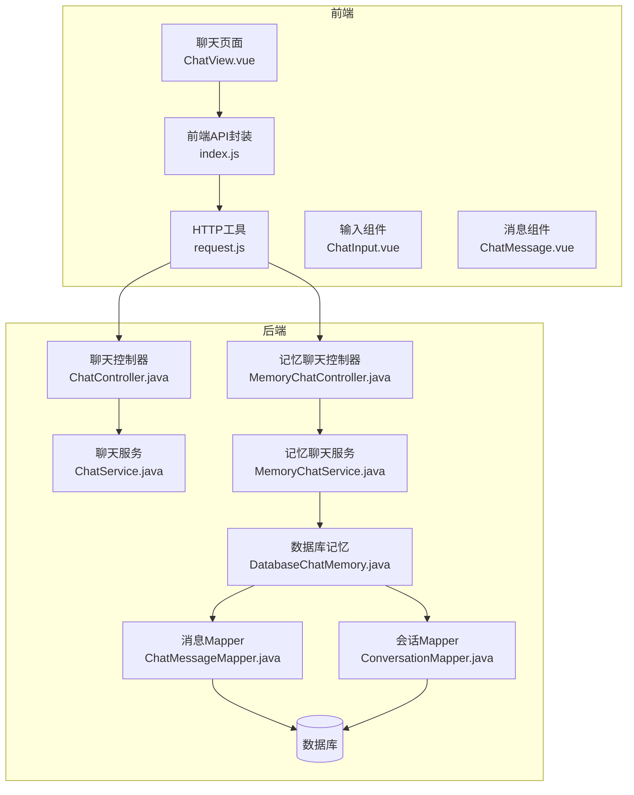
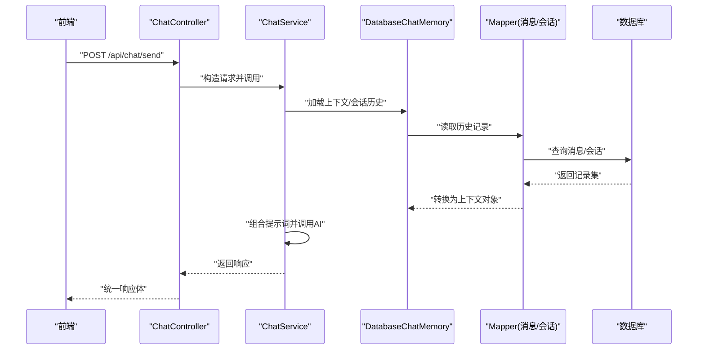
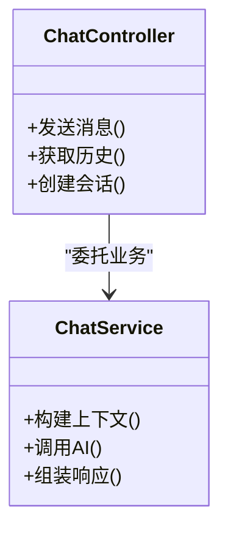
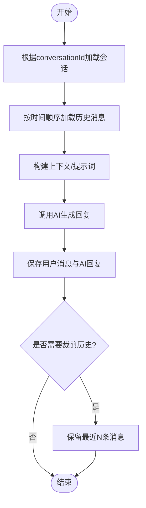
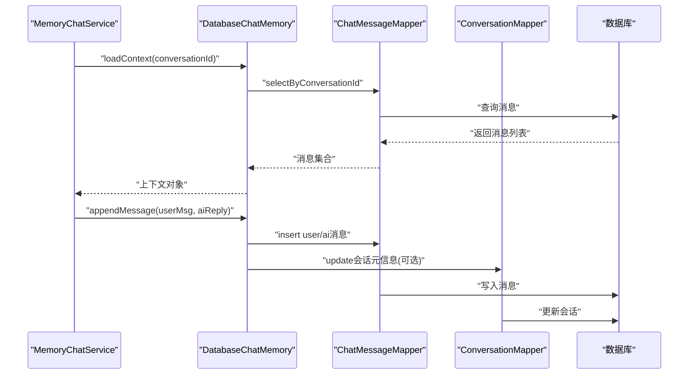
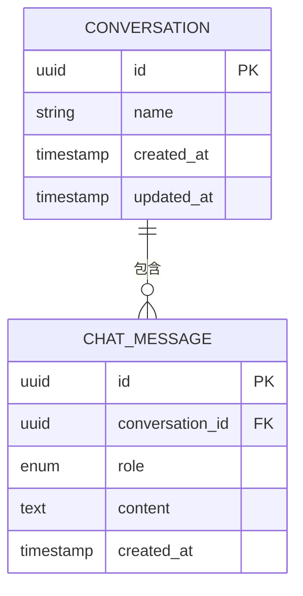
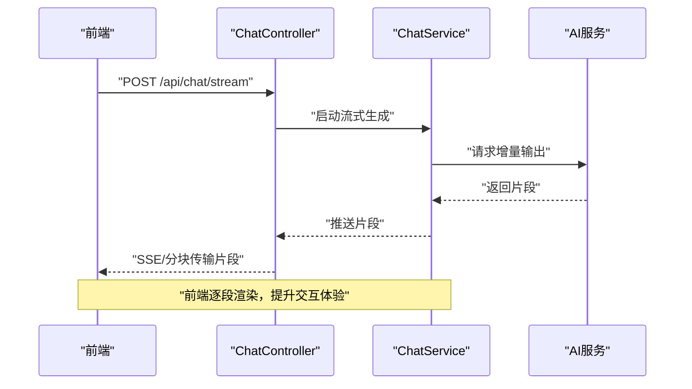
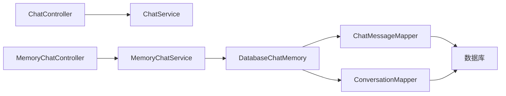
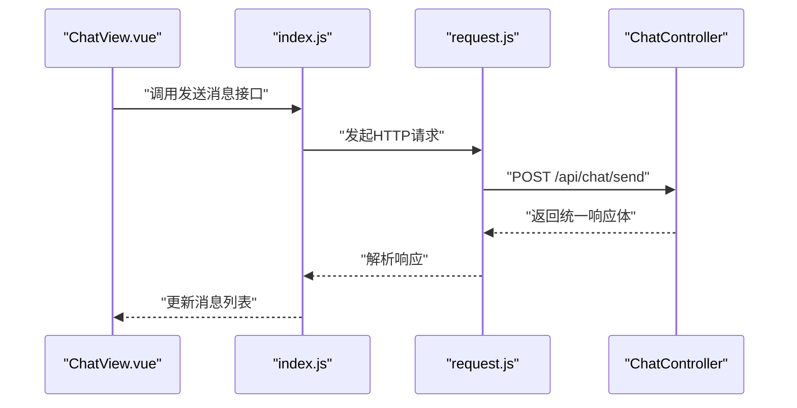

# AI对话系统

<cite>
**本文引用的文件**   
- [ChatController.java](file://src/main/java/com/ailearn/chat/ChatController.java)
- [ChatService.java](file://src/main/java/com/ailearn/chat/ChatService.java)
- [DatabaseChatMemory.java](file://src/main/java/com/ailearn/memory/DatabaseChatMemory.java)
- [MemoryChatController.java](file://src/main/java/com/ailearn/memory/MemoryChatController.java)
- [MemoryChatService.java](file://src/main/java/com/ailearn/memory/MemoryChatService.java)
- [ChatMessage.java](file://src/main/java/com/ailearn/entity/ChatMessage.java)
- [Conversation.java](file://src/main/java/com/ailearn/entity/Conversation.java)
- [ChatMessageMapper.java](file://src/main/java/com/ailearn/mapper/ChatMessageMapper.java)
- [ConversationMapper.java](file://src/main/java/com/ailearn/mapper/ConversationMapper.java)
- [schema.sql](file://src/main/resources/schema.sql)
- [application.yml](file://src/main/resources/application.yml)
- [GlobalExceptionHandler.java](file://src/main/java/com/ailearn/common/GlobalExceptionHandler.java)
- [Result.java](file://src/main/java/com/ailearn/common/Result.java)
- [BusinessException.java](file://src/main/java/com/ailearn/common/BusinessException.java)
- [ErrorCode.java](file://src/main/java/com/ailearn/common/ErrorCode.java)
- [AiConfig.java](file://src/main/java/com/ailearn/config/AiConfig.java)
- [RateLimiterConfig.java](file://src/main/java/com/ailearn/config/RateLimiterConfig.java)
- [MyBatisPlusConfig.java](file://src/main/java/com/ailearn/config/MyBatisPlusConfig.java)
- [index.js](file://frontend/src/api/index.js)
- [request.js](file://frontend/src/utils/request.js)
- [ChatView.vue](file://frontend/src/views/ChatView.vue)
- [ChatInput.vue](file://frontend/src/components/ChatInput.vue)
- [ChatMessage.vue](file://frontend/src/components/ChatMessage.vue)
</cite>

## 目录
1. [简介](#简介)
2. [项目结构](#项目结构)
3. [核心组件](#核心组件)
4. [架构总览](#架构总览)
5. [详细组件分析](#详细组件分析)
6. [依赖关系分析](#依赖关系分析)
7. [性能考虑](#性能考虑)
8. [故障排查指南](#故障排查指南)
9. [结论](#结论)
10. [附录](#附录)

## 简介
本文件面向AI对话系统的后端与前端集成，聚焦聊天功能的架构设计与实现。文档重点包括：
- 控制器层与服务层的职责分离（ChatController、ChatService）
- 多轮对话上下文管理与持久化（会话历史、上下文记忆）
- 数据库记忆实现（DatabaseChatMemory）的工作原理与数据流转
- 完整聊天API接口说明（消息发送、接收、历史查询）
- 对话实体数据模型与关系映射
- 流式响应处理、错误重试机制与性能优化策略
- 前端集成示例与常见问题排查

## 项目结构
本项目采用分层架构与模块化组织方式：
- 表现层：REST控制器负责HTTP请求解析与响应封装
- 服务层：业务编排、调用外部AI能力、管理会话上下文
- 数据访问层：MyBatis-Plus Mapper与数据库表
- 配置与安全：应用配置、限流、全局异常处理等
- 前端：Vue3 + Vite，提供聊天界面与API调用封装

**图表来源**
- [ChatController.java](file://src/main/java/com/ailearn/chat/ChatController.java)
- [ChatService.java](file://src/main/java/com/ailearn/chat/ChatService.java)
- [MemoryChatController.java](file://src/main/java/com/ailearn/memory/MemoryChatController.java)
- [MemoryChatService.java](file://src/main/java/com/ailearn/memory/MemoryChatService.java)
- [DatabaseChatMemory.java](file://src/main/java/com/ailearn/memory/DatabaseChatMemory.java)
- [ChatMessageMapper.java](file://src/main/java/com/ailearn/mapper/ChatMessageMapper.java)
- [ConversationMapper.java](file://src/main/java/com/ailearn/mapper/ConversationMapper.java)

**章节来源**
- [ChatController.java](file://src/main/java/com/ailearn/chat/ChatController.java)
- [ChatService.java](file://src/main/java/com/ailearn/chat/ChatService.java)
- [MemoryChatController.java](file://src/main/java/com/ailearn/memory/MemoryChatController.java)
- [MemoryChatService.java](file://src/main/java/com/ailearn/memory/MemoryChatService.java)
- [DatabaseChatMemory.java](file://src/main/java/com/ailearn/memory/DatabaseChatMemory.java)
- [ChatMessageMapper.java](file://src/main/java/com/ailearn/mapper/ChatMessageMapper.java)
- [ConversationMapper.java](file://src/main/java/com/ailearn/mapper/ConversationMapper.java)

## 核心组件
- ChatController：定义聊天相关HTTP端点，负责参数校验、统一响应封装、路由转发至服务层。
- ChatService：承载聊天业务逻辑，协调AI调用、会话上下文构建与结果组装。
- MemoryChatController/MemoryChatService：基于记忆的聊天入口，使用DatabaseChatMemory进行上下文持久化。
- DatabaseChatMemory：将对话历史与上下文存储到数据库，提供读取/写入/清理等操作。
- 实体与Mapper：ChatMessage、Conversation及其对应的Mapper用于数据持久化。
- 配置与异常：AiConfig、RateLimiterConfig、GlobalExceptionHandler等保障系统稳定性与可观测性。

**章节来源**
- [ChatController.java](file://src/main/java/com/ailearn/chat/ChatController.java)
- [ChatService.java](file://src/main/java/com/ailearn/chat/ChatService.java)
- [MemoryChatController.java](file://src/main/java/com/ailearn/memory/MemoryChatController.java)
- [MemoryChatService.java](file://src/main/java/com/ailearn/memory/MemoryChatService.java)
- [DatabaseChatMemory.java](file://src/main/java/com/ailearn/memory/DatabaseChatMemory.java)
- [ChatMessage.java](file://src/main/java/com/ailearn/entity/ChatMessage.java)
- [Conversation.java](file://src/main/java/com/ailearn/entity/Conversation.java)
- [ChatMessageMapper.java](file://src/main/java/com/ailearn/mapper/ChatMessageMapper.java)
- [ConversationMapper.java](file://src/main/java/com/ailearn/mapper/ConversationMapper.java)
- [AiConfig.java](file://src/main/java/com/ailearn/config/AiConfig.java)
- [RateLimiterConfig.java](file://src/main/java/com/ailearn/config/RateLimiterConfig.java)
- [GlobalExceptionHandler.java](file://src/main/java/com/ailearn/common/GlobalExceptionHandler.java)

## 架构总览
整体采用“控制器-服务-记忆-数据访问”的分层模式，前后端通过REST API交互，支持普通聊天与带记忆的聊天两种模式。

**图表来源**
- [ChatController.java](file://src/main/java/com/ailearn/chat/ChatController.java)
- [ChatService.java](file://src/main/java/com/ailearn/chat/ChatService.java)
- [DatabaseChatMemory.java](file://src/main/java/com/ailearn/memory/DatabaseChatMemory.java)
- [ChatMessageMapper.java](file://src/main/java/com/ailearn/mapper/ChatMessageMapper.java)
- [ConversationMapper.java](file://src/main/java/com/ailearn/mapper/ConversationMapper.java)

## 详细组件分析

### 控制器层与服务层职责分离
- ChatController
  - 暴露聊天相关REST端点
  - 负责请求参数校验、统一响应包装（Result）、异常转译
  - 将具体业务委托给ChatService
- ChatService
  - 编排对话流程：加载上下文、构建提示词、调用AI、生成回复
  - 维护会话状态（如conversationId），必要时与记忆模块协作
  - 对异常进行业务化处理并返回友好错误码

**图表来源**
- [ChatController.java](file://src/main/java/com/ailearn/chat/ChatController.java)
- [ChatService.java](file://src/main/java/com/ailearn/chat/ChatService.java)

**章节来源**
- [ChatController.java](file://src/main/java/com/ailearn/chat/ChatController.java)
- [ChatService.java](file://src/main/java/com/ailearn/chat/ChatService.java)
- [Result.java](file://src/main/java/com/ailearn/common/Result.java)

### 多轮对话上下文管理与持久化
- 上下文来源
  - 会话标识（conversationId）定位会话
  - 历史消息（ChatMessage）作为上下文基础
  - 可选的系统提示词与用户偏好（由配置或上层传入）
- 持久化策略
  - 每次对话后追加消息记录
  - 定期裁剪历史长度，避免上下文过大
  - 会话生命周期管理（创建、切换、清理）

**图表来源**
- [DatabaseChatMemory.java](file://src/main/java/com/ailearn/memory/DatabaseChatMemory.java)
- [ChatMessage.java](file://src/main/java/com/ailearn/entity/ChatMessage.java)
- [Conversation.java](file://src/main/java/com/ailearn/entity/Conversation.java)

**章节来源**
- [DatabaseChatMemory.java](file://src/main/java/com/ailearn/memory/DatabaseChatMemory.java)
- [ChatMessage.java](file://src/main/java/com/ailearn/entity/ChatMessage.java)
- [Conversation.java](file://src/main/java/com/ailearn/entity/Conversation.java)

### 数据库记忆实现（DatabaseChatMemory）工作原理与数据流转
- 职责
  - 提供上下文的读取、写入、清理能力
  - 与Mapper协作完成数据库操作
  - 保证会话一致性（事务边界在Mapper或服务层控制）
- 数据流转
  - 读：按conversationId查询历史消息，排序后转为上下文对象
  - 写：插入用户消息与AI回复，必要时更新会话元信息
  - 清理：按时间或数量阈值裁剪历史，释放内存与存储压力

**图表来源**
- [MemoryChatService.java](file://src/main/java/com/ailearn/memory/MemoryChatService.java)
- [DatabaseChatMemory.java](file://src/main/java/com/ailearn/memory/DatabaseChatMemory.java)
- [ChatMessageMapper.java](file://src/main/java/com/ailearn/mapper/ChatMessageMapper.java)
- [ConversationMapper.java](file://src/main/java/com/ailearn/mapper/ConversationMapper.java)

**章节来源**
- [MemoryChatService.java](file://src/main/java/com/ailearn/memory/MemoryChatService.java)
- [DatabaseChatMemory.java](file://src/main/java/com/ailearn/memory/DatabaseChatMemory.java)
- [ChatMessageMapper.java](file://src/main/java/com/ailearn/mapper/ChatMessageMapper.java)
- [ConversationMapper.java](file://src/main/java/com/ailearn/mapper/ConversationMapper.java)

### 聊天API接口文档
以下为典型聊天相关接口（以路径与方法为准，具体参数与响应字段参考对应控制器与服务实现）：
- 发送消息（普通聊天）
  - 方法：POST
  - 路径：/api/chat/send
  - 请求体：包含用户消息、会话标识等
  - 响应：统一响应体（Result），包含AI回复内容
- 获取历史消息
  - 方法：GET
  - 路径：/api/chat/history
  - 查询参数：conversationId、分页参数（可选）
  - 响应：统一响应体（Result），包含历史消息列表
- 创建/切换会话
  - 方法：POST
  - 路径：/api/chat/conversation
  - 请求体：会话名称或初始化参数（可选）
  - 响应：统一响应体（Result），包含新会话ID

注意：
- 所有接口均通过统一响应体Result封装，便于前端一致处理
- 鉴权与限流由全局过滤器与限流配置共同保障

**章节来源**
- [ChatController.java](file://src/main/java/com/ailearn/chat/ChatController.java)
- [MemoryChatController.java](file://src/main/java/com/ailearn/memory/MemoryChatController.java)
- [Result.java](file://src/main/java/com/ailearn/common/Result.java)

### 对话实体数据模型与关系映射
- ChatMessage
  - 字段：消息ID、会话ID、角色（user/assistant）、内容、时间戳等
  - 用途：存储每轮对话的用户与AI消息
- Conversation
  - 字段：会话ID、名称、创建时间、更新时间、所有者（可选）等
  - 用途：会话级元信息与生命周期管理
- 关系
  - Conversation 1:N ChatMessage（一个会话包含多条消息）

**图表来源**
- [Conversation.java](file://src/main/java/com/ailearn/entity/Conversation.java)
- [ChatMessage.java](file://src/main/java/com/ailearn/entity/ChatMessage.java)
- [schema.sql](file://src/main/resources/schema.sql)

**章节来源**
- [Conversation.java](file://src/main/java/com/ailearn/entity/Conversation.java)
- [ChatMessage.java](file://src/main/java/com/ailearn/entity/ChatMessage.java)
- [schema.sql](file://src/main/resources/schema.sql)

### 流式响应处理
- 后端
  - 控制器可返回流式响应（如Server-Sent Events或分块传输），逐步推送AI生成的片段
  - 服务层按需产生增量输出，减少首字节延迟
- 前端
  - 使用EventSource或fetch流式读取，逐段渲染消息
  - 维护本地消息队列，确保UI稳定与滚动体验

[本节为概念性说明，不直接分析具体文件]

### 错误重试机制
- 适用场景
  - AI服务超时、网络抖动、临时不可用
- 策略建议
  - 指数退避重试（最大重试次数、初始间隔、上限间隔）
  - 熔断与降级（失败率阈值触发快速失败）
  - 幂等性与去重（防止重复提交导致重复消息）
- 实现位置
  - 服务层封装重试逻辑，控制器仅做统一异常处理与响应

[本节为通用指导，不直接分析具体文件]

### 性能优化策略
- 上下文裁剪：限制历史消息数量，降低提示词体积与AI推理成本
- 连接池与缓存：数据库连接池、热点会话元信息缓存（Redis可选）
- 异步与批处理：非关键路径异步落库，批量写入消息
- 限流与配额：按用户/IP/会话维度限流，保护后端资源
- 索引与查询优化：按conversation_id与created_at建立索引，提高历史查询效率

**章节来源**
- [RateLimiterConfig.java](file://src/main/java/com/ailearn/config/RateLimiterConfig.java)
- [MyBatisPlusConfig.java](file://src/main/java/com/ailearn/config/MyBatisPlusConfig.java)
- [schema.sql](file://src/main/resources/schema.sql)

## 依赖关系分析
- 控制器依赖服务层，服务层依赖记忆与Mapper
- 记忆实现依赖Mapper，Mapper依赖数据库
- 配置类影响运行时行为（限流、MyBatis-Plus行为等）

**图表来源**
- [ChatController.java](file://src/main/java/com/ailearn/chat/ChatController.java)
- [ChatService.java](file://src/main/java/com/ailearn/chat/ChatService.java)
- [MemoryChatController.java](file://src/main/java/com/ailearn/memory/MemoryChatController.java)
- [MemoryChatService.java](file://src/main/java/com/ailearn/memory/MemoryChatService.java)
- [DatabaseChatMemory.java](file://src/main/java/com/ailearn/memory/DatabaseChatMemory.java)
- [ChatMessageMapper.java](file://src/main/java/com/ailearn/mapper/ChatMessageMapper.java)
- [ConversationMapper.java](file://src/main/java/com/ailearn/mapper/ConversationMapper.java)

**章节来源**
- [ChatController.java](file://src/main/java/com/ailearn/chat/ChatController.java)
- [ChatService.java](file://src/main/java/com/ailearn/chat/ChatService.java)
- [MemoryChatController.java](file://src/main/java/com/ailearn/memory/MemoryChatController.java)
- [MemoryChatService.java](file://src/main/java/com/ailearn/memory/MemoryChatService.java)
- [DatabaseChatMemory.java](file://src/main/java/com/ailearn/memory/DatabaseChatMemory.java)
- [ChatMessageMapper.java](file://src/main/java/com/ailearn/mapper/ChatMessageMapper.java)
- [ConversationMapper.java](file://src/main/java/com/ailearn/mapper/ConversationMapper.java)

## 性能考虑
- 上下文大小控制：合理设置历史消息上限，避免提示词过长导致延迟与费用上升
- 数据库索引：针对conversation_id与created_at建立合适索引，加速历史查询
- 限流与并发：结合RateLimiterConfig进行请求限流，避免过载
- 流式输出：优先使用流式响应，改善用户体验
- 缓存策略：对热点会话元信息进行缓存，降低数据库压力

[本节为通用指导，不直接分析具体文件]

## 故障排查指南
- 统一异常处理
  - GlobalExceptionHandler捕获业务与非业务异常，返回标准错误码与消息
  - BusinessException与ErrorCode配合，便于前端识别与展示
- 常见错误
  - 会话不存在：检查conversationId是否正确传递
  - 消息为空：校验前端输入与后端参数绑定
  - 数据库连接失败：检查application.yml中数据库配置与连接池参数
  - 限流触发：观察限流配置与客户端请求频率
- 日志与追踪
  - 查看应用日志与链路追踪信息，定位问题根因

**章节来源**
- [GlobalExceptionHandler.java](file://src/main/java/com/ailearn/common/GlobalExceptionHandler.java)
- [BusinessException.java](file://src/main/java/com/ailearn/common/BusinessException.java)
- [ErrorCode.java](file://src/main/java/com/ailearn/common/ErrorCode.java)
- [application.yml](file://src/main/resources/application.yml)

## 结论
本AI对话系统通过清晰的控制器-服务-记忆-数据访问分层，实现了可扩展的聊天功能与上下文持久化。DatabaseChatMemory提供了可靠的会话历史管理能力，结合流式响应与限流、重试等策略，兼顾了用户体验与系统稳定性。前端通过统一的API封装与组件化设计，能够快速集成与迭代。

## 附录

### 前端集成示例
- API封装
  - index.js：集中定义聊天相关接口调用（发送消息、获取历史、创建会话）
  - request.js：封装HTTP请求（拦截器、错误处理、超时配置）
- 页面与组件
  - ChatView.vue：聊天主视图，管理消息列表与流式渲染
  - ChatInput.vue：输入组件，处理用户输入与发送事件
  - ChatMessage.vue：消息组件，区分用户与AI消息样式

**图表来源**
- [index.js](file://frontend/src/api/index.js)
- [request.js](file://frontend/src/utils/request.js)
- [ChatView.vue](file://frontend/src/views/ChatView.vue)
- [ChatController.java](file://src/main/java/com/ailearn/chat/ChatController.java)

**章节来源**
- [index.js](file://frontend/src/api/index.js)
- [request.js](file://frontend/src/utils/request.js)
- [ChatView.vue](file://frontend/src/views/ChatView.vue)
- [ChatInput.vue](file://frontend/src/components/ChatInput.vue)
- [ChatMessage.vue](file://frontend/src/components/ChatMessage.vue)