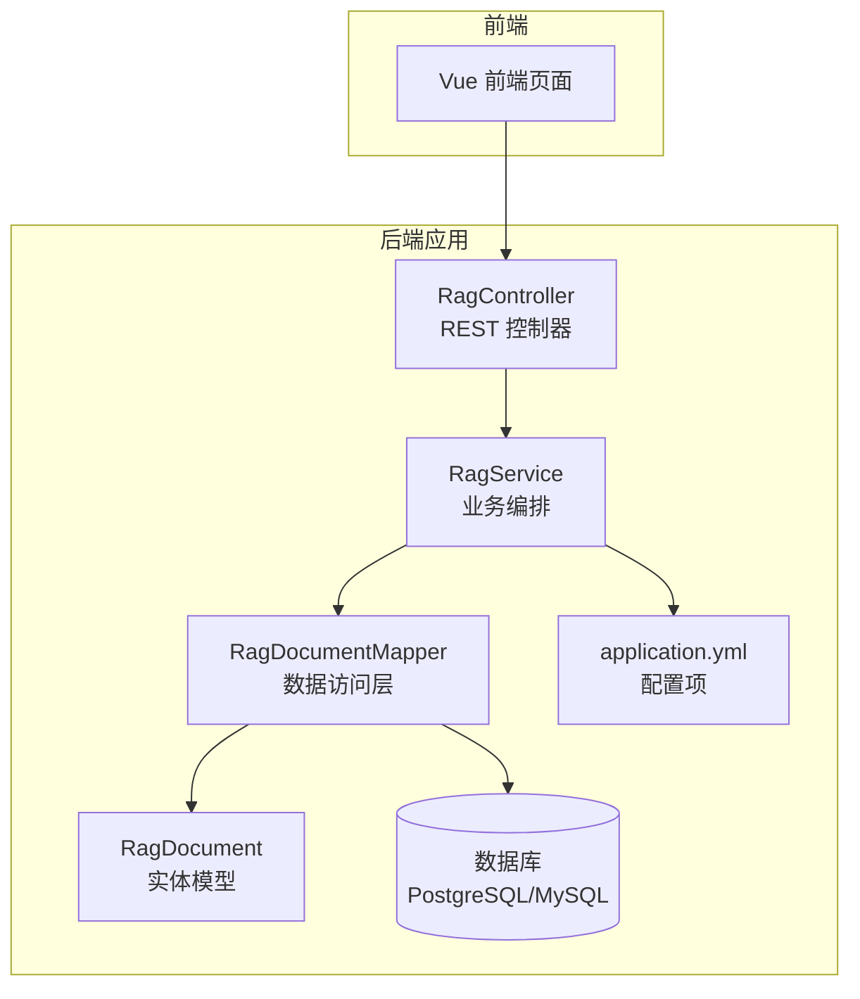
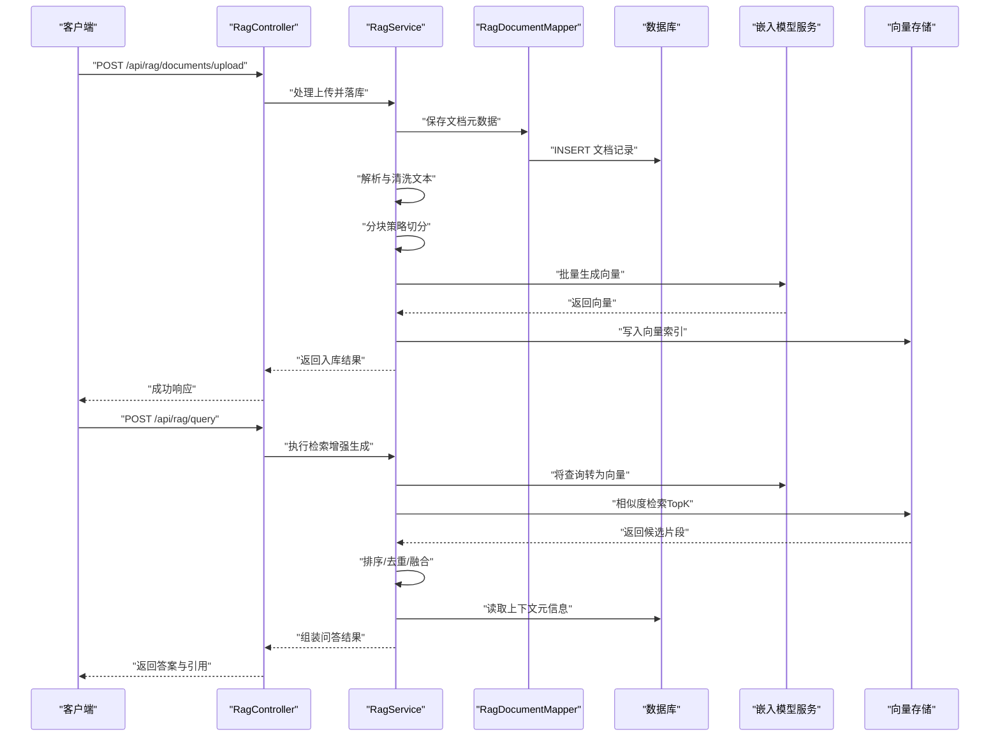
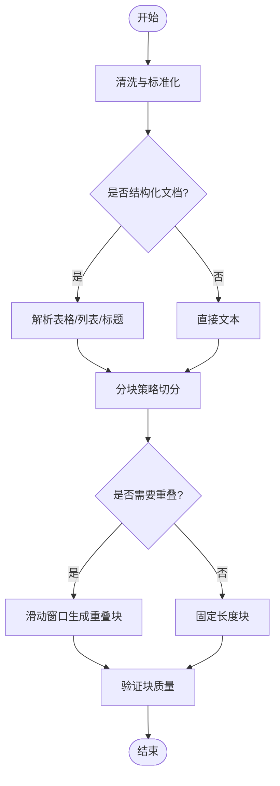
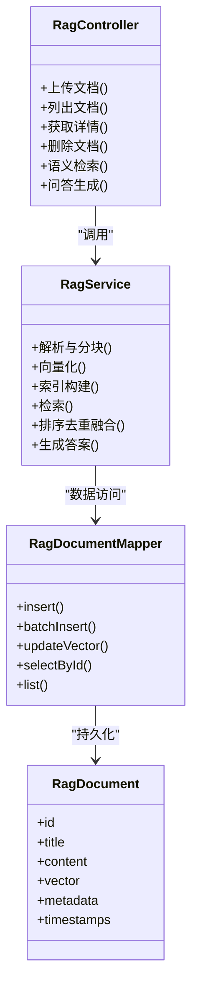

# RAG知识库系统

<cite>
**本文引用的文件**   
- [RagController.java](file://src/main/java/com/ailearn/rag/RagController.java)
- [RagService.java](file://src/main/java/com/ailearn/rag/RagService.java)
- [RagDocument.java](file://src/main/java/com/ailearn/entity/RagDocument.java)
- [RagDocumentMapper.java](file://src/main/java/com/ailearn/mapper/RagDocumentMapper.java)
- [application.yml](file://src/main/resources/application.yml)
- [schema.sql](file://src/main/resources/schema.sql)
- [pom.xml](file://pom.xml)
</cite>

## 目录
1. [简介](#简介)
2. [项目结构](#项目结构)
3. [核心组件](#核心组件)
4. [架构总览](#架构总览)
5. [详细组件分析](#详细组件分析)
6. [依赖关系分析](#依赖关系分析)
7. [性能考虑](#性能考虑)
8. [故障排查指南](#故障排查指南)
9. [结论](#结论)
10. [附录](#附录)

## 简介
本文件面向RAG（检索增强生成）知识库系统的构建与使用，围绕文档上传、解析、向量化、索引构建、语义搜索、结果排序与融合、以及问答生成等关键环节进行系统化说明。文档同时提供RagService核心服务的API接口说明、RagDocument实体模型设计、向量存储方案、预处理与分块策略、嵌入模型选择建议，以及知识库构建的最佳实践与性能调优建议。

## 项目结构
本项目采用分层架构：前端通过REST调用后端服务；后端以Spring Boot为基础，按功能域划分包结构。RAG相关代码集中在rag、entity、mapper与resources中，配置与数据库脚本位于resources下，依赖声明位于pom.xml。

图表来源
- [RagController.java](file://src/main/java/com/ailearn/rag/RagController.java)
- [RagService.java](file://src/main/java/com/ailearn/rag/RagService.java)
- [RagDocumentMapper.java](file://src/main/java/com/ailearn/mapper/RagDocumentMapper.java)
- [RagDocument.java](file://src/main/java/com/ailearn/entity/RagDocument.java)
- [application.yml](file://src/main/resources/application.yml)
- [schema.sql](file://src/main/resources/schema.sql)

章节来源
- [RagController.java](file://src/main/java/com/ailearn/rag/RagController.java)
- [RagService.java](file://src/main/java/com/ailearn/rag/RagService.java)
- [RagDocument.java](file://src/main/java/com/ailearn/entity/RagDocument.java)
- [RagDocumentMapper.java](file://src/main/java/com/ailearn/mapper/RagDocumentMapper.java)
- [application.yml](file://src/main/resources/application.yml)
- [schema.sql](file://src/main/resources/schema.sql)

## 核心组件
- RagController：暴露RAG相关的REST接口，负责请求校验、参数绑定与响应封装。
- RagService：实现RAG核心流程编排，包括文档入库、解析、分块、向量化、索引构建、检索与问答生成。
- RagDocument：知识文档的持久化实体，包含元数据与向量字段。
- RagDocumentMapper：对RagDocument进行CRUD操作的数据访问接口。
- application.yml：RAG相关配置（如嵌入模型、相似度阈值、分块大小等）。
- schema.sql：数据库表结构与索引定义。

章节来源
- [RagController.java](file://src/main/java/com/ailearn/rag/RagController.java)
- [RagService.java](file://src/main/java/com/ailearn/rag/RagService.java)
- [RagDocument.java](file://src/main/java/com/ailearn/entity/RagDocument.java)
- [RagDocumentMapper.java](file://src/main/java/com/ailearn/mapper/RagDocumentMapper.java)
- [application.yml](file://src/main/resources/application.yml)
- [schema.sql](file://src/main/resources/schema.sql)

## 架构总览
下图展示了从文档上传到问答生成的端到端流程，涵盖解析、分块、向量化、索引构建、检索与生成阶段。

图表来源
- [RagController.java](file://src/main/java/com/ailearn/rag/RagController.java)
- [RagService.java](file://src/main/java/com/ailearn/rag/RagService.java)
- [RagDocumentMapper.java](file://src/main/java/com/ailearn/mapper/RagDocumentMapper.java)
- [RagDocument.java](file://src/main/java/com/ailearn/entity/RagDocument.java)
- [application.yml](file://src/main/resources/application.yml)
- [schema.sql](file://src/main/resources/schema.sql)

## 详细组件分析

### RagController 接口说明
- 职责：接收前端请求，调用RagService完成文档管理与问答生成，统一返回格式。
- 典型能力：
  - 文档上传与入库
  - 文档列表与详情查询
  - 删除与更新
  - 语义检索与问答生成
- 输入输出：遵循统一的Result封装，错误码由全局异常处理器统一处理。

章节来源
- [RagController.java](file://src/main/java/com/ailearn/rag/RagController.java)

### RagService 核心流程
- 文档管理：
  - 接收文件流或文本内容，解析为结构化文本。
  - 根据配置进行分块，生成子文档记录。
  - 调用嵌入模型生成向量，写入向量存储。
  - 在数据库中持久化文档与分块的元数据。
- 检索增强生成：
  - 将用户问题转换为向量。
  - 在向量存储中进行相似度检索，获取TopK候选片段。
  - 对候选片段进行排序、去重与融合，形成高质量上下文。
  - 结合大模型生成最终答案，附带引用来源。

章节来源
- [RagService.java](file://src/main/java/com/ailearn/rag/RagService.java)

### RagDocument 实体模型
- 字段设计要点：
  - 文档标识、标题、来源、版本、状态等元数据。
  - 文本内容与分块信息。
  - 向量字段（用于相似度检索）。
  - 时间戳与审计字段。
- 约束与索引：
  - 主键与唯一约束保证数据一致性。
  - 针对常用查询字段建立索引以提升检索性能。

章节来源
- [RagDocument.java](file://src/main/java/com/ailearn/entity/RagDocument.java)
- [schema.sql](file://src/main/resources/schema.sql)

### RagDocumentMapper 数据访问
- 提供对RagDocument的增删改查方法。
- 支持批量插入分块记录与批量更新向量字段。
- 与数据库事务配合，确保入库过程的一致性。

章节来源
- [RagDocumentMapper.java](file://src/main/java/com/ailearn/mapper/RagDocumentMapper.java)
- [schema.sql](file://src/main/resources/schema.sql)

### 配置与外部依赖
- application.yml：
  - 嵌入模型配置（模型名称、维度、超时、重试等）。
  - 分块策略（最大长度、重叠比例、分隔符）。
  - 检索参数（TopK、相似度阈值、召回策略）。
  - 向量存储连接信息（地址、认证、索引名）。
- pom.xml：
  - 引入必要的AI与向量存储依赖（如嵌入模型SDK、向量数据库客户端）。

章节来源
- [application.yml](file://src/main/resources/application.yml)
- [pom.xml](file://pom.xml)

### 数据库设计与索引
- 表结构：
  - rag_document：文档主表，包含元数据与状态。
  - rag_chunk：分块表，包含文本片段、位置信息与向量外键。
  - rag_vector_index：可选的向量索引映射表（若使用关系型数据库承载向量）。
- 索引优化：
  - 对文档ID、来源、更新时间建立B树索引。
  - 对向量字段建立近似最近邻索引（ANN），提升检索效率。

章节来源
- [schema.sql](file://src/main/resources/schema.sql)

### 算法与流程细节

#### 文档预处理与分块策略
- 预处理：
  - 去除空白字符与不可见符号。
  - 标准化编码与换行。
  - 过滤无关段落与广告噪声。
- 分块策略：
  - 固定长度分块：按字符或Token数切分。
  - 语义分块：基于段落、标题或句子边界切分。
  - 重叠窗口：设置重叠比例，避免跨段语义断裂。
  - 自适应分块：根据内容密度动态调整块大小。

图表来源
- [RagService.java](file://src/main/java/com/ailearn/rag/RagService.java)
- [application.yml](file://src/main/resources/application.yml)

#### 向量化与索引构建
- 嵌入模型：
  - 选择多语言支持的中文优化模型。
  - 控制批次大小与并发度，平衡吞吐与延迟。
- 索引构建：
  - 批量写入向量，建立HNSW或IVF-Flat索引。
  - 定期重建索引以适配数据分布变化。

章节来源
- [RagService.java](file://src/main/java/com/ailearn/rag/RagService.java)
- [application.yml](file://src/main/resources/application.yml)

#### 语义搜索与相似度计算
- 相似度度量：
  - 余弦相似度：适用于归一化后的稠密向量。
  - 内积相似度：在高维空间中表现稳定。
  - 欧氏距离：适合低维或特定分布场景。
- 检索流程：
  - 查询向量化后，在向量存储中进行TopK检索。
  - 结合元数据过滤（如来源、时间范围）提升相关性。

章节来源
- [RagService.java](file://src/main/java/com/ailearn/rag/RagService.java)
- [application.yml](file://src/main/resources/application.yml)

#### 结果排序、去重与融合
- 排序：
  - 基于相似度分数降序排列。
  - 引入元数据权重（如来源权威度、时效性）。
- 去重：
  - 基于文本指纹（MinHash/SimHash）消除重复片段。
  - 基于重叠率阈值合并相近块。
- 融合：
  - 多路召回融合（不同分块策略或不同模型）。
  - 加权评分与重排（学习排序或规则重排）。

章节来源
- [RagService.java](file://src/main/java/com/ailearn/rag/RagService.java)

#### 问答生成
- 提示词工程：
  - 明确角色与任务目标。
  - 注入检索到的上下文与引用来源。
  - 限制回答风格与长度。
- 生成策略：
  - 温度与Top-p调节多样性与稳定性。
  - 多次采样与投票机制提升鲁棒性。

章节来源
- [RagService.java](file://src/main/java/com/ailearn/rag/RagService.java)

### API 接口文档（RagService 暴露的REST能力）
- 文档管理
  - 上传文档：POST /api/rag/documents/upload
    - 请求体：multipart/form-data 或 JSON（含文本内容）
    - 响应：Result<DocumentInfo>
  - 列出文档：GET /api/rag/documents
    - 查询参数：page、size、keyword、source
    - 响应：Result<PagedResult<DocumentInfo>>
  - 获取详情：GET /api/rag/documents/{id}
    - 响应：Result<RagDocument>
  - 删除文档：DELETE /api/rag/documents/{id}
    - 响应：Result<Void>
- 知识检索与问答
  - 语义检索：POST /api/rag/search
    - 请求体：{query, topK, filters}
    - 响应：Result<List<ChunkWithScore>>
  - 问答生成：POST /api/rag/query
    - 请求体：{question, contextMode, generationParams}
    - 响应：Result<AnswerWithSources>

注意：以上路径与方法为通用约定，具体以RagController实际实现为准。

章节来源
- [RagController.java](file://src/main/java/com/ailearn/rag/RagController.java)
- [RagService.java](file://src/main/java/com/ailearn/rag/RagService.java)

## 依赖关系分析
- 内部依赖：
  - RagController依赖RagService进行业务编排。
  - RagService依赖RagDocumentMapper进行数据访问。
  - RagDocument作为实体贯穿服务与数据层。
- 外部依赖：
  - 嵌入模型服务：提供文本到向量的转换。
  - 向量存储：提供高维向量的存储与近似最近邻检索。
  - 数据库：持久化文档与分块元数据。

图表来源
- [RagController.java](file://src/main/java/com/ailearn/rag/RagController.java)
- [RagService.java](file://src/main/java/com/ailearn/rag/RagService.java)
- [RagDocumentMapper.java](file://src/main/java/com/ailearn/mapper/RagDocumentMapper.java)
- [RagDocument.java](file://src/main/java/com/ailearn/entity/RagDocument.java)

章节来源
- [RagController.java](file://src/main/java/com/ailearn/rag/RagController.java)
- [RagService.java](file://src/main/java/com/ailearn/rag/RagService.java)
- [RagDocumentMapper.java](file://src/main/java/com/ailearn/mapper/RagDocumentMapper.java)
- [RagDocument.java](file://src/main/java/com/ailearn/entity/RagDocument.java)

## 性能考虑
- 嵌入模型：
  - 批处理与并行调用，提高吞吐量。
  - 缓存热点查询向量，减少重复计算。
- 向量存储：
  - 选择合适的索引类型（HNSW/IVF）与参数（M、efConstruction、efSearch）。
  - 定期重建索引，保持检索精度与速度平衡。
- 数据库：
  - 合理设计索引，避免过度索引导致写入变慢。
  - 分页与投影查询，减少网络传输开销。
- 应用层：
  - 限流与熔断保护，防止雪崩。
  - 异步任务处理耗时操作（如批量向量化）。

[本节为通用指导，不直接分析具体文件]

## 故障排查指南
- 常见问题：
  - 向量检索失败：检查向量存储连接与索引状态。
  - 分块过大或过小：调整分块策略与重叠比例。
  - 相似度低：更换嵌入模型或调整TopK与阈值。
  - 生成答案不稳定：调节温度与Top-p，增加上下文长度。
- 日志与监控：
  - 关键步骤打点（解析、分块、向量化、检索、生成）。
  - 指标采集（QPS、延迟、召回率、准确率）。

章节来源
- [RagService.java](file://src/main/java/com/ailearn/rag/RagService.java)
- [application.yml](file://src/main/resources/application.yml)

## 结论
本RAG知识库系统通过清晰的层次化设计与模块化实现，覆盖了从文档入库到问答生成的完整链路。合理的分块策略、稳定的向量化与高效的向量检索是提升效果的关键。结合最佳实践与性能调优，可在大规模知识库场景下获得良好的检索质量与响应速度。

[本节为总结性内容，不直接分析具体文件]

## 附录
- 最佳实践：
  - 优先选择中文优化的嵌入模型。
  - 使用语义分块与适度重叠，提升上下文连贯性。
  - 多路召回与融合，增强鲁棒性与覆盖率。
  - 定期评估与迭代提示词与检索参数。
- 参考配置项（示例）：
  - embedding.model：嵌入模型名称
  - embedding.dimension：向量维度
  - chunk.max_length：最大块长度
  - chunk.overlap_ratio：重叠比例
  - search.top_k：TopK数量
  - search.similarity_threshold：相似度阈值

章节来源
- [application.yml](file://src/main/resources/application.yml)
- [RagService.java](file://src/main/java/com/ailearn/rag/RagService.java)