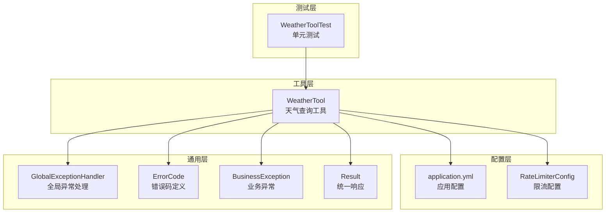
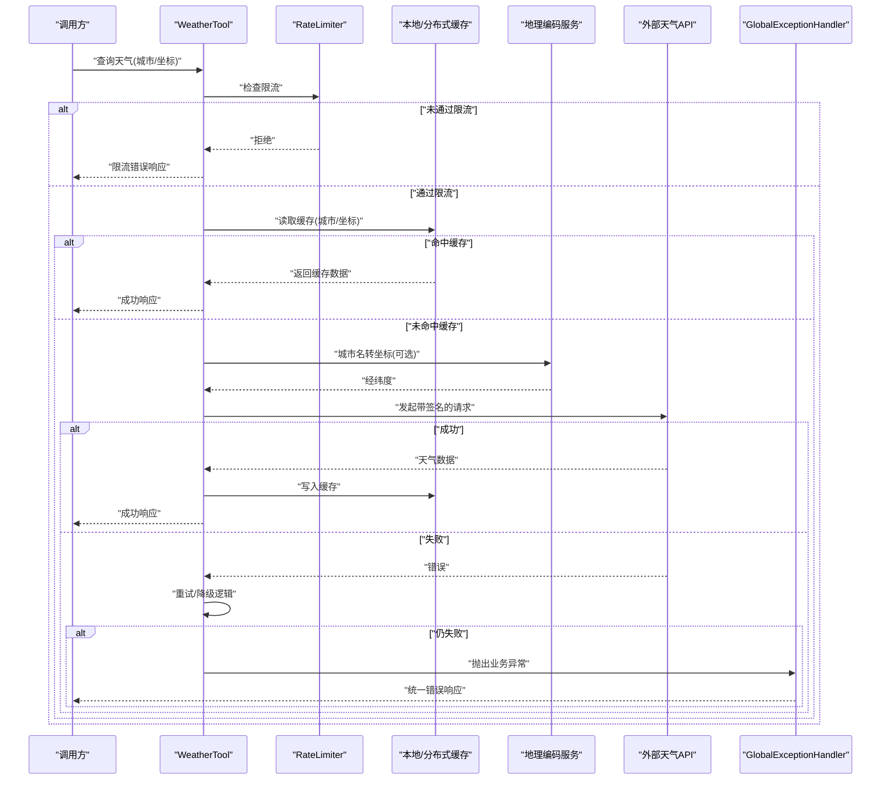
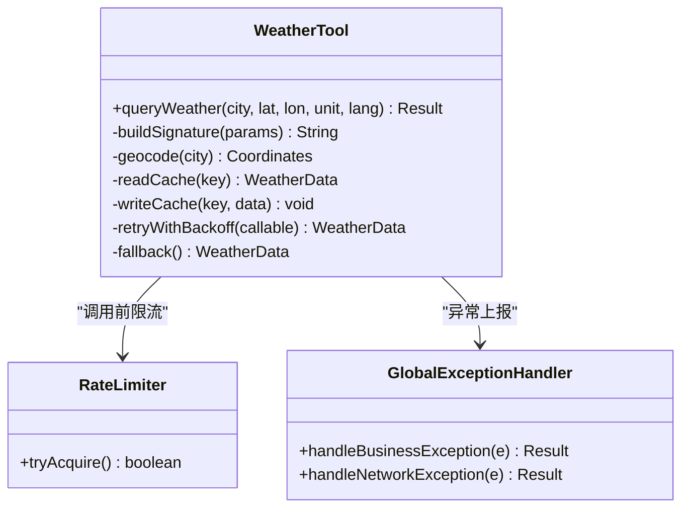
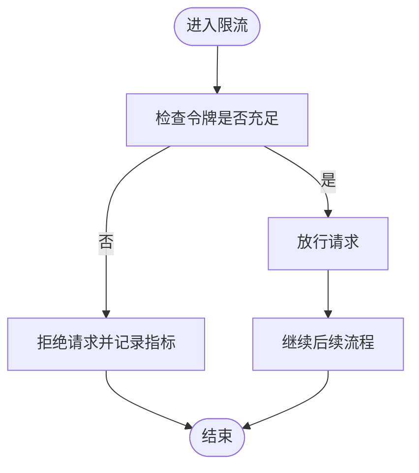
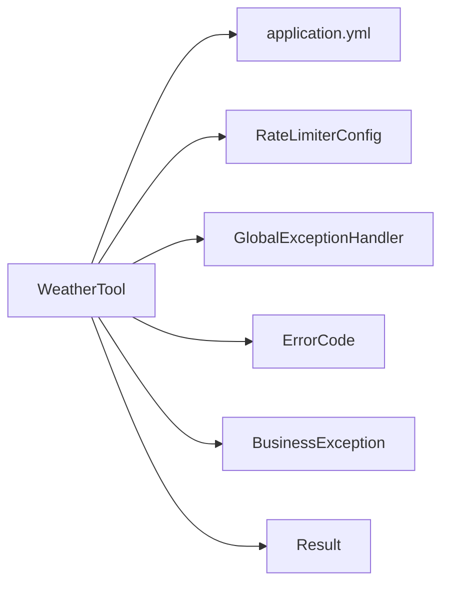

# 天气查询工具

<cite>
**本文引用的文件**   
- [WeatherTool.java](file://src/main/java/com/ailearn/tools/WeatherTool.java)
- [WeatherToolTest.java](file://src/test/java/com/ailearn/tools/WeatherToolTest.java)
- [application.yml](file://src/main/resources/application.yml)
- [RateLimiterConfig.java](file://src/main/java/com/ailearn/config/RateLimiterConfig.java)
- [GlobalExceptionHandler.java](file://src/main/java/com/ailearn/common/GlobalExceptionHandler.java)
- [ErrorCode.java](file://src/main/java/com/ailearn/common/ErrorCode.java)
- [BusinessException.java](file://src/main/java/com/ailearn/common/BusinessException.java)
- [Result.java](file://src/main/java/com/ailearn/common/Result.java)
</cite>

## 目录
1. [简介](#简介)
2. [项目结构](#项目结构)
3. [核心组件](#核心组件)
4. [架构总览](#架构总览)
5. [详细组件分析](#详细组件分析)
6. [依赖关系分析](#依赖关系分析)
7. [性能考虑](#性能考虑)
8. [故障排查指南](#故障排查指南)
9. [结论](#结论)
10. [附录](#附录)

## 简介
本文件面向“天气查询工具”的实现与集成，围绕外部天气API的接入、地理位置解析、数据模型、缓存策略、网络请求容错、限流与配额管理、以及多地区适配与国际化等主题进行系统化说明。文档以仓库中现有实现为基础，结合通用工程实践给出可落地的设计建议与排障指引，帮助读者快速理解并扩展该能力。

## 项目结构
本项目为Spring Boot应用，天气查询能力以“工具（Tool）”形式提供，便于在Agent或业务服务中被调用。关键位置如下：
- 工具入口：tools包下的天气工具类
- 配置：resources下的应用配置文件
- 限流：config包下的限流配置
- 异常与结果封装：common包下的统一错误码、异常与响应体
- 测试：tools包下的单元测试用例

图表来源
- [WeatherTool.java](file://src/main/java/com/ailearn/tools/WeatherTool.java)
- [application.yml](file://src/main/resources/application.yml)
- [RateLimiterConfig.java](file://src/main/java/com/ailearn/config/RateLimiterConfig.java)
- [GlobalExceptionHandler.java](file://src/main/java/com/ailearn/common/GlobalExceptionHandler.java)
- [ErrorCode.java](file://src/main/java/com/ailearn/common/ErrorCode.java)
- [BusinessException.java](file://src/main/java/com/ailearn/common/BusinessException.java)
- [Result.java](file://src/main/java/com/ailearn/common/Result.java)
- [WeatherToolTest.java](file://src/test/java/com/ailearn/tools/WeatherToolTest.java)

章节来源
- [WeatherTool.java](file://src/main/java/com/ailearn/tools/WeatherTool.java)
- [application.yml](file://src/main/resources/application.yml)
- [RateLimiterConfig.java](file://src/main/java/com/ailearn/config/RateLimiterConfig.java)
- [GlobalExceptionHandler.java](file://src/main/java/com/ailearn/common/GlobalExceptionHandler.java)
- [ErrorCode.java](file://src/main/java/com/ailearn/common/ErrorCode.java)
- [BusinessException.java](file://src/main/java/com/ailearn/common/BusinessException.java)
- [Result.java](file://src/main/java/com/ailearn/common/Result.java)
- [WeatherToolTest.java](file://src/test/java/com/ailearn/tools/WeatherToolTest.java)

## 核心组件
- 天气工具（WeatherTool）
  - 职责：对外暴露天气查询能力，负责参数校验、调用外部天气API、解析返回数据、封装统一响应。
  - 关键点：支持城市名或坐标输入；内部完成地理编码转换；对第三方API进行鉴权与签名；对异常进行统一包装。
- 配置（application.yml）
  - 职责：集中管理第三方API密钥、超时、重试、限流开关等。
- 限流（RateLimiterConfig）
  - 职责：基于令牌桶或漏桶算法限制外部API调用频率，保护下游服务。
- 统一异常与响应（GlobalExceptionHandler、ErrorCode、BusinessException、Result）
  - 职责：标准化错误码、异常类型与HTTP响应格式，确保上层一致体验。
- 测试（WeatherToolTest）
  - 职责：覆盖正常路径、边界条件与异常场景，保障稳定性。

章节来源
- [WeatherTool.java](file://src/main/java/com/ailearn/tools/WeatherTool.java)
- [application.yml](file://src/main/resources/application.yml)
- [RateLimiterConfig.java](file://src/main/java/com/ailearn/config/RateLimiterConfig.java)
- [GlobalExceptionHandler.java](file://src/main/java/com/ailearn/common/GlobalExceptionHandler.java)
- [ErrorCode.java](file://src/main/java/com/ailearn/common/ErrorCode.java)
- [BusinessException.java](file://src/main/java/com/ailearn/common/BusinessException.java)
- [Result.java](file://src/main/java/com/ailearn/common/Result.java)
- [WeatherToolTest.java](file://src/test/java/com/ailearn/tools/WeatherToolTest.java)

## 架构总览
下图展示了从调用方到外部天气API的整体流程，包括鉴权、限流、缓存、重试与降级等环节。

图表来源
- [WeatherTool.java](file://src/main/java/com/ailearn/tools/WeatherTool.java)
- [RateLimiterConfig.java](file://src/main/java/com/ailearn/config/RateLimiterConfig.java)
- [GlobalExceptionHandler.java](file://src/main/java/com/ailearn/common/GlobalExceptionHandler.java)

## 详细组件分析

### 天气工具（WeatherTool）
- 功能要点
  - 输入：支持城市名称或经纬度；可选时间粒度（小时/天）、单位（摄氏度/华氏度）。
  - 输出：统一响应体，包含温度、湿度、风速、空气质量等字段。
  - 鉴权与签名：使用配置中的密钥生成签名头，避免明文传输敏感信息。
  - 地理编码：当输入为城市名时，先转换为经纬度再调用天气API。
  - 缓存：优先读本地缓存，未命中则回源并回填。
  - 容错：网络异常与第三方错误码分类处理，支持指数退避重试与降级返回默认值。
  - 限流：在调用前进行令牌桶校验，超限直接拒绝。
- 数据结构
  - 入参对象：包含城市/坐标、时间范围、单位、语言等。
  - 出参对象：包含当前天气、逐小时/逐日预报、空气质量指数、日出日落等。
- 错误处理
  - 将第三方错误映射为内部错误码，统一由全局异常处理器返回。
  - 区分客户端错误与服务端错误，记录必要上下文以便定位。
- 性能优化
  - 缓存键设计：按“城市/坐标+时间粒度+单位+语言”组合，避免重复计算。
  - 批量预热：热点城市在启动或定时任务中预加载。
  - 连接池与超时：合理设置连接池大小与读写超时，避免资源耗尽。

图表来源
- [WeatherTool.java](file://src/main/java/com/ailearn/tools/WeatherTool.java)
- [RateLimiterConfig.java](file://src/main/java/com/ailearn/config/RateLimiterConfig.java)
- [GlobalExceptionHandler.java](file://src/main/java/com/ailearn/common/GlobalExceptionHandler.java)

章节来源
- [WeatherTool.java](file://src/main/java/com/ailearn/tools/WeatherTool.java)
- [WeatherToolTest.java](file://src/test/java/com/ailearn/tools/WeatherToolTest.java)

### 配置与密钥管理（application.yml）
- 密钥管理
  - 第三方API密钥、盐值、签名算法等通过配置文件注入，禁止硬编码。
  - 生产环境建议使用环境变量或密钥管理服务（如KMS），并在容器编排中注入。
- 网络与重试
  - 连接超时、读取超时、最大重试次数、退避策略等集中配置。
- 限流与熔断
  - 令牌桶速率、窗口大小、熔断阈值与恢复时间等。
- 国际化
  - 默认语言、区域代码映射表、单位制式（公制/英制）。

章节来源
- [application.yml](file://src/main/resources/application.yml)

### 限流与配额管理（RateLimiterConfig）
- 限流策略
  - 基于令牌桶算法，按IP或用户维度控制QPS。
  - 支持动态调整速率，满足第三方配额变化。
- 配额监控
  - 暴露指标：剩余令牌、拒绝率、平均延迟。
  - 告警：接近配额上限时触发告警，自动扩容或切换备用供应商。
- 故障转移
  - 主备供应商切换：在主供应商不可用或配额耗尽时，自动切换到备用供应商。
  - 降级：返回最近一次缓存数据或默认值，保证可用性。

图表来源
- [RateLimiterConfig.java](file://src/main/java/com/ailearn/config/RateLimiterConfig.java)

章节来源
- [RateLimiterConfig.java](file://src/main/java/com/ailearn/config/RateLimiterConfig.java)

### 统一异常与响应（GlobalExceptionHandler、ErrorCode、BusinessException、Result）
- 错误码体系
  - 业务错误码、网络错误码、第三方错误码映射。
- 异常类型
  - 业务异常：参数不合法、配额不足、供应商不可用等。
  - 网络异常：超时、连接失败、DNS解析失败等。
- 统一响应
  - 标准响应体包含状态码、消息、数据与追踪ID，便于前端与日志系统消费。

章节来源
- [GlobalExceptionHandler.java](file://src/main/java/com/ailearn/common/GlobalExceptionHandler.java)
- [ErrorCode.java](file://src/main/java/com/ailearn/common/ErrorCode.java)
- [BusinessException.java](file://src/main/java/com/ailearn/common/BusinessException.java)
- [Result.java](file://src/main/java/com/ailearn/common/Result.java)

### 测试（WeatherToolTest）
- 测试范围
  - 正常路径：城市名与坐标两种输入方式。
  - 边界条件：空输入、非法经纬度、单位与语言不支持。
  - 异常路径：第三方超时、配额耗尽、签名失败。
  - 缓存行为：命中与未命中场景。
- 断言要点
  - 响应码与消息、关键字段非空、缓存命中率、重试次数符合预期。

章节来源
- [WeatherToolTest.java](file://src/test/java/com/ailearn/tools/WeatherToolTest.java)

## 依赖关系分析
- 组件耦合
  - WeatherTool依赖配置、限流、异常处理与缓存抽象。
  - 全局异常处理器解耦具体业务异常，提升可维护性。
- 外部依赖
  - 第三方天气API与地理编码服务。
  - 缓存后端（本地或分布式）。
- 潜在循环依赖
  - 通过接口抽象与配置注入避免循环引用。

图表来源
- [WeatherTool.java](file://src/main/java/com/ailearn/tools/WeatherTool.java)
- [application.yml](file://src/main/resources/application.yml)
- [RateLimiterConfig.java](file://src/main/java/com/ailearn/config/RateLimiterConfig.java)
- [GlobalExceptionHandler.java](file://src/main/java/com/ailearn/common/GlobalExceptionHandler.java)
- [ErrorCode.java](file://src/main/java/com/ailearn/common/ErrorCode.java)
- [BusinessException.java](file://src/main/java/com/ailearn/common/BusinessException.java)
- [Result.java](file://src/main/java/com/ailearn/common/Result.java)

章节来源
- [WeatherTool.java](file://src/main/java/com/ailearn/tools/WeatherTool.java)
- [application.yml](file://src/main/resources/application.yml)
- [RateLimiterConfig.java](file://src/main/java/com/ailearn/config/RateLimiterConfig.java)
- [GlobalExceptionHandler.java](file://src/main/java/com/ailearn/common/GlobalExceptionHandler.java)
- [ErrorCode.java](file://src/main/java/com/ailearn/common/ErrorCode.java)
- [BusinessException.java](file://src/main/java/com/ailearn/common/BusinessException.java)
- [Result.java](file://src/main/java/com/ailearn/common/Result.java)

## 性能考虑
- 缓存命中率
  - 热点城市预加载，缩短冷启动延迟。
  - 合理设置TTL与失效策略，平衡新鲜度与性能。
- 连接池与超时
  - 根据并发量调优连接池大小与超时时间，避免阻塞。
- 重试与退避
  - 指数退避与抖动，降低雪崩风险。
- 限流与熔断
  - 动态调整限流阈值，结合熔断器快速失败，保护系统稳定。

[本节为通用指导，无需源码引用]

## 故障排查指南
- 常见问题
  - 签名失败：检查密钥、盐值与签名算法配置。
  - 配额耗尽：查看限流指标与配额告警，必要时切换供应商。
  - 超时与重试：确认网络连通性与超时配置，观察重试次数。
  - 缓存不一致：核对缓存键设计与TTL，必要时清理热点键。
- 定位方法
  - 通过统一响应中的追踪ID关联日志。
  - 关注限流拒绝率与第三方错误码分布。
  - 开启调试日志，打印请求摘要与响应摘要（脱敏）。

章节来源
- [GlobalExceptionHandler.java](file://src/main/java/com/ailearn/common/GlobalExceptionHandler.java)
- [ErrorCode.java](file://src/main/java/com/ailearn/common/ErrorCode.java)
- [BusinessException.java](file://src/main/java/com/ailearn/common/BusinessException.java)
- [Result.java](file://src/main/java/com/ailearn/common/Result.java)

## 结论
本方案以“工具化”的方式整合外部天气API，结合限流、缓存、重试与降级等机制，形成高可用、可扩展的天气查询能力。通过统一的异常与响应规范，提升了系统的可观测性与可维护性。建议在上线后持续监控配额与错误率，动态调整限流与缓存策略，确保在不同地区与网络环境下保持稳定表现。

[本节为总结性内容，无需源码引用]

## 附录

### 天气数据模型（字段说明）
- 基本信息
  - 城市/地区：字符串，支持中文与英文别名。
  - 经纬度：浮点数，保留两位小数。
  - 时间戳：ISO 8601格式，含时区。
- 气象要素
  - 温度：当前温度、体感温度、最高/最低温度。
  - 湿度：相对湿度百分比。
  - 风速：瞬时风速、阵风风速、风向。
  - 气压：百帕单位。
  - 能见度：米或千米。
  - 降水：累计降水量、降水概率。
  - 云量：云覆盖率百分比。
- 空气质量
  - AQI指数、主要污染物、健康建议。
- 预报
  - 逐小时/逐日：温度区间、天气现象、风力等级、日出日落。
- 单位与语言
  - 单位制式：公制/英制。
  - 语言：zh-CN、en-US等。

[本节为概念性说明，无需源码引用]