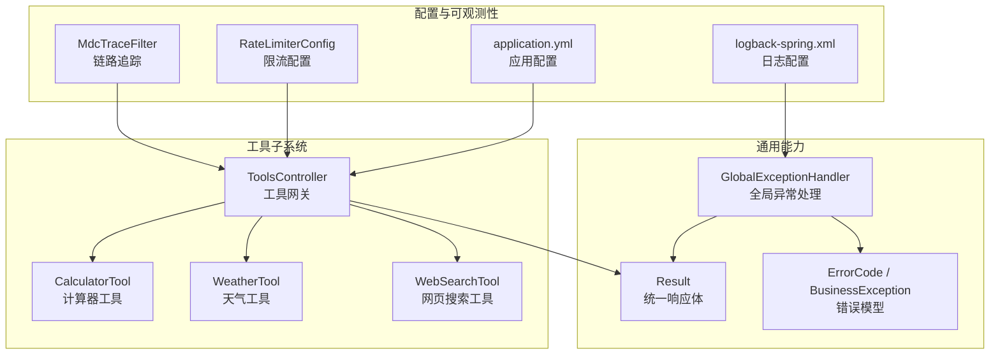
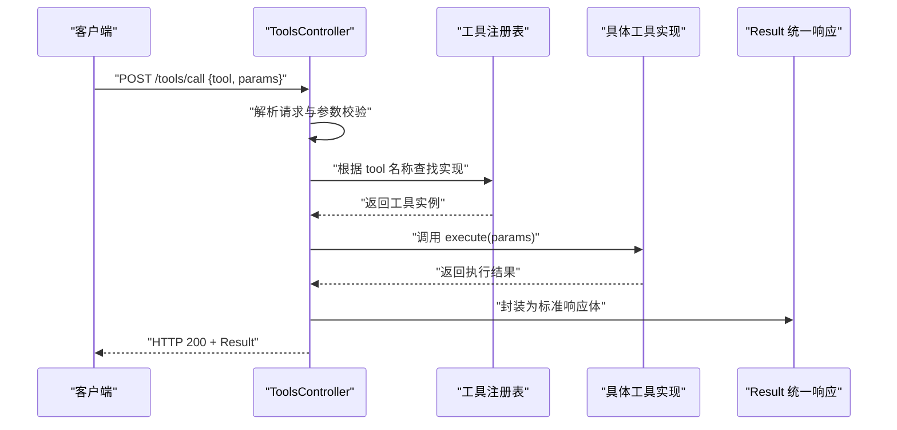
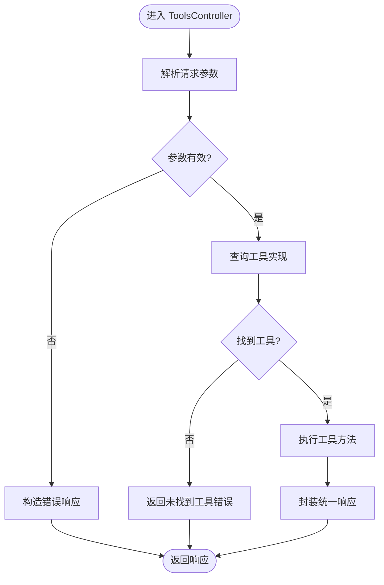
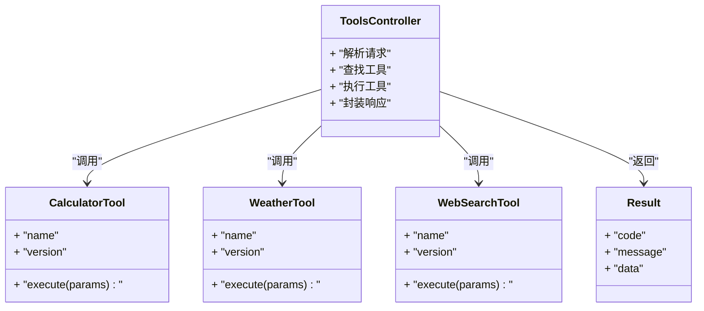
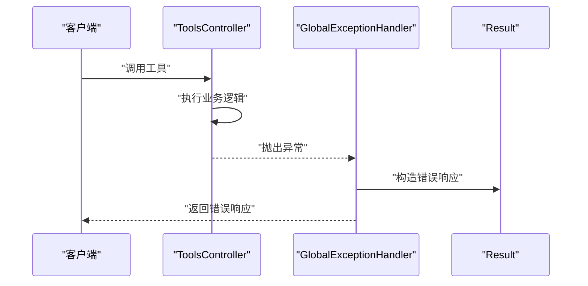
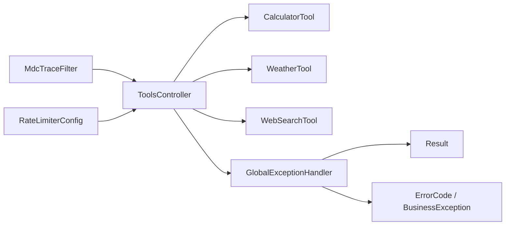

# 工具架构设计

<cite>
**本文引用的文件**   
- [ToolsController.java](file://src/main/java/com/ailearn/tools/ToolsController.java)
- [CalculatorTool.java](file://src/main/java/com/ailearn/tools/CalculatorTool.java)
- [WeatherTool.java](file://src/main/java/com/ailearn/tools/WeatherTool.java)
- [WebSearchTool.java](file://src/main/java/com/ailearn/tools/WebSearchTool.java)
- [GlobalExceptionHandler.java](file://src/main/java/com/ailearn/common/GlobalExceptionHandler.java)
- [Result.java](file://src/main/java/com/ailearn/common/Result.java)
- [ErrorCode.java](file://src/main/java/com/ailearn/common/ErrorCode.java)
- [BusinessException.java](file://src/main/java/com/ailearn/common/BusinessException.java)
- [MdcTraceFilter.java](file://src/main/java/com/ailearn/config/MdcTraceFilter.java)
- [RateLimiterConfig.java](file://src/main/java/com/ailearn/config/RateLimiterConfig.java)
- [application.yml](file://src/main/resources/application.yml)
- [logback-spring.xml](file://src/main/resources/logback-spring.xml)
</cite>

## 目录
1. [简介](#简介)
2. [项目结构](#项目结构)
3. [核心组件](#核心组件)
4. [架构总览](#架构总览)
5. [详细组件分析](#详细组件分析)
6. [依赖关系分析](#依赖关系分析)
7. [性能考虑](#性能考虑)
8. [故障排查指南](#故障排查指南)
9. [结论](#结论)
10. [附录](#附录)

## 简介
本文件面向“工具系统”的架构设计与实现，聚焦以下目标：
- 解释整体架构模式：插件化设计、动态加载机制与路由分发策略。
- 说明 ToolsController 作为工具网关的职责：请求解析、工具发现、参数验证与响应格式化。
- 阐述工具的注册机制、生命周期管理与依赖注入。
- 定义工具接口规范与扩展点。
- 给出错误处理策略、日志记录与性能监控的设计考虑。
- 提供扩展现有工具和新增工具类型的最佳实践。

## 项目结构
工具系统位于后端 Java 模块中，采用分层与按功能域组织的方式：
- 控制器层：ToolsController 作为统一入口，负责工具调用路由。
- 工具实现层：CalculatorTool、WeatherTool、WebSearchTool 等具体工具。
- 通用能力：全局异常处理、统一响应体、业务异常与错误码。
- 配置与可观测性：MDC 链路追踪、限流配置、应用配置与日志输出。

图表来源
- [ToolsController.java](file://src/main/java/com/ailearn/tools/ToolsController.java)
- [CalculatorTool.java](file://src/main/java/com/ailearn/tools/CalculatorTool.java)
- [WeatherTool.java](file://src/main/java/com/ailearn/tools/WeatherTool.java)
- [WebSearchTool.java](file://src/main/java/com/ailearn/tools/WebSearchTool.java)
- [GlobalExceptionHandler.java](file://src/main/java/com/ailearn/common/GlobalExceptionHandler.java)
- [Result.java](file://src/main/java/com/ailearn/common/Result.java)
- [ErrorCode.java](file://src/main/java/com/ailearn/common/ErrorCode.java)
- [BusinessException.java](file://src/main/java/com/ailearn/common/BusinessException.java)
- [MdcTraceFilter.java](file://src/main/java/com/ailearn/config/MdcTraceFilter.java)
- [RateLimiterConfig.java](file://src/main/java/com/ailearn/config/RateLimiterConfig.java)
- [application.yml](file://src/main/resources/application.yml)
- [logback-spring.xml](file://src/main/resources/logback-spring.xml)

章节来源
- [ToolsController.java](file://src/main/java/com/ailearn/tools/ToolsController.java)
- [CalculatorTool.java](file://src/main/java/com/ailearn/tools/CalculatorTool.java)
- [WeatherTool.java](file://src/main/java/com/ailearn/tools/WeatherTool.java)
- [WebSearchTool.java](file://src/main/java/com/ailearn/tools/WebSearchTool.java)
- [GlobalExceptionHandler.java](file://src/main/java/com/ailearn/common/GlobalExceptionHandler.java)
- [Result.java](file://src/main/java/com/ailearn/common/Result.java)
- [ErrorCode.java](file://src/main/java/com/ailearn/common/ErrorCode.java)
- [BusinessException.java](file://src/main/java/com/ailearn/common/BusinessException.java)
- [MdcTraceFilter.java](file://src/main/java/com/ailearn/config/MdcTraceFilter.java)
- [RateLimiterConfig.java](file://src/main/java/com/ailearn/config/RateLimiterConfig.java)
- [application.yml](file://src/main/resources/application.yml)
- [logback-spring.xml](file://src/main/resources/logback-spring.xml)

## 核心组件
- 工具网关（ToolsController）
  - 职责：接收外部调用、解析请求、定位工具、执行并返回统一格式结果。
  - 关键流程：路径或参数驱动的工具发现；入参校验；调用工具；包装响应；异常捕获与转换。
- 工具实现（CalculatorTool、WeatherTool、WebSearchTool）
  - 职责：实现具体业务能力，遵循统一的工具接口契约。
  - 关注点：输入参数校验、外部依赖访问、错误抛出与日志记录。
- 通用能力
  - 统一响应体（Result）：对外暴露一致的数据结构。
  - 全局异常处理（GlobalExceptionHandler）：将异常转换为标准错误响应。
  - 错误模型（ErrorCode、BusinessException）：标准化错误码与业务异常。
- 配置与可观测性
  - 链路追踪（MdcTraceFilter）：为每次请求生成并透传 traceId。
  - 限流（RateLimiterConfig）：保护工具网关与下游服务。
  - 应用配置（application.yml）：工具开关、超时、重试等。
  - 日志（logback-spring.xml）：结构化输出、分级控制、采样策略。

章节来源
- [ToolsController.java](file://src/main/java/com/ailearn/tools/ToolsController.java)
- [CalculatorTool.java](file://src/main/java/com/ailearn/tools/CalculatorTool.java)
- [WeatherTool.java](file://src/main/java/com/ailearn/tools/WeatherTool.java)
- [WebSearchTool.java](file://src/main/java/com/ailearn/tools/WebSearchTool.java)
- [GlobalExceptionHandler.java](file://src/main/java/com/ailearn/common/GlobalExceptionHandler.java)
- [Result.java](file://src/main/java/com/ailearn/common/Result.java)
- [ErrorCode.java](file://src/main/java/com/ailearn/common/ErrorCode.java)
- [BusinessException.java](file://src/main/java/com/ailearn/common/BusinessException.java)
- [MdcTraceFilter.java](file://src/main/java/com/ailearn/config/MdcTraceFilter.java)
- [RateLimiterConfig.java](file://src/main/java/com/ailearn/config/RateLimiterConfig.java)
- [application.yml](file://src/main/resources/application.yml)
- [logback-spring.xml](file://src/main/resources/logback-spring.xml)

## 架构总览
工具系统采用“网关 + 插件化工具”的架构模式：
- 插件化设计：每个工具以独立类实现，通过约定或注解进行注册，便于热插拔与按需启用。
- 动态加载机制：启动期扫描工具实现并注册到工具目录；运行期根据请求中的工具标识快速查找。
- 路由分发策略：基于路径或参数映射到具体工具实例，支持版本化与别名。

图表来源
- [ToolsController.java](file://src/main/java/com/ailearn/tools/ToolsController.java)
- [CalculatorTool.java](file://src/main/java/com/ailearn/tools/CalculatorTool.java)
- [WeatherTool.java](file://src/main/java/com/ailearn/tools/WeatherTool.java)
- [WebSearchTool.java](file://src/main/java/com/ailearn/tools/WebSearchTool.java)
- [Result.java](file://src/main/java/com/ailearn/common/Result.java)

## 详细组件分析

### 工具网关（ToolsController）
- 职责边界
  - 请求解析：从 HTTP 请求中提取工具名与参数。
  - 工具发现：依据工具名在注册表中定位实现。
  - 参数验证：对入参进行基础校验，失败直接返回错误响应。
  - 执行与编排：调用工具并收集耗时、异常等信息。
  - 响应格式化：使用统一响应体包裹成功或失败结果。
- 关键流程
  - 进入网关 -> 解析与校验 -> 查找工具 -> 执行 -> 封装响应 -> 返回。
- 与通用能力的集成
  - 通过全局异常处理器将未捕获异常转为标准错误响应。
  - 通过 MDC 注入 traceId，贯穿日志上下文。
  - 通过限流配置保护高并发场景。

图表来源
- [ToolsController.java](file://src/main/java/com/ailearn/tools/ToolsController.java)
- [GlobalExceptionHandler.java](file://src/main/java/com/ailearn/common/GlobalExceptionHandler.java)
- [Result.java](file://src/main/java/com/ailearn/common/Result.java)

章节来源
- [ToolsController.java](file://src/main/java/com/ailearn/tools/ToolsController.java)
- [GlobalExceptionHandler.java](file://src/main/java/com/ailearn/common/GlobalExceptionHandler.java)
- [Result.java](file://src/main/java/com/ailearn/common/Result.java)

### 工具实现（CalculatorTool、WeatherTool、WebSearchTool）
- 共同契约
  - 提供统一的工具标识（如 name/version）。
  - 定义清晰的输入参数结构与约束。
  - 返回标准化的数据对象或错误信息。
- 差异化职责
  - CalculatorTool：纯计算逻辑，无外部依赖，低延迟。
  - WeatherTool：可能涉及外部天气 API，需处理网络异常与超时。
  - WebSearchTool：可能涉及搜索引擎或爬虫，需关注速率限制与反爬策略。
- 错误与日志
  - 业务异常通过 BusinessException 抛出，携带 ErrorCode。
  - 关键步骤记录结构化日志，包含 traceId、耗时与关键指标。

图表来源
- [ToolsController.java](file://src/main/java/com/ailearn/tools/ToolsController.java)
- [CalculatorTool.java](file://src/main/java/com/ailearn/tools/CalculatorTool.java)
- [WeatherTool.java](file://src/main/java/com/ailearn/tools/WeatherTool.java)
- [WebSearchTool.java](file://src/main/java/com/ailearn/tools/WebSearchTool.java)
- [Result.java](file://src/main/java/com/ailearn/common/Result.java)

章节来源
- [CalculatorTool.java](file://src/main/java/com/ailearn/tools/CalculatorTool.java)
- [WeatherTool.java](file://src/main/java/com/ailearn/tools/WeatherTool.java)
- [WebSearchTool.java](file://src/main/java/com/ailearn/tools/WebSearchTool.java)

### 错误处理与统一响应
- 统一响应体（Result）
  - 所有成功与失败响应均通过 Result 返回，保证前端一致性。
- 全局异常处理（GlobalExceptionHandler）
  - 捕获运行时异常、参数校验异常与业务异常。
  - 将异常转换为标准错误响应，附带错误码与消息。
- 错误模型（ErrorCode、BusinessException）
  - 集中管理错误码，避免硬编码。
  - 业务异常携带上下文信息，便于问题定位。

图表来源
- [GlobalExceptionHandler.java](file://src/main/java/com/ailearn/common/GlobalExceptionHandler.java)
- [Result.java](file://src/main/java/com/ailearn/common/Result.java)
- [ErrorCode.java](file://src/main/java/com/ailearn/common/ErrorCode.java)
- [BusinessException.java](file://src/main/java/com/ailearn/common/BusinessException.java)

章节来源
- [GlobalExceptionHandler.java](file://src/main/java/com/ailearn/common/GlobalExceptionHandler.java)
- [Result.java](file://src/main/java/com/ailearn/common/Result.java)
- [ErrorCode.java](file://src/main/java/com/ailearn/common/ErrorCode.java)
- [BusinessException.java](file://src/main/java/com/ailearn/common/BusinessException.java)

### 配置与可观测性
- 链路追踪（MdcTraceFilter）
  - 为每次请求生成唯一 traceId，写入 MDC，贯穿日志输出。
- 限流（RateLimiterConfig）
  - 针对工具网关或特定接口设置 QPS 上限，防止雪崩。
- 应用配置（application.yml）
  - 工具开关、超时时间、重试次数、外部服务地址等。
- 日志（logback-spring.xml）
  - 结构化 JSON 输出，按级别分离文件，支持采样与滚动策略。

章节来源
- [MdcTraceFilter.java](file://src/main/java/com/ailearn/config/MdcTraceFilter.java)
- [RateLimiterConfig.java](file://src/main/java/com/ailearn/config/RateLimiterConfig.java)
- [application.yml](file://src/main/resources/application.yml)
- [logback-spring.xml](file://src/main/resources/logback-spring.xml)

## 依赖关系分析
- 组件耦合
  - ToolsController 与工具实现之间通过接口契约解耦，降低耦合度。
  - 全局异常处理器与工具实现通过异常类型解耦。
- 外部依赖
  - 天气与搜索工具可能依赖外部 HTTP 服务，需配置超时与重试。
- 潜在循环依赖
  - 当前未见循环导入，保持单向依赖：控制器 -> 工具 -> 外部服务。

图表来源
- [ToolsController.java](file://src/main/java/com/ailearn/tools/ToolsController.java)
- [CalculatorTool.java](file://src/main/java/com/ailearn/tools/CalculatorTool.java)
- [WeatherTool.java](file://src/main/java/com/ailearn/tools/WeatherTool.java)
- [WebSearchTool.java](file://src/main/java/com/ailearn/tools/WebSearchTool.java)
- [GlobalExceptionHandler.java](file://src/main/java/com/ailearn/common/GlobalExceptionHandler.java)
- [Result.java](file://src/main/java/com/ailearn/common/Result.java)
- [ErrorCode.java](file://src/main/java/com/ailearn/common/ErrorCode.java)
- [BusinessException.java](file://src/main/java/com/ailearn/common/BusinessException.java)
- [MdcTraceFilter.java](file://src/main/java/com/ailearn/config/MdcTraceFilter.java)
- [RateLimiterConfig.java](file://src/main/java/com/ailearn/config/RateLimiterConfig.java)

章节来源
- [ToolsController.java](file://src/main/java/com/ailearn/tools/ToolsController.java)
- [CalculatorTool.java](file://src/main/java/com/ailearn/tools/CalculatorTool.java)
- [WeatherTool.java](file://src/main/java/com/ailearn/tools/WeatherTool.java)
- [WebSearchTool.java](file://src/main/java/com/ailearn/tools/WebSearchTool.java)
- [GlobalExceptionHandler.java](file://src/main/java/com/ailearn/common/GlobalExceptionHandler.java)
- [Result.java](file://src/main/java/com/ailearn/common/Result.java)
- [ErrorCode.java](file://src/main/java/com/ailearn/common/ErrorCode.java)
- [BusinessException.java](file://src/main/java/com/ailearn/common/BusinessException.java)
- [MdcTraceFilter.java](file://src/main/java/com/ailearn/config/MdcTraceFilter.java)
- [RateLimiterConfig.java](file://src/main/java/com/ailearn/config/RateLimiterConfig.java)

## 性能考虑
- 路由查找优化
  - 使用哈希表缓存工具实例，O(1) 查找，避免反射开销。
- 参数校验前置
  - 在网关层尽早拒绝非法请求，减少无效调用。
- 外部调用保护
  - 设置合理的超时与重试策略，避免级联失败。
- 限流与熔断
  - 结合 RateLimiter 与熔断器，保障系统稳定性。
- 日志采样
  - 在高吞吐场景下开启日志采样，降低 I/O 压力。

[本节为通用指导，不直接分析具体文件]

## 故障排查指南
- 常见问题
  - 工具未找到：检查工具名是否正确、是否已注册。
  - 参数校验失败：核对入参结构与必填字段。
  - 外部服务不可用：查看网络连通性与鉴权配置。
- 定位手段
  - 使用 traceId 串联日志，快速定位请求链路。
  - 查看全局异常处理器输出的错误码与消息。
  - 检查限流与熔断状态，确认是否被保护策略拦截。
- 改进建议
  - 增加工具健康检查端点，提前发现异常。
  - 完善错误码文档，提升排障效率。

章节来源
- [GlobalExceptionHandler.java](file://src/main/java/com/ailearn/common/GlobalExceptionHandler.java)
- [ErrorCode.java](file://src/main/java/com/ailearn/common/ErrorCode.java)
- [BusinessException.java](file://src/main/java/com/ailearn/common/BusinessException.java)
- [MdcTraceFilter.java](file://src/main/java/com/ailearn/config/MdcTraceFilter.java)
- [RateLimiterConfig.java](file://src/main/java/com/ailearn/config/RateLimiterConfig.java)

## 结论
本工具系统通过网关统一入口、插件化工具实现与完善的错误处理与可观测性，实现了高内聚、低耦合与可扩展的架构。后续可在工具注册中心、版本治理、灰度发布与指标采集方面持续演进，进一步提升系统的可靠性与可维护性。

[本节为总结性内容，不直接分析具体文件]

## 附录

### 工具接口规范与扩展点
- 工具标识
  - name：工具唯一标识，用于路由与发现。
  - version：工具版本，支持多版本并存与灰度。
- 输入参数
  - 明确字段名、类型、必填与默认值。
  - 提供参数校验规则（范围、格式、长度等）。
- 输出数据
  - 使用统一数据结构，包含必要字段与可选扩展字段。
- 错误约定
  - 使用标准错误码与消息，必要时附加上下文信息。
- 扩展点
  - 新增工具：实现工具接口并在启动期注册。
  - 工具钩子：在执行前后插入横切逻辑（如审计、埋点）。
  - 配置开关：通过 application.yml 控制工具启用与行为。

[本节为概念性说明，不直接分析具体文件]

### 最佳实践
- 扩展现有工具
  - 保持向后兼容，新增字段时提供默认值。
  - 通过版本化逐步迁移旧客户端。
- 添加新工具类型
  - 定义清晰的能力边界与输入输出契约。
  - 编写单元测试与集成测试，覆盖正常与异常路径。
  - 接入链路追踪与指标上报，确保可观测性。
- 安全与合规
  - 对敏感参数进行脱敏与加密传输。
  - 对第三方调用进行鉴权与速率限制。

[本节为通用指导，不直接分析具体文件]