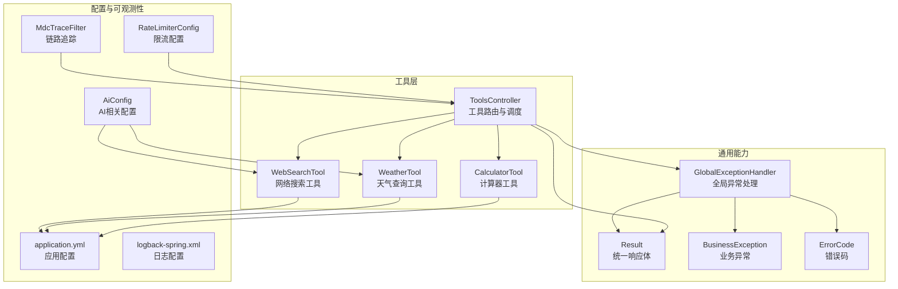
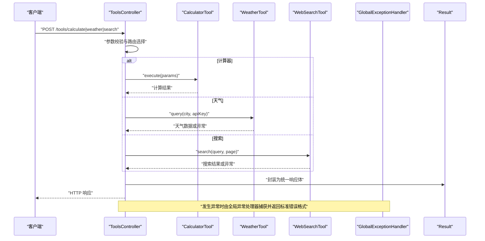
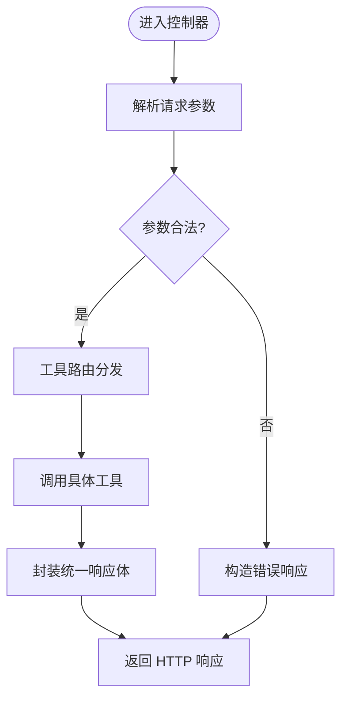
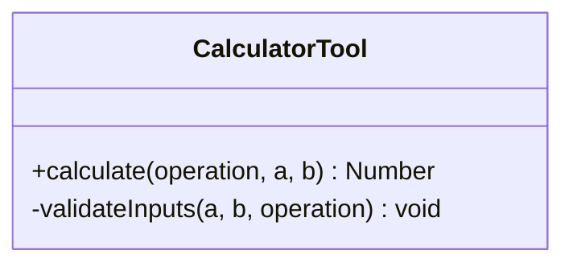
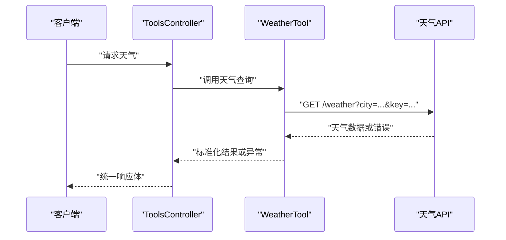
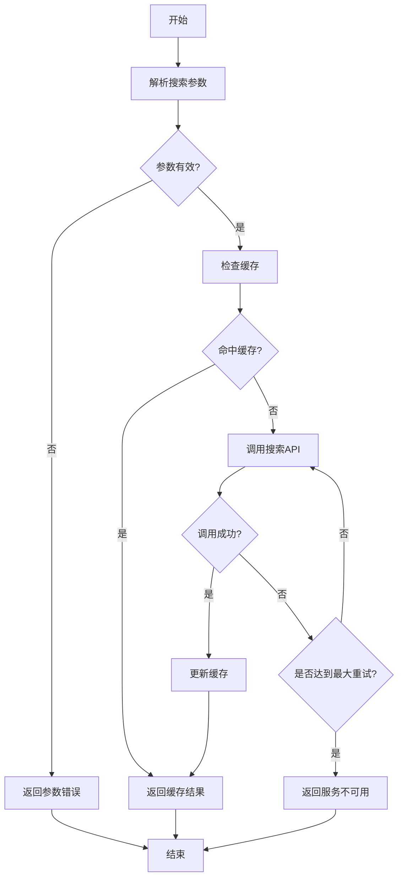
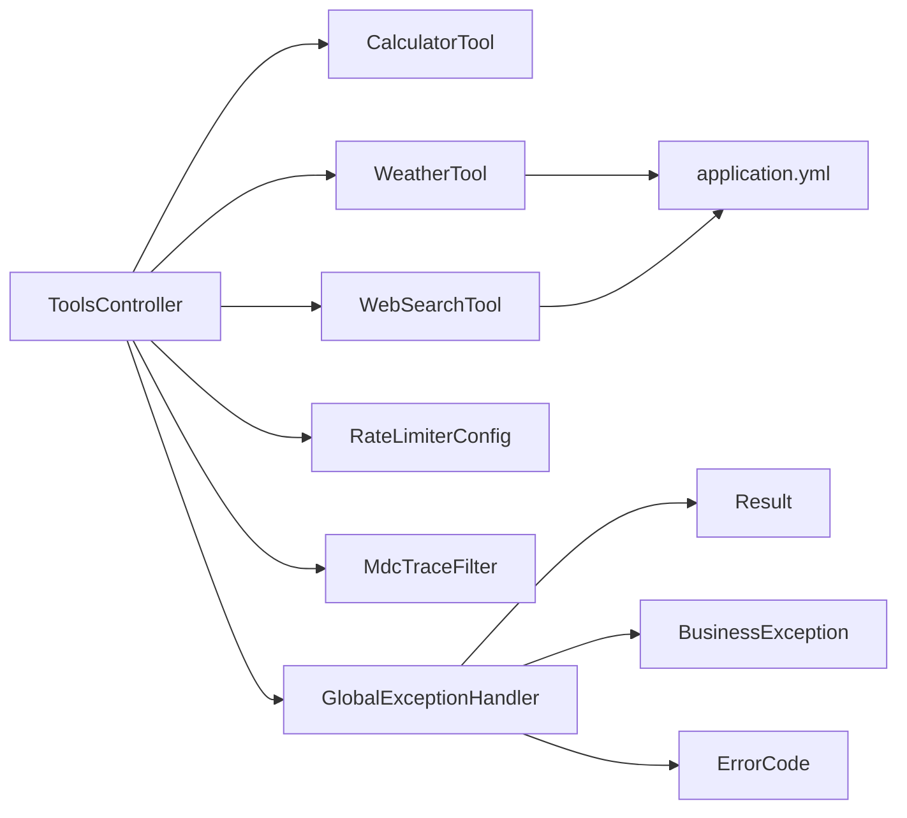

# 工具系统

<cite>
**本文引用的文件**   
- [ToolsController.java](file://src/main/java/com/ailearn/tools/ToolsController.java)
- [CalculatorTool.java](file://src/main/java/com/ailearn/tools/CalculatorTool.java)
- [WeatherTool.java](file://src/main/java/com/ailearn/tools/WeatherTool.java)
- [WebSearchTool.java](file://src/main/java/com/ailearn/tools/WebSearchTool.java)
- [application.yml](file://src/main/resources/application.yml)
- [logback-spring.xml](file://src/main/resources/logback-spring.xml)
- [GlobalExceptionHandler.java](file://src/main/java/com/ailearn/common/GlobalExceptionHandler.java)
- [Result.java](file://src/main/java/com/ailearn/common/Result.java)
- [BusinessException.java](file://src/main/java/com/ailearn/common/BusinessException.java)
- [ErrorCode.java](file://src/main/java/com/ailearn/common/ErrorCode.java)
- [RateLimiterConfig.java](file://src/main/java/com/ailearn/config/RateLimiterConfig.java)
- [MdcTraceFilter.java](file://src/main/java/com/ailearn/config/MdcTraceFilter.java)
- [AiConfig.java](file://src/main/java/com/ailearn/config/AiConfig.java)
- [CalculatorToolTest.java](file://src/test/java/com/ailearn/tools/CalculatorToolTest.java)
- [WeatherToolTest.java](file://src/test/java/com/ailearn/tools/WeatherToolTest.java)
</cite>

## 目录
1. [简介](#简介)
2. [项目结构](#项目结构)
3. [核心组件](#核心组件)
4. [架构总览](#架构总览)
5. [详细组件分析](#详细组件分析)
6. [依赖关系分析](#依赖关系分析)
7. [性能考量](#性能考量)
8. [故障排查指南](#故障排查指南)
9. [结论](#结论)
10. [附录](#附录)

## 简介
本文件面向“工具系统”的架构与实现，聚焦以下目标：
- 解释工具架构的设计模式与插件化机制
- 深入说明内置工具的实现原理（计算器、天气查询、网络搜索）
- 解析 ToolsController 的工具路由分发与调用管理
- 提供每个工具的 API 接口文档与参数说明
- 说明工具的注册、发现与动态加载机制
- 覆盖外部 API 调用的错误处理、超时控制与重试策略
- 指导如何开发自定义工具并集成到系统中
- 给出工具性能监控与日志记录的最佳实践

## 项目结构
工具系统位于后端模块的 tools 包中，包含控制器与若干具体工具实现；配置与通用能力由 config 与 common 包提供。测试用例位于 test 目录对应包下。

图表来源
- [ToolsController.java](file://src/main/java/com/ailearn/tools/ToolsController.java)
- [CalculatorTool.java](file://src/main/java/com/ailearn/tools/CalculatorTool.java)
- [WeatherTool.java](file://src/main/java/com/ailearn/tools/WeatherTool.java)
- [WebSearchTool.java](file://src/main/java/com/ailearn/tools/WebSearchTool.java)
- [GlobalExceptionHandler.java](file://src/main/java/com/ailearn/common/GlobalExceptionHandler.java)
- [Result.java](file://src/main/java/com/ailearn/common/Result.java)
- [BusinessException.java](file://src/main/java/com/ailearn/common/BusinessException.java)
- [ErrorCode.java](file://src/main/java/com/ailearn/common/ErrorCode.java)
- [RateLimiterConfig.java](file://src/main/java/com/ailearn/config/RateLimiterConfig.java)
- [MdcTraceFilter.java](file://src/main/java/com/ailearn/config/MdcTraceFilter.java)
- [AiConfig.java](file://src/main/java/com/ailearn/config/AiConfig.java)
- [application.yml](file://src/main/resources/application.yml)
- [logback-spring.xml](file://src/main/resources/logback-spring.xml)

章节来源
- [ToolsController.java](file://src/main/java/com/ailearn/tools/ToolsController.java)
- [CalculatorTool.java](file://src/main/java/com/ailearn/tools/CalculatorTool.java)
- [WeatherTool.java](file://src/main/java/com/ailearn/tools/WeatherTool.java)
- [WebSearchTool.java](file://src/main/java/com/ailearn/tools/WebSearchTool.java)
- [application.yml](file://src/main/resources/application.yml)
- [logback-spring.xml](file://src/main/resources/logback-spring.xml)
- [GlobalExceptionHandler.java](file://src/main/java/com/ailearn/common/GlobalExceptionHandler.java)
- [Result.java](file://src/main/java/com/ailearn/common/Result.java)
- [BusinessException.java](file://src/main/java/com/ailearn/common/BusinessException.java)
- [ErrorCode.java](file://src/main/java/com/ailearn/common/ErrorCode.java)
- [RateLimiterConfig.java](file://src/main/java/com/ailearn/config/RateLimiterConfig.java)
- [MdcTraceFilter.java](file://src/main/java/com/ailearn/config/MdcTraceFilter.java)
- [AiConfig.java](file://src/main/java/com/ailearn/config/AiConfig.java)

## 核心组件
- 工具控制器（ToolsController）
  - 职责：接收前端请求，按工具名路由到具体工具执行器，封装统一响应体 Result，配合全局异常处理器返回标准错误格式。
  - 关键流程：参数校验 → 工具选择 → 调用工具 → 包装结果 → 返回。
- 计算器工具（CalculatorTool）
  - 职责：执行基础数学运算（加、减、乘、除等），对输入进行合法性校验，返回计算结果。
- 天气查询工具（WeatherTool）
  - 职责：通过外部天气 API 获取天气信息，支持从配置读取密钥与超时设置，对网络异常与业务异常进行统一处理。
- 网络搜索工具（WebSearchTool）
  - 职责：调用搜索引擎或聚合服务获取搜索结果，支持分页与关键词过滤，具备超时与重试策略。

章节来源
- [ToolsController.java](file://src/main/java/com/ailearn/tools/ToolsController.java)
- [CalculatorTool.java](file://src/main/java/com/ailearn/tools/CalculatorTool.java)
- [WeatherTool.java](file://src/main/java/com/ailearn/tools/WeatherTool.java)
- [WebSearchTool.java](file://src/main/java/com/ailearn/tools/WebSearchTool.java)

## 架构总览
工具系统采用“控制器 + 工具实现”的分层设计，结合 Spring 的依赖注入与配置中心，实现工具的可插拔扩展。整体数据流如下：

图表来源
- [ToolsController.java](file://src/main/java/com/ailearn/tools/ToolsController.java)
- [CalculatorTool.java](file://src/main/java/com/ailearn/tools/CalculatorTool.java)
- [WeatherTool.java](file://src/main/java/com/ailearn/tools/WeatherTool.java)
- [WebSearchTool.java](file://src/main/java/com/ailearn/tools/WebSearchTool.java)
- [GlobalExceptionHandler.java](file://src/main/java/com/ailearn/common/GlobalExceptionHandler.java)
- [Result.java](file://src/main/java/com/ailearn/common/Result.java)

## 详细组件分析

### 工具控制器（ToolsController）
- 功能要点
  - 路由分发：根据路径或参数选择具体工具实现
  - 参数校验：对入参进行必要校验，避免非法输入导致下游异常
  - 结果封装：使用统一响应体 Result 包裹成功或失败结果
  - 异常协同：与全局异常处理器协作，保证错误响应一致性
- 调用时序
  - 接收请求 → 解析参数 → 选择工具 → 执行业务逻辑 → 封装响应 → 返回
- 可观测性与保护
  - 通过 MDC 过滤器注入链路追踪 ID，便于日志关联
  - 通过限流配置限制高频调用，防止资源耗尽

图表来源
- [ToolsController.java](file://src/main/java/com/ailearn/tools/ToolsController.java)
- [MdcTraceFilter.java](file://src/main/java/com/ailearn/config/MdcTraceFilter.java)
- [RateLimiterConfig.java](file://src/main/java/com/ailearn/config/RateLimiterConfig.java)
- [Result.java](file://src/main/java/com/ailearn/common/Result.java)

章节来源
- [ToolsController.java](file://src/main/java/com/ailearn/tools/ToolsController.java)
- [MdcTraceFilter.java](file://src/main/java/com/ailearn/config/MdcTraceFilter.java)
- [RateLimiterConfig.java](file://src/main/java/com/ailearn/config/RateLimiterConfig.java)
- [Result.java](file://src/main/java/com/ailearn/common/Result.java)

### 计算器工具（CalculatorTool）
- 功能要点
  - 支持基础算术运算（加、减、乘、除）
  - 对除零、非法运算符、数值越界等进行校验
  - 返回精确的计算结果
- 复杂度与性能
  - 时间复杂度 O(1)，空间复杂度 O(1)
  - 无 I/O 操作，适合高并发场景
- 单元测试
  - 提供边界值与异常路径测试，确保健壮性

图表来源
- [CalculatorTool.java](file://src/main/java/com/ailearn/tools/CalculatorTool.java)
- [CalculatorToolTest.java](file://src/test/java/com/ailearn/tools/CalculatorToolTest.java)

章节来源
- [CalculatorTool.java](file://src/main/java/com/ailearn/tools/CalculatorTool.java)
- [CalculatorToolTest.java](file://src/test/java/com/ailearn/tools/CalculatorToolTest.java)

### 天气查询工具（WeatherTool）
- 功能要点
  - 通过外部天气 API 获取指定城市的天气信息
  - 从配置读取 API Key、超时时间与重试次数
  - 对网络异常、超时、业务错误码进行统一处理
- 外部集成
  - 使用配置项（如 baseUrl、apiKey、timeout）驱动行为
  - 遵循统一的错误码体系，便于上层处理
- 可靠性
  - 支持超时控制与有限次重试，避免雪崩
  - 对上游服务的降级策略（如缓存最近一次成功结果）可按需扩展

图表来源
- [WeatherTool.java](file://src/main/java/com/ailearn/tools/WeatherTool.java)
- [application.yml](file://src/main/resources/application.yml)
- [AiConfig.java](file://src/main/java/com/ailearn/config/AiConfig.java)

章节来源
- [WeatherTool.java](file://src/main/java/com/ailearn/tools/WeatherTool.java)
- [application.yml](file://src/main/resources/application.yml)
- [AiConfig.java](file://src/main/java/com/ailearn/config/AiConfig.java)
- [WeatherToolTest.java](file://src/test/java/com/ailearn/tools/WeatherToolTest.java)

### 网络搜索工具（WebSearchTool）
- 功能要点
  - 调用搜索引擎或聚合服务获取搜索结果
  - 支持分页、关键词过滤与结果排序
  - 具备超时控制与重试策略，保障稳定性
- 外部集成
  - 通过配置项管理端点、鉴权与速率限制
  - 将第三方错误码映射为内部 ErrorCode
- 可扩展性
  - 可通过策略模式切换不同搜索供应商
  - 支持结果缓存以提升热点查询性能

图表来源
- [WebSearchTool.java](file://src/main/java/com/ailearn/tools/WebSearchTool.java)
- [application.yml](file://src/main/resources/application.yml)

章节来源
- [WebSearchTool.java](file://src/main/java/com/ailearn/tools/WebSearchTool.java)
- [application.yml](file://src/main/resources/application.yml)

## 依赖关系分析
- 组件耦合
  - ToolsController 与具体工具松耦合，通过方法名或注解进行路由选择
  - 工具实现仅依赖配置与必要的网络库，不直接依赖控制器
- 外部依赖
  - 天气与搜索工具依赖外部 API，需关注可用性、配额与成本
- 配置与可观测性
  - application.yml 集中管理外部端点、鉴权与超时
  - logback-spring.xml 定义日志级别与输出格式
  - MDC 过滤器为每次请求注入追踪 ID，便于问题定位
  - RateLimiterConfig 提供限流保护

图表来源
- [ToolsController.java](file://src/main/java/com/ailearn/tools/ToolsController.java)
- [CalculatorTool.java](file://src/main/java/com/ailearn/tools/CalculatorTool.java)
- [WeatherTool.java](file://src/main/java/com/ailearn/tools/WeatherTool.java)
- [WebSearchTool.java](file://src/main/java/com/ailearn/tools/WebSearchTool.java)
- [application.yml](file://src/main/resources/application.yml)
- [RateLimiterConfig.java](file://src/main/java/com/ailearn/config/RateLimiterConfig.java)
- [MdcTraceFilter.java](file://src/main/java/com/ailearn/config/MdcTraceFilter.java)
- [GlobalExceptionHandler.java](file://src/main/java/com/ailearn/common/GlobalExceptionHandler.java)
- [Result.java](file://src/main/java/com/ailearn/common/Result.java)
- [BusinessException.java](file://src/main/java/com/ailearn/common/BusinessException.java)
- [ErrorCode.java](file://src/main/java/com/ailearn/common/ErrorCode.java)

章节来源
- [ToolsController.java](file://src/main/java/com/ailearn/tools/ToolsController.java)
- [CalculatorTool.java](file://src/main/java/com/ailearn/tools/CalculatorTool.java)
- [WeatherTool.java](file://src/main/java/com/ailearn/tools/WeatherTool.java)
- [WebSearchTool.java](file://src/main/java/com/ailearn/tools/WebSearchTool.java)
- [application.yml](file://src/main/resources/application.yml)
- [RateLimiterConfig.java](file://src/main/java/com/ailearn/config/RateLimiterConfig.java)
- [MdcTraceFilter.java](file://src/main/java/com/ailearn/config/MdcTraceFilter.java)
- [GlobalExceptionHandler.java](file://src/main/java/com/ailearn/common/GlobalExceptionHandler.java)
- [Result.java](file://src/main/java/com/ailearn/common/Result.java)
- [BusinessException.java](file://src/main/java/com/ailearn/common/BusinessException.java)
- [ErrorCode.java](file://src/main/java/com/ailearn/common/ErrorCode.java)

## 性能考量
- 计算器工具
  - CPU 密集度低，适合高并发；注意浮点精度与溢出处理
- 天气与搜索工具
  - 网络 I/O 为主，建议启用连接池、合理设置超时与重试
  - 引入本地缓存减少重复请求，提升热点查询性能
  - 使用限流与熔断策略保护自身与下游服务
- 可观测性
  - 通过 MDC 注入链路 ID，结合结构化日志进行全链路追踪
  - 暴露关键指标（QPS、延迟、错误率）用于监控告警

[本节为通用性能建议，无需特定文件引用]

## 故障排查指南
- 统一错误处理
  - GlobalExceptionHandler 捕获运行时异常与业务异常，返回标准错误码与消息
  - BusinessException 与 ErrorCode 提供清晰的错误分类与提示
- 常见错误
  - 参数校验失败：检查入参类型、范围与必填字段
  - 外部 API 超时：调整超时配置与重试策略，检查网络连通性
  - 限流触发：降低请求频率或提高限流阈值
- 日志定位
  - 使用 MDC 中的链路 ID 在日志中快速定位问题
  - 调整 logback 配置以输出更详细的上下文信息

章节来源
- [GlobalExceptionHandler.java](file://src/main/java/com/ailearn/common/GlobalExceptionHandler.java)
- [BusinessException.java](file://src/main/java/com/ailearn/common/BusinessException.java)
- [ErrorCode.java](file://src/main/java/com/ailearn/common/ErrorCode.java)
- [MdcTraceFilter.java](file://src/main/java/com/ailearn/config/MdcTraceFilter.java)
- [logback-spring.xml](file://src/main/resources/logback-spring.xml)

## 结论
工具系统通过控制器与工具实现的解耦设计，实现了良好的可扩展性与可维护性。内置工具覆盖了常用场景，并通过配置与可观测性能力提升了系统的稳定性与可运维性。建议在后续迭代中完善工具注册与发现机制、增加更多外部服务集成，并持续优化性能与监控能力。

[本节为总结性内容，无需特定文件引用]

## 附录

### API 接口文档与参数说明
- 计算器
  - 路径与方法：POST /tools/calculate
  - 请求参数
    - operation：字符串，取值包括 add、sub、mul、div
    - a：数字，左操作数
    - b：数字，右操作数
  - 响应体：统一 Result 对象，包含状态码、消息与数据
  - 错误码：参数非法、除零、不支持的操作符
- 天气查询
  - 路径与方法：POST /tools/weather
  - 请求参数
    - city：字符串，城市名称
    - apiKey：字符串，天气服务密钥（也可从配置读取）
  - 响应体：统一 Result 对象，包含天气信息与元数据
  - 错误码：网络异常、超时、服务不可用、鉴权失败
- 网络搜索
  - 路径与方法：POST /tools/search
  - 请求参数
    - query：字符串，搜索关键词
    - page：整数，页码
    - size：整数，每页条数
  - 响应体：统一 Result 对象，包含搜索结果列表与分页信息
  - 错误码：参数非法、网络异常、超时、服务不可用

章节来源
- [ToolsController.java](file://src/main/java/com/ailearn/tools/ToolsController.java)
- [CalculatorTool.java](file://src/main/java/com/ailearn/tools/CalculatorTool.java)
- [WeatherTool.java](file://src/main/java/com/ailearn/tools/WeatherTool.java)
- [WebSearchTool.java](file://src/main/java/com/ailearn/tools/WebSearchTool.java)
- [Result.java](file://src/main/java/com/ailearn/common/Result.java)

### 工具注册、发现与动态加载机制
- 当前实现
  - 控制器内通过条件分支或映射表选择工具实现，属于静态注册方式
- 改进建议
  - 引入工具接口与工厂模式，基于注解或 SPI 自动扫描并注册工具
  - 使用配置中心或数据库维护工具清单，支持运行时启停与热更新
  - 增加工具版本管理与兼容性校验，避免升级破坏

[本节为概念性说明，无需特定文件引用]

### 外部 API 调用的错误处理、超时控制与重试策略
- 错误处理
  - 将第三方错误码映射为内部 ErrorCode，统一返回给上层
  - 区分网络异常、超时与业务错误，分别采取不同恢复策略
- 超时控制
  - 通过 application.yml 或 AiConfig 配置连接与读取超时
  - 针对慢查询设置独立超时阈值，避免阻塞线程池
- 重试策略
  - 对幂等操作实施指数退避重试，限制最大重试次数
  - 对非幂等操作禁止自动重试，改为人工补偿或异步任务

章节来源
- [application.yml](file://src/main/resources/application.yml)
- [AiConfig.java](file://src/main/java/com/ailearn/config/AiConfig.java)
- [WeatherTool.java](file://src/main/java/com/ailearn/tools/WeatherTool.java)
- [WebSearchTool.java](file://src/main/java/com/ailearn/tools/WebSearchTool.java)

### 开发自定义工具并集成到系统
- 步骤概览
  - 新建工具类，实现统一的方法签名与错误处理
  - 在控制器中添加路由映射，或将工具纳入自动注册机制
  - 在配置文件中添加该工具所需的参数与端点
  - 编写单元测试，覆盖正常与异常路径
- 最佳实践
  - 保持工具无状态，便于水平扩展
  - 使用配置项管理敏感信息与外部依赖
  - 输出结构化日志，包含链路 ID 与关键参数

[本节为概念性说明，无需特定文件引用]

### 工具性能监控与日志记录最佳实践
- 监控指标
  - QPS、P95/P99 延迟、错误率、重试次数、缓存命中率
- 日志规范
  - 使用 MDC 注入链路 ID，统一日志格式
  - 记录关键入参与出参（脱敏），避免泄露敏感信息
  - 对异常堆栈与上下文信息进行分级输出
- 配置参考
  - logback-spring.xml 定义输出目标与滚动策略
  - application.yml 控制日志级别与采样率

章节来源
- [logback-spring.xml](file://src/main/resources/logback-spring.xml)
- [MdcTraceFilter.java](file://src/main/java/com/ailearn/config/MdcTraceFilter.java)
- [application.yml](file://src/main/resources/application.yml)