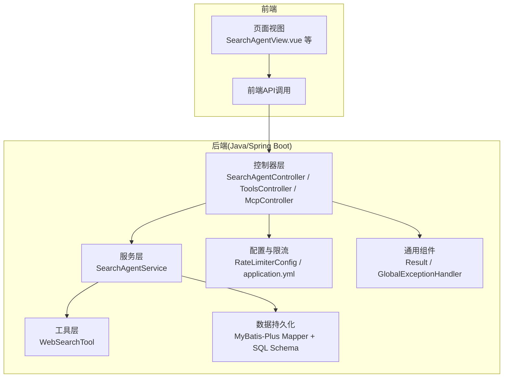
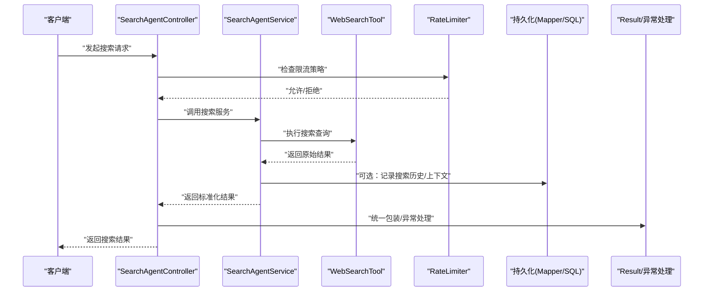
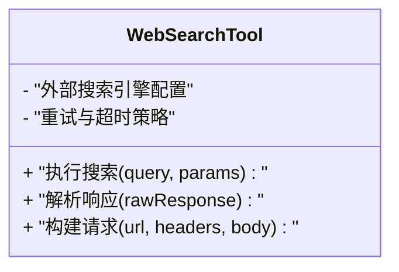
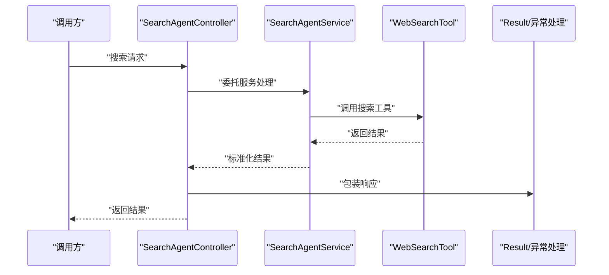
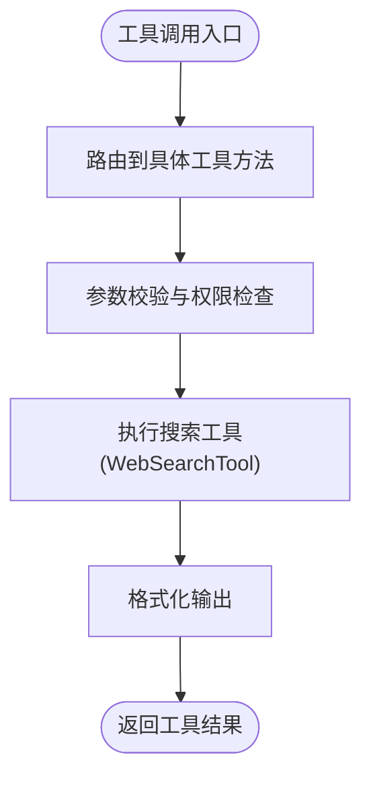
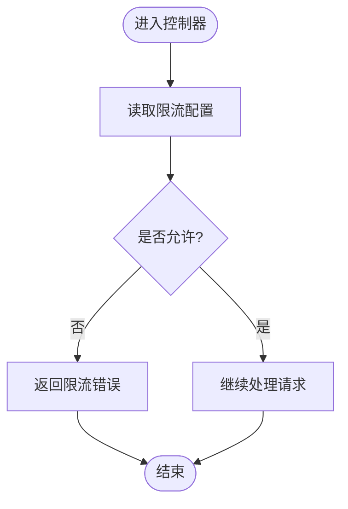
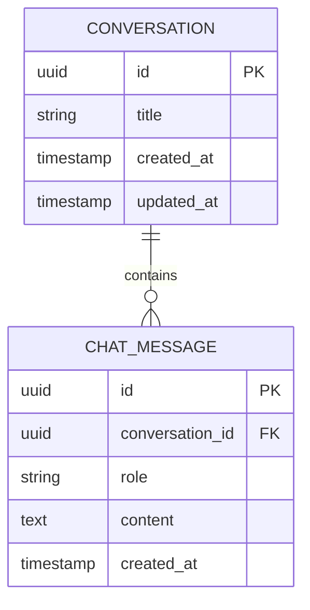
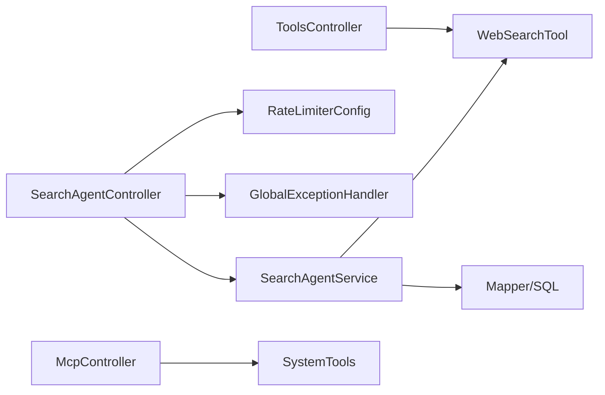

# 网络搜索工具

<cite>
**本文引用的文件**   
- [WebSearchTool.java](file://src/main/java/com/ailearn/tools/WebSearchTool.java)
- [SearchAgentController.java](file://src/main/java/com/ailearn/agent/SearchAgentController.java)
- [SearchAgentService.java](file://src/main/java/com/ailearn/agent/SearchAgentService.java)
- [ToolsController.java](file://src/main/java/com/ailearn/tools/ToolsController.java)
- [RateLimiterConfig.java](file://src/main/java/com/ailearn/config/RateLimiterConfig.java)
- [application.yml](file://src/main/resources/application.yml)
- [schema.sql](file://src/main/resources/schema.sql)
- [ChatMessage.java](file://src/main/java/com/ailearn/entity/ChatMessage.java)
- [ConversationMapper.java](file://src/main/java/com/ailearn/mapper/ConversationMapper.java)
- [ChatMessageMapper.java](file://src/main/java/com/ailearn/mapper/ChatMessageMapper.java)
- [GlobalExceptionHandler.java](file://src/main/java/com/ailearn/common/GlobalExceptionHandler.java)
- [Result.java](file://src/main/java/com/ailearn/common/Result.java)
- [McpController.java](file://src/main/java/com/ailearn/mcp/McpController.java)
- [SystemTools.java](file://src/main/java/com/ailearn/mcp/SystemTools.java)
</cite>

## 目录
1. [简介](#简介)
2. [项目结构](#项目结构)
3. [核心组件](#核心组件)
4. [架构总览](#架构总览)
5. [详细组件分析](#详细组件分析)
6. [依赖关系分析](#依赖关系分析)
7. [性能与可扩展性](#性能与可扩展性)
8. [故障排查指南](#故障排查指南)
9. [结论](#结论)
10. [附录](#附录)

## 简介
本文件面向“网络搜索工具”的实现文档，围绕搜索引擎API集成、多引擎适配层与统一查询接口、结果清洗去重排序、关键词优化与语义理解、分页与缓存、反爬与限流、质量评估与相关性评分、可视化与导出、以及搜索历史与用户偏好学习等主题进行系统化说明。文档基于仓库中现有代码进行分析，并在必要处给出扩展建议与最佳实践。

## 项目结构
本项目采用前后端分离的Spring Boot应用：
- 后端提供统一的搜索能力（通过工具与Agent暴露），并内置限流、异常处理、持久化等基础能力。
- 前端提供对话式界面与视图，便于交互式搜索体验。

图表来源
- [SearchAgentController.java](file://src/main/java/com/ailearn/agent/SearchAgentController.java)
- [SearchAgentService.java](file://src/main/java/com/ailearn/agent/SearchAgentService.java)
- [WebSearchTool.java](file://src/main/java/com/ailearn/tools/WebSearchTool.java)
- [RateLimiterConfig.java](file://src/main/java/com/ailearn/config/RateLimiterConfig.java)
- [application.yml](file://src/main/resources/application.yml)
- [schema.sql](file://src/main/resources/schema.sql)
- [ChatMessage.java](file://src/main/java/com/ailearn/entity/ChatMessage.java)
- [ConversationMapper.java](file://src/main/java/com/ailearn/mapper/ConversationMapper.java)
- [ChatMessageMapper.java](file://src/main/java/com/ailearn/mapper/ChatMessageMapper.java)
- [GlobalExceptionHandler.java](file://src/main/java/com/ailearn/common/GlobalExceptionHandler.java)
- [Result.java](file://src/main/java/com/ailearn/common/Result.java)
- [ToolsController.java](file://src/main/java/com/ailearn/tools/ToolsController.java)
- [McpController.java](file://src/main/java/com/ailearn/mcp/McpController.java)
- [SystemTools.java](file://src/main/java/com/ailearn/mcp/SystemTools.java)

章节来源
- [SearchAgentController.java](file://src/main/java/com/ailearn/agent/SearchAgentController.java)
- [SearchAgentService.java](file://src/main/java/com/ailearn/agent/SearchAgentService.java)
- [WebSearchTool.java](file://src/main/java/com/ailearn/tools/WebSearchTool.java)
- [RateLimiterConfig.java](file://src/main/java/com/ailearn/config/RateLimiterConfig.java)
- [application.yml](file://src/main/resources/application.yml)
- [schema.sql](file://src/main/resources/schema.sql)
- [ChatMessage.java](file://src/main/java/com/ailearn/entity/ChatMessage.java)
- [ConversationMapper.java](file://src/main/java/com/ailearn/mapper/ConversationMapper.java)
- [ChatMessageMapper.java](file://src/main/java/com/ailearn/mapper/ChatMessageMapper.java)
- [GlobalExceptionHandler.java](file://src/main/java/com/ailearn/common/GlobalExceptionHandler.java)
- [Result.java](file://src/main/java/com/ailearn/common/Result.java)
- [ToolsController.java](file://src/main/java/com/ailearn/tools/ToolsController.java)
- [McpController.java](file://src/main/java/com/ailearn/mcp/McpController.java)
- [SystemTools.java](file://src/main/java/com/ailearn/mcp/SystemTools.java)

## 核心组件
- 搜索工具 WebSearchTool：封装对外部搜索引擎的访问逻辑，作为统一查询入口的基础实现。
- Agent 控制器与服务 SearchAgentController/SearchAgentService：提供面向Agent的搜索编排能力，协调工具调用与上下文管理。
- 工具控制器 ToolsController：将搜索能力以工具形式暴露给外部系统或Agent框架。
- MCP 控制器与系统工具 McpController/SystemTools：在MCP协议下注册与调度搜索相关工具。
- 限流配置 RateLimiterConfig 与应用配置 application.yml：控制请求频率与全局参数。
- 持久化 schema.sql 与实体/映射 ChatMessage/ConversationMapper/ChatMessageMapper：支撑搜索历史与对话记录。
- 通用组件 Result/GlobalExceptionHandler：统一响应结构与异常处理。

章节来源
- [WebSearchTool.java](file://src/main/java/com/ailearn/tools/WebSearchTool.java)
- [SearchAgentController.java](file://src/main/java/com/ailearn/agent/SearchAgentController.java)
- [SearchAgentService.java](file://src/main/java/com/ailearn/agent/SearchAgentService.java)
- [ToolsController.java](file://src/main/java/com/ailearn/tools/ToolsController.java)
- [McpController.java](file://src/main/java/com/ailearn/mcp/McpController.java)
- [SystemTools.java](file://src/main/java/com/ailearn/mcp/SystemTools.java)
- [RateLimiterConfig.java](file://src/main/java/com/ailearn/config/RateLimiterConfig.java)
- [application.yml](file://src/main/resources/application.yml)
- [schema.sql](file://src/main/resources/schema.sql)
- [ChatMessage.java](file://src/main/java/com/ailearn/entity/ChatMessage.java)
- [ConversationMapper.java](file://src/main/java/com/ailearn/mapper/ConversationMapper.java)
- [ChatMessageMapper.java](file://src/main/java/com/ailearn/mapper/ChatMessageMapper.java)
- [GlobalExceptionHandler.java](file://src/main/java/com/ailearn/common/GlobalExceptionHandler.java)
- [Result.java](file://src/main/java/com/ailearn/common/Result.java)

## 架构总览
整体流程从前端发起搜索请求，经控制器路由到服务层，再由服务层调用搜索工具完成外部API访问；必要时结合限流、异常处理与持久化存储。

图表来源
- [SearchAgentController.java](file://src/main/java/com/ailearn/agent/SearchAgentController.java)
- [SearchAgentService.java](file://src/main/java/com/ailearn/agent/SearchAgentService.java)
- [WebSearchTool.java](file://src/main/java/com/ailearn/tools/WebSearchTool.java)
- [RateLimiterConfig.java](file://src/main/java/com/ailearn/config/RateLimiterConfig.java)
- [schema.sql](file://src/main/resources/schema.sql)
- [ChatMessage.java](file://src/main/java/com/ailearn/entity/ChatMessage.java)
- [ConversationMapper.java](file://src/main/java/com/ailearn/mapper/ConversationMapper.java)
- [ChatMessageMapper.java](file://src/main/java/com/ailearn/mapper/ChatMessageMapper.java)
- [GlobalExceptionHandler.java](file://src/main/java/com/ailearn/common/GlobalExceptionHandler.java)
- [Result.java](file://src/main/java/com/ailearn/common/Result.java)

## 详细组件分析

### 搜索工具 WebSearchTool
职责与要点：
- 作为对外部搜索引擎的统一访问点，负责构建请求、发送HTTP调用、解析响应。
- 可抽象为适配器模式，便于接入多个搜索引擎（如Google、Bing、百度等）。
- 建议引入重试与超时控制、错误码映射与降级策略。

图表来源
- [WebSearchTool.java](file://src/main/java/com/ailearn/tools/WebSearchTool.java)

章节来源
- [WebSearchTool.java](file://src/main/java/com/ailearn/tools/WebSearchTool.java)

### 搜索Agent控制器与服务
职责与要点：
- SearchAgentController：接收上层调用，校验参数，转发至服务层，统一响应格式。
- SearchAgentService：编排搜索流程，协调WebSearchTool，处理上下文与历史记录。

图表来源
- [SearchAgentController.java](file://src/main/java/com/ailearn/agent/SearchAgentController.java)
- [SearchAgentService.java](file://src/main/java/com/ailearn/agent/SearchAgentService.java)
- [WebSearchTool.java](file://src/main/java/com/ailearn/tools/WebSearchTool.java)
- [Result.java](file://src/main/java/com/ailearn/common/Result.java)
- [GlobalExceptionHandler.java](file://src/main/java/com/ailearn/common/GlobalExceptionHandler.java)

章节来源
- [SearchAgentController.java](file://src/main/java/com/ailearn/agent/SearchAgentController.java)
- [SearchAgentService.java](file://src/main/java/com/ailearn/agent/SearchAgentService.java)
- [Result.java](file://src/main/java/com/ailearn/common/Result.java)
- [GlobalExceptionHandler.java](file://src/main/java/com/ailearn/common/GlobalExceptionHandler.java)

### 工具控制器与MCP集成
职责与要点：
- ToolsController：将搜索能力以工具形式暴露，供外部系统或Agent框架调用。
- McpController/SystemTools：在MCP协议下注册与调度搜索工具，支持跨进程或跨语言调用。

图表来源
- [ToolsController.java](file://src/main/java/com/ailearn/tools/ToolsController.java)
- [McpController.java](file://src/main/java/com/ailearn/mcp/McpController.java)
- [SystemTools.java](file://src/main/java/com/ailearn/mcp/SystemTools.java)
- [WebSearchTool.java](file://src/main/java/com/ailearn/tools/WebSearchTool.java)

章节来源
- [ToolsController.java](file://src/main/java/com/ailearn/tools/ToolsController.java)
- [McpController.java](file://src/main/java/com/ailearn/mcp/McpController.java)
- [SystemTools.java](file://src/main/java/com/ailearn/mcp/SystemTools.java)
- [WebSearchTool.java](file://src/main/java/com/ailearn/tools/WebSearchTool.java)

### 限流与全局配置
职责与要点：
- RateLimiterConfig：定义全局或按接口的限流策略，防止滥用与过载。
- application.yml：集中管理外部搜索引擎API密钥、超时、重试等配置项。

图表来源
- [RateLimiterConfig.java](file://src/main/java/com/ailearn/config/RateLimiterConfig.java)
- [application.yml](file://src/main/resources/application.yml)

章节来源
- [RateLimiterConfig.java](file://src/main/java/com/ailearn/config/RateLimiterConfig.java)
- [application.yml](file://src/main/resources/application.yml)

### 持久化与搜索历史
职责与要点：
- schema.sql：定义数据库表结构，支撑会话与消息记录。
- ChatMessage/ConversationMapper/ChatMessageMapper：使用MyBatis-Plus进行数据存取。
- 搜索历史可用于后续分析与个性化推荐。

图表来源
- [schema.sql](file://src/main/resources/schema.sql)
- [ChatMessage.java](file://src/main/java/com/ailearn/entity/ChatMessage.java)
- [ConversationMapper.java](file://src/main/java/com/ailearn/mapper/ConversationMapper.java)
- [ChatMessageMapper.java](file://src/main/java/com/ailearn/mapper/ChatMessageMapper.java)

章节来源
- [schema.sql](file://src/main/resources/schema.sql)
- [ChatMessage.java](file://src/main/java/com/ailearn/entity/ChatMessage.java)
- [ConversationMapper.java](file://src/main/java/com/ailearn/mapper/ConversationMapper.java)
- [ChatMessageMapper.java](file://src/main/java/com/ailearn/mapper/ChatMessageMapper.java)

## 依赖关系分析
- 控制器依赖服务层，服务层依赖工具层与持久化层。
- 限流与异常处理贯穿控制器层。
- MCP与工具控制器提供外部集成点。

图表来源
- [SearchAgentController.java](file://src/main/java/com/ailearn/agent/SearchAgentController.java)
- [SearchAgentService.java](file://src/main/java/com/ailearn/agent/SearchAgentService.java)
- [WebSearchTool.java](file://src/main/java/com/ailearn/tools/WebSearchTool.java)
- [RateLimiterConfig.java](file://src/main/java/com/ailearn/config/RateLimiterConfig.java)
- [GlobalExceptionHandler.java](file://src/main/java/com/ailearn/common/GlobalExceptionHandler.java)
- [ToolsController.java](file://src/main/java/com/ailearn/tools/ToolsController.java)
- [McpController.java](file://src/main/java/com/ailearn/mcp/McpController.java)
- [SystemTools.java](file://src/main/java/com/ailearn/mcp/SystemTools.java)

章节来源
- [SearchAgentController.java](file://src/main/java/com/ailearn/agent/SearchAgentController.java)
- [SearchAgentService.java](file://src/main/java/com/ailearn/agent/SearchAgentService.java)
- [WebSearchTool.java](file://src/main/java/com/ailearn/tools/WebSearchTool.java)
- [RateLimiterConfig.java](file://src/main/java/com/ailearn/config/RateLimiterConfig.java)
- [GlobalExceptionHandler.java](file://src/main/java/com/ailearn/common/GlobalExceptionHandler.java)
- [ToolsController.java](file://src/main/java/com/ailearn/tools/ToolsController.java)
- [McpController.java](file://src/main/java/com/ailearn/mcp/McpController.java)
- [SystemTools.java](file://src/main/java/com/ailearn/mcp/SystemTools.java)

## 性能与可扩展性
- 请求频率控制：通过RateLimiterConfig限制并发与速率，避免外部API限流与资源耗尽。
- 超时与重试：在工具层设置合理的超时与重试策略，提升稳定性。
- 缓存与增量更新：建议在服务层引入本地或分布式缓存（如Redis）以减少重复请求；对热点查询做增量刷新。
- 分页处理：在服务层对结果进行分页切片，降低单次响应体积。
- 并行与批处理：对多引擎查询可采用并行调用，合并结果后再去重与排序。
- 连接池与线程池：合理配置HTTP客户端连接池与线程池大小，提高吞吐。

[本节为通用指导，不直接分析具体文件]

## 故障排查指南
- 统一异常处理：通过GlobalExceptionHandler捕获业务与系统异常，返回标准Result结构，便于前端与日志定位。
- 限流错误：当触发RateLimiter时，返回限流错误码，提示客户端退避重试。
- 外部API失败：在WebSearchTool中记录错误码与响应体片段，便于快速定位上游问题。
- 持久化异常：检查Mapper与SQL是否正确，确认数据库连接与事务状态。

章节来源
- [GlobalExceptionHandler.java](file://src/main/java/com/ailearn/common/GlobalExceptionHandler.java)
- [Result.java](file://src/main/java/com/ailearn/common/Result.java)
- [RateLimiterConfig.java](file://src/main/java/com/ailearn/config/RateLimiterConfig.java)
- [WebSearchTool.java](file://src/main/java/com/ailearn/tools/WebSearchTool.java)

## 结论
本项目已具备搜索工具的核心骨架：统一工具入口、Agent编排、限流与异常处理、持久化基础。在此基础上，可按需扩展多引擎适配层、结果清洗去重排序、关键词优化与语义理解、缓存与分页、反爬与代理IP池、质量评估与相关性评分、可视化与导出、以及搜索历史与用户偏好学习等高级能力。

[本节为总结性内容，不直接分析具体文件]

## 附录

### 搜索引擎API集成方案（多引擎适配层与统一查询接口）
- 设计原则：
  - 抽象统一接口：定义统一的查询方法与返回模型，屏蔽各引擎差异。
  - 适配器模式：为每个搜索引擎实现独立适配器，注入到统一查询器。
  - 配置驱动：通过application.yml管理各引擎的密钥、端点、超时与重试策略。
- 统一查询接口：
  - 输入：查询词、过滤条件、分页参数、排序策略。
  - 输出：标准化结果集（标题、摘要、URL、来源、时间戳、评分等）。
- 多引擎聚合：
  - 并行调用多个适配器，合并结果后去重与排序。
  - 失败降级：某引擎不可用时自动剔除并继续其他引擎。

[本节为概念性设计，不直接分析具体文件]

### 搜索结果的数据清洗、去重与排序算法
- 清洗：
  - 去除HTML标签与多余空白，截断过长摘要，规范化URL与时间格式。
- 去重：
  - URL精确匹配为主，辅以标题相似度（如Jaccard或编辑距离）进行近似去重。
- 排序：
  - 综合因素：相关性得分、时效性、来源权威性、点击率（若可用）、用户偏好权重。
  - 加权打分公式：score = w1*rel + w2*fresh + w3*authority + w4*personalization。

[本节为概念性设计，不直接分析具体文件]

### 搜索关键词优化、语义理解与查询扩展
- 关键词优化：
  - 同义词扩展、拼写纠错、停用词过滤、分词与短语识别。
- 语义理解：
  - 引入向量检索或知识图谱，将自然语言查询转换为结构化查询。
- 查询扩展：
  - 基于上下文的意图识别，动态添加限定词或排除词，提升召回与精准度。

[本节为概念性设计，不直接分析具体文件]

### 分页处理、结果缓存与增量更新机制
- 分页：
  - 服务端分页：按页码与每页数量切分结果，减少传输与渲染压力。
- 缓存：
  - 热点查询短期缓存（TTL），冷数据长期归档；键包含查询词与关键过滤条件。
- 增量更新：
  - 对缓存条目设置更新时间，超过阈值触发后台增量刷新。

[本节为概念性设计，不直接分析具体文件]

### 反爬虫策略应对、请求频率控制与代理IP池管理
- 反爬虫应对：
  - 随机User-Agent、请求头多样化、验证码识别与人工介入通道。
- 频率控制：
  - 基于RateLimiterConfig的全局与接口级限流，配合指数退避重试。
- 代理IP池：
  - 维护健康检测与可用性评分的代理池，轮询或按权重选择出口IP。

[本节为概念性设计，不直接分析具体文件]

### 搜索结果的质量评估、相关性评分与个性化推荐
- 质量评估：
  - 内容完整性、可读性、来源可信度、时效性指标。
- 相关性评分：
  - 词频-逆文档频率(TF-IDF)、BM25、向量相似度等多维度融合。
- 个性化推荐：
  - 基于用户历史与偏好权重调整排序，形成千人千面结果。

[本节为概念性设计，不直接分析具体文件]

### 可视化展示与数据导出
- 可视化：
  - 前端列表/卡片视图、地图/时间轴视图、来源分布图。
- 导出：
  - CSV/JSON/PDF导出，支持批量下载与字段自定义。

[本节为概念性设计，不直接分析具体文件]

### 搜索历史记录、分析与用户偏好学习
- 历史记录：
  - 使用ChatMessage与Conversation表记录查询与结果摘要，便于回溯与分析。
- 分析：
  - 统计高频查询、失败率、平均耗时、热门来源。
- 偏好学习：
  - 基于点击与停留时长反馈，动态调整个性化权重与排序策略。

章节来源
- [schema.sql](file://src/main/resources/schema.sql)
- [ChatMessage.java](file://src/main/java/com/ailearn/entity/ChatMessage.java)
- [ConversationMapper.java](file://src/main/java/com/ailearn/mapper/ConversationMapper.java)
- [ChatMessageMapper.java](file://src/main/java/com/ailearn/mapper/ChatMessageMapper.java)