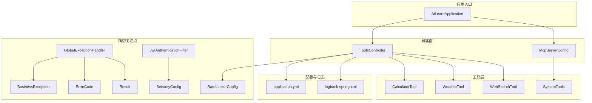
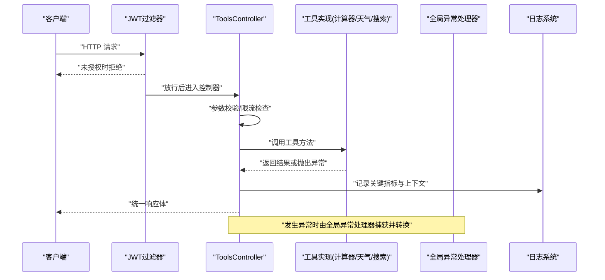
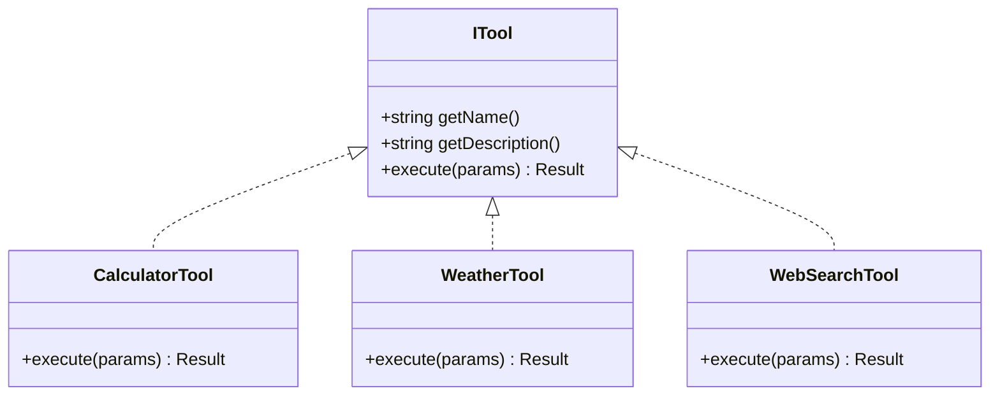
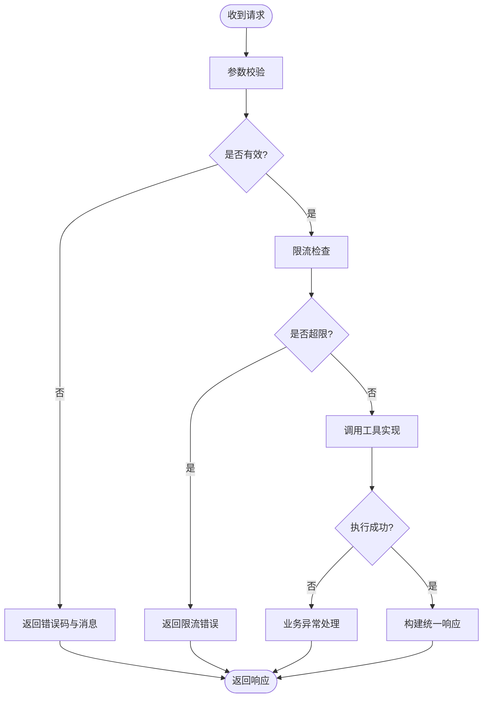
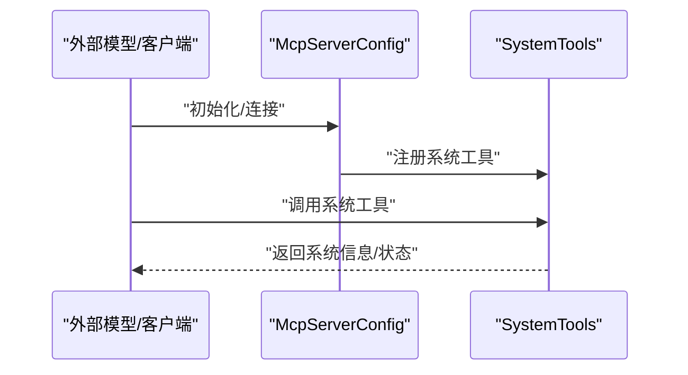
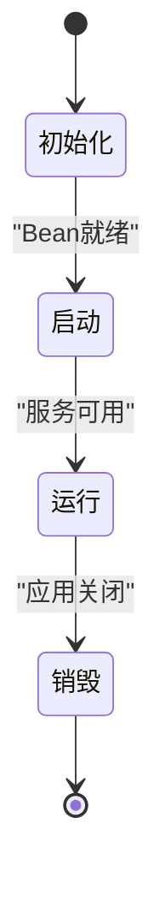
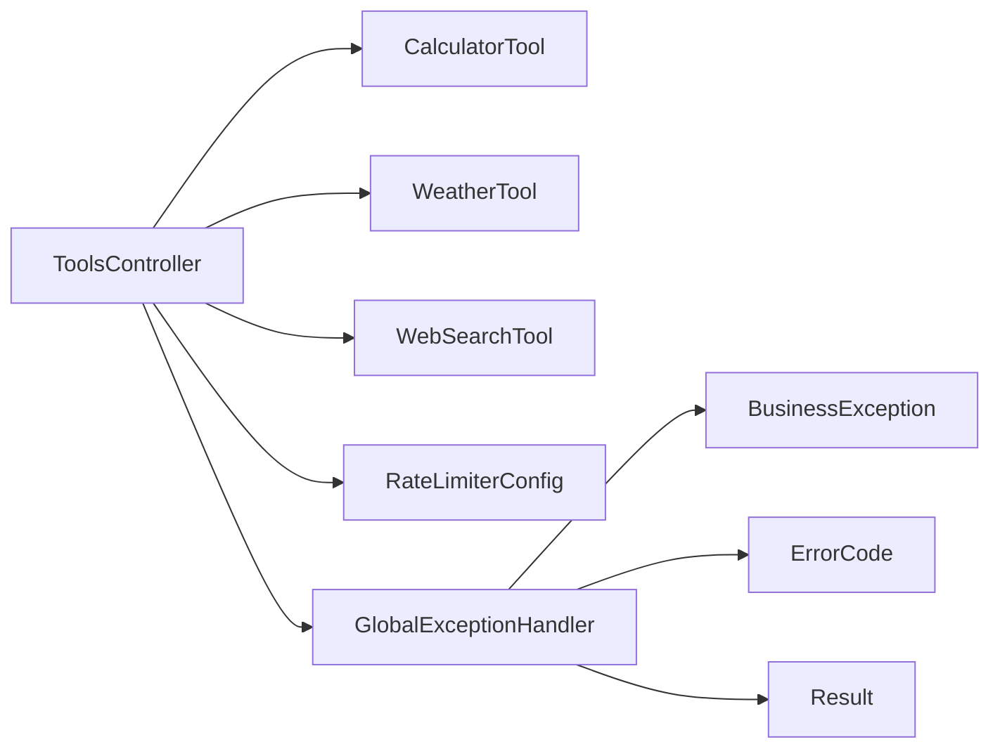

# 自定义工具开发

<cite>
**本文引用的文件**   
- [CalculatorTool.java](file://src/main/java/com/ailearn/tools/CalculatorTool.java)
- [WeatherTool.java](file://src/main/java/com/ailearn/tools/WeatherTool.java)
- [WebSearchTool.java](file://src/main/java/com/ailearn/tools/WebSearchTool.java)
- [ToolsController.java](file://src/main/java/com/ailearn/tools/ToolsController.java)
- [SystemTools.java](file://src/main/java/com/ailearn/mcp/SystemTools.java)
- [McpServerConfig.java](file://src/main/java/com/ailearn/config/McpServerConfig.java)
- [AiLearnApplication.java](file://src/main/java/com/ailearn/AiLearnApplication.java)
- [application.yml](file://src/main/resources/application.yml)
- [logback-spring.xml](file://src/main/resources/logback-spring.xml)
- [GlobalExceptionHandler.java](file://src/main/java/com/ailearn/common/GlobalExceptionHandler.java)
- [BusinessException.java](file://src/main/java/com/ailearn/common/BusinessException.java)
- [ErrorCode.java](file://src/main/java/com/ailearn/common/ErrorCode.java)
- [Result.java](file://src/main/java/com/ailearn/common/Result.java)
- [JwtAuthenticationFilter.java](file://src/main/java/com/ailearn/security/JwtAuthenticationFilter.java)
- [SecurityConfig.java](file://src/main/java/com/ailearn/security/SecurityConfig.java)
- [RateLimiterConfig.java](file://src/main/java/com/ailearn/config/RateLimiterConfig.java)
- [CalculatorToolTest.java](file://src/test/java/com/ailearn/tools/CalculatorToolTest.java)
- [WeatherToolTest.java](file://src/test/java/com/ailearn/tools/WeatherToolTest.java)
</cite>

## 目录
1. [简介](#简介)
2. [项目结构](#项目结构)
3. [核心组件](#核心组件)
4. [架构总览](#架构总览)
5. [详细组件分析](#详细组件分析)
6. [依赖关系分析](#依赖关系分析)
7. [性能考虑](#性能考虑)
8. [故障排查指南](#故障排查指南)
9. [结论](#结论)
10. [附录](#附录)

## 简介
本指南面向希望在项目中扩展“自定义工具”的开发者，围绕工具接口定义、类结构设计、服务注解配置、生命周期管理、依赖注入与配置管理、资源访问、错误处理、日志记录、性能监控、测试策略、部署与版本管理以及安全考量等主题，提供从需求到实现的完整实践路径。文档以现有代码库中的工具实现为蓝本，提炼通用模式与最佳实践，帮助读者快速构建高质量、可维护、可扩展的工具模块。

## 项目结构
本项目采用分层与按功能域组织相结合的结构。与工具开发直接相关的核心位置如下：
- 工具实现位于 tools 包下，包含计算器、天气、网页搜索等示例工具
- MCP（模型上下文协议）相关系统工具位于 mcp 包下
- 工具注册与暴露通过控制器或 MCP 服务器配置完成
- 全局异常处理、统一响应体、业务异常与错误码在 common 包中
- 安全与限流配置在 security 与 config 包中
- 日志与运行期配置在 resources 下

图表来源
- [AiLearnApplication.java](file://src/main/java/com/ailearn/AiLearnApplication.java)
- [ToolsController.java](file://src/main/java/com/ailearn/tools/ToolsController.java)
- [CalculatorTool.java](file://src/main/java/com/ailearn/tools/CalculatorTool.java)
- [WeatherTool.java](file://src/main/java/com/ailearn/tools/WeatherTool.java)
- [WebSearchTool.java](file://src/main/java/com/ailearn/tools/WebSearchTool.java)
- [SystemTools.java](file://src/main/java/com/ailearn/mcp/SystemTools.java)
- [McpServerConfig.java](file://src/main/java/com/ailearn/config/McpServerConfig.java)
- [GlobalExceptionHandler.java](file://src/main/java/com/ailearn/common/GlobalExceptionHandler.java)
- [BusinessException.java](file://src/main/java/com/ailearn/common/BusinessException.java)
- [ErrorCode.java](file://src/main/java/com/ailearn/common/ErrorCode.java)
- [Result.java](file://src/main/java/com/ailearn/common/Result.java)
- [JwtAuthenticationFilter.java](file://src/main/java/com/ailearn/security/JwtAuthenticationFilter.java)
- [SecurityConfig.java](file://src/main/java/com/ailearn/security/SecurityConfig.java)
- [RateLimiterConfig.java](file://src/main/java/com/ailearn/config/RateLimiterConfig.java)
- [application.yml](file://src/main/resources/application.yml)
- [logback-spring.xml](file://src/main/resources/logback-spring.xml)

章节来源
- [AiLearnApplication.java](file://src/main/java/com/ailearn/AiLearnApplication.java)
- [ToolsController.java](file://src/main/java/com/ailearn/tools/ToolsController.java)
- [McpServerConfig.java](file://src/main/java/com/ailearn/config/McpServerConfig.java)
- [application.yml](file://src/main/resources/application.yml)
- [logback-spring.xml](file://src/main/resources/logback-spring.xml)

## 核心组件
- 工具实现类：封装具体业务能力，如计算、天气查询、网页搜索等
- 工具控制器：将工具能力以 HTTP API 形式暴露，负责参数校验、调用工具、返回统一结果
- MCP 系统工具：通过 MCP 协议向外部模型或客户端暴露系统级能力
- 统一异常与响应：集中处理异常并返回标准格式
- 安全与限流：基于 JWT 的认证过滤与请求速率限制
- 配置与日志：应用配置与结构化日志输出

章节来源
- [CalculatorTool.java](file://src/main/java/com/ailearn/tools/CalculatorTool.java)
- [WeatherTool.java](file://src/main/java/com/ailearn/tools/WeatherTool.java)
- [WebSearchTool.java](file://src/main/java/com/ailearn/tools/WebSearchTool.java)
- [ToolsController.java](file://src/main/java/com/ailearn/tools/ToolsController.java)
- [SystemTools.java](file://src/main/java/com/ailearn/mcp/SystemTools.java)
- [GlobalExceptionHandler.java](file://src/main/java/com/ailearn/common/GlobalExceptionHandler.java)
- [BusinessException.java](file://src/main/java/com/ailearn/common/BusinessException.java)
- [ErrorCode.java](file://src/main/java/com/ailearn/common/ErrorCode.java)
- [Result.java](file://src/main/java/com/ailearn/common/Result.java)
- [JwtAuthenticationFilter.java](file://src/main/java/com/ailearn/security/JwtAuthenticationFilter.java)
- [SecurityConfig.java](file://src/main/java/com/ailearn/security/SecurityConfig.java)
- [RateLimiterConfig.java](file://src/main/java/com/ailearn/config/RateLimiterConfig.java)

## 架构总览
下图展示了从客户端请求到工具执行与响应的端到端流程，包括安全校验、限流、控制器路由、工具调用、异常处理与日志记录。

图表来源
- [ToolsController.java](file://src/main/java/com/ailearn/tools/ToolsController.java)
- [CalculatorTool.java](file://src/main/java/com/ailearn/tools/CalculatorTool.java)
- [WeatherTool.java](file://src/main/java/com/ailearn/tools/WeatherTool.java)
- [WebSearchTool.java](file://src/main/java/com/ailearn/tools/WebSearchTool.java)
- [GlobalExceptionHandler.java](file://src/main/java/com/ailearn/common/GlobalExceptionHandler.java)
- [JwtAuthenticationFilter.java](file://src/main/java/com/ailearn/security/JwtAuthenticationFilter.java)
- [logback-spring.xml](file://src/main/resources/logback-spring.xml)

## 详细组件分析

### 工具接口与类结构设计
- 建议抽象出统一的工具接口，定义输入参数、返回值、错误码与元数据（名称、描述、版本等），便于控制器与 MCP 层复用
- 每个工具类应单一职责，仅封装特定领域逻辑；对外暴露最小必要方法集
- 使用构造器或字段注入依赖（如配置、外部服务客户端），避免在方法内创建重型对象
- 对可能失败的外部调用进行隔离与重试/熔断设计（根据业务需要）

图表来源
- [CalculatorTool.java](file://src/main/java/com/ailearn/tools/CalculatorTool.java)
- [WeatherTool.java](file://src/main/java/com/ailearn/tools/WeatherTool.java)
- [WebSearchTool.java](file://src/main/java/com/ailearn/tools/WebSearchTool.java)

章节来源
- [CalculatorTool.java](file://src/main/java/com/ailearn/tools/CalculatorTool.java)
- [WeatherTool.java](file://src/main/java/com/ailearn/tools/WeatherTool.java)
- [WebSearchTool.java](file://src/main/java/com/ailearn/tools/WebSearchTool.java)

### 控制器与工具编排
- 控制器负责接收请求、参数校验、调用对应工具、包装统一响应体
- 结合限流配置保护工具接口，防止滥用
- 通过 Spring 容器管理工具实例，支持依赖注入与配置化

图表来源
- [ToolsController.java](file://src/main/java/com/ailearn/tools/ToolsController.java)
- [RateLimiterConfig.java](file://src/main/java/com/ailearn/config/RateLimiterConfig.java)
- [GlobalExceptionHandler.java](file://src/main/java/com/ailearn/common/GlobalExceptionHandler.java)
- [BusinessException.java](file://src/main/java/com/ailearn/common/BusinessException.java)
- [ErrorCode.java](file://src/main/java/com/ailearn/common/ErrorCode.java)
- [Result.java](file://src/main/java/com/ailearn/common/Result.java)

章节来源
- [ToolsController.java](file://src/main/java/com/ailearn/tools/ToolsController.java)
- [RateLimiterConfig.java](file://src/main/java/com/ailearn/config/RateLimiterConfig.java)
- [GlobalExceptionHandler.java](file://src/main/java/com/ailearn/common/GlobalExceptionHandler.java)
- [BusinessException.java](file://src/main/java/com/ailearn/common/BusinessException.java)
- [ErrorCode.java](file://src/main/java/com/ailearn/common/ErrorCode.java)
- [Result.java](file://src/main/java/com/ailearn/common/Result.java)

### MCP 系统工具与注册
- 系统工具通过 MCP 协议暴露给外部模型或客户端，通常用于系统信息查询、状态获取等
- 通过 MCP 服务器配置将系统工具注册到运行时，供模型按需调用

图表来源
- [McpServerConfig.java](file://src/main/java/com/ailearn/config/McpServerConfig.java)
- [SystemTools.java](file://src/main/java/com/ailearn/mcp/SystemTools.java)

章节来源
- [McpServerConfig.java](file://src/main/java/com/ailearn/config/McpServerConfig.java)
- [SystemTools.java](file://src/main/java/com/ailearn/mcp/SystemTools.java)

### 生命周期管理（初始化、启动、运行、销毁）
- 初始化：Spring 容器加载 Bean，工具类通过构造器或 @PostConstruct 完成资源准备（如连接池、缓存预热）
- 启动：应用启动完成后，控制器与 MCP 服务器完成路由与工具注册
- 运行：请求到达控制器，触发工具执行；期间进行参数校验、限流、日志记录
- 销毁：应用关闭时释放外部资源（如关闭 HTTP 客户端、断开数据库连接）

[此图为概念性流程图，不直接映射具体源码文件]

### 依赖注入、配置管理与资源访问
- 依赖注入：通过 Spring 容器注入工具所需的服务、配置、外部客户端
- 配置管理：将敏感信息与可变参数放入 application.yml，并通过配置类绑定到 Bean
- 资源访问：对第三方 API、数据库、文件系统等进行封装，统一错误与超时处理

章节来源
- [application.yml](file://src/main/resources/application.yml)
- [ToolsController.java](file://src/main/java/com/ailearn/tools/ToolsController.java)
- [CalculatorTool.java](file://src/main/java/com/ailearn/tools/CalculatorTool.java)
- [WeatherTool.java](file://src/main/java/com/ailearn/tools/WeatherTool.java)
- [WebSearchTool.java](file://src/main/java/com/ailearn/tools/WebSearchTool.java)

### 错误处理机制
- 业务异常：使用 BusinessException 携带 ErrorCode 与消息，便于前端展示与运维定位
- 全局异常处理器：统一捕获异常，转换为标准 Result 响应体
- 控制器层：对参数校验失败、限流失败、工具执行异常进行分类处理

章节来源
- [GlobalExceptionHandler.java](file://src/main/java/com/ailearn/common/GlobalExceptionHandler.java)
- [BusinessException.java](file://src/main/java/com/ailearn/common/BusinessException.java)
- [ErrorCode.java](file://src/main/java/com/ailearn/common/ErrorCode.java)
- [Result.java](file://src/main/java/com/ailearn/common/Result.java)
- [ToolsController.java](file://src/main/java/com/ailearn/tools/ToolsController.java)

### 日志记录与性能监控集成
- 结构化日志：通过 logback-spring.xml 配置输出格式、级别与滚动策略
- 追踪标识：在请求链路中注入 TraceId，便于跨组件追踪
- 指标埋点：在关键路径记录耗时、成功率、错误率，配合监控系统采集

章节来源
- [logback-spring.xml](file://src/main/resources/logback-spring.xml)
- [ToolsController.java](file://src/main/java/com/ailearn/tools/ToolsController.java)

### 安全考虑（输入验证、权限控制、资源限制）
- 输入验证：控制器层对入参进行严格校验，拒绝非法值
- 权限控制：通过 JWT 过滤器校验令牌，未授权请求直接拒绝
- 资源限制：启用限流配置，保护后端资源不被滥用

章节来源
- [JwtAuthenticationFilter.java](file://src/main/java/com/ailearn/security/JwtAuthenticationFilter.java)
- [SecurityConfig.java](file://src/main/java/com/ailearn/security/SecurityConfig.java)
- [RateLimiterConfig.java](file://src/main/java/com/ailearn/config/RateLimiterConfig.java)
- [ToolsController.java](file://src/main/java/com/ailearn/tools/ToolsController.java)

### 工具测试策略（单元、集成、模拟外部依赖）
- 单元测试：针对工具类的核心逻辑编写用例，覆盖正常路径与边界条件
- 集成测试：对控制器接口进行端到端测试，验证参数校验、限流、异常处理
- 模拟外部依赖：使用 Mock 框架替代真实外部服务，确保测试稳定性与速度

章节来源
- [CalculatorToolTest.java](file://src/test/java/com/ailearn/tools/CalculatorToolTest.java)
- [WeatherToolTest.java](file://src/test/java/com/ailearn/tools/WeatherToolTest.java)
- [ToolsController.java](file://src/main/java/com/ailearn/tools/ToolsController.java)

### 实际开发案例（从需求到实现）
- 需求分析：明确工具目标用户、输入输出、错误场景与性能要求
- 接口设计：定义工具接口与参数结构，约定错误码与响应体
- 类结构设计：拆分职责，注入依赖，封装外部调用
- 控制器编排：参数校验、限流、日志、统一响应
- 测试与发布：编写单测与集成测试，灰度发布与回滚策略

[本节为方法论总结，不直接分析具体文件]

## 依赖关系分析
- 控制器依赖工具实现与限流配置
- 工具实现依赖配置与外部服务客户端
- 全局异常处理器依赖业务异常、错误码与统一响应体
- 安全过滤器与安全配置共同保障接口访问控制

图表来源
- [ToolsController.java](file://src/main/java/com/ailearn/tools/ToolsController.java)
- [CalculatorTool.java](file://src/main/java/com/ailearn/tools/CalculatorTool.java)
- [WeatherTool.java](file://src/main/java/com/ailearn/tools/WeatherTool.java)
- [WebSearchTool.java](file://src/main/java/com/ailearn/tools/WebSearchTool.java)
- [RateLimiterConfig.java](file://src/main/java/com/ailearn/config/RateLimiterConfig.java)
- [GlobalExceptionHandler.java](file://src/main/java/com/ailearn/common/GlobalExceptionHandler.java)
- [BusinessException.java](file://src/main/java/com/ailearn/common/BusinessException.java)
- [ErrorCode.java](file://src/main/java/com/ailearn/common/ErrorCode.java)
- [Result.java](file://src/main/java/com/ailearn/common/Result.java)

章节来源
- [ToolsController.java](file://src/main/java/com/ailearn/tools/ToolsController.java)
- [CalculatorTool.java](file://src/main/java/com/ailearn/tools/CalculatorTool.java)
- [WeatherTool.java](file://src/main/java/com/ailearn/tools/WeatherTool.java)
- [WebSearchTool.java](file://src/main/java/com/ailearn/tools/WebSearchTool.java)
- [RateLimiterConfig.java](file://src/main/java/com/ailearn/config/RateLimiterConfig.java)
- [GlobalExceptionHandler.java](file://src/main/java/com/ailearn/common/GlobalExceptionHandler.java)
- [BusinessException.java](file://src/main/java/com/ailearn/common/BusinessException.java)
- [ErrorCode.java](file://src/main/java/com/ailearn/common/ErrorCode.java)
- [Result.java](file://src/main/java/com/ailearn/common/Result.java)

## 性能考虑
- 合理设置超时与重试策略，避免雪崩效应
- 使用连接池与缓存减少外部依赖开销
- 在热点路径添加指标埋点，观察 P95/P99 延迟与错误率
- 对 CPU 密集型与 IO 密集型任务分别优化，必要时引入异步处理

[本节提供通用指导，不直接分析具体文件]

## 故障排查指南
- 查看统一响应体中的错误码与消息，快速定位问题类型
- 通过结构化日志与 TraceId 追踪请求链路
- 检查限流配置与安全过滤器是否误拦截
- 对工具实现增加更细粒度的日志输出，辅助定位外部依赖异常

章节来源
- [GlobalExceptionHandler.java](file://src/main/java/com/ailearn/common/GlobalExceptionHandler.java)
- [Result.java](file://src/main/java/com/ailearn/common/Result.java)
- [logback-spring.xml](file://src/main/resources/logback-spring.xml)
- [JwtAuthenticationFilter.java](file://src/main/java/com/ailearn/security/JwtAuthenticationFilter.java)
- [RateLimiterConfig.java](file://src/main/java/com/ailearn/config/RateLimiterConfig.java)

## 结论
通过统一的工具接口、清晰的类结构与完善的横切关注点（安全、限流、异常、日志），可以高效地构建可维护、可扩展的自定义工具体系。遵循本文的生命周期管理、依赖注入、配置管理、错误处理、测试策略与安全考量，能够在保证质量的同时提升交付效率。

## 附录
- 部署与版本管理建议
  - 使用配置文件区分环境（开发、测试、生产），敏感信息通过环境变量注入
  - 采用语义化版本管理，变更日志记录破坏性更新与兼容说明
  - 灰度发布与回滚策略，结合健康检查与流量切换
- 参考文件
  - [application.yml](file://src/main/resources/application.yml)
  - [AiLearnApplication.java](file://src/main/java/com/ailearn/AiLearnApplication.java)