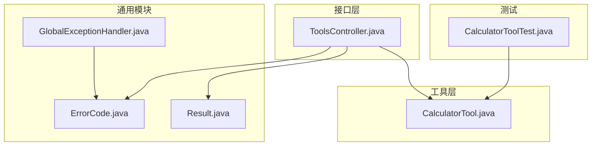
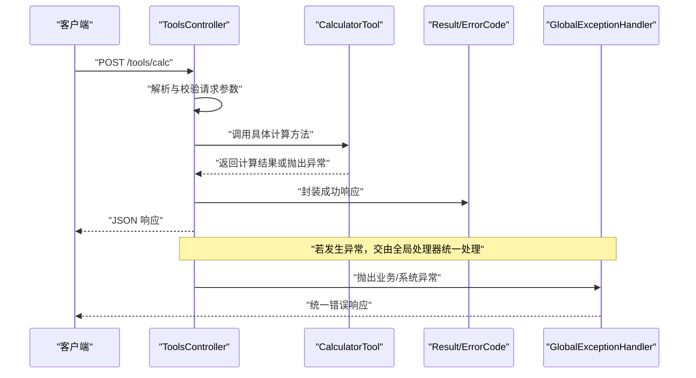
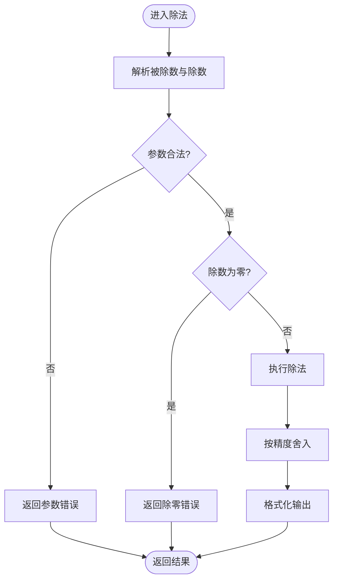
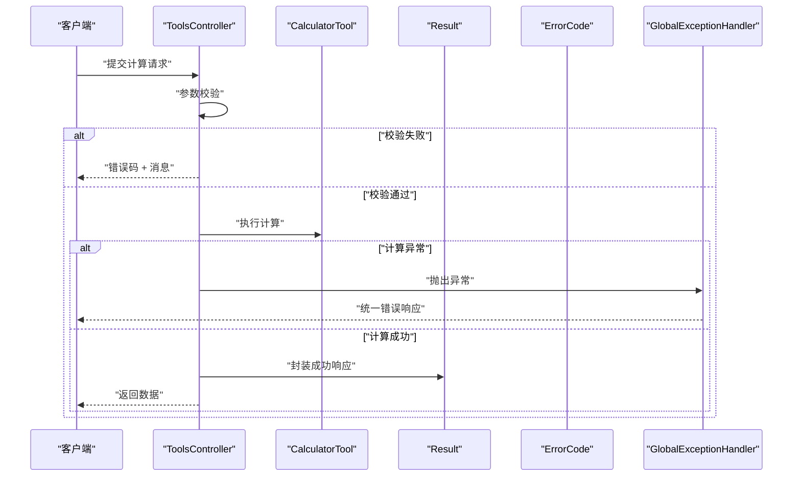
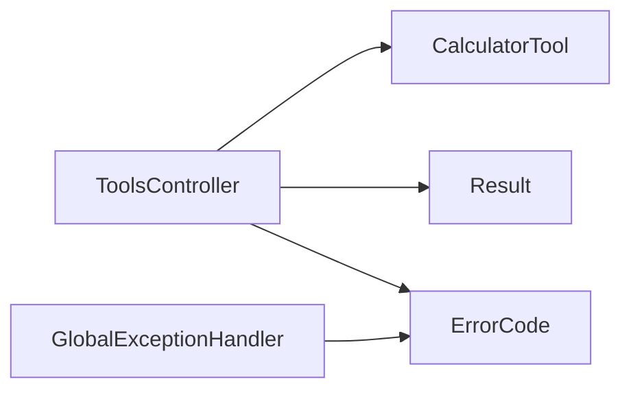

# 计算器工具

<cite>
**本文引用的文件**   
- [CalculatorTool.java](file://src/main/java/com/ailearn/tools/CalculatorTool.java)
- [ToolsController.java](file://src/main/java/com/ailearn/tools/ToolsController.java)
- [CalculatorToolTest.java](file://src/test/java/com/ailearn/tools/CalculatorToolTest.java)
- [ErrorCode.java](file://src/main/java/com/ailearn/common/ErrorCode.java)
- [GlobalExceptionHandler.java](file://src/main/java/com/ailearn/common/GlobalExceptionHandler.java)
- [Result.java](file://src/main/java/com/ailearn/common/Result.java)
</cite>

## 目录
1. [简介](#简介)
2. [项目结构](#项目结构)
3. [核心组件](#核心组件)
4. [架构总览](#架构总览)
5. [详细组件分析](#详细组件分析)
6. [依赖关系分析](#依赖关系分析)
7. [性能与并发](#性能与并发)
8. [故障排查指南](#故障排查指南)
9. [结论](#结论)
10. [附录：API 接口文档](#附录api-接口文档)

## 简介
本文件面向“计算器工具”的实现与使用，聚焦以下目标：
- 数学运算引擎：支持的运算类型、精度控制策略与边界条件处理。
- 输入参数校验：规则、异常分支与错误码。
- API 接口：请求参数格式、响应结构与错误码定义。
- 使用示例：常见计算场景的处理方法。
- 数值精度与大数支持：浮点误差、精度取舍与高精度方案。
- 性能优化与并发安全建议。

## 项目结构
计算器工具位于后端 Java 工程中的 tools 包，对外通过控制器暴露能力，内部由工具类承载计算逻辑；测试用例覆盖关键路径。

图表来源
- [CalculatorTool.java](file://src/main/java/com/ailearn/tools/CalculatorTool.java)
- [ToolsController.java](file://src/main/java/com/ailearn/tools/ToolsController.java)
- [Result.java](file://src/main/java/com/ailearn/common/Result.java)
- [ErrorCode.java](file://src/main/java/com/ailearn/common/ErrorCode.java)
- [GlobalExceptionHandler.java](file://src/main/java/com/ailearn/common/GlobalExceptionHandler.java)
- [CalculatorToolTest.java](file://src/test/java/com/ailearn/tools/CalculatorToolTest.java)

章节来源
- [CalculatorTool.java](file://src/main/java/com/ailearn/tools/CalculatorTool.java)
- [ToolsController.java](file://src/main/java/com/ailearn/tools/ToolsController.java)
- [CalculatorToolTest.java](file://src/test/java/com/ailearn/tools/CalculatorToolTest.java)
- [ErrorCode.java](file://src/main/java/com/ailearn/common/ErrorCode.java)
- [GlobalExceptionHandler.java](file://src/main/java/com/ailearn/common/GlobalExceptionHandler.java)
- [Result.java](file://src/main/java/com/ailearn/common/Result.java)

## 核心组件
- 计算器工具（CalculatorTool）
  - 职责：实现各类数学运算（加减乘除、幂运算、三角函数等），负责参数校验、边界条件处理、精度控制与结果格式化。
  - 关键点：对除零、非法角度/弧度、溢出、NaN/Infinity 等情况进行防御性处理；提供可配置的精度舍入策略。
- 工具控制器（ToolsController）
  - 职责：暴露 REST 接口，接收请求参数，调用 CalculatorTool 执行计算，封装统一响应 Result。
  - 关键点：参数解析与校验、异常捕获并映射为 ErrorCode，返回结构化响应。
- 通用模块
  - Result：统一响应体结构（如 code、message、data）。
  - ErrorCode：业务错误码枚举或常量。
  - GlobalExceptionHandler：全局异常处理，将未捕获异常转换为标准错误响应。
- 测试（CalculatorToolTest）
  - 职责：覆盖正常路径、边界值与异常分支，保障计算正确性与健壮性。

章节来源
- [CalculatorTool.java](file://src/main/java/com/ailearn/tools/CalculatorTool.java)
- [ToolsController.java](file://src/main/java/com/ailearn/tools/ToolsController.java)
- [Result.java](file://src/main/java/com/ailearn/common/Result.java)
- [ErrorCode.java](file://src/main/java/com/ailearn/common/ErrorCode.java)
- [GlobalExceptionHandler.java](file://src/main/java/com/ailearn/common/GlobalExceptionHandler.java)
- [CalculatorToolTest.java](file://src/test/java/com/ailearn/tools/CalculatorToolTest.java)

## 架构总览
从客户端到计算引擎的端到端流程如下：

图表来源
- [ToolsController.java](file://src/main/java/com/ailearn/tools/ToolsController.java)
- [CalculatorTool.java](file://src/main/java/com/ailearn/tools/CalculatorTool.java)
- [Result.java](file://src/main/java/com/ailearn/common/Result.java)
- [ErrorCode.java](file://src/main/java/com/ailearn/common/ErrorCode.java)
- [GlobalExceptionHandler.java](file://src/main/java/com/ailearn/common/GlobalExceptionHandler.java)

## 详细组件分析

### 计算器工具（CalculatorTool）
- 设计要点
  - 运算类型：基础四则运算、幂运算、三角函数（sin/cos/tan）、反三角函数、对数、开方、取模、绝对值等。
  - 精度控制：支持指定小数位数与舍入模式（如四舍五入、向上/向下取整、银行家舍入等）。
  - 输入校验：检查操作数是否为有限实数、是否越界、是否满足函数定义域（如分母非零、根号内非负、对数真数大于零等）。
  - 边界与异常：处理 NaN、Infinity、Overflow/Underflow、除零、非法角度/弧度、无效舍入模式等。
  - 输出格式：按精度要求格式化结果，避免科学计数法干扰展示（可选）。
- 复杂度与性能
  - 单次计算时间复杂度 O(1)，空间复杂度 O(1)。
  - 大量并发下注意线程安全与对象复用（见“性能与并发”）。
- 典型流程图（以除法为例）

图表来源
- [CalculatorTool.java](file://src/main/java/com/ailearn/tools/CalculatorTool.java)

章节来源
- [CalculatorTool.java](file://src/main/java/com/ailearn/tools/CalculatorTool.java)
- [CalculatorToolTest.java](file://src/test/java/com/ailearn/tools/CalculatorToolTest.java)

### 工具控制器（ToolsController）
- 职责
  - 暴露统一的计算入口，接收 JSON 请求体，解析并校验字段，调用 CalculatorTool 完成计算。
  - 将计算结果包装为 Result 返回；对异常进行捕获并映射为 ErrorCode。
- 关键流程
  - 参数校验失败：直接返回参数错误码。
  - 计算异常：交由全局异常处理器统一处理。
  - 成功路径：返回包含 data 的成功响应。
- 序列图（一次完整请求）

图表来源
- [ToolsController.java](file://src/main/java/com/ailearn/tools/ToolsController.java)
- [CalculatorTool.java](file://src/main/java/com/ailearn/tools/CalculatorTool.java)
- [Result.java](file://src/main/java/com/ailearn/common/Result.java)
- [ErrorCode.java](file://src/main/java/com/ailearn/common/ErrorCode.java)
- [GlobalExceptionHandler.java](file://src/main/java/com/ailearn/common/GlobalExceptionHandler.java)

章节来源
- [ToolsController.java](file://src/main/java/com/ailearn/tools/ToolsController.java)
- [Result.java](file://src/main/java/com/ailearn/common/Result.java)
- [ErrorCode.java](file://src/main/java/com/ailearn/common/ErrorCode.java)
- [GlobalExceptionHandler.java](file://src/main/java/com/ailearn/common/GlobalExceptionHandler.java)

### 单元测试（CalculatorToolTest）
- 覆盖范围
  - 常规计算：加减乘除、幂、三角函数、对数、开方等。
  - 边界条件：接近零、极大/极小值、无穷大、NaN、除零、负数开方、对数真数非正等。
  - 精度控制：不同舍入模式与小数位数的组合。
- 价值
  - 验证计算正确性与鲁棒性，确保后续重构不引入回归问题。

章节来源
- [CalculatorToolTest.java](file://src/test/java/com/ailearn/tools/CalculatorToolTest.java)

## 依赖关系分析
- 组件耦合
  - ToolsController 依赖 CalculatorTool 进行计算，依赖 Result/ErrorCode 进行响应封装。
  - GlobalExceptionHandler 依赖 ErrorCode 生成统一错误响应。
- 外部依赖
  - 无额外第三方库强依赖（仅基于 JDK 数学库与框架基础能力）。
- 潜在循环依赖
  - 当前分层清晰，未见循环依赖迹象。

图表来源
- [ToolsController.java](file://src/main/java/com/ailearn/tools/ToolsController.java)
- [CalculatorTool.java](file://src/main/java/com/ailearn/tools/CalculatorTool.java)
- [Result.java](file://src/main/java/com/ailearn/common/Result.java)
- [ErrorCode.java](file://src/main/java/com/ailearn/common/ErrorCode.java)
- [GlobalExceptionHandler.java](file://src/main/java/com/ailearn/common/GlobalExceptionHandler.java)

章节来源
- [ToolsController.java](file://src/main/java/com/ailearn/tools/ToolsController.java)
- [CalculatorTool.java](file://src/main/java/com/ailearn/tools/CalculatorTool.java)
- [Result.java](file://src/main/java/com/ailearn/common/Result.java)
- [ErrorCode.java](file://src/main/java/com/ailearn/common/ErrorCode.java)
- [GlobalExceptionHandler.java](file://src/main/java/com/ailearn/common/GlobalExceptionHandler.java)

## 性能与并发
- 性能优化建议
  - 避免重复创建 BigDecimal/DecimalFormat 实例，采用静态缓存或 ThreadLocal 复用。
  - 批量计算时合并精度设置，减少对象分配。
  - 对高频路径（如四则运算）优先使用原生 double 并在必要时再提升精度。
- 并发安全
  - 工具类应保持无状态或线程安全；共享对象需加锁或使用不可变对象。
  - 全局格式化器（如 DecimalFormat）在多线程环境下不安全，应改为每线程独立实例或 ThreadLocal。
- 资源与扩展
  - 如需更高精度或特殊函数，可抽象出 ICalculatorEngine 接口，便于替换实现或接入外部计算服务。

[本节为通用指导，不涉及具体文件分析]

## 故障排查指南
- 常见问题定位
  - 参数错误：检查字段类型、取值范围、必填项。
  - 除零/定义域错误：确认分母、根号内、对数真数等约束。
  - 精度问题：核对舍入模式与小数位数；对比期望精度与实际输出。
  - 溢出/无穷：关注极大/极小输入导致的 Infinity/NaN。
- 日志与追踪
  - 结合全局异常处理器记录上下文信息（请求 ID、参数摘要、异常堆栈）。
- 复现步骤
  - 使用最小化请求体复现问题；逐步放宽/收紧参数定位根因。

章节来源
- [GlobalExceptionHandler.java](file://src/main/java/com/ailearn/common/GlobalExceptionHandler.java)
- [ErrorCode.java](file://src/main/java/com/ailearn/common/ErrorCode.java)

## 结论
计算器工具通过清晰的控制器-工具分层，实现了可扩展、可测试的数学计算能力。通过严格的参数校验、完善的边界处理与灵活的精度控制，能够满足多种业务场景的计算需求。建议在后续迭代中持续完善错误码体系、补充更多函数与性能基准测试，并考虑引入高精度计算与异步批处理能力。

[本节为总结性内容，不涉及具体文件分析]

## 附录：API 接口文档

- 接口名称：计算
- 请求方式：POST
- 请求路径：/tools/calc
- 请求头：Content-Type: application/json
- 请求体字段
  - operation: string，必填，运算类型（如 add/sub/mul/div/pow/sin/cos/tan/log/sqrt/mod/abs 等）
  - params: array<number>，必填，操作数数组（长度与顺序依 operation 而定）
  - precision: integer，可选，保留小数位数（默认 0）
  - roundingMode: string，可选，舍入模式（如 HALF_UP/HALF_DOWN/HALF_EVEN/UP/DOWN/FLOOR/CEILING）
- 响应体结构
  - code: integer，状态码（0 表示成功，其他为错误码）
  - message: string，提示信息
  - data: object，计算结果
    - value: number|string，计算结果（当精度极高时可返回字符串以避免丢失精度）
    - unit: string，可选，单位（如有）
    - note: string，可选，备注（如“已按指定精度舍入”）
- 错误码定义（示例）
  - 10001：参数缺失或类型错误
  - 10002：参数取值超出允许范围
  - 10003：除零错误
  - 10004：定义域错误（如负数开方、对数真数非正）
  - 10005：精度配置错误（如舍入模式不支持）
  - 10006：计算溢出或产生无穷/NaN
  - 10007：系统内部错误
- 使用示例
  - 加法：operation=add, params=[1.23, 4.56], precision=2, roundingMode=HALF_UP
  - 除法：operation=div, params=[10, 3], precision=4, roundingMode=HALF_UP
  - 幂运算：operation=pow, params=[2, 10], precision=0
  - 三角函数：operation=sin, params=[Math.PI/6], precision=6
  - 对数：operation=log, params=[100], precision=2
  - 开方：operation=sqrt, params=[2], precision=10
  - 取模：operation=mod, params=[17, 5], precision=0
  - 绝对值：operation=abs, params=[-3.14], precision=2
- 注意事项
  - 角度/弧度：三角函数默认使用弧度；如需角度输入，请在 params 中自行转换。
  - 精度与显示：precision 控制舍入位数；为避免科学计数法影响展示，可在 data.value 中以字符串形式返回。
  - 大数运算：当数值过大或需要高精度时，建议使用字符串形式的 value 返回，并由前端按需格式化。

[本节为接口说明，不涉及具体文件分析]