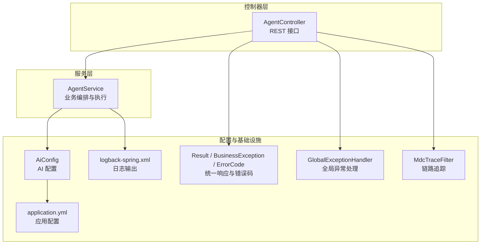
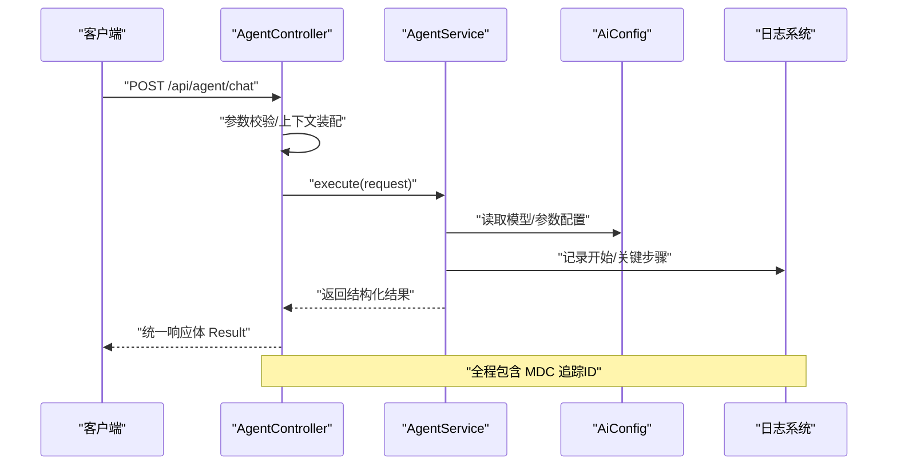
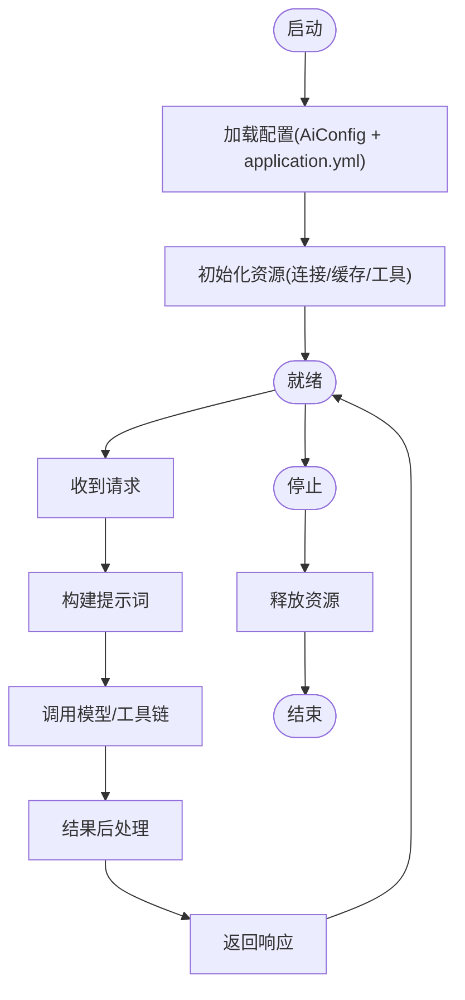
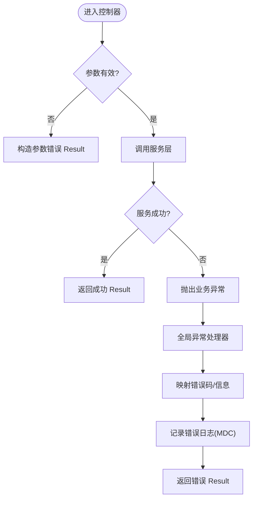
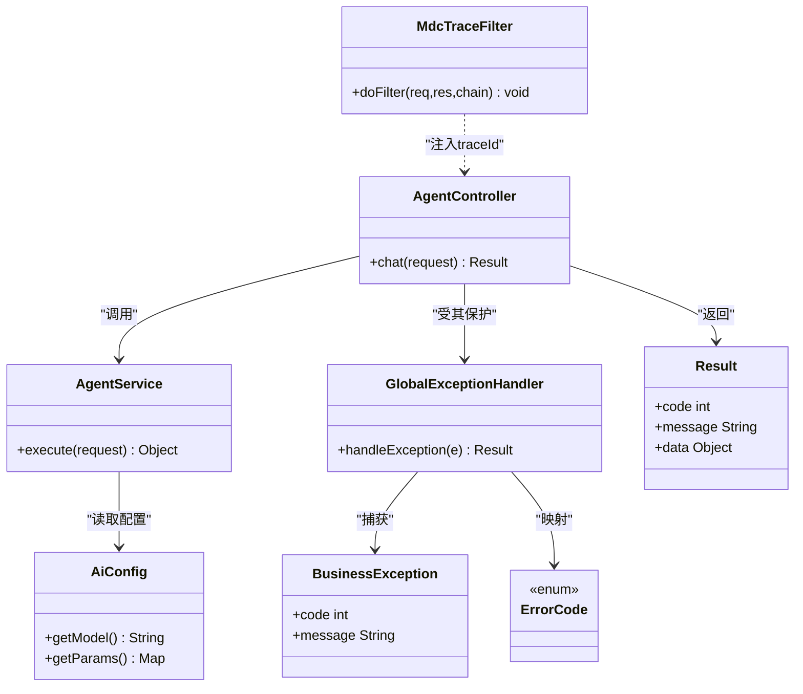

# 单代理模式

<cite>
**本文引用的文件**   
- [AgentController.java](file://src/main/java/com/ailearn/agent/AgentController.java)
- [AgentService.java](file://src/main/java/com/ailearn/agent/AgentService.java)
- [AiConfig.java](file://src/main/java/com/ailearn/config/AiConfig.java)
- [GlobalExceptionHandler.java](file://src/main/java/com/ailearn/common/GlobalExceptionHandler.java)
- [Result.java](file://src/main/java/com/ailearn/common/Result.java)
- [BusinessException.java](file://src/main/java/com/ailearn/common/BusinessException.java)
- [ErrorCode.java](file://src/main/java/com/ailearn/common/ErrorCode.java)
- [MdcTraceFilter.java](file://src/main/java/com/ailearn/config/MdcTraceFilter.java)
- [logback-spring.xml](file://src/main/resources/logback-spring.xml)
- [application.yml](file://src/main/resources/application.yml)
</cite>

## 目录
1. [简介](#简介)
2. [项目结构](#项目结构)
3. [核心组件](#核心组件)
4. [架构总览](#架构总览)
5. [详细组件分析](#详细组件分析)
6. [依赖关系分析](#依赖关系分析)
7. [性能考虑](#性能考虑)
8. [故障排查指南](#故障排查指南)
9. [结论](#结论)
10. [附录](#附录)

## 简介
本文件围绕“单代理模式”进行系统化文档化，聚焦以下目标：
- 解释单代理架构的设计原理与实现机制
- 深入解析 AgentController 的 REST API 设计与 AgentService 的业务逻辑
- 说明代理生命周期管理、任务调度与执行流程
- 详解代理配置参数（模型选择、提示词模板、参数设置）的含义与用法
- 提供完整的 API 调用示例与错误处理策略
- 明确适用业务场景与性能特点
- 阐述代理状态监控与日志记录机制的实现细节

## 项目结构
单代理相关代码位于 agent 包，配合通用异常、统一响应体、AI 配置与日志配置等模块共同构成完整能力。

图表来源
- [AgentController.java](file://src/main/java/com/ailearn/agent/AgentController.java)
- [AgentService.java](file://src/main/java/com/ailearn/agent/AgentService.java)
- [AiConfig.java](file://src/main/java/com/ailearn/config/AiConfig.java)
- [GlobalExceptionHandler.java](file://src/main/java/com/ailearn/common/GlobalExceptionHandler.java)
- [Result.java](file://src/main/java/com/ailearn/common/Result.java)
- [BusinessException.java](file://src/main/java/com/ailearn/common/BusinessException.java)
- [ErrorCode.java](file://src/main/java/com/ailearn/common/ErrorCode.java)
- [MdcTraceFilter.java](file://src/main/java/com/ailearn/config/MdcTraceFilter.java)
- [logback-spring.xml](file://src/main/resources/logback-spring.xml)
- [application.yml](file://src/main/resources/application.yml)

章节来源
- [AgentController.java](file://src/main/java/com/ailearn/agent/AgentController.java)
- [AgentService.java](file://src/main/java/com/ailearn/agent/AgentService.java)
- [AiConfig.java](file://src/main/java/com/ailearn/config/AiConfig.java)
- [GlobalExceptionHandler.java](file://src/main/java/com/ailearn/common/GlobalExceptionHandler.java)
- [Result.java](file://src/main/java/com/ailearn/common/Result.java)
- [BusinessException.java](file://src/main/java/com/ailearn/common/BusinessException.java)
- [ErrorCode.java](file://src/main/java/com/ailearn/common/ErrorCode.java)
- [MdcTraceFilter.java](file://src/main/java/com/ailearn/config/MdcTraceFilter.java)
- [logback-spring.xml](file://src/main/resources/logback-spring.xml)
- [application.yml](file://src/main/resources/application.yml)

## 核心组件
- AgentController：暴露单代理的 REST 接口，负责请求校验、上下文装配、调用服务层并返回统一响应。
- AgentService：封装单代理的核心业务编排，包括提示词组装、模型调用、工具/记忆集成（如有）、结果后处理与异常转换。
- AiConfig：集中管理 AI 相关配置项（如模型标识、温度、最大令牌数、超时、重试等）。
- GlobalExceptionHandler：统一捕获并格式化异常，结合 Result 与 ErrorCode 对外输出一致的错误结构。
- MdcTraceFilter：为每次请求注入链路追踪 ID，便于跨层日志关联。
- logback-spring.xml：定义日志级别、输出格式与滚动策略，支撑可观测性。

章节来源
- [AgentController.java](file://src/main/java/com/ailearn/agent/AgentController.java)
- [AgentService.java](file://src/main/java/com/ailearn/agent/AgentService.java)
- [AiConfig.java](file://src/main/java/com/ailearn/config/AiConfig.java)
- [GlobalExceptionHandler.java](file://src/main/java/com/ailearn/common/GlobalExceptionHandler.java)
- [Result.java](file://src/main/java/com/ailearn/common/Result.java)
- [BusinessException.java](file://src/main/java/com/ailearn/common/BusinessException.java)
- [ErrorCode.java](file://src/main/java/com/ailearn/common/ErrorCode.java)
- [MdcTraceFilter.java](file://src/main/java/com/ailearn/config/MdcTraceFilter.java)
- [logback-spring.xml](file://src/main/resources/logback-spring.xml)

## 架构总览
单代理模式将一次用户请求映射到单一代理实例，由控制器接收请求，服务层完成提示词构建、模型调用与结果处理，并通过统一异常与响应体对外暴露。

图表来源
- [AgentController.java](file://src/main/java/com/ailearn/agent/AgentController.java)
- [AgentService.java](file://src/main/java/com/ailearn/agent/AgentService.java)
- [AiConfig.java](file://src/main/java/com/ailearn/config/AiConfig.java)
- [MdcTraceFilter.java](file://src/main/java/com/ailearn/config/MdcTraceFilter.java)
- [logback-spring.xml](file://src/main/resources/logback-spring.xml)

## 详细组件分析

### AgentController 设计
- 职责
  - 暴露 REST 接口，承载单代理对话入口
  - 对入参进行基础校验与默认值填充
  - 将请求转换为内部领域对象并委托给 AgentService
  - 使用统一响应体 Result 包装成功或失败结果
- 典型接口
  - POST /api/agent/chat：提交用户消息，触发单代理执行
- 关键点
  - 与全局异常处理器协作，保证错误路径也返回一致的 JSON 结构
  - 通过 MDC 注入 traceId，便于后续日志定位

章节来源
- [AgentController.java](file://src/main/java/com/ailearn/agent/AgentController.java)
- [GlobalExceptionHandler.java](file://src/main/java/com/ailearn/common/GlobalExceptionHandler.java)
- [Result.java](file://src/main/java/com/ailearn/common/Result.java)

### AgentService 业务逻辑
- 职责
  - 组装提示词模板（支持动态变量替换）
  - 加载模型与推理参数（来自 AiConfig）
  - 调用底层 LLM 或工具链，聚合结果
  - 进行结果清洗、结构化与缓存（可选）
  - 抛出业务异常以被全局处理器捕获
- 关键流程
  - 输入校验 → 提示词构建 → 模型调用 → 结果后处理 → 返回
- 错误处理
  - 将外部调用异常转换为业务异常，附带错误码与可读信息

章节来源
- [AgentService.java](file://src/main/java/com/ailearn/agent/AgentService.java)
- [BusinessException.java](file://src/main/java/com/ailearn/common/BusinessException.java)
- [ErrorCode.java](file://src/main/java/com/ailearn/common/ErrorCode.java)

### 代理生命周期管理
- 启动阶段
  - 从 application.yml 与 AiConfig 加载模型、提示词模板与推理参数
  - 初始化必要的资源（如连接池、缓存、工具注册表）
- 运行阶段
  - 每个请求创建轻量级执行上下文（含 traceId、会话上下文等）
  - 执行提示词构建与模型调用，期间记录关键日志
- 关闭阶段
  - 释放外部资源，刷新缓冲，优雅停机

图表来源
- [AiConfig.java](file://src/main/java/com/ailearn/config/AiConfig.java)
- [application.yml](file://src/main/resources/application.yml)
- [AgentService.java](file://src/main/java/com/ailearn/agent/AgentService.java)

### 任务调度与执行流程
- 调度策略
  - 同步阻塞式：适用于简单对话场景，延迟可控
  - 异步非阻塞：在高并发下可通过线程池或响应式流提升吞吐（按需扩展）
- 执行要点
  - 限流与熔断：在控制器或服务层增加速率限制与降级策略
  - 重试与退避：对瞬时网络抖动进行指数退避重试
  - 超时控制：为模型调用设置合理超时，避免长尾请求堆积

章节来源
- [AgentController.java](file://src/main/java/com/ailearn/agent/AgentController.java)
- [AgentService.java](file://src/main/java/com/ailearn/agent/AgentService.java)

### 配置参数说明
- 模型选择
  - 模型标识/端点：用于指定具体模型或后端地址
  - 鉴权信息：API Key、租户标识等
- 提示词模板
  - 模板文本：支持占位符的动态替换
  - 系统提示词：设定角色、约束与输出格式
- 推理参数
  - 温度、TopP、最大令牌数、重复惩罚等
- 运行时开关
  - 是否启用缓存、是否开启结构化输出、是否打印调试日志

章节来源
- [AiConfig.java](file://src/main/java/com/ailearn/config/AiConfig.java)
- [application.yml](file://src/main/resources/application.yml)

### API 调用示例
- 请求
  - 方法：POST
  - 路径：/api/agent/chat
  - 头部：Content-Type: application/json；Authorization: Bearer <token>（若启用鉴权）
  - 请求体字段（示例）：
    - conversationId：会话标识（可选）
    - message：用户消息
    - model：模型标识（可选，覆盖默认）
    - temperature：采样温度（可选）
    - maxTokens：最大生成令牌数（可选）
- 响应
  - 统一结构：Result<T>
    - code：业务状态码
    - message：提示信息
    - data：业务数据（如回复内容、元信息）
- 错误
  - 全局异常处理器会将异常转为 Result，code 取自 ErrorCode，message 可读

章节来源
- [AgentController.java](file://src/main/java/com/ailearn/agent/AgentController.java)
- [Result.java](file://src/main/java/com/ailearn/common/Result.java)
- [GlobalExceptionHandler.java](file://src/main/java/com/ailearn/common/GlobalExceptionHandler.java)
- [ErrorCode.java](file://src/main/java/com/ailearn/common/ErrorCode.java)

### 错误处理策略
- 分类
  - 参数校验错误：返回明确的字段级错误信息
  - 业务异常：携带 ErrorCode 与可读 message
  - 系统异常：兜底错误码，避免泄露敏感信息
- 处理流程
  - 控制器层捕获并转换为 Result
  - 全局异常处理器统一格式化并记录日志
  - 通过 MDC 关联 traceId，便于问题回溯

图表来源
- [AgentController.java](file://src/main/java/com/ailearn/agent/AgentController.java)
- [GlobalExceptionHandler.java](file://src/main/java/com/ailearn/common/GlobalExceptionHandler.java)
- [BusinessException.java](file://src/main/java/com/ailearn/common/BusinessException.java)
- [ErrorCode.java](file://src/main/java/com/ailearn/common/ErrorCode.java)
- [MdcTraceFilter.java](file://src/main/java/com/ailearn/config/MdcTraceFilter.java)

## 依赖关系分析
- 控制器依赖服务层与统一响应体
- 服务层依赖配置与日志
- 全局异常处理器依赖错误码与业务异常
- 过滤器为全链路注入追踪上下文

图表来源
- [AgentController.java](file://src/main/java/com/ailearn/agent/AgentController.java)
- [AgentService.java](file://src/main/java/com/ailearn/agent/AgentService.java)
- [AiConfig.java](file://src/main/java/com/ailearn/config/AiConfig.java)
- [GlobalExceptionHandler.java](file://src/main/java/com/ailearn/common/GlobalExceptionHandler.java)
- [Result.java](file://src/main/java/com/ailearn/common/Result.java)
- [BusinessException.java](file://src/main/java/com/ailearn/common/BusinessException.java)
- [ErrorCode.java](file://src/main/java/com/ailearn/common/ErrorCode.java)
- [MdcTraceFilter.java](file://src/main/java/com/ailearn/config/MdcTraceFilter.java)

章节来源
- [AgentController.java](file://src/main/java/com/ailearn/agent/AgentController.java)
- [AgentService.java](file://src/main/java/com/ailearn/agent/AgentService.java)
- [AiConfig.java](file://src/main/java/com/ailearn/config/AiConfig.java)
- [GlobalExceptionHandler.java](file://src/main/java/com/ailearn/common/GlobalExceptionHandler.java)
- [Result.java](file://src/main/java/com/ailearn/common/Result.java)
- [BusinessException.java](file://src/main/java/com/ailearn/common/BusinessException.java)
- [ErrorCode.java](file://src/main/java/com/ailearn/common/ErrorCode.java)
- [MdcTraceFilter.java](file://src/main/java/com/ailearn/config/MdcTraceFilter.java)

## 性能考虑
- 并发与吞吐
  - 合理设置线程池大小与队列容量，避免模型调用阻塞导致线程饥饿
  - 对热点请求启用本地缓存（按 conversationId + message 指纹）
- 超时与重试
  - 为模型调用设置短超时+快速失败，配合指数退避重试
- 资源隔离
  - 不同模型或租户可隔离线程池/连接池，防止相互影响
- 可观测性
  - 通过 MDC 与结构化日志输出耗时、错误码与关键指标，便于定位瓶颈

[本节为通用指导，不直接分析具体文件]

## 故障排查指南
- 常见问题
  - 参数缺失或类型错误：检查请求体字段与必填项
  - 模型调用失败：查看错误码与日志中的堆栈，确认鉴权与网络连通性
  - 响应缓慢：关注日志中的耗时分布与线程池占用情况
- 定位手段
  - 使用 MDC 的 traceId 串联全链路日志
  - 根据 ErrorCode 快速定位错误类别
  - 调整日志级别至 DEBUG 获取更详细信息（生产谨慎）

章节来源
- [GlobalExceptionHandler.java](file://src/main/java/com/ailearn/common/GlobalExceptionHandler.java)
- [ErrorCode.java](file://src/main/java/com/ailearn/common/ErrorCode.java)
- [MdcTraceFilter.java](file://src/main/java/com/ailearn/config/MdcTraceFilter.java)
- [logback-spring.xml](file://src/main/resources/logback-spring.xml)

## 结论
单代理模式以简洁清晰的层次划分实现了高内聚、低耦合的对话能力。通过统一的控制器与服务层分工、完善的配置管理与错误处理、以及基于 MDC 的可观测性建设，能够在多种业务场景中稳定交付高质量的 AI 交互体验。

[本节为总结性内容，不直接分析具体文件]

## 附录
- 适用业务场景
  - 客服问答、知识检索助手、代码辅助、数据分析助手等
- 最佳实践
  - 将提示词模板与业务逻辑解耦，便于 A/B 测试与灰度发布
  - 对关键路径埋点，持续优化延迟与成功率
  - 建立错误码字典与告警规则，缩短排障时间

[本节为补充说明，不直接分析具体文件]