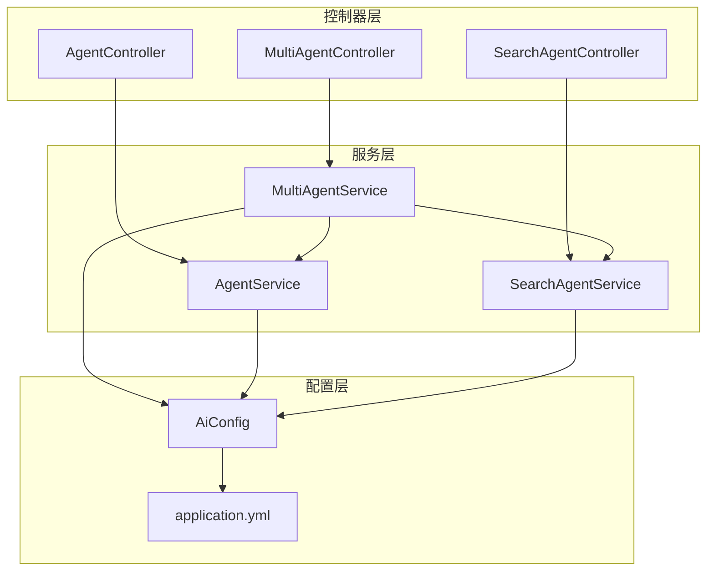
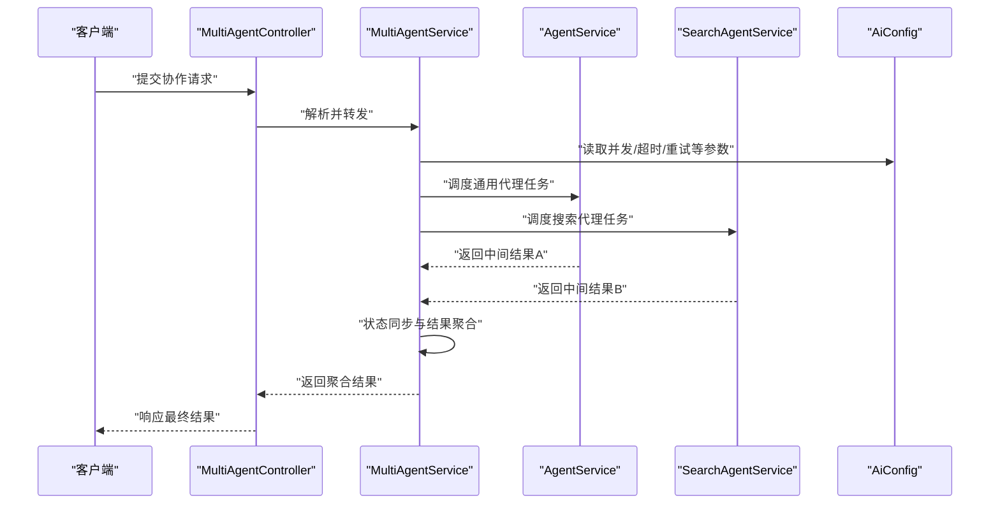
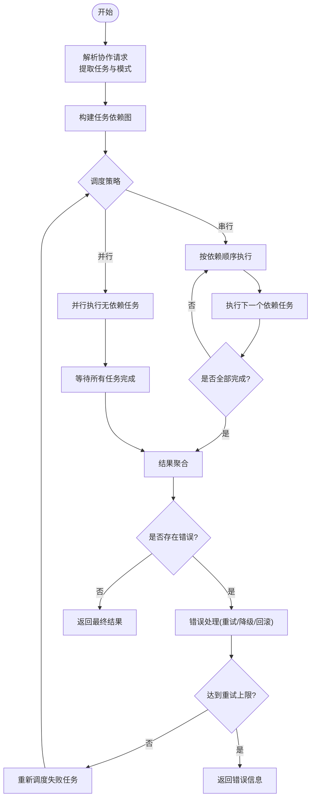
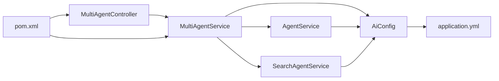

# 多代理协作框架

<cite>
**本文引用的文件**   
- [MultiAgentController.java](file://src/main/java/com/ailearn/agent/MultiAgentController.java)
- [MultiAgentService.java](file://src/main/java/com/ailearn/agent/MultiAgentService.java)
- [AgentController.java](file://src/main/java/com/ailearn/agent/AgentController.java)
- [AgentService.java](file://src/main/java/com/ailearn/agent/AgentService.java)
- [SearchAgentController.java](file://src/main/java/com/ailearn/agent/SearchAgentController.java)
- [SearchAgentService.java](file://src/main/java/com/ailearn/agent/SearchAgentService.java)
- [AiConfig.java](file://src/main/java/com/ailearn/config/AiConfig.java)
- [application.yml](file://src/main/resources/application.yml)
- [pom.xml](file://pom.xml)
</cite>

## 目录
1. [简介](#简介)
2. [项目结构](#项目结构)
3. [核心组件](#核心组件)
4. [架构总览](#架构总览)
5. [详细组件分析](#详细组件分析)
6. [依赖关系分析](#依赖关系分析)
7. [性能考虑](#性能考虑)
8. [故障排查指南](#故障排查指南)
9. [结论](#结论)
10. [附录](#附录)

## 简介
本文件面向“多代理协作框架”的设计与实现，聚焦以下目标：
- 解释 MultiAgentController 的任务分发机制与 MultiAgentService 的协调算法
- 说明代理间消息传递、状态同步与结果聚合机制
- 阐述协作模式选择策略与执行顺序控制
- 提供多代理配置示例与最佳实践
- 说明代理间依赖关系的处理与错误传播机制
- 给出协作性能优化与负载均衡策略
- 提供自定义协作协议的扩展指南

## 项目结构
多代理相关代码位于 agent 包中，包含控制器与服务层；配置集中在 config 与 resources。整体采用分层架构：
- 控制器层：对外暴露 REST API，负责请求校验与路由
- 服务层：编排多代理协作流程、调度与聚合
- 配置层：加载运行时参数（如并发度、超时、重试等）
- 外部依赖：通过 Spring Boot 启动，使用配置文件注入参数

图表来源
- [MultiAgentController.java](file://src/main/java/com/ailearn/agent/MultiAgentController.java)
- [MultiAgentService.java](file://src/main/java/com/ailearn/agent/MultiAgentService.java)
- [AgentController.java](file://src/main/java/com/ailearn/agent/AgentController.java)
- [AgentService.java](file://src/main/java/com/ailearn/agent/AgentService.java)
- [SearchAgentController.java](file://src/main/java/com/ailearn/agent/SearchAgentController.java)
- [SearchAgentService.java](file://src/main/java/com/ailearn/agent/SearchAgentService.java)
- [AiConfig.java](file://src/main/java/com/ailearn/config/AiConfig.java)
- [application.yml](file://src/main/resources/application.yml)

章节来源
- [MultiAgentController.java](file://src/main/java/com/ailearn/agent/MultiAgentController.java)
- [MultiAgentService.java](file://src/main/java/com/ailearn/agent/MultiAgentService.java)
- [AiConfig.java](file://src/main/java/com/ailearn/config/AiConfig.java)
- [application.yml](file://src/main/resources/application.yml)

## 核心组件
- MultiAgentController：接收多代理协作请求，解析入参并调用 MultiAgentService 进行编排
- MultiAgentService：实现协作编排逻辑，包括任务拆分、调度、状态跟踪、结果聚合与错误处理
- AgentService：通用单代理能力封装，供 MultiAgentService 复用
- SearchAgentService：搜索类专用代理能力封装，支持检索增强场景
- AiConfig：集中管理 AI 相关运行参数（如并发度、超时、重试、模型选择等）

职责边界
- 控制器仅做请求/响应适配与基础校验
- 服务层承载业务编排与跨代理协调
- 配置层提供可插拔的参数化行为

章节来源
- [MultiAgentController.java](file://src/main/java/com/ailearn/agent/MultiAgentController.java)
- [MultiAgentService.java](file://src/main/java/com/ailearn/agent/MultiAgentService.java)
- [AgentService.java](file://src/main/java/com/ailearn/agent/AgentService.java)
- [SearchAgentService.java](file://src/main/java/com/ailearn/agent/SearchAgentService.java)
- [AiConfig.java](file://src/main/java/com/ailearn/config/AiConfig.java)

## 架构总览
多代理协作的总体流程如下：
- 客户端发起协作请求至 MultiAgentController
- MultiAgentController 将请求转交给 MultiAgentService
- MultiAgentService 根据协作模式与依赖图，将任务分发给各代理（AgentService、SearchAgentService 等）
- 各代理并行或串行执行，返回中间结果
- MultiAgentService 汇总中间结果，按策略合并为最终输出
- 控制器将结果返回给客户端

图表来源
- [MultiAgentController.java](file://src/main/java/com/ailearn/agent/MultiAgentController.java)
- [MultiAgentService.java](file://src/main/java/com/ailearn/agent/MultiAgentService.java)
- [AgentService.java](file://src/main/java/com/ailearn/agent/AgentService.java)
- [SearchAgentService.java](file://src/main/java/com/ailearn/agent/SearchAgentService.java)
- [AiConfig.java](file://src/main/java/com/ailearn/config/AiConfig.java)

## 详细组件分析

### MultiAgentController 任务分发机制
- 职责：接收多代理协作请求，进行参数校验，并将请求委派给 MultiAgentService
- 关键点：
  - 入参校验：确保必要字段存在且格式正确
  - 路由选择：根据请求中的协作模式或任务类型选择对应编排路径
  - 上下文传递：将追踪ID、用户上下文等透传给下游服务
- 建议：
  - 在控制器层避免复杂业务逻辑，保持薄控制器
  - 对异常进行统一包装，便于上层处理

章节来源
- [MultiAgentController.java](file://src/main/java/com/ailearn/agent/MultiAgentController.java)

### MultiAgentService 协调算法
- 职责：实现多代理协作的核心编排逻辑，包括任务拆分、调度、状态跟踪、结果聚合与错误处理
- 关键能力：
  - 任务拆分：将复杂问题分解为子任务，映射到不同代理
  - 调度策略：支持并行与串行混合调度，依据依赖关系构建执行图
  - 状态同步：维护每个子任务的执行状态，支持进度上报与中断
  - 结果聚合：按策略合并多个代理的输出，生成最终结果
  - 错误处理：捕获代理异常，进行重试、降级或回滚
- 设计要点：
  - 使用线程池控制并发度，避免资源耗尽
  - 使用超时与熔断保护，防止级联失败
  - 使用幂等键与去重，避免重复执行

图表来源
- [MultiAgentService.java](file://src/main/java/com/ailearn/agent/MultiAgentService.java)

章节来源
- [MultiAgentService.java](file://src/main/java/com/ailearn/agent/MultiAgentService.java)

### 代理间消息传递、状态同步与结果聚合
- 消息传递：
  - 通过服务方法调用传递结构化消息，避免全局共享状态
  - 使用不可变对象作为消息载体，保证线程安全
- 状态同步：
  - 每个子任务维护独立状态，由 MultiAgentService 统一跟踪
  - 支持进度回调与取消信号
- 结果聚合：
  - 定义聚合策略（如投票、加权平均、主从合并）
  - 对部分成功的情况进行容错合并

章节来源
- [MultiAgentService.java](file://src/main/java/com/ailearn/agent/MultiAgentService.java)
- [AgentService.java](file://src/main/java/com/ailearn/agent/AgentService.java)
- [SearchAgentService.java](file://src/main/java/com/ailearn/agent/SearchAgentService.java)

### 协作模式选择策略与执行顺序控制
- 协作模式：
  - 顺序执行：适用于强依赖链式任务
  - 并行执行：适用于无依赖或弱依赖任务
  - 混合模式：结合两者，按依赖图动态调度
- 选择策略：
  - 基于任务依赖图的拓扑排序决定执行顺序
  - 根据资源负载与超时约束动态调整并发度
- 执行顺序控制：
  - 使用有向无环图（DAG）表示任务依赖
  - 利用屏障与事件驱动机制保证顺序一致性

章节来源
- [MultiAgentService.java](file://src/main/java/com/ailearn/agent/MultiAgentService.java)

### 代理间依赖关系的处理与错误传播机制
- 依赖处理：
  - 显式声明任务间的输入输出依赖
  - 在调度阶段验证依赖完整性，避免死锁
- 错误传播：
  - 捕获代理异常并记录上下文
  - 向上层返回标准化错误码与消息
  - 支持局部失败不影响其他分支的执行

章节来源
- [MultiAgentService.java](file://src/main/java/com/ailearn/agent/MultiAgentService.java)

### 多代理配置的完整示例与最佳实践
- 配置项建议：
  - 并发度：控制并行任务数量
  - 超时：设置单个任务与整体协作的超时时间
  - 重试：定义最大重试次数与退避策略
  - 模型选择：指定不同代理使用的模型或后端
- 最佳实践：
  - 将配置外置，支持热更新
  - 为不同环境提供差异化配置
  - 监控关键指标（延迟、成功率、资源占用）

章节来源
- [AiConfig.java](file://src/main/java/com/ailearn/config/AiConfig.java)
- [application.yml](file://src/main/resources/application.yml)

### 自定义协作协议的扩展指南
- 扩展点：
  - 新增代理：实现标准接口并通过配置注册
  - 新协作模式：实现新的调度与聚合策略
  - 新消息协议：定义新的消息结构与序列化方式
- 步骤：
  - 定义协议常量与数据结构
  - 在 MultiAgentService 中注册新模式
  - 在控制器中添加路由与校验
  - 编写单元测试覆盖关键路径

章节来源
- [MultiAgentController.java](file://src/main/java/com/ailearn/agent/MultiAgentController.java)
- [MultiAgentService.java](file://src/main/java/com/ailearn/agent/MultiAgentService.java)

## 依赖关系分析
- 内部依赖：
  - MultiAgentController 依赖 MultiAgentService
  - MultiAgentService 依赖 AgentService 与 SearchAgentService
  - 服务层依赖 AiConfig 获取运行时参数
- 外部依赖：
  - Spring Boot 容器管理生命周期
  - 配置文件 application.yml 提供默认值
  - 构建工具 pom.xml 管理第三方库版本

图表来源
- [MultiAgentController.java](file://src/main/java/com/ailearn/agent/MultiAgentController.java)
- [MultiAgentService.java](file://src/main/java/com/ailearn/agent/MultiAgentService.java)
- [AgentService.java](file://src/main/java/com/ailearn/agent/AgentService.java)
- [SearchAgentService.java](file://src/main/java/com/ailearn/agent/SearchAgentService.java)
- [AiConfig.java](file://src/main/java/com/ailearn/config/AiConfig.java)
- [application.yml](file://src/main/resources/application.yml)
- [pom.xml](file://pom.xml)

章节来源
- [pom.xml](file://pom.xml)
- [application.yml](file://src/main/resources/application.yml)

## 性能考虑
- 并发控制：合理设置线程池大小，避免过度竞争
- 超时与熔断：为长尾任务设置超时，快速失败
- 缓存与去重：对重复查询结果进行缓存，减少重复计算
- 批处理：将小任务合并批量执行，降低开销
- 监控与告警：采集关键指标，及时发现瓶颈

[本节为通用指导，不直接分析具体文件]

## 故障排查指南
- 常见问题：
  - 任务超时：检查代理响应时间与网络状况
  - 资源耗尽：调整并发度与队列长度
  - 依赖死锁：审查任务依赖图，消除循环依赖
- 定位手段：
  - 查看日志中的错误码与堆栈
  - 使用追踪ID关联一次协作的全链路日志
  - 对比不同配置下的性能指标

章节来源
- [MultiAgentService.java](file://src/main/java/com/ailearn/agent/MultiAgentService.java)

## 结论
本框架通过清晰的分层设计与可扩展的协作协议，实现了多代理的高效协作。借助任务依赖图、并发控制与错误传播机制，能够在复杂场景中稳定运行。建议在生产环境中完善监控与告警，持续优化性能与可靠性。

[本节为总结性内容，不直接分析具体文件]

## 附录
- 术语表：
  - 协作模式：指多代理之间的组织与执行方式
  - 依赖图：描述任务间先后关系的有向无环图
  - 结果聚合：将多个代理的输出合并为最终结果的策略
- 参考文件：
  - 控制器与服务层源码
  - 配置与构建文件

[本节为补充信息，不直接分析具体文件]