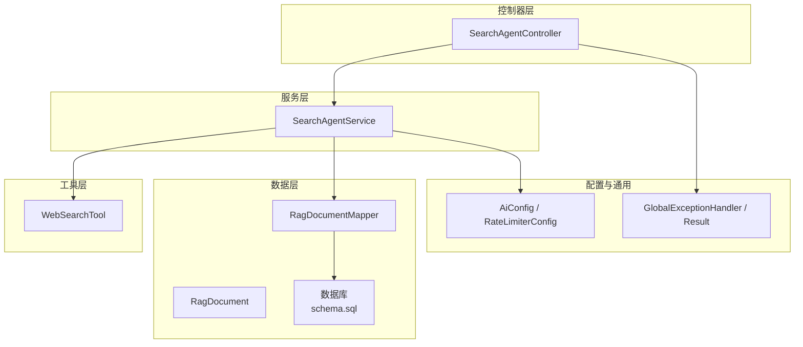
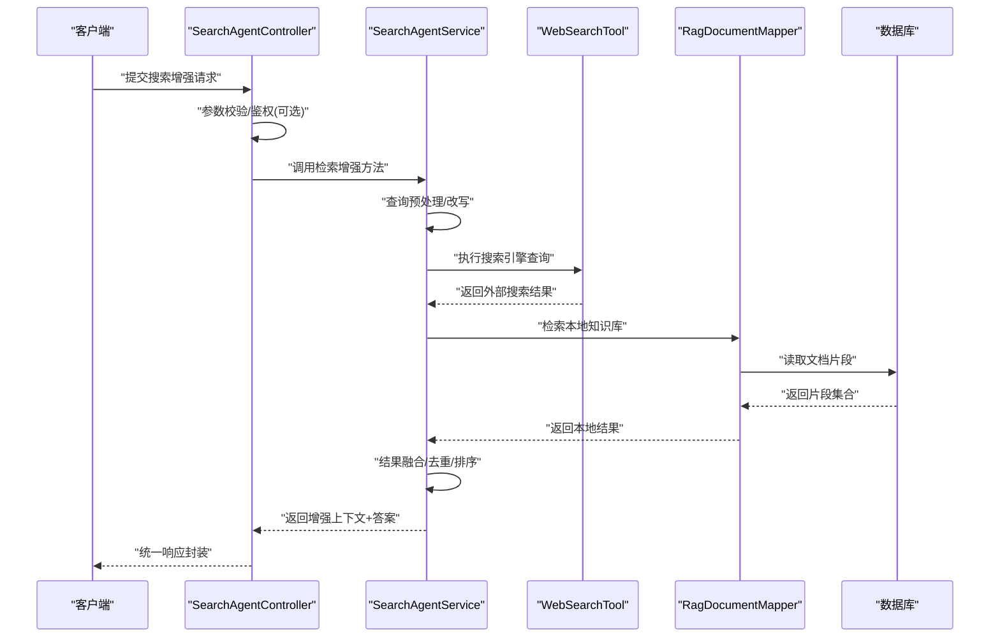
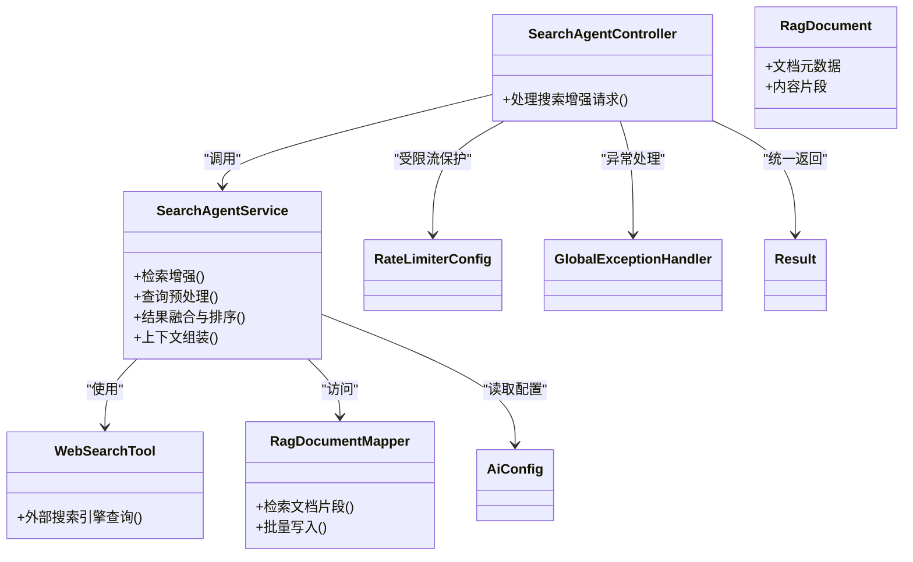

# 搜索增强代理

<cite>
**本文引用的文件**   
- [SearchAgentController.java](file://src/main/java/com/ailearn/agent/SearchAgentController.java)
- [SearchAgentService.java](file://src/main/java/com/ailearn/agent/SearchAgentService.java)
- [WebSearchTool.java](file://src/main/java/com/ailearn/tools/WebSearchTool.java)
- [RagDocument.java](file://src/main/java/com/ailearn/entity/RagDocument.java)
- [RagDocumentMapper.java](file://src/main/java/com/ailearn/mapper/RagDocumentMapper.java)
- [schema.sql](file://src/main/resources/schema.sql)
- [application.yml](file://src/main/resources/application.yml)
- [AiConfig.java](file://src/main/java/com/ailearn/config/AiConfig.java)
- [RateLimiterConfig.java](file://src/main/java/com/ailearn/config/RateLimiterConfig.java)
- [GlobalExceptionHandler.java](file://src/main/java/com/ailearn/common/GlobalExceptionHandler.java)
- [Result.java](file://src/main/java/com/ailearn/common/Result.java)
</cite>

## 目录
1. [简介](#简介)
2. [项目结构](#项目结构)
3. [核心组件](#核心组件)
4. [架构总览](#架构总览)
5. [详细组件分析](#详细组件分析)
6. [依赖关系分析](#依赖关系分析)
7. [性能考虑](#性能考虑)
8. [故障排查指南](#故障排查指南)
9. [结论](#结论)
10. [附录](#附录)

## 简介
本文件面向“搜索增强代理”的构建与使用，聚焦于检索增强生成（RAG）集成架构与知识检索机制。文档围绕以下目标展开：
- 解释 SearchAgentController 的请求处理流程与 SearchAgentService 的检索增强逻辑
- 说明搜索引擎集成方式、查询优化与结果排序策略
- 阐述知识库构建过程、索引策略与更新机制
- 提供配置示例与性能调优建议
- 描述搜索结果相关性评估与质量控制机制
- 给出搜索缓存策略与增量更新方案
- 指导如何自定义搜索引擎并落地最佳实践

## 项目结构
搜索增强代理位于 agent 包中，包含控制器与服务层；工具层提供 Web 搜索能力；实体与映射用于持久化知识库文档；配置与异常处理贯穿系统。

图表来源
- [SearchAgentController.java](file://src/main/java/com/ailearn/agent/SearchAgentController.java)
- [SearchAgentService.java](file://src/main/java/com/ailearn/agent/SearchAgentService.java)
- [WebSearchTool.java](file://src/main/java/com/ailearn/tools/WebSearchTool.java)
- [RagDocument.java](file://src/main/java/com/ailearn/entity/RagDocument.java)
- [RagDocumentMapper.java](file://src/main/java/com/ailearn/mapper/RagDocumentMapper.java)
- [schema.sql](file://src/main/resources/schema.sql)
- [AiConfig.java](file://src/main/java/com/ailearn/config/AiConfig.java)
- [RateLimiterConfig.java](file://src/main/java/com/ailearn/config/RateLimiterConfig.java)
- [GlobalExceptionHandler.java](file://src/main/java/com/ailearn/common/GlobalExceptionHandler.java)
- [Result.java](file://src/main/java/com/ailearn/common/Result.java)

章节来源
- [SearchAgentController.java](file://src/main/java/com/ailearn/agent/SearchAgentController.java)
- [SearchAgentService.java](file://src/main/java/com/ailearn/agent/SearchAgentService.java)
- [WebSearchTool.java](file://src/main/java/com/ailearn/tools/WebSearchTool.java)
- [RagDocument.java](file://src/main/java/com/ailearn/entity/RagDocument.java)
- [RagDocumentMapper.java](file://src/main/java/com/ailearn/mapper/RagDocumentMapper.java)
- [schema.sql](file://src/main/resources/schema.sql)
- [application.yml](file://src/main/resources/application.yml)
- [AiConfig.java](file://src/main/java/com/ailearn/config/AiConfig.java)
- [RateLimiterConfig.java](file://src/main/java/com/ailearn/config/RateLimiterConfig.java)
- [GlobalExceptionHandler.java](file://src/main/java/com/ailearn/common/GlobalExceptionHandler.java)
- [Result.java](file://src/main/java/com/ailearn/common/Result.java)

## 核心组件
- SearchAgentController：对外暴露搜索增强接口，负责参数校验、调用服务层、统一响应封装与异常处理。
- SearchAgentService：实现检索增强主流程，包括查询预处理、搜索引擎调用、本地知识库检索、结果融合与排序、上下文组装等。
- WebSearchTool：封装外部搜索引擎调用，支持多引擎扩展点。
- RagDocument 与 RagDocumentMapper：定义知识库文档模型与持久化访问。
- AiConfig / RateLimiterConfig：AI 相关配置与限流控制。
- GlobalExceptionHandler / Result：全局异常处理与统一返回结构。

章节来源
- [SearchAgentController.java](file://src/main/java/com/ailearn/agent/SearchAgentController.java)
- [SearchAgentService.java](file://src/main/java/com/ailearn/agent/SearchAgentService.java)
- [WebSearchTool.java](file://src/main/java/com/ailearn/tools/WebSearchTool.java)
- [RagDocument.java](file://src/main/java/com/ailearn/entity/RagDocument.java)
- [RagDocumentMapper.java](file://src/main/java/com/ailearn/mapper/RagDocumentMapper.java)
- [AiConfig.java](file://src/main/java/com/ailearn/config/AiConfig.java)
- [RateLimiterConfig.java](file://src/main/java/com/ailearn/config/RateLimiterConfig.java)
- [GlobalExceptionHandler.java](file://src/main/java/com/ailearn/common/GlobalExceptionHandler.java)
- [Result.java](file://src/main/java/com/ailearn/common/Result.java)

## 架构总览
搜索增强代理采用分层架构：控制器接收请求，服务层编排检索与增强流程，工具层对接外部搜索引擎，数据层通过 MyBatis Plus 访问数据库中的知识库文档。配置与限流贯穿各层，异常由全局处理器统一收敛。

图表来源
- [SearchAgentController.java](file://src/main/java/com/ailearn/agent/SearchAgentController.java)
- [SearchAgentService.java](file://src/main/java/com/ailearn/agent/SearchAgentService.java)
- [WebSearchTool.java](file://src/main/java/com/ailearn/tools/WebSearchTool.java)
- [RagDocumentMapper.java](file://src/main/java/com/ailearn/mapper/RagDocumentMapper.java)
- [schema.sql](file://src/main/resources/schema.sql)

## 详细组件分析

### SearchAgentController 请求处理
- 职责：接收 HTTP 请求，解析入参，调用 SearchAgentService，封装统一响应，触发全局异常处理。
- 关键点：
  - 入参校验与默认值填充
  - 调用服务层进行检索增强
  - 将结果包装为 Result 对象返回
  - 与限流配置配合，避免过载

章节来源
- [SearchAgentController.java](file://src/main/java/com/ailearn/agent/SearchAgentController.java)
- [Result.java](file://src/main/java/com/ailearn/common/Result.java)
- [GlobalExceptionHandler.java](file://src/main/java/com/ailearn/common/GlobalExceptionHandler.java)
- [RateLimiterConfig.java](file://src/main/java/com/ailearn/config/RateLimiterConfig.java)

### SearchAgentService 检索增强逻辑
- 职责：编排查询预处理、搜索引擎调用、本地知识库检索、结果融合与排序、上下文组装。
- 关键流程：
  - 查询预处理：清洗、分词、同义词扩展、意图识别（可选）
  - 搜索引擎调用：通过 WebSearchTool 获取外部结果
  - 本地知识库检索：基于 RagDocument 与 RagDocumentMapper 检索片段
  - 结果融合与排序：结合外部与内部结果，按相关性打分与去重
  - 上下文组装：生成供大模型使用的增强上下文
- 可配置项：最大返回条数、相似度阈值、超时时间、重试次数等

章节来源
- [SearchAgentService.java](file://src/main/java/com/ailearn/agent/SearchAgentService.java)
- [WebSearchTool.java](file://src/main/java/com/ailearn/tools/WebSearchTool.java)
- [RagDocument.java](file://src/main/java/com/ailearn/entity/RagDocument.java)
- [RagDocumentMapper.java](file://src/main/java/com/ailearn/mapper/RagDocumentMapper.java)
- [AiConfig.java](file://src/main/java/com/ailearn/config/AiConfig.java)

### WebSearchTool 搜索引擎集成
- 职责：封装外部搜索引擎调用，支持多引擎抽象与扩展。
- 关键点：
  - 统一的查询接口与结果模型
  - 错误处理与重试策略
  - 可扩展的引擎注册机制（便于接入自定义搜索引擎）

章节来源
- [WebSearchTool.java](file://src/main/java/com/ailearn/tools/WebSearchTool.java)

### 知识库模型与持久化
- RagDocument：定义文档元数据、内容片段、向量或关键词索引字段（视实现而定）。
- RagDocumentMapper：提供增删改查与批量操作，支撑知识库构建与更新。
- schema.sql：定义数据库表结构与索引，影响检索性能与准确性。

章节来源
- [RagDocument.java](file://src/main/java/com/ailearn/entity/RagDocument.java)
- [RagDocumentMapper.java](file://src/main/java/com/ailearn/mapper/RagDocumentMapper.java)
- [schema.sql](file://src/main/resources/schema.sql)

### 配置与限流
- AiConfig：集中管理 AI 相关配置（如模型、超时、重试、路由等）。
- RateLimiterConfig：对搜索增强接口进行限流，保护后端资源。
- application.yml：应用级配置入口，涵盖数据源、日志、安全等。

章节来源
- [AiConfig.java](file://src/main/java/com/ailearn/config/AiConfig.java)
- [RateLimiterConfig.java](file://src/main/java/com/ailearn/config/RateLimiterConfig.java)
- [application.yml](file://src/main/resources/application.yml)

## 依赖关系分析
- 控制器依赖服务层，服务层依赖工具层与数据层。
- 数据层通过 MyBatis Plus 访问数据库，受 schema.sql 约束。
- 配置类被服务层与控制器间接使用，限流在控制器入口处生效。
- 全局异常处理器拦截未捕获异常，统一返回格式。

图表来源
- [SearchAgentController.java](file://src/main/java/com/ailearn/agent/SearchAgentController.java)
- [SearchAgentService.java](file://src/main/java/com/ailearn/agent/SearchAgentService.java)
- [WebSearchTool.java](file://src/main/java/com/ailearn/tools/WebSearchTool.java)
- [RagDocument.java](file://src/main/java/com/ailearn/entity/RagDocument.java)
- [RagDocumentMapper.java](file://src/main/java/com/ailearn/mapper/RagDocumentMapper.java)
- [AiConfig.java](file://src/main/java/com/ailearn/config/AiConfig.java)
- [RateLimiterConfig.java](file://src/main/java/com/ailearn/config/RateLimiterConfig.java)
- [GlobalExceptionHandler.java](file://src/main/java/com/ailearn/common/GlobalExceptionHandler.java)
- [Result.java](file://src/main/java/com/ailearn/common/Result.java)

## 性能考虑
- 查询预处理优化：
  - 去除停用词、规范化大小写、同义词扩展、拼写纠错
  - 限制查询长度，避免过长导致下游处理开销增大
- 搜索引擎调用优化：
  - 设置合理超时与重试次数，失败快速降级
  - 并发调用多个引擎时控制并发度，避免雪崩
- 本地知识库检索优化：
  - 利用数据库索引与分页，减少全表扫描
  - 按需加载片段，避免一次性拉取大量文本
- 结果融合与排序：
  - 引入多维度评分（关键词匹配、语义相似度、时效性、权威度）
  - 去重策略降低冗余，提升最终上下文质量
- 缓存策略：
  - 对高频查询结果进行短期缓存，键包含查询归一化后的指纹
  - 缓存失效策略基于 TTL 与知识库变更事件
- 限流与熔断：
  - 通过 RateLimiterConfig 限制 QPS，保护后端
  - 对搜索引擎调用增加熔断器，防止级联故障

[本节为通用性能建议，不直接分析具体文件]

## 故障排查指南
- 常见异常类型：
  - 参数校验失败：检查入参必填项与格式
  - 搜索引擎调用失败：查看网络连通性与 API Key 配置
  - 数据库连接异常：确认数据源与 schema 是否正确
- 定位步骤：
  - 查看全局异常处理器输出的错误码与消息
  - 检查限流是否触发，必要时调整阈值
  - 核对 AiConfig 中的超时与重试配置
- 恢复措施：
  - 启用降级路径（仅本地知识库检索）
  - 清理缓存后重试
  - 扩容或切换备用搜索引擎

章节来源
- [GlobalExceptionHandler.java](file://src/main/java/com/ailearn/common/GlobalExceptionHandler.java)
- [Result.java](file://src/main/java/com/ailearn/common/Result.java)
- [RateLimiterConfig.java](file://src/main/java/com/ailearn/config/RateLimiterConfig.java)
- [AiConfig.java](file://src/main/java/com/ailearn/config/AiConfig.java)

## 结论
搜索增强代理通过控制器与服务层的清晰分工，结合外部搜索引擎与本地知识库，形成完整的 RAG 检索增强链路。合理的查询优化、结果排序、缓存与限流策略，能够显著提升检索质量与系统稳定性。通过可扩展的工具层设计，可便捷接入自定义搜索引擎，满足多样化业务需求。

[本节为总结性内容，不直接分析具体文件]

## 附录

### 配置示例与调优要点
- 应用配置（application.yml）：
  - 数据源、日志级别、安全策略
- AI 配置（AiConfig）：
  - 模型参数、超时、重试、路由策略
- 限流配置（RateLimiterConfig）：
  - 接口级 QPS 限制、令牌桶参数
- 调优建议：
  - 根据业务峰值调整限流阈值
  - 针对热点查询开启缓存
  - 对搜索引擎调用设置更严格的超时与重试上限

章节来源
- [application.yml](file://src/main/resources/application.yml)
- [AiConfig.java](file://src/main/java/com/ailearn/config/AiConfig.java)
- [RateLimiterConfig.java](file://src/main/java/com/ailearn/config/RateLimiterConfig.java)

### 搜索结果相关性评估与质量控制
- 相关性评估维度：
  - 关键词匹配度、语义相似度、时效性、来源权威度
- 质量控制机制：
  - 过滤低质量片段（过短、重复、噪声高）
  - 基于规则与学习模型的混合打分
  - 人工抽检与反馈闭环

[本节为通用方法论，不直接分析具体文件]

### 搜索缓存策略与增量更新方案
- 缓存策略：
  - 键设计：查询归一化指纹 + 版本戳
  - 过期策略：TTL + 主动失效（知识库更新事件）
  - 存储介质：内存缓存或分布式缓存（视部署环境）
- 增量更新：
  - 监听数据变更事件，仅更新受影响片段
  - 分批写入与幂等处理，避免重复索引
  - 灰度发布与回滚机制

[本节为通用方案，不直接分析具体文件]

### 自定义搜索引擎集成方法与最佳实践
- 集成步骤：
  - 定义统一查询接口与结果模型
  - 实现具体搜索引擎适配器
  - 在工具层注册新引擎，支持动态选择
- 最佳实践：
  - 统一错误码与重试策略
  - 监控与告警覆盖每个引擎
  - 压测验证不同引擎的性能与稳定性

[本节为通用指导，不直接分析具体文件]