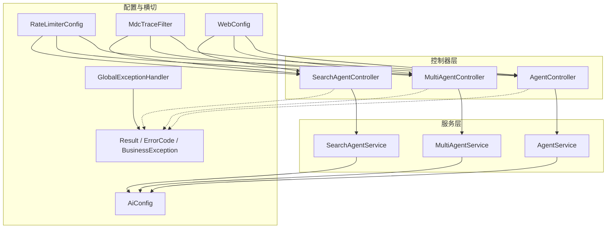
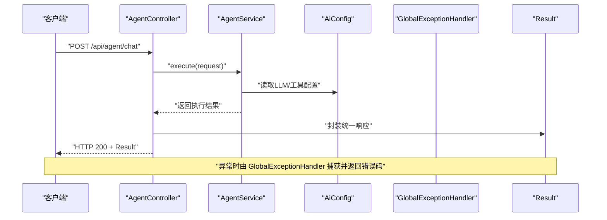
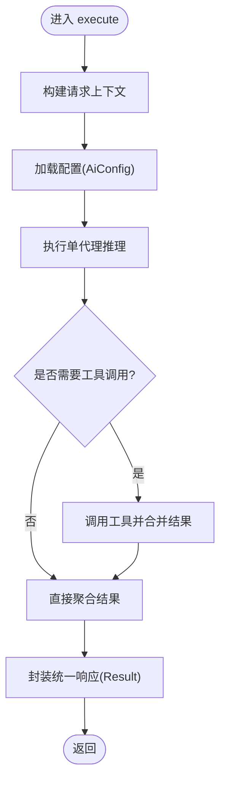
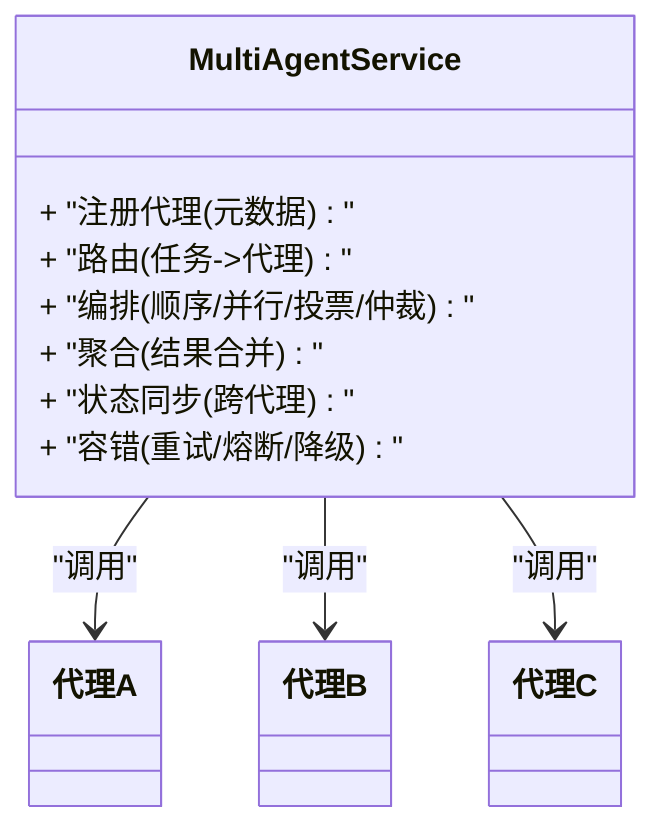
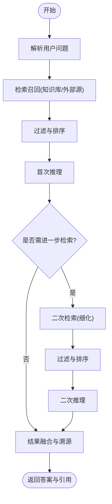
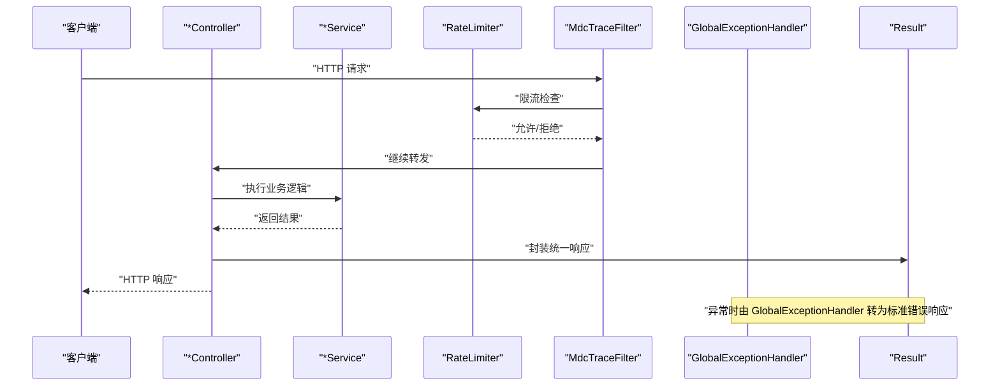
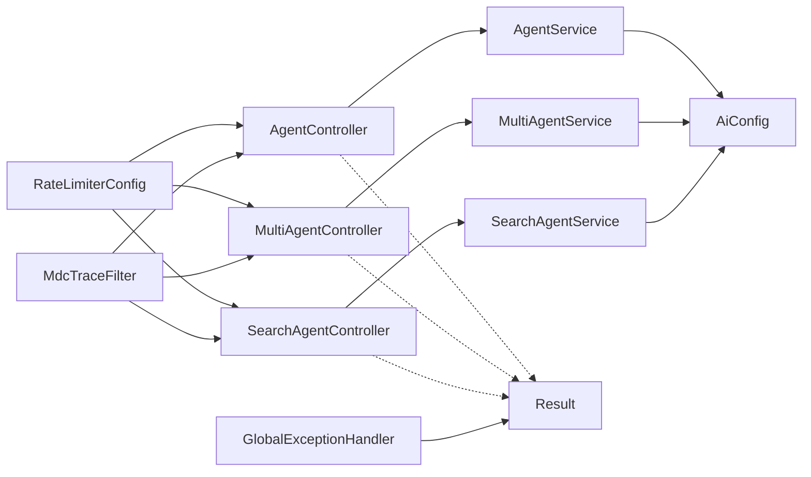

# 智能代理框架

<cite>
**本文引用的文件**   
- [AgentService.java](file://src/main/java/com/ailearn/agent/AgentService.java)
- [AgentController.java](file://src/main/java/com/ailearn/agent/AgentController.java)
- [MultiAgentService.java](file://src/main/java/com/ailearn/agent/MultiAgentService.java)
- [MultiAgentController.java](file://src/main/java/com/ailearn/agent/MultiAgentController.java)
- [SearchAgentService.java](file://src/main/java/com/ailearn/agent/SearchAgentService.java)
- [SearchAgentController.java](file://src/main/java/com/ailearn/agent/SearchAgentController.java)
- [AiConfig.java](file://src/main/java/com/ailearn/config/AiConfig.java)
- [RateLimiterConfig.java](file://src/main/java/com/ailearn/config/RateLimiterConfig.java)
- [MdcTraceFilter.java](file://src/main/java/com/ailearn/config/MdcTraceFilter.java)
- [GlobalExceptionHandler.java](file://src/main/java/com/ailearn/common/GlobalExceptionHandler.java)
- [BusinessException.java](file://src/main/java/com/ailearn/common/BusinessException.java)
- [ErrorCode.java](file://src/main/java/com/ailearn/common/ErrorCode.java)
- [Result.java](file://src/main/java/com/ailearn/common/Result.java)
- [WebConfig.java](file://src/main/java/com/ailearn/config/WebConfig.java)
- [application.yml](file://src/main/resources/application.yml)
</cite>

## 目录
1. [简介](#简介)
2. [项目结构](#项目结构)
3. [核心组件](#核心组件)
4. [架构总览](#架构总览)
5. [详细组件分析](#详细组件分析)
6. [依赖关系分析](#依赖关系分析)
7. [性能考虑](#性能考虑)
8. [故障排查指南](#故障排查指南)
9. [结论](#结论)
10. [附录](#附录)

## 简介
本文件面向“智能代理框架”的后端实现，围绕三种典型模式进行系统化说明：
- 单代理模式：单一 Agent 完成端到端的任务处理。
- 多代理协作模式：多个 Agent 通过通信协议与协调算法共同完成任务。
- 搜索增强代理模式：在推理过程中引入知识检索（RAG）以增强回答质量。

文档重点覆盖：
- AgentService 的核心服务职责、代理生命周期管理与任务调度机制
- MultiAgentService 的通信协议与协调算法
- SearchAgentService 的知识检索与推理流程
- 每种模式的 API 接口定义与使用示例
- 配置参数、执行策略与结果聚合机制
- 状态同步与错误处理策略
- 自定义代理扩展指南与最佳实践

## 项目结构
后端采用分层组织方式，agent 包提供三类代理能力，config 包提供运行时配置与横切关注点，common 包提供统一响应与异常模型。

图表来源
- [AgentController.java](file://src/main/java/com/ailearn/agent/AgentController.java)
- [AgentService.java](file://src/main/java/com/ailearn/agent/AgentService.java)
- [MultiAgentController.java](file://src/main/java/com/ailearn/agent/MultiAgentController.java)
- [MultiAgentService.java](file://src/main/java/com/ailearn/agent/MultiAgentService.java)
- [SearchAgentController.java](file://src/main/java/com/ailearn/agent/SearchAgentController.java)
- [SearchAgentService.java](file://src/main/java/com/ailearn/agent/SearchAgentService.java)
- [AiConfig.java](file://src/main/java/com/ailearn/config/AiConfig.java)
- [RateLimiterConfig.java](file://src/main/java/com/ailearn/config/RateLimiterConfig.java)
- [MdcTraceFilter.java](file://src/main/java/com/ailearn/config/MdcTraceFilter.java)
- [GlobalExceptionHandler.java](file://src/main/java/com/ailearn/common/GlobalExceptionHandler.java)
- [Result.java](file://src/main/java/com/ailearn/common/Result.java)
- [ErrorCode.java](file://src/main/java/com/ailearn/common/ErrorCode.java)
- [BusinessException.java](file://src/main/java/com/ailearn/common/BusinessException.java)
- [WebConfig.java](file://src/main/java/com/ailearn/config/WebConfig.java)

章节来源
- [AgentController.java](file://src/main/java/com/ailearn/agent/AgentController.java)
- [AgentService.java](file://src/main/java/com/ailearn/agent/AgentService.java)
- [MultiAgentController.java](file://src/main/java/com/ailearn/agent/MultiAgentController.java)
- [MultiAgentService.java](file://src/main/java/com/ailearn/agent/MultiAgentService.java)
- [SearchAgentController.java](file://src/main/java/com/ailearn/agent/SearchAgentController.java)
- [SearchAgentService.java](file://src/main/java/com/ailearn/agent/SearchAgentService.java)
- [AiConfig.java](file://src/main/java/com/ailearn/config/AiConfig.java)
- [RateLimiterConfig.java](file://src/main/java/com/ailearn/config/RateLimiterConfig.java)
- [MdcTraceFilter.java](file://src/main/java/com/ailearn/config/MdcTraceFilter.java)
- [GlobalExceptionHandler.java](file://src/main/java/com/ailearn/common/GlobalExceptionHandler.java)
- [Result.java](file://src/main/java/com/ailearn/common/Result.java)
- [ErrorCode.java](file://src/main/java/com/ailearn/common/ErrorCode.java)
- [BusinessException.java](file://src/main/java/com/ailearn/common/BusinessException.java)
- [WebConfig.java](file://src/main/java/com/ailearn/config/WebConfig.java)

## 核心组件
- AgentService：单代理服务的核心编排器，负责代理实例的生命周期管理、任务入队与调度、上下文维护以及结果返回。
- MultiAgentService：多代理协作框架，负责多 Agent 的注册、路由、消息分发、协调与结果聚合。
- SearchAgentService：搜索增强代理，将检索步骤嵌入推理流程，支持检索-推理闭环。
- 控制器层：为上述服务暴露 RESTful 接口，承载请求校验、限流、追踪与统一响应封装。
- 配置与横切：AiConfig 提供 LLM/RAG 等外部能力接入；RateLimiterConfig 提供速率限制；MdcTraceFilter 提供链路追踪；GlobalExceptionHandler 统一异常处理。

章节来源
- [AgentService.java](file://src/main/java/com/ailearn/agent/AgentService.java)
- [MultiAgentService.java](file://src/main/java/com/ailearn/agent/MultiAgentService.java)
- [SearchAgentService.java](file://src/main/java/com/ailearn/agent/SearchAgentService.java)
- [AiConfig.java](file://src/main/java/com/ailearn/config/AiConfig.java)
- [RateLimiterConfig.java](file://src/main/java/com/ailearn/config/RateLimiterConfig.java)
- [MdcTraceFilter.java](file://src/main/java/com/ailearn/config/MdcTraceFilter.java)
- [GlobalExceptionHandler.java](file://src/main/java/com/ailearn/common/GlobalExceptionHandler.java)

## 架构总览
整体采用“控制器-服务-配置/横切”的分层架构。控制器负责 HTTP 边界，服务层承载业务编排，配置与横切模块贯穿全链路。

图表来源
- [AgentController.java](file://src/main/java/com/ailearn/agent/AgentController.java)
- [AgentService.java](file://src/main/java/com/ailearn/agent/AgentService.java)
- [AiConfig.java](file://src/main/java/com/ailearn/config/AiConfig.java)
- [GlobalExceptionHandler.java](file://src/main/java/com/ailearn/common/GlobalExceptionHandler.java)
- [Result.java](file://src/main/java/com/ailearn/common/Result.java)

## 详细组件分析

### 单代理模式（AgentService）
- 职责
  - 代理生命周期：初始化、预热、运行、清理。
  - 任务调度：接收请求、构建上下文、调用外部能力（LLM/工具）、聚合结果。
  - 上下文管理：会话级或请求级上下文维护。
- 关键流程
  - 入口：控制器接收请求，校验参数，调用服务。
  - 执行：根据配置选择模型/工具，执行推理，必要时调用工具链。
  - 输出：统一封装响应，记录追踪信息。
- 错误处理
  - 业务异常转换为标准错误码与消息。
  - 全局异常处理器兜底，保证一致的错误响应格式。

图表来源
- [AgentService.java](file://src/main/java/com/ailearn/agent/AgentService.java)
- [AiConfig.java](file://src/main/java/com/ailearn/config/AiConfig.java)
- [Result.java](file://src/main/java/com/ailearn/common/Result.java)

章节来源
- [AgentService.java](file://src/main/java/com/ailearn/agent/AgentService.java)
- [AgentController.java](file://src/main/java/com/ailearn/agent/AgentController.java)
- [AiConfig.java](file://src/main/java/com/ailearn/config/AiConfig.java)
- [Result.java](file://src/main/java/com/ailearn/common/Result.java)
- [GlobalExceptionHandler.java](file://src/main/java/com/ailearn/common/GlobalExceptionHandler.java)

### 多代理协作模式（MultiAgentService）
- 职责
  - 多 Agent 注册与发现：维护可用代理清单与元数据。
  - 通信协议：定义消息结构、路由键、版本兼容与重试策略。
  - 协调算法：按策略（顺序/并行/投票/仲裁）组合子任务并聚合结果。
  - 状态同步：跨代理的状态传播与一致性保障。
- 关键流程
  - 任务分解：将复杂任务拆分为子任务，分配给不同 Agent。
  - 执行编排：串行、并行或条件分支执行。
  - 结果聚合：汇总各 Agent 输出，必要时二次协商或仲裁。
- 错误处理
  - 局部失败隔离与重试，超时熔断，降级回退到备选策略。

图表来源
- [MultiAgentService.java](file://src/main/java/com/ailearn/agent/MultiAgentService.java)
- [MultiAgentController.java](file://src/main/java/com/ailearn/agent/MultiAgentController.java)

章节来源
- [MultiAgentService.java](file://src/main/java/com/ailearn/agent/MultiAgentService.java)
- [MultiAgentController.java](file://src/main/java/com/ailearn/agent/MultiAgentController.java)

### 搜索增强代理模式（SearchAgentService）
- 职责
  - 检索阶段：根据查询意图检索知识库或外部源，生成候选片段。
  - 推理阶段：结合检索结果进行推理，必要时迭代检索。
  - 结果融合：去重、排序、摘要，形成最终答案。
- 关键流程
  - 意图识别与查询改写。
  - 检索召回与过滤。
  - 检索-推理闭环（可多次迭代）。
  - 结果聚合与溯源标注。

图表来源
- [SearchAgentService.java](file://src/main/java/com/ailearn/agent/SearchAgentService.java)
- [SearchAgentController.java](file://src/main/java/com/ailearn/agent/SearchAgentController.java)

章节来源
- [SearchAgentService.java](file://src/main/java/com/ailearn/agent/SearchAgentService.java)
- [SearchAgentController.java](file://src/main/java/com/ailearn/agent/SearchAgentController.java)

### 控制器与统一响应
- 控制器职责
  - 接收请求、参数校验、限流拦截、链路追踪注入。
  - 调用对应 Service，封装统一响应 Result。
- 统一响应与异常
  - Result 提供成功/失败的标准结构。
  - GlobalExceptionHandler 捕获业务与非业务异常，映射为 ErrorCode 与友好消息。

图表来源
- [AgentController.java](file://src/main/java/com/ailearn/agent/AgentController.java)
- [MultiAgentController.java](file://src/main/java/com/ailearn/agent/MultiAgentController.java)
- [SearchAgentController.java](file://src/main/java/com/ailearn/agent/SearchAgentController.java)
- [RateLimiterConfig.java](file://src/main/java/com/ailearn/config/RateLimiterConfig.java)
- [MdcTraceFilter.java](file://src/main/java/com/ailearn/config/MdcTraceFilter.java)
- [GlobalExceptionHandler.java](file://src/main/java/com/ailearn/common/GlobalExceptionHandler.java)
- [Result.java](file://src/main/java/com/ailearn/common/Result.java)

章节来源
- [AgentController.java](file://src/main/java/com/ailearn/agent/AgentController.java)
- [MultiAgentController.java](file://src/main/java/com/ailearn/agent/MultiAgentController.java)
- [SearchAgentController.java](file://src/main/java/com/ailearn/agent/SearchAgentController.java)
- [RateLimiterConfig.java](file://src/main/java/com/ailearn/config/RateLimiterConfig.java)
- [MdcTraceFilter.java](file://src/main/java/com/ailearn/config/MdcTraceFilter.java)
- [GlobalExceptionHandler.java](file://src/main/java/com/ailearn/common/GlobalExceptionHandler.java)
- [Result.java](file://src/main/java/com/ailearn/common/Result.java)

## 依赖关系分析
- 控制器与服务解耦：控制器仅做边界处理，服务承载核心编排。
- 配置集中化：AiConfig 统一管理外部能力接入参数，便于环境切换与灰度。
- 横切关注点：限流、追踪、异常处理贯穿所有控制器。

图表来源
- [AgentController.java](file://src/main/java/com/ailearn/agent/AgentController.java)
- [AgentService.java](file://src/main/java/com/ailearn/agent/AgentService.java)
- [MultiAgentController.java](file://src/main/java/com/ailearn/agent/MultiAgentController.java)
- [MultiAgentService.java](file://src/main/java/com/ailearn/agent/MultiAgentService.java)
- [SearchAgentController.java](file://src/main/java/com/ailearn/agent/SearchAgentController.java)
- [SearchAgentService.java](file://src/main/java/com/ailearn/agent/SearchAgentService.java)
- [AiConfig.java](file://src/main/java/com/ailearn/config/AiConfig.java)
- [RateLimiterConfig.java](file://src/main/java/com/ailearn/config/RateLimiterConfig.java)
- [MdcTraceFilter.java](file://src/main/java/com/ailearn/config/MdcTraceFilter.java)
- [GlobalExceptionHandler.java](file://src/main/java/com/ailearn/common/GlobalExceptionHandler.java)
- [Result.java](file://src/main/java/com/ailearn/common/Result.java)

章节来源
- [AgentController.java](file://src/main/java/com/ailearn/agent/AgentController.java)
- [AgentService.java](file://src/main/java/com/ailearn/agent/AgentService.java)
- [MultiAgentController.java](file://src/main/java/com/ailearn/agent/MultiAgentController.java)
- [MultiAgentService.java](file://src/main/java/com/ailearn/agent/MultiAgentService.java)
- [SearchAgentController.java](file://src/main/java/com/ailearn/agent/SearchAgentController.java)
- [SearchAgentService.java](file://src/main/java/com/ailearn/agent/SearchAgentService.java)
- [AiConfig.java](file://src/main/java/com/ailearn/config/AiConfig.java)
- [RateLimiterConfig.java](file://src/main/java/com/ailearn/config/RateLimiterConfig.java)
- [MdcTraceFilter.java](file://src/main/java/com/ailearn/config/MdcTraceFilter.java)
- [GlobalExceptionHandler.java](file://src/main/java/com/ailearn/common/GlobalExceptionHandler.java)
- [Result.java](file://src/main/java/com/ailearn/common/Result.java)

## 性能考虑
- 并发与限流
  - 通过 RateLimiterConfig 对热点接口进行速率限制，避免雪崩。
  - 合理设置线程池大小与队列容量，平衡吞吐与延迟。
- 缓存与复用
  - 对频繁使用的检索片段或中间结果进行缓存，减少重复计算。
  - 对 LLM 调用结果进行短期缓存，降低外部依赖压力。
- 批处理与流水线
  - 多代理场景下，尽量并行执行独立子任务，缩短端到端时延。
  - 搜索增强代理可采用增量检索与早停策略，减少无效迭代。
- 资源与连接
  - 外部服务连接池复用，避免频繁握手开销。
  - 大文本输入分块处理，控制单次请求体大小。

[本节为通用性能建议，不直接分析具体文件]

## 故障排查指南
- 统一异常处理
  - GlobalExceptionHandler 捕获未处理异常，转换为标准错误响应，便于前端统一提示。
  - 业务异常通过 BusinessException 携带 ErrorCode，确保错误语义清晰。
- 链路追踪
  - MdcTraceFilter 注入追踪 ID，便于日志定位与问题复现。
- 限流与熔断
  - RateLimiterConfig 触发限流时，应返回明确错误码与重试建议。
  - 多代理场景下，单个代理失败不应阻塞整体流程，需具备降级与回退策略。
- 常见问题
  - 外部依赖不可用：检查 AiConfig 中相关配置项与网络连通性。
  - 参数校验失败：核对请求体字段类型与必填项。
  - 结果不一致：检查多代理协调策略与结果聚合逻辑。

章节来源
- [GlobalExceptionHandler.java](file://src/main/java/com/ailearn/common/GlobalExceptionHandler.java)
- [BusinessException.java](file://src/main/java/com/ailearn/common/BusinessException.java)
- [ErrorCode.java](file://src/main/java/com/ailearn/common/ErrorCode.java)
- [MdcTraceFilter.java](file://src/main/java/com/ailearn/config/MdcTraceFilter.java)
- [RateLimiterConfig.java](file://src/main/java/com/ailearn/config/RateLimiterConfig.java)

## 结论
本框架以清晰的层次划分与可扩展的服务设计，支撑单代理、多代理协作与搜索增强代理三种模式。通过统一的配置、限流、追踪与异常处理，保证了系统的稳定性与可观测性。后续可在多代理协调策略与检索-推理闭环上持续优化，以提升复杂任务的完成率与响应时效。

[本节为总结性内容，不直接分析具体文件]

## 附录

### API 接口文档（示例）
- 单代理聊天
  - 方法：POST
  - 路径：/api/agent/chat
  - 请求体：包含用户问题、可选上下文与策略参数
  - 响应：统一 Result 包装，包含答案与元数据
- 多代理协作
  - 方法：POST
  - 路径：/api/multi-agent/chat
  - 请求体：包含任务描述、子任务拆分与协调策略
  - 响应：统一 Result 包装，包含聚合结果与各代理贡献摘要
- 搜索增强代理
  - 方法：POST
  - 路径：/api/search-agent/chat
  - 请求体：包含问题、检索范围与迭代次数上限
  - 响应：统一 Result 包装，包含答案与引用来源

章节来源
- [AgentController.java](file://src/main/java/com/ailearn/agent/AgentController.java)
- [MultiAgentController.java](file://src/main/java/com/ailearn/agent/MultiAgentController.java)
- [SearchAgentController.java](file://src/main/java/com/ailearn/agent/SearchAgentController.java)
- [Result.java](file://src/main/java/com/ailearn/common/Result.java)

### 配置参数参考
- AiConfig
  - 用途：集中管理 LLM、工具、检索等外部能力接入参数
  - 常见项：模型名称、API 密钥、超时、重试次数、检索源地址等
- RateLimiterConfig
  - 用途：定义接口级限流阈值与窗口大小
- WebConfig
  - 用途：跨域、静态资源、拦截器注册等 Web 层配置
- application.yml
  - 用途：应用级配置与环境变量注入

章节来源
- [AiConfig.java](file://src/main/java/com/ailearn/config/AiConfig.java)
- [RateLimiterConfig.java](file://src/main/java/com/ailearn/config/RateLimiterConfig.java)
- [WebConfig.java](file://src/main/java/com/ailearn/config/WebConfig.java)
- [application.yml](file://src/main/resources/application.yml)

### 执行策略与结果聚合
- 执行策略
  - 顺序执行：适用于强依赖的子任务。
  - 并行执行：适用于独立子任务，提升吞吐。
  - 条件分支：根据中间结果动态选择后续路径。
- 结果聚合
  - 简单拼接：适用于无冲突的输出。
  - 投票/仲裁：多代理输出冲突时，采用多数票或权威代理裁决。
  - 去重与排序：基于相似度与相关性进行筛选。

章节来源
- [MultiAgentService.java](file://src/main/java/com/ailearn/agent/MultiAgentService.java)

### 状态同步与错误处理策略
- 状态同步
  - 使用共享上下文传递中间状态，确保跨代理可见性。
  - 对关键状态变更进行幂等处理，避免重复执行导致副作用。
- 错误处理
  - 局部失败隔离：单个代理失败不影响其他分支。
  - 重试与退避：对瞬时错误进行指数退避重试。
  - 熔断与降级：当错误率超过阈值，快速失败并启用降级策略。

章节来源
- [MultiAgentService.java](file://src/main/java/com/ailearn/agent/MultiAgentService.java)
- [GlobalExceptionHandler.java](file://src/main/java/com/ailearn/common/GlobalExceptionHandler.java)

### 自定义代理开发指南与最佳实践
- 开发步骤
  - 定义代理接口与能力契约（输入/输出/错误码）。
  - 实现代理逻辑，遵循幂等与可观测性原则。
  - 注册到 MultiAgentService，声明元数据与路由键。
- 最佳实践
  - 小步快跑：将复杂任务拆分为细粒度子任务。
  - 可观测性：记录关键指标与追踪 ID，便于排障。
  - 安全与合规：对外部调用进行鉴权与审计。
  - 性能优先：合理使用缓存与批处理，避免不必要的 I/O。

章节来源
- [MultiAgentService.java](file://src/main/java/com/ailearn/agent/MultiAgentService.java)
- [AiConfig.java](file://src/main/java/com/ailearn/config/AiConfig.java)