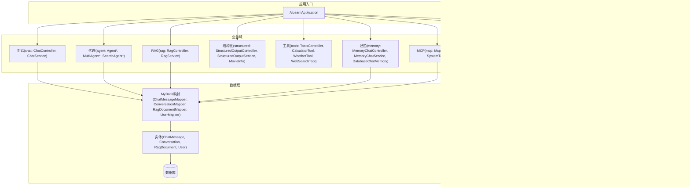
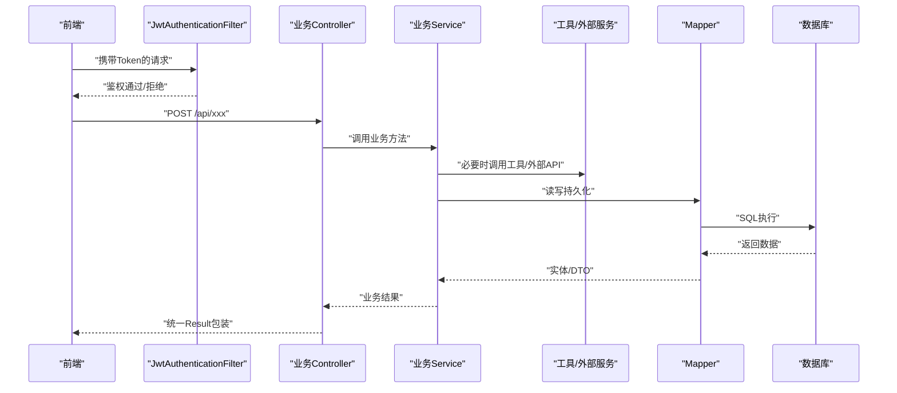
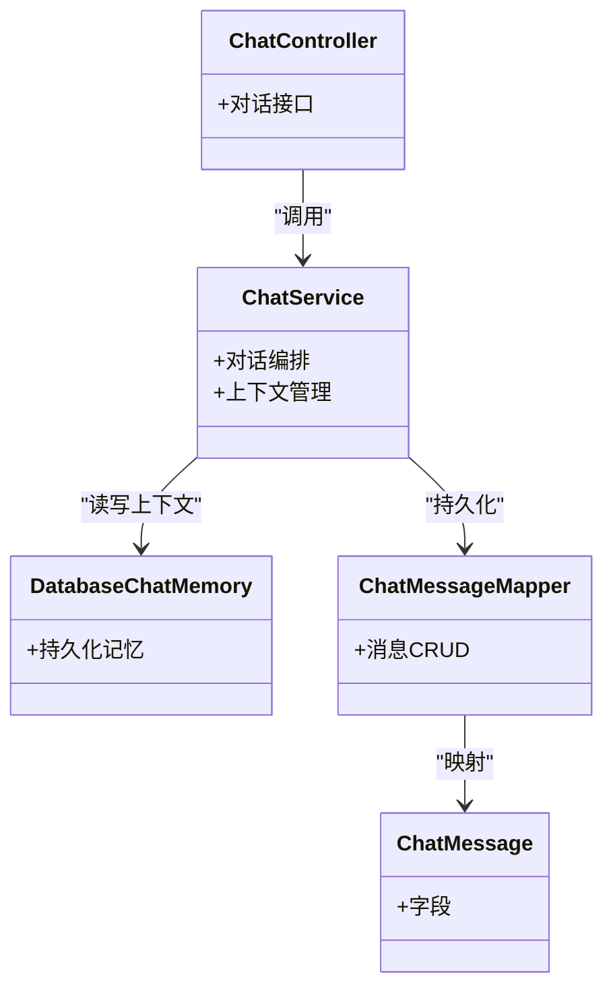
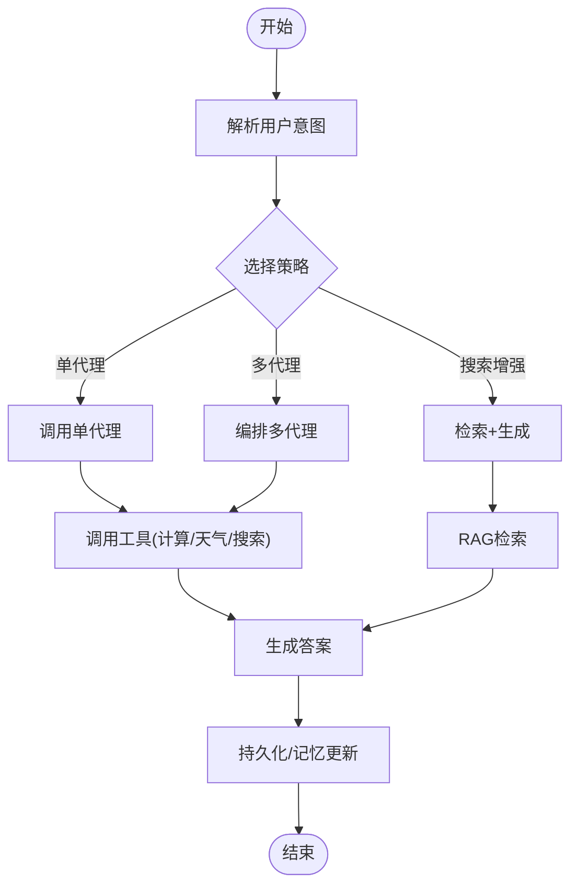
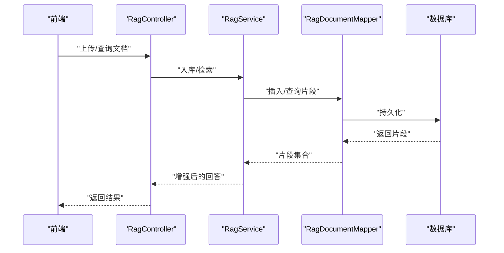
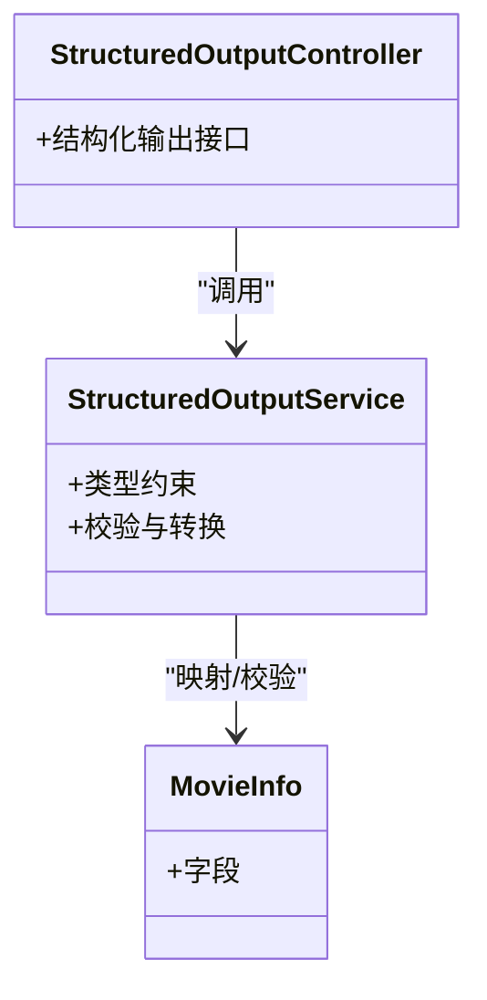
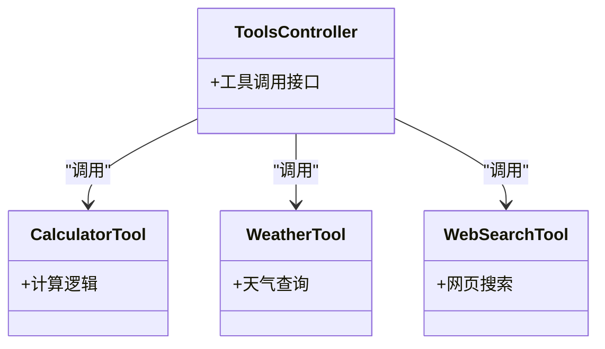
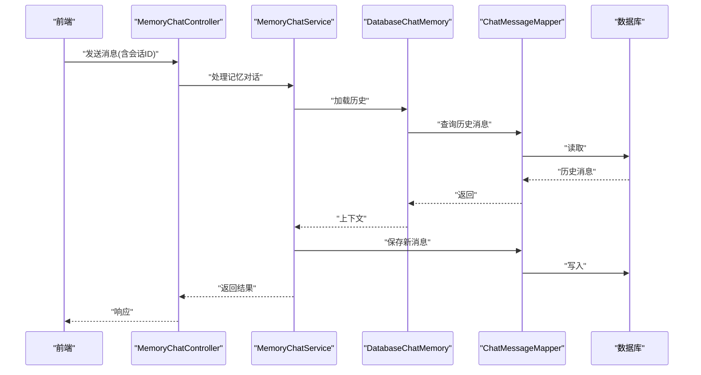
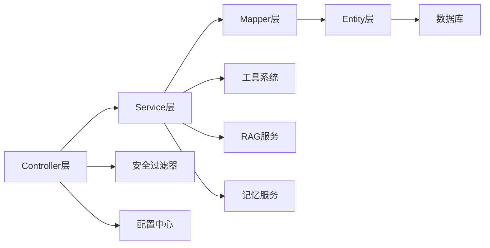

# 核心功能模块

<cite>
**本文引用的文件**   
- [AiLearnApplication.java](file://src/main/java/com/ailearn/AiLearnApplication.java)
- [application.yml](file://src/main/resources/application.yml)
- [schema.sql](file://src/main/resources/schema.sql)
- [ChatController.java](file://src/main/java/com/ailearn/chat/ChatController.java)
- [ChatService.java](file://src/main/java/com/ailearn/chat/ChatService.java)
- [AgentController.java](file://src/main/java/com/ailearn/agent/AgentController.java)
- [AgentService.java](file://src/main/java/com/ailearn/agent/AgentService.java)
- [MultiAgentController.java](file://src/main/java/com/ailearn/agent/MultiAgentController.java)
- [MultiAgentService.java](file://src/main/java/com/ailearn/agent/MultiAgentService.java)
- [SearchAgentController.java](file://src/main/java/com/ailearn/agent/SearchAgentController.java)
- [SearchAgentService.java](file://src/main/java/com/ailearn/agent/SearchAgentService.java)
- [RagController.java](file://src/main/java/com/ailearn/rag/RagController.java)
- [RagService.java](file://src/main/java/com/ailearn/rag/RagService.java)
- [StructuredOutputController.java](file://src/main/java/com/ailearn/structured/StructuredOutputController.java)
- [StructuredOutputService.java](file://src/main/java/com/ailearn/structured/StructuredOutputService.java)
- [MovieInfo.java](file://src/main/java/com/ailearn/structured/MovieInfo.java)
- [ToolsController.java](file://src/main/java/com/ailearn/tools/ToolsController.java)
- [CalculatorTool.java](file://src/main/java/com/ailearn/tools/CalculatorTool.java)
- [WeatherTool.java](file://src/main/java/com/ailearn/tools/WeatherTool.java)
- [WebSearchTool.java](file://src/main/java/com/ailearn/tools/WebSearchTool.java)
- [MemoryChatController.java](file://src/main/java/com/ailearn/memory/MemoryChatController.java)
- [MemoryChatService.java](file://src/main/java/com/ailearn/memory/MemoryChatService.java)
- [DatabaseChatMemory.java](file://src/main/java/com/ailearn/memory/DatabaseChatMemory.java)
- [McpController.java](file://src/main/java/com/ailearn/mcp/McpController.java)
- [SystemTools.java](file://src/main/java/com/ailearn/mcp/SystemTools.java)
- [AiConfig.java](file://src/main/java/com/ailearn/config/AiConfig.java)
- [McpServerConfig.java](file://src/main/java/com/ailearn/config/McpServerConfig.java)
- [RateLimiterConfig.java](file://src/main/java/com/ailearn/config/RateLimiterConfig.java)
- [GlobalExceptionHandler.java](file://src/main/java/com/ailearn/common/GlobalExceptionHandler.java)
- [Result.java](file://src/main/java/com/ailearn/common/Result.java)
- [BusinessException.java](file://src/main/java/com/ailearn/common/BusinessException.java)
- [ErrorCode.java](file://src/main/java/com/ailearn/common/ErrorCode.java)
- [JwtAuthenticationFilter.java](file://src/main/java/com/ailearn/security/JwtAuthenticationFilter.java)
- [JwtUtil.java](file://src/main/java/com/ailearn/security/JwtUtil.java)
- [SecurityConfig.java](file://src/main/java/com/ailearn/security/SecurityConfig.java)
- [UserPrincipal.java](file://src/main/java/com/ailearn/security/UserPrincipal.java)
- [ConversationService.java](file://src/main/java/com/ailearn/service/ConversationService.java)
- [UserService.java](file://src/main/java/com/ailearn/service/UserService.java)
- [ChatMessageMapper.java](file://src/main/java/com/ailearn/mapper/ChatMessageMapper.java)
- [ConversationMapper.java](file://src/main/java/com/ailearn/mapper/ConversationMapper.java)
- [RagDocumentMapper.java](file://src/main/java/com/ailearn/mapper/RagDocumentMapper.java)
- [UserMapper.java](file://src/main/java/com/ailearn/mapper/UserMapper.java)
- [ChatMessage.java](file://src/main/java/com/ailearn/entity/ChatMessage.java)
- [Conversation.java](file://src/main/java/com/ailearn/entity/Conversation.java)
- [RagDocument.java](file://src/main/java/com/ailearn/entity/RagDocument.java)
- [User.java](file://src/main/java/com/ailearn/entity/User.java)
</cite>

## 目录
1. [简介](#简介)
2. [项目结构](#项目结构)
3. [核心组件](#核心组件)
4. [架构总览](#架构总览)
5. [详细组件分析](#详细组件分析)
6. [依赖关系分析](#依赖关系分析)
7. [性能与扩展性](#性能与扩展性)
8. [故障排查指南](#故障排查指南)
9. [结论](#结论)
10. [附录：接口与配置要点](#附录接口与配置要点)

## 简介
本仓库是一个面向AI学习的Java平台，提供对话、智能代理、RAG知识库、结构化输出、工具系统、记忆与会话、MCP集成等能力。后端基于Spring生态，结合数据库持久化与安全控制，前端通过REST API与后端交互。本文聚焦后端核心功能模块，梳理各模块职责、协作关系、数据流转、接口与配置方式、扩展点以及适用场景与性能特征，帮助开发者快速选型与集成。

## 项目结构
后端采用按领域分层组织：controller-service-mapper-entity，配合公共组件（异常、结果封装、安全、配置）与特性模块（chat、agent、rag、structured、tools、memory、mcp）。

图表来源
- [AiLearnApplication.java](file://src/main/java/com/ailearn/AiLearnApplication.java)
- [AiConfig.java](file://src/main/java/com/ailearn/config/AiConfig.java)
- [McpServerConfig.java](file://src/main/java/com/ailearn/config/McpServerConfig.java)
- [RateLimiterConfig.java](file://src/main/java/com/ailearn/config/RateLimiterConfig.java)
- [ChatController.java](file://src/main/java/com/ailearn/chat/ChatController.java)
- [AgentController.java](file://src/main/java/com/ailearn/agent/AgentController.java)
- [RagController.java](file://src/main/java/com/ailearn/rag/RagController.java)
- [StructuredOutputController.java](file://src/main/java/com/ailearn/structured/StructuredOutputController.java)
- [ToolsController.java](file://src/main/java/com/ailearn/tools/ToolsController.java)
- [MemoryChatController.java](file://src/main/java/com/ailearn/memory/MemoryChatController.java)
- [McpController.java](file://src/main/java/com/ailearn/mcp/McpController.java)
- [ChatMessageMapper.java](file://src/main/java/com/ailearn/mapper/ChatMessageMapper.java)
- [ConversationMapper.java](file://src/main/java/com/ailearn/mapper/ConversationMapper.java)
- [RagDocumentMapper.java](file://src/main/java/com/ailearn/mapper/RagDocumentMapper.java)
- [UserMapper.java](file://src/main/java/com/ailearn/mapper/UserMapper.java)
- [ChatMessage.java](file://src/main/java/com/ailearn/entity/ChatMessage.java)
- [Conversation.java](file://src/main/java/com/ailearn/entity/Conversation.java)
- [RagDocument.java](file://src/main/java/com/ailearn/entity/RagDocument.java)
- [User.java](file://src/main/java/com/ailearn/entity/User.java)

章节来源
- [AiLearnApplication.java](file://src/main/java/com/ailearn/AiLearnApplication.java)
- [application.yml](file://src/main/resources/application.yml)
- [schema.sql](file://src/main/resources/schema.sql)

## 核心组件
- 对话服务：提供基础LLM对话能力，支持会话上下文与消息持久化。
- 智能代理框架：封装单代理、多代理编排与搜索增强代理，便于组合工具与外部知识。
- RAG知识库：文档入库、检索与生成增强，提升回答准确性与可溯源性。
- 结构化输出：将模型输出约束为强类型对象，便于下游消费。
- 工具系统：计算器、天气、网页搜索等工具注册与调用，供代理或对话使用。
- 记忆与会话：基于数据库的聊天记忆，实现跨请求上下文保持。
- MCP集成：对外暴露系统工具，支持协议化接入。

章节来源
- [ChatController.java](file://src/main/java/com/ailearn/chat/ChatController.java)
- [ChatService.java](file://src/main/java/com/ailearn/chat/ChatService.java)
- [AgentController.java](file://src/main/java/com/ailearn/agent/AgentController.java)
- [AgentService.java](file://src/main/java/com/ailearn/agent/AgentService.java)
- [MultiAgentController.java](file://src/main/java/com/ailearn/agent/MultiAgentController.java)
- [MultiAgentService.java](file://src/main/java/com/ailearn/agent/MultiAgentService.java)
- [SearchAgentController.java](file://src/main/java/com/ailearn/agent/SearchAgentController.java)
- [SearchAgentService.java](file://src/main/java/com/ailearn/agent/SearchAgentService.java)
- [RagController.java](file://src/main/java/com/ailearn/rag/RagController.java)
- [RagService.java](file://src/main/java/com/ailearn/rag/RagService.java)
- [StructuredOutputController.java](file://src/main/java/com/ailearn/structured/StructuredOutputController.java)
- [StructuredOutputService.java](file://src/main/java/com/ailearn/structured/StructuredOutputService.java)
- [MovieInfo.java](file://src/main/java/com/ailearn/structured/MovieInfo.java)
- [ToolsController.java](file://src/main/java/com/ailearn/tools/ToolsController.java)
- [CalculatorTool.java](file://src/main/java/com/ailearn/tools/CalculatorTool.java)
- [WeatherTool.java](file://src/main/java/com/ailearn/tools/WeatherTool.java)
- [WebSearchTool.java](file://src/main/java/com/ailearn/tools/WebSearchTool.java)
- [MemoryChatController.java](file://src/main/java/com/ailearn/memory/MemoryChatController.java)
- [MemoryChatService.java](file://src/main/java/com/ailearn/memory/MemoryChatService.java)
- [DatabaseChatMemory.java](file://src/main/java/com/ailearn/memory/DatabaseChatMemory.java)
- [McpController.java](file://src/main/java/com/ailearn/mcp/McpController.java)
- [SystemTools.java](file://src/main/java/com/ailearn/mcp/SystemTools.java)

## 架构总览
整体采用“控制器-服务-映射-实体”的分层架构，结合安全过滤、全局异常处理与限流配置。关键流程包括：
- 请求进入：过滤器鉴权 -> 控制器路由 -> 服务编排 -> 工具/RAG/记忆调用 -> 持久化 -> 统一响应。
- 数据流向：前端HTTP -> Controller -> Service -> Mapper -> Entity -> 数据库；同时Service可调用工具与外部服务。

图表来源
- [JwtAuthenticationFilter.java](file://src/main/java/com/ailearn/security/JwtAuthenticationFilter.java)
- [ChatController.java](file://src/main/java/com/ailearn/chat/ChatController.java)
- [ChatService.java](file://src/main/java/com/ailearn/chat/ChatService.java)
- [ChatMessageMapper.java](file://src/main/java/com/ailearn/mapper/ChatMessageMapper.java)
- [ChatMessage.java](file://src/main/java/com/ailearn/entity/ChatMessage.java)
- [schema.sql](file://src/main/resources/schema.sql)

## 详细组件分析

### 对话系统（Chat）
- 职责：接收用户输入，维护会话上下文，调用AI模型并返回文本回复；可选地持久化消息。
- 关键类：
  - 控制器：定义对话相关REST端点。
  - 服务：编排对话流程，管理上下文与持久化。
  - 记忆：基于数据库的聊天记忆，保证跨请求上下文一致性。
- 数据流：请求 -> 鉴权 -> 控制器 -> 服务 -> 记忆/持久化 -> 返回。
- 扩展点：
  - 替换记忆实现以适配不同存储。
  - 在Service中注入自定义Prompt模板或后处理器。
- 适用场景：通用问答、客服机器人、学习助手。
- 性能特点：I/O密集，建议开启连接池与缓存策略；对长上下文需关注内存占用。

图表来源
- [ChatController.java](file://src/main/java/com/ailearn/chat/ChatController.java)
- [ChatService.java](file://src/main/java/com/ailearn/chat/ChatService.java)
- [DatabaseChatMemory.java](file://src/main/java/com/ailearn/memory/DatabaseChatMemory.java)
- [ChatMessageMapper.java](file://src/main/java/com/ailearn/mapper/ChatMessageMapper.java)
- [ChatMessage.java](file://src/main/java/com/ailearn/entity/ChatMessage.java)

章节来源
- [ChatController.java](file://src/main/java/com/ailearn/chat/ChatController.java)
- [ChatService.java](file://src/main/java/com/ailearn/chat/ChatService.java)
- [MemoryChatController.java](file://src/main/java/com/ailearn/memory/MemoryChatController.java)
- [MemoryChatService.java](file://src/main/java/com/ailearn/memory/MemoryChatService.java)
- [DatabaseChatMemory.java](file://src/main/java/com/ailearn/memory/DatabaseChatMemory.java)
- [ChatMessageMapper.java](file://src/main/java/com/ailearn/mapper/ChatMessageMapper.java)
- [ChatMessage.java](file://src/main/java/com/ailearn/entity/ChatMessage.java)

### 智能代理框架（Agent）
- 职责：封装单代理、多代理编排与搜索增强代理，支持工具调用与外部知识融合。
- 关键类：
  - 单代理：AgentController/AgentService。
  - 多代理：MultiAgentController/MultiAgentService。
  - 搜索增强：SearchAgentController/SearchAgentService。
- 协作关系：
  - 代理可组合工具（计算器、天气、搜索）与RAG检索。
  - 多代理可并行或串行编排多个子代理完成复杂任务。
- 扩展点：
  - 新增工具类并注册到工具管理器。
  - 自定义代理编排策略（路由、负载均衡、重试）。
- 适用场景：复杂任务分解、自动化工作流、研究助理。
- 性能特点：并发度高时注意线程池与外部服务限流；避免循环调用。

图表来源
- [AgentController.java](file://src/main/java/com/ailearn/agent/AgentController.java)
- [AgentService.java](file://src/main/java/com/ailearn/agent/AgentService.java)
- [MultiAgentController.java](file://src/main/java/com/ailearn/agent/MultiAgentController.java)
- [MultiAgentService.java](file://src/main/java/com/ailearn/agent/MultiAgentService.java)
- [SearchAgentController.java](file://src/main/java/com/ailearn/agent/SearchAgentController.java)
- [SearchAgentService.java](file://src/main/java/com/ailearn/agent/SearchAgentService.java)
- [ToolsController.java](file://src/main/java/com/ailearn/tools/ToolsController.java)
- [RagController.java](file://src/main/java/com/ailearn/rag/RagController.java)

章节来源
- [AgentController.java](file://src/main/java/com/ailearn/agent/AgentController.java)
- [AgentService.java](file://src/main/java/com/ailearn/agent/AgentService.java)
- [MultiAgentController.java](file://src/main/java/com/ailearn/agent/MultiAgentController.java)
- [MultiAgentService.java](file://src/main/java/com/ailearn/agent/MultiAgentService.java)
- [SearchAgentController.java](file://src/main/java/com/ailearn/agent/SearchAgentController.java)
- [SearchAgentService.java](file://src/main/java/com/ailearn/agent/SearchAgentService.java)

### RAG知识库
- 职责：文档入库、分块、索引与检索，结合提示词增强生成质量。
- 关键类：RagController/RagService；实体RagDocument与映射RagDocumentMapper。
- 数据流：上传/导入文档 -> 预处理与入库 -> 检索片段 -> 拼接上下文 -> 生成回答。
- 扩展点：
  - 自定义分块策略与相似度算法。
  - 接入向量库或搜索引擎。
- 适用场景：企业知识库、产品手册问答、合规问答。
- 性能特点：检索阶段I/O密集，建议缓存热点片段与批量写入。

图表来源
- [RagController.java](file://src/main/java/com/ailearn/rag/RagController.java)
- [RagService.java](file://src/main/java/com/ailearn/rag/RagService.java)
- [RagDocumentMapper.java](file://src/main/java/com/ailearn/mapper/RagDocumentMapper.java)
- [RagDocument.java](file://src/main/java/com/ailearn/entity/RagDocument.java)
- [schema.sql](file://src/main/resources/schema.sql)

章节来源
- [RagController.java](file://src/main/java/com/ailearn/rag/RagController.java)
- [RagService.java](file://src/main/java/com/ailearn/rag/RagService.java)
- [RagDocumentMapper.java](file://src/main/java/com/ailearn/mapper/RagDocumentMapper.java)
- [RagDocument.java](file://src/main/java/com/ailearn/entity/RagDocument.java)

### 结构化输出
- 职责：将模型输出约束为强类型对象，便于下游系统消费。
- 关键类：StructuredOutputController/StructuredOutputService；示例模型MovieInfo。
- 使用方式：定义目标结构体，传入提示词与参数，服务负责校验与转换。
- 扩展点：
  - 新增结构体类型与校验规则。
  - 自定义反序列化器或格式转换器。
- 适用场景：报表生成、表单填充、API契约化对接。
- 性能特点：轻量级，主要开销在模型推理与JSON解析。

图表来源
- [StructuredOutputController.java](file://src/main/java/com/ailearn/structured/StructuredOutputController.java)
- [StructuredOutputService.java](file://src/main/java/com/ailearn/structured/StructuredOutputService.java)
- [MovieInfo.java](file://src/main/java/com/ailearn/structured/MovieInfo.java)

章节来源
- [StructuredOutputController.java](file://src/main/java/com/ailearn/structured/StructuredOutputController.java)
- [StructuredOutputService.java](file://src/main/java/com/ailearn/structured/StructuredOutputService.java)
- [MovieInfo.java](file://src/main/java/com/ailearn/structured/MovieInfo.java)

### 工具系统
- 职责：提供可被代理或对话调用的外部能力，如计算、天气、搜索。
- 关键类：ToolsController；CalculatorTool、WeatherTool、WebSearchTool。
- 集成模式：
  - 工具注册：在服务启动时将工具加入工具集。
  - 动态调用：根据意图匹配工具并执行。
- 扩展点：
  - 新增工具类并声明元信息（名称、描述、参数）。
  - 实现错误重试与降级策略。
- 适用场景：数值计算、实时数据获取、联网搜索。
- 性能特点：网络I/O为主，需设置超时与熔断。

图表来源
- [ToolsController.java](file://src/main/java/com/ailearn/tools/ToolsController.java)
- [CalculatorTool.java](file://src/main/java/com/ailearn/tools/CalculatorTool.java)
- [WeatherTool.java](file://src/main/java/com/ailearn/tools/WeatherTool.java)
- [WebSearchTool.java](file://src/main/java/com/ailearn/tools/WebSearchTool.java)

章节来源
- [ToolsController.java](file://src/main/java/com/ailearn/tools/ToolsController.java)
- [CalculatorTool.java](file://src/main/java/com/ailearn/tools/CalculatorTool.java)
- [WeatherTool.java](file://src/main/java/com/ailearn/tools/WeatherTool.java)
- [WebSearchTool.java](file://src/main/java/com/ailearn/tools/WebSearchTool.java)

### 记忆与会话
- 职责：跨请求保存与恢复对话上下文，确保连贯性。
- 关键类：MemoryChatController/MemoryChatService；DatabaseChatMemory。
- 数据流：会话ID -> 读取历史 -> 追加新消息 -> 写回数据库。
- 扩展点：
  - 替换为Redis或其他缓存作为记忆存储。
  - 增加摘要压缩以减少上下文长度。
- 适用场景：需要长期上下文的对话系统。
- 性能特点：高并发下注意锁与事务粒度；大上下文需分页或裁剪。

图表来源
- [MemoryChatController.java](file://src/main/java/com/ailearn/memory/MemoryChatController.java)
- [MemoryChatService.java](file://src/main/java/com/ailearn/memory/MemoryChatService.java)
- [DatabaseChatMemory.java](file://src/main/java/com/ailearn/memory/DatabaseChatMemory.java)
- [ChatMessageMapper.java](file://src/main/java/com/ailearn/mapper/ChatMessageMapper.java)
- [ChatMessage.java](file://src/main/java/com/ailearn/entity/ChatMessage.java)

章节来源
- [MemoryChatController.java](file://src/main/java/com/ailearn/memory/MemoryChatController.java)
- [MemoryChatService.java](file://src/main/java/com/ailearn/memory/MemoryChatService.java)
- [DatabaseChatMemory.java](file://src/main/java/com/ailearn/memory/DatabaseChatMemory.java)
- [ChatMessageMapper.java](file://src/main/java/com/ailearn/mapper/ChatMessageMapper.java)
- [ChatMessage.java](file://src/main/java/com/ailearn/entity/ChatMessage.java)

### MCP集成
- 职责：对外暴露系统工具，支持协议化接入。
- 关键类：McpController、SystemTools。
- 适用场景：第三方系统集成、工具市场发布。
- 扩展点：
  - 新增系统工具并在McpController中注册。
  - 调整协议版本与鉴权策略。

章节来源
- [McpController.java](file://src/main/java/com/ailearn/mcp/McpController.java)
- [SystemTools.java](file://src/main/java/com/ailearn/mcp/SystemTools.java)

## 依赖关系分析
- 组件耦合：
  - Controller仅负责路由与参数绑定，不直接访问数据库。
  - Service聚合工具、RAG、记忆等能力，是核心编排层。
  - Mapper与Entity解耦业务与数据模型。
- 外部依赖：
  - 安全：JwtAuthenticationFilter、SecurityConfig、JwtUtil。
  - 配置：AiConfig、McpServerConfig、RateLimiterConfig。
  - 持久化：MyBatis映射与PostgreSQL。
- 潜在环依赖：应避免Service之间互相调用形成环，可通过事件或共享接口化解。

图表来源
- [ChatController.java](file://src/main/java/com/ailearn/chat/ChatController.java)
- [ChatService.java](file://src/main/java/com/ailearn/chat/ChatService.java)
- [ChatMessageMapper.java](file://src/main/java/com/ailearn/mapper/ChatMessageMapper.java)
- [ChatMessage.java](file://src/main/java/com/ailearn/entity/ChatMessage.java)
- [JwtAuthenticationFilter.java](file://src/main/java/com/ailearn/security/JwtAuthenticationFilter.java)
- [AiConfig.java](file://src/main/java/com/ailearn/config/AiConfig.java)

章节来源
- [ChatController.java](file://src/main/java/com/ailearn/chat/ChatController.java)
- [ChatService.java](file://src/main/java/com/ailearn/chat/ChatService.java)
- [ChatMessageMapper.java](file://src/main/java/com/ailearn/mapper/ChatMessageMapper.java)
- [ChatMessage.java](file://src/main/java/com/ailearn/entity/ChatMessage.java)
- [JwtAuthenticationFilter.java](file://src/main/java/com/ailearn/security/JwtAuthenticationFilter.java)
- [AiConfig.java](file://src/main/java/com/ailearn/config/AiConfig.java)

## 性能与扩展性
- 并发与限流：
  - 使用RateLimiterConfig进行接口级限流，保护后端与外部服务。
  - 合理设置线程池大小，避免阻塞型I/O导致线程耗尽。
- 缓存策略：
  - 对RAG检索结果与热门工具响应做短期缓存，降低重复计算。
- 数据库优化：
  - 为高频查询字段建立索引；批量写入减少往返次数。
- 可扩展性：
  - 工具系统与服务编排采用插件化设计，新增能力无需改动核心流程。
  - 记忆实现可插拔，支持从内存到分布式缓存迁移。

[本节为通用指导，不涉及具体文件分析]

## 故障排查指南
- 统一异常处理：
  - GlobalExceptionHandler集中捕获业务与系统异常，返回标准Result结构。
  - BusinessException与ErrorCode定义错误码与消息，便于前端展示与监控。
- 鉴权问题：
  - JwtAuthenticationFilter检查Token有效性；失败时返回未授权状态。
  - JwtUtil用于签发与校验，注意密钥管理与过期时间。
- 常见错误定位：
  - 查看日志中的错误码与堆栈，优先确认鉴权与参数校验。
  - 对于外部工具调用失败，检查超时与重试策略。

章节来源
- [GlobalExceptionHandler.java](file://src/main/java/com/ailearn/common/GlobalExceptionHandler.java)
- [Result.java](file://src/main/java/com/ailearn/common/Result.java)
- [BusinessException.java](file://src/main/java/com/ailearn/common/BusinessException.java)
- [ErrorCode.java](file://src/main/java/com/ailearn/common/ErrorCode.java)
- [JwtAuthenticationFilter.java](file://src/main/java/com/ailearn/security/JwtAuthenticationFilter.java)
- [JwtUtil.java](file://src/main/java/com/ailearn/security/JwtUtil.java)
- [SecurityConfig.java](file://src/main/java/com/ailearn/security/SecurityConfig.java)

## 结论
本平台围绕对话、代理、RAG、结构化输出、工具与记忆构建了一套可组合的AI能力体系。通过清晰的层次划分与插件化扩展点，开发者可按需选择与集成模块，快速搭建具备上下文感知、知识增强与工具协同的智能应用。建议在复杂场景中优先采用代理编排与RAG增强，并结合限流与缓存保障稳定性与性能。

[本节为总结，不涉及具体文件分析]

## 附录：接口与配置要点
- 接口要点（路径与用途）
  - 对话：/api/chat/*（基础对话）
  - 代理：/api/agent/*（单代理）、/api/multi-agent/*（多代理）、/api/search-agent/*（搜索增强）
  - RAG：/api/rag/*（文档入库与检索）
  - 结构化输出：/api/structured/*（类型约束输出）
  - 工具：/api/tools/*（计算器、天气、搜索）
  - 记忆：/api/memory-chat/*（带记忆的对话）
  - MCP：/api/mcp/*（系统工具协议）
- 配置要点
  - AiConfig：AI模型与提示词相关配置。
  - McpServerConfig：MCP服务器行为与端口。
  - RateLimiterConfig：接口限流阈值与窗口。
  - application.yml：数据库、日志、安全等全局配置。
  - schema.sql：数据库表结构与初始数据。

章节来源
- [application.yml](file://src/main/resources/application.yml)
- [schema.sql](file://src/main/resources/schema.sql)
- [AiConfig.java](file://src/main/java/com/ailearn/config/AiConfig.java)
- [McpServerConfig.java](file://src/main/java/com/ailearn/config/McpServerConfig.java)
- [RateLimiterConfig.java](file://src/main/java/com/ailearn/config/RateLimiterConfig.java)