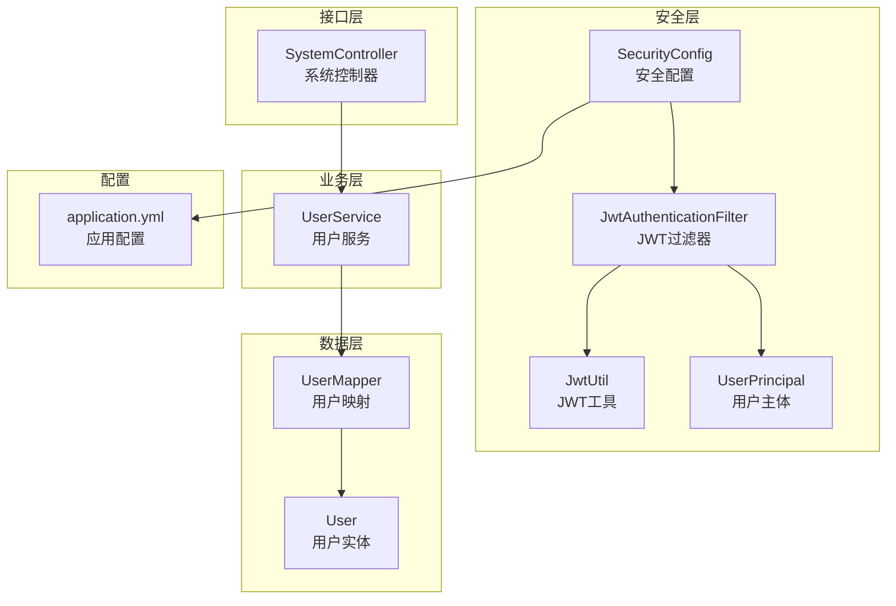
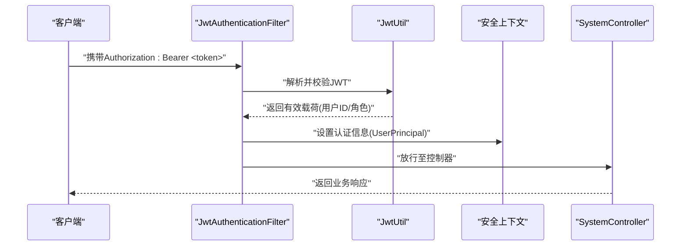
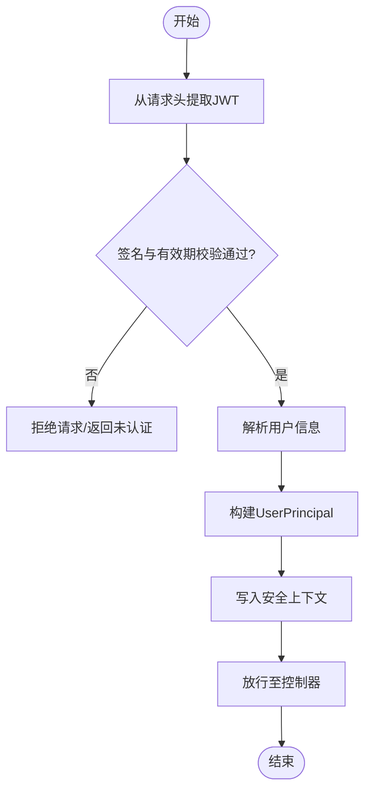
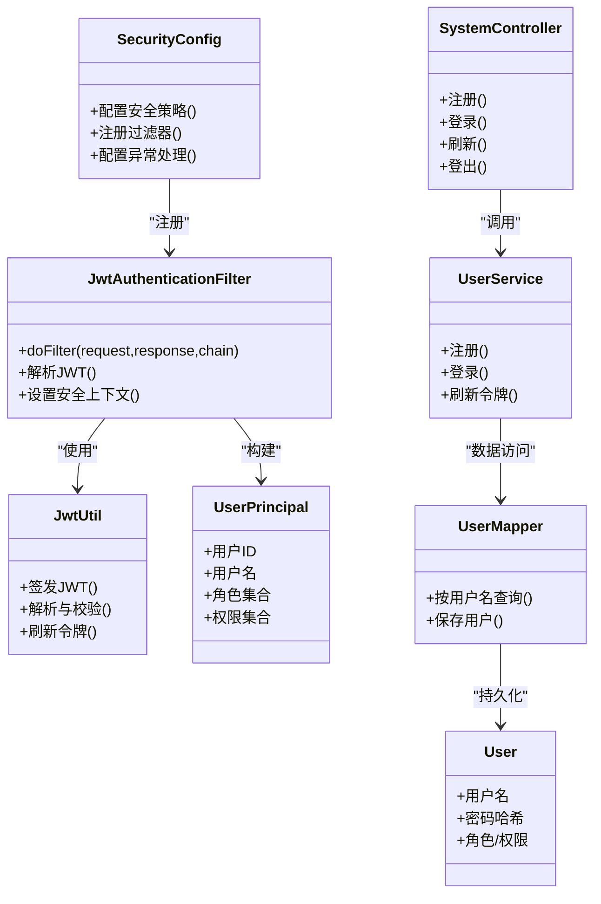

# 用户认证系统

<cite>
**本文引用的文件**   
- [SecurityConfig.java](file://src/main/java/com/ailearn/security/SecurityConfig.java)
- [JwtAuthenticationFilter.java](file://src/main/java/com/ailearn/security/JwtAuthenticationFilter.java)
- [JwtUtil.java](file://src/main/java/com/ailearn/security/JwtUtil.java)
- [UserPrincipal.java](file://src/main/java/com/ailearn/security/UserPrincipal.java)
- [UserService.java](file://src/main/java/com/ailearn/service/UserService.java)
- [UserMapper.java](file://src/main/java/com/ailearn/mapper/UserMapper.java)
- [User.java](file://src/main/java/com/ailearn/entity/User.java)
- [LoginRequest.java](file://src/main/java/com/ailearn/dto/LoginRequest.java)
- [RegisterRequest.java](file://src/main/java/com/ailearn/dto/RegisterRequest.java)
- [RefreshTokenRequest.java](file://src/main/java/com/ailearn/dto/RefreshTokenRequest.java)
- [SystemController.java](file://src/main/java/com/ailearn/controller/SystemController.java)
- [application.yml](file://src/main/resources/application.yml)
</cite>

## 目录
1. [简介](#简介)
2. [项目结构](#项目结构)
3. [核心组件](#核心组件)
4. [架构总览](#架构总览)
5. [详细组件分析](#详细组件分析)
6. [依赖关系分析](#依赖关系分析)
7. [性能考虑](#性能考虑)
8. [故障排查指南](#故障排查指南)
9. [结论](#结论)
10. [附录](#附录)

## 简介
本文件面向用户认证子系统，围绕JWT令牌认证机制展开，覆盖令牌的生成、验证与刷新流程；深入解析安全配置类与自定义过滤器的职责与协作方式；阐述用户主体对象的设计与权限控制实现；提供注册、登录、登出等API的完整说明与使用示例；并给出密码加密存储、会话管理、权限验证等安全最佳实践，以及扩展角色与权限体系的方法、常见问题解决方案与性能优化建议。

## 项目结构
认证相关代码集中在 security、service、entity、dto、controller 等包中：
- security：安全配置、过滤器、工具类、用户主体
- service：用户服务（业务逻辑）
- entity：用户实体
- dto：请求模型（登录、注册、刷新令牌）
- controller：系统控制器（对外暴露认证接口）
- resources：应用配置（包含密钥、过期时间等）

图表来源
- [SecurityConfig.java](file://src/main/java/com/ailearn/security/SecurityConfig.java)
- [JwtAuthenticationFilter.java](file://src/main/java/com/ailearn/security/JwtAuthenticationFilter.java)
- [JwtUtil.java](file://src/main/java/com/ailearn/security/JwtUtil.java)
- [UserPrincipal.java](file://src/main/java/com/ailearn/security/UserPrincipal.java)
- [UserService.java](file://src/main/java/com/ailearn/service/UserService.java)
- [UserMapper.java](file://src/main/java/com/ailearn/mapper/UserMapper.java)
- [User.java](file://src/main/java/com/ailearn/entity/User.java)
- [SystemController.java](file://src/main/java/com/ailearn/controller/SystemController.java)
- [application.yml](file://src/main/resources/application.yml)

章节来源
- [SecurityConfig.java](file://src/main/java/com/ailearn/security/SecurityConfig.java)
- [JwtAuthenticationFilter.java](file://src/main/java/com/ailearn/security/JwtAuthenticationFilter.java)
- [JwtUtil.java](file://src/main/java/com/ailearn/security/JwtUtil.java)
- [UserPrincipal.java](file://src/main/java/com/ailearn/security/UserPrincipal.java)
- [UserService.java](file://src/main/java/com/ailearn/service/UserService.java)
- [UserMapper.java](file://src/main/java/com/ailearn/mapper/UserMapper.java)
- [User.java](file://src/main/java/com/ailearn/entity/User.java)
- [SystemController.java](file://src/main/java/com/ailearn/controller/SystemController.java)
- [application.yml](file://src/main/resources/application.yml)

## 核心组件
- SecurityConfig：集中式安全策略配置，定义受保护资源、放行路径、过滤器链顺序、异常处理与跨域策略等。
- JwtAuthenticationFilter：在请求进入控制器前拦截，从请求头提取JWT并校验，成功后将用户信息写入安全上下文。
- JwtUtil：封装JWT的签发、解析、校验、刷新等能力，读取密钥与过期时间等配置。
- UserPrincipal：承载当前用户身份与权限集合，供后续鉴权注解与方法级控制使用。
- UserService：用户业务逻辑，负责注册、登录、密码校验、令牌签发与刷新等业务。
- UserMapper / User：数据访问与用户实体，持久化用户信息与角色/权限字段。
- SystemController：对外暴露注册、登录、登出、刷新令牌等HTTP接口。
- application.yml：存放JWT密钥、过期时间、白名单路径等关键配置。

章节来源
- [SecurityConfig.java](file://src/main/java/com/ailearn/security/SecurityConfig.java)
- [JwtAuthenticationFilter.java](file://src/main/java/com/ailearn/security/JwtAuthenticationFilter.java)
- [JwtUtil.java](file://src/main/java/com/ailearn/security/JwtUtil.java)
- [UserPrincipal.java](file://src/main/java/com/ailearn/security/UserPrincipal.java)
- [UserService.java](file://src/main/java/com/ailearn/service/UserService.java)
- [UserMapper.java](file://src/main/java/com/ailearn/mapper/UserMapper.java)
- [User.java](file://src/main/java/com/ailearn/entity/User.java)
- [SystemController.java](file://src/main/java/com/ailearn/controller/SystemController.java)
- [application.yml](file://src/main/resources/application.yml)

## 架构总览
下图展示了认证请求的关键调用链：客户端发起请求 → 过滤器拦截 → 解析JWT → 构建用户主体 → 注入安全上下文 → 控制器执行业务。

图表来源
- [JwtAuthenticationFilter.java](file://src/main/java/com/ailearn/security/JwtAuthenticationFilter.java)
- [JwtUtil.java](file://src/main/java/com/ailearn/security/JwtUtil.java)
- [SystemController.java](file://src/main/java/com/ailearn/controller/SystemController.java)

## 详细组件分析

### JWT令牌认证机制
- 令牌生成
  - 触发点：用户成功注册或登录后，由用户服务调用工具类签发JWT。
  - 内容：通常包含用户标识、角色/权限、签发时间、过期时间等。
  - 配置：密钥与过期时间来自应用配置。
- 令牌验证
  - 触发点：每次受保护请求进入过滤器时进行。
  - 过程：从请求头提取令牌 → 校验签名与有效期 → 解析用户信息 → 构造用户主体 → 写入安全上下文。
- 令牌刷新
  - 触发点：短时效访问令牌到期后，客户端使用刷新令牌换取新访问令牌。
  - 过程：校验刷新令牌有效性 → 生成新的访问令牌 → 返回给客户端。

图表来源
- [JwtAuthenticationFilter.java](file://src/main/java/com/ailearn/security/JwtAuthenticationFilter.java)
- [JwtUtil.java](file://src/main/java/com/ailearn/security/JwtUtil.java)

章节来源
- [JwtAuthenticationFilter.java](file://src/main/java/com/ailearn/security/JwtAuthenticationFilter.java)
- [JwtUtil.java](file://src/main/java/com/ailearn/security/JwtUtil.java)
- [application.yml](file://src/main/resources/application.yml)

### SecurityConfig安全配置类
- 作用
  - 定义全局安全策略：哪些路径需要认证、哪些可匿名访问。
  - 注册自定义过滤器到过滤器链，确保在默认过滤器之前执行。
  - 配置异常处理、跨域策略、会话策略等。
- 关键点
  - 白名单：如注册、登录、公开文档等路径无需认证。
  - 过滤器顺序：自定义JWT过滤器应优先于默认认证过滤器。
  - 方法级鉴权：结合注解对控制器方法进行权限控制。

章节来源
- [SecurityConfig.java](file://src/main/java/com/ailearn/security/SecurityConfig.java)

### JwtAuthenticationFilter自定义过滤器
- 工作机制
  - 拦截所有请求，跳过白名单路径。
  - 从请求头获取令牌并进行校验。
  - 校验通过后，将用户主体写入安全上下文，使后续控制器与鉴权注解可用。
- 错误处理
  - 令牌缺失、格式错误、签名无效、过期等情况统一返回未认证或非法状态码。

章节来源
- [JwtAuthenticationFilter.java](file://src/main/java/com/ailearn/security/JwtAuthenticationFilter.java)

### JwtUtil工具类
- 功能
  - 签发JWT：根据用户信息与配置生成访问令牌。
  - 解析与校验：验证签名、过期时间与格式。
  - 刷新令牌：基于刷新令牌生成新的访问令牌。
- 配置依赖
  - 密钥、访问令牌过期时间、刷新令牌过期时间等来自配置文件。

章节来源
- [JwtUtil.java](file://src/main/java/com/ailearn/security/JwtUtil.java)
- [application.yml](file://src/main/resources/application.yml)

### UserPrincipal用户主体对象
- 设计目标
  - 作为安全上下文的主体，承载用户标识、用户名、角色与权限集合。
  - 为方法级鉴权与业务逻辑中的权限判断提供便捷访问。
- 典型用法
  - 在控制器方法参数中直接注入。
  - 配合注解进行细粒度权限控制。

章节来源
- [UserPrincipal.java](file://src/main/java/com/ailearn/security/UserPrincipal.java)

### 用户服务与数据访问
- UserService
  - 注册：校验输入、检查唯一性、密码加密后保存。
  - 登录：校验用户名与密码，签发访问令牌与刷新令牌。
  - 刷新：校验刷新令牌，签发新的访问令牌。
- UserMapper / User
  - 用户实体的持久化与查询，包括用户名、密码哈希、角色/权限字段。

章节来源
- [UserService.java](file://src/main/java/com/ailearn/service/UserService.java)
- [UserMapper.java](file://src/main/java/com/ailearn/mapper/UserMapper.java)
- [User.java](file://src/main/java/com/ailearn/entity/User.java)

### API接口说明与使用示例
以下接口均通过SystemController暴露，请求体与响应遵循统一的Result包装。

- 用户注册
  - 路径：POST /api/auth/register
  - 请求体：用户名、密码、可选角色/权限
  - 行为：校验唯一性与合法性，加密存储密码，返回注册结果
  - 示例：
    - 请求：{ "username": "alice", "password": "SecurePass123!" }
    - 响应：{ "code": 200, "message": "注册成功", "data": null }

- 用户登录
  - 路径：POST /api/auth/login
  - 请求体：用户名、密码
  - 行为：校验凭据，签发访问令牌与刷新令牌
  - 示例：
    - 请求：{ "username": "alice", "password": "SecurePass123!" }
    - 响应：{ "code": 200, "message": "登录成功", "data": { "accessToken": "...", "refreshToken": "..." } }

- 刷新令牌
  - 路径：POST /api/auth/refresh
  - 请求体：刷新令牌
  - 行为：校验刷新令牌，签发新的访问令牌
  - 示例：
    - 请求：{ "refreshToken": "..." }
    - 响应：{ "code": 200, "message": "刷新成功", "data": { "accessToken": "..." } }

- 用户登出
  - 路径：POST /api/auth/logout
  - 行为：清除本地会话或标记刷新令牌失效（若采用服务端黑名单/撤销机制）
  - 示例：
    - 请求：无（或携带当前访问令牌用于撤销）
    - 响应：{ "code": 200, "message": "登出成功", "data": null }

- 受保护资源访问
  - 路径：GET /api/protected/resource
  - 头部：Authorization: Bearer <accessToken>
  - 行为：过滤器校验令牌并注入用户主体，控制器返回受保护数据

章节来源
- [SystemController.java](file://src/main/java/com/ailearn/controller/SystemController.java)
- [LoginRequest.java](file://src/main/java/com/ailearn/dto/LoginRequest.java)
- [RegisterRequest.java](file://src/main/java/com/ailearn/dto/RegisterRequest.java)
- [RefreshTokenRequest.java](file://src/main/java/com/ailearn/dto/RefreshTokenRequest.java)

### 密码加密存储与安全最佳实践
- 密码加密
  - 使用强哈希算法（如BCrypt）对用户密码进行不可逆加密存储。
  - 禁止明文存储与弱哈希（如MD5）。
- 传输安全
  - 全站启用HTTPS，避免中间人攻击窃取令牌。
- 令牌安全
  - 访问令牌短期有效，刷新令牌长期但受限（仅用于刷新）。
  - 敏感操作二次确认或重新认证。
- 会话管理
  - 无状态JWT为主，必要时结合服务端黑名单或Redis记录刷新令牌状态。
- 权限验证
  - 方法级注解控制访问，最小权限原则。
  - 动态权限加载，避免硬编码。

章节来源
- [UserService.java](file://src/main/java/com/ailearn/service/UserService.java)
- [User.java](file://src/main/java/com/ailearn/entity/User.java)
- [SecurityConfig.java](file://src/main/java/com/ailearn/security/SecurityConfig.java)

### 扩展用户角色与权限体系
- 扩展方向
  - 在用户实体中增加角色与权限字段（如JSON数组或关联表）。
  - 在用户主体中聚合权限集合，供鉴权注解使用。
  - 在过滤器或服务层加载最新权限，保证实时性。
- 鉴权注解
  - 使用方法级注解声明所需角色/权限，未满足则拒绝访问。
- 数据模型建议
  - 用户-角色-权限三表分离，便于维护与审计。

章节来源
- [UserPrincipal.java](file://src/main/java/com/ailearn/security/UserPrincipal.java)
- [User.java](file://src/main/java/com/ailearn/entity/User.java)
- [SecurityConfig.java](file://src/main/java/com/ailearn/security/SecurityConfig.java)

## 依赖关系分析

图表来源
- [SecurityConfig.java](file://src/main/java/com/ailearn/security/SecurityConfig.java)
- [JwtAuthenticationFilter.java](file://src/main/java/com/ailearn/security/JwtAuthenticationFilter.java)
- [JwtUtil.java](file://src/main/java/com/ailearn/security/JwtUtil.java)
- [UserPrincipal.java](file://src/main/java/com/ailearn/security/UserPrincipal.java)
- [UserService.java](file://src/main/java/com/ailearn/service/UserService.java)
- [UserMapper.java](file://src/main/java/com/ailearn/mapper/UserMapper.java)
- [User.java](file://src/main/java/com/ailearn/entity/User.java)
- [SystemController.java](file://src/main/java/com/ailearn/controller/SystemController.java)

章节来源
- [SecurityConfig.java](file://src/main/java/com/ailearn/security/SecurityConfig.java)
- [JwtAuthenticationFilter.java](file://src/main/java/com/ailearn/security/JwtAuthenticationFilter.java)
- [JwtUtil.java](file://src/main/java/com/ailearn/security/JwtUtil.java)
- [UserPrincipal.java](file://src/main/java/com/ailearn/security/UserPrincipal.java)
- [UserService.java](file://src/main/java/com/ailearn/service/UserService.java)
- [UserMapper.java](file://src/main/java/com/ailearn/mapper/UserMapper.java)
- [User.java](file://src/main/java/com/ailearn/entity/User.java)
- [SystemController.java](file://src/main/java/com/ailearn/controller/SystemController.java)

## 性能考虑
- 令牌校验开销
  - 避免重复解析，可在过滤器内缓存已解析的用户主体。
  - 合理设置访问令牌过期时间，平衡安全性与性能。
- 数据库访问
  - 登录与刷新时按需查询用户信息，避免冗余字段。
  - 对高频查询建立索引（如用户名）。
- 并发与限流
  - 对登录与刷新接口实施限流，防止暴力破解与滥用。
- 内存与序列化
  - 用户主体尽量轻量，避免在令牌中携带过多敏感信息。

[本节为通用指导，不直接分析具体文件]

## 故障排查指南
- 常见错误
  - 401未认证：令牌缺失、格式错误或未通过校验。
  - 403禁止访问：缺少必要角色或权限。
  - 400请求错误：请求体验证失败（如用户名/密码为空）。
- 定位步骤
  - 检查过滤器是否命中白名单路径。
  - 核对JWT密钥与过期时间配置是否正确。
  - 查看日志输出，确认解析与校验阶段的具体错误。
- 修复建议
  - 修正请求头命名与Bearer前缀。
  - 调整白名单路径与过滤器顺序。
  - 更新密钥与过期时间配置并重启服务。

章节来源
- [JwtAuthenticationFilter.java](file://src/main/java/com/ailearn/security/JwtAuthenticationFilter.java)
- [JwtUtil.java](file://src/main/java/com/ailearn/security/JwtUtil.java)
- [SecurityConfig.java](file://src/main/java/com/ailearn/security/SecurityConfig.java)

## 结论
本认证系统以JWT为核心，通过安全配置与自定义过滤器实现无状态认证，结合用户主体与权限控制完成细粒度鉴权。通过合理的令牌生命周期管理与安全最佳实践，系统在安全性与性能之间取得良好平衡。未来可扩展角色与权限体系，引入更完善的令牌撤销与会话管理能力。

[本节为总结，不直接分析具体文件]

## 附录
- 配置项参考
  - JWT密钥、访问令牌过期时间、刷新令牌过期时间、白名单路径等均在应用配置文件中管理。
- 前端集成要点
  - 登录成功后保存访问令牌与刷新令牌。
  - 在请求头自动附加Authorization: Bearer <accessToken>。
  - 捕获401响应，使用刷新接口获取新令牌并重试请求。

章节来源
- [application.yml](file://src/main/resources/application.yml)
- [SystemController.java](file://src/main/java/com/ailearn/controller/SystemController.java)