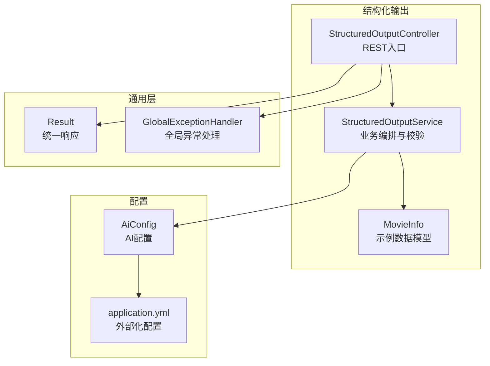
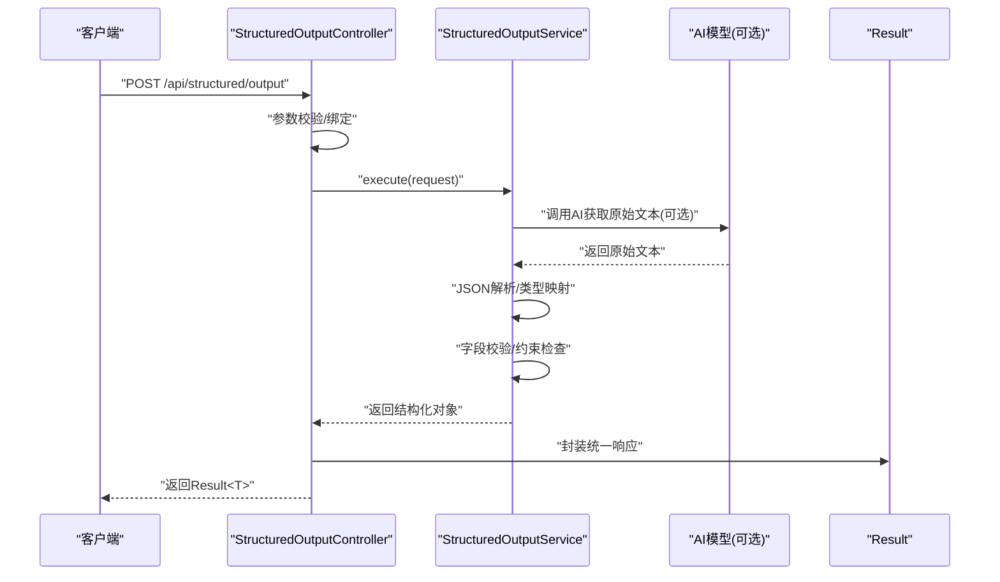
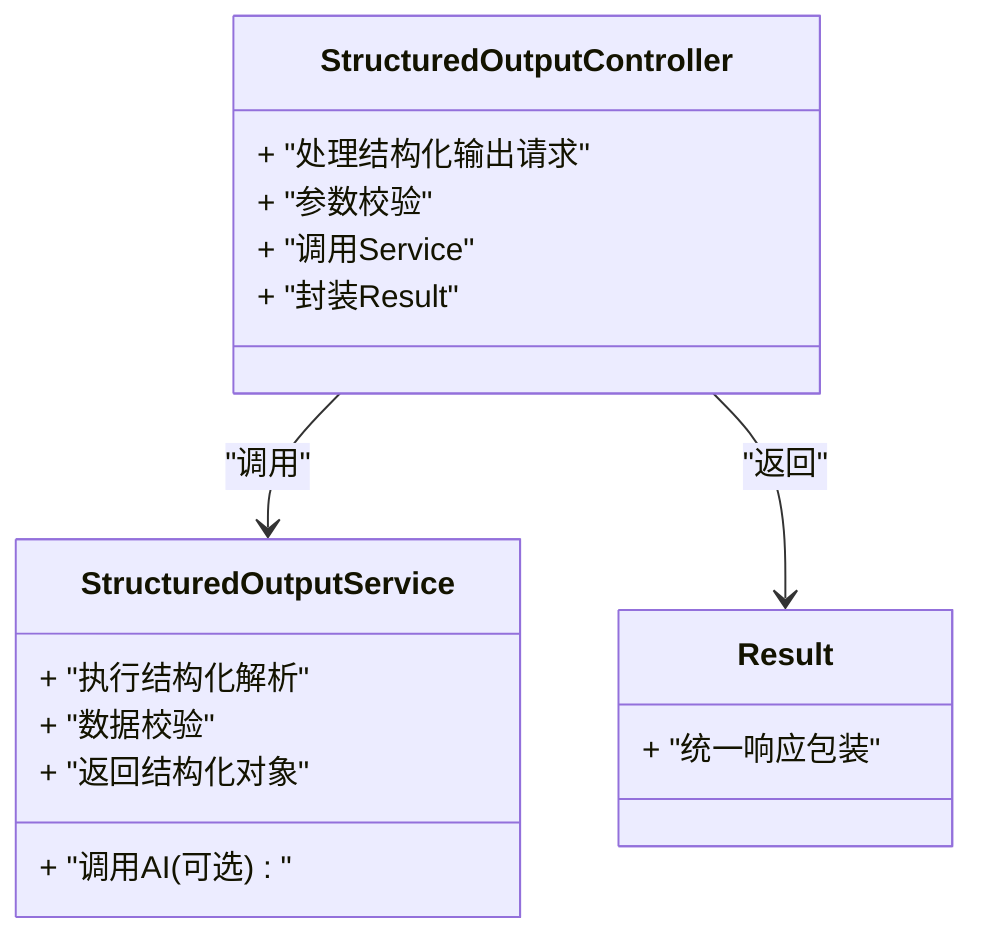
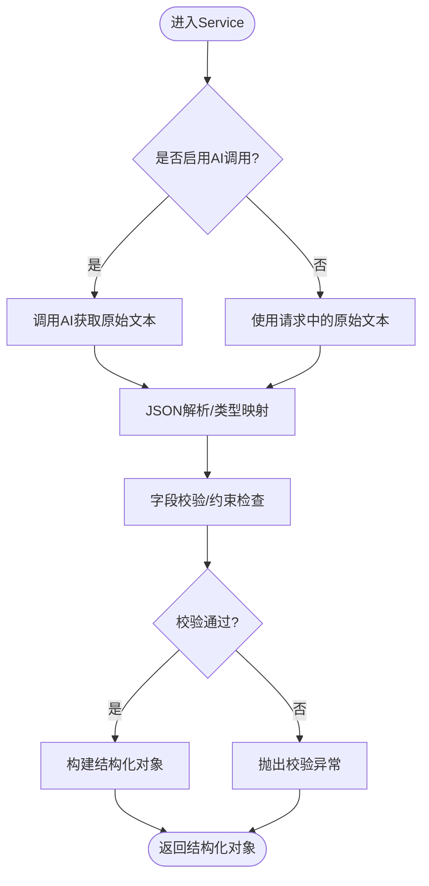
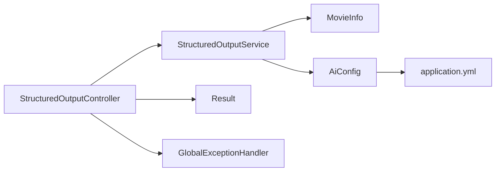

# 结构化输出

<cite>
**本文引用的文件**   
- [StructuredOutputController.java](file://src/main/java/com/ailearn/structured/StructuredOutputController.java)
- [StructuredOutputService.java](file://src/main/java/com/ailearn/structured/StructuredOutputService.java)
- [MovieInfo.java](file://src/main/java/com/ailearn/structured/MovieInfo.java)
- [StructuredRequest.java](file://src/main/java/com/ailearn/dto/StructuredRequest.java)
- [Result.java](file://src/main/java/com/ailearn/common/Result.java)
- [GlobalExceptionHandler.java](file://src/main/java/com/ailearn/common/GlobalExceptionHandler.java)
- [AiConfig.java](file://src/main/java/com/ailearn/config/AiConfig.java)
- [application.yml](file://src/main/resources/application.yml)
</cite>

## 目录
1. [简介](#简介)
2. [项目结构](#项目结构)
3. [核心组件](#核心组件)
4. [架构总览](#架构总览)
5. [详细组件分析](#详细组件分析)
6. [依赖关系分析](#依赖关系分析)
7. [性能考虑](#性能考虑)
8. [故障排查指南](#故障排查指南)
9. [结论](#结论)
10. [附录](#附录)

## 简介
本模块聚焦于“结构化输出”能力，提供将AI模型返回的文本结果解析为强类型JSON对象的服务与接口。通过统一的请求/响应封装、严格的字段校验与错误处理，确保下游系统获得稳定、可预期的数据契约。文档涵盖：
- JSON数据处理与类型安全机制
- StructuredOutputService的结构化响应生成流程与验证规则
- MovieInfo示例类的字段定义与约束
- API接口说明与使用示例
- 序列化/反序列化过程
- 输入校验、转换与错误处理
- 扩展新数据结构与验证规则的方法
- 与AI模型集成的最佳实践与性能优化建议

## 项目结构
结构化输出相关代码位于 structured 包中，包含控制器、服务与示例数据模型；DTO 层提供统一请求体；common 层提供通用响应与全局异常处理；config 层提供AI配置项。

图表来源
- [StructuredOutputController.java](file://src/main/java/com/ailearn/structured/StructuredOutputController.java)
- [StructuredOutputService.java](file://src/main/java/com/ailearn/structured/StructuredOutputService.java)
- [MovieInfo.java](file://src/main/java/com/ailearn/structured/MovieInfo.java)
- [Result.java](file://src/main/java/com/ailearn/common/Result.java)
- [GlobalExceptionHandler.java](file://src/main/java/com/ailearn/common/GlobalExceptionHandler.java)
- [AiConfig.java](file://src/main/java/com/ailearn/config/AiConfig.java)
- [application.yml](file://src/main/resources/application.yml)

章节来源
- [StructuredOutputController.java](file://src/main/java/com/ailearn/structured/StructuredOutputController.java)
- [StructuredOutputService.java](file://src/main/java/com/ailearn/structured/StructuredOutputService.java)
- [MovieInfo.java](file://src/main/java/com/ailearn/structured/MovieInfo.java)
- [Result.java](file://src/main/java/com/ailearn/common/Result.java)
- [GlobalExceptionHandler.java](file://src/main/java/com/ailearn/common/GlobalExceptionHandler.java)
- [AiConfig.java](file://src/main/java/com/ailearn/config/AiConfig.java)
- [application.yml](file://src/main/resources/application.yml)

## 核心组件
- StructuredOutputController：暴露REST接口，接收结构化请求并返回统一响应。
- StructuredOutputService：编排AI调用（或本地解析）、执行数据校验、构造结构化响应。
- MovieInfo：示例领域模型，用于演示字段定义与约束。
- StructuredRequest：结构化请求体，承载提示词、目标类型等参数。
- Result：统一响应包装，保证API返回格式一致。
- GlobalExceptionHandler：集中捕获并规范化异常。
- AiConfig：AI客户端配置项（如端点、超时、重试等）。

章节来源
- [StructuredOutputController.java](file://src/main/java/com/ailearn/structured/StructuredOutputController.java)
- [StructuredOutputService.java](file://src/main/java/com/ailearn/structured/StructuredOutputService.java)
- [MovieInfo.java](file://src/main/java/com/ailearn/structured/MovieInfo.java)
- [StructuredRequest.java](file://src/main/java/com/ailearn/dto/StructuredRequest.java)
- [Result.java](file://src/main/java/com/ailearn/common/Result.java)
- [GlobalExceptionHandler.java](file://src/main/java/com/ailearn/common/GlobalExceptionHandler.java)
- [AiConfig.java](file://src/main/java/com/ailearn/config/AiConfig.java)

## 架构总览
从HTTP请求到结构化响应的端到端流程如下：

图表来源
- [StructuredOutputController.java](file://src/main/java/com/ailearn/structured/StructuredOutputController.java)
- [StructuredOutputService.java](file://src/main/java/com/ailearn/structured/StructuredOutputService.java)
- [Result.java](file://src/main/java/com/ailearn/common/Result.java)

## 详细组件分析

### StructuredOutputController 分析
职责
- 定义REST接口，接收 StructuredRequest。
- 进行基础参数校验与绑定。
- 调用 Service 完成解析与校验。
- 使用 Result 包装成功/失败响应。

关键流程
- 入参校验：非空、长度、格式等。
- 调用 Service 执行结构化解析。
- 统一响应封装与异常兜底。

图表来源
- [StructuredOutputController.java](file://src/main/java/com/ailearn/structured/StructuredOutputController.java)
- [StructuredOutputService.java](file://src/main/java/com/ailearn/structured/StructuredOutputService.java)
- [Result.java](file://src/main/java/com/ailearn/common/Result.java)

章节来源
- [StructuredOutputController.java](file://src/main/java/com/ailearn/structured/StructuredOutputController.java)
- [Result.java](file://src/main/java/com/ailearn/common/Result.java)

### StructuredOutputService 分析
职责
- 编排AI调用（若启用）与本地解析。
- 将AI返回的原始文本解析为JSON并映射到目标类型。
- 执行字段级校验与约束检查。
- 构造并返回结构化对象。

处理逻辑流程图

图表来源
- [StructuredOutputService.java](file://src/main/java/com/ailearn/structured/StructuredOutputService.java)

章节来源
- [StructuredOutputService.java](file://src/main/java/com/ailearn/structured/StructuredOutputService.java)

### MovieInfo 示例类分析
用途
- 作为结构化输出的示例目标类型，展示字段定义与约束。

典型字段与约束（概念性说明）
- 标题：必填、最大长度限制。
- 年份：整数范围校验（如1900-当前年）。
- 评分：浮点数范围校验（如0-10）。
- 导演/演员：字符串列表，元素非空且长度限制。
- 标签：枚举或受限集合。

注意
- 具体字段名、类型与约束以实际实现为准。

章节来源
- [MovieInfo.java](file://src/main/java/com/ailearn/structured/MovieInfo.java)

### 请求与响应模型
- StructuredRequest：承载提示词、目标类型标识、原始文本等。
- Result：统一响应包装，包含状态码、消息与数据体。

章节来源
- [StructuredRequest.java](file://src/main/java/com/ailearn/dto/StructuredRequest.java)
- [Result.java](file://src/main/java/com/ailearn/common/Result.java)

## 依赖关系分析
组件间依赖关系如下：

图表来源
- [StructuredOutputController.java](file://src/main/java/com/ailearn/structured/StructuredOutputController.java)
- [StructuredOutputService.java](file://src/main/java/com/ailearn/structured/StructuredOutputService.java)
- [MovieInfo.java](file://src/main/java/com/ailearn/structured/MovieInfo.java)
- [Result.java](file://src/main/java/com/ailearn/common/Result.java)
- [GlobalExceptionHandler.java](file://src/main/java/com/ailearn/common/GlobalExceptionHandler.java)
- [AiConfig.java](file://src/main/java/com/ailearn/config/AiConfig.java)
- [application.yml](file://src/main/resources/application.yml)

章节来源
- [StructuredOutputController.java](file://src/main/java/com/ailearn/structured/StructuredOutputController.java)
- [StructuredOutputService.java](file://src/main/java/com/ailearn/structured/StructuredOutputService.java)
- [MovieInfo.java](file://src/main/java/com/ailearn/structured/MovieInfo.java)
- [Result.java](file://src/main/java/com/ailearn/common/Result.java)
- [GlobalExceptionHandler.java](file://src/main/java/com/ailearn/common/GlobalExceptionHandler.java)
- [AiConfig.java](file://src/main/java/com/ailearn/config/AiConfig.java)
- [application.yml](file://src/main/resources/application.yml)

## 性能考虑
- 连接池与超时：合理设置AI客户端的连接池大小、读写超时与重试策略，避免阻塞线程。
- 并发控制：对高QPS场景引入限流与队列缓冲，保护后端资源。
- 缓存策略：对相同提示词+目标类型的结果进行短期缓存，降低重复计算。
- 解析优化：优先使用流式解析与增量映射，减少中间对象创建。
- 日志采样：在高频路径上采用采样日志，避免I/O瓶颈。
- 批量处理：支持批量结构化解析，合并网络往返与CPU开销。

[本节为通用指导，不直接分析具体文件]

## 故障排查指南
常见问题与定位要点
- 参数校验失败：检查请求体结构与字段约束，关注全局异常处理器返回的错误信息。
- JSON解析异常：确认AI返回内容是否为合法JSON，必要时增加容错与降级逻辑。
- 类型映射错误：核对目标类型字段与JSON键名一致性，检查枚举值与范围约束。
- AI调用失败：查看AiConfig配置与application.yml中的端点、密钥、超时与重试策略。
- 超时与熔断：监控调用耗时与失败率，调整超时阈值与熔断策略。

章节来源
- [GlobalExceptionHandler.java](file://src/main/java/com/ailearn/common/GlobalExceptionHandler.java)
- [AiConfig.java](file://src/main/java/com/ailearn/config/AiConfig.java)
- [application.yml](file://src/main/resources/application.yml)

## 结论
本模块通过清晰的控制器-服务分层、统一响应封装与严格的数据校验，实现了从AI原始文本到强类型对象的可靠转换。借助可扩展的数据模型与验证规则，能够快速适配新的结构化需求，并在生产环境中具备良好的稳定性与可观测性。

[本节为总结性内容，不直接分析具体文件]

## 附录

### API接口文档
- 接口名称：结构化输出
- 方法：POST
- 路径：/api/structured/output
- 请求体：StructuredRequest
- 响应体：Result<MovieInfo>

请求示例（概念性）
- 字段：提示词、目标类型、原始文本
- 校验：非空、长度、格式

响应示例（概念性）
- 状态码：统一封装
- 数据体：MovieInfo对象

章节来源
- [StructuredOutputController.java](file://src/main/java/com/ailearn/structured/StructuredOutputController.java)
- [StructuredRequest.java](file://src/main/java/com/ailearn/dto/StructuredRequest.java)
- [Result.java](file://src/main/java/com/ailearn/common/Result.java)
- [MovieInfo.java](file://src/main/java/com/ailearn/structured/MovieInfo.java)

### 数据模型序列化和反序列化
- 序列化：将MovieInfo对象转换为JSON字符串，遵循字段命名与类型约定。
- 反序列化：将JSON字符串映射到MovieInfo对象，缺失字段按默认值处理，非法值触发校验异常。
- 自定义转换器：如需特殊格式（日期、金额），可实现自定义转换器并在解析阶段注册。

章节来源
- [MovieInfo.java](file://src/main/java/com/ailearn/structured/MovieInfo.java)
- [StructuredOutputService.java](file://src/main/java/com/ailearn/structured/StructuredOutputService.java)

### 输入校验、转换与错误处理
- 输入校验：在控制器与服务层双重校验，确保边界条件与业务约束。
- 数据转换：将AI返回的原始文本转换为JSON并进行类型映射。
- 错误处理：统一异常捕获，返回标准化错误码与消息，便于前端处理。

章节来源
- [StructuredOutputController.java](file://src/main/java/com/ailearn/structured/StructuredOutputController.java)
- [StructuredOutputService.java](file://src/main/java/com/ailearn/structured/StructuredOutputService.java)
- [GlobalExceptionHandler.java](file://src/main/java/com/ailearn/common/GlobalExceptionHandler.java)

### 扩展新数据结构与验证规则
步骤建议
- 新增数据模型：定义新类，明确字段类型与约束。
- 更新Service：在解析阶段支持新目标类型，添加对应校验规则。
- 更新Controller：在路由或类型选择处支持新模型。
- 配置与测试：完善AiConfig与application.yml配置，补充单元测试与集成测试。

章节来源
- [MovieInfo.java](file://src/main/java/com/ailearn/structured/MovieInfo.java)
- [StructuredOutputService.java](file://src/main/java/com/ailearn/structured/StructuredOutputService.java)
- [StructuredOutputController.java](file://src/main/java/com/ailearn/structured/StructuredOutputController.java)
- [AiConfig.java](file://src/main/java/com/ailearn/config/AiConfig.java)
- [application.yml](file://src/main/resources/application.yml)

### 与AI模型集成的最佳实践
- 提示词工程：明确输出格式要求，强制JSON模式，减少歧义。
- 容错与重试：对网络抖动与临时错误实施指数退避重试。
- 超时与熔断：设置合理的超时阈值与熔断策略，保障整体可用性。
- 幂等与去重：对相同请求进行去重，避免重复计算。
- 监控与告警：记录关键指标（耗时、成功率、错误分布），及时告警。

章节来源
- [AiConfig.java](file://src/main/java/com/ailearn/config/AiConfig.java)
- [application.yml](file://src/main/resources/application.yml)