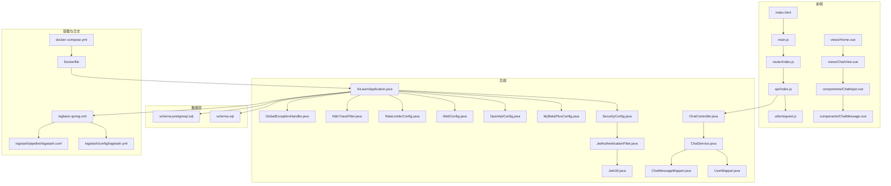
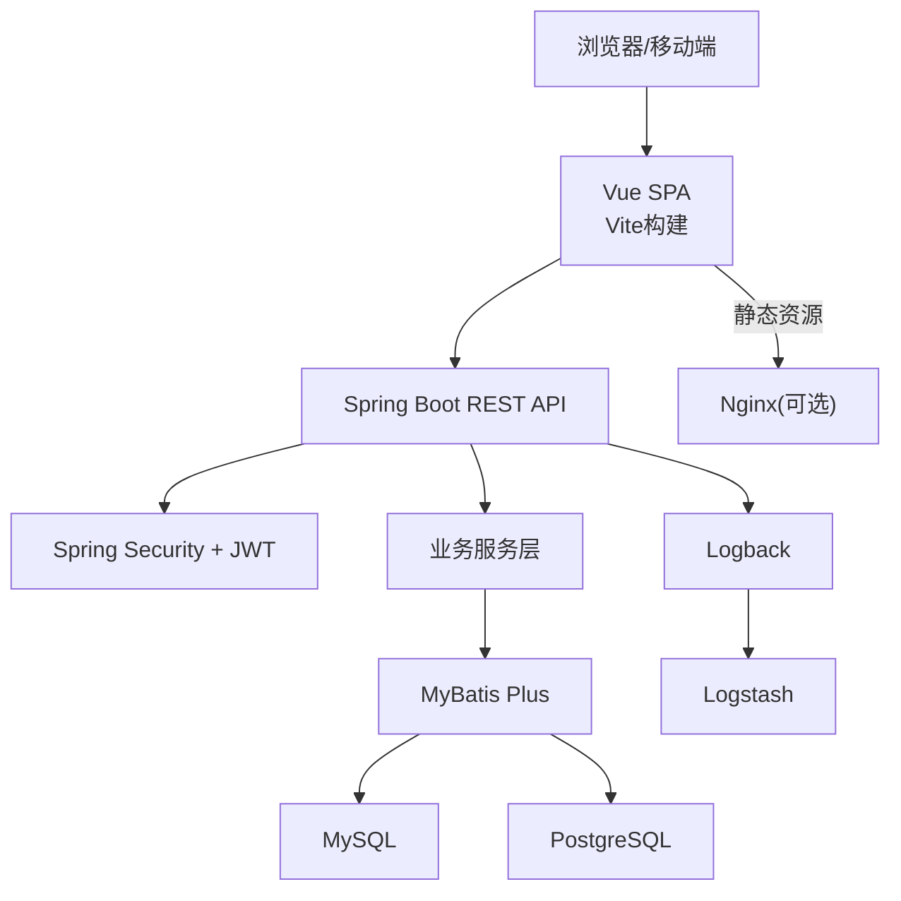
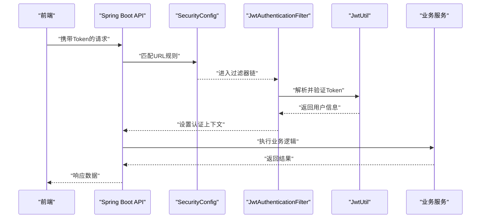
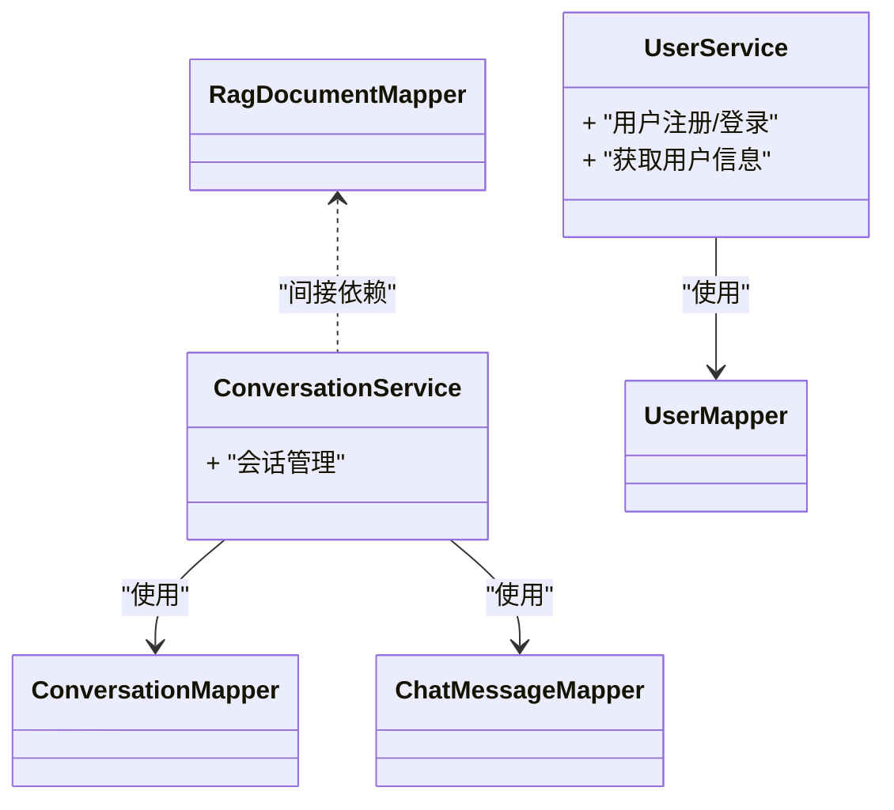
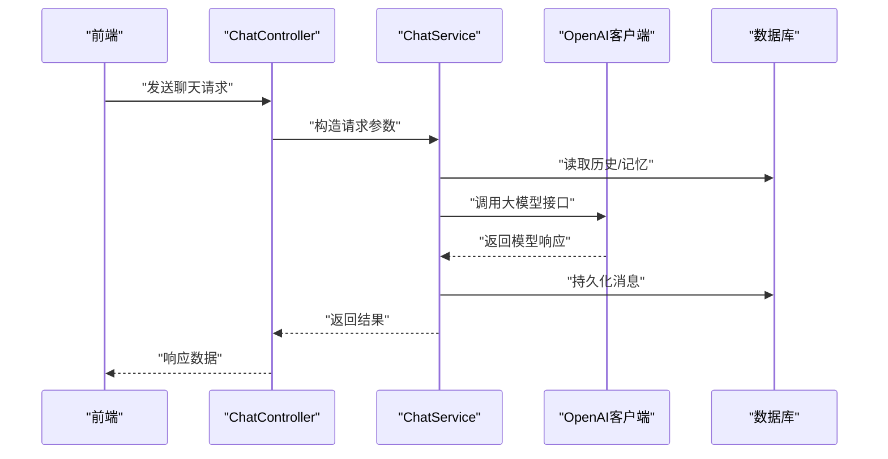
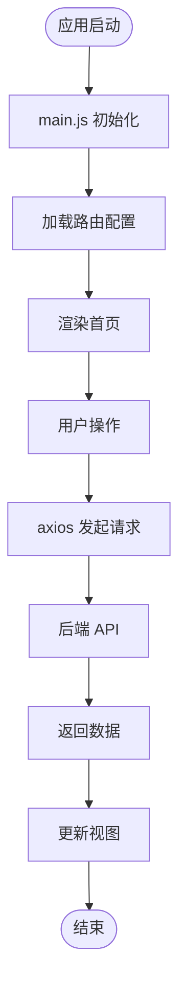
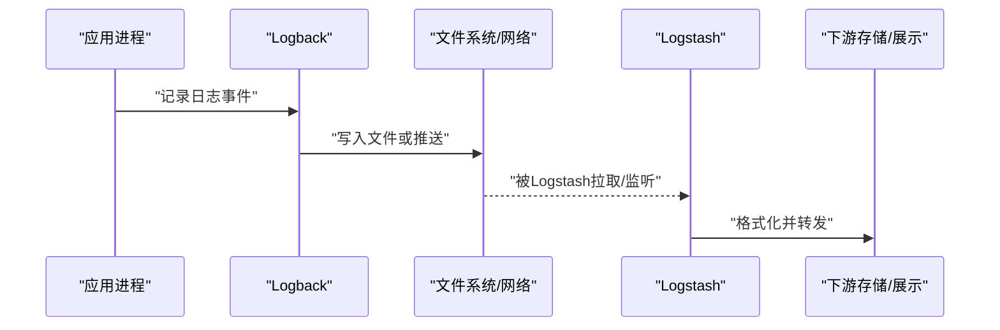
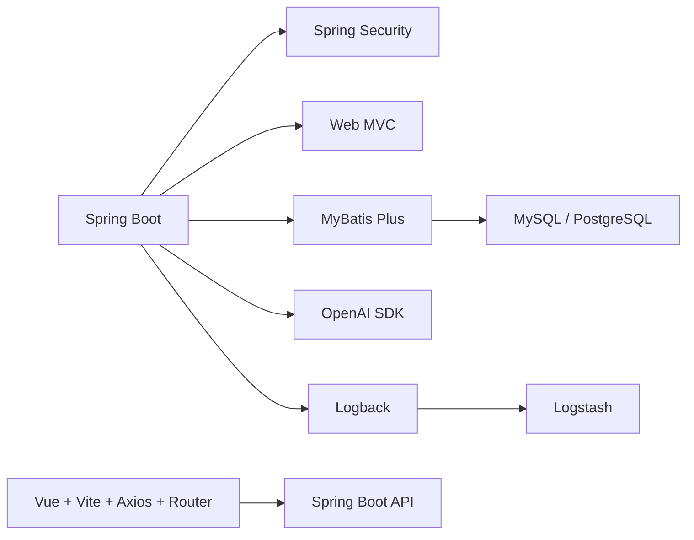

# 技术栈选型

<cite>
**本文引用的文件**   
- [pom.xml](file://pom.xml)
- [application.yml](file://src/main/resources/application.yml)
- [logback-spring.xml](file://src/main/resources/logback-spring.xml)
- [schema.sql](file://src/main/resources/schema.sql)
- [schema-postgresql.sql](file://src/main/resources/schema-postgresql.sql)
- [Dockerfile](file://Dockerfile)
- [docker-compose.yml](file://docker-compose.yml)
- [app/Dockerfile](file://docker/app/Dockerfile)
- [logstash/config/logstash.yml](file://docker/logstash/config/logstash.yml)
- [logstash/pipeline/logstash.conf](file://docker/logstash/pipeline/logstash.conf)
- [AiLearnApplication.java](file://src/main/java/com/ailearn/AiLearnApplication.java)
- [SecurityConfig.java](file://src/main/java/com/ailearn/security/SecurityConfig.java)
- [JwtAuthenticationFilter.java](file://src/main/java/com/ailearn/security/JwtAuthenticationFilter.java)
- [JwtUtil.java](file://src/main/java/com/ailearn/security/JwtUtil.java)
- [MyBatisPlusConfig.java](file://src/main/java/com/ailearn/config/MyBatisPlusConfig.java)
- [OpenApiConfig.java](file://src/main/java/com/ailearn/config/OpenApiConfig.java)
- [WebConfig.java](file://src/main/java/com/ailearn/config/WebConfig.java)
- [RateLimiterConfig.java](file://src/main/java/com/ailearn/config/RateLimiterConfig.java)
- [MdcTraceFilter.java](file://src/main/java/com/ailearn/config/MdcTraceFilter.java)
- [GlobalExceptionHandler.java](file://src/main/java/com/ailearn/common/GlobalExceptionHandler.java)
- [Result.java](file://src/main/java/com/ailearn/common/Result.java)
- [ErrorCode.java](file://src/main/java/com/ailearn/common/ErrorCode.java)
- [BusinessException.java](file://src/main/java/com/ailearn/common/BusinessException.java)
- [UserMapper.java](file://src/main/java/com/ailearn/mapper/UserMapper.java)
- [ChatMessageMapper.java](file://src/main/java/com/ailearn/mapper/ChatMessageMapper.java)
- [ConversationMapper.java](file://src/main/java/com/ailearn/mapper/ConversationMapper.java)
- [RagDocumentMapper.java](file://src/main/java/com/ailearn/mapper/RagDocumentMapper.java)
- [UserService.java](file://src/main/java/com/ailearn/service/UserService.java)
- [ConversationService.java](file://src/main/java/com/ailearn/service/ConversationService.java)
- [ChatController.java](file://src/main/java/com/ailearn/chat/ChatController.java)
- [ChatService.java](file://src/main/java/com/ailearn/chat/ChatService.java)
- [AgentController.java](file://src/main/java/com/ailearn/agent/AgentController.java)
- [AgentService.java](file://src/main/java/com/ailearn/agent/AgentService.java)
- [MultiAgentController.java](file://src/main/java/com/ailearn/agent/MultiAgentController.java)
- [MultiAgentService.java](file://src/main/java/com/ailearn/agent/MultiAgentService.java)
- [SearchAgentController.java](file://src/main/java/com/ailearn/agent/SearchAgentController.java)
- [SearchAgentService.java](file://src/main/java/com/ailearn/agent/SearchAgentService.java)
- [RagController.java](file://src/main/java/com/ailearn/rag/RagController.java)
- [RagService.java](file://src/main/java/com/ailearn/rag/RagService.java)
- [MemoryChatController.java](file://src/main/java/com/ailearn/memory/MemoryChatController.java)
- [MemoryChatService.java](file://src/main/java/com/ailearn/memory/MemoryChatService.java)
- [DatabaseChatMemory.java](file://src/main/java/com/ailearn/memory/DatabaseChatMemory.java)
- [StructuredOutputController.java](file://src/main/java/com/ailearn/structured/StructuredOutputController.java)
- [StructuredOutputService.java](file://src/main/java/com/ailearn/structured/StructuredOutputService.java)
- [MovieInfo.java](file://src/main/java/com/ailearn/structured/MovieInfo.java)
- [ToolsController.java](file://src/main/java/com/ailearn/tools/ToolsController.java)
- [CalculatorTool.java](file://src/main/java/com/ailearn/tools/CalculatorTool.java)
- [WeatherTool.java](file://src/main/java/com/ailearn/tools/WeatherTool.java)
- [WebSearchTool.java](file://src/main/java/com/ailearn/tools/WebSearchTool.java)
- [SystemController.java](file://src/main/java/com/ailearn/controller/SystemController.java)
- [package.json](file://frontend/package.json)
- [vite.config.js](file://frontend/vite.config.js)
- [index.html](file://frontend/index.html)
- [main.js](file://frontend/src/main.js)
- [router/index.js](file://frontend/src/router/index.js)
- [api/index.js](file://frontend/src/api/index.js)
- [utils/request.js](file://frontend/src/utils/request.js)
- [views/Home.vue](file://frontend/src/views/Home.vue)
- [views/ChatView.vue](file://frontend/src/views/ChatView.vue)
- [components/ChatInput.vue](file://frontend/src/components/ChatInput.vue)
- [components/ChatMessage.vue](file://frontend/src/components/ChatMessage.vue)
</cite>

## 目录
1. [简介](#简介)
2. [项目结构](#项目结构)
3. [核心组件](#核心组件)
4. [架构总览](#架构总览)
5. [详细组件分析](#详细组件分析)
6. [依赖关系与兼容性](#依赖关系与兼容性)
7. [性能考量](#性能考量)
8. [故障排查指南](#故障排查指南)
9. [结论](#结论)
10. [附录](#附录)

## 简介
本文件面向Java AI学习平台的技术栈选型，围绕后端、前端、数据库、容器化与日志收集等维度进行系统化说明。重点阐述：
- 后端：Spring Boot、Spring Security、MyBatis Plus、OpenAI SDK集成策略
- 前端：Vue.js、Vite、Axios、Vue Router的选择原因与协作方式
- 数据库：MySQL与PostgreSQL双支持策略
- 容器化：Docker与Docker Compose的使用场景
- 日志：Logback采集与Logstash管道配置思路
- 版本兼容性与依赖关系图

## 项目结构
仓库采用前后端分离与多模块职责清晰的组织方式：
- 后端（src/main/java）按领域分层组织：controller、service、mapper、entity、config、security、tools、memory、rag、agent、structured等
- 资源文件（src/main/resources）包含应用配置、SQL脚本、日志配置
- 前端（frontend）基于Vue+Vite构建，提供路由、API封装、视图与组件
- 容器化（docker、Dockerfile、docker-compose.yml）提供应用镜像与编排能力
- 文档（docs）包含部署与设计相关说明

图表来源
- [AiLearnApplication.java](file://src/main/java/com/ailearn/AiLearnApplication.java)
- [SecurityConfig.java](file://src/main/java/com/ailearn/security/SecurityConfig.java)
- [JwtAuthenticationFilter.java](file://src/main/java/com/ailearn/security/JwtAuthenticationFilter.java)
- [JwtUtil.java](file://src/main/java/com/ailearn/security/JwtUtil.java)
- [MyBatisPlusConfig.java](file://src/main/java/com/ailearn/config/MyBatisPlusConfig.java)
- [OpenApiConfig.java](file://src/main/java/com/ailearn/config/OpenApiConfig.java)
- [WebConfig.java](file://src/main/java/com/ailearn/config/WebConfig.java)
- [RateLimiterConfig.java](file://src/main/java/com/ailearn/config/RateLimiterConfig.java)
- [MdcTraceFilter.java](file://src/main/java/com/ailearn/config/MdcTraceFilter.java)
- [GlobalExceptionHandler.java](file://src/main/java/com/ailearn/common/GlobalExceptionHandler.java)
- [ChatController.java](file://src/main/java/com/ailearn/chat/ChatController.java)
- [ChatService.java](file://src/main/java/com/ailearn/chat/ChatService.java)
- [UserMapper.java](file://src/main/java/com/ailearn/mapper/UserMapper.java)
- [ChatMessageMapper.java](file://src/main/java/com/ailearn/mapper/ChatMessageMapper.java)
- [schema.sql](file://src/main/resources/schema.sql)
- [schema-postgresql.sql](file://src/main/resources/schema-postgresql.sql)
- [Dockerfile](file://Dockerfile)
- [docker-compose.yml](file://docker-compose.yml)
- [logstash/config/logstash.yml](file://docker/logstash/config/logstash.yml)
- [logstash/pipeline/logstash.conf](file://docker/logstash/pipeline/logstash.conf)
- [logback-spring.xml](file://src/main/resources/logback-spring.xml)
- [frontend/index.html](file://frontend/index.html)
- [frontend/src/main.js](file://frontend/src/main.js)
- [frontend/src/router/index.js](file://frontend/src/router/index.js)
- [frontend/src/api/index.js](file://frontend/src/api/index.js)
- [frontend/src/utils/request.js](file://frontend/src/utils/request.js)
- [frontend/src/views/Home.vue](file://frontend/src/views/Home.vue)
- [frontend/src/views/ChatView.vue](file://frontend/src/views/ChatView.vue)
- [frontend/src/components/ChatInput.vue](file://frontend/src/components/ChatInput.vue)
- [frontend/src/components/ChatMessage.vue](file://frontend/src/components/ChatMessage.vue)

章节来源
- [pom.xml](file://pom.xml)
- [application.yml](file://src/main/resources/application.yml)
- [Dockerfile](file://Dockerfile)
- [docker-compose.yml](file://docker-compose.yml)
- [frontend/package.json](file://frontend/package.json)
- [frontend/vite.config.js](file://frontend/vite.config.js)

## 核心组件
本节聚焦关键技术与选择理由，结合代码位置说明其职责与协作方式。

- Spring Boot
  - 作用：快速启动、自动装配、内嵌容器、生态丰富
  - 入口类与基础配置位于应用主包下，统一加载配置与组件扫描
  - 章节来源
    - [AiLearnApplication.java](file://src/main/java/com/ailearn/AiLearnApplication.java)
    - [application.yml](file://src/main/resources/application.yml)

- Spring Security + JWT
  - 作用：认证授权、过滤器链、权限控制
  - 通过自定义JWT过滤器与工具类实现无状态鉴权
  - 章节来源
    - [SecurityConfig.java](file://src/main/java/com/ailearn/security/SecurityConfig.java)
    - [JwtAuthenticationFilter.java](file://src/main/java/com/ailearn/security/JwtAuthenticationFilter.java)
    - [JwtUtil.java](file://src/main/java/com/ailearn/security/JwtUtil.java)

- MyBatis Plus
  - 作用：ORM增强、通用CRUD、分页插件、逻辑删除等
  - 通过配置类启用插件与全局策略，配合Mapper接口简化数据访问
  - 章节来源
    - [MyBatisPlusConfig.java](file://src/main/java/com/ailearn/config/MyBatisPlusConfig.java)
    - [UserMapper.java](file://src/main/java/com/ailearn/mapper/UserMapper.java)
    - [ChatMessageMapper.java](file://src/main/java/com/ailearn/mapper/ChatMessageMapper.java)
    - [ConversationMapper.java](file://src/main/java/com/ailearn/mapper/ConversationMapper.java)
    - [RagDocumentMapper.java](file://src/main/java/com/ailearn/mapper/RagDocumentMapper.java)

- OpenAI SDK集成
  - 作用：调用大模型能力（对话、结构化输出、工具调用等）
  - 通过配置类注入客户端，服务层封装业务调用
  - 章节来源
    - [OpenApiConfig.java](file://src/main/java/com/ailearn/config/OpenApiConfig.java)
    - [ChatService.java](file://src/main/java/com/ailearn/chat/ChatService.java)
    - [AgentService.java](file://src/main/java/com/ailearn/agent/AgentService.java)
    - [MultiAgentService.java](file://src/main/java/com/ailearn/agent/MultiAgentService.java)
    - [SearchAgentService.java](file://src/main/java/com/ailearn/agent/SearchAgentService.java)
    - [RagService.java](file://src/main/java/com/ailearn/rag/RagService.java)
    - [MemoryChatService.java](file://src/main/java/com/ailearn/memory/MemoryChatService.java)
    - [StructuredOutputService.java](file://src/main/java/com/ailearn/structured/StructuredOutputService.java)

- 前端技术栈
  - Vue.js：组件化开发、响应式数据绑定、生态完善
  - Vite：极速冷启动与热更新，适合现代前端工程
  - Axios：统一的HTTP客户端封装，拦截器处理鉴权与错误
  - Vue Router：单页应用路由管理
  - 章节来源
    - [frontend/package.json](file://frontend/package.json)
    - [frontend/vite.config.js](file://frontend/vite.config.js)
    - [frontend/src/main.js](file://frontend/src/main.js)
    - [frontend/src/router/index.js](file://frontend/src/router/index.js)
    - [frontend/src/api/index.js](file://frontend/src/api/index.js)
    - [frontend/src/utils/request.js](file://frontend/src/utils/request.js)
    - [frontend/src/views/Home.vue](file://frontend/src/views/Home.vue)
    - [frontend/src/views/ChatView.vue](file://frontend/src/views/ChatView.vue)
    - [frontend/src/components/ChatInput.vue](file://frontend/src/components/ChatInput.vue)
    - [frontend/src/components/ChatMessage.vue](file://frontend/src/components/ChatMessage.vue)

- 数据库双引擎支持
  - MySQL与PostgreSQL均提供初始化脚本，便于在不同环境切换
  - 章节来源
    - [schema.sql](file://src/main/resources/schema.sql)
    - [schema-postgresql.sql](file://src/main/resources/schema-postgresql.sql)

- 容器化与编排
  - Dockerfile定义应用镜像构建流程；docker-compose编排应用与日志组件
  - 章节来源
    - [Dockerfile](file://Dockerfile)
    - [docker-compose.yml](file://docker-compose.yml)
    - [app/Dockerfile](file://docker/app/Dockerfile)

- 日志方案
  - Logback负责应用侧日志输出；Logstash负责日志收集与转发
  - 章节来源
    - [logback-spring.xml](file://src/main/resources/logback-spring.xml)
    - [logstash/config/logstash.yml](file://docker/logstash/config/logstash.yml)
    - [logstash/pipeline/logstash.conf](file://docker/logstash/pipeline/logstash.conf)

## 架构总览
整体采用前后端分离架构，后端以Spring Boot为核心，提供REST API与安全控制；前端使用Vue+Vite构建SPA并通过Axios调用后端；数据持久化由MyBatis Plus驱动；容器化与日志体系保障可运维性。

图表来源
- [AiLearnApplication.java](file://src/main/java/com/ailearn/AiLearnApplication.java)
- [SecurityConfig.java](file://src/main/java/com/ailearn/security/SecurityConfig.java)
- [MyBatisPlusConfig.java](file://src/main/java/com/ailearn/config/MyBatisPlusConfig.java)
- [schema.sql](file://src/main/resources/schema.sql)
- [schema-postgresql.sql](file://src/main/resources/schema-postgresql.sql)
- [logback-spring.xml](file://src/main/resources/logback-spring.xml)
- [logstash/config/logstash.yml](file://docker/logstash/config/logstash.yml)
- [logstash/pipeline/logstash.conf](file://docker/logstash/pipeline/logstash.conf)

## 详细组件分析

### 安全与鉴权流程（Spring Security + JWT）
- 请求进入后由SecurityConfig定义放行与保护规则
- JwtAuthenticationFilter解析并校验JWT令牌，设置认证上下文
- JwtUtil负责令牌生成与校验
- 控制器在受保护路径上读取用户信息并执行业务

图表来源
- [SecurityConfig.java](file://src/main/java/com/ailearn/security/SecurityConfig.java)
- [JwtAuthenticationFilter.java](file://src/main/java/com/ailearn/security/JwtAuthenticationFilter.java)
- [JwtUtil.java](file://src/main/java/com/ailearn/security/JwtUtil.java)

章节来源
- [SecurityConfig.java](file://src/main/java/com/ailearn/security/SecurityConfig.java)
- [JwtAuthenticationFilter.java](file://src/main/java/com/ailearn/security/JwtAuthenticationFilter.java)
- [JwtUtil.java](file://src/main/java/com/ailearn/security/JwtUtil.java)

### 数据访问层（MyBatis Plus）
- Mapper接口继承BaseMapper获得通用CRUD能力
- 配置类启用分页、逻辑删除等插件
- Service层组合多个Mapper完成复杂查询与事务

图表来源
- [MyBatisPlusConfig.java](file://src/main/java/com/ailearn/config/MyBatisPlusConfig.java)
- [UserMapper.java](file://src/main/java/com/ailearn/mapper/UserMapper.java)
- [ChatMessageMapper.java](file://src/main/java/com/ailearn/mapper/ChatMessageMapper.java)
- [ConversationMapper.java](file://src/main/java/com/ailearn/mapper/ConversationMapper.java)
- [RagDocumentMapper.java](file://src/main/java/com/ailearn/mapper/RagDocumentMapper.java)
- [UserService.java](file://src/main/java/com/ailearn/service/UserService.java)
- [ConversationService.java](file://src/main/java/com/ailearn/service/ConversationService.java)

章节来源
- [MyBatisPlusConfig.java](file://src/main/java/com/ailearn/config/MyBatisPlusConfig.java)
- [UserMapper.java](file://src/main/java/com/ailearn/mapper/UserMapper.java)
- [ChatMessageMapper.java](file://src/main/java/com/ailearn/mapper/ChatMessageMapper.java)
- [ConversationMapper.java](file://src/main/java/com/ailearn/mapper/ConversationMapper.java)
- [RagDocumentMapper.java](file://src/main/java/com/ailearn/mapper/RagDocumentMapper.java)
- [UserService.java](file://src/main/java/com/ailearn/service/UserService.java)
- [ConversationService.java](file://src/main/java/com/ailearn/service/ConversationService.java)

### 大模型调用链路（OpenAI SDK）
- 控制器接收请求，服务层组装提示词与参数
- 通过OpenAI客户端发起调用，处理流式或非流式响应
- 结合记忆与RAG能力增强上下文

图表来源
- [ChatController.java](file://src/main/java/com/ailearn/chat/ChatController.java)
- [ChatService.java](file://src/main/java/com/ailearn/chat/ChatService.java)
- [OpenApiConfig.java](file://src/main/java/com/ailearn/config/OpenApiConfig.java)
- [ChatMessageMapper.java](file://src/main/java/com/ailearn/mapper/ChatMessageMapper.java)

章节来源
- [ChatController.java](file://src/main/java/com/ailearn/chat/ChatController.java)
- [ChatService.java](file://src/main/java/com/ailearn/chat/ChatService.java)
- [OpenApiConfig.java](file://src/main/java/com/ailearn/config/OpenApiConfig.java)
- [ChatMessageMapper.java](file://src/main/java/com/ailearn/mapper/ChatMessageMapper.java)

### 前端交互流程（Vue + Vite + Axios + Vue Router）
- main.js初始化应用与插件
- router/index.js定义页面路由
- api/index.js与utils/request.js封装HTTP请求与拦截器
- 视图组件通过API与服务通信

图表来源
- [frontend/src/main.js](file://frontend/src/main.js)
- [frontend/src/router/index.js](file://frontend/src/router/index.js)
- [frontend/src/api/index.js](file://frontend/src/api/index.js)
- [frontend/src/utils/request.js](file://frontend/src/utils/request.js)
- [frontend/src/views/Home.vue](file://frontend/src/views/Home.vue)
- [frontend/src/views/ChatView.vue](file://frontend/src/views/ChatView.vue)

章节来源
- [frontend/src/main.js](file://frontend/src/main.js)
- [frontend/src/router/index.js](file://frontend/src/router/index.js)
- [frontend/src/api/index.js](file://frontend/src/api/index.js)
- [frontend/src/utils/request.js](file://frontend/src/utils/request.js)
- [frontend/src/views/Home.vue](file://frontend/src/views/Home.vue)
- [frontend/src/views/ChatView.vue](file://frontend/src/views/ChatView.vue)

### 日志采集与流转（Logback + Logstash）
- Logback将应用日志输出到指定目标（控制台/文件/网络）
- Logstash根据pipeline配置收集、过滤与转发日志
- docker-compose编排日志组件与应用协同运行

图表来源
- [logback-spring.xml](file://src/main/resources/logback-spring.xml)
- [logstash/config/logstash.yml](file://docker/logstash/config/logstash.yml)
- [logstash/pipeline/logstash.conf](file://docker/logstash/pipeline/logstash.conf)
- [docker-compose.yml](file://docker-compose.yml)

章节来源
- [logback-spring.xml](file://src/main/resources/logback-spring.xml)
- [logstash/config/logstash.yml](file://docker/logstash/config/logstash.yml)
- [logstash/pipeline/logstash.conf](file://docker/logstash/pipeline/logstash.conf)
- [docker-compose.yml](file://docker-compose.yml)

## 依赖关系与兼容性
- 后端依赖
  - Spring Boot：作为应用框架与运行时
  - Spring Security：安全控制与认证授权
  - MyBatis Plus：数据访问增强
  - OpenAI SDK：大模型能力接入
  - 其他：Web、AOP、Validation、Test等
- 前端依赖
  - Vue.js：UI框架
  - Vite：构建工具
  - Axios：HTTP客户端
  - Vue Router：路由管理
- 数据库
  - MySQL与PostgreSQL：分别提供初始化脚本，便于环境切换
- 容器与日志
  - Docker与Docker Compose：镜像构建与编排
  - Logback与Logstash：日志采集与处理

图表来源
- [pom.xml](file://pom.xml)
- [application.yml](file://src/main/resources/application.yml)
- [schema.sql](file://src/main/resources/schema.sql)
- [schema-postgresql.sql](file://src/main/resources/schema-postgresql.sql)
- [frontend/package.json](file://frontend/package.json)
- [frontend/vite.config.js](file://frontend/vite.config.js)
- [logback-spring.xml](file://src/main/resources/logback-spring.xml)
- [logstash/config/logstash.yml](file://docker/logstash/config/logstash.yml)
- [logstash/pipeline/logstash.conf](file://docker/logstash/pipeline/logstash.conf)

章节来源
- [pom.xml](file://pom.xml)
- [application.yml](file://src/main/resources/application.yml)
- [frontend/package.json](file://frontend/package.json)
- [frontend/vite.config.js](file://frontend/vite.config.js)
- [schema.sql](file://src/main/resources/schema.sql)
- [schema-postgresql.sql](file://src/main/resources/schema-postgresql.sql)

## 性能考量
- 连接池与线程池：合理配置数据库连接池与Tomcat线程数，避免阻塞
- 缓存策略：热点数据引入本地或分布式缓存，降低数据库压力
- 异步与限流：对耗时任务采用异步处理，结合RateLimiter限制突发流量
- 分页与索引：大数据量查询务必分页，并为常用字段建立索引
- 前端优化：按需加载、懒路由、图片压缩与CDN加速
- 日志吞吐：生产环境调整日志级别与滚动策略，避免磁盘IO瓶颈

[本节为通用建议，不直接分析具体文件]

## 故障排查指南
- 统一异常处理
  - GlobalExceptionHandler集中捕获异常并返回标准格式
  - Result与ErrorCode定义统一响应结构与错误码
- 业务异常
  - BusinessException用于业务层抛出明确错误信息
- 调试辅助
  - MDC Trace Filter为每次请求注入追踪ID，便于日志关联
- 常见问题定位
  - 检查Security放行规则与JWT过滤器是否生效
  - 核对MyBatis Plus插件与Mapper映射是否正确
  - 确认OpenAI客户端配置与网络可达性
  - 查看Logback输出与Logstash管道是否正常

章节来源
- [GlobalExceptionHandler.java](file://src/main/java/com/ailearn/common/GlobalExceptionHandler.java)
- [Result.java](file://src/main/java/com/ailearn/common/Result.java)
- [ErrorCode.java](file://src/main/java/com/ailearn/common/ErrorCode.java)
- [BusinessException.java](file://src/main/java/com/ailearn/common/BusinessException.java)
- [MdcTraceFilter.java](file://src/main/java/com/ailearn/config/MdcTraceFilter.java)

## 结论
本技术栈以Spring Boot为核心，结合Spring Security与MyBatis Plus构建高可用后端；通过OpenAI SDK扩展AI能力；前端采用Vue+Vite提升开发体验与运行效率；数据库支持MySQL与PostgreSQL以满足不同环境需求；容器化与日志体系保障交付与运维质量。建议在上线前完成性能压测、安全加固与监控告警建设。

[本节为总结性内容，不直接分析具体文件]

## 附录
- 部署参考
  - 应用镜像构建与编排见Dockerfile与docker-compose.yml
  - 日志组件配置见logstash目录下的配置文件
- 前端工程
  - 构建与代理配置见vite.config.js
  - 依赖清单见package.json

章节来源
- [Dockerfile](file://Dockerfile)
- [docker-compose.yml](file://docker-compose.yml)
- [logstash/config/logstash.yml](file://docker/logstash/config/logstash.yml)
- [logstash/pipeline/logstash.conf](file://docker/logstash/pipeline/logstash.conf)
- [frontend/vite.config.js](file://frontend/vite.config.js)
- [frontend/package.json](file://frontend/package.json)