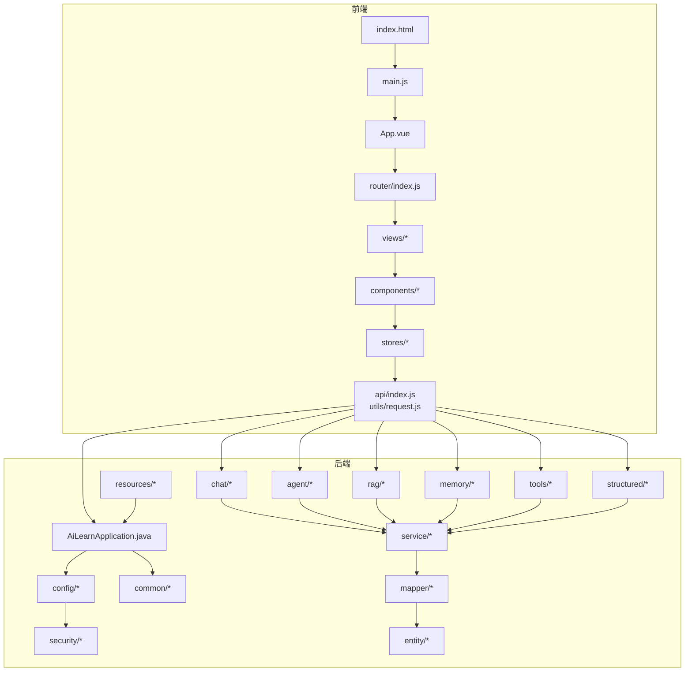
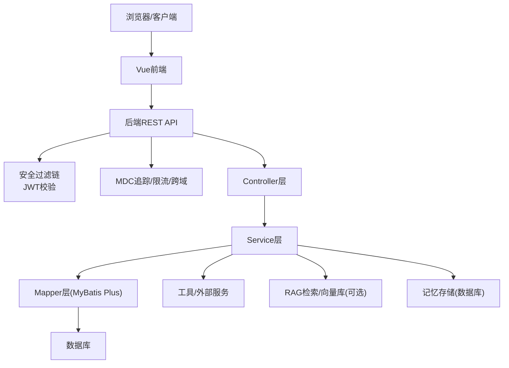
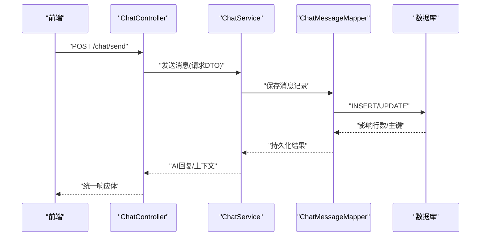
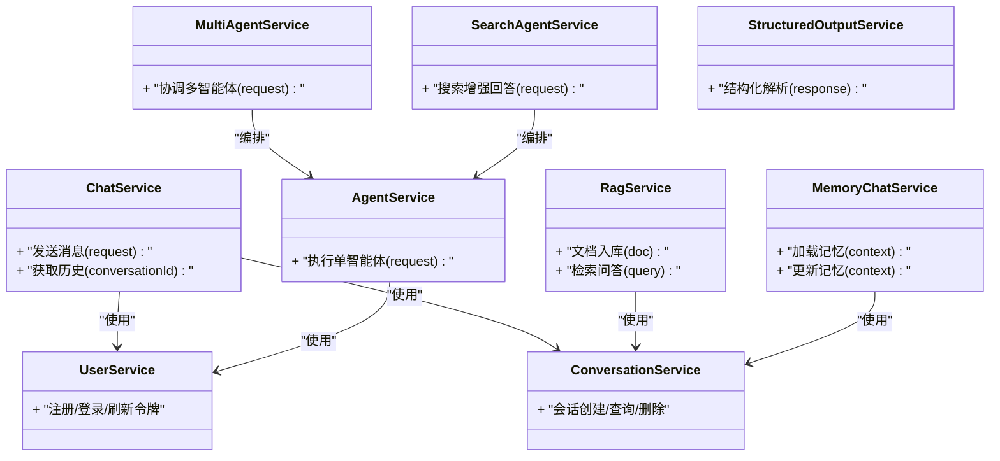
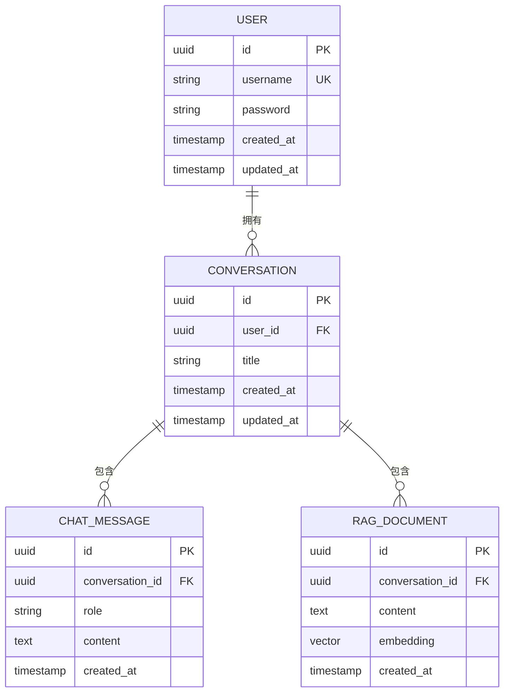
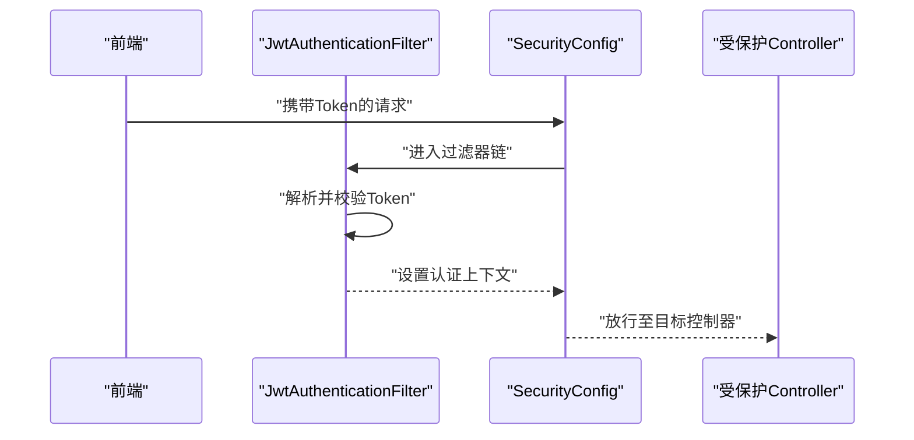
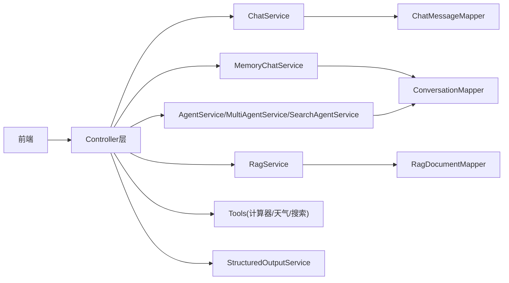
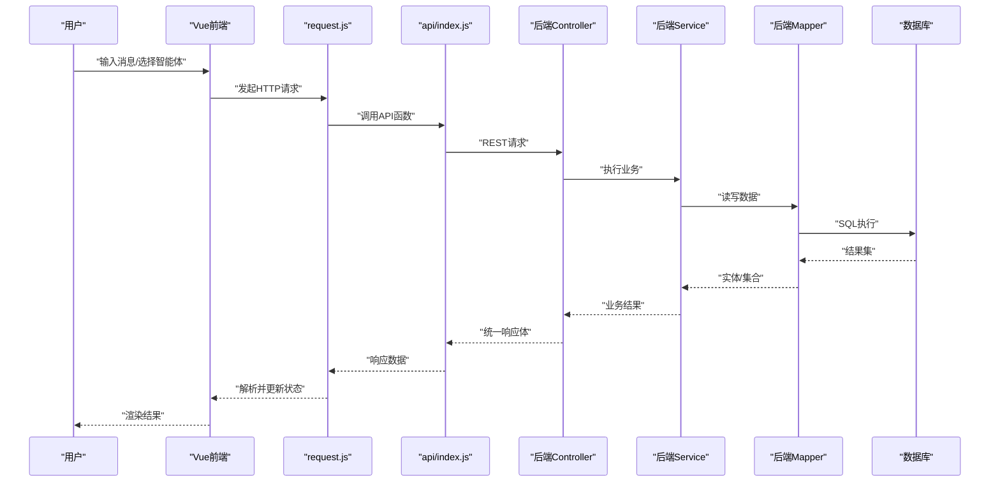
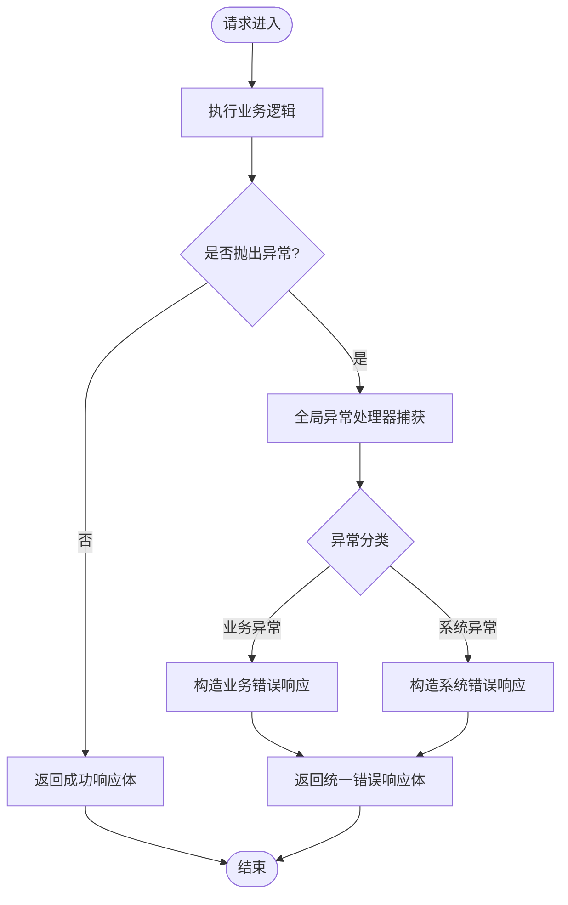
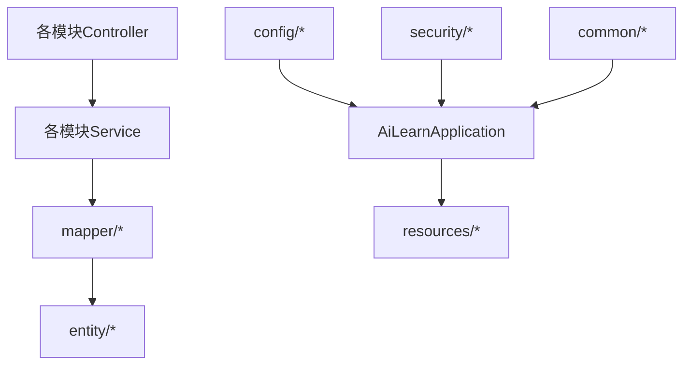

# 整体架构设计

<cite>
**本文引用的文件**   
- [AiLearnApplication.java](file://src/main/java/com/ailearn/AiLearnApplication.java)
- [WebConfig.java](file://src/main/java/com/ailearn/config/WebConfig.java)
- [SpaFallbackController.java](file://src/main/java/com/ailearn/config/SpaFallbackController.java)
- [MdcTraceFilter.java](file://src/main/java/com/ailearn/config/MdcTraceFilter.java)
- [OpenApiConfig.java](file://src/main/java/com/ailearn/config/OpenApiConfig.java)
- [MyBatisPlusConfig.java](file://src/main/java/com/ailearn/config/MyBatisPlusConfig.java)
- [SecurityConfig.java](file://src/main/java/com/ailearn/config/SecurityConfig.java)
- [JwtAuthenticationFilter.java](file://src/main/java/com/ailearn/security/JwtAuthenticationFilter.java)
- [JwtUtil.java](file://src/main/java/com/ailearn/security/JwtUtil.java)
- [UserPrincipal.java](file://src/main/java/com/ailearn/security/UserPrincipal.java)
- [GlobalExceptionHandler.java](file://src/main/java/com/ailearn/common/GlobalExceptionHandler.java)
- [Result.java](file://src/main/java/com/ailearn/common/Result.java)
- [BusinessException.java](file://src/main/java/com/ailearn/common/BusinessException.java)
- [ErrorCode.java](file://src/main/java/com/ailearn/common/ErrorCode.java)
- [ChatController.java](file://src/main/java/com/ailearn/chat/ChatController.java)
- [ChatService.java](file://src/main/java/com/ailearn/chat/ChatService.java)
- [AgentController.java](file://src/main/java/com/ailearn/agent/AgentController.java)
- [AgentService.java](file://src/main/java/com/ailearn/agent/AgentService.java)
- [MultiAgentController.java](file://src/main/java/com/ailearn/agent/MultiAgentController.java)
- [MultiAgentService.java](file://src/main/java/com/ailearn/agent/MultiAgentService.java)
- [SearchAgentController.java](file://src/main/java/com/ailearn/agent/SearchAgentController.java)
- [SearchAgentService.java](file://src/main/java/com/ailearn/agent/SearchAgentService.java)
- [RagController.java](file://src/main/java/com/ailearn/rag/RagController.java)
- [RagService.java](file://src/main/java/com/ailearn/rag/RagService.java)
- [MemoryChatController.java](file://src/main/java/com/ailearn/memory/MemoryChatController.java)
- [MemoryChatService.java](file://src/main/java/com/ailearn/memory/MemoryChatService.java)
- [DatabaseChatMemory.java](file://src/main/java/com/ailearn/memory/DatabaseChatMemory.java)
- [ToolsController.java](file://src/main/java/com/ailearn/tools/ToolsController.java)
- [CalculatorTool.java](file://src/main/java/com/ailearn/tools/CalculatorTool.java)
- [WeatherTool.java](file://src/main/java/com/ailearn/tools/WeatherTool.java)
- [WebSearchTool.java](file://src/main/java/com/ailearn/tools/WebSearchTool.java)
- [StructuredOutputController.java](file://src/main/java/com/ailearn/structured/StructuredOutputController.java)
- [StructuredOutputService.java](file://src/main/java/com/ailearn/structured/StructuredOutputService.java)
- [MovieInfo.java](file://src/main/java/com/ailearn/structured/MovieInfo.java)
- [SystemController.java](file://src/main/java/com/ailearn/controller/SystemController.java)
- [ConversationService.java](file://src/main/java/com/ailearn/service/ConversationService.java)
- [UserService.java](file://src/main/java/com/ailearn/service/UserService.java)
- [ChatMessageMapper.java](file://src/main/java/com/ailearn/mapper/ChatMessageMapper.java)
- [ConversationMapper.java](file://src/main/java/com/ailearn/mapper/ConversationMapper.java)
- [RagDocumentMapper.java](file://src/main/java/com/ailearn/mapper/RagDocumentMapper.java)
- [UserMapper.java](file://src/main/java/com/ailearn/mapper/UserMapper.java)
- [ChatMessage.java](file://src/main/java/com/ailearn/entity/ChatMessage.java)
- [Conversation.java](file://src/main/java/com/ailearn/entity/Conversation.java)
- [RagDocument.java](file://src/main/java/com/ailearn/entity/RagDocument.java)
- [User.java](file://src/main/java/com/ailearn/entity/User.java)
- [application.yml](file://src/main/resources/application.yml)
- [schema.sql](file://src/main/resources/schema.sql)
- [schema-postgresql.sql](file://src/main/resources/schema-postgresql.sql)
- [Dockerfile](file://Dockerfile)
- [docker-compose.yml](file://docker-compose.yml)
- [pom.xml](file://pom.xml)
- [index.html](file://frontend/index.html)
- [main.js](file://frontend/src/main.js)
- [App.vue](file://frontend/src/App.vue)
- [router/index.js](file://frontend/src/router/index.js)
- [api/index.js](file://frontend/src/api/index.js)
- [utils/request.js](file://frontend/src/utils/request.js)
- [stores/chat.js](file://frontend/src/stores/chat.js)
- [views/ChatView.vue](file://frontend/src/views/ChatView.vue)
- [views/AgentView.vue](file://frontend/src/views/AgentView.vue)
- [views/RagView.vue](file://frontend/src/views/RagView.vue)
- [views/MemoryView.vue](file://frontend/src/views/MemoryView.vue)
- [components/ChatInput.vue](file://frontend/src/components/ChatInput.vue)
- [components/ChatMessage.vue](file://frontend/src/components/ChatMessage.vue)
</cite>

## 目录
1. [简介](#简介)
2. [项目结构](#项目结构)
3. [核心组件](#核心组件)
4. [架构总览](#架构总览)
5. [详细组件分析](#详细组件分析)
6. [依赖关系分析](#依赖关系分析)
7. [性能与可扩展性](#性能与可扩展性)
8. [故障排查指南](#故障排查指南)
9. [结论](#结论)
10. [附录](#附录)

## 简介
本文件面向Java AI学习平台，给出前后端分离的架构设计与分层实现说明。后端基于Spring Boot，提供REST API、安全认证、限流、日志追踪、OpenAPI文档等能力；前端采用Vue.js（Vite构建），通过HTTP与后端交互，覆盖聊天、智能体、RAG检索增强生成、记忆上下文、结构化输出、工具调用等场景。文档同时给出系统架构图、数据流向、模块边界、微服务就绪考虑与扩展规划。

## 项目结构
- 前端（frontend）
  - 入口与路由：index.html、main.js、App.vue、router/index.js
  - 页面视图：views/*（如 ChatView、AgentView、RagView、MemoryView 等）
  - 通用组件：components/*（如 ChatInput、ChatMessage）
  - 状态管理：stores/*（如 chat.js）
  - HTTP封装：utils/request.js、api/index.js
- 后端（src/main/java/com/ailearn）
  - 启动类：AiLearnApplication.java
  - 配置层：config/*（Web、安全、OpenAPI、MyBatis Plus、限流、SPA回退、MDC追踪等）
  - 表现层：controller/*、chat/*、agent/*、rag/*、memory/*、tools/*、structured/*
  - 业务逻辑层：service/*、各模块Service
  - 数据访问层：mapper/*（基于MyBatis Plus）
  - 实体模型层：entity/*
  - 安全与异常：security/*、common/*
  - 资源与脚本：resources/*（application.yml、schema*.sql、静态资源）
- 部署与编排：Dockerfile、docker-compose.yml、pom.xml

**图示来源** 
- [AiLearnApplication.java](file://src/main/java/com/ailearn/AiLearnApplication.java)
- [WebConfig.java](file://src/main/java/com/ailearn/config/WebConfig.java)
- [OpenApiConfig.java](file://src/main/java/com/ailearn/config/OpenApiConfig.java)
- [MyBatisPlusConfig.java](file://src/main/java/com/ailearn/config/MyBatisPlusConfig.java)
- [SecurityConfig.java](file://src/main/java/com/ailearn/config/SecurityConfig.java)
- [ChatController.java](file://src/main/java/com/ailearn/chat/ChatController.java)
- [AgentController.java](file://src/main/java/com/ailearn/agent/AgentController.java)
- [RagController.java](file://src/main/java/com/ailearn/rag/RagController.java)
- [MemoryChatController.java](file://src/main/java/com/ailearn/memory/MemoryChatController.java)
- [ToolsController.java](file://src/main/java/com/ailearn/tools/ToolsController.java)
- [StructuredOutputController.java](file://src/main/java/com/ailearn/structured/StructuredOutputController.java)
- [UserService.java](file://src/main/java/com/ailearn/service/UserService.java)
- [ConversationService.java](file://src/main/java/com/ailearn/service/ConversationService.java)
- [ChatMessageMapper.java](file://src/main/java/com/ailearn/mapper/ChatMessageMapper.java)
- [UserMapper.java](file://src/main/java/com/ailearn/mapper/UserMapper.java)
- [ChatMessage.java](file://src/main/java/com/ailearn/entity/ChatMessage.java)
- [User.java](file://src/main/java/com/ailearn/entity/User.java)
- [application.yml](file://src/main/resources/application.yml)
- [index.html](file://frontend/index.html)
- [main.js](file://frontend/src/main.js)
- [App.vue](file://frontend/src/App.vue)
- [router/index.js](file://frontend/src/router/index.js)
- [api/index.js](file://frontend/src/api/index.js)
- [utils/request.js](file://frontend/src/utils/request.js)

**章节来源**
- [AiLearnApplication.java](file://src/main/java/com/ailearn/AiLearnApplication.java)
- [application.yml](file://src/main/resources/application.yml)
- [index.html](file://frontend/index.html)
- [main.js](file://frontend/src/main.js)
- [App.vue](file://frontend/src/App.vue)
- [router/index.js](file://frontend/src/router/index.js)
- [api/index.js](file://frontend/src/api/index.js)
- [utils/request.js](file://frontend/src/utils/request.js)

## 核心组件
- 启动与全局配置
  - 应用启动类负责扫描包并装配Bean
  - Web配置、CORS、拦截器、过滤器、静态资源与SPA回退
  - OpenAPI文档、MyBatis Plus分页与插件、限流策略
  - 安全配置与安全过滤器链（JWT）
- 安全与统一响应
  - JWT鉴权过滤器、用户主体封装、令牌工具
  - 全局异常处理器、统一返回体、业务异常与错误码
- 领域模块（按职责划分）
  - chat：对话接口与服务
  - agent：单智能体、多智能体、搜索型智能体
  - rag：检索增强生成（文档入库、检索、问答）
  - memory：会话记忆（数据库持久化）
  - tools：外部工具（计算器、天气、网页搜索）
  - structured：结构化输出（类型约束）
  - service：跨模块公共服务（用户、会话）
  - mapper：数据访问（MyBatis Plus）
  - entity：领域实体
- 前端核心
  - Vue Router路由、Axios封装、Pinia状态管理
  - 页面视图与通用组件、API聚合

**章节来源**
- [WebConfig.java](file://src/main/java/com/ailearn/config/WebConfig.java)
- [SpaFallbackController.java](file://src/main/java/com/ailearn/config/SpaFallbackController.java)
- [MdcTraceFilter.java](file://src/main/java/com/ailearn/config/MdcTraceFilter.java)
- [OpenApiConfig.java](file://src/main/java/com/ailearn/config/OpenApiConfig.java)
- [MyBatisPlusConfig.java](file://src/main/java/com/ailearn/config/MyBatisPlusConfig.java)
- [SecurityConfig.java](file://src/main/java/com/ailearn/config/SecurityConfig.java)
- [JwtAuthenticationFilter.java](file://src/main/java/com/ailearn/security/JwtAuthenticationFilter.java)
- [JwtUtil.java](file://src/main/java/com/ailearn/security/JwtUtil.java)
- [UserPrincipal.java](file://src/main/java/com/ailearn/security/UserPrincipal.java)
- [GlobalExceptionHandler.java](file://src/main/java/com/ailearn/common/GlobalExceptionHandler.java)
- [Result.java](file://src/main/java/com/ailearn/common/Result.java)
- [BusinessException.java](file://src/main/java/com/ailearn/common/BusinessException.java)
- [ErrorCode.java](file://src/main/java/com/ailearn/common/ErrorCode.java)

## 架构总览
前后端分离，前端通过HTTP调用后端REST API。后端以分层架构组织代码：表现层（Controller）→ 业务逻辑层（Service）→ 数据访问层（Mapper）→ 实体模型层（Entity）。安全由Spring Security + JWT保障，日志追踪通过MDC过滤器贯穿请求链路，OpenAPI用于接口文档，MyBatis Plus简化CRUD与分页。

**图示来源** 
- [SecurityConfig.java](file://src/main/java/com/ailearn/config/SecurityConfig.java)
- [JwtAuthenticationFilter.java](file://src/main/java/com/ailearn/security/JwtAuthenticationFilter.java)
- [MdcTraceFilter.java](file://src/main/java/com/ailearn/config/MdcTraceFilter.java)
- [ChatController.java](file://src/main/java/com/ailearn/chat/ChatController.java)
- [ChatService.java](file://src/main/java/com/ailearn/chat/ChatService.java)
- [ChatMessageMapper.java](file://src/main/java/com/ailearn/mapper/ChatMessageMapper.java)
- [ChatMessage.java](file://src/main/java/com/ailearn/entity/ChatMessage.java)

## 详细组件分析

### 表现层（Controller）
- 职责
  - 接收HTTP请求，参数校验与绑定，调用对应Service，返回统一结果
  - 暴露REST接口供前端调用
- 关键控制器
  - 聊天：ChatController
  - 智能体：AgentController、MultiAgentController、SearchAgentController
  - RAG：RagController
  - 记忆：MemoryChatController
  - 工具：ToolsController
  - 结构化输出：StructuredOutputController
  - 系统：SystemController
- 交互关系
  - Controller → Service（业务编排）
  - 统一异常处理与返回体封装

**图示来源** 
- [ChatController.java](file://src/main/java/com/ailearn/chat/ChatController.java)
- [ChatService.java](file://src/main/java/com/ailearn/chat/ChatService.java)
- [ChatMessageMapper.java](file://src/main/java/com/ailearn/mapper/ChatMessageMapper.java)
- [ChatMessage.java](file://src/main/java/com/ailearn/entity/ChatMessage.java)

**章节来源**
- [ChatController.java](file://src/main/java/com/ailearn/chat/ChatController.java)
- [AgentController.java](file://src/main/java/com/ailearn/agent/AgentController.java)
- [MultiAgentController.java](file://src/main/java/com/ailearn/agent/MultiAgentController.java)
- [SearchAgentController.java](file://src/main/java/com/ailearn/agent/SearchAgentController.java)
- [RagController.java](file://src/main/java/com/ailearn/rag/RagController.java)
- [MemoryChatController.java](file://src/main/java/com/ailearn/memory/MemoryChatController.java)
- [ToolsController.java](file://src/main/java/com/ailearn/tools/ToolsController.java)
- [StructuredOutputController.java](file://src/main/java/com/ailearn/structured/StructuredOutputController.java)
- [SystemController.java](file://src/main/java/com/ailearn/controller/SystemController.java)

### 业务逻辑层（Service）
- 职责
  - 编排业务流程、组合多个Mapper/外部工具、维护上下文与事务边界
  - 对上层屏蔽数据细节与外部依赖
- 关键服务
  - 聊天：ChatService
  - 智能体：AgentService、MultiAgentService、SearchAgentService
  - RAG：RagService
  - 记忆：MemoryChatService
  - 工具：各Tool作为可注入组件被Service调用
  - 结构化输出：StructuredOutputService
  - 公共：UserService、ConversationService

**图示来源** 
- [ChatService.java](file://src/main/java/com/ailearn/chat/ChatService.java)
- [AgentService.java](file://src/main/java/com/ailearn/agent/AgentService.java)
- [MultiAgentService.java](file://src/main/java/com/ailearn/agent/MultiAgentService.java)
- [SearchAgentService.java](file://src/main/java/com/ailearn/agent/SearchAgentService.java)
- [RagService.java](file://src/main/java/com/ailearn/rag/RagService.java)
- [MemoryChatService.java](file://src/main/java/com/ailearn/memory/MemoryChatService.java)
- [StructuredOutputService.java](file://src/main/java/com/ailearn/structured/StructuredOutputService.java)
- [UserService.java](file://src/main/java/com/ailearn/service/UserService.java)
- [ConversationService.java](file://src/main/java/com/ailearn/service/ConversationService.java)

**章节来源**
- [ChatService.java](file://src/main/java/com/ailearn/chat/ChatService.java)
- [AgentService.java](file://src/main/java/com/ailearn/agent/AgentService.java)
- [MultiAgentService.java](file://src/main/java/com/ailearn/agent/MultiAgentService.java)
- [SearchAgentService.java](file://src/main/java/com/ailearn/agent/SearchAgentService.java)
- [RagService.java](file://src/main/java/com/ailearn/rag/RagService.java)
- [MemoryChatService.java](file://src/main/java/com/ailearn/memory/MemoryChatService.java)
- [StructuredOutputService.java](file://src/main/java/com/ailearn/structured/StructuredOutputService.java)
- [UserService.java](file://src/main/java/com/ailearn/service/UserService.java)
- [ConversationService.java](file://src/main/java/com/ailearn/service/ConversationService.java)

### 数据访问层（Mapper）与实体模型层（Entity）
- Mapper
  - 基于MyBatis Plus，定义CRUD方法，配合分页插件
  - 关键Mapper：ChatMessageMapper、ConversationMapper、RagDocumentMapper、UserMapper
- Entity
  - 领域对象映射表结构，包含基础字段与关联关系
  - 关键Entity：ChatMessage、Conversation、RagDocument、User
- 设计原则
  - 单一职责：每个Mapper仅操作一个实体
  - 最小暴露：对外只暴露必要方法
  - 一致性：命名与字段映射遵循约定

**图示来源** 
- [UserMapper.java](file://src/main/java/com/ailearn/mapper/UserMapper.java)
- [ConversationMapper.java](file://src/main/java/com/ailearn/mapper/ConversationMapper.java)
- [ChatMessageMapper.java](file://src/main/java/com/ailearn/mapper/ChatMessageMapper.java)
- [RagDocumentMapper.java](file://src/main/java/com/ailearn/mapper/RagDocumentMapper.java)
- [User.java](file://src/main/java/com/ailearn/entity/User.java)
- [Conversation.java](file://src/main/java/com/ailearn/entity/Conversation.java)
- [ChatMessage.java](file://src/main/java/com/ailearn/entity/ChatMessage.java)
- [RagDocument.java](file://src/main/java/com/ailearn/entity/RagDocument.java)

**章节来源**
- [MyBatisPlusConfig.java](file://src/main/java/com/ailearn/config/MyBatisPlusConfig.java)
- [schema.sql](file://src/main/resources/schema.sql)
- [schema-postgresql.sql](file://src/main/resources/schema-postgresql.sql)

### 安全与认证（Security + JWT）
- 安全配置
  - 白名单放行、受保护路径、跨域策略、CSRF关闭（前后端分离）
- 过滤器链
  - MDC追踪过滤器、JWT认证过滤器、权限校验
- 令牌工具与用户主体
  - 令牌签发/校验、从上下文提取用户信息

**图示来源** 
- [SecurityConfig.java](file://src/main/java/com/ailearn/config/SecurityConfig.java)
- [JwtAuthenticationFilter.java](file://src/main/java/com/ailearn/security/JwtAuthenticationFilter.java)
- [JwtUtil.java](file://src/main/java/com/ailearn/security/JwtUtil.java)
- [UserPrincipal.java](file://src/main/java/com/ailearn/security/UserPrincipal.java)

**章节来源**
- [SecurityConfig.java](file://src/main/java/com/ailearn/config/SecurityConfig.java)
- [JwtAuthenticationFilter.java](file://src/main/java/com/ailearn/security/JwtAuthenticationFilter.java)
- [JwtUtil.java](file://src/main/java/com/ailearn/security/JwtUtil.java)
- [UserPrincipal.java](file://src/main/java/com/ailearn/security/UserPrincipal.java)

### 模块化设计（agent、chat、rag、memory、tools、structured）
- 模块边界
  - chat：对话流程、消息持久化、上下文组装
  - agent：单/多智能体编排、搜索增强
  - rag：文档切片、向量化、相似度检索、问答
  - memory：会话记忆读写（数据库）
  - tools：计算器、天气、网页搜索等外部能力
  - structured：结构化输出解析与校验
- 协作方式
  - Controller仅做入参出参转换
  - Service编排模块能力，必要时组合多个Service
  - Mapper专注数据存取，Entity承载领域语义

**图示来源** 
- [ChatController.java](file://src/main/java/com/ailearn/chat/ChatController.java)
- [AgentController.java](file://src/main/java/com/ailearn/agent/AgentController.java)
- [MultiAgentController.java](file://src/main/java/com/ailearn/agent/MultiAgentController.java)
- [SearchAgentController.java](file://src/main/java/com/ailearn/agent/SearchAgentController.java)
- [RagController.java](file://src/main/java/com/ailearn/rag/RagController.java)
- [MemoryChatController.java](file://src/main/java/com/ailearn/memory/MemoryChatController.java)
- [ToolsController.java](file://src/main/java/com/ailearn/tools/ToolsController.java)
- [StructuredOutputController.java](file://src/main/java/com/ailearn/structured/StructuredOutputController.java)
- [ChatMessageMapper.java](file://src/main/java/com/ailearn/mapper/ChatMessageMapper.java)
- [RagDocumentMapper.java](file://src/main/java/com/ailearn/mapper/RagDocumentMapper.java)
- [ConversationMapper.java](file://src/main/java/com/ailearn/mapper/ConversationMapper.java)

**章节来源**
- [agent/*](file://src/main/java/com/ailearn/agent)
- [chat/*](file://src/main/java/com/ailearn/chat)
- [rag/*](file://src/main/java/com/ailearn/rag)
- [memory/*](file://src/main/java/com/ailearn/memory)
- [tools/*](file://src/main/java/com/ailearn/tools)
- [structured/*](file://src/main/java/com/ailearn/structured)

### 前端架构与通信机制
- 入口与路由
  - index.html引入main.js，main.js初始化Vue应用与路由
  - App.vue为根组件，router/index.js定义页面路由
- 网络请求
  - utils/request.js封装Axios实例（基础URL、拦截器、错误处理）
  - api/index.js聚合各模块API调用
- 状态管理
  - stores/chat.js维护聊天相关状态（消息列表、会话ID等）
- 页面与组件
  - views/*对应功能页面，components/*复用UI片段
- 通信机制
  - 前端通过HTTP REST调用后端Controller，统一响应体Result包裹成功/失败信息

**图示来源** 
- [index.html](file://frontend/index.html)
- [main.js](file://frontend/src/main.js)
- [App.vue](file://frontend/src/App.vue)
- [router/index.js](file://frontend/src/router/index.js)
- [utils/request.js](file://frontend/src/utils/request.js)
- [api/index.js](file://frontend/src/api/index.js)
- [ChatController.java](file://src/main/java/com/ailearn/chat/ChatController.java)
- [ChatService.java](file://src/main/java/com/ailearn/chat/ChatService.java)
- [ChatMessageMapper.java](file://src/main/java/com/ailearn/mapper/ChatMessageMapper.java)
- [ChatMessage.java](file://src/main/java/com/ailearn/entity/ChatMessage.java)

**章节来源**
- [index.html](file://frontend/index.html)
- [main.js](file://frontend/src/main.js)
- [App.vue](file://frontend/src/App.vue)
- [router/index.js](file://frontend/src/router/index.js)
- [utils/request.js](file://frontend/src/utils/request.js)
- [api/index.js](file://frontend/src/api/index.js)
- [views/ChatView.vue](file://frontend/src/views/ChatView.vue)
- [views/AgentView.vue](file://frontend/src/views/AgentView.vue)
- [views/RagView.vue](file://frontend/src/views/RagView.vue)
- [views/MemoryView.vue](file://frontend/src/views/MemoryView.vue)
- [components/ChatInput.vue](file://frontend/src/components/ChatInput.vue)
- [components/ChatMessage.vue](file://frontend/src/components/ChatMessage.vue)

### 统一异常与错误处理
- 全局异常处理器捕获未处理异常与业务异常
- 统一返回体封装成功/失败信息与错误码
- 业务异常与错误码集中管理，便于前端一致处理

**图示来源** 
- [GlobalExceptionHandler.java](file://src/main/java/com/ailearn/common/GlobalExceptionHandler.java)
- [Result.java](file://src/main/java/com/ailearn/common/Result.java)
- [BusinessException.java](file://src/main/java/com/ailearn/common/BusinessException.java)
- [ErrorCode.java](file://src/main/java/com/ailearn/common/ErrorCode.java)

**章节来源**
- [GlobalExceptionHandler.java](file://src/main/java/com/ailearn/common/GlobalExceptionHandler.java)
- [Result.java](file://src/main/java/com/ailearn/common/Result.java)
- [BusinessException.java](file://src/main/java/com/ailearn/common/BusinessException.java)
- [ErrorCode.java](file://src/main/java/com/ailearn/common/ErrorCode.java)

## 依赖关系分析
- 包级依赖
  - controller依赖service，service依赖mapper与外部工具
  - security/filter在请求入口处生效，贯穿所有控制器
  - config集中管理横切关注点（CORS、限流、OpenAPI、MyBatis Plus）
- 外部依赖
  - MyBatis Plus与数据库驱动
  - Spring Security与JWT库
  - 日志框架（Logback）
  - 容器化（Docker）与编排（docker-compose）

**图示来源** 
- [AiLearnApplication.java](file://src/main/java/com/ailearn/AiLearnApplication.java)
- [pom.xml](file://pom.xml)
- [application.yml](file://src/main/resources/application.yml)

**章节来源**
- [pom.xml](file://pom.xml)
- [application.yml](file://src/main/resources/application.yml)

## 性能与可扩展性
- 性能要点
  - 连接池与SQL优化（结合MyBatis Plus分页与索引）
  - 缓存策略（热点会话/检索结果）
  - 异步与流式响应（长对话/大模型输出）
  - 限流与熔断（网关或服务侧）
- 可扩展性
  - 模块化清晰，新增能力以新模块+新Controller/Service/Mapper形式接入
  - 工具与外部服务抽象为可插拔组件
  - 配置外置与环境隔离（application.yml、环境变量）
- 微服务就绪
  - 无状态服务设计（会话状态落库或Redis）
  - 独立进程与容器化（Dockerfile、docker-compose）
  - 标准化接口与OpenAPI文档
  - 可观测性（MDC追踪、结构化日志）

[本节为通用指导，不直接分析具体文件]

## 故障排查指南
- 常见问题定位
  - 401/403：检查JWT令牌有效性、过滤器链顺序、白名单配置
  - 跨域错误：确认CORS配置与前端请求头
  - 数据库连接失败：核对application.yml中数据库URL、用户名、密码与驱动
  - 接口报错：查看全局异常处理器日志与统一错误码
- 日志与追踪
  - 启用MDC追踪，确保请求ID贯穿日志
  - 调整日志级别，聚焦异常堆栈与慢请求
- 前端调试
  - 检查network面板请求/响应
  - 确认base URL与拦截器逻辑

**章节来源**
- [JwtAuthenticationFilter.java](file://src/main/java/com/ailearn/security/JwtAuthenticationFilter.java)
- [WebConfig.java](file://src/main/java/com/ailearn/config/WebConfig.java)
- [application.yml](file://src/main/resources/application.yml)
- [GlobalExceptionHandler.java](file://src/main/java/com/ailearn/common/GlobalExceptionHandler.java)
- [MdcTraceFilter.java](file://src/main/java/com/ailearn/config/MdcTraceFilter.java)

## 结论
本项目采用前后端分离与清晰的分层架构，模块边界明确，具备良好可维护性与扩展性。通过安全、限流、日志与OpenAPI等横切能力，形成稳定的企业级基础。未来可按需拆分为微服务，保持接口稳定与数据一致性，逐步提升吞吐与弹性。

[本节为总结性内容，不直接分析具体文件]

## 附录
- 部署与运行
  - 容器镜像构建：Dockerfile
  - 服务编排：docker-compose.yml
  - 依赖管理：pom.xml
- 数据库初始化
  - 建表脚本：schema.sql、schema-postgresql.sql

**章节来源**
- [Dockerfile](file://Dockerfile)
- [docker-compose.yml](file://docker-compose.yml)
- [pom.xml](file://pom.xml)
- [schema.sql](file://src/main/resources/schema.sql)
- [schema-postgresql.sql](file://src/main/resources/schema-postgresql.sql)