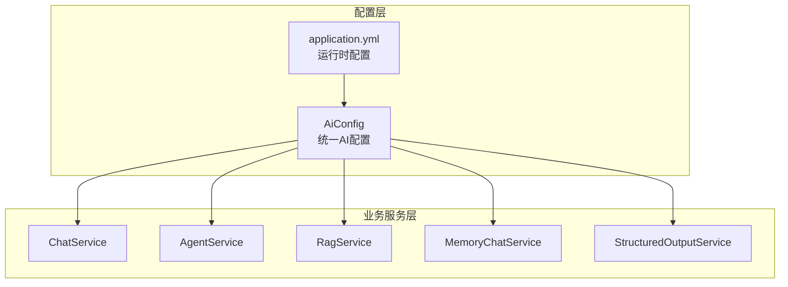
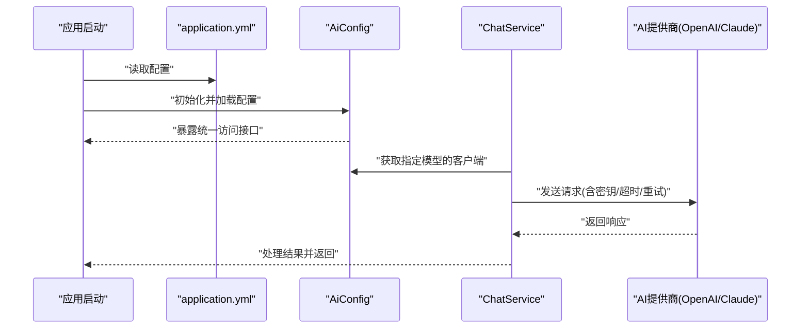
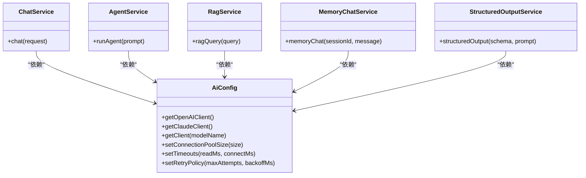
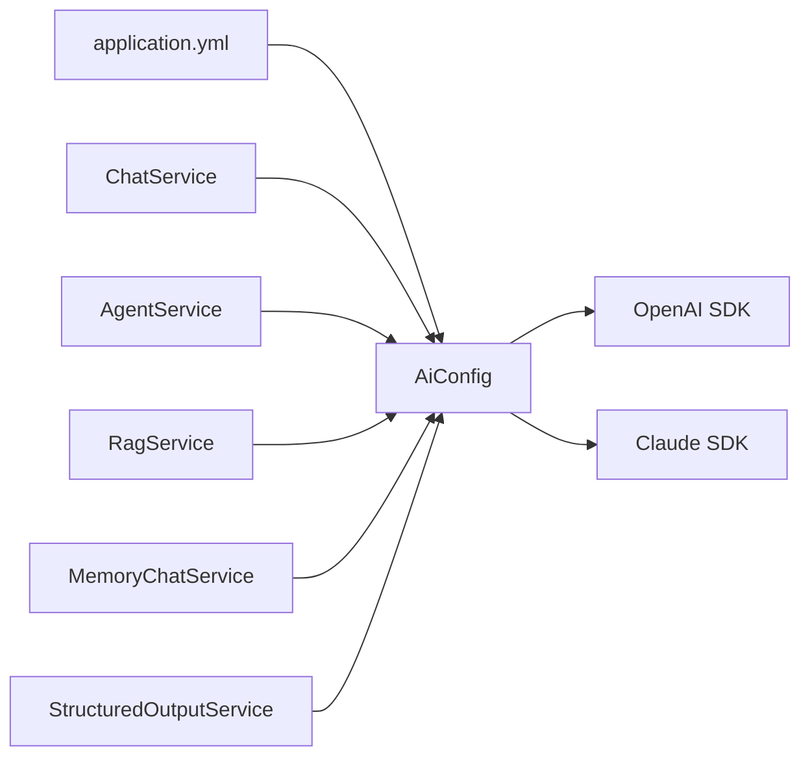

# AI配置中心

<cite>
**本文引用的文件**   
- [AiConfig.java](file://src/main/java/com/ailearn/config/AiConfig.java)
- [application.yml](file://src/main/resources/application.yml)
- [ChatService.java](file://src/main/java/com/ailearn/chat/ChatService.java)
- [AgentService.java](file://src/main/java/com/ailearn/agent/AgentService.java)
- [RagService.java](file://src/main/java/com/ailearn/rag/RagService.java)
- [MemoryChatService.java](file://src/main/java/com/ailearn/memory/MemoryChatService.java)
- [StructuredOutputService.java](file://src/main/java/com/ailearn/structured/StructuredOutputService.java)
</cite>

## 目录
1. [简介](#简介)
2. [项目结构](#项目结构)
3. [核心组件](#核心组件)
4. [架构总览](#架构总览)
5. [详细组件分析](#详细组件分析)
6. [依赖关系分析](#依赖关系分析)
7. [性能考虑](#性能考虑)
8. [故障排查指南](#故障排查指南)
9. [结论](#结论)
10. [附录](#附录)

## 简介
本文件围绕“AI配置中心”展开，聚焦于 AiConfig 类的设计模式与实现原理，系统阐述多AI模型支持架构、API密钥管理策略、请求参数动态配置等核心能力。文档同时给出主流AI服务提供商（如OpenAI、Claude）的配置方法，涵盖连接池、超时、重试等高级选项；并提供不同环境下的配置示例与最佳实践，解释如何扩展新的AI模型支持，最后附上性能优化建议与故障排查指南。

## 项目结构
本项目采用分层与按功能域组织相结合的结构：
- 配置层：集中式AI配置入口位于 config 包，提供统一的多模型接入点。
- 业务服务层：chat、agent、rag、memory、structured 等业务模块通过注入统一的AI配置对象进行调用。
- 资源层：application.yml 作为运行时配置源，承载各AI厂商的密钥、端点、超时、重试等参数。

图表来源
- [AiConfig.java](file://src/main/java/com/ailearn/config/AiConfig.java)
- [application.yml](file://src/main/resources/application.yml)
- [ChatService.java](file://src/main/java/com/ailearn/chat/ChatService.java)
- [AgentService.java](file://src/main/java/com/ailearn/agent/AgentService.java)
- [RagService.java](file://src/main/java/com/ailearn/rag/RagService.java)
- [MemoryChatService.java](file://src/main/java/com/ailearn/memory/MemoryChatService.java)
- [StructuredOutputService.java](file://src/main/java/com/ailearn/structured/StructuredOutputService.java)

章节来源
- [AiConfig.java](file://src/main/java/com/ailearn/config/AiConfig.java)
- [application.yml](file://src/main/resources/application.yml)
- [ChatService.java](file://src/main/java/com/ailearn/chat/ChatService.java)
- [AgentService.java](file://src/main/java/com/ailearn/agent/AgentService.java)
- [RagService.java](file://src/main/java/com/ailearn/rag/RagService.java)
- [MemoryChatService.java](file://src/main/java/com/ailearn/memory/MemoryChatService.java)
- [StructuredOutputService.java](file://src/main/java/com/ailearn/structured/StructuredOutputService.java)

## 核心组件
- AiConfig：作为AI配置中心的核心，负责加载并聚合来自 application.yml 的各AI厂商配置项，提供统一的访问接口供上层服务使用。其职责包括：
  - 多模型支持：以命名空间或键值形式区分不同提供商（如 OpenAI、Claude）。
  - API密钥管理：安全地读取并暴露密钥字段，避免硬编码。
  - 动态参数：将连接池、超时、重试等运行时参数暴露为可配置项。
  - 对外契约：为业务服务提供稳定的获取客户端或会话的方法。

- 业务服务（ChatService、AgentService、RagService、MemoryChatService、StructuredOutputService）：通过依赖注入获取 AiConfig，按需选择具体AI模型实例发起请求。

章节来源
- [AiConfig.java](file://src/main/java/com/ailearn/config/AiConfig.java)
- [ChatService.java](file://src/main/java/com/ailearn/chat/ChatService.java)
- [AgentService.java](file://src/main/java/com/ailearn/agent/AgentService.java)
- [RagService.java](file://src/main/java/com/ailearn/rag/RagService.java)
- [MemoryChatService.java](file://src/main/java/com/ailearn/memory/MemoryChatService.java)
- [StructuredOutputService.java](file://src/main/java/com/ailearn/structured/StructuredOutputService.java)

## 架构总览
下图展示了从配置到服务的整体数据与控制流：应用启动时加载 application.yml，由 AiConfig 解析并构建各AI厂商的客户端；业务服务在运行时根据上下文选择对应模型发起请求。

图表来源
- [application.yml](file://src/main/resources/application.yml)
- [AiConfig.java](file://src/main/java/com/ailearn/config/AiConfig.java)
- [ChatService.java](file://src/main/java/com/ailearn/chat/ChatService.java)

## 详细组件分析

### AiConfig 设计与实现
- 设计模式
  - 配置聚合器：集中读取并合并多个AI厂商的配置片段，形成统一视图。
  - 工厂/选择器：根据模型名称或类型创建对应的客户端实例，屏蔽底层差异。
  - 单例化：通常以Spring Bean方式注册，保证全局唯一与线程安全。
- 关键职责
  - 多模型支持：通过命名空间或键名区分不同提供商，便于横向扩展。
  - 密钥管理：从配置中读取密钥，避免代码内嵌敏感信息。
  - 动态参数：暴露连接池大小、读写超时、最大空闲时间、重试次数等。
  - 对外契约：提供 getXXXClient(modelName) 或类似方法，供业务服务调用。
- 数据结构与复杂度
  - 配置映射：通常为 Map<String, ModelConfig>，查找复杂度 O(1)。
  - 客户端缓存：对已创建的客户端进行缓存，避免重复构造开销。
- 错误处理
  - 缺失配置：抛出明确异常，提示缺少必要字段（如密钥、端点）。
  - 非法参数：校验必填字段与取值范围，失败即快速失败。
- 可扩展性
  - 新增提供商：仅需在配置中增加命名空间并在工厂中补充分支逻辑。
  - 插件化：可通过SPI或策略接口进一步解耦，降低耦合度。

图表来源
- [AiConfig.java](file://src/main/java/com/ailearn/config/AiConfig.java)
- [ChatService.java](file://src/main/java/com/ailearn/chat/ChatService.java)
- [AgentService.java](file://src/main/java/com/ailearn/agent/AgentService.java)
- [RagService.java](file://src/main/java/com/ailearn/rag/RagService.java)
- [MemoryChatService.java](file://src/main/java/com/ailearn/memory/MemoryChatService.java)
- [StructuredOutputService.java](file://src/main/java/com/ailearn/structured/StructuredOutputService.java)

章节来源
- [AiConfig.java](file://src/main/java/com/ailearn/config/AiConfig.java)
- [ChatService.java](file://src/main/java/com/ailearn/chat/ChatService.java)
- [AgentService.java](file://src/main/java/com/ailearn/agent/AgentService.java)
- [RagService.java](file://src/main/java/com/ailearn/rag/RagService.java)
- [MemoryChatService.java](file://src/main/java/com/ailearn/memory/MemoryChatService.java)
- [StructuredOutputService.java](file://src/main/java/com/ailearn/structured/StructuredOutputService.java)

### 多AI模型支持与配置方法
- 支持的提供商
  - OpenAI：需配置密钥、模型名称、可选端点、超时与重试。
  - Claude：需配置密钥、模型名称、可选端点、超时与重试。
- 配置要点
  - 命名空间隔离：每个提供商使用独立命名空间，避免键冲突。
  - 密钥管理：仅从配置文件读取，禁止硬编码。
  - 动态参数：连接池大小、读写超时、最大空闲连接数、重试次数与退避策略。
- 连接池与超时
  - 连接池：控制并发与复用，避免频繁建立连接带来的开销。
  - 超时：合理设置读/写/连接超时，防止长尾请求拖垮系统。
- 重试机制
  - 幂等性：仅对幂等请求启用自动重试。
  - 退避策略：指数退避+抖动，避免雪崩效应。

章节来源
- [application.yml](file://src/main/resources/application.yml)
- [AiConfig.java](file://src/main/java/com/ailearn/config/AiConfig.java)

### 请求参数动态配置
- 动态参数来源
  - 应用配置：application.yml 中的全局默认值。
  - 运行时覆盖：通过环境变量或外部配置中心覆盖默认值。
- 典型参数
  - 模型选择：按业务场景切换不同模型。
  - 并发与吞吐：连接池大小、队列长度。
  - 可靠性：超时阈值、重试次数、退避间隔。
- 生效时机
  - 启动期：加载默认配置并构建客户端。
  - 运行期：若支持热更新，可在不重启的情况下调整部分参数。

章节来源
- [application.yml](file://src/main/resources/application.yml)
- [AiConfig.java](file://src/main/java/com/ailearn/config/AiConfig.java)

### 不同环境的配置示例与最佳实践
- 开发环境
  - 使用本地或沙箱端点，限制并发与重试，缩短超时，便于快速反馈。
- 测试环境
  - 模拟真实流量规模，适度提升连接池与重试，验证稳定性。
- 生产环境
  - 严格密钥管理（环境变量或密钥管理服务），合理调优连接池与超时，开启重试与熔断降级。
- 最佳实践
  - 最小权限原则：为不同环境分配最小可用密钥。
  - 灰度发布：逐步放量新模型或新版本配置。
  - 监控告警：对延迟、错误率、重试次数进行监控与告警。

章节来源
- [application.yml](file://src/main/resources/application.yml)
- [AiConfig.java](file://src/main/java/com/ailearn/config/AiConfig.java)

### 扩展新的AI模型支持
- 步骤概览
  - 在配置文件中新增命名空间与必要字段（密钥、端点、模型名）。
  - 在 AiConfig 中添加对应工厂分支，创建并缓存客户端。
  - 在业务服务中通过统一接口选择新模型。
- 注意事项
  - 保持对外契约稳定，避免破坏现有调用方。
  - 为新模型单独设置超时与重试策略，适配其特性。
  - 完善日志与指标埋点，便于问题定位。

章节来源
- [AiConfig.java](file://src/main/java/com/ailearn/config/AiConfig.java)
- [application.yml](file://src/main/resources/application.yml)

## 依赖关系分析
- 组件耦合
  - 业务服务仅依赖 AiConfig 的统一接口，低耦合高内聚。
  - AiConfig 与具体提供商SDK之间通过工厂/策略解耦。
- 外部依赖
  - HTTP客户端库（用于连接池与超时控制）。
  - 序列化/反序列化库（用于请求与响应处理）。
- 潜在循环依赖
  - 当前结构未见循环依赖风险，AiConfig 被业务服务单向依赖。

图表来源
- [application.yml](file://src/main/resources/application.yml)
- [AiConfig.java](file://src/main/java/com/ailearn/config/AiConfig.java)
- [ChatService.java](file://src/main/java/com/ailearn/chat/ChatService.java)
- [AgentService.java](file://src/main/java/com/ailearn/agent/AgentService.java)
- [RagService.java](file://src/main/java/com/ailearn/rag/RagService.java)
- [MemoryChatService.java](file://src/main/java/com/ailearn/memory/MemoryChatService.java)
- [StructuredOutputService.java](file://src/main/java/com/ailearn/structured/StructuredOutputService.java)

章节来源
- [AiConfig.java](file://src/main/java/com/ailearn/config/AiConfig.java)
- [application.yml](file://src/main/resources/application.yml)

## 性能考虑
- 连接池调优
  - 根据QPS与平均响应时间估算所需连接数，避免过大导致内存压力或过小造成阻塞。
- 超时设置
  - 读超时应大于P95响应时间，连接超时与写超时按网络质量设定。
- 重试策略
  - 仅对幂等请求启用重试；结合指数退避与抖动，避免放大上游压力。
- 缓存与会话
  - 对热点模型客户端进行缓存；必要时引入请求级缓存减少重复计算。
- 监控与限流
  - 对关键指标（延迟、错误率、重试次数、连接池使用率）进行监控；配合限流保护系统。

[本节为通用指导，无需特定文件引用]

## 故障排查指南
- 常见问题
  - 密钥无效或过期：检查配置是否加载成功，确认密钥正确且未泄露。
  - 超时频繁：评估网络状况与超时阈值，适当增大或优化上游处理。
  - 连接池耗尽：观察连接池使用率，调整大小或排查慢请求。
  - 重试风暴：确认请求幂等性与退避策略，必要时关闭非幂等请求的重试。
- 诊断步骤
  - 查看应用日志与指标，定位错误码与堆栈。
  - 使用链路追踪工具核对端到端耗时。
  - 对比不同环境配置差异，逐步缩小范围。
- 恢复措施
  - 临时回滚配置或降级至备用模型。
  - 扩容或限流缓解瞬时峰值。

章节来源
- [AiConfig.java](file://src/main/java/com/ailearn/config/AiConfig.java)
- [application.yml](file://src/main/resources/application.yml)

## 结论
AiConfig 作为AI配置中心，提供了统一的多模型接入、安全的密钥管理与灵活的动态参数配置能力。通过合理的连接池、超时与重试策略，以及完善的监控与故障排查手段，可在多环境下稳定支撑各类AI业务场景。未来可按需扩展更多提供商，并保持对外契约稳定与可观测性。

[本节为总结性内容，无需特定文件引用]

## 附录
- 术语
  - 连接池：复用HTTP连接的集合，提高并发效率。
  - 超时：请求等待响应的最长时间，分为连接、读、写三类。
  - 重试：对失败的请求再次尝试，需考虑幂等性与退避策略。
- 参考路径
  - 配置入口：[application.yml](file://src/main/resources/application.yml)
  - 配置中心实现：[AiConfig.java](file://src/main/java/com/ailearn/config/AiConfig.java)
  - 业务调用示例：[ChatService.java](file://src/main/java/com/ailearn/chat/ChatService.java)、[AgentService.java](file://src/main/java/com/ailearn/agent/AgentService.java)、[RagService.java](file://src/main/java/com/ailearn/rag/RagService.java)、[MemoryChatService.java](file://src/main/java/com/ailearn/memory/MemoryChatService.java)、[StructuredOutputService.java](file://src/main/java/com/ailearn/structured/StructuredOutputService.java)