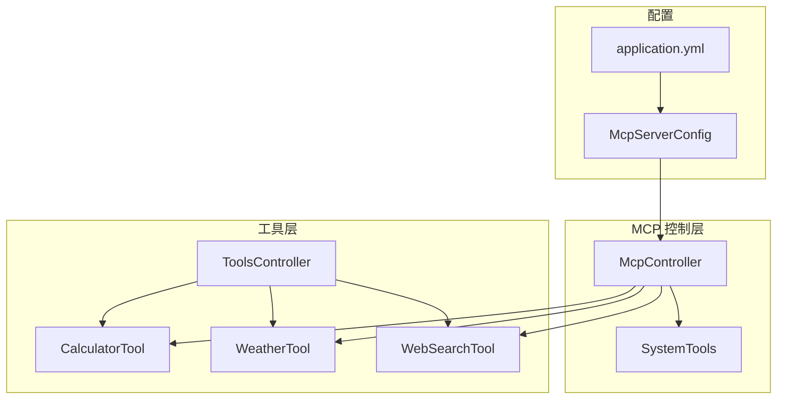
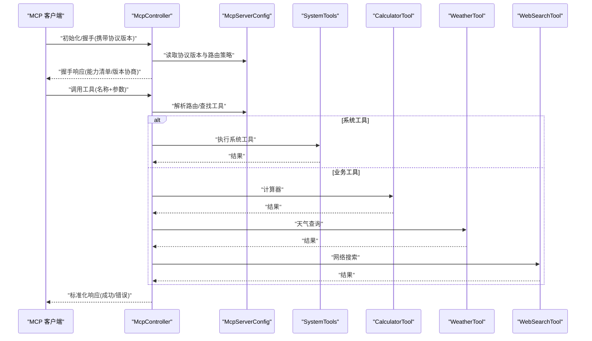
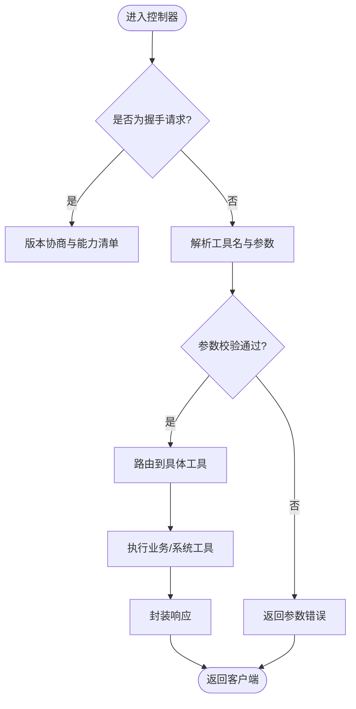
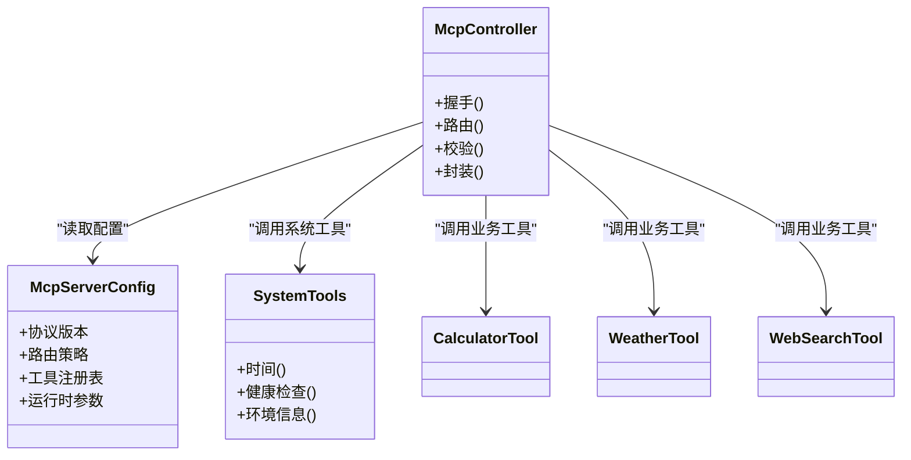

# MCP服务器配置

<cite>
**本文引用的文件**   
- [McpServerConfig.java](file://src/main/java/com/ailearn/config/McpServerConfig.java)
- [McpController.java](file://src/main/java/com/ailearn/mcp/McpController.java)
- [SystemTools.java](file://src/main/java/com/ailearn/mcp/SystemTools.java)
- [CalculatorTool.java](file://src/main/java/com/ailearn/tools/CalculatorTool.java)
- [WeatherTool.java](file://src/main/java/com/ailearn/tools/WeatherTool.java)
- [WebSearchTool.java](file://src/main/java/com/ailearn/tools/WebSearchTool.java)
- [ToolsController.java](file://src/main/java/com/ailearn/tools/ToolsController.java)
- [application.yml](file://src/main/resources/application.yml)
</cite>

## 目录
1. [简介](#简介)
2. [项目结构](#项目结构)
3. [核心组件](#核心组件)
4. [架构总览](#架构总览)
5. [详细组件分析](#详细组件分析)
6. [依赖关系分析](#依赖关系分析)
7. [性能考虑](#性能考虑)
8. [故障排查指南](#故障排查指南)
9. [结论](#结论)
10. [附录](#附录)

## 简介
本文件围绕 Model Context Protocol（MCP）服务器的配置与实现，系统性解析以下主题：
- McpServerConfig 的配置项、协议版本支持、消息路由策略、工具注册机制
- McpController 的消息处理流程与错误处理
- SystemTools 的系统工具集成方式
- MCP 协议的通信模式、数据格式规范与错误处理机制
- 自定义 MCP 工具的扩展开发指南（定义、参数校验、异步处理）
- MCP 客户端集成示例与调试技巧

## 项目结构
本项目采用分层组织方式，MCP 相关能力集中在 mcp 与 config 包中，并通过 tools 包提供可插拔的工具实现。关键路径如下：
- 配置层：config/McpServerConfig.java、resources/application.yml
- 控制层：mcp/McpController.java
- 系统工具：mcp/SystemTools.java
- 业务工具：tools/*（计算器、天气、搜索等）
- 工具控制器：tools/ToolsController.java（用于传统 HTTP 访问或测试）

图表来源
- [McpServerConfig.java](file://src/main/java/com/ailearn/config/McpServerConfig.java)
- [McpController.java](file://src/main/java/com/ailearn/mcp/McpController.java)
- [SystemTools.java](file://src/main/java/com/ailearn/mcp/SystemTools.java)
- [CalculatorTool.java](file://src/main/java/com/ailearn/tools/CalculatorTool.java)
- [WeatherTool.java](file://src/main/java/com/ailearn/tools/WeatherTool.java)
- [WebSearchTool.java](file://src/main/java/com/ailearn/tools/WebSearchTool.java)
- [ToolsController.java](file://src/main/java/com/ailearn/tools/ToolsController.java)
- [application.yml](file://src/main/resources/application.yml)

章节来源
- [McpServerConfig.java](file://src/main/java/com/ailearn/config/McpServerConfig.java)
- [McpController.java](file://src/main/java/com/ailearn/mcp/McpController.java)
- [SystemTools.java](file://src/main/java/com/ailearn/mcp/SystemTools.java)
- [CalculatorTool.java](file://src/main/java/com/ailearn/tools/CalculatorTool.java)
- [WeatherTool.java](file://src/main/java/com/ailearn/tools/WeatherTool.java)
- [WebSearchTool.java](file://src/main/java/com/ailearn/tools/WebSearchTool.java)
- [ToolsController.java](file://src/main/java/com/ailearn/tools/ToolsController.java)
- [application.yml](file://src/main/resources/application.yml)

## 核心组件
- McpServerConfig：集中管理 MCP 服务器运行期配置，包括协议版本、消息路由策略、工具注册开关、超时与限流等。
- McpController：MCP 请求入口，负责协议握手、消息分发、调用工具、返回结果与错误封装。
- SystemTools：内置系统级工具集合，如时间、环境信息、健康检查等，供 MCP 直接调用。
- Tools 包：通用业务工具（计算器、天气、搜索），既可通过 MCP 暴露，也可通过 ToolsController 以 REST 形式访问。

章节来源
- [McpServerConfig.java](file://src/main/java/com/ailearn/config/McpServerConfig.java)
- [McpController.java](file://src/main/java/com/ailearn/mcp/McpController.java)
- [SystemTools.java](file://src/main/java/com/ailearn/mcp/SystemTools.java)
- [ToolsController.java](file://src/main/java/com/ailearn/tools/ToolsController.java)

## 架构总览
下图展示了 MCP 服务端从配置到消息处理的端到端流程，以及工具注册与调用的关系。

图表来源
- [McpController.java](file://src/main/java/com/ailearn/mcp/McpController.java)
- [McpServerConfig.java](file://src/main/java/com/ailearn/config/McpServerConfig.java)
- [SystemTools.java](file://src/main/java/com/ailearn/mcp/SystemTools.java)
- [CalculatorTool.java](file://src/main/java/com/ailearn/tools/CalculatorTool.java)
- [WeatherTool.java](file://src/main/java/com/ailearn/tools/WeatherTool.java)
- [WebSearchTool.java](file://src/main/java/com/ailearn/tools/WebSearchTool.java)

## 详细组件分析

### McpServerConfig：服务器配置中心
职责与要点
- 协议版本支持：声明支持的 MCP 协议版本范围，并在握手阶段进行协商。
- 消息路由配置：定义工具发现、命名空间、路由规则与优先级。
- 工具注册机制：集中注册系统工具与业务工具，支持按条件启用/禁用。
- 运行时参数：包含超时、重试、限流、日志级别等运行期开关。

建议配置项（结合 application.yml 与代码）
- 协议版本：最小/最大支持版本、默认版本
- 路由策略：工具前缀、命名空间映射、是否允许动态注册
- 工具开关：系统工具、业务工具分组开关
- 性能与安全：超时、并发限制、鉴权开关

章节来源
- [McpServerConfig.java](file://src/main/java/com/ailearn/config/McpServerConfig.java)
- [application.yml](file://src/main/resources/application.yml)

### McpController：消息处理与路由
职责与要点
- 协议握手：接收客户端初始化请求，返回能力清单与版本协商结果。
- 消息分发：根据工具名与命名空间将请求路由至对应工具处理器。
- 参数校验：对入参进行基础校验，失败时返回结构化错误。
- 结果封装：统一包装成功/失败响应，保证客户端一致性。
- 错误处理：捕获异常并转换为标准错误码与消息。

典型处理流程
- 初始化/握手 -> 版本协商 -> 能力清单下发
- 工具调用 -> 路由解析 -> 参数校验 -> 工具执行 -> 结果封装
- 异常 -> 错误转换 -> 返回错误响应

图表来源
- [McpController.java](file://src/main/java/com/ailearn/mcp/McpController.java)

章节来源
- [McpController.java](file://src/main/java/com/ailearn/mcp/McpController.java)

### SystemTools：系统工具集成
职责与要点
- 提供系统级能力：如时间获取、进程/内存信息、健康检查等。
- 与 McpController 解耦：通过接口或静态方法暴露，便于复用与测试。
- 安全边界：对敏感信息进行脱敏或白名单过滤。

使用场景
- 运维监控：健康检查、资源水位
- 调试诊断：环境信息、日志定位
- 自动化任务：定时任务前置检查

章节来源
- [SystemTools.java](file://src/main/java/com/ailearn/mcp/SystemTools.java)

### 工具层：CalculatorTool / WeatherTool / WebSearchTool
职责与要点
- CalculatorTool：数学计算、表达式求值、单位换算等。
- WeatherTool：天气查询、城市编码、温度/降水等字段。
- WebSearchTool：搜索引擎调用、分页、结果摘要。

设计原则
- 单一职责：每个工具聚焦一个领域能力
- 输入输出契约：明确参数结构与返回模型
- 错误语义：区分网络错误、业务错误与参数错误

章节来源
- [CalculatorTool.java](file://src/main/java/com/ailearn/tools/CalculatorTool.java)
- [WeatherTool.java](file://src/main/java/com/ailearn/tools/WeatherTool.java)
- [WebSearchTool.java](file://src/main/java/com/ailearn/tools/WebSearchTool.java)

### ToolsController：REST 访问入口
职责与要点
- 为工具提供传统 HTTP API，便于浏览器或第三方系统直连。
- 与 MCP 通道并行存在，互不影响。

章节来源
- [ToolsController.java](file://src/main/java/com/ailearn/tools/ToolsController.java)

## 依赖关系分析
- 低耦合：McpController 仅依赖配置与工具抽象，不感知具体实现细节。
- 高内聚：各工具类内部封装完整的数据访问与业务逻辑。
- 可扩展：新增工具只需遵循契约并在配置中注册即可被 MCP 发现。

图表来源
- [McpServerConfig.java](file://src/main/java/com/ailearn/config/McpServerConfig.java)
- [McpController.java](file://src/main/java/com/ailearn/mcp/McpController.java)
- [SystemTools.java](file://src/main/java/com/ailearn/mcp/SystemTools.java)
- [CalculatorTool.java](file://src/main/java/com/ailearn/tools/CalculatorTool.java)
- [WeatherTool.java](file://src/main/java/com/ailearn/tools/WeatherTool.java)
- [WebSearchTool.java](file://src/main/java/com/ailearn/tools/WebSearchTool.java)

章节来源
- [McpServerConfig.java](file://src/main/java/com/ailearn/config/McpServerConfig.java)
- [McpController.java](file://src/main/java/com/ailearn/mcp/McpController.java)
- [SystemTools.java](file://src/main/java/com/ailearn/mcp/SystemTools.java)
- [CalculatorTool.java](file://src/main/java/com/ailearn/tools/CalculatorTool.java)
- [WeatherTool.java](file://src/main/java/com/ailearn/tools/WeatherTool.java)
- [WebSearchTool.java](file://src/main/java/com/ailearn/tools/WebSearchTool.java)

## 性能考虑
- 连接与会话：合理设置握手超时与空闲会话清理策略，避免资源泄露。
- 并发与限流：在控制器层引入令牌桶或漏桶限流，保护后端工具。
- 缓存：对热点工具（如天气、搜索）增加短期缓存，降低外部依赖压力。
- 异步化：对耗时操作采用异步执行与回调，提升吞吐。
- 序列化：选择轻量级序列化方案，减少 CPU 与带宽开销。

[本节为通用指导，无需源码引用]

## 故障排查指南
常见问题与定位思路
- 握手失败：检查协议版本范围、能力清单是否匹配；确认 McpServerConfig 的版本策略。
- 工具未找到：核对工具名与命名空间、路由配置是否正确；确认工具已注册。
- 参数校验失败：查看入参结构是否符合契约；关注必填字段与类型约束。
- 超时/限流：观察控制器层超时与限流配置；检查下游服务可用性。
- 错误码不一致：确认错误封装是否统一；对比客户端期望的错误结构。

定位步骤
- 开启调试日志：在 application.yml 中调整日志级别，关注控制器与工具执行链路。
- 抓包与回放：记录握手与工具调用报文，复现问题并比对差异。
- 隔离验证：先调用 ToolsController 的 REST 接口，排除 MCP 通道问题。

章节来源
- [McpController.java](file://src/main/java/com/ailearn/mcp/McpController.java)
- [application.yml](file://src/main/resources/application.yml)

## 结论
通过 McpServerConfig 集中化的配置与 McpController 标准化的消息处理，本项目实现了可扩展、可观测、易维护的 MCP 服务器。SystemTools 与业务工具解耦清晰，便于快速扩展新能力。配合合理的性能与排障策略，可在生产环境中稳定运行。

[本节为总结性内容，无需源码引用]

## 附录

### MCP 协议通信模式与数据格式规范
- 通信模式
  - 握手/初始化：客户端发送初始化请求，服务端返回能力清单与版本协商结果。
  - 工具调用：客户端携带工具名与参数发起调用，服务端路由并返回结果。
  - 心跳/保活：可选的心跳机制，维持长连接活跃。
- 数据格式
  - 请求体：包含 id、method、params 等字段；method 标识工具名或控制命令。
  - 响应体：包含 id、result 或 error；error 包含 code、message、data。
- 错误处理
  - 参数错误：返回明确的参数缺失/类型错误。
  - 业务错误：返回业务码与可读消息。
  - 系统错误：返回通用错误码与堆栈摘要（生产环境脱敏）。

[本节为概念说明，无需源码引用]

### 自定义 MCP 工具扩展开发指南
- 工具定义
  - 新建工具类，明确输入参数与返回值结构。
  - 为工具添加元数据：名称、描述、参数 Schema。
- 参数校验
  - 在工具入口处进行非空、类型、范围校验。
  - 对复杂对象进行 JSON Schema 校验。
- 异步处理
  - 对耗时操作使用异步线程池或响应式编程。
  - 返回 Future/Promise 或在控制器层编排异步结果。
- 注册与发现
  - 在 McpServerConfig 中注册工具，指定命名空间与路由规则。
  - 确保工具名唯一且符合命名约定。
- 测试与发布
  - 单元测试覆盖正常与异常分支。
  - 集成测试模拟 MCP 客户端调用。
  - 灰度发布与回滚策略。

[本节为实践指南，无需源码引用]

### MCP 客户端集成示例与调试技巧
- 客户端集成
  - 建立连接并发送初始化请求，保存服务端能力清单。
  - 根据能力清单动态生成工具调用界面。
  - 处理握手失败、工具不存在、参数错误等场景。
- 调试技巧
  - 使用本地代理抓包，查看握手与调用报文。
  - 在服务端开启 DEBUG 日志，追踪工具执行链路。
  - 借助 ToolsController 的 REST 接口先行验证工具逻辑。

[本节为实践指南，无需源码引用]