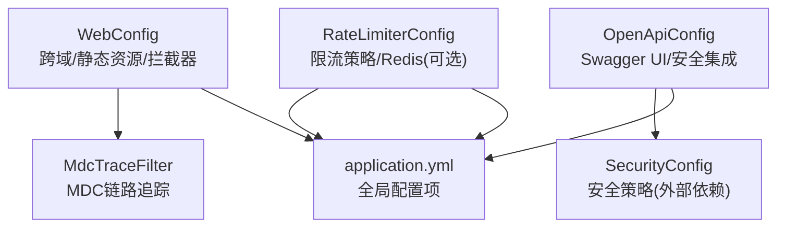
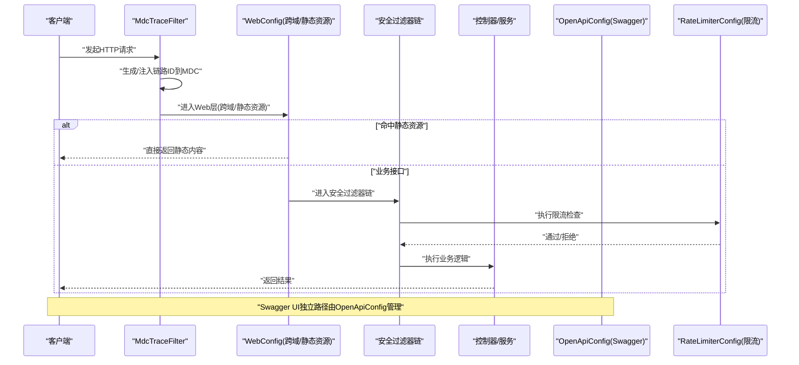
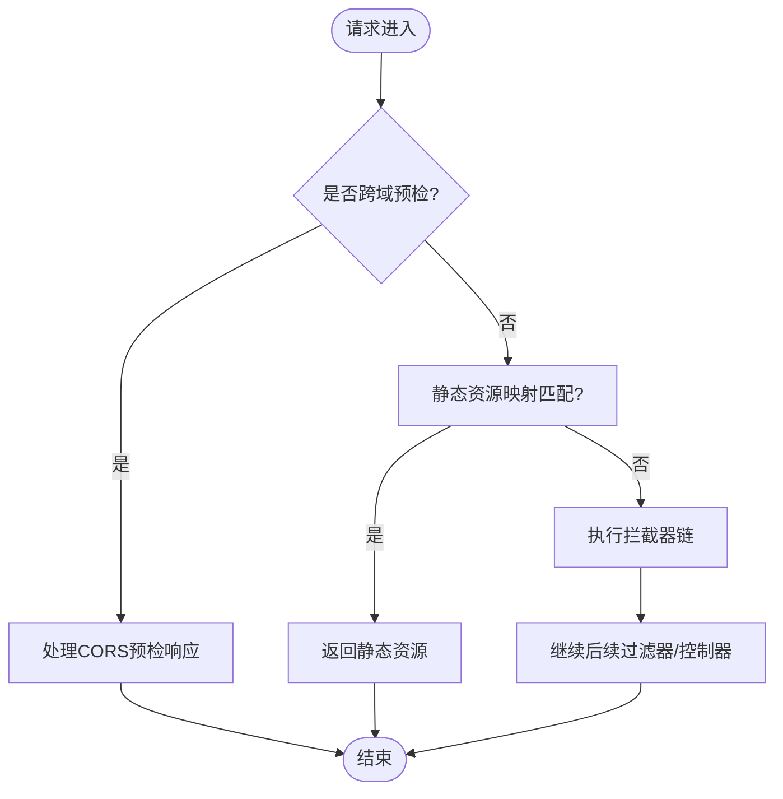
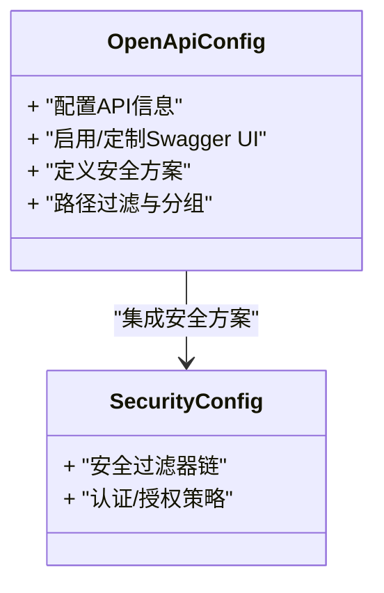
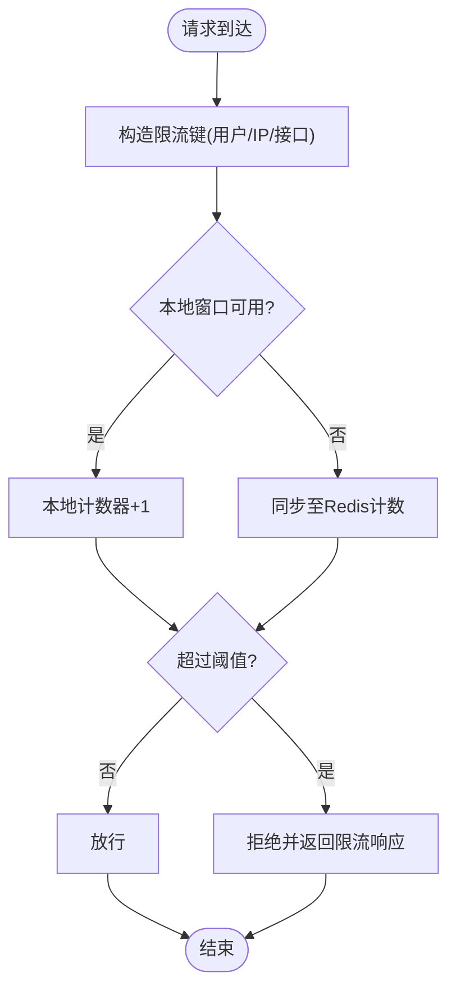
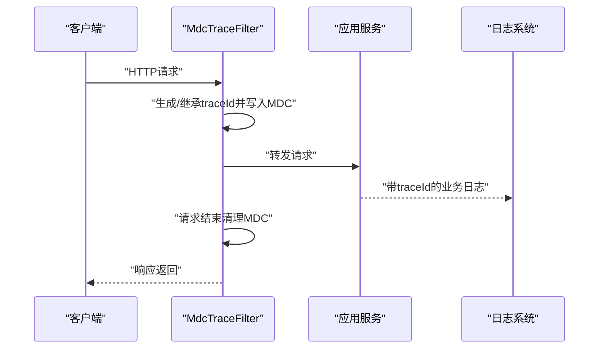
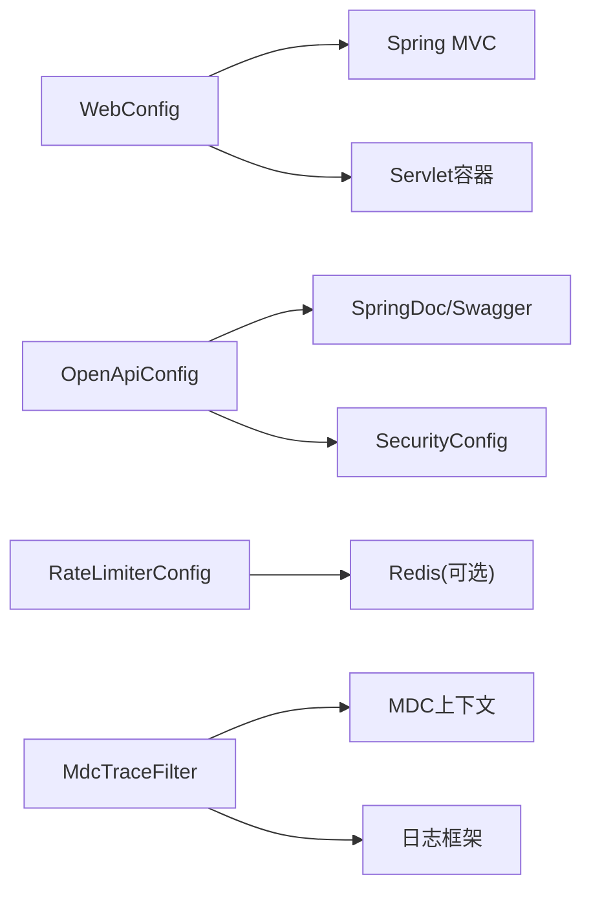

# Web配置

<cite>
**本文引用的文件**   
- [WebConfig.java](file://src/main/java/com/ailearn/config/WebConfig.java)
- [OpenApiConfig.java](file://src/main/java/com/ailearn/config/OpenApiConfig.java)
- [RateLimiterConfig.java](file://src/main/java/com/ailearn/config/RateLimiterConfig.java)
- [MdcTraceFilter.java](file://src/main/java/com/ailearn/config/MdcTraceFilter.java)
- [application.yml](file://src/main/resources/application.yml)
</cite>

## 目录
1. [简介](#简介)
2. [项目结构](#项目结构)
3. [核心组件](#核心组件)
4. [架构总览](#架构总览)
5. [详细组件分析](#详细组件分析)
6. [依赖关系分析](#依赖关系分析)
7. [性能考虑](#性能考虑)
8. [故障排查指南](#故障排查指南)
9. [结论](#结论)
10. [附录](#附录)

## 简介
本文件聚焦于Web层配置，系统性解析以下关键能力：
- WebConfig：跨域设置、静态资源映射、拦截器注册等Web基础能力
- OpenApiConfig：API文档自动生成与UI定制、安全认证集成
- RateLimiterConfig：请求限流策略（滑动窗口、分布式扩展）
- MdcTraceFilter：请求链路追踪（链路ID生成、日志关联）
并提供Web层性能优化与安全加固的最佳实践建议。

## 项目结构
Web相关配置位于config包中，配合resources下的应用配置文件共同生效。下图展示了与Web配置相关的核心文件及其职责边界。

图表来源
- [WebConfig.java](file://src/main/java/com/ailearn/config/WebConfig.java)
- [OpenApiConfig.java](file://src/main/java/com/ailearn/config/OpenApiConfig.java)
- [RateLimiterConfig.java](file://src/main/java/com/ailearn/config/RateLimiterConfig.java)
- [MdcTraceFilter.java](file://src/main/java/com/ailearn/config/MdcTraceFilter.java)
- [application.yml](file://src/main/resources/application.yml)

章节来源
- [WebConfig.java](file://src/main/java/com/ailearn/config/WebConfig.java)
- [OpenApiConfig.java](file://src/main/java/com/ailearn/config/OpenApiConfig.java)
- [RateLimiterConfig.java](file://src/main/java/com/ailearn/config/RateLimiterConfig.java)
- [MdcTraceFilter.java](file://src/main/java/com/ailearn/config/MdcTraceFilter.java)
- [application.yml](file://src/main/resources/application.yml)

## 核心组件
本节对四个核心配置类进行概览式说明，后续章节将深入展开实现细节与最佳实践。

- WebConfig
  - 负责跨域访问控制、静态资源映射、拦截器注册等Web容器级配置
  - 典型能力包括允许的来源、方法、头部、凭据开关、路径匹配规则等
- OpenApiConfig
  - 负责SpringDoc/Swagger的启用、分组、UI路径定制、安全认证集成
  - 典型能力包括API信息、授权定义、UI参数、过滤规则等
- RateLimiterConfig
  - 负责限流策略装配，支持本地滑动窗口或基于Redis的分布式限流
  - 典型能力包括令牌桶/漏桶、滑动时间窗、键空间隔离、降级响应
- MdcTraceFilter
  - 负责在请求生命周期内注入并透传MDC上下文（如traceId）
  - 典型能力包括链路ID生成、请求开始/结束埋点、异常兜底清理

章节来源
- [WebConfig.java](file://src/main/java/com/ailearn/config/WebConfig.java)
- [OpenApiConfig.java](file://src/main/java/com/ailearn/config/OpenApiConfig.java)
- [RateLimiterConfig.java](file://src/main/java/com/ailearn/config/RateLimiterConfig.java)
- [MdcTraceFilter.java](file://src/main/java/com/ailearn/config/MdcTraceFilter.java)

## 架构总览
下图展示Web请求进入后的处理链路，以及各配置组件的作用位置。

图表来源
- [MdcTraceFilter.java](file://src/main/java/com/ailearn/config/MdcTraceFilter.java)
- [WebConfig.java](file://src/main/java/com/ailearn/config/WebConfig.java)
- [OpenApiConfig.java](file://src/main/java/com/ailearn/config/OpenApiConfig.java)
- [RateLimiterConfig.java](file://src/main/java/com/ailearn/config/RateLimiterConfig.java)

## 详细组件分析

### WebConfig：跨域、静态资源与拦截器
- 跨域设置
  - 支持按来源、方法、头部、凭据进行精细化控制
  - 可结合环境配置动态调整允许的域名集合
- 静态资源映射
  - 提供静态资源目录映射与缓存策略
  - 便于前后端分离部署时前端构建产物的高效访问
- 拦截器注册
  - 统一注册自定义拦截器，用于鉴权、审计、监控等横切关注点
  - 可通过路径模式精确控制拦截范围

图表来源
- [WebConfig.java](file://src/main/java/com/ailearn/config/WebConfig.java)

章节来源
- [WebConfig.java](file://src/main/java/com/ailearn/config/WebConfig.java)

### OpenApiConfig：API文档自动生成与安全集成
- Swagger UI定制
  - 自定义UI路径、标题、版本、描述等元数据
  - 可按模块或标签进行分组，提升可读性
- 安全认证集成
  - 为受保护接口注入认证入口（如Bearer Token）
  - 与系统安全配置联动，确保文档与生产一致的安全体验
- 访问控制
  - 可针对特定路径开放文档访问，或在非开发环境禁用UI

图表来源
- [OpenApiConfig.java](file://src/main/java/com/ailearn/config/OpenApiConfig.java)
- [application.yml](file://src/main/resources/application.yml)

章节来源
- [OpenApiConfig.java](file://src/main/java/com/ailearn/config/OpenApiConfig.java)
- [application.yml](file://src/main/resources/application.yml)

### RateLimiterConfig：请求限流策略
- 算法与策略
  - 支持滑动窗口算法，平滑突发流量，避免固定窗口抖动
  - 可组合令牌桶/漏桶策略，适配不同场景（写多读少、长连接等）
- 分布式限流
  - 基于Redis的共享计数与原子操作，保证多实例一致性
  - 键空间隔离（按用户、IP、接口维度），防止热点越界
- 降级与反馈
  - 触发限流时返回标准错误码与提示，便于前端重试与退避
  - 暴露统计指标，支撑告警与容量规划

图表来源
- [RateLimiterConfig.java](file://src/main/java/com/ailearn/config/RateLimiterConfig.java)
- [application.yml](file://src/main/resources/application.yml)

章节来源
- [RateLimiterConfig.java](file://src/main/java/com/ailearn/config/RateLimiterConfig.java)
- [application.yml](file://src/main/resources/application.yml)

### MdcTraceFilter：请求追踪机制
- 链路ID生成
  - 在请求入口处生成唯一traceId，写入MDC上下文
  - 若上游已携带链路标识，则透传保持链路连续性
- 日志关联分析
  - 所有日志输出自动附带traceId，便于全链路检索与聚合
  - 在异常分支确保MDC清理，避免线程池复用导致污染
- 性能考量
  - 轻量级字符串操作，避免阻塞主流程
  - 可与异步任务传递MDC上下文，保障异步链路完整

图表来源
- [MdcTraceFilter.java](file://src/main/java/com/ailearn/config/MdcTraceFilter.java)

章节来源
- [MdcTraceFilter.java](file://src/main/java/com/ailearn/config/MdcTraceFilter.java)

## 依赖关系分析
- WebConfig依赖Spring MVC与Servlet容器能力，负责跨域、静态资源与拦截器装配
- OpenApiConfig依赖SpringDoc/Swagger生态，并与安全配置协作
- RateLimiterConfig可能依赖Redis以支持分布式限流；本地模式无需外部依赖
- MdcTraceFilter作为Servlet Filter参与请求生命周期，与日志框架协同

图表来源
- [WebConfig.java](file://src/main/java/com/ailearn/config/WebConfig.java)
- [OpenApiConfig.java](file://src/main/java/com/ailearn/config/OpenApiConfig.java)
- [RateLimiterConfig.java](file://src/main/java/com/ailearn/config/RateLimiterConfig.java)
- [MdcTraceFilter.java](file://src/main/java/com/ailearn/config/MdcTraceFilter.java)

章节来源
- [WebConfig.java](file://src/main/java/com/ailearn/config/WebConfig.java)
- [OpenApiConfig.java](file://src/main/java/com/ailearn/config/OpenApiConfig.java)
- [RateLimiterConfig.java](file://src/main/java/com/ailearn/config/RateLimiterConfig.java)
- [MdcTraceFilter.java](file://src/main/java/com/ailearn/config/MdcTraceFilter.java)

## 性能考虑
- 跨域优化
  - 合理缩小允许来源列表，减少预检请求开销
  - 开启必要的缓存头，降低浏览器重复预检频率
- 静态资源
  - 使用CDN或反向代理缓存静态资源，缩短首字节时间
  - 合理设置缓存失效策略，兼顾更新与缓存命中率
- 限流
  - 优先使用本地窗口做粗粒度保护，热点接口再叠加Redis分布式限流
  - 对限流键进行归一化，避免键爆炸
- 链路追踪
  - traceId采用短且稳定的格式，避免日志体积过大
  - 异步链路需显式传递MDC上下文，避免丢失链路信息

[本节为通用指导，不直接分析具体文件]

## 故障排查指南
- 跨域失败
  - 检查来源、方法、头部与凭据配置是否与前端一致
  - 确认预检请求是否被正确放行
- 静态资源404
  - 核对静态资源映射路径与实际目录结构
  - 检查缓存与压缩策略是否影响资源加载
- 限流误杀
  - 校验限流键是否过于宽泛或过细
  - 观察阈值与时间窗口是否合理，必要时引入分级限流
- 链路缺失
  - 确认MdcTraceFilter是否在所有入口生效
  - 检查异步线程池是否正确传递MDC上下文

章节来源
- [WebConfig.java](file://src/main/java/com/ailearn/config/WebConfig.java)
- [RateLimiterConfig.java](file://src/main/java/com/ailearn/config/RateLimiterConfig.java)
- [MdcTraceFilter.java](file://src/main/java/com/ailearn/config/MdcTraceFilter.java)

## 结论
通过对WebConfig、OpenApiConfig、RateLimiterConfig与MdcTraceFilter的系统化梳理，可以构建出高可用、易观测、可扩展的Web层基础设施。建议在上线前完成跨域白名单收敛、静态资源缓存策略验证、限流阈值压测与链路追踪端到端联调，以确保线上稳定性与可维护性。

[本节为总结性内容，不直接分析具体文件]

## 附录
- 配置项参考
  - application.yml：集中存放与环境相关的Web、文档、限流等配置项
  - 建议将敏感配置（如允许来源、限流阈值）纳入配置中心统一管理

章节来源
- [application.yml](file://src/main/resources/application.yml)