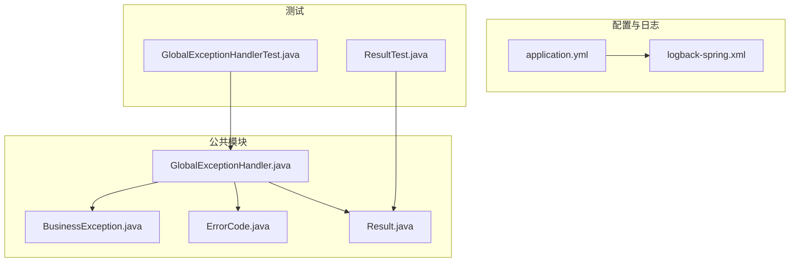
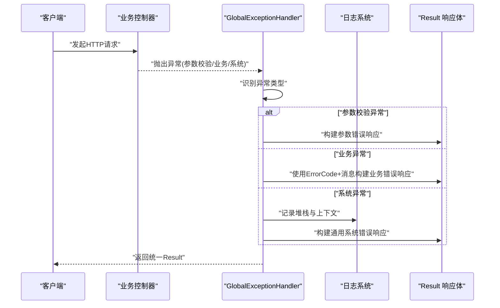
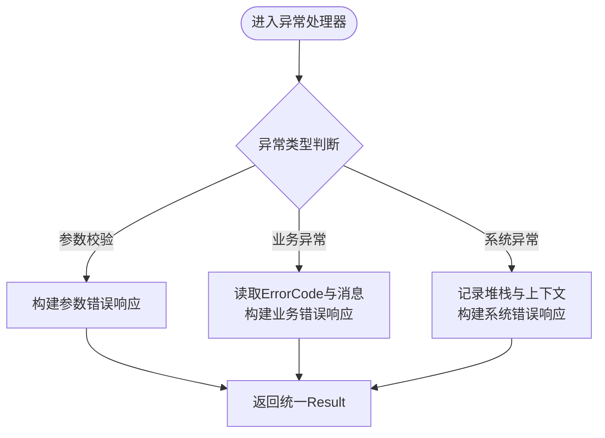
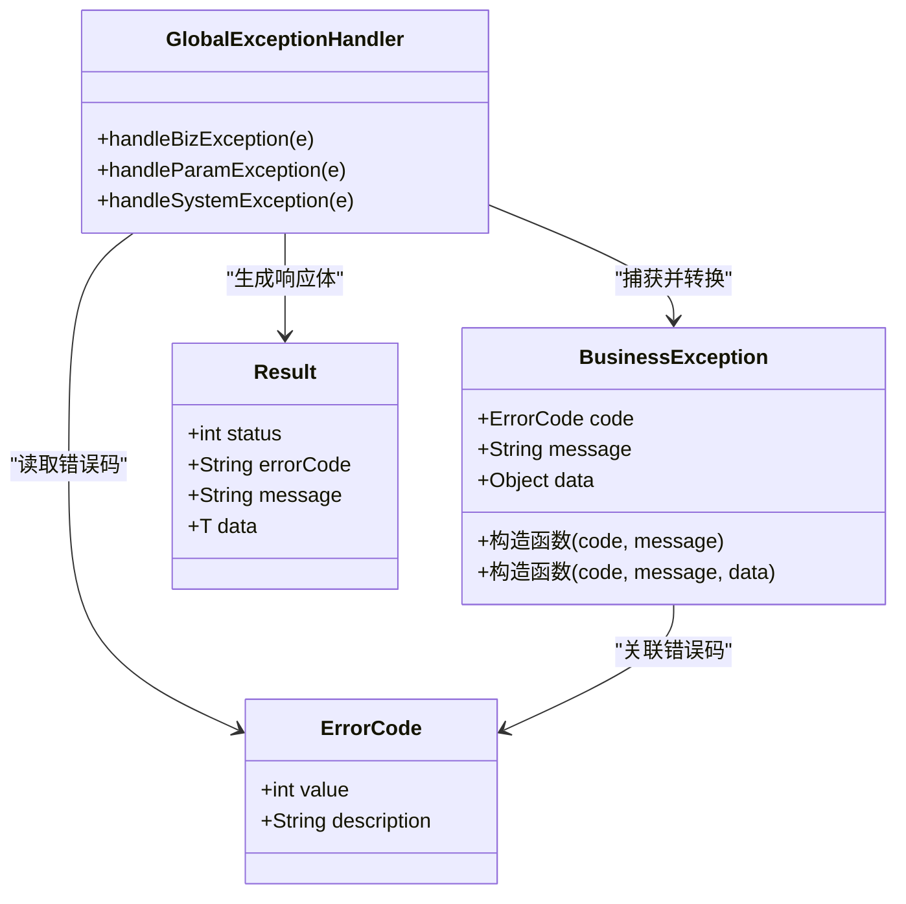
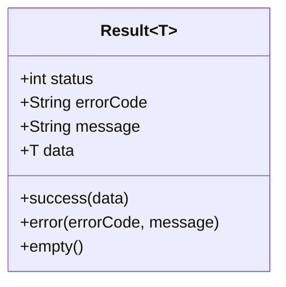
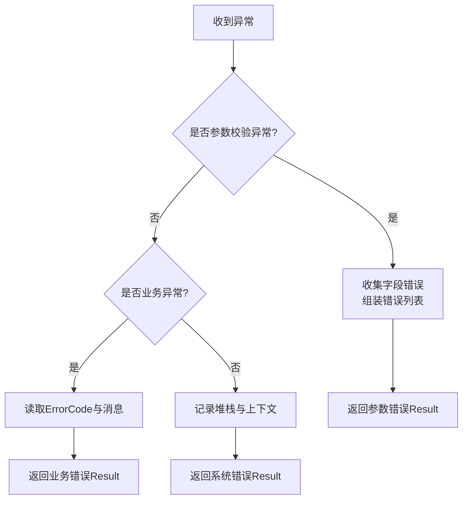
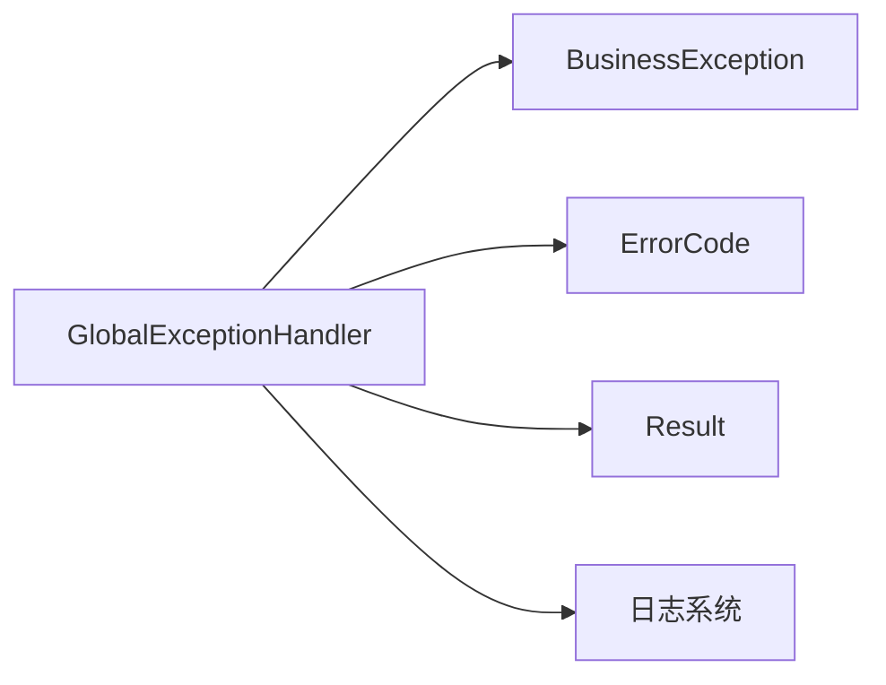

# 全局异常处理

<cite>
**本文引用的文件**   
- [GlobalExceptionHandler.java](file://src/main/java/com/ailearn/common/GlobalExceptionHandler.java)
- [BusinessException.java](file://src/main/java/com/ailearn/common/BusinessException.java)
- [ErrorCode.java](file://src/main/java/com/ailearn/common/ErrorCode.java)
- [Result.java](file://src/main/java/com/ailearn/common/Result.java)
- [application.yml](file://src/main/resources/application.yml)
- [logback-spring.xml](file://src/main/resources/logback-spring.xml)
- [GlobalExceptionHandlerTest.java](file://src/test/java/com/ailearn/common/GlobalExceptionHandlerTest.java)
- [ResultTest.java](file://src/test/java/com/ailearn/common/ResultTest.java)
</cite>

## 目录
1. [简介](#简介)
2. [项目结构](#项目结构)
3. [核心组件](#核心组件)
4. [架构总览](#架构总览)
5. [详细组件分析](#详细组件分析)
6. [依赖关系分析](#依赖关系分析)
7. [性能考虑](#性能考虑)
8. [故障排查指南](#故障排查指南)
9. [结论](#结论)
10. [附录](#附录)

## 简介
本文件聚焦于全局异常处理的统一设计与实现，围绕以下目标展开：
- 解析 GlobalExceptionHandler 的统一异常捕获与处理机制
- 说明 BusinessException 的定义与分类、ErrorCode 的标准化管理
- 阐述 Result 统一响应格式的设计模式与序列化策略
- 解释参数校验异常、业务逻辑异常、系统异常的差异化处理流程
- 提供自定义异常扩展方法与最佳实践
- 给出异常日志记录与监控告警的配置指南

## 项目结构
全局异常处理相关代码集中在 common 包中，并通过 Spring MVC 的异常处理机制在请求链路中生效。测试用例位于 test 目录对应位置，用于验证行为与契约。

图表来源
- [GlobalExceptionHandler.java](file://src/main/java/com/ailearn/common/GlobalExceptionHandler.java)
- [BusinessException.java](file://src/main/java/com/ailearn/common/BusinessException.java)
- [ErrorCode.java](file://src/main/java/com/ailearn/common/ErrorCode.java)
- [Result.java](file://src/main/java/com/ailearn/common/Result.java)
- [application.yml](file://src/main/resources/application.yml)
- [logback-spring.xml](file://src/main/resources/logback-spring.xml)
- [GlobalExceptionHandlerTest.java](file://src/test/java/com/ailearn/common/GlobalExceptionHandlerTest.java)
- [ResultTest.java](file://src/test/java/com/ailearn/common/ResultTest.java)

章节来源
- [GlobalExceptionHandler.java](file://src/main/java/com/ailearn/common/GlobalExceptionHandler.java)
- [BusinessException.java](file://src/main/java/com/ailearn/common/BusinessException.java)
- [ErrorCode.java](file://src/main/java/com/ailearn/common/ErrorCode.java)
- [Result.java](file://src/main/java/com/ailearn/common/Result.java)
- [application.yml](file://src/main/resources/application.yml)
- [logback-spring.xml](file://src/main/resources/logback-spring.xml)
- [GlobalExceptionHandlerTest.java](file://src/test/java/com/ailearn/common/GlobalExceptionHandlerTest.java)
- [ResultTest.java](file://src/test/java/com/ailearn/common/ResultTest.java)

## 核心组件
- GlobalExceptionHandler：集中拦截并处理各类异常，将异常转换为统一的 Result 响应体，确保前端一致体验。
- BusinessException：业务层抛出的可预期异常，携带 ErrorCode 和可选消息，便于上层区分错误类型。
- ErrorCode：错误码枚举或常量集合，统一管理错误码与默认描述，保证跨模块一致性。
- Result：统一响应封装，包含状态码、错误码、消息与数据载荷，并提供便捷构造方法。

章节来源
- [GlobalExceptionHandler.java](file://src/main/java/com/ailearn/common/GlobalExceptionHandler.java)
- [BusinessException.java](file://src/main/java/com/ailearn/common/BusinessException.java)
- [ErrorCode.java](file://src/main/java/com/ailearn/common/ErrorCode.java)
- [Result.java](file://src/main/java/com/ailearn/common/Result.java)

## 架构总览
下图展示了从请求进入控制器到异常被统一处理的完整调用链，以及各组件之间的协作关系。

图表来源
- [GlobalExceptionHandler.java](file://src/main/java/com/ailearn/common/GlobalExceptionHandler.java)
- [BusinessException.java](file://src/main/java/com/ailearn/common/BusinessException.java)
- [ErrorCode.java](file://src/main/java/com/ailearn/common/ErrorCode.java)
- [Result.java](file://src/main/java/com/ailearn/common/Result.java)

## 详细组件分析

### GlobalExceptionHandler 统一异常处理
- 职责
  - 捕获控制器层抛出的所有异常
  - 按异常类型分流处理（参数校验、业务、系统）
  - 生成一致的 Result 响应体
  - 对关键异常进行日志记录，必要时触发告警
- 处理流程要点
  - 参数校验异常：提取校验信息，映射为友好的错误码与消息
  - 业务异常：直接复用 BusinessException 中的 ErrorCode 与消息
  - 系统异常：记录详细堆栈，对外仅暴露安全提示，避免泄露内部细节
- 可扩展点
  - 新增异常类型时，增加对应的处理方法即可
  - 结合 MDC 注入 traceId，便于链路追踪
  - 对接外部监控系统（如 Prometheus、SkyWalking）上报指标

图表来源
- [GlobalExceptionHandler.java](file://src/main/java/com/ailearn/common/GlobalExceptionHandler.java)

章节来源
- [GlobalExceptionHandler.java](file://src/main/java/com/ailearn/common/GlobalExceptionHandler.java)
- [GlobalExceptionHandlerTest.java](file://src/test/java/com/ailearn/common/GlobalExceptionHandlerTest.java)

### BusinessException 业务异常定义与分类
- 设计目标
  - 明确业务侧可预期的失败场景
  - 通过 ErrorCode 标准化错误码
  - 支持附加上下文信息（如字段名、参数值）
- 分类建议
  - 认证授权类：登录失败、权限不足等
  - 数据校验类：必填缺失、格式不合法等
  - 资源操作类：不存在、已存在、删除失败等
  - 第三方调用类：超时、不可用、鉴权失败等
- 扩展方式
  - 新增业务异常子类，继承基础异常并指定 ErrorCode
  - 在业务层抛出，交由 GlobalExceptionHandler 统一处理

图表来源
- [BusinessException.java](file://src/main/java/com/ailearn/common/BusinessException.java)
- [ErrorCode.java](file://src/main/java/com/ailearn/common/ErrorCode.java)
- [GlobalExceptionHandler.java](file://src/main/java/com/ailearn/common/GlobalExceptionHandler.java)
- [Result.java](file://src/main/java/com/ailearn/common/Result.java)

章节来源
- [BusinessException.java](file://src/main/java/com/ailearn/common/BusinessException.java)
- [ErrorCode.java](file://src/main/java/com/ailearn/common/ErrorCode.java)

### ErrorCode 错误码标准化管理
- 管理原则
  - 全局唯一、语义清晰、分层编号（如 1xxx 业务、2xxx 系统）
  - 每个错误码附带简短描述，便于文档化与前端展示
  - 禁止硬编码字符串，统一从 ErrorCode 获取
- 维护建议
  - 新增错误码需评审，避免重复与冲突
  - 定期清理废弃错误码，保持清单精简
  - 与 API 文档同步更新，确保前后端一致

章节来源
- [ErrorCode.java](file://src/main/java/com/ailearn/common/ErrorCode.java)

### Result 统一响应格式与序列化策略
- 设计模式
  - 统一包装成功与失败响应，固定字段：状态码、错误码、消息、数据
  - 提供静态工厂方法快速构建常见响应
- 序列化策略
  - 遵循 JSON 序列化规范，空字段按需省略
  - 日期时间采用 ISO 8601 格式
  - 敏感字段脱敏输出（如手机号、邮箱）
- 兼容性
  - 向后兼容：新增字段不影响旧客户端解析
  - 版本控制：重大变更通过接口版本或字段标记演进

图表来源
- [Result.java](file://src/main/java/com/ailearn/common/Result.java)

章节来源
- [Result.java](file://src/main/java/com/ailearn/common/Result.java)
- [ResultTest.java](file://src/test/java/com/ailearn/common/ResultTest.java)

### 不同类型异常的处理流程
- 参数校验异常
  - 来源：Spring Validation、@Valid/@Validated 等
  - 处理：提取 FieldError/Message，聚合为结构化错误列表
  - 响应：设置参数错误状态码与明细消息
- 业务逻辑异常
  - 来源：业务层显式抛出 BusinessException
  - 处理：直接使用 ErrorCode 与消息，无需额外堆栈
  - 响应：返回业务错误响应，便于前端提示
- 系统异常
  - 来源：未捕获异常、NPE、数据库异常等
  - 处理：记录完整堆栈与上下文（traceId、请求路径、参数摘要）
  - 响应：返回通用系统错误，避免泄露内部细节

图表来源
- [GlobalExceptionHandler.java](file://src/main/java/com/ailearn/common/GlobalExceptionHandler.java)

章节来源
- [GlobalExceptionHandler.java](file://src/main/java/com/ailearn/common/GlobalExceptionHandler.java)

### 自定义异常类型的扩展方法与最佳实践
- 扩展步骤
  - 定义新的业务异常子类，绑定 ErrorCode
  - 在业务层抛出新异常
  - 在 GlobalExceptionHandler 中增加对应处理方法
- 最佳实践
  - 异常信息简洁明确，避免过长文本
  - 不要将敏感信息放入异常消息
  - 对高频异常进行分类统计，便于监控与优化
  - 配合单元测试覆盖异常分支

章节来源
- [GlobalExceptionHandler.java](file://src/main/java/com/ailearn/common/GlobalExceptionHandler.java)
- [BusinessException.java](file://src/main/java/com/ailearn/common/BusinessException.java)
- [ErrorCode.java](file://src/main/java/com/ailearn/common/ErrorCode.java)

### 异常日志记录与监控告警配置指南
- 日志级别
  - 参数校验异常：INFO/WARN，附带请求摘要
  - 业务异常：WARN，附带 ErrorCode 与必要上下文
  - 系统异常：ERROR，附带完整堆栈与 traceId
- 日志内容
  - 请求标识：traceId、用户ID、会话ID
  - 请求信息：方法、路径、参数摘要（脱敏）
  - 异常信息：类型、消息、堆栈
- 监控告警
  - 指标：异常总数、分类型计数、P95/P99 耗时
  - 阈值：错误率突增、特定错误码激增
  - 渠道：邮件、IM、短信（根据严重等级）
- 配置文件参考
  - application.yml：应用级开关、日志级别、MDC 配置
  - logback-spring.xml：日志滚动策略、异步输出、外部采集接入

章节来源
- [application.yml](file://src/main/resources/application.yml)
- [logback-spring.xml](file://src/main/resources/logback-spring.xml)

## 依赖关系分析
- 组件耦合
  - GlobalExceptionHandler 依赖 BusinessException、ErrorCode、Result
  - 通过 Spring MVC 异常处理注解注册为全局处理器
- 外部依赖
  - 日志框架（Logback）
  - 可选：链路追踪（MDC）、监控（Micrometer/SkyWalking）

图表来源
- [GlobalExceptionHandler.java](file://src/main/java/com/ailearn/common/GlobalExceptionHandler.java)
- [BusinessException.java](file://src/main/java/com/ailearn/common/BusinessException.java)
- [ErrorCode.java](file://src/main/java/com/ailearn/common/ErrorCode.java)
- [Result.java](file://src/main/java/com/ailearn/common/Result.java)

章节来源
- [GlobalExceptionHandler.java](file://src/main/java/com/ailearn/common/GlobalExceptionHandler.java)
- [BusinessException.java](file://src/main/java/com/ailearn/common/BusinessException.java)
- [ErrorCode.java](file://src/main/java/com/ailearn/common/ErrorCode.java)
- [Result.java](file://src/main/java/com/ailearn/common/Result.java)

## 性能考虑
- 异常路径开销
  - 尽量避免在热路径中频繁抛异常，优先使用条件判断
  - 对高频异常进行采样与限流，降低日志写入压力
- 日志写入
  - 使用异步日志输出，减少主线程阻塞
  - 控制日志粒度与大小，避免磁盘抖动
- 序列化
  - 大对象响应体按需裁剪，避免不必要的字段序列化
  - 使用高效的 JSON 库与合适的序列化策略

[本节为通用指导，不涉及具体文件分析]

## 故障排查指南
- 常见问题
  - 未捕获异常导致 500：检查 GlobalExceptionHandler 是否生效
  - 错误码不一致：核对 ErrorCode 清单与业务实现
  - 日志缺失 traceId：确认 MDC 过滤器与日志配置
- 定位步骤
  - 查看 ERROR 日志中的堆栈与上下文
  - 通过 traceId 检索全链路日志
  - 复现请求并开启调试日志，观察异常分支
- 回归验证
  - 使用单元测试覆盖新增异常分支
  - 集成测试验证端到端响应格式

章节来源
- [GlobalExceptionHandlerTest.java](file://src/test/java/com/ailearn/common/GlobalExceptionHandlerTest.java)
- [ResultTest.java](file://src/test/java/com/ailearn/common/ResultTest.java)

## 结论
通过 GlobalExceptionHandler 的统一异常处理、BusinessException 与 ErrorCode 的标准化管理，以及 Result 的统一响应格式，系统在错误处理上实现了高内聚、低耦合与良好可观测性。配合完善的日志与监控配置，能够快速定位问题并保障用户体验。

[本节为总结性内容，不涉及具体文件分析]

## 附录
- 术语
  - 统一响应：服务端对所有请求返回一致的响应结构
  - 错误码：用于标识错误类型的数值或字符串常量
  - 链路追踪：通过 traceId 串联一次请求的全链路日志
- 参考
  - 单元测试：验证异常处理与响应格式的正确性
  - 配置中心：动态调整日志级别与监控阈值

[本节为补充信息，不涉及具体文件分析]