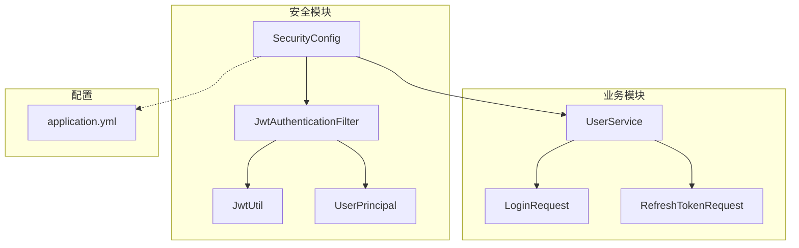
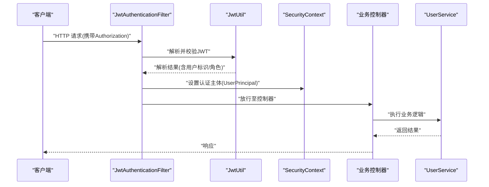
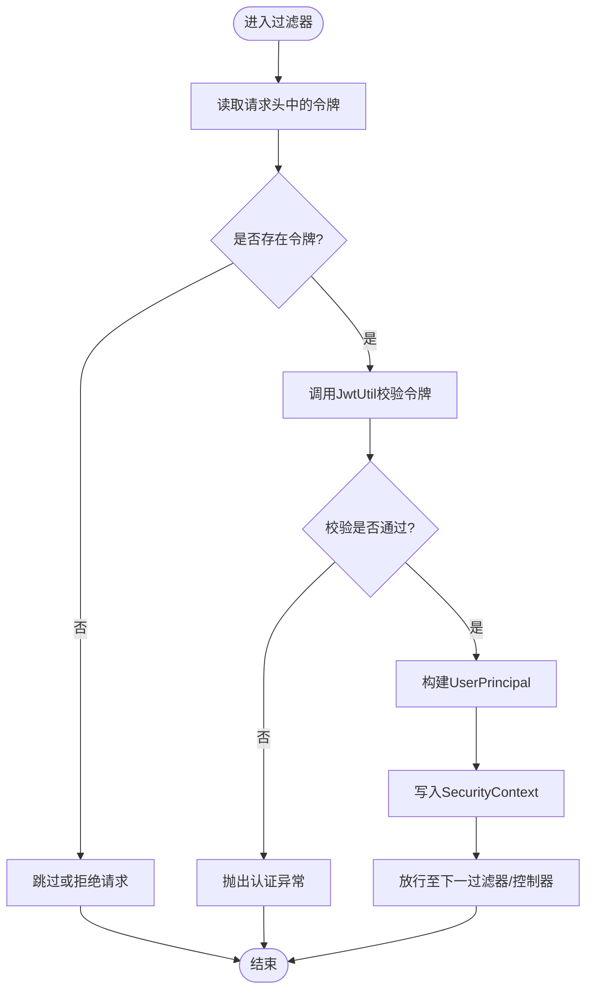
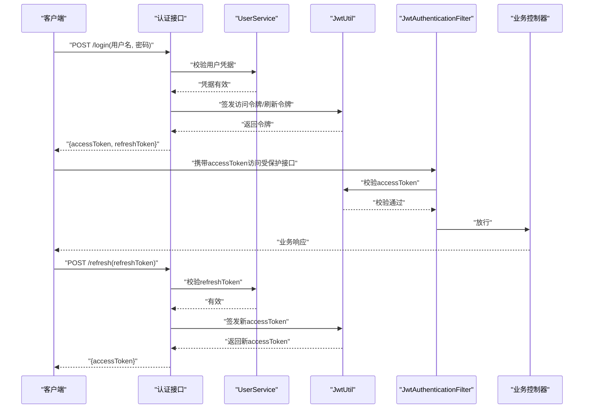
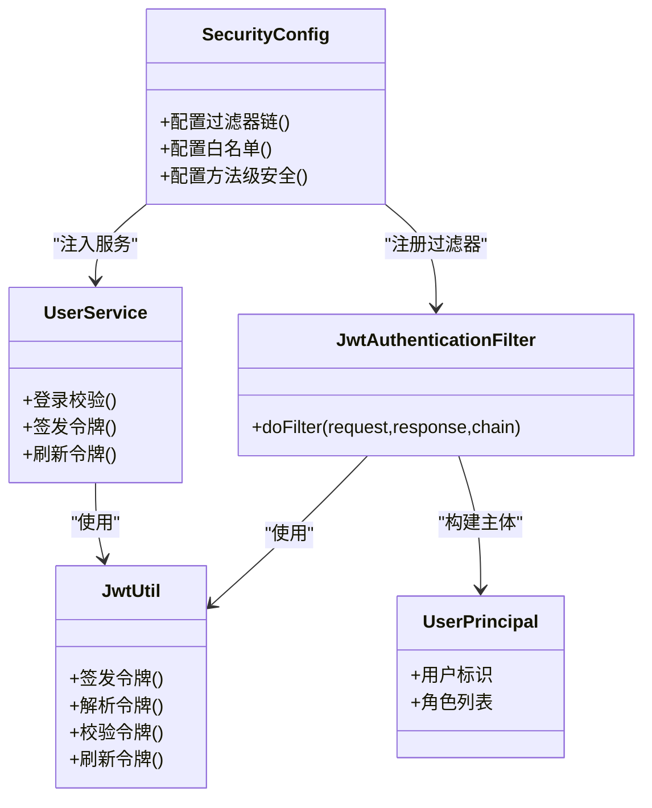

# 安全认证配置

<cite>
**本文引用的文件**   
- [SecurityConfig.java](file://src/main/java/com/ailearn/security/SecurityConfig.java)
- [JwtAuthenticationFilter.java](file://src/main/java/com/ailearn/security/JwtAuthenticationFilter.java)
- [JwtUtil.java](file://src/main/java/com/ailearn/security/JwtUtil.java)
- [UserPrincipal.java](file://src/main/java/com/ailearn/security/UserPrincipal.java)
- [UserService.java](file://src/main/java/com/ailearn/service/UserService.java)
- [LoginRequest.java](file://src/main/java/com/ailearn/dto/LoginRequest.java)
- [RefreshTokenRequest.java](file://src/main/java/com/ailearn/dto/RefreshTokenRequest.java)
- [UserControllerTest.java](file://src/test/java/com/ailearn/controller/UserControllerTest.java)
- [application.yml](file://src/main/resources/application.yml)
</cite>

## 目录
1. [简介](#简介)
2. [项目结构](#项目结构)
3. [核心组件](#核心组件)
4. [架构总览](#架构总览)
5. [详细组件分析](#详细组件分析)
6. [依赖关系分析](#依赖关系分析)
7. [性能考虑](#性能考虑)
8. [故障排查指南](#故障排查指南)
9. [结论](#结论)
10. [附录](#附录)

## 简介
本文件聚焦于后端安全认证与授权配置，围绕以下目标展开：
- 解析 Spring Security 集成与自定义过滤器链配置
- 深入说明 JWT 令牌生成、验证与刷新机制
- 解释用户上下文管理（UserPrincipal）与密码加密存储方案
- 提供角色权限控制与接口访问限制的实现示例
- 给出安全漏洞防护与最佳实践建议

## 项目结构
与安全相关的核心代码位于 security 包，配合 service 层与 DTO 完成登录、鉴权与上下文装配。关键路径如下：
- 安全配置与过滤器：security 包
- 用户服务与实体：service 与 entity 包
- 登录与刷新请求体：dto 包
- 应用配置：resources/application.yml

图表来源
- [SecurityConfig.java](file://src/main/java/com/ailearn/security/SecurityConfig.java)
- [JwtAuthenticationFilter.java](file://src/main/java/com/ailearn/security/JwtAuthenticationFilter.java)
- [JwtUtil.java](file://src/main/java/com/ailearn/security/JwtUtil.java)
- [UserPrincipal.java](file://src/main/java/com/ailearn/security/UserPrincipal.java)
- [UserService.java](file://src/main/java/com/ailearn/service/UserService.java)
- [LoginRequest.java](file://src/main/java/com/ailearn/dto/LoginRequest.java)
- [RefreshTokenRequest.java](file://src/main/java/com/ailearn/dto/RefreshTokenRequest.java)
- [application.yml](file://src/main/resources/application.yml)

章节来源
- [SecurityConfig.java](file://src/main/java/com/ailearn/security/SecurityConfig.java)
- [JwtAuthenticationFilter.java](file://src/main/java/com/ailearn/security/JwtAuthenticationFilter.java)
- [JwtUtil.java](file://src/main/java/com/ailearn/security/JwtUtil.java)
- [UserPrincipal.java](file://src/main/java/com/ailearn/security/UserPrincipal.java)
- [UserService.java](file://src/main/java/com/ailearn/service/UserService.java)
- [LoginRequest.java](file://src/main/java/com/ailearn/dto/LoginRequest.java)
- [RefreshTokenRequest.java](file://src/main/java/com/ailearn/dto/RefreshTokenRequest.java)
- [application.yml](file://src/main/resources/application.yml)

## 核心组件
- SecurityConfig：Spring Security 的入口配置，负责启用方法级安全、注册自定义过滤器、定义白名单与受保护资源、配置全局异常处理等。
- JwtAuthenticationFilter：在每次请求进入控制器前从请求头提取并校验 JWT，成功后将认证信息写入 SecurityContext。
- JwtUtil：封装 JWT 的签发、解析、过期判断、签名校验等能力。
- UserPrincipal：承载当前登录用户的主体信息，供后续鉴权与业务使用。
- UserService：对接数据层，负责用户查询、密码校验、令牌签发与刷新等。
- LoginRequest / RefreshTokenRequest：登录与刷新令牌的入参模型。

章节来源
- [SecurityConfig.java](file://src/main/java/com/ailearn/security/SecurityConfig.java)
- [JwtAuthenticationFilter.java](file://src/main/java/com/ailearn/security/JwtAuthenticationFilter.java)
- [JwtUtil.java](file://src/main/java/com/ailearn/security/JwtUtil.java)
- [UserPrincipal.java](file://src/main/java/com/ailearn/security/UserPrincipal.java)
- [UserService.java](file://src/main/java/com/ailearn/service/UserService.java)
- [LoginRequest.java](file://src/main/java/com/ailearn/dto/LoginRequest.java)
- [RefreshTokenRequest.java](file://src/main/java/com/ailearn/dto/RefreshTokenRequest.java)

## 架构总览
下图展示了典型请求的安全处理流程：客户端携带 Token 访问受保护接口，过滤器链进行校验与上下文装配，随后由控制器与业务层处理。

图表来源
- [JwtAuthenticationFilter.java](file://src/main/java/com/ailearn/security/JwtAuthenticationFilter.java)
- [JwtUtil.java](file://src/main/java/com/ailearn/security/JwtUtil.java)
- [UserPrincipal.java](file://src/main/java/com/ailearn/security/UserPrincipal.java)
- [UserService.java](file://src/main/java/com/ailearn/service/UserService.java)

## 详细组件分析

### SecurityConfig 安全框架配置
- 启用方法级安全注解，支持基于角色的访问控制。
- 注册自定义 JWT 过滤器到过滤器链，确保在默认表单/会话认证之前执行。
- 定义公开接口与受保护接口的匹配规则，实现细粒度访问控制。
- 配置全局异常处理器，统一返回错误码与消息。
- 通过 application.yml 注入密钥、过期时间等敏感参数，避免硬编码。

章节来源
- [SecurityConfig.java](file://src/main/java/com/ailearn/security/SecurityConfig.java)
- [application.yml](file://src/main/resources/application.yml)

### JwtAuthenticationFilter 令牌验证流程
- 从请求头读取令牌，若缺失则跳过或拒绝（取决于策略）。
- 调用 JwtUtil 对令牌进行签名校验与过期检查。
- 校验通过后，构造 UserPrincipal 并写入 SecurityContext，使后续方法可获取当前用户。
- 校验失败时抛出异常，交由全局异常处理器统一响应。

图表来源
- [JwtAuthenticationFilter.java](file://src/main/java/com/ailearn/security/JwtAuthenticationFilter.java)
- [JwtUtil.java](file://src/main/java/com/ailearn/security/JwtUtil.java)
- [UserPrincipal.java](file://src/main/java/com/ailearn/security/UserPrincipal.java)

章节来源
- [JwtAuthenticationFilter.java](file://src/main/java/com/ailearn/security/JwtAuthenticationFilter.java)
- [JwtUtil.java](file://src/main/java/com/ailearn/security/JwtUtil.java)
- [UserPrincipal.java](file://src/main/java/com/ailearn/security/UserPrincipal.java)

### JwtUtil 令牌工具
- 提供签发令牌的方法，包含用户标识、角色、签发时间与过期时间等载荷。
- 提供解析与校验方法，包括签名校验、过期判断与格式校验。
- 暴露刷新令牌的能力（可与 UserService 协作），支持短期访问令牌与长期刷新令牌的组合策略。

章节来源
- [JwtUtil.java](file://src/main/java/com/ailearn/security/JwtUtil.java)
- [UserService.java](file://src/main/java/com/ailearn/service/UserService.java)

### UserPrincipal 用户上下文
- 封装当前登录用户的关键信息（如用户ID、用户名、角色列表等）。
- 作为 SecurityContext 的主体对象，被 @PreAuthorize、@Secured 等注解消费。
- 在过滤器中创建并注入，保证后续业务层可无侵入地获取当前用户。

章节来源
- [UserPrincipal.java](file://src/main/java/com/ailearn/security/UserPrincipal.java)
- [JwtAuthenticationFilter.java](file://src/main/java/com/ailearn/security/JwtAuthenticationFilter.java)

### 登录与刷新令牌流程
- 登录：客户端提交用户名与密码，服务端校验成功后签发访问令牌与可选刷新令牌。
- 刷新：客户端使用刷新令牌换取新的访问令牌，降低频繁登录带来的体验损耗。
- 请求：后续请求在 Authorization 头携带访问令牌，过滤器自动完成认证。

图表来源
- [UserService.java](file://src/main/java/com/ailearn/service/UserService.java)
- [JwtUtil.java](file://src/main/java/com/ailearn/security/JwtUtil.java)
- [JwtAuthenticationFilter.java](file://src/main/java/com/ailearn/security/JwtAuthenticationFilter.java)
- [LoginRequest.java](file://src/main/java/com/ailearn/dto/LoginRequest.java)
- [RefreshTokenRequest.java](file://src/main/java/com/ailearn/dto/RefreshTokenRequest.java)

章节来源
- [UserService.java](file://src/main/java/com/ailearn/service/UserService.java)
- [JwtUtil.java](file://src/main/java/com/ailearn/security/JwtUtil.java)
- [JwtAuthenticationFilter.java](file://src/main/java/com/ailearn/security/JwtAuthenticationFilter.java)
- [LoginRequest.java](file://src/main/java/com/ailearn/dto/LoginRequest.java)
- [RefreshTokenRequest.java](file://src/main/java/com/ailearn/dto/RefreshTokenRequest.java)

### 密码加密存储方案
- 采用强哈希算法对用户密码进行加盐散列存储，禁止明文保存。
- 登录时以相同算法与盐值重新计算并比对，防止彩虹表攻击。
- 建议定期轮换盐值与升级哈希强度，保持与业界标准一致。

章节来源
- [UserService.java](file://src/main/java/com/ailearn/service/UserService.java)

### 自定义安全规则与权限控制
- 基于角色的访问控制：在控制器或方法上使用注解限定角色，例如仅管理员可访问特定接口。
- 基于资源的访问控制：结合用户角色与资源标识，实现更细粒度的权限判定。
- 白名单与黑名单：将静态资源、健康检查、文档等接口设为公开；对敏感接口强制要求认证。
- 全局异常处理：统一返回错误码与消息，便于前端友好提示与审计。

章节来源
- [SecurityConfig.java](file://src/main/java/com/ailearn/security/SecurityConfig.java)

## 依赖关系分析
- SecurityConfig 依赖 JwtAuthenticationFilter 与 JwtUtil，并通过 application.yml 注入密钥与过期时间。
- JwtAuthenticationFilter 依赖 JwtUtil 解析令牌，并依赖 UserPrincipal 构建认证主体。
- UserService 依赖 JwtUtil 签发与刷新令牌，并在登录流程中校验密码。
- 测试用例覆盖登录与鉴权场景，保障核心流程稳定。

图表来源
- [SecurityConfig.java](file://src/main/java/com/ailearn/security/SecurityConfig.java)
- [JwtAuthenticationFilter.java](file://src/main/java/com/ailearn/security/JwtAuthenticationFilter.java)
- [JwtUtil.java](file://src/main/java/com/ailearn/security/JwtUtil.java)
- [UserPrincipal.java](file://src/main/java/com/ailearn/security/UserPrincipal.java)
- [UserService.java](file://src/main/java/com/ailearn/service/UserService.java)

章节来源
- [SecurityConfig.java](file://src/main/java/com/ailearn/security/SecurityConfig.java)
- [JwtAuthenticationFilter.java](file://src/main/java/com/ailearn/security/JwtAuthenticationFilter.java)
- [JwtUtil.java](file://src/main/java/com/ailearn/security/JwtUtil.java)
- [UserPrincipal.java](file://src/main/java/com/ailearn/security/UserPrincipal.java)
- [UserService.java](file://src/main/java/com/ailearn/service/UserService.java)
- [UserControllerTest.java](file://src/test/java/com/ailearn/controller/UserControllerTest.java)

## 性能考虑
- 令牌校验开销：尽量复用已解析的用户信息，避免重复数据库查询。
- 刷新令牌策略：采用短时效访问令牌+长时效刷新令牌，减少频繁登录与重放风险。
- 缓存热点数据：对角色与权限映射进行本地缓存，降低数据库压力。
- 限流与熔断：对登录与刷新接口实施速率限制，防止暴力破解与资源耗尽。

[本节为通用指导，无需源码引用]

## 故障排查指南
- 令牌无效或过期：检查 JwtUtil 的签名与过期时间配置，确认客户端是否正确传递 Authorization 头。
- 认证未生效：确认 SecurityConfig 中过滤器顺序与白名单配置是否正确。
- 权限不足：核对用户角色与方法级注解是否匹配，必要时开启调试日志定位。
- 登录失败：检查密码哈希算法与盐值一致性，确认用户记录存在且状态正常。

章节来源
- [JwtAuthenticationFilter.java](file://src/main/java/com/ailearn/security/JwtAuthenticationFilter.java)
- [JwtUtil.java](file://src/main/java/com/ailearn/security/JwtUtil.java)
- [SecurityConfig.java](file://src/main/java/com/ailearn/security/SecurityConfig.java)
- [UserService.java](file://src/main/java/com/ailearn/service/UserService.java)

## 结论
本项目通过 Spring Security 与自定义 JWT 过滤器实现了无状态认证与细粒度授权。JwtUtil 提供统一的令牌管理能力，UserPrincipal 简化了上下文获取，UserService 整合了登录、刷新与密码校验。配合白名单、全局异常处理与测试用例，整体安全体系具备可扩展性与可维护性。建议在生产环境持续完善限流、审计与密钥轮换策略，进一步提升安全性与稳定性。

[本节为总结，无需源码引用]

## 附录
- 配置项建议：在 application.yml 中集中管理密钥、过期时间、白名单路径等敏感与易变参数。
- 接口示例：登录、刷新令牌与受保护接口的调用方式可参考测试用例与控制器定义。
- 最佳实践：
  - 使用 HTTPS 传输令牌，避免中间人攻击。
  - 最小权限原则，按需授予角色与资源访问。
  - 定期轮换密钥与刷新策略，关注令牌生命周期。
  - 对敏感操作增加二次确认与审计日志。

章节来源
- [application.yml](file://src/main/resources/application.yml)
- [UserControllerTest.java](file://src/test/java/com/ailearn/controller/UserControllerTest.java)