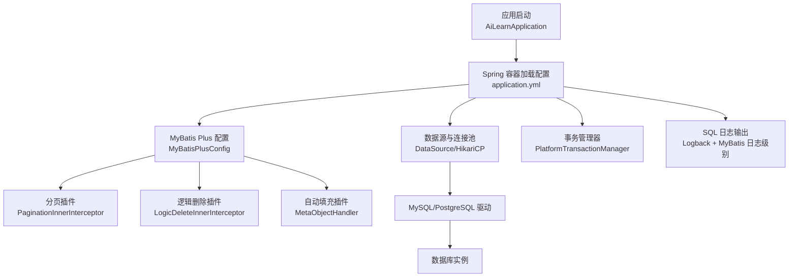
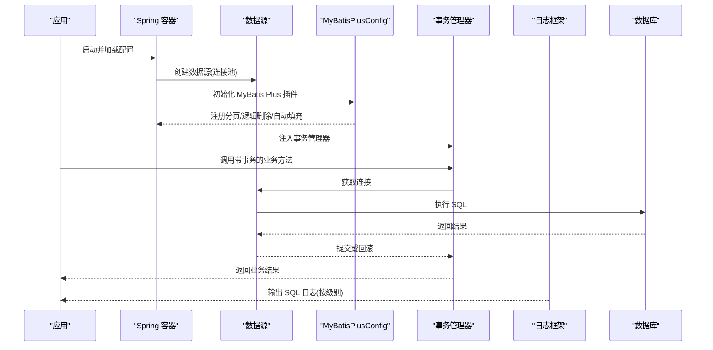
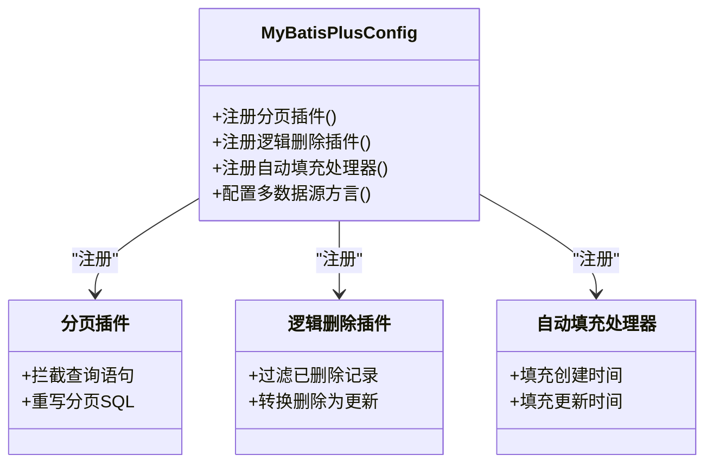
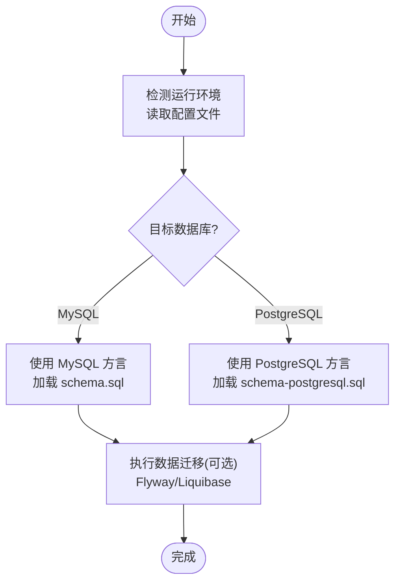
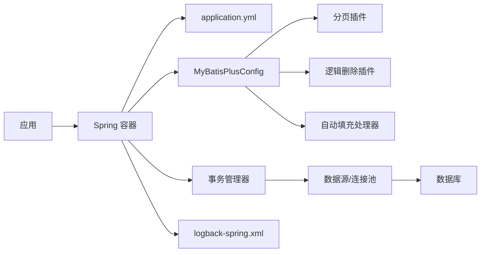

# 数据库配置

<cite>
**本文引用的文件**   
- [MyBatisPlusConfig.java](file://src/main/java/com/ailearn/config/MyBatisPlusConfig.java)
- [application.yml](file://src/main/resources/application.yml)
- [schema.sql](file://src/main/resources/schema.sql)
- [schema-postgresql.sql](file://src/main/resources/schema-postgresql.sql)
- [logback-spring.xml](file://src/main/resources/logback-spring.xml)
</cite>

## 目录
1. [简介](#简介)
2. [项目结构](#项目结构)
3. [核心组件](#核心组件)
4. [架构总览](#架构总览)
5. [详细组件分析](#详细组件分析)
6. [依赖关系分析](#依赖关系分析)
7. [性能考虑](#性能考虑)
8. [故障排查指南](#故障排查指南)
9. [结论](#结论)
10. [附录](#附录)

## 简介
本文件聚焦于数据访问层的数据库配置与优化，围绕 MyBatis Plus 的配置类 MyBatisPlusConfig 展开，系统阐述分页插件、逻辑删除、自动填充等能力；同时覆盖连接池、事务管理、SQL 日志输出等性能优化选项；并给出 MySQL 与 PostgreSQL 双数据库支持的实现方案、方言配置与数据迁移策略。此外，提供表结构设计说明、索引优化建议，以及备份恢复与监控配置指南，帮助读者在生产环境稳定高效地运行数据层。

## 项目结构
本项目采用分层组织方式，数据访问相关的关键位置如下：
- 配置类：com.ailearn.config.MyBatisPlusConfig（数据访问增强配置）
- 应用配置：src/main/resources/application.yml（数据库连接、驱动、连接池、事务、日志等）
- 初始化脚本：src/main/resources/schema.sql（MySQL 建库建表）、src/main/resources/schema-postgresql.sql（PostgreSQL 建库建表）
- 日志配置：src/main/resources/logback-spring.xml（SQL 日志输出控制）

图表来源
- [MyBatisPlusConfig.java](file://src/main/java/com/ailearn/config/MyBatisPlusConfig.java)
- [application.yml](file://src/main/resources/application.yml)
- [logback-spring.xml](file://src/main/resources/logback-spring.xml)

章节来源
- [MyBatisPlusConfig.java](file://src/main/java/com/ailearn/config/MyBatisPlusConfig.java)
- [application.yml](file://src/main/resources/application.yml)
- [schema.sql](file://src/main/resources/schema.sql)
- [schema-postgresql.sql](file://src/main/resources/schema-postgresql.sql)
- [logback-spring.xml](file://src/main/resources/logback-spring.xml)

## 核心组件
本节对数据访问层的核心组件进行概览，重点包括：
- 数据源与连接池：通过 application.yml 配置数据库 URL、用户名、密码、驱动类及连接池参数（如最大连接数、最小空闲、超时等）。
- MyBatis Plus 配置：在 MyBatisPlusConfig 中注册插件与处理器，启用分页、逻辑删除、自动填充等功能。
- 事务管理：基于 Spring 的声明式事务，默认使用平台事务管理器。
- SQL 日志：通过 logback-spring.xml 与 MyBatis 日志级别控制 SQL 输出。

章节来源
- [application.yml](file://src/main/resources/application.yml)
- [MyBatisPlusConfig.java](file://src/main/java/com/ailearn/config/MyBatisPlusConfig.java)
- [logback-spring.xml](file://src/main/resources/logback-spring.xml)

## 架构总览
下图展示了从应用启动到数据访问的整体流程，包含配置加载、插件装配、事务与日志链路。

图表来源
- [application.yml](file://src/main/resources/application.yml)
- [MyBatisPlusConfig.java](file://src/main/java/com/ailearn/config/MyBatisPlusConfig.java)
- [logback-spring.xml](file://src/main/resources/logback-spring.xml)

## 详细组件分析

### MyBatisPlusConfig 配置详解
该配置类负责装配 MyBatis Plus 的数据访问增强能力，典型职责包括：
- 分页插件：拦截查询请求，自动改写 SQL 以支持分页，避免内存分页带来的性能问题。
- 逻辑删除：为实体字段添加逻辑删除标记，统一处理软删除语义，保障历史数据可追溯。
- 自动填充：在插入或更新时自动填充审计字段（如创建时间、更新时间、操作人等），减少样板代码。

图表来源
- [MyBatisPlusConfig.java](file://src/main/java/com/ailearn/config/MyBatisPlusConfig.java)

章节来源
- [MyBatisPlusConfig.java](file://src/main/java/com/ailearn/config/MyBatisPlusConfig.java)

### 数据库连接池配置
连接池直接影响吞吐与延迟，建议在 application.yml 中关注以下要点：
- 驱动类与 JDBC URL：根据目标数据库选择对应驱动与连接字符串。
- 最大连接数与最小空闲：结合并发量与数据库容量设置合理上限，避免资源耗尽或频繁创建销毁。
- 连接超时与空闲回收：防止长事务或泄漏导致连接占用。
- 健康检查与重试：确保异常场景下的快速失败与恢复。

章节来源
- [application.yml](file://src/main/resources/application.yml)

### 事务管理策略
- 默认事务管理器：由 Spring 自动装配，适用于单数据源场景。
- 事务边界：建议在 Service 层标注事务注解，保证原子性与一致性。
- 传播行为与隔离级别：根据业务需求调整，避免不必要的锁竞争。
- 多数据源事务：如需跨库事务，需引入分布式事务或补偿机制（当前仓库未体现，按需扩展）。

章节来源
- [application.yml](file://src/main/resources/application.yml)

### SQL 日志输出
- 日志级别：将 MyBatis 包路径设置为 DEBUG 或 TRACE，便于定位慢查询与错误 SQL。
- 输出格式：通过 logback-spring.xml 定制输出样式，包含耗时、参数、SQL 文本等关键信息。
- 生产环境：建议仅开启必要级别，避免过多 IO 影响性能。

章节来源
- [logback-spring.xml](file://src/main/resources/logback-spring.xml)
- [application.yml](file://src/main/resources/application.yml)

### MySQL 与 PostgreSQL 双数据库支持
- 方言配置：在 MyBatisPlusConfig 中根据运行环境切换数据库方言，使分页与类型映射适配不同数据库。
- 初始化脚本：分别维护 schema.sql（MySQL）与 schema-postgresql.sql（PostgreSQL），保持表结构与约束一致。
- 数据迁移策略：
  - 开发/测试：优先使用脚本直灌，配合版本化命名。
  - 生产：建议使用迁移工具（如 Flyway/Liquibase）管理变更，确保幂等与回滚能力。
- 兼容性注意：
  - 主键自增策略与序列差异。
  - 日期时间类型与时区处理。
  - 分页语法差异（LIMIT/OFFSET vs LIMIT/OFFSET 或 ROW_NUMBER）。

图表来源
- [MyBatisPlusConfig.java](file://src/main/java/com/ailearn/config/MyBatisPlusConfig.java)
- [schema.sql](file://src/main/resources/schema.sql)
- [schema-postgresql.sql](file://src/main/resources/schema-postgresql.sql)

章节来源
- [MyBatisPlusConfig.java](file://src/main/java/com/ailearn/config/MyBatisPlusConfig.java)
- [schema.sql](file://src/main/resources/schema.sql)
- [schema-postgresql.sql](file://src/main/resources/schema-postgresql.sql)

### 表结构设计说明与索引优化建议
- 设计原则：
  - 规范化与反规范化平衡，热点查询允许冗余字段提升性能。
  - 明确主键策略（自增或雪花 ID），避免热点写入冲突。
  - 统一审计字段（创建时间、更新时间、逻辑删除标记）。
- 索引策略：
  - 高频查询条件列建立单列或多列复合索引。
  - 区分选择性高的列优先建索引，避免低选择性索引。
  - 覆盖索引用于减少回表，但需权衡写入成本。
  - 定期评估索引使用率与碎片，清理无用索引。
- 示例参考：
  - 用户表、会话表、消息表、文档表等常见实体，应依据查询模式设计索引。

章节来源
- [schema.sql](file://src/main/resources/schema.sql)
- [schema-postgresql.sql](file://src/main/resources/schema-postgresql.sql)

### 备份恢复与监控配置指南
- 备份策略：
  - 全量+增量组合，定时任务触发，保留周期策略。
  - 分库分表场景下按库/表维度备份，校验完整性。
- 恢复演练：
  - 定期演练恢复流程，验证 RTO/RPO 指标。
  - 准备回滚脚本与快照点。
- 监控告警：
  - 连接池指标：活跃连接、等待队列、超时次数。
  - 慢查询统计：阈值告警，结合 EXPLAIN 分析。
  - 锁等待与死锁：捕获并上报。
  - 日志采集：集中收集 SQL 日志与错误堆栈。

[本节为通用指导，不直接分析具体文件]

## 依赖关系分析
数据访问层的关键依赖关系如下：
- 应用依赖 Spring 容器与配置。
- Spring 容器加载 application.yml 中的数据库与连接池参数。
- MyBatisPlusConfig 向 MyBatis 注册插件与处理器。
- 事务管理器协调连接生命周期与提交/回滚。
- 日志框架输出 SQL 与运行时信息。

图表来源
- [application.yml](file://src/main/resources/application.yml)
- [MyBatisPlusConfig.java](file://src/main/java/com/ailearn/config/MyBatisPlusConfig.java)
- [logback-spring.xml](file://src/main/resources/logback-spring.xml)

章节来源
- [application.yml](file://src/main/resources/application.yml)
- [MyBatisPlusConfig.java](file://src/main/java/com/ailearn/config/MyBatisPlusConfig.java)
- [logback-spring.xml](file://src/main/resources/logback-spring.xml)

## 性能考虑
- 连接池调优：
  - 根据 QPS 与平均响应时间估算最大连接数，避免过大导致上下文切换开销。
  - 启用连接健康检查与空闲回收，降低异常连接占用。
- 分页优化：
  - 深分页使用游标或基于上次查询条件的范围查询替代 OFFSET。
  - 合理设置每页大小，避免一次性返回大量数据。
- 事务优化：
  - 缩小事务范围，避免长事务持有锁。
  - 读写分离场景下，读操作走只读副本。
- SQL 优化：
  - 使用 EXPLAIN 分析执行计划，消除全表扫描。
  - 批量操作使用批量接口，减少往返次数。
- 缓存策略：
  - 热点数据引入本地缓存或分布式缓存，减轻数据库压力。

[本节为通用指导，不直接分析具体文件]

## 故障排查指南
- 连接失败：
  - 检查 application.yml 中的 URL、用户名、密码、驱动类是否正确。
  - 确认网络连通与防火墙规则。
- 事务异常：
  - 查看事务边界与方法注解是否匹配。
  - 检查是否有未捕获异常导致回滚。
- SQL 性能问题：
  - 开启 DEBUG 级别日志，定位慢查询。
  - 使用 EXPLAIN 分析执行计划，补充缺失索引。
- 分页异常：
  - 确认分页插件已正确注册。
  - 检查复杂查询是否被插件改写。
- 日志过多：
  - 调整 logback-spring.xml 与 MyBatis 日志级别。
  - 生产环境关闭 TRACE，保留必要 DEBUG。

章节来源
- [application.yml](file://src/main/resources/application.yml)
- [logback-spring.xml](file://src/main/resources/logback-spring.xml)
- [MyBatisPlusConfig.java](file://src/main/java/com/ailearn/config/MyBatisPlusConfig.java)

## 结论
通过对 MyBatisPlusConfig 的系统化配置与优化，项目在分页、逻辑删除、自动填充等方面具备良好扩展性；结合合理的连接池、事务与日志策略，可在生产环境中获得稳定高效的性能表现。双数据库支持通过方言与脚本分离实现，迁移策略建议引入版本化工具以提升可靠性。最后，完善的备份恢复与监控体系是保障数据安全与可观测性的关键。

[本节为总结性内容，不直接分析具体文件]

## 附录
- 常用配置项清单（建议值仅供参考，需结合实际压测调整）：
  - 最大连接数：CPU 核数×2~4 倍起步，视 IO 与 CPU 瓶颈调整。
  - 最小空闲：最大连接数的 10%~20%。
  - 连接超时：30s~60s。
  - 空闲回收间隔：60s~120s。
  - SQL 日志级别：开发 DEBUG，生产 WARN/ERROR。
- 索引设计检查清单：
  - 是否命中 WHERE/JOIN/ORDER BY/GROUP BY 常用列。
  - 是否避免低选择性列单独建索引。
  - 是否评估覆盖索引的收益与维护成本。
- 备份恢复检查清单：
  - 是否定期全量+增量备份。
  - 是否演练恢复流程并记录 RTO/RPO。
  - 是否校验备份完整性与可用性。

[本节为通用指导，不直接分析具体文件]