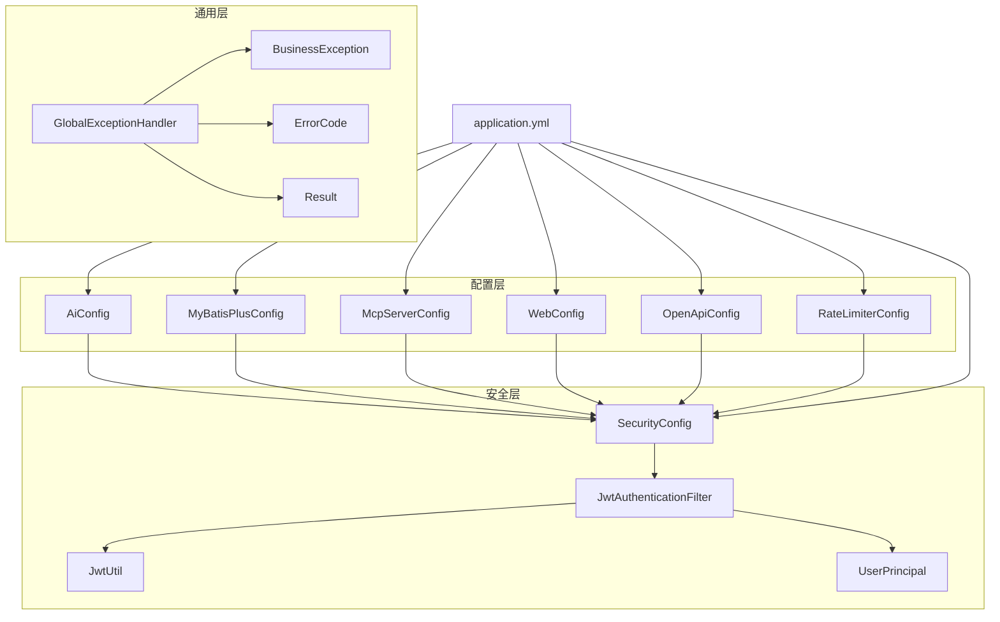
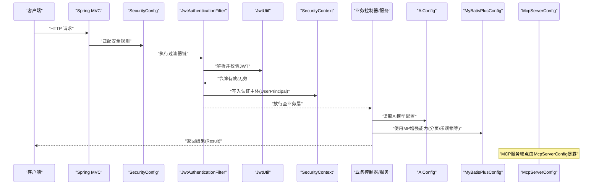
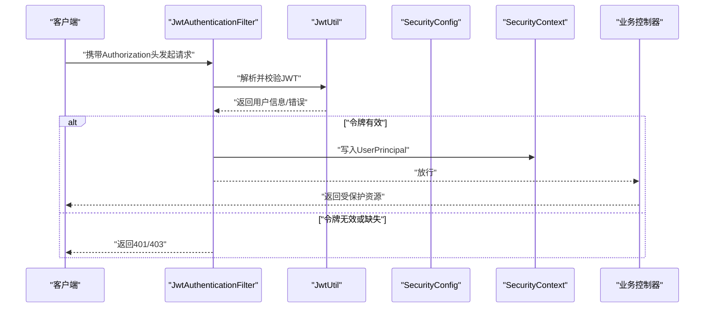
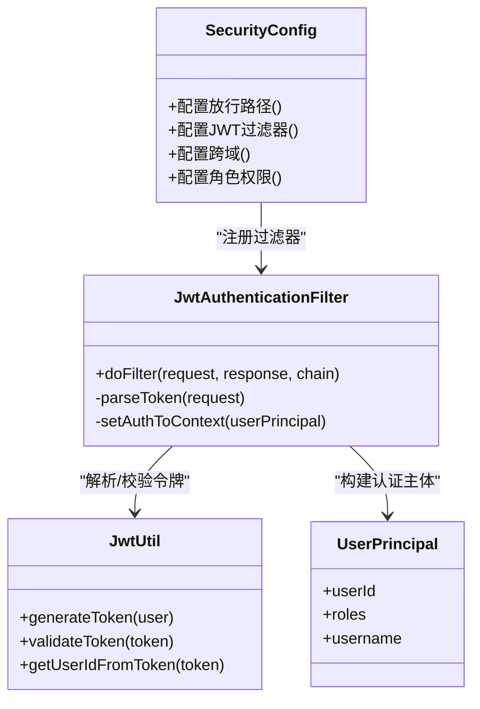
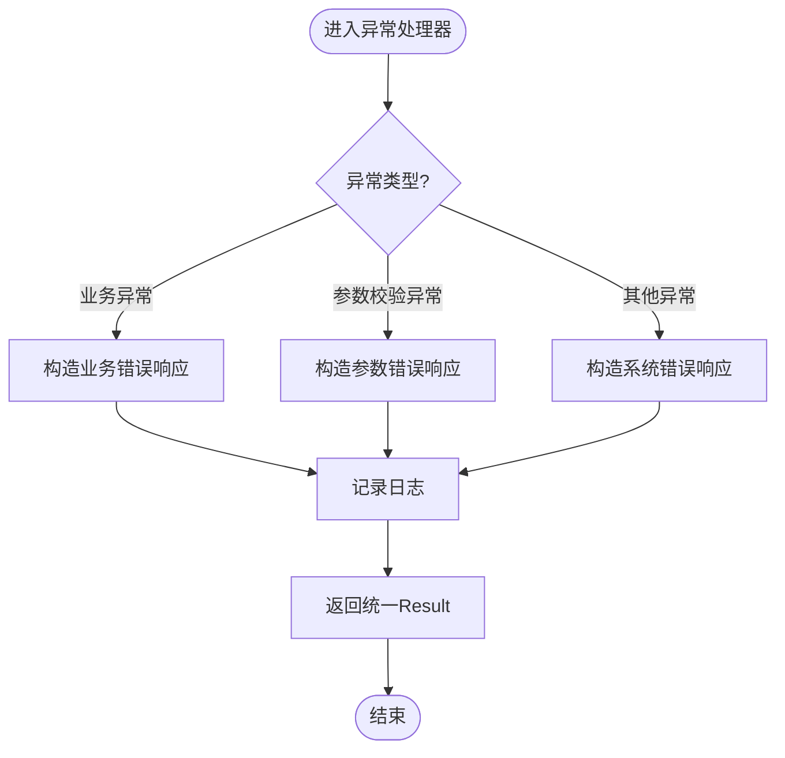
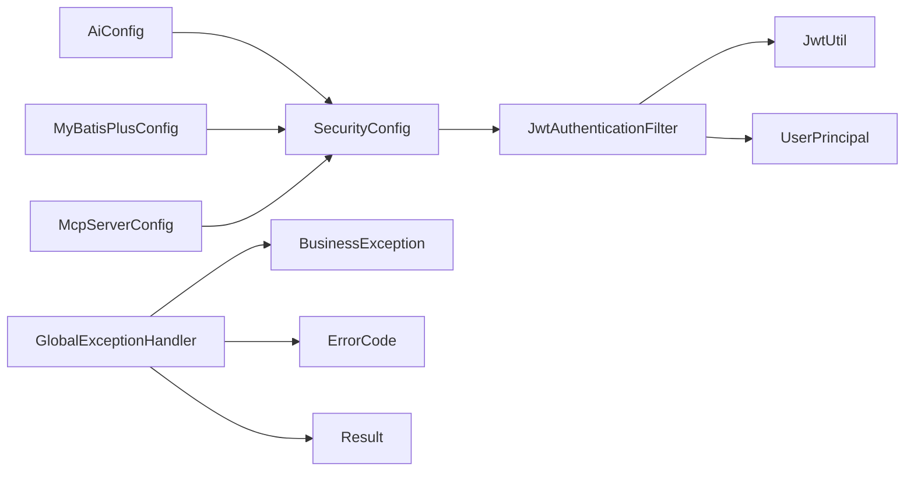

# 核心组件详解

<cite>
**本文引用的文件**   
- [AiConfig.java](file://src/main/java/com/ailearn/config/AiConfig.java)
- [SecurityConfig.java](file://src/main/java/com/ailearn/security/SecurityConfig.java)
- [JwtAuthenticationFilter.java](file://src/main/java/com/ailearn/security/JwtAuthenticationFilter.java)
- [JwtUtil.java](file://src/main/java/com/ailearn/security/JwtUtil.java)
- [UserPrincipal.java](file://src/main/java/com/ailearn/security/UserPrincipal.java)
- [MyBatisPlusConfig.java](file://src/main/java/com/ailearn/config/MyBatisPlusConfig.java)
- [McpServerConfig.java](file://src/main/java/com/ailearn/config/McpServerConfig.java)
- [GlobalExceptionHandler.java](file://src/main/java/com/ailearn/common/GlobalExceptionHandler.java)
- [BusinessException.java](file://src/main/java/com/ailearn/common/BusinessException.java)
- [ErrorCode.java](file://src/main/java/com/ailearn/common/ErrorCode.java)
- [Result.java](file://src/main/java/com/ailearn/common/Result.java)
- [application.yml](file://src/main/resources/application.yml)
</cite>

## 目录
1. [简介](#简介)
2. [项目结构](#项目结构)
3. [核心组件](#核心组件)
4. [架构总览](#架构总览)
5. [详细组件分析](#详细组件分析)
6. [依赖关系分析](#依赖关系分析)
7. [性能考虑](#性能考虑)
8. [故障排查指南](#故障排查指南)
9. [结论](#结论)
10. [附录：配置示例与最佳实践](#附录配置示例与最佳实践)

## 简介
本文件聚焦于 Java AI 学习平台的核心配置与安全组件，系统性解析以下模块的职责、交互与使用方式：
- AI 配置中心 AiConfig：多模型接入、API 密钥管理、请求参数统一配置
- 安全配置 SecurityConfig：JWT 认证流程、权限控制策略、跨域配置
- MyBatis Plus 配置 MyBatisPlusConfig：数据访问优化设置
- MCP 服务器配置 McpServerConfig：Model Context Protocol 支持
- 全局异常处理 GlobalExceptionHandler：统一错误响应机制

文档同时提供可视化架构图、流程图与类图，帮助读者快速理解各组件在系统中的位置与协作方式。

## 项目结构
围绕核心配置与安全相关的关键文件分布如下：
- 配置层：AiConfig、MyBatisPlusConfig、McpServerConfig、WebConfig、OpenApiConfig、RateLimiterConfig 等
- 安全层：SecurityConfig、JwtAuthenticationFilter、JwtUtil、UserPrincipal
- 通用层：GlobalExceptionHandler、BusinessException、ErrorCode、Result
- 应用配置：application.yml

图表来源
- [AiConfig.java](file://src/main/java/com/ailearn/config/AiConfig.java)
- [MyBatisPlusConfig.java](file://src/main/java/com/ailearn/config/MyBatisPlusConfig.java)
- [McpServerConfig.java](file://src/main/java/com/ailearn/config/McpServerConfig.java)
- [SecurityConfig.java](file://src/main/java/com/ailearn/security/SecurityConfig.java)
- [JwtAuthenticationFilter.java](file://src/main/java/com/ailearn/security/JwtAuthenticationFilter.java)
- [JwtUtil.java](file://src/main/java/com/ailearn/security/JwtUtil.java)
- [UserPrincipal.java](file://src/main/java/com/ailearn/security/UserPrincipal.java)
- [GlobalExceptionHandler.java](file://src/main/java/com/ailearn/common/GlobalExceptionHandler.java)
- [BusinessException.java](file://src/main/java/com/ailearn/common/BusinessException.java)
- [ErrorCode.java](file://src/main/java/com/ailearn/common/ErrorCode.java)
- [Result.java](file://src/main/java/com/ailearn/common/Result.java)
- [application.yml](file://src/main/resources/application.yml)

章节来源
- [AiConfig.java](file://src/main/java/com/ailearn/config/AiConfig.java)
- [SecurityConfig.java](file://src/main/java/com/ailearn/security/SecurityConfig.java)
- [MyBatisPlusConfig.java](file://src/main/java/com/ailearn/config/MyBatisPlusConfig.java)
- [McpServerConfig.java](file://src/main/java/com/ailearn/config/McpServerConfig.java)
- [GlobalExceptionHandler.java](file://src/main/java/com/ailearn/common/GlobalExceptionHandler.java)
- [application.yml](file://src/main/resources/application.yml)

## 核心组件
本节概述各核心组件的职责与相互关系，为后续深入分析奠定基础。

- AiConfig：集中管理 AI 模型接入信息（如提供商、模型标识、基础 URL）、API 密钥、超时与重试等请求参数；支持多模型切换与动态选择。
- SecurityConfig：基于 Spring Security 的安全配置，定义放行路径、拦截器链、JWT 过滤器、跨域策略与角色/权限控制。
- JwtAuthenticationFilter：从请求头提取并校验 JWT，构建认证主体并注入到安全上下文。
- JwtUtil：封装 JWT 的生成、解析、校验与过期判断等工具方法。
- UserPrincipal：承载当前登录用户信息，供业务层与鉴权逻辑使用。
- MyBatisPlusConfig：配置分页插件、乐观锁、逻辑删除、SQL 日志打印等数据访问增强能力。
- McpServerConfig：暴露 Model Context Protocol 服务所需的端点、协议版本、工具注册与路由映射。
- GlobalExceptionHandler：统一捕获并转换异常为 Result 标准响应体，结合 BusinessException 与 ErrorCode 输出一致的错误码与消息。

章节来源
- [AiConfig.java](file://src/main/java/com/ailearn/config/AiConfig.java)
- [SecurityConfig.java](file://src/main/java/com/ailearn/security/SecurityConfig.java)
- [JwtAuthenticationFilter.java](file://src/main/java/com/ailearn/security/JwtAuthenticationFilter.java)
- [JwtUtil.java](file://src/main/java/com/ailearn/security/JwtUtil.java)
- [UserPrincipal.java](file://src/main/java/com/ailearn/security/UserPrincipal.java)
- [MyBatisPlusConfig.java](file://src/main/java/com/ailearn/config/MyBatisPlusConfig.java)
- [McpServerConfig.java](file://src/main/java/com/ailearn/config/McpServerConfig.java)
- [GlobalExceptionHandler.java](file://src/main/java/com/ailearn/common/GlobalExceptionHandler.java)
- [BusinessException.java](file://src/main/java/com/ailearn/common/BusinessException.java)
- [ErrorCode.java](file://src/main/java/com/ailearn/common/ErrorCode.java)
- [Result.java](file://src/main/java/com/ailearn/common/Result.java)

## 架构总览
下图展示关键组件之间的调用与依赖关系，包括安全过滤链、AI 配置注入、数据访问增强与 MCP 服务暴露。

图表来源
- [SecurityConfig.java](file://src/main/java/com/ailearn/security/SecurityConfig.java)
- [JwtAuthenticationFilter.java](file://src/main/java/com/ailearn/security/JwtAuthenticationFilter.java)
- [JwtUtil.java](file://src/main/java/com/ailearn/security/JwtUtil.java)
- [UserPrincipal.java](file://src/main/java/com/ailearn/security/UserPrincipal.java)
- [AiConfig.java](file://src/main/java/com/ailearn/config/AiConfig.java)
- [MyBatisPlusConfig.java](file://src/main/java/com/ailearn/config/MyBatisPlusConfig.java)
- [McpServerConfig.java](file://src/main/java/com/ailearn/config/McpServerConfig.java)

## 详细组件分析

### AI 配置中心 AiConfig
- 职责
  - 集中管理多 AI 模型的连接信息与请求参数，便于运行时按模型名称或标签进行切换。
  - 提供 API 密钥、基础地址、超时、重试、并发限制等可配置项。
- 典型配置项（概念性说明）
  - 模型列表：包含模型标识、提供商、基础 URL、可用功能开关等。
  - 默认模型：未显式指定时使用的后备模型。
  - 密钥管理：不同模型对应的 API Key 或 Token。
  - 请求参数：超时时间、最大重试次数、并发度、速率限制等。
- 使用建议
  - 通过配置文件或环境变量注入，避免硬编码敏感信息。
  - 对多模型场景采用“模型名 -> 配置”的查找策略，提升扩展性。
  - 将耗时参数（如超时、重试）纳入监控与告警。

章节来源
- [AiConfig.java](file://src/main/java/com/ailearn/config/AiConfig.java)
- [application.yml](file://src/main/resources/application.yml)

### 安全配置 SecurityConfig 与 JWT 认证
- 职责
  - 定义安全拦截策略：放行静态资源与开放接口，保护受控接口。
  - 集成 JWT 过滤器，完成令牌解析、校验与上下文注入。
  - 配置跨域策略，允许前端跨域访问。
  - 基于角色的访问控制（RBAC），在方法级或路径级进行权限判定。
- 认证流程（序列图）

图表来源
- [SecurityConfig.java](file://src/main/java/com/ailearn/security/SecurityConfig.java)
- [JwtAuthenticationFilter.java](file://src/main/java/com/ailearn/security/JwtAuthenticationFilter.java)
- [JwtUtil.java](file://src/main/java/com/ailearn/security/JwtUtil.java)
- [UserPrincipal.java](file://src/main/java/com/ailearn/security/UserPrincipal.java)

- 跨域配置要点
  - 允许的来源域名、方法与头部。
  - 是否允许携带凭证（Cookie/Authorization）。
  - 预检请求缓存时长。
- 权限控制策略
  - 路径级白名单：如登录、注册、健康检查等。
  - 方法级注解：基于角色或自定义权限注解进行细粒度控制。
  - 动态权限：结合用户角色与资源映射实现更灵活的授权。

章节来源
- [SecurityConfig.java](file://src/main/java/com/ailearn/security/SecurityConfig.java)
- [JwtAuthenticationFilter.java](file://src/main/java/com/ailearn/security/JwtAuthenticationFilter.java)
- [JwtUtil.java](file://src/main/java/com/ailearn/security/JwtUtil.java)
- [UserPrincipal.java](file://src/main/java/com/ailearn/security/UserPrincipal.java)

#### 类关系图（安全相关）

图表来源
- [SecurityConfig.java](file://src/main/java/com/ailearn/security/SecurityConfig.java)
- [JwtAuthenticationFilter.java](file://src/main/java/com/ailearn/security/JwtAuthenticationFilter.java)
- [JwtUtil.java](file://src/main/java/com/ailearn/security/JwtUtil.java)
- [UserPrincipal.java](file://src/main/java/com/ailearn/security/UserPrincipal.java)

### MyBatis Plus 配置 MyBatisPlusConfig
- 职责
  - 启用分页插件，简化分页查询。
  - 启用乐观锁插件，防止并发更新覆盖。
  - 启用逻辑删除插件，软删除数据。
  - 配置 SQL 打印与格式化，便于开发调试。
  - 配置主键策略、字段自动填充、驼峰映射等。
- 优化建议
  - 生产环境关闭 SQL 打印，按需开启慢查询日志。
  - 合理设置分页大小上限，避免大结果集拖垮数据库。
  - 针对热点表建立合适索引，配合分页减少全表扫描。

章节来源
- [MyBatisPlusConfig.java](file://src/main/java/com/ailearn/config/MyBatisPlusConfig.java)

### MCP 服务器配置 McpServerConfig
- 职责
  - 暴露 Model Context Protocol 服务端点，支持协议版本协商。
  - 注册系统工具与业务工具，提供工具发现与调用能力。
  - 配置路由映射、请求限流与访问控制。
- 使用建议
  - 将工具注册与业务解耦，便于扩展与维护。
  - 对 MCP 端点实施鉴权与限流，保障稳定性。
  - 记录工具调用链路，便于问题定位与性能分析。

章节来源
- [McpServerConfig.java](file://src/main/java/com/ailearn/config/McpServerConfig.java)

### 全局异常处理 GlobalExceptionHandler
- 职责
  - 统一捕获业务异常与非业务异常，转换为标准响应体 Result。
  - 结合 BusinessException 与 ErrorCode 输出一致的错误码与消息。
  - 记录异常堆栈与上下文信息，便于审计与排障。
- 处理流程（流程图）

图表来源
- [GlobalExceptionHandler.java](file://src/main/java/com/ailearn/common/GlobalExceptionHandler.java)
- [BusinessException.java](file://src/main/java/com/ailearn/common/BusinessException.java)
- [ErrorCode.java](file://src/main/java/com/ailearn/common/ErrorCode.java)
- [Result.java](file://src/main/java/com/ailearn/common/Result.java)

章节来源
- [GlobalExceptionHandler.java](file://src/main/java/com/ailearn/common/GlobalExceptionHandler.java)
- [BusinessException.java](file://src/main/java/com/ailearn/common/BusinessException.java)
- [ErrorCode.java](file://src/main/java/com/ailearn/common/ErrorCode.java)
- [Result.java](file://src/main/java/com/ailearn/common/Result.java)

## 依赖关系分析
- 组件耦合
  - SecurityConfig 依赖 JwtAuthenticationFilter 与 JwtUtil，形成认证主链路。
  - GlobalExceptionHandler 依赖 BusinessException、ErrorCode、Result，形成统一错误契约。
  - AiConfig 被业务层广泛引用，作为外部 AI 服务的配置入口。
  - MyBatisPlusConfig 影响所有 Mapper 的数据访问行为。
  - McpServerConfig 独立暴露协议服务，与业务控制器松耦合。
- 外部依赖
  - Spring Security、JWT 库、MyBatis Plus、MCP 协议栈等。
- 潜在风险
  - 若 JWT 密钥泄露或算法不安全，将导致认证绕过风险。
  - 若 AiConfig 中密钥未加密存储，存在敏感信息泄露风险。
  - 若未配置合理的限流与熔断，AI 服务抖动可能引发雪崩。

图表来源
- [SecurityConfig.java](file://src/main/java/com/ailearn/security/SecurityConfig.java)
- [JwtAuthenticationFilter.java](file://src/main/java/com/ailearn/security/JwtAuthenticationFilter.java)
- [JwtUtil.java](file://src/main/java/com/ailearn/security/JwtUtil.java)
- [UserPrincipal.java](file://src/main/java/com/ailearn/security/UserPrincipal.java)
- [GlobalExceptionHandler.java](file://src/main/java/com/ailearn/common/GlobalExceptionHandler.java)
- [BusinessException.java](file://src/main/java/com/ailearn/common/BusinessException.java)
- [ErrorCode.java](file://src/main/java/com/ailearn/common/ErrorCode.java)
- [Result.java](file://src/main/java/com/ailearn/common/Result.java)
- [AiConfig.java](file://src/main/java/com/ailearn/config/AiConfig.java)
- [MyBatisPlusConfig.java](file://src/main/java/com/ailearn/config/MyBatisPlusConfig.java)
- [McpServerConfig.java](file://src/main/java/com/ailearn/config/McpServerConfig.java)

## 性能考虑
- 安全链路
  - JWT 校验应尽可能轻量，避免频繁 I/O；必要时引入本地缓存。
  - 跨域预检请求较多时，适当增大缓存时间以减少重复校验。
- 数据访问
  - 分页查询需限定最大页大小，避免超大结果集。
  - 乐观锁在高冲突场景下可能导致重试开销，需评估重试策略。
- AI 调用
  - 合理设置超时与重试次数，避免长尾请求阻塞线程池。
  - 对高频模型调用增加本地缓存或降级策略。
- MCP 服务
  - 对工具调用进行限流与熔断，防止下游抖动放大。
  - 记录关键指标（QPS、延迟、错误率）以便容量规划。

[本节为通用指导，不直接分析具体文件]

## 故障排查指南
- 认证失败
  - 检查 Authorization 头格式与令牌有效期。
  - 确认 SecurityConfig 放行路径是否正确，避免误拦截。
  - 核对 JwtUtil 的密钥与算法是否与签发端一致。
- 权限不足
  - 检查用户角色与资源映射，确认方法级注解配置正确。
  - 查看 SecurityContext 中的 UserPrincipal 是否包含预期角色。
- 数据访问异常
  - 检查 MyBatisPlus 插件是否生效（分页、乐观锁、逻辑删除）。
  - 关注 SQL 日志与慢查询，定位性能瓶颈。
- 全局异常
  - 确认业务异常是否抛出 BusinessException 并携带 ErrorCode。
  - 检查 GlobalExceptionHandler 是否捕获到预期异常类型。
- MCP 服务
  - 验证工具注册是否成功，路由是否匹配。
  - 检查鉴权与限流配置是否阻止了合法调用。

章节来源
- [SecurityConfig.java](file://src/main/java/com/ailearn/security/SecurityConfig.java)
- [JwtAuthenticationFilter.java](file://src/main/java/com/ailearn/security/JwtAuthenticationFilter.java)
- [JwtUtil.java](file://src/main/java/com/ailearn/security/JwtUtil.java)
- [UserPrincipal.java](file://src/main/java/com/ailearn/security/UserPrincipal.java)
- [MyBatisPlusConfig.java](file://src/main/java/com/ailearn/config/MyBatisPlusConfig.java)
- [GlobalExceptionHandler.java](file://src/main/java/com/ailearn/common/GlobalExceptionHandler.java)
- [BusinessException.java](file://src/main/java/com/ailearn/common/BusinessException.java)
- [ErrorCode.java](file://src/main/java/com/ailearn/common/ErrorCode.java)
- [Result.java](file://src/main/java/com/ailearn/common/Result.java)
- [McpServerConfig.java](file://src/main/java/com/ailearn/config/McpServerConfig.java)

## 结论
通过对 AiConfig、SecurityConfig、MyBatisPlusConfig、McpServerConfig 与 GlobalExceptionHandler 的系统化分析，可以清晰把握该 AI 学习平台在配置管理、安全认证、数据访问、协议服务与错误治理方面的设计思路与实践要点。遵循本文提供的最佳实践与排障指引，有助于提升系统的可维护性与稳定性。

[本节为总结性内容，不直接分析具体文件]

## 附录：配置示例与最佳实践
- AiConfig 配置要点
  - 多模型：为每个模型提供唯一标识与必要连接信息，便于动态选择。
  - 密钥管理：使用环境变量或密钥管理服务注入，避免明文存储。
  - 请求参数：根据下游 SLA 设置合适的超时与重试策略。
- SecurityConfig 配置要点
  - 放行路径：仅放行必要的公开接口与静态资源。
  - JWT：确保签名算法与密钥强度，定期轮换。
  - 跨域：严格限制来源域名与方法，谨慎允许凭证。
  - 权限：最小权限原则，结合角色与资源进行细粒度控制。
- MyBatisPlusConfig 配置要点
  - 分页：设置合理默认页大小与最大页大小。
  - 乐观锁：在并发写热点表上启用，注意重试与补偿。
  - 逻辑删除：保证查询条件始终包含逻辑删除字段。
  - SQL 日志：开发环境开启，生产环境按需开启慢查询。
- McpServerConfig 配置要点
  - 工具注册：将工具按领域分组，便于管理与发现。
  - 鉴权与限流：对 MCP 端点实施统一安全策略。
  - 可观测性：记录工具调用详情与性能指标。
- GlobalExceptionHandler 使用要点
  - 业务异常：统一使用 BusinessException 并携带 ErrorCode。
  - 参数校验：捕获并转换为统一的参数错误响应。
  - 日志记录：保留关键上下文，便于追踪问题。

章节来源
- [AiConfig.java](file://src/main/java/com/ailearn/config/AiConfig.java)
- [SecurityConfig.java](file://src/main/java/com/ailearn/security/SecurityConfig.java)
- [MyBatisPlusConfig.java](file://src/main/java/com/ailearn/config/MyBatisPlusConfig.java)
- [McpServerConfig.java](file://src/main/java/com/ailearn/config/McpServerConfig.java)
- [GlobalExceptionHandler.java](file://src/main/java/com/ailearn/common/GlobalExceptionHandler.java)
- [BusinessException.java](file://src/main/java/com/ailearn/common/BusinessException.java)
- [ErrorCode.java](file://src/main/java/com/ailearn/common/ErrorCode.java)
- [Result.java](file://src/main/java/com/ailearn/common/Result.java)
- [application.yml](file://src/main/resources/application.yml)