# 系统架构

<cite>
**本文引用的文件**   
- [AiLearnApplication.java](file://src/main/java/com/ailearn/AiLearnApplication.java)
- [application.yml](file://src/main/resources/application.yml)
- [schema.sql](file://src/main/resources/schema.sql)
- [pom.xml](file://pom.xml)
- [Dockerfile](file://Dockerfile)
- [docker-compose.yml](file://docker-compose.yml)
- [WebConfig.java](file://src/main/java/com/ailearn/config/WebConfig.java)
- [SpaFallbackController.java](file://src/main/java/com/ailearn/config/SpaFallbackController.java)
- [SpaFallbackFilter.java](file://src/main/java/com/ailearn/config/SpaFallbackFilter.java)
- [OpenApiConfig.java](file://src/main/java/com/ailearn/config/OpenApiConfig.java)
- [MyBatisPlusConfig.java](file://src/main/java/com/ailearn/config/MyBatisPlusConfig.java)
- [RateLimiterConfig.java](file://src/main/java/com/ailearn/config/RateLimiterConfig.java)
- [McpServerConfig.java](file://src/main/java/com/ailearn/config/McpServerConfig.java)
- [AiConfig.java](file://src/main/java/com/ailearn/config/AiConfig.java)
- [SecurityConfig.java](file://src/main/java/com/ailearn/security/SecurityConfig.java)
- [JwtAuthenticationFilter.java](file://src/main/java/com/ailearn/security/JwtAuthenticationFilter.java)
- [JwtUtil.java](file://src/main/java/com/ailearn/security/JwtUtil.java)
- [UserPrincipal.java](file://src/main/java/com/ailearn/security/UserPrincipal.java)
- [GlobalExceptionHandler.java](file://src/main/java/com/ailearn/common/GlobalExceptionHandler.java)
- [Result.java](file://src/main/java/com/ailearn/common/Result.java)
- [ErrorCode.java](file://src/main/java/com/ailearn/common/ErrorCode.java)
- [BusinessException.java](file://src/main/java/com/ailearn/common/BusinessException.java)
- [ChatController.java](file://src/main/java/com/ailearn/chat/ChatController.java)
- [ChatService.java](file://src/main/java/com/ailearn/chat/ChatService.java)
- [AgentController.java](file://src/main/java/com/ailearn/agent/AgentController.java)
- [AgentService.java](file://src/main/java/com/ailearn/agent/AgentService.java)
- [MultiAgentController.java](file://src/main/java/com/ailearn/agent/MultiAgentController.java)
- [MultiAgentService.java](file://src/main/java/com/ailearn/agent/MultiAgentService.java)
- [SearchAgentController.java](file://src/main/java/com/ailearn/agent/SearchAgentController.java)
- [SearchAgentService.java](file://src/main/java/com/ailearn/agent/SearchAgentService.java)
- [RagController.java](file://src/main/java/com/ailearn/rag/RagController.java)
- [RagService.java](file://src/main/java/com/ailearn/rag/RagService.java)
- [MemoryChatController.java](file://src/main/java/com/ailearn/memory/MemoryChatController.java)
- [MemoryChatService.java](file://src/main/java/com/ailearn/memory/MemoryChatService.java)
- [DatabaseChatMemory.java](file://src/main/java/com/ailearn/memory/DatabaseChatMemory.java)
- [StructuredOutputController.java](file://src/main/java/com/ailearn/structured/StructuredOutputController.java)
- [StructuredOutputService.java](file://src/main/java/com/ailearn/structured/StructuredOutputService.java)
- [MovieInfo.java](file://src/main/java/com/ailearn/structured/MovieInfo.java)
- [ToolsController.java](file://src/main/java/com/ailearn/tools/ToolsController.java)
- [CalculatorTool.java](file://src/main/java/com/ailearn/tools/CalculatorTool.java)
- [WeatherTool.java](file://src/main/java/com/ailearn/tools/WeatherTool.java)
- [WebSearchTool.java](file://src/main/java/com/ailearn/tools/WebSearchTool.java)
- [SystemController.java](file://src/main/java/com/ailearn/controller/SystemController.java)
- [McpController.java](file://src/main/java/com/ailearn/mcp/McpController.java)
- [SystemTools.java](file://src/main/java/com/ailearn/mcp/SystemTools.java)
- [UserMapper.java](file://src/main/java/com/ailearn/mapper/UserMapper.java)
- [ConversationMapper.java](file://src/main/java/com/ailearn/mapper/ConversationMapper.java)
- [ChatMessageMapper.java](file://src/main/java/com/ailearn/mapper/ChatMessageMapper.java)
- [RagDocumentMapper.java](file://src/main/java/com/ailearn/mapper/RagDocumentMapper.java)
- [UserService.java](file://src/main/java/com/ailearn/service/UserService.java)
- [ConversationService.java](file://src/main/java/com/ailearn/service/ConversationService.java)
- [User.java](file://src/main/java/com/ailearn/entity/User.java)
- [Conversation.java](file://src/main/java/com/ailearn/entity/Conversation.java)
- [ChatMessage.java](file://src/main/java/com/ailearn/entity/ChatMessage.java)
- [RagDocument.java](file://src/main/java/com/ailearn/entity/RagDocument.java)
</cite>

## 目录
1. [简介](#简介)
2. [项目结构](#项目结构)
3. [核心组件](#核心组件)
4. [架构总览](#架构总览)
5. [详细组件分析](#详细组件分析)
6. [依赖关系分析](#依赖关系分析)
7. [性能考虑](#性能考虑)
8. [故障排查指南](#故障排查指南)
9. [结论](#结论)
10. [附录](#附录)

## 简介
本文件面向Java AI学习平台的系统架构，围绕前后端分离、分层架构与模块化设计展开，详细说明表现层（Controller）、业务逻辑层（Service）、数据访问层（Mapper）与实体模型层（Entity）的职责划分。文档同时解释AI配置中心、安全认证框架、数据库连接池、缓存策略等关键技术组件的作用与关系，提供架构图与数据流向图，展示请求处理流程，并讨论设计模式的应用、可扩展性与未来演进方向。

## 项目结构
后端采用Spring Boot单体应用组织方式，按领域与职责进行包划分：
- 入口与配置：启动类与全局配置（Web、安全、API文档、限流、MCP、AI配置、MyBatis-Plus等）
- 控制器层：按功能域划分（聊天、智能体、RAG、结构化输出、工具、MCP、系统）
- 服务层：业务编排与跨域调用
- 数据访问层：基于MyBatis-Plus的Mapper接口
- 实体模型层：持久化对象
- 通用模块：统一响应、异常处理、错误码、业务异常
- 前端：Vue工程，静态资源由后端托管或通过Nginx部署

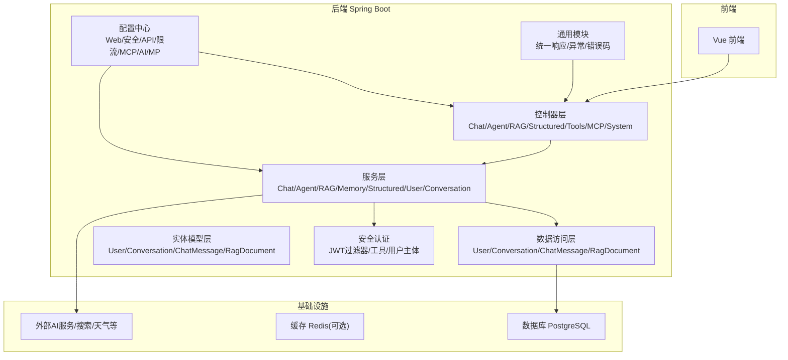

图表来源
- [AiLearnApplication.java](file://src/main/java/com/ailearn/AiLearnApplication.java)
- [WebConfig.java](file://src/main/java/com/ailearn/config/WebConfig.java)
- [SecurityConfig.java](file://src/main/java/com/ailearn/security/SecurityConfig.java)
- [MyBatisPlusConfig.java](file://src/main/java/com/ailearn/config/MyBatisPlusConfig.java)
- [application.yml](file://src/main/resources/application.yml)

章节来源
- [AiLearnApplication.java](file://src/main/java/com/ailearn/AiLearnApplication.java)
- [application.yml](file://src/main/resources/application.yml)
- [pom.xml](file://pom.xml)

## 核心组件
- 启动与装配
  - 启动类负责扫描与自动装配，加载各配置类与组件。
- 配置中心
  - Web配置：跨域、静态资源、SPA回退路由、拦截器
  - 安全配置：Spring Security + JWT过滤器
  - API文档：OpenAPI/Swagger
  - 限流：基于注解或AOP的速率限制
  - MCP：MCP服务器相关配置
  - AI配置：集中管理AI模型、密钥、端点等
  - MyBatis-Plus：分页、逻辑删除、SQL日志等
- 安全认证
  - JWT过滤器在请求进入时解析Token并注入用户上下文
  - 用户主体封装当前登录用户信息
- 数据访问
  - Mapper接口定义CRUD与查询方法，配合实体映射
- 通用模块
  - 统一响应体、全局异常处理器、业务异常与错误码枚举

章节来源
- [WebConfig.java](file://src/main/java/com/ailearn/config/WebConfig.java)
- [SpaFallbackController.java](file://src/main/java/com/ailearn/config/SpaFallbackController.java)
- [SpaFallbackFilter.java](file://src/main/java/com/ailearn/config/SpaFallbackFilter.java)
- [OpenApiConfig.java](file://src/main/java/com/ailearn/config/OpenApiConfig.java)
- [RateLimiterConfig.java](file://src/main/java/com/ailearn/config/RateLimiterConfig.java)
- [McpServerConfig.java](file://src/main/java/com/ailearn/config/McpServerConfig.java)
- [AiConfig.java](file://src/main/java/com/ailearn/config/AiConfig.java)
- [MyBatisPlusConfig.java](file://src/main/java/com/ailearn/config/MyBatisPlusConfig.java)
- [SecurityConfig.java](file://src/main/java/com/ailearn/security/SecurityConfig.java)
- [JwtAuthenticationFilter.java](file://src/main/java/com/ailearn/security/JwtAuthenticationFilter.java)
- [JwtUtil.java](file://src/main/java/com/ailearn/security/JwtUtil.java)
- [UserPrincipal.java](file://src/main/java/com/ailearn/security/UserPrincipal.java)
- [GlobalExceptionHandler.java](file://src/main/java/com/ailearn/common/GlobalExceptionHandler.java)
- [Result.java](file://src/main/java/com/ailearn/common/Result.java)
- [ErrorCode.java](file://src/main/java/com/ailearn/common/ErrorCode.java)
- [BusinessException.java](file://src/main/java/com/ailearn/common/BusinessException.java)

## 架构总览
整体采用前后端分离与分层架构：
- 表现层：RESTful Controller接收请求，参数校验，委托Service
- 业务层：Service编排业务逻辑，调用Mapper、外部AI服务、缓存等
- 数据层：Mapper通过MyBatis-Plus访问数据库
- 安全层：JWT过滤器前置鉴权，用户上下文贯穿请求链路
- 配置层：集中式配置管理AI能力、安全策略、限流策略、MCP集成等

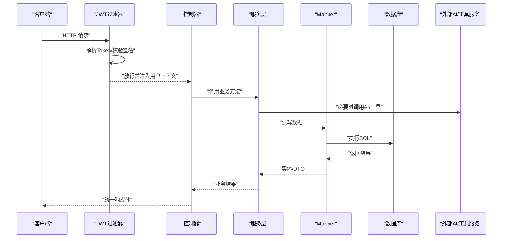

图表来源
- [JwtAuthenticationFilter.java](file://src/main/java/com/ailearn/security/JwtAuthenticationFilter.java)
- [ChatController.java](file://src/main/java/com/ailearn/chat/ChatController.java)
- [ChatService.java](file://src/main/java/com/ailearn/chat/ChatService.java)
- [UserMapper.java](file://src/main/java/com/ailearn/mapper/UserMapper.java)
- [ConversationMapper.java](file://src/main/java/com/ailearn/mapper/ConversationMapper.java)
- [ChatMessageMapper.java](file://src/main/java/com/ailearn/mapper/ChatMessageMapper.java)
- [RagDocumentMapper.java](file://src/main/java/com/ailearn/mapper/RagDocumentMapper.java)

## 详细组件分析

### 安全认证与安全链
- 角色与职责
  - SecurityConfig：定义安全策略、白名单、授权规则
  - JwtAuthenticationFilter：从请求头提取Token，校验并设置安全上下文
  - JwtUtil：生成/解析Token的工具
  - UserPrincipal：承载当前用户信息
- 关键流程
  - 请求进入过滤器 -> 解析Token -> 校验签名/过期 -> 构建用户主体 -> 写入SecurityContext -> 放行至Controller

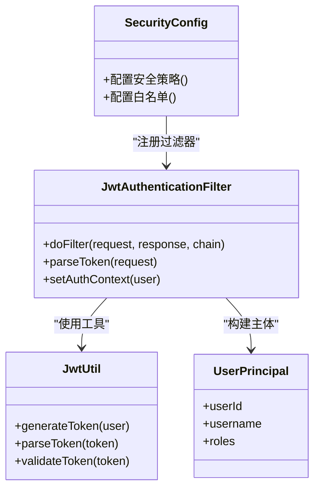

图表来源
- [SecurityConfig.java](file://src/main/java/com/ailearn/security/SecurityConfig.java)
- [JwtAuthenticationFilter.java](file://src/main/java/com/ailearn/security/JwtAuthenticationFilter.java)
- [JwtUtil.java](file://src/main/java/com/ailearn/security/JwtUtil.java)
- [UserPrincipal.java](file://src/main/java/com/ailearn/security/UserPrincipal.java)

章节来源
- [SecurityConfig.java](file://src/main/java/com/ailearn/security/SecurityConfig.java)
- [JwtAuthenticationFilter.java](file://src/main/java/com/ailearn/security/JwtAuthenticationFilter.java)
- [JwtUtil.java](file://src/main/java/com/ailearn/security/JwtUtil.java)
- [UserPrincipal.java](file://src/main/java/com/ailearn/security/UserPrincipal.java)

### 数据访问与实体模型
- 实体模型
  - User：用户基本信息
  - Conversation：会话
  - ChatMessage：消息记录
  - RagDocument：RAG文档索引
- 数据访问
  - 对应Mapper接口定义CRUD与复杂查询
  - 通过MyBatis-Plus简化开发，支持分页、条件构造器等

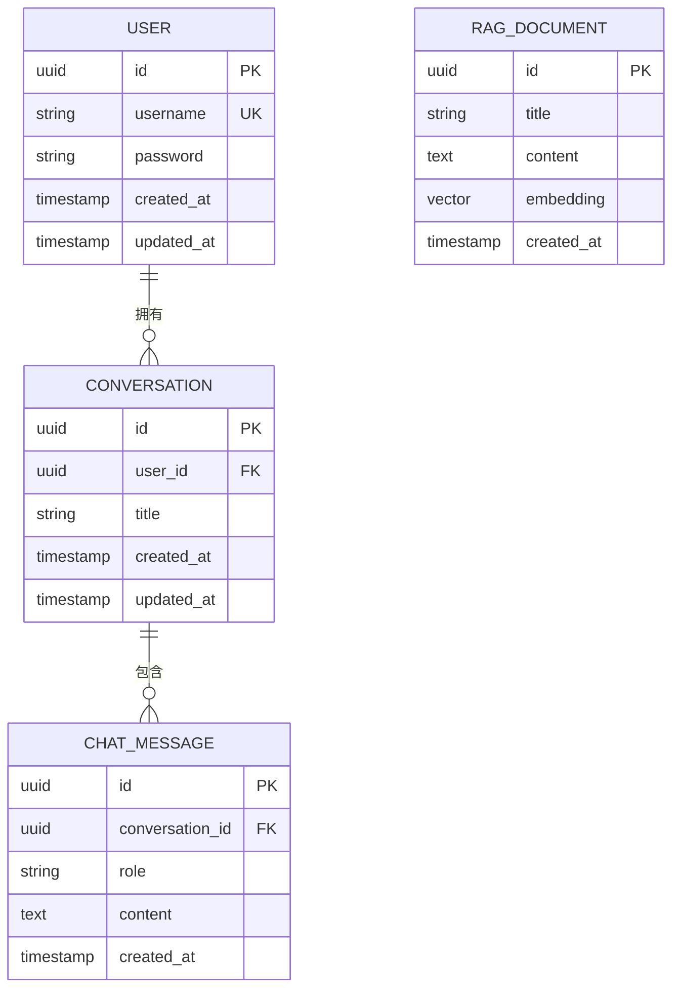

图表来源
- [User.java](file://src/main/java/com/ailearn/entity/User.java)
- [Conversation.java](file://src/main/java/com/ailearn/entity/Conversation.java)
- [ChatMessage.java](file://src/main/java/com/ailearn/entity/ChatMessage.java)
- [RagDocument.java](file://src/main/java/com/ailearn/entity/RagDocument.java)
- [UserMapper.java](file://src/main/java/com/ailearn/mapper/UserMapper.java)
- [ConversationMapper.java](file://src/main/java/com/ailearn/mapper/ConversationMapper.java)
- [ChatMessageMapper.java](file://src/main/java/com/ailearn/mapper/ChatMessageMapper.java)
- [RagDocumentMapper.java](file://src/main/java/com/ailearn/mapper/RagDocumentMapper.java)
- [schema.sql](file://src/main/resources/schema.sql)

章节来源
- [User.java](file://src/main/java/com/ailearn/entity/User.java)
- [Conversation.java](file://src/main/java/com/ailearn/entity/Conversation.java)
- [ChatMessage.java](file://src/main/java/com/ailearn/entity/ChatMessage.java)
- [RagDocument.java](file://src/main/java/com/ailearn/entity/RagDocument.java)
- [UserMapper.java](file://src/main/java/com/ailearn/mapper/UserMapper.java)
- [ConversationMapper.java](file://src/main/java/com/ailearn/mapper/ConversationMapper.java)
- [ChatMessageMapper.java](file://src/main/java/com/ailearn/mapper/ChatMessageMapper.java)
- [RagDocumentMapper.java](file://src/main/java/com/ailearn/mapper/RagDocumentMapper.java)
- [schema.sql](file://src/main/resources/schema.sql)

### 聊天与智能体（Agent）
- 聊天
  - ChatController：接收聊天请求，参数校验，委托ChatService
  - ChatService：组装提示词、调用AI、持久化对话历史
- 智能体
  - AgentController/Service：单智能体编排
  - MultiAgentController/Service：多智能体协作编排
  - SearchAgentController/Service：检索增强型智能体

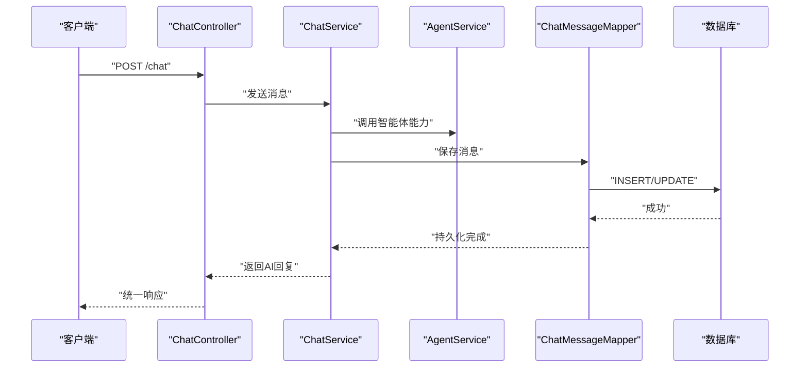

图表来源
- [ChatController.java](file://src/main/java/com/ailearn/chat/ChatController.java)
- [ChatService.java](file://src/main/java/com/ailearn/chat/ChatService.java)
- [AgentController.java](file://src/main/java/com/ailearn/agent/AgentController.java)
- [AgentService.java](file://src/main/java/com/ailearn/agent/AgentService.java)
- [MultiAgentController.java](file://src/main/java/com/ailearn/agent/MultiAgentController.java)
- [MultiAgentService.java](file://src/main/java/com/ailearn/agent/MultiAgentService.java)
- [SearchAgentController.java](file://src/main/java/com/ailearn/agent/SearchAgentController.java)
- [SearchAgentService.java](file://src/main/java/com/ailearn/agent/SearchAgentService.java)
- [ChatMessageMapper.java](file://src/main/java/com/ailearn/mapper/ChatMessageMapper.java)

章节来源
- [ChatController.java](file://src/main/java/com/ailearn/chat/ChatController.java)
- [ChatService.java](file://src/main/java/com/ailearn/chat/ChatService.java)
- [AgentController.java](file://src/main/java/com/ailearn/agent/AgentController.java)
- [AgentService.java](file://src/main/java/com/ailearn/agent/AgentService.java)
- [MultiAgentController.java](file://src/main/java/com/ailearn/agent/MultiAgentController.java)
- [MultiAgentService.java](file://src/main/java/com/ailearn/agent/MultiAgentService.java)
- [SearchAgentController.java](file://src/main/java/com/ailearn/agent/SearchAgentController.java)
- [SearchAgentService.java](file://src/main/java/com/ailearn/agent/SearchAgentService.java)
- [ChatMessageMapper.java](file://src/main/java/com/ailearn/mapper/ChatMessageMapper.java)

### RAG（检索增强生成）
- RagController：上传文档、触发索引、发起RAG问答
- RagService：文档切分、向量化、检索、组合提示词、调用AI
- RagDocument：存储文档元数据与向量

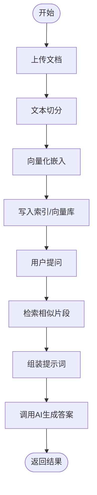

图表来源
- [RagController.java](file://src/main/java/com/ailearn/rag/RagController.java)
- [RagService.java](file://src/main/java/com/ailearn/rag/RagService.java)
- [RagDocument.java](file://src/main/java/com/ailearn/entity/RagDocument.java)
- [RagDocumentMapper.java](file://src/main/java/com/ailearn/mapper/RagDocumentMapper.java)

章节来源
- [RagController.java](file://src/main/java/com/ailearn/rag/RagController.java)
- [RagService.java](file://src/main/java/com/ailearn/rag/RagService.java)
- [RagDocument.java](file://src/main/java/com/ailearn/entity/RagDocument.java)
- [RagDocumentMapper.java](file://src/main/java/com/ailearn/mapper/RagDocumentMapper.java)

### 记忆与上下文
- MemoryChatController/Service：基于会话的记忆聊天
- DatabaseChatMemory：将对话记忆持久化到数据库，保证跨会话连续性

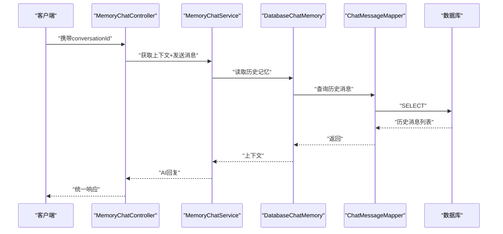

图表来源
- [MemoryChatController.java](file://src/main/java/com/ailearn/memory/MemoryChatController.java)
- [MemoryChatService.java](file://src/main/java/com/ailearn/memory/MemoryChatService.java)
- [DatabaseChatMemory.java](file://src/main/java/com/ailearn/memory/DatabaseChatMemory.java)
- [ChatMessageMapper.java](file://src/main/java/com/ailearn/mapper/ChatMessageMapper.java)

章节来源
- [MemoryChatController.java](file://src/main/java/com/ailearn/memory/MemoryChatController.java)
- [MemoryChatService.java](file://src/main/java/com/ailearn/memory/MemoryChatService.java)
- [DatabaseChatMemory.java](file://src/main/java/com/ailearn/memory/DatabaseChatMemory.java)
- [ChatMessageMapper.java](file://src/main/java/com/ailearn/mapper/ChatMessageMapper.java)

### 结构化输出与工具
- 结构化输出
  - StructuredOutputController/Service：约束AI输出为指定JSON结构
  - MovieInfo：结构化输出示例模型
- 工具
  - ToolsController：暴露工具调用入口
  - CalculatorTool/WeatherTool/WebSearchTool：具体工具实现

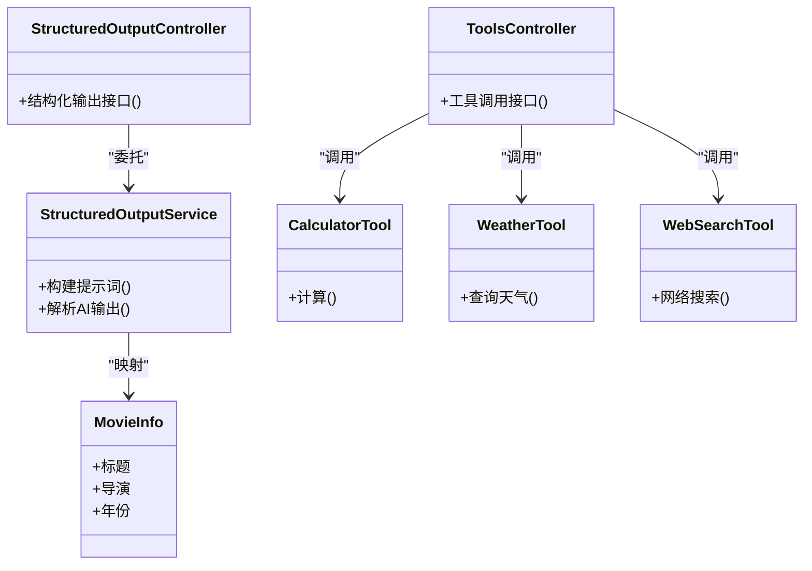

图表来源
- [StructuredOutputController.java](file://src/main/java/com/ailearn/structured/StructuredOutputController.java)
- [StructuredOutputService.java](file://src/main/java/com/ailearn/structured/StructuredOutputService.java)
- [MovieInfo.java](file://src/main/java/com/ailearn/structured/MovieInfo.java)
- [ToolsController.java](file://src/main/java/com/ailearn/tools/ToolsController.java)
- [CalculatorTool.java](file://src/main/java/com/ailearn/tools/CalculatorTool.java)
- [WeatherTool.java](file://src/main/java/com/ailearn/tools/WeatherTool.java)
- [WebSearchTool.java](file://src/main/java/com/ailearn/tools/WebSearchTool.java)

章节来源
- [StructuredOutputController.java](file://src/main/java/com/ailearn/structured/StructuredOutputController.java)
- [StructuredOutputService.java](file://src/main/java/com/ailearn/structured/StructuredOutputService.java)
- [MovieInfo.java](file://src/main/java/com/ailearn/structured/MovieInfo.java)
- [ToolsController.java](file://src/main/java/com/ailearn/tools/ToolsController.java)
- [CalculatorTool.java](file://src/main/java/com/ailearn/tools/CalculatorTool.java)
- [WeatherTool.java](file://src/main/java/com/ailearn/tools/WeatherTool.java)
- [WebSearchTool.java](file://src/main/java/com/ailearn/tools/WebSearchTool.java)

### MCP集成
- McpController：对外暴露MCP协议接口
- SystemTools：系统级工具集合
- McpServerConfig：MCP服务器配置

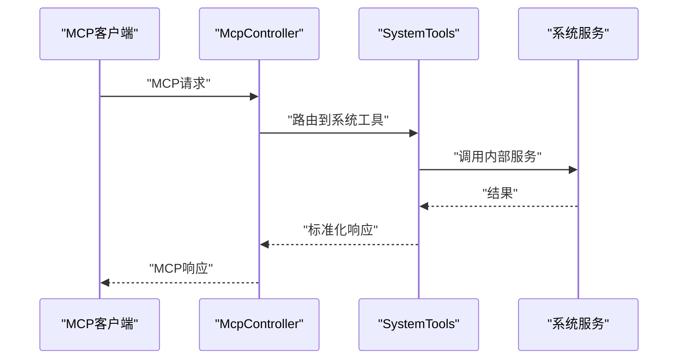

图表来源
- [McpController.java](file://src/main/java/com/ailearn/mcp/McpController.java)
- [SystemTools.java](file://src/main/java/com/ailearn/mcp/SystemTools.java)
- [McpServerConfig.java](file://src/main/java/com/ailearn/config/McpServerConfig.java)

章节来源
- [McpController.java](file://src/main/java/com/ailearn/mcp/McpController.java)
- [SystemTools.java](file://src/main/java/com/ailearn/mcp/SystemTools.java)
- [McpServerConfig.java](file://src/main/java/com/ailearn/config/McpServerConfig.java)

### SPA支持与静态资源
- WebConfig：跨域、静态资源映射
- SpaFallbackController/SpaFallbackFilter：前端路由回退，确保刷新不404

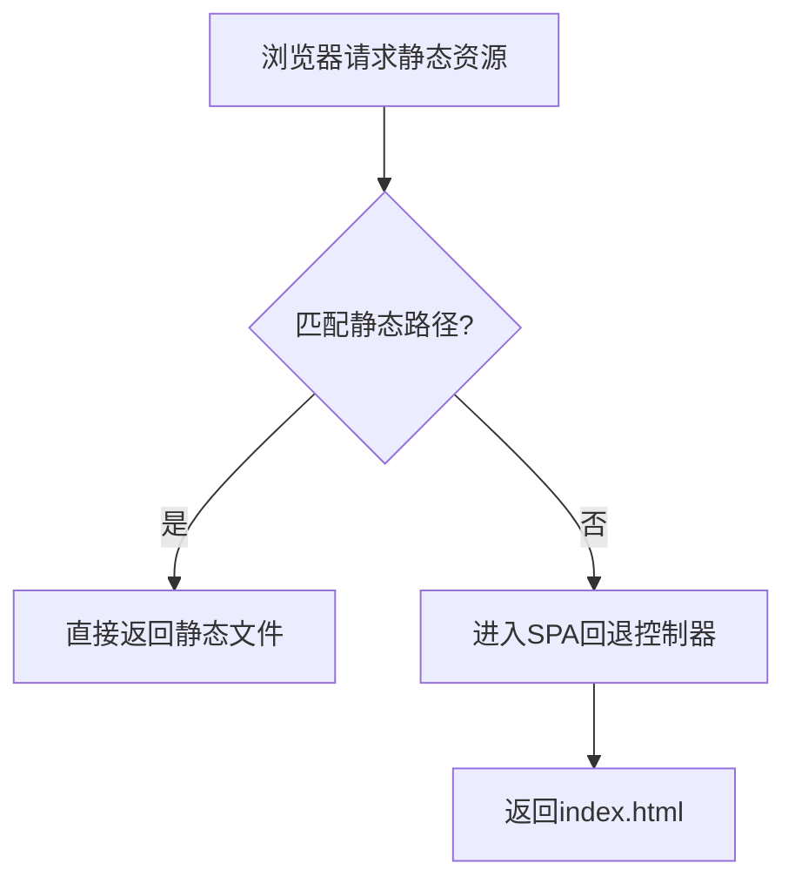

图表来源
- [WebConfig.java](file://src/main/java/com/ailearn/config/WebConfig.java)
- [SpaFallbackController.java](file://src/main/java/com/ailearn/config/SpaFallbackController.java)
- [SpaFallbackFilter.java](file://src/main/java/com/ailearn/config/SpaFallbackFilter.java)

章节来源
- [WebConfig.java](file://src/main/java/com/ailearn/config/WebConfig.java)
- [SpaFallbackController.java](file://src/main/java/com/ailearn/config/SpaFallbackController.java)
- [SpaFallbackFilter.java](file://src/main/java/com/ailearn/config/SpaFallbackFilter.java)

## 依赖关系分析
- 组件耦合
  - Controller仅依赖Service，保持薄控制层
  - Service聚合Mapper与外部AI/工具，承担编排职责
  - Mapper与Entity一一对应，遵循单一职责
- 外部依赖
  - 数据库：PostgreSQL（通过MyBatis-Plus）
  - 外部AI服务：通过配置中心注入端点与密钥
  - 可选缓存：Redis（用于热点数据与会话缓存）
- 可观测性
  - OpenAPI文档便于调试与联调
  - 全局异常处理器统一错误格式

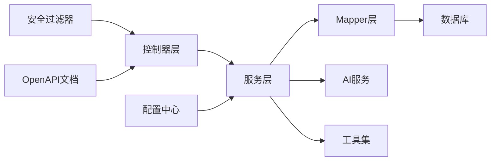

图表来源
- [ChatController.java](file://src/main/java/com/ailearn/chat/ChatController.java)
- [ChatService.java](file://src/main/java/com/ailearn/chat/ChatService.java)
- [UserMapper.java](file://src/main/java/com/ailearn/mapper/UserMapper.java)
- [AiConfig.java](file://src/main/java/com/ailearn/config/AiConfig.java)
- [OpenApiConfig.java](file://src/main/java/com/ailearn/config/OpenApiConfig.java)

章节来源
- [ChatController.java](file://src/main/java/com/ailearn/chat/ChatController.java)
- [ChatService.java](file://src/main/java/com/ailearn/chat/ChatService.java)
- [UserMapper.java](file://src/main/java/com/ailearn/mapper/UserMapper.java)
- [AiConfig.java](file://src/main/java/com/ailearn/config/AiConfig.java)
- [OpenApiConfig.java](file://src/main/java/com/ailearn/config/OpenApiConfig.java)

## 性能考虑
- 数据库连接池
  - 通过配置文件调整连接池大小、超时与最大空闲时间，避免连接耗尽
- 缓存策略
  - 对热点数据（如字典、热门问答）引入Redis缓存，降低数据库压力
  - 会话记忆可结合缓存提升读取性能，注意一致性策略
- 限流与熔断
  - 使用限流配置保护AI接口，防止雪崩
  - 对第三方AI服务增加重试与熔断策略
- 异步与批处理
  - 文档索引、向量化等耗时任务建议异步化与批量提交
- 序列化与传输
  - 合理设置响应体字段，减少冗余数据传输

[本节为通用指导，无需特定文件引用]

## 故障排查指南
- 统一异常处理
  - GlobalExceptionHandler捕获全局异常，返回统一错误码与消息
- 常见错误定位
  - 安全失败：检查JWT过滤器与Security配置
  - 数据库异常：查看Mapper SQL与连接池配置
  - AI服务异常：检查AiConfig端点与密钥，关注限流与重试
- 日志与追踪
  - 通过MDC过滤器关联请求ID，便于链路追踪
  - 使用OpenAPI文档核对接口契约

章节来源
- [GlobalExceptionHandler.java](file://src/main/java/com/ailearn/common/GlobalExceptionHandler.java)
- [Result.java](file://src/main/java/com/ailearn/common/Result.java)
- [ErrorCode.java](file://src/main/java/com/ailearn/common/ErrorCode.java)
- [BusinessException.java](file://src/main/java/com/ailearn/common/BusinessException.java)
- [MdcTraceFilter.java](file://src/main/java/com/ailearn/config/MdcTraceFilter.java)
- [OpenApiConfig.java](file://src/main/java/com/ailearn/config/OpenApiConfig.java)

## 结论
本项目采用清晰的分层与模块化设计，结合Spring生态与AI能力，实现了聊天、智能体、RAG、结构化输出与工具扩展等核心能力。通过配置中心统一管理AI与安全策略，借助JWT与全局异常处理保障安全性与稳定性。未来可在缓存、异步化、可观测性与多租户等方面持续演进，以支撑更大规模与更复杂的AI应用场景。

[本节为总结性内容，无需特定文件引用]

## 附录
- 部署与容器化
  - Dockerfile与docker-compose用于本地与生产环境快速部署
- 数据库初始化
  - schema.sql提供基础表结构

章节来源
- [Dockerfile](file://Dockerfile)
- [docker-compose.yml](file://docker-compose.yml)
- [schema.sql](file://src/main/resources/schema.sql)