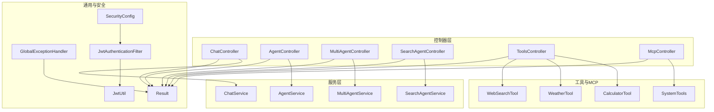
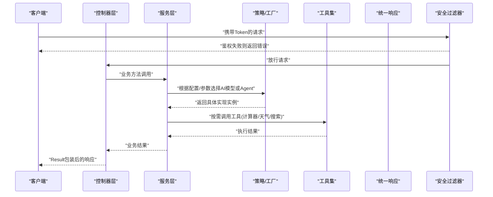
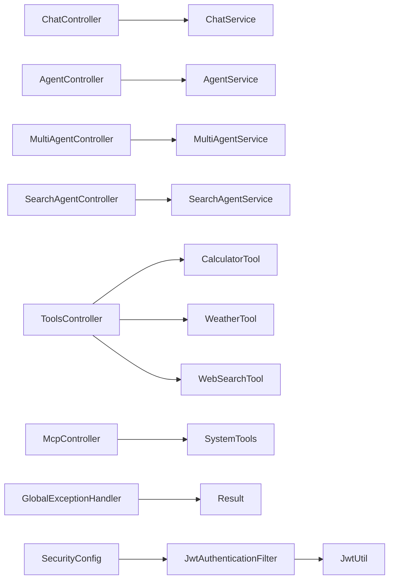

# 设计模式应用

<cite>
**本文引用的文件**   
- [AiLearnApplication.java](file://src/main/java/com/ailearn/AiLearnApplication.java)
- [Result.java](file://src/main/java/com/ailearn/common/Result.java)
- [GlobalExceptionHandler.java](file://src/main/java/com/ailearn/common/GlobalExceptionHandler.java)
- [BusinessException.java](file://src/main/java/com/ailearn/common/BusinessException.java)
- [ErrorCode.java](file://src/main/java/com/ailearn/common/ErrorCode.java)
- [AiConfig.java](file://src/main/java/com/ailearn/config/AiConfig.java)
- [McpServerConfig.java](file://src/main/java/com/ailearn/config/McpServerConfig.java)
- [WebConfig.java](file://src/main/java/com/ailearn/config/WebConfig.java)
- [ChatController.java](file://src/main/java/com/ailearn/chat/ChatController.java)
- [ChatService.java](file://src/main/java/com/ailearn/chat/ChatService.java)
- [AgentController.java](file://src/main/java/com/ailearn/agent/AgentController.java)
- [AgentService.java](file://src/main/java/com/ailearn/agent/AgentService.java)
- [MultiAgentController.java](file://src/main/java/com/ailearn/agent/MultiAgentController.java)
- [MultiAgentService.java](file://src/main/java/com/ailearn/agent/MultiAgentService.java)
- [SearchAgentController.java](file://src/main/java/com/ailearn/agent/SearchAgentController.java)
- [SearchAgentService.java](file://src/main/java/com/ailearn/agent/SearchAgentService.java)
- [ToolsController.java](file://src/main/java/com/ailearn/tools/ToolsController.java)
- [CalculatorTool.java](file://src/main/java/com/ailearn/tools/CalculatorTool.java)
- [WeatherTool.java](file://src/main/java/com/ailearn/tools/WeatherTool.java)
- [WebSearchTool.java](file://src/main/java/com/ailearn/tools/WebSearchTool.java)
- [SystemTools.java](file://src/main/java/com/ailearn/mcp/SystemTools.java)
- [McpController.java](file://src/main/java/com/ailearn/mcp/McpController.java)
- [JwtUtil.java](file://src/main/java/com/ailearn/security/JwtUtil.java)
- [SecurityConfig.java](file://src/main/java/com/ailearn/security/SecurityConfig.java)
- [JwtAuthenticationFilter.java](file://src/main/java/com/ailearn/security/JwtAuthenticationFilter.java)
</cite>

## 目录
1. [引言](#引言)
2. [项目结构](#项目结构)
3. [核心组件](#核心组件)
4. [架构总览](#架构总览)
5. [详细组件分析](#详细组件分析)
6. [依赖关系分析](#依赖关系分析)
7. [性能与可扩展性](#性能与可扩展性)
8. [故障排查指南](#故障排查指南)
9. [结论](#结论)
10. [附录：代码示例路径](#附录代码示例路径)

## 引言
本文件聚焦于Java AI学习平台中设计模式的工程化落地，围绕以下主题展开：
- 单例模式在配置类中的应用（Spring容器管理的单例）
- 工厂模式在AI服务动态创建中的实现
- 策略模式在多AI模型切换中的使用
- 观察者模式在消息处理流程中的应用
- 统一响应格式Result类的设计与封装策略
- 工具系统ToolsController的插件式架构思想
- 每种模式的优势、适用场景与替代方案

目标读者包括初中级开发者与架构师，旨在帮助理解如何在实际项目中以最小成本引入并演进这些模式。

## 项目结构
后端采用分层架构：控制器层负责HTTP接口编排，服务层承载业务逻辑，配置与安全模块提供横切能力，工具与MCP子系统体现插件化扩展点。前端为Vue SPA，通过API与后端交互。

图表来源
- [ChatController.java](file://src/main/java/com/ailearn/chat/ChatController.java)
- [ChatService.java](file://src/main/java/com/ailearn/chat/ChatService.java)
- [AgentController.java](file://src/main/java/com/ailearn/agent/AgentController.java)
- [AgentService.java](file://src/main/java/com/ailearn/agent/AgentService.java)
- [MultiAgentController.java](file://src/main/java/com/ailearn/agent/MultiAgentController.java)
- [MultiAgentService.java](file://src/main/java/com/ailearn/agent/MultiAgentService.java)
- [SearchAgentController.java](file://src/main/java/com/ailearn/agent/SearchAgentController.java)
- [SearchAgentService.java](file://src/main/java/com/ailearn/agent/SearchAgentService.java)
- [ToolsController.java](file://src/main/java/com/ailearn/tools/ToolsController.java)
- [CalculatorTool.java](file://src/main/java/com/ailearn/tools/CalculatorTool.java)
- [WeatherTool.java](file://src/main/java/com/ailearn/tools/WeatherTool.java)
- [WebSearchTool.java](file://src/main/java/com/ailearn/tools/WebSearchTool.java)
- [SystemTools.java](file://src/main/java/com/ailearn/mcp/SystemTools.java)
- [McpController.java](file://src/main/java/com/ailearn/mcp/McpController.java)
- [Result.java](file://src/main/java/com/ailearn/common/Result.java)
- [GlobalExceptionHandler.java](file://src/main/java/com/ailearn/common/GlobalExceptionHandler.java)
- [SecurityConfig.java](file://src/main/java/com/ailearn/security/SecurityConfig.java)
- [JwtAuthenticationFilter.java](file://src/main/java/com/ailearn/security/JwtAuthenticationFilter.java)
- [JwtUtil.java](file://src/main/java/com/ailearn/security/JwtUtil.java)

章节来源
- [AiLearnApplication.java](file://src/main/java/com/ailearn/AiLearnApplication.java)
- [ChatController.java](file://src/main/java/com/ailearn/chat/ChatController.java)
- [ChatService.java](file://src/main/java/com/ailearn/chat/ChatService.java)
- [ToolsController.java](file://src/main/java/com/ailearn/tools/ToolsController.java)
- [McpController.java](file://src/main/java/com/ailearn/mcp/McpController.java)

## 核心组件
- 统一响应Result：作为所有接口的标准返回体，结合全局异常处理器形成一致的错误语义与数据结构。
- 安全与鉴权：基于JWT的过滤器链，配合安全配置完成请求校验与上下文注入。
- 工具与MCP：以可插拔方式注册工具，支持运行时发现与调用。
- 多Agent与多模型：通过策略与工厂组合，实现不同模型与Agent的动态选择与编排。

章节来源
- [Result.java](file://src/main/java/com/ailearn/common/Result.java)
- [GlobalExceptionHandler.java](file://src/main/java/com/ailearn/common/GlobalExceptionHandler.java)
- [SecurityConfig.java](file://src/main/java/com/ailearn/security/SecurityConfig.java)
- [JwtAuthenticationFilter.java](file://src/main/java/com/ailearn/security/JwtAuthenticationFilter.java)
- [JwtUtil.java](file://src/main/java/com/ailearn/security/JwtUtil.java)
- [ToolsController.java](file://src/main/java/com/ailearn/tools/ToolsController.java)
- [SystemTools.java](file://src/main/java/com/ailearn/mcp/SystemTools.java)

## 架构总览
下图展示从HTTP请求到AI推理与工具调用的端到端流程，以及各设计模式的关键落点。

图表来源
- [ChatController.java](file://src/main/java/com/ailearn/chat/ChatController.java)
- [ChatService.java](file://src/main/java/com/ailearn/chat/ChatService.java)
- [AgentController.java](file://src/main/java/com/ailearn/agent/AgentController.java)
- [AgentService.java](file://src/main/java/com/ailearn/agent/AgentService.java)
- [ToolsController.java](file://src/main/java/com/ailearn/tools/ToolsController.java)
- [CalculatorTool.java](file://src/main/java/com/ailearn/tools/CalculatorTool.java)
- [WeatherTool.java](file://src/main/java/com/ailearn/tools/WeatherTool.java)
- [WebSearchTool.java](file://src/main/java/com/ailearn/tools/WebSearchTool.java)
- [Result.java](file://src/main/java/com/ailearn/common/Result.java)
- [JwtAuthenticationFilter.java](file://src/main/java/com/ailearn/security/JwtAuthenticationFilter.java)

## 详细组件分析

### 单例模式在配置类中的应用
- 设计要点
  - Spring容器默认将Bean作为单例管理，配置类通常以@Configuration标注，其内部定义的@Bean方法返回的对象由容器保证单例生命周期。
  - 典型用途：集中管理AI模型参数、MCP服务器地址、限流阈值等跨模块共享的配置。
- 关键文件
  - AiConfig：集中定义AI相关配置项，供服务层读取。
  - McpServerConfig：维护MCP服务端连接与元数据。
  - WebConfig：统一拦截器、跨域、静态资源映射等Web层配置。
- 优势
  - 避免重复初始化，降低内存占用；保证配置一致性。
- 替代方案
  - 若需多实例或按环境隔离，可使用@Scope("prototype")或自定义Provider；或使用外部配置中心（Nacos/Apollo）+本地缓存。

章节来源
- [AiConfig.java](file://src/main/java/com/ailearn/config/AiConfig.java)
- [McpServerConfig.java](file://src/main/java/com/ailearn/config/McpServerConfig.java)
- [WebConfig.java](file://src/main/java/com/ailearn/config/WebConfig.java)

### 工厂模式在AI服务动态创建中的实现
- 设计要点
  - 针对不同的AI模型或Agent，通过工厂根据输入参数或配置动态创建对应实现，屏蔽具体类型差异。
  - 常见形态：枚举键到实现的映射表、策略注册表、或基于Spring容器按名称获取Bean。
- 关键文件
  - AgentService：可能包含按Agent类型选择具体实现的逻辑。
  - MultiAgentService：协调多个Agent的组合与路由。
  - SearchAgentService：面向检索增强场景的专用Agent实现。
- 优势
  - 解耦调用方与具体实现；新增模型无需修改已有调用代码。
- 替代方案
  - 策略模式直接暴露接口集合，由调用方自行选择；或基于注解扫描自动注册。

章节来源
- [AgentService.java](file://src/main/java/com/ailearn/agent/AgentService.java)
- [MultiAgentService.java](file://src/main/java/com/ailearn/agent/MultiAgentService.java)
- [SearchAgentService.java](file://src/main/java/com/ailearn/agent/SearchAgentService.java)

### 策略模式在多AI模型切换中的使用
- 设计要点
  - 定义统一的AI模型接口，不同模型实现该接口；通过策略选择器依据请求参数或配置决定具体策略。
  - 典型入口：AgentController/ChatController接收请求后，交由服务层选择策略并执行。
- 关键文件
  - ChatController/ChatService：聊天场景下的模型选择与执行。
  - AgentController/AgentService：Agent场景下的策略分发。
- 优势
  - 新增模型只需新增实现并注册；调用方无感知。
- 替代方案
  - 简单场景可用if-else或Map<key, strategy>；复杂场景建议结合工厂与策略组合。

章节来源
- [ChatController.java](file://src/main/java/com/ailearn/chat/ChatController.java)
- [ChatService.java](file://src/main/java/com/ailearn/chat/ChatService.java)
- [AgentController.java](file://src/main/java/com/ailearn/agent/AgentController.java)
- [AgentService.java](file://src/main/java/com/ailearn/agent/AgentService.java)

### 观察者模式在消息处理流程中的应用
- 设计要点
  - 在消息生成、转发、持久化等环节发布事件，订阅者（如审计、指标收集、告警）异步消费。
  - 可通过Spring Event或轻量级事件总线实现。
- 关键文件
  - ChatService：在消息写入或状态变更时发布事件。
  - GlobalExceptionHandler：捕获异常并发布“错误事件”，供监控订阅。
- 优势
  - 解耦主流程与辅助流程；便于横向扩展监控与审计能力。
- 替代方案
  - 使用消息队列（Kafka/RabbitMQ）进行跨进程/跨服务的事件传播。

章节来源
- [ChatService.java](file://src/main/java/com/ailearn/chat/ChatService.java)
- [GlobalExceptionHandler.java](file://src/main/java/com/ailearn/common/GlobalExceptionHandler.java)

### 统一响应格式Result类的设计与封装策略
- 设计要点
  - 所有接口返回统一结构，包含状态码、消息、数据体等字段；全局异常处理器将异常转换为Result。
  - 提供便捷构造方法与成功/失败静态方法，简化调用方编码。
- 关键文件
  - Result：统一响应体定义。
  - GlobalExceptionHandler：全局异常转Result。
  - BusinessException/ErrorCode：业务异常与错误码规范。
- 优势
  - 前后端契约稳定；错误信息规范化；便于网关/中间件统一处理。
- 替代方案
  - 使用RFC7807 Problem Details；或在网关层做二次包装。

章节来源
- [Result.java](file://src/main/java/com/ailearn/common/Result.java)
- [GlobalExceptionHandler.java](file://src/main/java/com/ailearn/common/GlobalExceptionHandler.java)
- [BusinessException.java](file://src/main/java/com/ailearn/common/BusinessException.java)
- [ErrorCode.java](file://src/main/java/com/ailearn/common/ErrorCode.java)

### 工具系统ToolsController的插件式架构
- 设计要点
  - 工具以独立类实现统一接口，通过注册机制（注解扫描或配置列表）动态发现。
  - ToolsController提供工具清单、参数校验、执行与结果聚合；MCP侧SystemTools提供系统级工具。
- 关键文件
  - ToolsController：工具路由与调度。
  - CalculatorTool/WeatherTool/WebSearchTool：业务工具实现。
  - SystemTools：系统工具集合。
  - McpController：MCP协议入口，暴露工具能力。
- 优势
  - 新工具零侵入接入；可按领域拆分与维护；支持热插拔。
- 替代方案
  - SPI机制；或服务网格/函数计算平台托管工具。

章节来源
- [ToolsController.java](file://src/main/java/com/ailearn/tools/ToolsController.java)
- [CalculatorTool.java](file://src/main/java/com/ailearn/tools/CalculatorTool.java)
- [WeatherTool.java](file://src/main/java/com/ailearn/tools/WeatherTool.java)
- [WebSearchTool.java](file://src/main/java/com/ailearn/tools/WebSearchTool.java)
- [SystemTools.java](file://src/main/java/com/ailearn/mcp/SystemTools.java)
- [McpController.java](file://src/main/java/com/ailearn/mcp/McpController.java)

### 安全与鉴权（补充）
- 设计要点
  - 基于JWT的过滤器链，在请求进入控制器前完成令牌校验与用户上下文注入。
- 关键文件
  - SecurityConfig：安全过滤链配置。
  - JwtAuthenticationFilter：解析与校验JWT。
  - JwtUtil：令牌生成与解析工具。
- 优势
  - 无状态鉴权；易于水平扩展。
- 替代方案
  - OAuth2/OIDC；或网关集中鉴权。

章节来源
- [SecurityConfig.java](file://src/main/java/com/ailearn/security/SecurityConfig.java)
- [JwtAuthenticationFilter.java](file://src/main/java/com/ailearn/security/JwtAuthenticationFilter.java)
- [JwtUtil.java](file://src/main/java/com/ailearn/security/JwtUtil.java)

## 依赖关系分析
- 低耦合高内聚
  - 控制器仅编排流程，不持有具体AI实现；通过服务层与策略/工厂抽象降低耦合。
  - 工具与MCP通过接口与注册表解耦，新增工具不影响既有链路。
- 可能的循环依赖
  - 避免在配置类与服务类之间相互注入；必要时使用延迟加载或事件解耦。
- 外部依赖
  - 安全依赖JWT库；AI推理依赖具体SDK；数据库依赖MyBatis Plus。

图表来源
- [ChatController.java](file://src/main/java/com/ailearn/chat/ChatController.java)
- [ChatService.java](file://src/main/java/com/ailearn/chat/ChatService.java)
- [AgentController.java](file://src/main/java/com/ailearn/agent/AgentController.java)
- [AgentService.java](file://src/main/java/com/ailearn/agent/AgentService.java)
- [MultiAgentController.java](file://src/main/java/com/ailearn/agent/MultiAgentController.java)
- [MultiAgentService.java](file://src/main/java/com/ailearn/agent/MultiAgentService.java)
- [SearchAgentController.java](file://src/main/java/com/ailearn/agent/SearchAgentController.java)
- [SearchAgentService.java](file://src/main/java/com/ailearn/agent/SearchAgentService.java)
- [ToolsController.java](file://src/main/java/com/ailearn/tools/ToolsController.java)
- [CalculatorTool.java](file://src/main/java/com/ailearn/tools/CalculatorTool.java)
- [WeatherTool.java](file://src/main/java/com/ailearn/tools/WeatherTool.java)
- [WebSearchTool.java](file://src/main/java/com/ailearn/tools/WebSearchTool.java)
- [McpController.java](file://src/main/java/com/ailearn/mcp/McpController.java)
- [SystemTools.java](file://src/main/java/com/ailearn/mcp/SystemTools.java)
- [GlobalExceptionHandler.java](file://src/main/java/com/ailearn/common/GlobalExceptionHandler.java)
- [Result.java](file://src/main/java/com/ailearn/common/Result.java)
- [SecurityConfig.java](file://src/main/java/com/ailearn/security/SecurityConfig.java)
- [JwtAuthenticationFilter.java](file://src/main/java/com/ailearn/security/JwtAuthenticationFilter.java)
- [JwtUtil.java](file://src/main/java/com/ailearn/security/JwtUtil.java)

## 性能与可扩展性
- 单例配置减少对象创建开销；合理设置超时与重试，避免长尾请求阻塞线程池。
- 策略/工厂注册表建议使用ConcurrentHashMap或不可变快照，提升并发读性能。
- 工具调用可引入熔断与降级，防止下游抖动影响整体可用性。
- 消息处理建议异步化，避免同步阻塞主流程。

## 故障排查指南
- 统一错误码与日志
  - 通过BusinessException与ErrorCode明确错误语义；GlobalExceptionHandler将异常转为Result，便于前端一致处理。
- 常见问题定位
  - 鉴权失败：检查JwtAuthenticationFilter与JwtUtil的密钥与过期时间。
  - 模型选择错误：核对工厂/策略注册表是否包含新模型键值。
  - 工具调用失败：查看工具注册与权限配置，确认网络与凭据。
- 建议
  - 增加结构化日志与TraceId透传；对关键路径添加指标埋点。

章节来源
- [GlobalExceptionHandler.java](file://src/main/java/com/ailearn/common/GlobalExceptionHandler.java)
- [BusinessException.java](file://src/main/java/com/ailearn/common/BusinessException.java)
- [ErrorCode.java](file://src/main/java/com/ailearn/common/ErrorCode.java)
- [JwtAuthenticationFilter.java](file://src/main/java/com/ailearn/security/JwtAuthenticationFilter.java)
- [JwtUtil.java](file://src/main/java/com/ailearn/security/JwtUtil.java)

## 结论
本项目以Spring生态为基础，将单例、工厂、策略、观察者等经典模式与插件化架构有机结合，实现了：
- 易扩展的AI模型与Agent选择机制
- 稳定的统一响应与错误处理体系
- 可插拔的工具系统与MCP集成
- 清晰的安全与鉴权边界

建议在后续迭代中持续完善注册表的可观测性与版本治理，逐步引入异步事件与熔断降级，进一步提升系统的韧性与可维护性。

## 附录：代码示例路径
- 统一响应与异常处理
  - [Result.java](file://src/main/java/com/ailearn/common/Result.java)
  - [GlobalExceptionHandler.java](file://src/main/java/com/ailearn/common/GlobalExceptionHandler.java)
  - [BusinessException.java](file://src/main/java/com/ailearn/common/BusinessException.java)
  - [ErrorCode.java](file://src/main/java/com/ailearn/common/ErrorCode.java)
- 配置与单例
  - [AiConfig.java](file://src/main/java/com/ailearn/config/AiConfig.java)
  - [McpServerConfig.java](file://src/main/java/com/ailearn/config/McpServerConfig.java)
  - [WebConfig.java](file://src/main/java/com/ailearn/config/WebConfig.java)
- 工厂与策略（模型/Agent）
  - [AgentService.java](file://src/main/java/com/ailearn/agent/AgentService.java)
  - [MultiAgentService.java](file://src/main/java/com/ailearn/agent/MultiAgentService.java)
  - [SearchAgentService.java](file://src/main/java/com/ailearn/agent/SearchAgentService.java)
  - [ChatService.java](file://src/main/java/com/ailearn/chat/ChatService.java)
- 工具与MCP（插件式）
  - [ToolsController.java](file://src/main/java/com/ailearn/tools/ToolsController.java)
  - [CalculatorTool.java](file://src/main/java/com/ailearn/tools/CalculatorTool.java)
  - [WeatherTool.java](file://src/main/java/com/ailearn/tools/WeatherTool.java)
  - [WebSearchTool.java](file://src/main/java/com/ailearn/tools/WebSearchTool.java)
  - [SystemTools.java](file://src/main/java/com/ailearn/mcp/SystemTools.java)
  - [McpController.java](file://src/main/java/com/ailearn/mcp/McpController.java)
- 安全与鉴权
  - [SecurityConfig.java](file://src/main/java/com/ailearn/security/SecurityConfig.java)
  - [JwtAuthenticationFilter.java](file://src/main/java/com/ailearn/security/JwtAuthenticationFilter.java)
  - [JwtUtil.java](file://src/main/java/com/ailearn/security/JwtUtil.java)