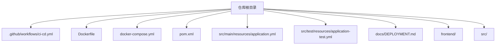
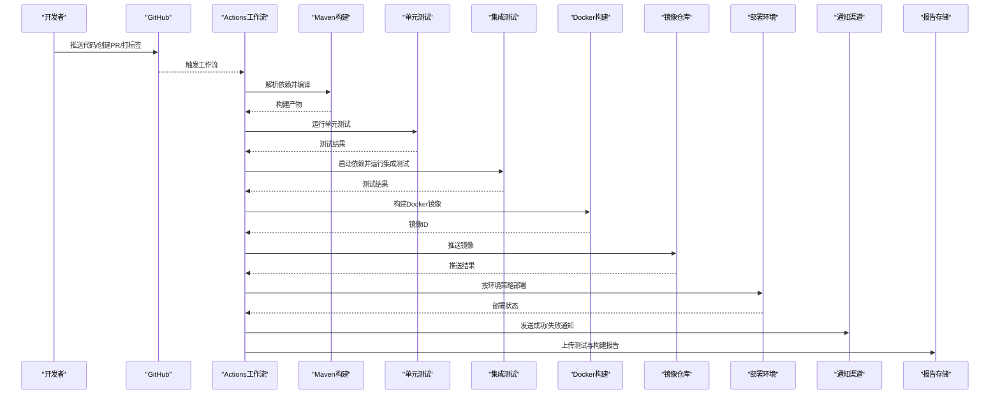
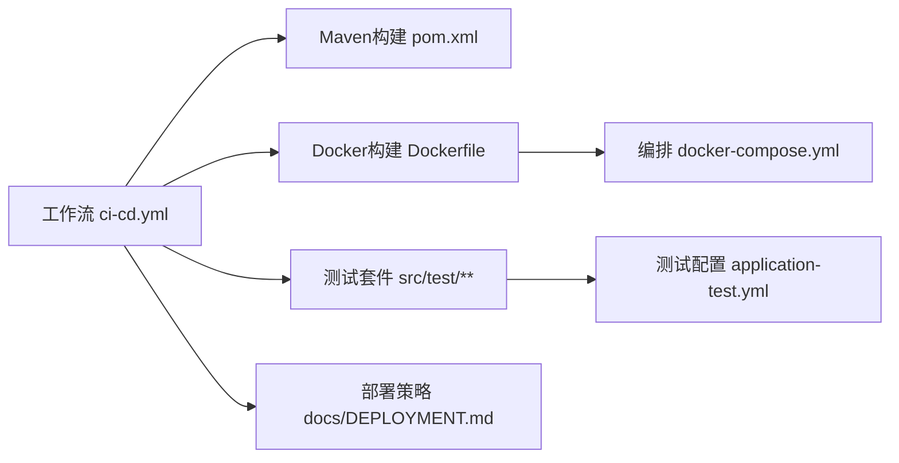

# CI/CD流水线配置

<cite>
**本文引用的文件**   
- [ci-cd.yml](file://.github/workflows/ci-cd.yml)
- [Dockerfile](file://Dockerfile)
- [docker-compose.yml](file://docker-compose.yml)
- [pom.xml](file://pom.xml)
- [application.yml](file://src/main/resources/application.yml)
- [application-test.yml](file://src/test/resources/application-test.yml)
- [ChatServiceTest.java](file://src/test/java/com/ailearn/chat/ChatServiceTest.java)
- [GlobalExceptionHandlerTest.java](file://src/test/java/com/ailearn/common/GlobalExceptionHandlerTest.java)
- [ResultTest.java](file://src/test/java/com/ailearn/common/ResultTest.java)
- [UserControllerTest.java](file://src/test/java/com/ailearn/controller/UserControllerTest.java)
- [JwtUtilTest.java](file://src/test/java/com/ailearn/security/JwtUtilTest.java)
- [ConversationServiceTest.java](file://src/test/java/com/ailearn/service/ConversationServiceTest.java)
- [UserServiceTest.java](file://src/test/java/com/ailearn/service/UserServiceTest.java)
- [CalculatorToolTest.java](file://src/test/java/com/ailearn/tools/CalculatorToolTest.java)
- [WeatherToolTest.java](file://src/test/java/com/ailearn/tools/WeatherToolTest.java)
- [AiLearnApplicationTests.java](file://src/test/java/com/ailearn/AiLearnApplicationTests.java)
- [DEPLOYMENT.md](file://docs/DEPLOYMENT.md)
</cite>

## 目录
1. [简介](#简介)
2. [项目结构](#项目结构)
3. [核心组件](#核心组件)
4. [架构总览](#架构总览)
5. [详细组件分析](#详细组件分析)
6. [依赖分析](#依赖分析)
7. [性能考虑](#性能考虑)
8. [故障排查指南](#故障排查指南)
9. [结论](#结论)
10. [附录](#附录)

## 简介
本指南面向Java AI学习项目的CI/CD流水线，聚焦于GitHub Actions工作流与自动化构建流程。内容覆盖代码质量检查、单元测试执行、集成测试策略、Docker镜像构建与推送、多环境部署触发条件与策略、构建缓存与并行优化、失败通知与回滚机制、分支策略与合并流程，以及部署状态监控与报告生成。文档以仓库现有工件为基础进行说明，并提供可操作的实践建议。

## 项目结构
仓库采用前后端分离与容器化部署的常见结构：
- 后端基于Spring Boot（Maven）组织在src/main与src/test下，资源与配置文件位于resources目录
- 前端位于frontend目录，使用Vite构建
- 容器化相关工件包括根级Dockerfile与docker-compose编排文件
- GitHub Actions工作流定义在.github/workflows/ci-cd.yml
- 部署说明文档位于docs/DEPLOYMENT.md

图表来源
- [ci-cd.yml](file://.github/workflows/ci-cd.yml)
- [Dockerfile](file://Dockerfile)
- [docker-compose.yml](file://docker-compose.yml)
- [pom.xml](file://pom.xml)
- [application.yml](file://src/main/resources/application.yml)
- [application-test.yml](file://src/test/resources/application-test.yml)
- [DEPLOYMENT.md](file://docs/DEPLOYMENT.md)

章节来源
- [ci-cd.yml](file://.github/workflows/ci-cd.yml)
- [Dockerfile](file://Dockerfile)
- [docker-compose.yml](file://docker-compose.yml)
- [pom.xml](file://pom.xml)
- [application.yml](file://src/main/resources/application.yml)
- [application-test.yml](file://src/test/resources/application-test.yml)
- [DEPLOYMENT.md](file://docs/DEPLOYMENT.md)

## 核心组件
- GitHub Actions工作流：负责触发、构建、测试、打包、发布与部署等阶段
- Maven构建：通过pom.xml管理依赖与构建目标
- Docker镜像：通过Dockerfile定义应用镜像，docker-compose用于本地或CI中的服务编排
- 测试套件：包含单元测试与可能的集成测试用例，配合测试资源配置

章节来源
- [ci-cd.yml](file://.github/workflows/ci-cd.yml)
- [pom.xml](file://pom.xml)
- [Dockerfile](file://Dockerfile)
- [docker-compose.yml](file://docker-compose.yml)

## 架构总览
下图展示了从代码提交到部署上线的整体流水线视图，涵盖触发条件、构建、测试、镜像构建与推送、部署与回滚、通知与报告等关键节点。

图表来源
- [ci-cd.yml](file://.github/workflows/ci-cd.yml)
- [Dockerfile](file://Dockerfile)
- [docker-compose.yml](file://docker-compose.yml)
- [pom.xml](file://pom.xml)

## 详细组件分析

### GitHub Actions工作流（触发与阶段）
- 触发条件
  - 分支推送：对主干与特性分支的push事件
  - Pull Request：对主干分支的PR打开、同步与重新评估
  - 标签：为发布版本打tag时触发发布流程
- 阶段划分
  - 初始化与缓存：设置JDK、Maven缓存、Node缓存（如需要）
  - 构建：编译后端与前端（若在前端目录存在构建脚本）
  - 测试：运行单元测试与集成测试
  - 打包：生成JAR包与Docker镜像
  - 发布：推送镜像至镜像仓库
  - 部署：根据环境与策略部署到目标环境
  - 通知与报告：失败通知、测试报告归档

章节来源
- [ci-cd.yml](file://.github/workflows/ci-cd.yml)

### 代码质量检查
- 静态检查
  - 可选：引入SpotBugs、Checkstyle、PMD等Maven插件进行规范与缺陷扫描
  - 建议：将检查结果作为工件上传，便于后续查看
- 安全扫描
  - 可选：引入OWASP Dependency-Check或Snyk进行依赖漏洞检测
- 前端质量
  - 可选：ESLint/Prettier在构建前执行，确保代码风格一致

章节来源
- [pom.xml](file://pom.xml)

### 单元测试执行
- 测试范围
  - 业务逻辑与服务层：例如聊天、用户、对话、工具等模块
  - 安全与通用组件：JWT工具、全局异常处理、统一响应体等
- 测试配置
  - 使用application-test.yml提供测试环境配置
  - 如需数据库，可在集成测试阶段使用docker-compose拉起依赖
- 并行与加速
  - 利用Maven并行执行测试，缩短整体时间
  - 结合缓存减少依赖下载时间

章节来源
- [ChatServiceTest.java](file://src/test/java/com/ailearn/chat/ChatServiceTest.java)
- [GlobalExceptionHandlerTest.java](file://src/test/java/com/ailearn/common/GlobalExceptionHandlerTest.java)
- [ResultTest.java](file://src/test/java/com/ailearn/common/ResultTest.java)
- [UserControllerTest.java](file://src/test/java/com/ailearn/controller/UserControllerTest.java)
- [JwtUtilTest.java](file://src/test/java/com/ailearn/security/JwtUtilTest.java)
- [ConversationServiceTest.java](file://src/test/java/com/ailearn/service/ConversationServiceTest.java)
- [UserServiceTest.java](file://src/test/java/com/ailearn/service/UserServiceTest.java)
- [CalculatorToolTest.java](file://src/test/java/com/ailearn/tools/CalculatorToolTest.java)
- [WeatherToolTest.java](file://src/test/java/com/ailearn/tools/WeatherToolTest.java)
- [AiLearnApplicationTests.java](file://src/test/java/com/ailearn/AiLearnApplicationTests.java)
- [application-test.yml](file://src/test/resources/application-test.yml)

### 集成测试配置
- 依赖服务
  - 数据库：PostgreSQL（参考schema文件），可通过docker-compose在CI中拉起
  - 其他外部服务：按需扩展
- 测试数据
  - 使用H2内存库或真实数据库；若使用真实库，建议在每次测试前重置数据
- 执行策略
  - 在独立作业中运行，避免与单元测试竞争资源
  - 失败时快速停止后续阶段，防止污染制品

章节来源
- [docker-compose.yml](file://docker-compose.yml)
- [application-test.yml](file://src/test/resources/application-test.yml)

### Docker镜像自动构建与推送
- 构建上下文
  - 使用根级Dockerfile定义镜像构建步骤
- 镜像标签
  - 分支名与提交短哈希作为标签
  - 打tag时推送稳定版镜像（如v1.0.0）
- 推送目标
  - GitHub Container Registry或私有镜像仓库
- 安全与最小化
  - 使用多阶段构建减小镜像体积
  - 仅复制必要文件，避免携带源码

章节来源
- [Dockerfile](file://Dockerfile)
- [ci-cd.yml](file://.github/workflows/ci-cd.yml)

### 多环境部署触发条件与策略
- 环境划分
  - 开发：默认分支或特性分支的PR合并后自动部署
  - 预发：特定分支或手动触发
  - 生产：仅允许打tag或受保护分支的合并，且需人工审批
- 部署策略
  - 蓝绿/金丝雀：通过滚动更新或流量切换实现零停机
  - 回滚：保留上一版本镜像，失败时快速回退
- 凭据与密钥
  - 使用GitHub Secrets管理敏感信息（数据库连接、镜像仓库凭据等）

章节来源
- [ci-cd.yml](file://.github/workflows/ci-cd.yml)
- [DEPLOYMENT.md](file://docs/DEPLOYMENT.md)

### 构建缓存优化与并行执行
- 缓存项
  - Maven本地仓库：~/.m2/repository
  - Gradle/NPM缓存（如适用）
- 并行执行
  - 分阶段并行：构建、测试、打包并行作业
  - 测试并行：按模块或类级别并行
- 缓存键
  - 基于pom.xml与lock文件的变更计算键值，提高命中率

章节来源
- [ci-cd.yml](file://.github/workflows/ci-cd.yml)
- [pom.xml](file://pom.xml)

### 失败通知与回滚机制
- 通知渠道
  - 邮件、企业微信、钉钉、Slack等
  - 在失败阶段发送告警，包含失败原因与链接
- 回滚策略
  - 自动回滚：部署失败时恢复到上一个健康版本
  - 手动回滚：通过工作流参数触发指定版本回滚

章节来源
- [ci-cd.yml](file://.github/workflows/ci-cd.yml)

### 分支策略与代码合并流程
- 分支模型
  - 主干分支：main/master，仅接受经过审查的合并
  - 特性分支：feature/*，完成功能后发起PR
  - 发布分支：release/*，用于版本准备与回归
- 合并要求
  - PR至少一名审查者批准
  - 所有检查必须通过（构建、测试、质量检查）
  - 必要时附加变更日志与影响评估

章节来源
- [ci-cd.yml](file://.github/workflows/ci-cd.yml)

### 部署状态监控与报告生成
- 监控指标
  - 应用健康检查、错误率、延迟、资源使用
  - 部署成功率与平均恢复时间
- 报告归档
  - 测试覆盖率、静态检查报告、依赖漏洞报告
  - 使用GitHub Actions Artifacts或对象存储保存历史报告

章节来源
- [ci-cd.yml](file://.github/workflows/ci-cd.yml)

## 依赖分析
- 工作流依赖
  - 构建阶段依赖Maven与JDK
  - 测试阶段依赖应用配置与可能的外部服务
  - 镜像构建依赖Docker与镜像仓库凭据
  - 部署阶段依赖目标环境的访问权限与编排工具
- 组件耦合
  - 工作流与Dockerfile紧密耦合（构建上下文与标签策略）
  - 测试与application-test.yml强关联（数据库与外部服务URL）

图表来源
- [ci-cd.yml](file://.github/workflows/ci-cd.yml)
- [pom.xml](file://pom.xml)
- [Dockerfile](file://Dockerfile)
- [docker-compose.yml](file://docker-compose.yml)
- [application-test.yml](file://src/test/resources/application-test.yml)
- [DEPLOYMENT.md](file://docs/DEPLOYMENT.md)

章节来源
- [ci-cd.yml](file://.github/workflows/ci-cd.yml)
- [pom.xml](file://pom.xml)
- [Dockerfile](file://Dockerfile)
- [docker-compose.yml](file://docker-compose.yml)
- [application-test.yml](file://src/test/resources/application-test.yml)
- [DEPLOYMENT.md](file://docs/DEPLOYMENT.md)

## 性能考虑
- 缓存命中：合理设置缓存键，避免不必要的重建
- 并行度：根据Runner资源调整并行任务数量
- 镜像大小：多阶段构建与精简基础镜像
- 测试隔离：避免共享状态导致的竞态与不稳定

[本节为通用指导，不直接分析具体文件]

## 故障排查指南
- 常见问题
  - 依赖下载失败：检查网络与缓存键
  - 测试失败：核对application-test.yml与外部服务可用性
  - 镜像构建失败：确认Dockerfile路径与上下文
  - 部署失败：验证凭据与环境变量
- 定位方法
  - 查看工作流日志与失败阶段详情
  - 下载Artifacts中的测试报告与构建输出
  - 在本地使用docker-compose复现问题

章节来源
- [ci-cd.yml](file://.github/workflows/ci-cd.yml)
- [application-test.yml](file://src/test/resources/application-test.yml)
- [Dockerfile](file://Dockerfile)
- [docker-compose.yml](file://docker-compose.yml)

## 结论
通过本指南，您可以基于仓库现有工件搭建完整的CI/CD流水线，覆盖从代码提交到部署上线的全链路自动化。建议逐步引入质量与安全扫描、完善多环境策略与回滚机制，并通过监控与报告提升交付质量与可观测性。

[本节为总结性内容，不直接分析具体文件]

## 附录
- 环境变量与密钥
  - 数据库连接、镜像仓库凭据、部署目标地址等应保存在GitHub Secrets中
- 版本与标签
  - 建议使用语义化版本与稳定的镜像标签策略
- 最佳实践
  - 小步快跑、频繁合并、严格审查、自动化优先

[本节为补充信息，不直接分析具体文件]